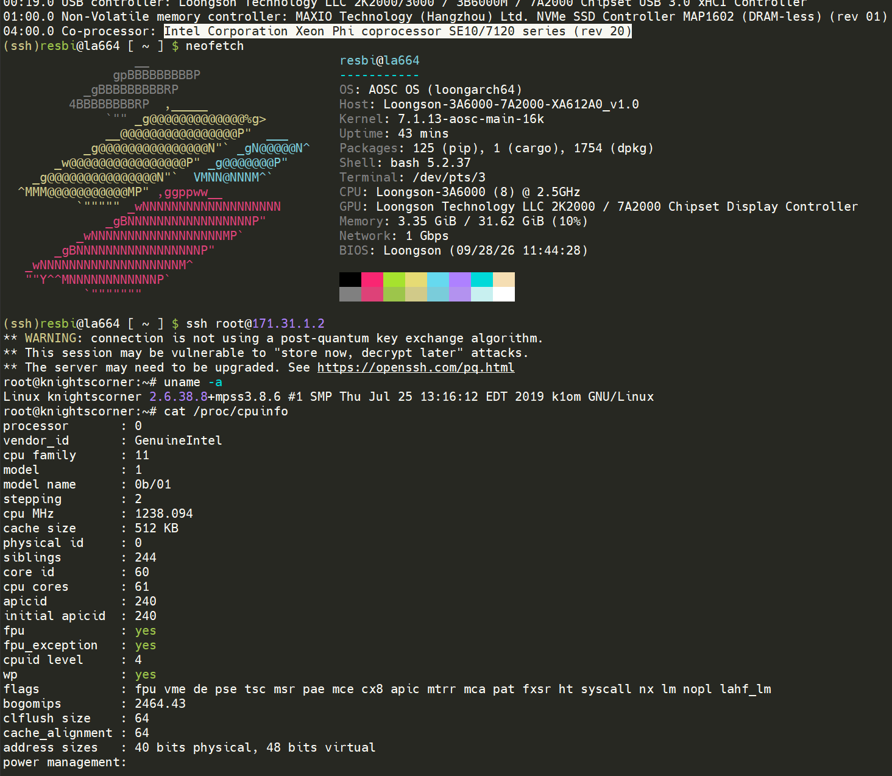

# MPSS 3.8.6 主机侧工具端 · LoongArch 移植版 v0.1

　　这份发布版把 Intel MPSS 3.8.6 的**主机侧工具端**移植到龙芯（loongarch64）。每个包一个目录，各自 `make install` 即可；包与包之间只有「先装库、后装用它编的程序」这一条依赖顺序，没有别的手工步骤。

　　实测环境：AOSC OS 13.3.1、内核 `7.1.13-aosc-main-16k`、gcc 15.3.0、glibc 2.42、Python 3.14、systemd 259，卡为 Xeon Phi 7120P（`8086:225c`）。移植过程、逐条改动与真机验收记录见随附报告的第四、六、八章与附录 E。



　　上图是实测那台机器：上半屏 `lspci` 认出 `04:00.0 Co-processor: Intel Corporation Xeon Phi coprocessor SE10/7120 series`，主机为龙芯 3A6000（AOSC OS，内核 `7.1.13-aosc-main-16k`，32 GiB 内存）；下半屏是 `ssh root@<card-ip>` 登录卡内，`uname -a` 显示卡上内核 `2.6.38.8+mpss3.8.6`（k1om 架构），`/proc/cpuinfo` 显示 61 个核心。这张图概括了整条链路：龙芯主机 → PCIe 上的 Xeon Phi → 卡内的 Linux。

---

## 客户端支持矩阵（原生 Intel Xeon Phi 的用法 → 本移植的现状）

　　「已支持」一列：✅ 已在真机验收（阶段号见[附录 J](docs/J-acceptance-tests_CN.md)）／❌ 尚未迁移或未验证。备注一列说明**用法是否与原生平台（x86_64 MPSS 工具链）一致**：标「一致」表示客户端代码无需改动；标「等价」表示用法有差异，但已提供**同等价值的 API/中间层**（或明确的替代写法）。

| 客户端项目 | 已支持 | 备注 |
|---|:---:|---|
| 内核模块加载（`modprobe mic`、`mpssd` 起服务） | ✅ | **一致**：`make install` + `modprobe`，已装 udev 权限规则让普通用户可用（T0/T1） |
| 卡引导与上线（`micctrl -b`、卡进 `online`） | ✅ | **一致**：与原生同样的 `micctrl` 流程（T1） |
| 管理工具（`micctrl`／`miccheck`／`mpssinfo`／`mpssflash`／`mpssd`） | ✅ | **一致**：命令与输出格式保持原样（T0/T1） |
| 图形管理界面（`micsmc` GUI） | ❌ | 只编译未运行验证；如需使用请先按[附录 E](docs/E-porting-patches_CN.md) 复核依赖 |
| 宿主用户态 SCIF 库（`libscif`） | ✅ | **一致**：`scif_*` 27 个 API 语义不变（T3；规则见[附录 L](docs/L-api-determinism-rules_CN.md)） |
| 宿主 COI 库（`libcoi_host`）与卡端 `coi_daemon` | ✅ | **等价**：进程/流水线/事件 API 一致；**大缓冲 `COIBufferCreate` 在本移植不可用**（`COI_OUT_OF_MEMORY`），改用「小参数进 + 卡端自分配」模式（T5/T6/T7） |
| 卡端 SSH 登录与部署 | ✅ | **一致**：`ssh mic0`、`scp` 投送、卡端执行（T2） |
| 宿主 ↔ 卡共享内存式 RMA（`scif_register`/`writeto`） | ✅ | **一致**：API 不变；新增窗口/单次长度约束（窗口 ≤1 MiB、单次 ≤1 MiB），见[附录 K](docs/K-offload-memory-rules_CN.md) |
| COI 端到端 offload（建进程 → 跑卡端函数 → 取回结果） | ✅ | **等价**：与原生相同的 COI 调用序列（T5），示例见[附录 F](docs/F-coi-and-openmp_CN.md) |
| `#pragma offload target(mic)`（Intel LEO 语法） | ✅ | **等价**：源级语法不变；宿主侧需自建 `libgomp`/`liboffloadmic` 运行库并配 k1om 交叉工具链（[附录 H](docs/H-offload-field-notes_CN.md)、[F](docs/F-coi-and-openmp_CN.md)） |
| 卡端 OpenMP（`libgomp` on KNC） | ✅ | **等价**：`omp_set_num_threads(240)` 等用法一致；卡端 kernel 的**优化档需逐源码实测**（附录 J 第 2 条） |
| k1om 交叉编译（`k1om-mpss-linux-gcc`、`-mmic` 目标） | ✅ | **一致**：用 Intel 原厂 k1om 工具链；注意须自行搭建 sysroot（附录 H） |
| 卡镜像定制（initramfs 重制、`09-boot-images`） | ✅ | **一致**：与原生相同的 cpio/镜像流程（[附录 E](docs/E-porting-patches_CN.md)） |
| `mic0` 宿主网口自动就绪 | ✅ | **一致**：开机自动 up（提交 `9b6d9e6`） |
| 卡端内核模块（卡上的 `micscif.ko`） | ✅ | **一致**：沿用原厂模块即可；**重建路径存在工具链障碍**，已记为可选方案（[附录 K](docs/K-offload-memory-rules_CN.md) K.6） |
| 非 root 使用（设备权限、`RLIMIT_MEMLOCK`） | ✅ | **一致**：`/dev/mic/scif` 0666 + udev 规则（T1）；pin 上限仍受 `ulimit -l` 约束 |
| 宿主页大小适配（4/16/64 KiB 内核） | ✅ | **等价**：对 4 KiB 宿主退化为原生行为；16 KiB 为本机实测（[附录 M](docs/M-portability-and-compatibility_CN.md)） |
| OpenCL（卡端 OpenCL 运行时） | ❌ | 未迁移：MPSS 的 OpenCL 运行时为 x86_64 二进制，需另行移植 |
| Intel MPI / `mic` 专用 MPI 栈 | ❌ | 未迁移 |
| 调试器（`gdb`/`gdbserver` 的 MIC 支持、`mpss` 调试工具） | ❌ | 未验证 |
| 虚拟以太网（`micveth`）与 IB/OFI 传输路径 | ❌ | 模块内有代码但未验收；当前 all-SCIF 路径已满足 offload 需求 |

　　说明：本表的"已支持"只以**真机验收**为准（T0–T8 与 `tests/extra`），未跑过的项目一律标 ❌，避免把"能编译"当成"能用"。

---


## 版权与许可

　　**上游部分。** 本发布版包含的 MPSS 3.8.6 源码、卡端引导镜像与文档，Copyright (C) Intel Corporation，版权归 Intel Corporation 所有，按 Intel 随包提供的许可证分发。各包根目录下的 `COPYING`、`COPYING.LIB`、`COPYING.BSD`、`COPYING.LGPL` 等文件即为对应许可证原文，请以那些文件为准。主机内核模块 `mic.ko` 及其源码按 GPL-2.0 分发。

　　**移植与打包部分。** 为使上述代码在 loongarch64 与当代工具链上可用而做的修改、发布版的组织方式（各包的包装 Makefile、`00-build-tools` 下的辅助工具、本说明文件），Copyright (C) 2026 LoongArch 移植版贡献者，版权归 LoongArch 移植版的贡献者所有，采用与所修改文件原有许可证相同的条款发布。

　　**商标。** Intel、Xeon Phi、Many Integrated Core（MIC）、Knights Corner 是 Intel Corporation 的商标或注册商标。本项目与 Intel 无隶属关系，也未获其背书或支持。

## 免责声明

　　本发布版按「现状」提供，不附带任何明示或默示的担保，包括但不限于对适销性、特定用途适用性与不侵权的担保。使用者自行承担使用风险。

　　需要特别说明的几点：

1. **这是实验性移植，不是 Intel 的官方产品。** 上游 MPSS 3.8.6 发布于 2016 年，Intel 早已停止对 Xeon Phi（Knights Corner）系列及 MPSS 的支持。本移植只做了「让它在龙芯与当代内核／工具链上跑起来」所必需的改动，未做安全性加固，也未做完整性审计。
2. **可能损坏硬件或数据。** 本发布版包含主机内核模块与卡端引导镜像，涉及 PCIe 设备复位、DMA 与卡上固件交互。误用（例如在不适配的硬件上加载模块、写入不匹配的引导镜像、对卡进行 flash 操作）可能导致设备或数据损坏。请在非生产环境先行验证并做好备份。
3. **验证范围有限。** 全部实测只在一台机器上完成（见上文环境），覆盖 `micctrl`、`mpssd`、`mpssinfo`、`mpssflash`、`miccheck`、COI、MYO 与内核模块的基本工作路径，**未覆盖**多卡、大规模 MPI 作业、长时间满载、电源管理与热插拔等场景。
4. **版本匹配由使用者负责。** 发布版中的卡端镜像、`miccheck` 内的 flash／SMC 版本号等都是按实测那台卡填写的常量，换卡后需按实际值重新构建。
5. **不承担任何间接损失。** 在适用法律允许的最大范围内，作者与贡献者对因使用本发布版而产生的任何直接、间接、偶然、特殊或后果性损害不承担责任。

　　若不同意上述条款，请不要使用本发布版。

## 关于本次移植适配

　　本次移植适配工作由 **DeepSeek-V4.1 Flash** 辅助完成：包括上游代码在 loongarch64 上的构建诊断与修补、内核接口漂移的比对与改写、卡端 initramfs 的改制、真机验收脚本的编写与执行，以及随附报告中实测数据的整理与撰写。所有改动的判定与验收均以真机运行结果为准（能跑的命令、卡端 `mpssd` 日志、sysfs 读数），逐条记录见随附报告附录 E。

　　发布版的组织方式（各包包装 Makefile、`00-build-tools`、本说明文件）同样在该协助下完成。使用者仍应自行复核关键改动是否满足自身场景的要求。

---

## 仓库结构

　　本树就是发布到 GitHub 的项目根目录。除九个包之外，文档与验收测试也随树交付（它们不安装到系统，只放在树里）：

| 目录 | 内容 | 说明 |
|---|---|---|
| `00-build-tools` … `09-boot-images` | 九个包 | 见下一节的清单与安装顺序 |
| `docs/` | 技术报告（12 章 ＋ 附录 A–M）与《KNC offload 编程手册》 | 先读 `docs/README_CN.md`（文档导读与排版约定） |
| `tests/` | 验收测试套件 T0–T8 与两个辅助脚本 | 用法见 `tests/README_CN.md`；普通用户即可运行，路径全部可自动探测或按 `tests/config.sh` 覆盖 |
| `images/` | 本文档用到的图片 | — |
| `CHANGELOG_CN.md`、`CHANGELOG.md` | 总项目变更记录（按日期，最新在最尾端） | 细节在各子项目的 CHANGELOG |
| `08-mic-module/patches/` | 下一次发布要并入模块源码树的改动文件 | 见该目录下的 README |

　　每个子项目（九个包、`docs/`、`tests/`）各有一份 `CHANGELOG_CN.md` 与对应的英文版 `CHANGELOG.md`，以「一项功能更新」为单位、由旧到新排列，便于持续增编。

　　**文档成对交付**：中文版文件名以 `_CN.md` 结尾，英文版是去掉 `_CN` 的同名文件（例如 `docs/README_CN.md` 与 `docs/README_CN.md`、`docs/08-migration-roadmap_CN.md` 与 `docs/08-migration-roadmap.md`）。正文里的相互引用一律指向同一语言的版本。

---

## 一、包清单与安装顺序

| 顺序 | 目录 | 内容 | 装到哪里 | 依赖 |
|---|---|---|---|---|
| 0 | `00-build-tools` | 构建辅助：`gen-symver-map`（Py3 版）、`gen-defsym.py`、`mpss-metadata` | 无需安装，供其它包调用 | — |
| 1 | `02-libscif` | 用户态 SCIF 库 `libscif.so` + `scif.h` / `scif_ioctl.h` | `/usr/lib64`、`/usr/include` | 00 |
| 2 | `03-mpss-daemon` | `libmpssconfig.so`、主机守护进程 `mpssd`、管理 CLI `micctrl`（setuid root） | `/usr/lib64`、`/usr/sbin`、`/usr/include/mic` | 02 |
| 3 | `04-mpss-micmgmt` | `libmicmgmt.so`、`mpssinfo`、`mpssflash`、`micsmc` | `/usr/lib64`、`/usr/bin`、`/usr/include` | 02 |
| 4 | `05-miccheck` | 自检工具 `miccheck`（Python 3 版） | `/usr/bin`、`/usr/src/miccheck` | 04 |
| 5 | `06-mpss-coi` | offload 库 `libcoi_host.so`（公开 ABI 名 `@@COI_1.0`） | `/usr/lib64`、`/usr/include/intel-coi` | 02 |
| 6 | `07-mpss-myo` | offload 库 `libmyo-client.so`（公开 ABI 名 `@@MYO_1.0`） | `/usr/lib64`、`/usr/include` | 02 |
| 7 | `08-mic-module` | 主机内核模块 `mic.ko` + modprobe/udev 配置 + 内核头 | `/lib/modules/$(uname -r)`、`/etc`、`/usr/include/mic` | — |
| 8 | `09-boot-images` | 卡端引导镜像 `bzImage-knightscorner`、`initramfs-knightscorner.cpio.gz` | `/usr/share/mpss/boot` | — |
| — | `docs/` | 技术报告与《KNC offload 编程手册》 | 不安装（随树交付） | — |
| — | `tests/` | 验收测试套件（T0–T8 ＋ 两个辅助脚本） | 不安装（随树交付） | 02–09 |

## 二、逐包安装

　　每个包目录里有两个 Makefile：`Makefile.mpss` 是上游原始文件（已含移植补丁），`Makefile` 是本发布版的包装（构建 + 按 MPSS 期望的路径安装）。**主用法就是进目录执行 `make install`**：

```bash
cd 02-libscif      && sudo make install
cd ../03-mpss-daemon && sudo make install
cd ../04-mpss-micmgmt && sudo make install
cd ../05-miccheck  && sudo make install
cd ../06-mpss-coi  && sudo make install
cd ../07-mpss-myo  && sudo make install
cd ../08-mic-module && sudo make install
cd ../09-boot-images && sudo make install
```

　　三条通用规则：

- **暂存安装**：任何包都支持 `make install DESTDIR=/tmp/stage`，此时不会运行 `ldconfig`/`depmod`，也不需要 root。
- **改安装前缀**：`make install PREFIX=/usr/local`（默认 `/usr`）。注意 `micctrl` 会装成 setuid root，`DESTDIR` 与 `PREFIX` 的组合要自己保证合理。
- **内核模块包**需要内核头文件：默认取 `/lib/modules/$(uname -r)/build`，可用 `make install KERNEL_SRC=...` 指定。
- **建议两步走**：先以普通用户 `make`，再 `sudo make install`。直接 `sudo make install` 会以 root 身份完成构建，在源码树里留下 root 属主的目标文件；之后若再以普通用户重新构建，会因写不进去而报 `Permission denied`（表现为 `can't create objs/xxx.o`），此时先 `sudo make clean` 或 `sudo chown -R $USER .` 即可。

　　顶层还有一个便利 `Makefile`，按上表顺序一次装完（`sudo make install`，约 150 秒）；调试单包时仍建议逐个安装。

## 三、装完之后

### 3.1 加载内核模块

　　`mic.ko` **开机自动加载**，两条路都铺好了：

- `/etc/modules-load.d/mic.conf`（内容一行 `mic`）—— 由 `systemd-modules-load.service` 在启动早期读取；
- 驱动声明了 `MODULE_DEVICE_TABLE(pci, …)`，`modinfo mic` 因此会导出 `pci:v00008086d0000225C…` 这类 modalias，udev 在设备出现时也会自动 `modprobe`。

　　插卡后确认一次即可：

```bash
lsmod | grep '^mic'              # 应看到 mic
cat /sys/class/mic/mic0/state    # ready / booting / online
```

　　刚装完还没重启、想立刻用：`sudo modprobe mic`。

### 3.2 生成配置与卡镜像目录

```bash
sudo micctrl --initdefaults
```

　　这一步会在 `/etc/mpss/` 生成 `mic0.conf`，在 `/var/mpss/mic0/` 生成卡端文件系统目录（MicDir），里面已经包含 `etc/passwd`（主机普通用户会被合并进去）、`etc/network/interfaces`（卡端网口）、`etc/ssh` 主机密钥、各用户 `.ssh/authorized_keys`。

### 3.3 按本机情况改两行

```bash
sudo sed -i 's|^Network .*|Network class=StaticPair micip=<card-ip> hostip=<host-ip> netbits=24 modhost=no modcard=yes mtu=64512|' /etc/mpss/mic0.conf
sudo sed -i 's|^BootOnStart .*|BootOnStart Enabled|' /etc/mpss/mic0.conf
```

　　`modhost=no` 表示主机侧网口由你自己配（推荐，避免 MPSS 去改发行版的网络配置）；`modcard=yes` 表示卡端网络配置由 MPSS 写进 MicDir。IP 按你的实际网段改。

### 3.4 起守护进程

　　单元随 `03-mpss-daemon` 一起安装到 `/usr/lib/systemd/system/mpss.service`，安装时自动执行 `systemctl daemon-reload` 与 `systemctl enable mpss`（内核模块已加载的话还会顺手把服务拉起来），所以**正常不需要手写单元**。确认一下即可：

```bash
systemctl status mpss
```

　　单元内容如下，供参考。关键点是 `Type=simple` —— **不能用 `Type=forking`**：`mpssd` 默认会 fork，然后父进程调用 `pause()` 永不退出（`mpssd/mpssd.c` 的 `main`），用 `forking` 时 systemd 会一直等 PIDFile、最终报 `start operation timed out`。`-l` 让它留在前台、日志进 journal，正好配合 `simple`：

```ini
[Unit]
Description=Intel(R) MPSS control service (LoongArch port)
After=network.target
Wants=systemd-modules-load.service

[Service]
Type=simple
ExecStartPre=-/usr/sbin/modprobe mic
ExecStart=/usr/sbin/mpssd -l
Restart=no
TimeoutSec=60

[Install]
WantedBy=multi-user.target
```

　　若 `/etc/systemd/system/mpss.service` 已存在（例如早先手工建的），它会**覆盖**随包的那份；想统一来源就删掉手工那份再 `systemctl daemon-reload`。不用 systemd 时直接 `sudo /usr/sbin/mpssd -l &` 亦可（`-l` 是前台、日志到屏幕）。

### 3.5 主机侧网口：谁负责 up 与配地址

　　这里要分清两件事：

- **创建 `mic0`**：由主机内核模块 `mic.ko` 完成 —— 卡上的 virtio-net 设备一出现，驱动就把这个网口建出来。这一步是自动的，所以 `mic0` 会自己出现（但默认是 DOWN、没有地址）。
- **把网口 up 起来并配 IP**：不是驱动的事。MPSS 侧对应 `mic0.conf` 里 `Network` 行的 `modhost=` —— `modhost=yes` 时它去改**主机**的网络配置（Debian 的 `/etc/network/interfaces`，或 Red Hat 的 `ifcfg-*`）；AOSC 这类发行版没有那些文件，所以本发布版按 `modhost=no` 给出配套方案。

　　随 `08-mic-module` 安装的 `mic0-net.service` 与 `/usr/libexec/mpss/mic0-up.sh` 就干这件事：`mic0` 一出现（由设备单元 `sys-subsystem-net-devices-mic0.device` 或 udev 规则触发），脚本就把地址与 MTU 从 `/etc/mpss/mic0.conf` 的 `Network` 行读出来配上 —— 保持与 MPSS 配置单一来源，不另设一份。安装时已自动 enable，也可以手工执行：

```bash
sudo /usr/libexec/mpss/mic0-up.sh --dry-run   # 先看它要做什么（只打印，不动网络）
sudo /usr/libexec/mpss/mic0-up.sh             # 真正配置
ip -br addr show mic0                         # 期望：UP 且带 <host-ip>/24
```

　　若更愿意交给 NetworkManager（AOSC 默认用它），先禁掉上面那个单元、再建连接 —— 两者同时配会互相覆盖：

```bash
sudo systemctl disable --now mic0-net.service
sudo nmcli connection add type ethernet ifname mic0 con-name mic0 \
     ipv4.method manual ipv4.addresses <host-ip>/24 ipv6.method disabled
sudo nmcli connection up mic0
```

## 四、验证

```bash
micctrl --status                 # 期望：mic0: online (mode: linux image: ...)
mpssinfo                         # 读卡的 SKU／序列号／核数／温度／Flash 版本等
miccheck                         # 自检；全绿时输出 Status: OK
sudo miccheck                    # 想看全绿就用 root 跑：其中「ras daemon 可用」一项走 SCIF，
                                 # 需要打开 root 独占的 /dev/mic/scif，普通用户会看到该项 fail
ssh root@<card-ip>              # 卡的地址；卡端镜像已含授权密钥
```

　　用 MPSS 自己的工具在卡上建用户并注入密钥（这是 `micctrl` 的完整管理路径，控制器经 SCIF 与卡上 `mpssd` 通信）：

```bash
sudo micctrl --useradd=<用户名>   # 主机侧 MicDir 与运行中的卡同时生效
```

　　验收点：卡端 `/var/log/mpssd` 出现 `[UserAdd] '<用户名>' Success`，随后可用该用户 `ssh` 进卡。

## 五、这份移植版改了什么

　　上游 2016 年的代码在今天的工具链上有两类问题：**架构耦合**（x86 内联汇编、SSE2）与**工具链变严**（新 binutils 对 `.symver` 的限制、GCC 10 的 `-fno-common`、GCC 14 把隐式函数声明与指针类型不兼容升为错误）。逐条改动与位置见随附报告附录 E，要点：

| 包 | 主要改动 |
|---|---|
| `03-mpss-daemon` | 发行版探测补 AOSC／LoongArch 分支（否则环境初始化直接失败）；修 `parse_shadow` 里原代码自带的未定义行为（`*lastd[1]` 应为 `(*lastd)[1]`，在 x86 上碰巧不炸）；`getcwd() < 0` 改 `== NULL`；卡端 SSH 主机密钥由 `rsa1`/`dsa` 改为 `ed25519`/`rsa`/`ecdsa` |
| `04-mpss-micmgmt` | 去掉 `inline` 伪声明（只声明不定义，GCC 14 起是错误）；覆盖 `EXTRA_CFLAGS` 里的 `-Werror` |
| `05-miccheck` | Python 2 → 3（`except X, e:`、shebang、`communicate()` 返回 bytes、`create_string_buffer().value` 是 bytes）；外部命令路径写死 `/sbin/…` 时回退查 PATH |
| `06-mpss-coi` | 构建分支补 `WHAT_loongarch64 := HOST`；`cpuid`／`rdtsc` 换成等价实现（`sched_getcpu()`／`CLOCK_MONOTONIC`）；非 x86 不发射 `.symver`，公开 ABI 名改由链接期别名生成 |
| `07-mpss-myo` | `INTEL64` 推导补龙芯；`rdtsc` 换单调时钟；`lock; xaddl` 换 `__atomic_add_fetch`；`popcount32`/`nlz32` 无条件定义；信号上下文里的 x86 `REG_ERR` 按「写」处理；SSE2 差分层改用源码自带的标量回退（`-DMYOI_DIFF_I64`） |
| `08-mic-module` | 沿用随附报告第三、六章记录的内核模块移植（`MAX_ORDER`、`del_timer_sync`、`from_timer`、`get_user_pages`、`tty_alloc_driver` 等一批接口更新） |
| `09-boot-images` | 卡端 initramfs 已补 `auto mic0` 静态网口配置与授权密钥（原交付里没有，MPSS 正常流程是由主机侧 `mpssd` 下发的） |

　　上表之外还有一处与**宿主页大小**有关的驱动修复，它不属于「工具链变严」这一类，而是移植到非 4 KiB 页宿主后暴露出来的：用户态按 4096 字节注册被驱动静默拒绝、`packed` 结构里内嵌等待队列导致自旋锁落在非对齐地址、RMA 拷贝按页步长算错导致只有第一页正确。改动文件在 `08-mic-module/patches/`（下一次发布并入模块源码树），判据与实测见 `docs/I-page-size-alignment_CN.md` 与 `08-mic-module/CHANGELOG_CN.md`。

## 六、已知问题与注意事项

1. **特权边界**：读 sysfs 的功能（设备枚举、SKU、POST 码、Family/Model）普通用户即可；走 SCIF 的功能（序列号、UUID、显存/核心信息、温度、RAS）要先打开 `/dev/mic/scif`，该设备默认 `crw------- root root`。这也是 `micctrl` 装成 setuid root 的原因。
2. **卡端 mpssd 的握手时序**：卡端 `mpssd` 启动时先连主机 mpssd 的 160 端口发 `MONITOR_START`，**只有握手成功后才创建监听端口 164 的线程**。所以主机 `mpssd` 必须在卡端启动那一刻正在运行；若卡是先于 mpssd 手工引导的，在主机 mpssd 运行后重启一次卡端 mpssd 即可补上。不补的后果是所有走 164 端口的操作（如 `micctrl --useradd`）会连到不存在的监听者。
3. **失败的 SCIF 连接会在内核里无限重试**：`micscif/micscif_api.c` 的连接等待循环在对端不应答且设备仍存活时会 `goto retry`，进程不返回用户态，`SIGTERM`／`SIGKILL` 都无法终止；只能靠重置卡或卸载模块让它退出。这是上游代码的行为，未在移植中修改。
4. **`System.map` 是占位空文件**：没有卡内核的符号表，`mpssd` 会打一条 `mmap of System.map failed` 告警，不影响引导。
5. **手册页**：`.1`／`.3` 等 man 页需要 `a2x`（asciidoc）生成，包装 Makefile 不构建它们。
7. **主机内核升级后必须重编 `mic.ko`**：模块与内核版本绑定（`vermagic` 与符号 CRC），换了内核旧模块不会加载。重新构建并安装即可：

```bash
cd 08-mic-module && make clean && sudo make install
```

　　它会自动装到新内核的 `/lib/modules/$(uname -r)/updates/` 并跑 `depmod`；`/etc/modules-load.d`、`modprobe.d`、udev 规则与内核版本无关，无需重做。新内核若又改了驱动用到的接口，`make` 会报编译错误，需按报错再补一处移植补丁（本版是按 7.1.13 改过的）。

6. **`05-miccheck` 的版本号是构建期常量**：`make` 时通过 `MPSS_FLASH_VERSION`／`SMC_FW_VERSION` 写入；默认值取自实测的卡（flash `391`、SMC `1.17.6900`）。换卡后如自检报版本不匹配，用新的值重跑 `make install` 即可。
8. **offload 的两条实测限制**（写入《KNC offload 编程手册》的对应章节）：`COIBufferCreate` 在本移植链上返回 `COI_OUT_OF_MEMORY(13)`，因此大数据走「入参区 ＋ 返回区 ＋ 卡端自行生成」；卡端程序的优化档需**逐源码实测**（有的源码在 `-O1`／`-O2` 下会在卡上崩，`-O0` 正常）。

## 七、卸载

　　各包的产物路径都在上面第一节的表里，删除对应文件即可；内核模块用 `sudo rm -rf /lib/modules/$(uname -r)/extra/mic.ko*`（或 `updates/`，取决于内核版本）并 `sudo depmod -a`。
