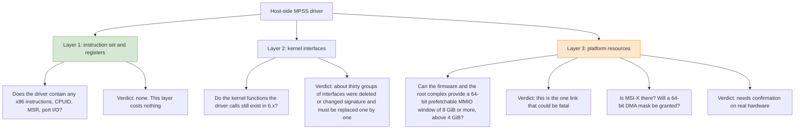
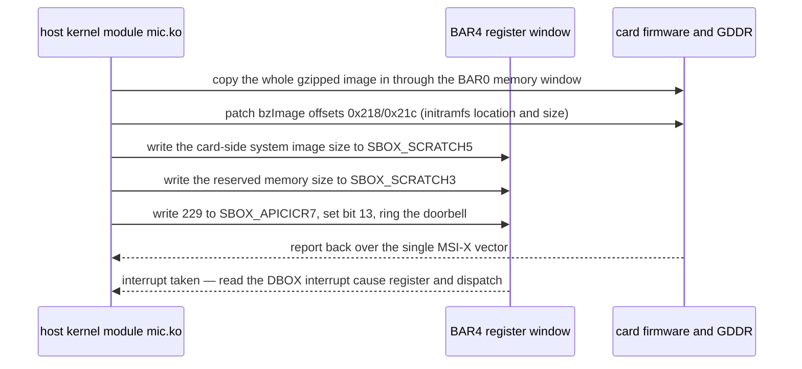

# Chapter 1 — Origins of the Task, Audit Scope, and Overall Verdict

> This chapter sets out the starting point of the audit, the first-hand material it draws on, and the final verdict. The chapters that follow lay out the evidence area by area.
> Reading conventions and the glossary are in [README](README.md).

---

## 1.1 What This Is Actually About

The Intel Xeon Phi X100 series (core codename Knights Corner, internal codename K1OM, "KNC" below) is a many-core accelerator card that sits in a host PCIe slot. The card has a complete processor of its own — an x86 variant — along with its own GDDR memory, its own SPI flash, and a card-side Linux system burned into that flash. To use the card, the host machine must first push the card-side system down over PCIe and then wake it up; from then on the card-side system and the host system coexist and talk to each other over PCIe.

The software that does all this is Intel's MPSS (Manycore Platform Software Stack), version 3.8.6. It has three parts:

| Part | Code location | Runs where | Port needed? |
|---|---|---|---|
| Host-side kernel module | `mpss-modules/host/`, `mpss-modules/dma/`, `mpss-modules/micscif/` (part) | Host kernel space | **Yes** (the main subject of this audit) |
| Host-side user space | `mpss-daemon`, `mpss-micmgmt`, `micctrl`/`mpssd`, `libscif` | Host user space | **Yes**, but only a rebuild |
| Card-side kernel and user space | `mpss-modules/{dma,micscif,pm_scif,ras,vcons,vnet,mpssboot,ramoops,virtio}`, `mpss-myo`, `mpss-coi` | K1OM on the card | **No** |

The table itself already makes the key point of this audit: all the real work falls on the host side, and not one line of the card's 20,000-odd lines has to change.

---

## 1.2 What "Port It to Loongson" Actually Means Technically

Compared with the original x86-64 host, the Loongson platform (LoongArch, New World, kernel 6.x) differs in three layers. Each layer has to be judged on its own; there is no useful blanket answer to "can it be ported".



The difficulty of the three layers is **inverted**:

- Layer 1 (instruction set) = zero work. The host-side driver contains not one x86-specific instruction; it talks to the card purely by reading and writing 32-bit registers in mapped memory. On Loongson, `readl`/`writel` mean exactly the same thing and the byte order is little-endian on both sides, so not a byte of assembly has to change.
- Layer 2 (kernel interfaces) = grunt work. This is debt run up by crossing ten-odd major kernel versions from 3.10 to 6.x, but every item has a definite replacement.
- Layer 3 (platform resources) = a matter of luck. What the KNC card needs is **a 64-bit prefetchable memory window 8 GiB in size at an address above 4 GiB** (this is stated in black and white in Intel's User's Guide [UG p.31]). The window is reserved by the firmware and carved up by Linux's PCI resource allocator. Whether the Loongson platform's firmware can give up a hole that large is something I have no real machine to test, so I can only give criteria and a method of verification.

---

## 1.3 Materials

This audit rests on the following first-hand material, all of it available locally and open to re-checking:

| Material | Contents | Used in the report for |
|---|---|---|
| `mpss-modules-3.8.6/` | Intel's original host + card-side kernel code, 104 `.c`/`.h` files totalling 65,811 lines (124 files in the whole tree) | the subject of the audit in Chapters 3 and 5, and of the inventory in Appendix B |
| `mpss-modules-4.18.0-240.el8.x86_64.patch` | the community's complete patch taking the driver from 3.10 to 4.18, 2,372 lines | Chapter 6's historical evidence that "change it version by version" works, and how long that road is |
| `mpss-main/mpss-main/mpss3/` | the complete working tree already brought to RHEL 8 (4.18) | compared line by line against the original to bound the real change volume |
| MPSS User's Guide, Rev 3.8, 214 pages | Intel's official user's guide | platform requirements, the sysfs contract, boot parameters, troubleshooting |
| KNC ISA Reference Manual | the card's instruction-set manual | Chapter 2: defining what the card itself is responsible for |
| `mpss-daemon` / `mpss-micmgmt` sources | all the host user-space C code | Chapter 4 |

---

## 1.4 Overall Verdict

The conclusion up front: **this driver can be ported to the Loongson New World kernel 6.x, and the effort is small-to-moderate; but a successful port is not the same as a working system — whether it works depends on whether the Loongson firmware can hand out an 8 GiB 64-bit prefetchable memory window.**

Broken down:

### (1) The kernel module itself: confirmed portable

`mic.ko` is a single module, about 30 object files on the host side. Everything it does with hardware comes down to three things:

1. copying the card's kernel image into card memory through the BAR0 memory window, with the CPU doing the copying;
2. controlling the card through the BAR4 register window, which starts at 128 KB (writing a few registers in the SBOX, one of which acts as the doorbell);
3. taking one interrupt.

None of these three has anything to do with what architecture the host is. Loading the `bzImage`, patching the initramfs address and length back into the boot protocol, writing the image size into a SBOX scratch register, and finally writing interrupt vector 229 into the APIC ICR shadow register — all of that is a protocol Intel fixed in the card's firmware, and changing the host architecture does not affect it.



### (2) Kernel API debt: enumerable, and it can be driven to zero

The community has already taken the same code from 3.10 to 4.18, with changes in 23 files and under 300 lines of real driver change (the rest is newly added network scripts). That proves that "rewrite it item by item, version by version" is a method that works. 4.18 to 6.x needs another round, and a few points in this round are **heavier in kind**:

- **Pure renames**: one-line renames such as `ioremap_nocache()`; table (a) in Chapter 6 counts them as 64 mechanical changes;
- **Interfaces that changed shape**: `get_user_pages()` lost parameters, `wait_queue_t` went from a function to a struct, `mm->pinned_vm` went from `unsigned long` to `atomic64_t` — 22 lines in all, each of which has to be rewritten against the new signature;
- **Semantics that no longer hold**: `PAGE_SIZE` treated as a protocol constant (Chapter 5, F3), `slow_virt_to_phys()` being a symbol only x86 kernels provide (F7), plus the assumption running through the whole driver that the host has no IOMMU (F5) — these three cannot be settled by a change of phrasing;
- the `sysfs_get_dirent()` family was once taken for an RHEL-private symbol; checking it line by line this round showed that to be a misreading — mainline 6.6 still provides these inline wrappers unconditionally at `v6.6/include/linux/sysfs.h:638`–`:658`, so **this item needs zero changes**;
- `vmcore.c` (the card crash dump) depends on more kernel internals than anything else and is **the single riskiest file**; the recommendation is to downgrade or temporarily remove it during the port.

### (3) Platform resources: the one condition that could veto the whole project

Intel's User's Guide, page 31, verbatim:

> BIOS and OS support for large (8GB+) Memory Mapped I/O Base Address Registers (MMIO BAR's) above the 4GB address limit must be enabled. [UG p.31]

The `lspci` evidence the User's Guide gives is:

```
Region 0: Memory at 3c7e00000000 (64-bit, prefetchable) [size=200000000]
Region 4: Memory at ec000000 (64-bit, non-prefetchable) [size=128K]
```

`0x200000000` is 8 GiB. That means the host machine must:

1. carve out an MMIO hole **8 GiB in size, contiguous and 8 GiB-aligned**, above 4 GiB;
2. have the firmware **tell the kernel truthfully**, through ACPI or the device tree, that this hole is available;
3. have Linux's PCI resource allocator willing to hand a chunk that large to BAR0.

Items 1 and 2 fall to the Loongson firmware (the PCIe root complex window description in the UEFI firmware); the kernel cannot conjure them up by itself. Item 3 is fine as long as the first two hold.

One more thing to note: the driver **does not hard-code the size of BAR0**. At probe time it reads the values live with `pci_resource_start()` and `pci_resource_len()` (`host/linux.c:290`–`:291`, `:299`–`:300`), uses the length it read directly as the length for `ioremap_wc()` (`host/uos_download.c:1156`), and bounds-checks before taking the window (`host/tools_support.c:165`). It even equates "memory available on the card" with the window length — in `host/uos_download.c:592`–`:594`, `boot_mem` is simply `aper.len >> 20` MiB, clamped down against any existing value. So when the window shrinks the driver does not miscalculate and corrupt memory; the price is that memory available on the card shrinks with it. But how small the window can get before the card-side system can no longer be pushed down is something only the sizes reported by a real machine can answer — which is exactly why Chapter 7 §7.11 singles out P0-A as "could veto the whole project".

### (4) The rest of the platform conditions: all look good

| Condition | On x86-64 | Verdict on Loongson New World |
|---|---|---|
| 64-bit DMA | `pci_set_dma_mask(DMA_BIT_MASK(64))` | Loongson is a pure 64-bit platform, so it should be there |
| IOMMU | on x86, enabling DMAR would affect the driver's path that uses physical addresses directly | a Loongson host currently has **no** usable IOMMU, which for this driver is **a good thing** — several places use page frame numbers directly as DMA addresses, and with no IOMMU that is correct |
| Byte order | little-endian | little-endian, matches |
| Page size | 4 KB is the default | **Mismatch**: the 64-bit Loongson kernel defaults to 16 KB (`v6.6/arch/loongarch/Kconfig:270`–`:273`), and 4 KB has to be selected explicitly. Because the host is built for 4 KB, the two hard-coded 4 KB values in F3/F4 remain merely a *potential* problem — see Chapter 7 §7.2 |
| MSI-X | supported, and the driver **has an INTx fallback branch** | needs support from a root complex such as the LS7A; even without it, the fallback is there |

---

## 1.5 Effort: Three Buckets First

The interface part of the bill has already been counted line by line in Chapter 6:

$$
86 \;=\; 64_{\text{mechanical}} \;+\; 22_{\text{semantic}}
$$

The 64 mechanical lines are substitutions site by site; each of the 22 semantic lines has to be judged before it can be written. This chapter gives only magnitudes; converting those magnitudes into person-day ranges is concentrated in Chapter 9:

| Part | Contents | Magnitude |
|---|---|---|
| Generational rewrite of kernel interfaces | the 62 version guards reach only as far as 4.2.0; each family was checked against the upstream headers and then counted line by line | 100–250 lines, of which 86 have been verified line by line (Chapter 6 §6.8) |
| Card crash dump | was once listed separately as a "single-point rewrite"; on checking, it turned out to be name collisions on symbols such as `read_from_oldmem` | 9 lines (nine places in `host/vmcore.c`) |
| Clearing the platform-resource path | the firmware side confirms or releases an 8 GiB MMIO window above 4 GiB; in-kernel `ioremap` of 8 GiB | days to weeks; this is **calendar time** waiting on the firmware side, not person-days |
| User space | all C and Python, rebuild it; card-side binaries such as `miccheck` need no changes | 1–3 person-days |
| Verification | needs a real machine (with a KNC card) to go from probe to running a SCIF/offload program end to end | cannot be skipped |

These items have different units and cannot simply be added together. Chapter 9 §9.4 converts them into person-days along Chapter 8's three scopes, giving three ranges: **Scope A 12–24 person-days, Scope B 15–30 person-days, Scope C 23–45 person-days**, excluding calendar time spent waiting on the firmware side and excluding long-term maintenance.

One point deserves special emphasis: **the firmware and microcode on the card neither need to be nor can be modified**. The card-side system is burned by Intel into the card's SPI flash; the driver only pushes it into GDDR and wakes it up. That means there is no "the firmware has to be rewritten too" risk in this port — but it also means **the card-side system is forever an x86 variant, K1OM, and cannot be verified locally**; it takes real hardware.

---

## 1.6 How This Report Is Organised

```mermaid
flowchart LR
    subgraph P1["Part 1: the facts"]
        C2["02 KNC hardware and firmware"]
        C3["03 Anatomy of the MPSS kernel module"]
        C4["04 The host user-space stack"]
    end
    subgraph P2["Part 2: the gaps"]
        C5["05 Instruction-set and architecture coupling audit"]
        C6["06 The kernel interface generational gap"]
        C7["07 Loongson platform adaptation"]
    end
    subgraph P3["Part 3: the plan"]
        C8["08 Staged porting roadmap"]
        C9["09 Effort and risk register"]
        C10["10 Alternatives"]
        C11["11 Verification and testing"]
        C12["12 Conclusion"]
    end
    P1 --> P2 --> P3
    APP["Appendix A interface contracts / B file inventory and code volume / C references / D manual cross-check"]
    P3 --> APP
```



Suggested reading paths:

- **If you only want the verdict**: §1.4 and §1.5 of this chapter, plus Chapter 12.
- **If you are going to do the work**: Chapter 3 for the module structure, Chapter 6 for the item-by-item interface mapping, Chapter 8 for the order of execution, Appendix A for the interface contracts.
- **If you are assessing feasibility**: Chapter 7 is the critical one; it decides whether the whole thing works.
- **If you want to check what the manual actually says**: Appendix D lines up the text extracted from the two PDFs against the citations in this chapter and in Chapter 7, and lists what the manual genuinely does not say.
- **If you are writing a briefing**: the alternatives comparison in Chapter 10 plus the risk register in Chapter 9.

---

## 1.7 Boundaries of Evidence That Must Be Stated

This audit is the product of **purely static code analysis plus documentary research**: not one file was compiled on a Loongson machine, and no KNC card was at hand. Therefore:

- every source-level conclusion can be re-checked item by item against the file names and line numbers the report gives;
- whether the Loongson firmware can give an 8 GiB MMIO hole, the details of LS7A MSI-X, whether Loongson has an IOMMU — on these I make no positive assertion; I give only criteria, query commands and verification methods (see Chapter 7 §7.5 and Chapter 11);
- the effort estimate takes Chapter 6's 86 line-by-line verified lines as its baseline and then merges them along Chapter 8's three scopes (Chapter 9 §9.4); it excludes calendar time spent waiting on hardware and on the firmware side.
