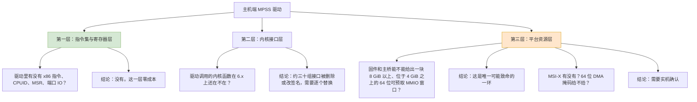
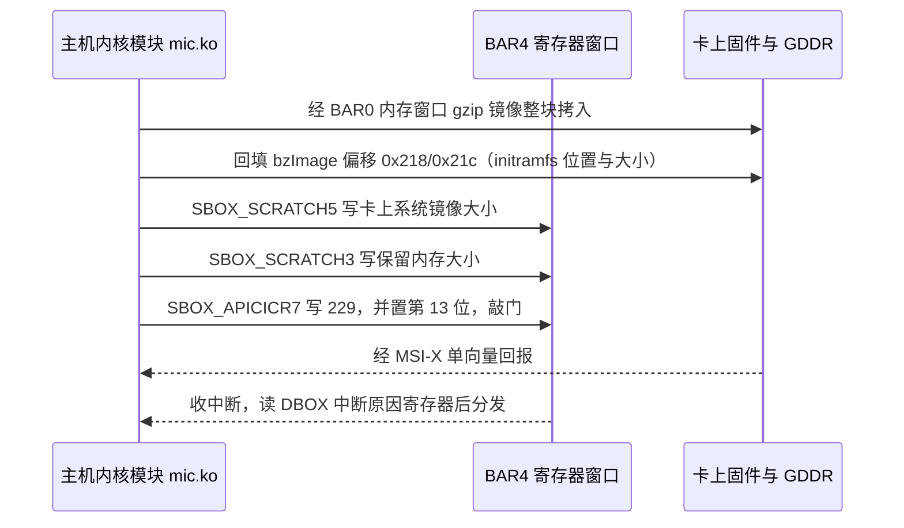

# 第一章　任务由来、审计范围与总判定

> 　本章交代这次审计的出发点、所用的第一手材料、以及最终判定。后面各章分别展开证据。
> 　阅读约定与术语表见 [README](README_CN.md)。

---

## 1.1　这件事到底要干什么

　　Intel Xeon Phi X100 系列（核心代号 Knights Corner，内部代号 K1OM，下文简称 KNC）是一张插在主机 PCIe 插槽里的众核加速卡。卡上有一颗完整的、但属于 x86 变种的处理器，卡上有自己的 GDDR 内存、自己的 SPI 闪存、以及闪存里烧好的那套卡上 Linux 系统。主机想用这张卡，必须先把卡上系统通过 PCIe 推下去、再叫醒它，从此卡上系统与主机系统并存，两边靠 PCIe 通信。

　　干这些事的软件就是 Intel 的 MPSS（Manycore Platform Software Stack，众核平台软件栈），版本 3.8.6。它包含三部分：

| 部分 | 代码位置 | 运行在哪 | 要移植吗 |
|---|---|---|---|
| 主机端内核模块 | `mpss-modules/host/`、`mpss-modules/dma/`、`mpss-modules/micscif/`（部分） | 主机内核态 | **要**（本次审计主体） |
| 主机端用户态 | `mpss-daemon`、`mpss-micmgmt`、`micctrl`/`mpssd`、`libscif` | 主机用户态 | **要**，但只需重新编译 |
| 卡端内核与用户态 | `mpss-modules/{dma,micscif,pm_scif,ras,vcons,vnet,mpssboot,ramoops,virtio}`、`mpss-myo`、`mpss-coi` | 卡上 K1OM | **不要** |

　　这张表本身已经说明了本次审计的关键：真正的工作量只落在主机端，而卡上那 2 万多行代码一行都不用动。

---

## 1.2　「移植到龙芯」这句话里，真正的技术含义

　　龙芯平台（LoongArch，新世界，内核 6.x）与原来的 x86-64 主机相比，差异可以分成三层，必须分层判断，不能笼统说「能不能移植」。



　　这三层的难度是**倒挂**的：

- 第一层（指令集）＝零工作。主机端驱动里没有任何一条 x86 专有指令，它跟卡说话全靠往映射好的内存里读写 32 位寄存器。换成龙芯，`readl`/`writel` 的语义完全一样，字节序都是小端，连一个字节的汇编都不用改。
- 第二层（内核接口）＝体力活。这是从 3.10 到 6.x 跨了十来个内核大版本造成的欠账，但每一项都有确定的替代写法。
- 第三层（平台资源）＝运气活。KNC 卡要的是**一块 8 GiB 大小、地址在 4 GiB 以上的 64 位可预取内存窗口**（这是 Intel 用户指南白纸黑字的要求 [UG p.31]）。这块窗口由固件预留、由 Linux 的 PCI 资源分配器切片分配。龙芯平台的固件给不给得了这么大的洞，我没有实机，只能给出判据和验证方法。

---

## 1.3　材料清单

　　本次审计建立在这些第一手材料上，全部在本地可查、可复核：

| 材料 | 内容 | 在报告里的用途 |
|---|---|---|
| `mpss-modules-3.8.6/` | Intel 原始主机＋卡端内核代码，104 个 `.c`/`.h` 共 65,811 行（整树 124 个文件） | 第三章、第五章的审计对象，附录 B 的清点对象 |
| `mpss-modules-4.18.0-240.el8.x86_64.patch` | 社区把驱动从 3.10 改到 4.18 的完整补丁，2,372 行 | 第六章的历史依据：证明「照着改」这条路走得通、且有多长 |
| `mpss-main/mpss-main/mpss3/` | 已改到 RHEL 8（4.18）的完整工作树 | 与原始版逐行对比，界定真实改动量 |
| MPSS User's Guide, Rev 3.8, 214 页 | Intel 官方用户指南 | 平台要求、sysfs 契约、引导参数、排障 |
| KNC ISA Reference Manual | 卡上指令集手册 | 第二章：界定卡自己负责什么 |
| `mpss-daemon` / `mpss-micmgmt` 源码 | 主机用户态全部 C 代码 | 第四章 |

---

## 1.4　总判定

　　结论先说：**这套驱动可以移植到龙芯新世界内核 6.x，工作量属于中等偏小；但移植成功不等于能用，能否成功取决于龙芯固件能不能给出一块 8 GiB 的 64 位可预取内存窗口。**

　　分开说：

### （一）内核模块本身：确定可移植

　　`mic.ko` 是单个模块，主机端约 30 个目标文件。它的全部硬件交互只有三样东西：

1. 通过 BAR0 这块内存窗口，用 CPU 拷贝的方式把卡的内核镜像搬进卡上内存；
2. 通过 BAR4 这块 128 KB 起的寄存器窗口做控制（写 SBOX 里的几个寄存器，其中一个当作门铃）；
3. 收一个中断。

　　这三件事与主机是什么架构毫无关系。装载 `bzImage`、回填引导协议里的 initramfs 地址和长度、往 SBOX 的 scratch 寄存器里写镜像大小、最后往 APIC ICR 影子寄存器写一个 229 号中断向量——这些是 Intel 在卡上固件里定死的协议，换主机架构不影响它。



### （二）内核接口欠账：可枚举、可清零

　　社区已经把同一份代码从 3.10 改到了 4.18，改动落在 23 个文件里、不到 300 行真实驱动改动（其余是新增的网络脚本）。这证明「照版本逐项改写」是有效方法。从 4.18 到 6.x 还需要一轮，且这一轮里有几个**性质更重**的点：

- **纯改名**：`ioremap_nocache()` 这样一行换一个名字，第六章甲表把它们数成 64 行机械改动；
- **接口换形**：`get_user_pages()` 减参数、`wait_queue_t` 由函数改结构体、`mm->pinned_vm` 从 `unsigned long` 变 `atomic64_t`，一共 22 行，每一行都得照新签名重写；
- **语义不成立**：`PAGE_SIZE` 被当成协议常量（第五章 F3）、`slow_virt_to_phys()` 是只有 x86 内核才提供的符号（F7），再加上驱动通篇假定的「主机无 IOMMU」（F5），这三处不是换写法能了事的；
- `sysfs_get_dirent()` 这一族曾被当作 RHEL 私有符号，本轮逐行核实是误判 —— 主流 6.6 依然在 `v6.6/include/linux/sysfs.h:638`–`:658` 无条件提供这几个内联封装，**这一项零改动**；
- `vmcore.c`（卡崩溃转储）依赖的内核内部细节最多，是**风险最高的单文件**，建议在移植中降级或暂时摘除。

### （三）平台资源：唯一可能否决整件事的条件

　　Intel 用户指南第 31 页原话：

> 　BIOS and OS support for large (8GB+) Memory Mapped I/O Base Address Registers (MMIO BAR's) above the 4GB address limit must be enabled. [UG p.31]

　　用户指南给出的 `lspci` 实证是：

```
Region 0: Memory at 3c7e00000000 (64-bit, prefetchable) [size=200000000]
Region 4: Memory at ec000000 (64-bit, non-prefetchable) [size=128K]
```

　　`0x200000000` 是 8 GiB。这意味着主机必须：

1. 在 4 GiB 之上准备一块**连续 8 GiB、且按 8 GiB 对齐**的 MMIO 空洞；
2. 由固件通过 ACPI 或设备树**如实告知内核**这块空洞可用；
3. Linux 的 PCI 资源分配器愿意把这么大一块分给 BAR0。

　　第 1 条和第 2 条属于龙芯固件（UEFI 固件里的 PCIe 主桥窗口描述）的范畴，不是内核能自己变出来的。第 3 条只要前两条成立就没问题。

　　另外要说明：驱动**不把 BAR0 的尺寸写成常数**。探测时它用 `pci_resource_start()` 与 `pci_resource_len()` 现读（`host/linux.c:290`–`:291`、`:299`–`:300`），读到的长度直接用作 `ioremap_wc()` 的长度（`host/uos_download.c:1156`），取用窗口前也都有边界检查（`host/tools_support.c:165`）。它甚至把「卡上可用内存」等同于窗口长度 —— `host/uos_download.c:592`–`:594` 里 `boot_mem` 就是 `aper.len >> 20` MiB 并与既有值取小。所以窗口缩小时驱动不会算错而踩坏内存，代价是卡上可用内存跟着缩水。但窗口要小到什么程度才推不动卡上系统，只能看真机报出来的尺寸，这正是第七章 §7.11 把 P0-A 单列为「可能否决整件事」的原因。

### （四）平台其余条件：都看好

| 条件 | x86-64 上的情况 | 龙芯新世界上的判断 |
|---|---|---|
| 64 位 DMA | `pci_set_dma_mask(DMA_BIT_MASK(64))` | 龙芯是纯 64 位平台，应有 |
| IOMMU | x86 上若开 DMAR 会影响驱动的物理地址直用路径 | 目前龙芯主机**没有**可用 IOMMU，这对本驱动是**好事**——驱动里有几处直接把页帧号当 DMA 地址用，无 IOMMU 时结论正确 |
| 字节序 | 小端 | 小端，一致 |
| 页大小 | 4 KB 是默认 | **不一致**：龙芯 64 位内核默认 16 KB（`v6.6/arch/loongarch/Kconfig:270`–`:273`），4 KB 要显式选。宿主按 4 KB 构建，F3/F4 那两处写死的 4 KB 就仍然只是「潜在」问题，详见第七章 §7.2 |
| MSI-X | 支持，且驱动**有 INTx 回落分支** | 需要 LS7A 等主桥支持；即便没有，也有回落 |

---

## 1.5　工作量：先分三类

　　接口这一部分的账，第六章已经逐行数完：

$$
86 \;=\; 64_{\text{机械}} \;+\; 22_{\text{语义}}
$$

　　机械的那 64 行是逐处替换，语义的那 22 行每一行都得先判断再写。本章只给量级，把量级折成人日区间的工作集中在第九章：

| 部分 | 内容 | 量级 |
|---|---|---|
| 内核接口代际改写 | 62 处版本护栏只铺到 4.2.0，逐族到上游头文件查证后逐条数行 | 100–250 行，其中 86 行已逐行核实（第六章 §6.8） |
| 卡崩溃转储 | 曾按「单点重写」单列，核实后是 `read_from_oldmem` 这类符号撞名 | 9 行（`host/vmcore.c` 九处） |
| 平台资源打通 | 固件侧确认或放出 4 GiB 之上的 8 GiB MMIO 窗口；核内 8 GiB `ioremap` | 数天到数周，是等固件方的**日历时间**，不是人日 |
| 用户态 | 全部是 C 与 Python，重新编译；`miccheck` 等卡端二进制不需要动 | 1–3 人日 |
| 验证 | 需要在真机（含 KNC 卡）上从探测到跑通一个 SCIF/offload 程序 | 不可省略 |

　　这几类量纲不同，不能直接相加。第九章 §9.4 按第八章的三段射程把它们折成人日，得到三个区间：**射程甲 12–24 人日、射程乙 15–30 人日、射程丙 23–45 人日**，不含等待固件方的日历时间，也不含长期维护。

　　需要特别提醒的一点：**卡上的固件和微码不需要也不能修改**。卡上系统是 Intel 烧在卡上 SPI 闪存里的，驱动只是把它推进 GDDR 再叫起来。这意味着移植过程中不存在「固件也要重写」的风险，但也意味着**卡上系统永远是 K1OM 的 x86 变种，无法本地验证**，必须真机。

---

## 1.6　本报告的组织

```mermaid
flowchart LR
    subgraph P1["第一部分：事实"]
        C2["02 KNC 硬件与固件"]
        C3["03 MPSS 内核模块解剖"]
        C4["04 主机用户态栈"]
    end
    subgraph P2["第二部分：差距"]
        C5["05 指令集与架构耦合审计"]
        C6["06 内核接口代际差"]
        C7["07 龙芯平台适配"]
    end
    subgraph P3["第三部分：方案"]
        C8["08 分期移植路线"]
        C9["09 工作量与风险登记"]
        C10["10 替代方案"]
        C11["11 验证与测试"]
        C12["12 总结"]
    end
    P1 --> P2 --> P3
    APP["附录 A 接口契约 / B 文件清单与代码量 / C 参考资料 / D 手册核对"]
    P3 --> APP
```



　　阅读路径建议：

- **只想看结论**：本章 1.4、1.5，加第十二章。
- **要动手做**：第三章看模块结构，第六章看逐项接口对照，第八章看实施顺序，附录 A 看接口契约。
- **要评估可行性**：第七章最关键，它决定整件事成不成。
- **要核对手册原话**：附录 D 把两份 PDF 抽取出的原文与本章、第七章的引用逐条对表，并列出手册确实没写的内容。
- **要写汇报**：第十章的替代方案对比 + 第九章的风险登记。

---

## 1.7　必须声明的证据边界

　　这份审计是**纯静态代码分析加文献考证**的产物，没有在龙芯机器上编译过一个文件，也没有 KNC 实卡在手。因此：

- 所有源码级结论都可以按报告给出的文件名和行号逐条复核；
- 龙芯固件能否给出 8 GiB MMIO 空洞、LS7A 的 MSI-X 细节、龙芯上有没有 IOMMU——这些我不做肯定断言，只给出判据、查询命令和验证方法（见第七章 7.5 与第十一章）；
- 工作量以第六章逐行核对的 86 行为基线，再按第八章的三段射程归并（第九章 §9.4），不含等待硬件和固件方的日历时间。
