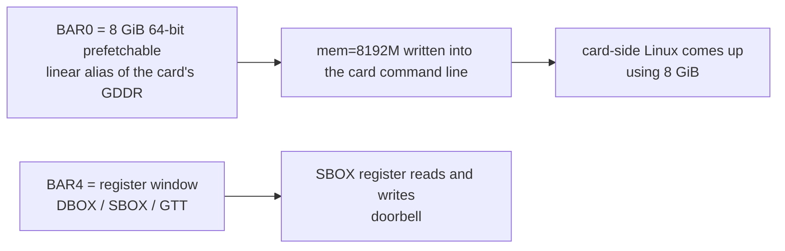
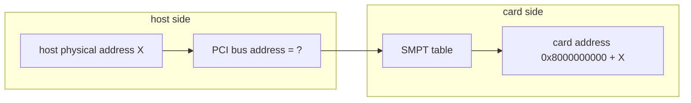
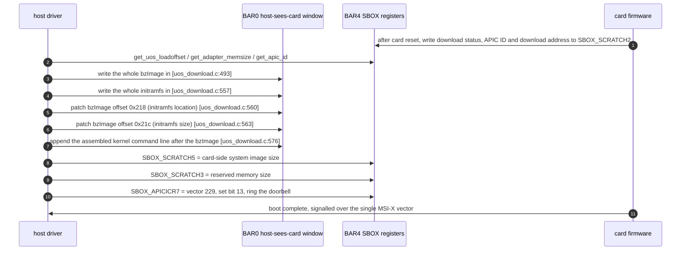

# Chapter 2 — KNC Coprocessor Hardware Form Factor and Boot Contract

> This chapter is about one thing only: **what kind of hardware the host driver is actually talking to**. Get this layer clear and Chapter 5's "architecture coupling audit" has something to judge against — an assumption counts as coupling only when it really lands on the host ISA; anything that lands in the card's firmware has nothing to do with Loongson.

---

## 2.1 It Is Not an Ordinary Peripheral Card

The Xeon Phi X100 (Knights Corner, KNC) is a self-contained computer. It sits in a host PCIe slot, but it has its own:

| Component | Contents | Does the host driver manage it? |
|---|---|---|
| Processor | a many-core CPU of the x86 variant Intel calls K1OM internally, ELF machine number 181 (`EM_K1OM`) | No; the host CPU cannot and need not execute its code |
| Card memory | GDDR5, 4/6/8/16 GB depending on the model | **Yes**, see BAR0 |
| Card storage | SPI flash holding the first-stage boot loader, the second-stage boot loader, the parameter area, and the burned-in card-side Linux | exposed through the driver only when flashing |
| Card operating system | the card's own Linux (called micOS / uOS in the documentation), with a K1OM kernel | **Yes**; the host pushes it down and wakes it |
| Register interface | a set of Intel-defined MMIO registers at BAR4 | **Yes**; all control goes through here |
| Interrupts | 1 MSI-X vector (there is also an INTx fallback path) | **Yes** |

So the host driver's job can be summed up in one sentence: **copy the card-side Linux image into the card's GDDR with the CPU, then ring a doorbell; from then on, send and receive data and interrupts.** Not one step of it requires the host to execute an x86 instruction.

---

## 2.2 PCI Identity and Window Layout

The driver recognises the Intel vendor ID `8086` only; the device IDs come in two generations, one or the other chosen by a build switch [`host/linux.c:480`]:

```c
#ifdef CONFIG_ML1OM
	{ PCI_VENDOR_ID_INTEL, PCI_DEVICE_ABR_2249, ... },   /* previous generation, codename ABR / Knights Ferry */
	{ PCI_VENDOR_ID_INTEL, PCI_DEVICE_ABR_224a, ... },
#endif
#ifdef CONFIG_MK1OM
	{ PCI_VENDOR_ID_INTEL, PCI_DEVICE_KNC_2250, ... },   /* KNC, 2250 ~ 225e, 15 in all */
	...
	{ PCI_VENDOR_ID_INTEL, PCI_DEVICE_KNC_225e, ... },
#endif
```

The driver uses only two BARs [`include/mic_common.h:178`]:

| Macro | Value | What this window is | Measured size given in the User's Guide |
|---|---|---|---|
| `DLDR_APT_BAR` | **0** | a linear alias of the card's GDDR; the host reads and writes card memory directly through it | 64-bit, prefetchable, `0x200000000` = **8 GiB** |
| `DLDR_MMIO_BAR` | **4** | the register window | 64-bit, non-prefetchable |

The `lspci` output reproduced on page 39 of the User's Guide is the single most valuable piece of hard evidence in this audit (extracted copy at `_work/pdf/mpss_users_guide.txt:1359`–`:1362`; item-by-item comparison in [Appendix D](D-manual-crosscheck.md) §D.2):

```
Region 0: Memory at 3c7e00000000 (64-bit, prefetchable) [size=200000000]
Region 4: Memory at ec000000 (64-bit, non-prefetchable) [size=128K]
```

Three things must be remembered:

1. **BAR0 is 8 GiB** — `0x200000000` works out to exactly 8 GiB — and it is placed high, at about 64 TB, far above 4 GiB;
2. **BAR0 is a linear gateway from the host to the card's GDDR**, not a small 256 MB window — `mic_ctx->aper.len` is those 8 GiB, and the driver hands that whole 8 GiB to `ioremap_wc` [`host/uos_download.c:1156`];
3. the driver really does **not** hard-code the BAR size; it reads the actual values at probe time [`host/linux.c:299-300`]:

```c
	bd_info->bi_ctx.aper.pa  = pci_resource_start(pdev, DLDR_APT_BAR);
	bd_info->bi_ctx.aper.len = pci_resource_len (pdev, DLDR_APT_BAR);
```

This is what makes "the window is not big enough" end not in a crashing driver but in **less memory being available on the card**. The evidence chain is very direct, right where the boot command line is assembled [`host/uos_download.c:592`]:

```c
	if (mic_ctx->bi_family == FAMILY_KNC)
		if (mic_ctx->boot_mem == 0 || mic_ctx->boot_mem > mic_ctx->aper.len >> 20)
			mic_ctx->boot_mem = (mic_ctx->aper.len >> 20);
	...
		cmdlen += snprintf(..., " mem=%dM", mic_ctx->boot_mem);
```

The real card command line that a user posted in the guide's appendix confirms exactly this derivation [`UG p.3022`]:

```
virtio_addr=0x835c35a9c0 mem=8192M ramoops_size=16384
```

`mem=8192M` = `0x200000000 >> 20` = 8 GiB, matching the BAR0 size exactly.



---

## 2.3 The Three Segments Inside BAR4

BAR4 is cut into three segments; the offsets are hard-coded constants [`include/mic_common.h:112`]:

| Segment | Offset | Contents | How it is accessed |
|---|---|---|---|
| DBOX | `0x00000000` | data mailbox: interrupt cause, serial number, status word | `readl`/`writel` |
| SBOX | `0x00010000` | system mailbox: reset, boot, temperature, frequency, SMPT | `readl`/`writel` |
| GTT | `0x00040000` | global page table, mapping GDDR pages into BAR0 | `readl`/`writel` |

```c
#define DBOX_READ(mmio, offset)   readl((uint8_t*)(mmio) + (HOST_DBOX_BASE_ADDRESS + (offset)))
#define SBOX_WRITE(value,mmio,off) writel((value), (uint8_t*)(mmio) + (HOST_SBOX_BASE_ADDRESS + (off)))
#define GTT_WRITE (value,mmio,off) writel((value), (uint8_t*)(mmio) + (HOST_GTT_BASE_ADDRESS + (off)))
```

These three macros are the whole of the control channel between host and card. All they do is "add an offset to the mapped address and read or write 32 bits"; there is nothing x86 about them. On Loongson not one character of them changes.

There is one point here that looks like a contradiction at first but is in fact self-consistent, and it is worth spelling out because it is a touchstone for telling which generation a card belongs to: in the User's Guide example BAR4 is only `128K`, while the GTT segment starts at offset `0x40000` (256 KB), which looks out of bounds. What actually happens is that **the GTT segment is never written on KNC**. In the whole tree `GTT_WRITE` has exactly one call site, inside `set_pci_aperture()` [`host/uos_download.c:349`], and that function is called only from the `FAMILY_ABR` branch [`host/uos_download.c:485`]. The highest offset actually used in the SBOX segment is `0xCC9C`, which added to the base `0x10000` gives `0x1CC9C` — comfortably inside 128 KB. So a BAR4 of `128K` fits KNC usage exactly, and the card in the guide's example is a KNC. Before porting it is still worth measuring the real length once with `lspci -vv`, but there is no need to reserve space for GTT.

---

## 2.4 The Address Map as the Card Sees the World

The table below is the physical address layout **on the card**, taken from [`include/mic/micbaseaddressdefine.h`]. It is here so the reader can see plainly which addresses the host never touches.

| Region | Start | Size | Notes |
|---|---|---|---|
| CBOX / TXS / GBOX / VBOX / DBOX / SBOX | around `0x08007D0000` | 64 KB each | register blocks as the card sees them |
| GTT | `0x0800800000` | 256 KB | the global page table as the card sees it |
| Aperture | `0x0900000000` | **256 MB** | **the window through which the card sees host memory** |
| SPI boot and parameter area | above `0x0FFFFDC000` | up to `0x0FFFFFFFFF` | the mapping of the card's flash |
| Remote | `0x1000000000` | up to `0x7FFFFFFFFF` | the card's remote addressing space |
| System | `0x8000000000` | up to `0xFFFFFFFFFF` | **the card's second way of seeing host memory**, see 2.5 |

Note the difference between two things that are easy to confuse:

- `MIC_APERTURE_BASE = 0x0900000000` is the 256 MB window through which **the card sees the host**;
- `DLDR_APT_BAR = 0` is the 8 GiB window through which **the host sees the card**.

The two point in opposite directions and are both called aperture, which makes them very easy to mix up when reading the code. From here on this report calls them the "card-sees-host window" and the "host-sees-card window".

---

## 2.5 SMPT: How the Card Sees the Host's 512 GB

To be able to access host memory directly, KNC uses a table called SMPT (System Memory Page Table) [`include/mic/micscif_smpt.h`, `micscif/micscif_smpt.c`]:

$$
\text{number of SMPT entries} = \frac{\text{MIC\_SYSTEM\_SIZE}}{\text{MIC\_SYSTEM\_PAGE\_SIZE}} = \frac{\text{0x8000000000}}{\text{0x400000000}} = 32
$$

Each entry covers 16 GB, and 32 entries cover exactly 512 GB. The relationship between an address as seen on the card and the host physical address is:

$$
\text{addr}_{\text{card}} = \text{MIC\_SYSTEM\_BASE} + \text{addr}_{\text{host physical}} = \text{0x8000000000} + \text{addr}_{\text{host physical}}
$$

The formula that builds an entry is in the source as well [`include/mic/micscif_smpt.h`]:

$$
\text{BUILD\_SMPT}(\text{NO\_SNOOP},\ \text{HOST\_ADDR}) = \big((\text{HOST\_ADDR} \ll 2) \mathbin{\&} \sim \text{0x03}\big) \mid (\text{NO\_SNOOP} \mathbin{\&} \text{0x01})
$$

One property here is **crucial to the port**: `mic_smpt_init()` sets up an **identity mapping from 0 to 512 GB** — that is, what it writes into the table is the host physical address itself, with **no address translation of any kind** in between.



This chain holds only when the PCI bus address equals the host physical address. On x86 that equality holds as long as no DMAR (IOMMU) is attached behind the PCIe root complex. **Loongson currently has no usable IOMMU**, so the equality holds there too — which is **good news** for this driver, because a few places in it really do use page frame numbers directly as DMA addresses.

Conversely, if Loongson ever gains an IOMMU that is enabled by default, those places will break at once. Chapter 5 names each of them.

---

## 2.6 How the Host Wakes the Card Up

The host-side boot has six steps, none of which depends on the host architecture:



A few details deserve to be called out separately:

- **The initramfs goes at "twice the kernel image offset"**; the source comment says plainly, "put it above the kernel, within 128 MB there is no problem" [`uos_download.c:544`]. This is a plain convention, not a hardware constraint.
- **Offsets `0x218` / `0x21c` are fields of the x86 boot protocol** — `hdr.ramdisk_image` and `hdr.ramdisk_size` in `struct boot_params`. The driver includes no kernel headers at all; it **hard-codes these two offsets** and writes straight into the image file [`uos_download.c:560-563`]. This is a subtle but harmless trace of x86 ancestry: what it manipulates is **the card kernel's** boot protocol, with no connection whatsoever to the host kernel.
- **The doorbell is a write of an APIC-style interrupt control register into BAR4**; vector number 229 is fixed by Intel [`include/mic_interrupts.h:45`]:

```c
#define MIC_BSP_INTERRUPT_VECTOR 229   // host→card (boot) interrupt vector number
```

- **The image file itself is verified once on the host**, by a rule that is a pure byte check (see 2.7) and involves no instruction set.

---

## 2.7 The Rules for Verifying the Boot Image

What the driver does to the card kernel image is a **byte-by-byte check-up**; the rules are crude but unambiguous:

| Check | Offset | Expected value | Meaning |
|---|---|---|---|
| Boot flag | 510 | `0x55aa` | the traditional x86 MBR-style boot signature |
| Header signature | 514 | `"HdrS"` | `boot_params` of an x86 `bzImage` |
| Version | 529 | 1 | image version |
| Compression flag | 530 | `0x1f8b` | gzip |
| ELF machine number | — | `0x3e` (x86-64) or **`0xb5` (181, K1OM)** | the card kernel's machine number is K1OM |

[`mpss-daemon/libmpssconfig/verify_bzimage.c`]

The check allows the machine number to be plain x86-64 (`0x3e`), which shows that Intel permits both machine numbers for the card kernel. The significance for this port is that **this is a data-format check, not a requirement on the host CPU**. A Loongson host runs this check without the slightest difficulty.

---

## 2.8 The Difference Between the Two Card Generations: GTT Is Used Only in the Earlier One

There are two product families in the source [`include/mic_common.h`, `host/uos_download.c`]:

| Family | Macro | Card | How the window is mapped |
|---|---|---|---|
| Earlier generation | `FAMILY_ABR` | Knights Ferry, device IDs `0x2249`/`0x224a` | the host **writes the GTT by hand**: it writes a host memory page table into the GTT segment of BAR4, then writes `SBOX_TLB_FLUSH` to flush it |
| Current generation | `FAMILY_KNC` | Knights Corner, device IDs `0x2250`–`0x225e` | **no GTT writes are needed**; BAR0 is a direct linear view of the card's GDDR |

The code says this very clearly [`host/uos_download.c:485`]:

```c
	if (mic_ctx->bi_family == FAMILY_ABR) {
		set_pci_aperture(mic_ctx, 0, uos_load_offset, *uos_size + PAGE_SIZE);
		uos_load_offset = 0;
	}
```

`GTT_WRITE` and `SBOX_TLB_FLUSH` appear only in that one branch as well.

**This distinction is good news for the port**: on KNC the GTT segment never has to be touched, and the only hard requirement is that "BAR0 must be a large, contiguous window". The GTT-related code only adds to the reading burden.

---

## 2.9 Card-Side Linux and K1OM: the Half That Needs No Porting

`Kbuild` contains a decisive fork [`mpss-modules/Kbuild`]: from the same tree, the configuration builds two completely different modules.

| Configuration | Objects built | Runs where |
|---|---|---|
| `CONFIG_X86_MICPCI=y` | `dma/ micscif/ pm_scif/ ras/ vcons/ vnet/ mpssboot/ ramoops/ virtio/`, `MIC_CARD_ARCH=k1om` | **on the card**, K1OM |
| `m-not-$(CONFIG_X86_MICPCI)` | a single `mic.ko`, about 38 object files | the host |

In other words, **not one line of the card side's 20,000-odd lines needs to be looked at for this port**. They compile into K1OM objects, run on the card, and will never run on Loongson.

The one thing to watch is that these objects **still live in the same source tree**. If you build with the host configuration to save trouble, they will not be compiled in; but if the build scripts are not strict, the compiler will try to build K1OM-specific code with the Loongson toolchain and fail. The first step of the port is to cut this branch off explicitly.

---

## 2.10 Chapter Summary

The criteria of this chapter reduce to three sentences:

1. **Every interaction between the host driver and the card takes one form only: 32-bit reads and writes into a mapped memory window.** From the host architecture's point of view there is nothing irreplaceable about it.
2. **The one hard constraint is that BAR0 must be an 8 GiB contiguous prefetchable MMIO window above 4 GiB.** It can be smaller, but a smaller window means less memory for the card. This is decided by the firmware and the PCI resource allocator.
3. **Everything on the card (boot loading, the card kernel, the card ISA) is burned in by Intel; the host neither takes part in it nor modifies it.** So this port involves no firmware rewrite at all.

The next chapter moves into the host-side kernel module itself and cuts its 38 object files apart by responsibility.
