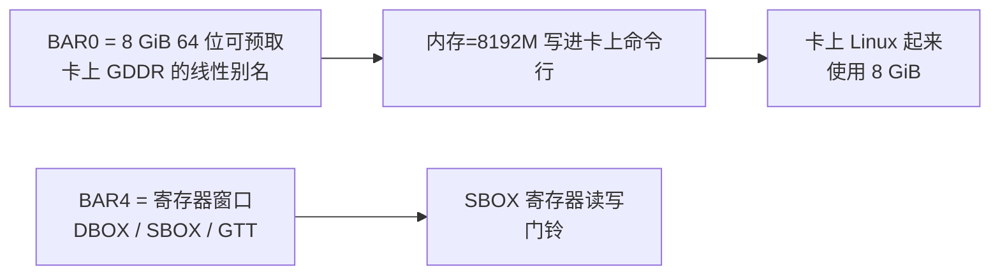
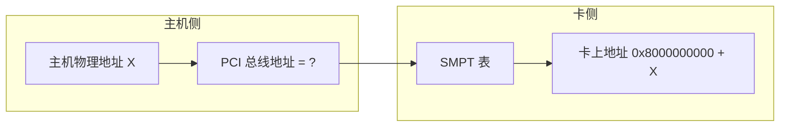
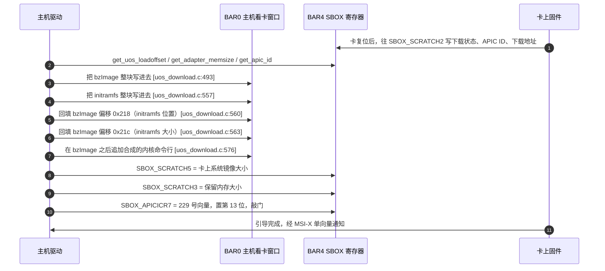

# 第二章　KNC 协处理器的硬件形态与引导契约

> 　本章只讲一件事：**主机驱动到底在跟什么样的硬件打交道**。把这层讲清楚，后面第五章「架构耦合审计」才有判据——只有当某个假设真的落到主机 ISA 上时，才算耦合；凡是落在卡上固件里的，都跟龙芯无关。

---

## 2.1　它不是一张普通外设卡

　　Xeon Phi X100（Knights Corner，KNC）是一张自成一体的计算机。它插在主机 PCIe 插槽里，但它自己具备：

| 组成 | 内容 | 主机驱动要管吗 |
|---|---|---|
| 处理器 | 一颗 x86 变种众核 CPU，Intel 内部叫 K1OM，ELF 机器号 181（`EM_K1OM`） | 不管，主机 CPU 不能也不需要执行它的代码 |
| 卡上内存 | GDDR5，视型号 4/6/8/16 GB | **要**，见 BAR0 |
| 卡上存储 | SPI 闪存，含第一级引导、第二级引导、参数区、以及烧录的卡上 Linux | 只在刷机时经驱动暴露 |
| 卡上操作系统 | 卡上自己的 Linux（文档里叫 micOS / uOS），内核是 K1OM 版 | **要**，由主机推下去并唤醒 |
| 寄存器接口 | 一组 Intel 自定的 MMIO 寄存器，位于 BAR4 | **要**，全部控制都走这里 |
| 中断 | 1 个 MSI-X 向量（也有 INTx 回落路径） | **要** |

　　所以主机端驱动的职责可以一句话概括：**把卡上 Linux 的镜像用 CPU 拷贝搬进卡的 GDDR，再敲一下门铃；此后收发数据与中断。**这里面没有一个环节需要主机执行 x86 指令。

---

## 2.2　PCI 身份与窗口划分

　　驱动只认 Intel 厂商号 `8086`，设备号分两代，由编译开关二选一 [`host/linux.c:480`]：

```c
#ifdef CONFIG_ML1OM
	{ PCI_VENDOR_ID_INTEL, PCI_DEVICE_ABR_2249, ... },   /* 前一代，代号 ABR / Knights Ferry */
	{ PCI_VENDOR_ID_INTEL, PCI_DEVICE_ABR_224a, ... },
#endif
#ifdef CONFIG_MK1OM
	{ PCI_VENDOR_ID_INTEL, PCI_DEVICE_KNC_2250, ... },   /* KNC，2250 ~ 225e 共 15 个 */
	...
	{ PCI_VENDOR_ID_INTEL, PCI_DEVICE_KNC_225e, ... },
#endif
```

　　驱动只用两个 BAR [`include/mic_common.h:178`]：

| 宏 | 值 | 这块窗口是什么 | 用户指南给出的实测尺寸 |
|---|---|---|---|
| `DLDR_APT_BAR` | **0** | 卡上 GDDR 的线性别名，主机用它直接读写卡的显存 | 64 位、可预取、`0x200000000` = **8 GiB** |
| `DLDR_MMIO_BAR` | **4** | 寄存器窗口 | 64 位、不可预取 |

　　用户指南第 39 页贴出的 `lspci` 原文是这次审计里最有价值的一条实证（抽取件 `_work/pdf/mpss_users_guide.txt:1359`–`:1362`，逐条对照见[附录 D](D-manual-crosscheck_CN.md) §D.2）：

```
Region 0: Memory at 3c7e00000000 (64-bit, prefetchable) [size=200000000]
Region 4: Memory at ec000000 (64-bit, non-prefetchable) [size=128K]
```

　　三点必须记住：

1. **BAR0 是 8 GiB**，`0x200000000` 换算过来就是 8 GiB，而且它被放在约 64 TB 的高位，远在 4 GiB 之上；
2. **BAR0 是从主机看卡上 GDDR 的一扇线性大门**，不是 256 MB 的小窗口——`mic_ctx->aper.len` 就是这 8 GiB，驱动直接把这 8 GiB 整块给 `ioremap_wc` 掉 [`host/uos_download.c:1156`]；
3. 驱动的确**没有**把 BAR 的尺寸写死，它在探测阶段读实际值 [`host/linux.c:299-300`]：

```c
	bd_info->bi_ctx.aper.pa  = pci_resource_start(pdev, DLDR_APT_BAR);
	bd_info->bi_ctx.aper.len = pci_resource_len (pdev, DLDR_APT_BAR);
```

　　这一点决定了「窗口不够大」的后果不是驱动崩掉，而是**卡可用内存变少**。证据链非常直接，就在引导命令行拼装那里 [`host/uos_download.c:592`]：

```c
	if (mic_ctx->bi_family == FAMILY_KNC)
		if (mic_ctx->boot_mem == 0 || mic_ctx->boot_mem > mic_ctx->aper.len >> 20)
			mic_ctx->boot_mem = (mic_ctx->aper.len >> 20);
	...
		cmdlen += snprintf(..., " mem=%dM", mic_ctx->boot_mem);
```

　　用户在指南附录里贴出的真实卡上命令行正好印证了这条推导 [`UG p.3022`]：

```
virtio_addr=0x835c35a9c0 mem=8192M ramoops_size=16384
```

　　`mem=8192M` ＝ `0x200000000 >> 20` ＝ 8 GiB，与 BAR0 尺寸严格对应。



---

## 2.3　BAR4 里的三段布局

　　BAR4 内部被切成三段，偏移是写死的常量 [`include/mic_common.h:112`]：

| 段 | 偏移 | 内容 | 取值方式 |
|---|---|---|---|
| DBOX | `0x00000000` | 数据邮箱，中断原因、串号、状态字 | `readl`/`writel` |
| SBOX | `0x00010000` | 系统邮箱，复位、引导、温度、频率、SMPT | `readl`/`writel` |
| GTT | `0x00040000` | 全局页表，把 GDDR 页映射进 BAR0 | `readl`/`writel` |

```c
#define DBOX_READ(mmio, offset)   readl((uint8_t*)(mmio) + (HOST_DBOX_BASE_ADDRESS + (offset)))
#define SBOX_WRITE(value,mmio,off) writel((value), (uint8_t*)(mmio) + (HOST_SBOX_BASE_ADDRESS + (off)))
#define GTT_WRITE (value,mmio,off) writel((value), (uint8_t*)(mmio) + (HOST_GTT_BASE_ADDRESS + (off)))
```

　　这三个宏就是主机与卡之间控制通道的全部。它们只是「在映射好的地址上加偏移然后读/写 32 位」，没有任何 x86 成分。换到龙芯，这三个宏一个字都不用改。

　　这里有一处初看像矛盾、其实自洽的地方，值得点明，因为它是判断「卡是哪一代」的试金石：用户指南示例里 BAR4 只有 `128K`，而 GTT 段的起始偏移是 `0x40000`（256 KB），看似越界。实际情况是——**GTT 段在 KNC 上从来不会被写**。全树里 `GTT_WRITE` 只有一个调用点，就在 `set_pci_aperture()` 内部 [`host/uos_download.c:349`]，而这个函数只被 `FAMILY_ABR` 分支调用 [`host/uos_download.c:485`]。SBOX 段的实际最大偏移是 `0xCC9C`，加上基址 `0x10000` 得 `0x1CC9C`，正好落在 128 KB 之内。所以 `128K` 的 BAR4 与 KNC 的用法完全吻合，指南举的例子里那张卡就是 KNC。移植前仍建议用 `lspci -vv` 量一次真实长度，但不必为 GTT 预留空间。

---

## 2.4　卡自己看世界的地址表

　　下面这张表是**卡上**的物理地址布局，出自 [`include/mic/micbaseaddressdefine.h`]。列在这里的目的，是让读者看清「哪些地址是主机永远不碰的」。

| 区段 | 起始 | 大小 | 说明 |
|---|---|---|---|
| CBOX / TXS / GBOX / VBOX / DBOX / SBOX | `0x08007D0000` 附近 | 每个 64 KB | 卡上自视的寄存器块 |
| GTT | `0x0800800000` | 256 KB | 卡上自视的全局页表 |
| Aperture | `0x0900000000` | **256 MB** | **卡看主机内存的窗口** |
| SPI 引导与参数区 | `0x0FFFFDC000` 以上 | 至 `0x0FFFFFFFFF` | 卡上闪存的映射 |
| Remote | `0x1000000000` | 至 `0x7FFFFFFFFF` | 卡上远端寻址空间 |
| System | `0x8000000000` | 至 `0xFFFFFFFFFF` | **卡看主机内存的第二种方式**，见 2.5 |

　　注意区分两个容易混淆的东西：

- `MIC_APERTURE_BASE = 0x0900000000` 是**卡看主机**的 256 MB 窗口；
- `DLDR_APT_BAR = 0` 是**主机看卡**的 8 GiB 窗口。

　　两者方向相反，名字都叫 aperture，读代码时极易搞混。本报告此后统一叫「卡看主机窗口」和「主机看卡窗口」。

---

## 2.5　SMPT：卡怎么看见主机的 512 GB

　　KNC 为了能直接访问主机内存，用了一张叫 SMPT 的表（System Memory Page Table）[`include/mic/micscif_smpt.h`、`micscif/micscif_smpt.c`]：

$$
\text{SMPT 条目数} = \frac{\text{MIC\_SYSTEM\_SIZE}}{\text{MIC\_SYSTEM\_PAGE\_SIZE}} = \frac{\text{0x8000000000}}{\text{0x400000000}} = 32
$$

　　每个条目管 16 GB，32 个条目正好覆盖 512 GB。卡上看到的地址与主机物理地址之间的关系是：

$$
\text{addr}_{\text{卡}} = \text{MIC\_SYSTEM\_BASE} + \text{addr}_{\text{主机物理}} = \text{0x8000000000} + \text{addr}_{\text{主机物理}}
$$

　　条目的构造公式也在源码里 [`include/mic/micscif_smpt.h`]：

$$
\text{BUILD\_SMPT}(\text{NO\_SNOOP},\ \text{HOST\_ADDR}) = \big((\text{HOST\_ADDR} \ll 2) \mathbin{\&} \sim \text{0x03}\big) \mid (\text{NO\_SNOOP} \mathbin{\&} \text{0x01})
$$

　　这里有一条**对移植极其关键**的性质：`mic_smpt_init()` 做的是 **0 到 512 GB 的恒等映射**，也就是说它在表里写的就是主机物理地址本身，中间**没有经过任何地址翻译**。



　　这条链条只有在「PCI 总线地址 ＝ 主机物理地址」时才成立。在 x86 上，只要不在 PCIe 主桥后面挂一个 DMAR（IOMMU），这个等式就成立。**龙芯目前没有可用的 IOMMU**，因此这条等式同样成立——这对本驱动是**好事**，因为驱动里确实有几处把页帧号直接当 DMA 地址用。

　　反过来说，如果哪天龙芯上了 IOMMU 并默认打开，这些地方会立刻出错。第五章会把这些位置逐个点名。

---

## 2.6　主机是怎么把卡叫起来的

　　主机端引导共六步，全部与主机架构无关：



　　几个细节值得单独标出：

- **initramfs 的位置是「内核镜像偏移的两倍」**，源码注释直白地说「放在内核上面，128 MB 之内没问题」 [`uos_download.c:544`]。这是个朴素的约定，不是硬件约束。
- **偏移 `0x218` / `0x21c` 是 x86 引导协议里的字段**，也就是 `struct boot_params` 里的 `hdr.ramdisk_image` 和 `hdr.ramdisk_size`。驱动没有包含任何内核头，而是**硬编码了这两个偏移**，直接往镜像文件里写 [`uos_download.c:560-563`]。这是一处隐晦但无害的 x86 血统痕迹：它操作的是**卡上内核的**引导协议，跟主机内核完全无关。
- **门铃是往 BAR4 里写一个 APIC 风格的中断控制寄存器**，向量号 229 是 Intel 定死的 [`include/mic_interrupts.h:45`]：

```c
#define MIC_BSP_INTERRUPT_VECTOR 229   // 主机→卡（引导）中断向量号
```

- **镜像文件本身在主机会被校验一次**，规则是纯字节检查（见 2.7），不涉及指令集。

---

## 2.7　引导镜像的校验规则

　　驱动对卡上内核镜像做的是**逐字节体检**，规则很土但很明确：

| 检查项 | 位移 | 期望值 | 含义 |
|---|---|---|---|
| 引导标志 | 510 | `0x55aa` | x86 传统 MBR 式引导签名 |
| 头签名 | 514 | `"HdrS"` | x86 `bzImage` 的 `boot_params` |
| 版本 | 529 | 1 | 镜像版本 |
| 压缩标志 | 530 | `0x1f8b` | gzip |
| ELF 机器号 | — | `0x3e`（x86-64）或 **`0xb5`（181，K1OM）** | 卡上内核的机器号就是 K1OM |

　　[`mpss-daemon/libmpssconfig/verify_bzimage.c`]

　　校验里允许机器号是普通 x86-64（`0x3e`），这说明 Intel 允许卡上内核两种机器号混用。对本次移植的意义是：**这是一份数据格式校验，不是对主机 CPU 的要求**。龙芯主机执行这段校验毫无困难。

---

## 2.8　两代卡的差别：GTT 只在前一代用

　　源码里有两个产品族 [`include/mic_common.h`、`host/uos_download.c`]：

| 族 | 宏 | 对应卡 | 窗口怎么映射 |
|---|---|---|---|
| 前一代 | `FAMILY_ABR` | Knights Ferry，设备号 `0x2249`/`0x224a` | 主机**手工写 GTT**，把一段主机内存页表写进 BAR4 的 GTT 段，然后写 `SBOX_TLB_FLUSH` 刷新 |
| 当代 | `FAMILY_KNC` | Knights Corner，设备号 `0x2250`–`0x225e` | **不需要写 GTT**，BAR0 就是卡上 GDDR 的直接线性视图 |

　　代码里写得非常清楚 [`host/uos_download.c:485`]：

```c
	if (mic_ctx->bi_family == FAMILY_ABR) {
		set_pci_aperture(mic_ctx, 0, uos_load_offset, *uos_size + PAGE_SIZE);
		uos_load_offset = 0;
	}
```

　　`GTT_WRITE` 与 `SBOX_TLB_FLUSH` 也只在这一个分支里出现。

　　**这条区分对移植是好消息**：在 KNC 上，GTT 段根本不用碰，唯一的硬性要求就是「BAR0 必须是一块大而连续的窗口」。GTT 相关代码的存在只会增加阅读负担。

---

## 2.9　卡上 Linux 与 K1OM：不需要移植的那一半

　　`Kbuild` 里有一条决定性的分岔 [`mpss-modules/Kbuild`]：同一棵树，按配置编译出两个完全不同的模块。

| 配置 | 编译出的对象 | 运行在哪 |
|---|---|---|
| `CONFIG_X86_MICPCI=y` | `dma/ micscif/ pm_scif/ ras/ vcons/ vnet/ mpssboot/ ramoops/ virtio/`，`MIC_CARD_ARCH=k1om` | **卡上** K1OM |
| `m-not-$(CONFIG_X86_MICPCI)` | 单个 `mic.ko`，约 38 个目标文件 | 主机 |

　　也就是说，**卡端那 2 万多行代码在本次移植中一行都不需要看**。它们编译成的目标是 K1OM，跑在卡上，永远不会跑在龙芯上。

　　唯一需要留意的是：这些对象**仍然存在于同一个源码树里**。如果为了省事直接按主机配置编译，它们不会被编译进去；但如果构建脚本写得不严，编译器会尝试用龙芯工具链去编译 K1OM 专用代码而报错。移植的第一步就是明确切断这一分支。

---

## 2.10　本章小结

　　把本章的判据收拢成三句话：

1. **主机驱动与卡之间的全部交互，只有「往映射好的内存窗口里做 32 位读写」这一种形式。** 从主机架构角度看不出任何不可替代之处。
2. **唯一的硬约束是 BAR0 必须是 4 GiB 之上的一块 8 GiB 连续可预取 MMIO 窗口。**它能小，但小了卡就少内存。这一点由固件和 PCI 资源分配器决定。
3. **卡上的一切（引导加载、卡上内核、卡上 ISA）都是 Intel 烧好的，主机不参与也不修改。**因此本移植不涉及任何固件重写。

　　下一章进入主机端内核模块本身，把这 38 个目标文件按职责切开来看。
