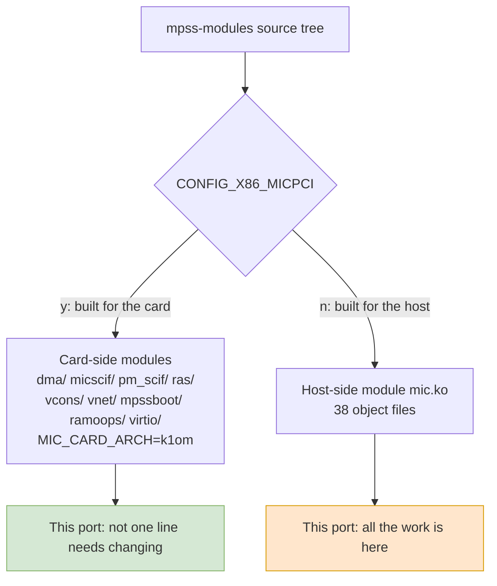
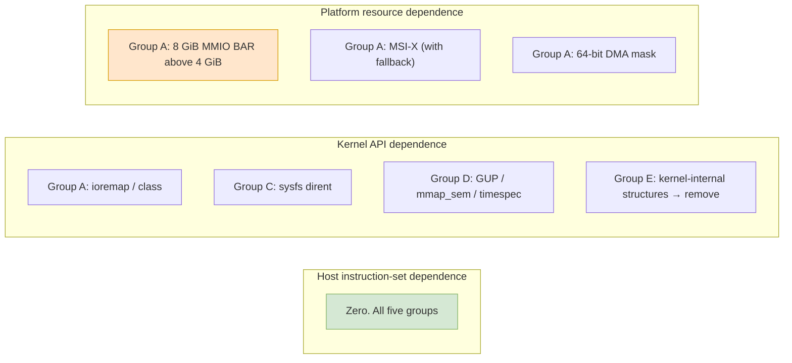
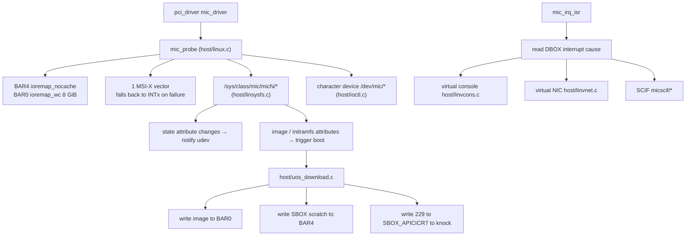

# Chapter 3 — Anatomy of the Host-Side Kernel Module

> This chapter takes `mic.ko` apart and, file by file, explains what each one is doing, how many lines it has, and how deeply it is tied to the host architecture. This is the map for the audit in Chapter 5 and the checklist for the work in Chapter 8.

---

## 3.1 One Tree, Two Modules

The MPSS kernel code is a single directory tree, split in two by a set of variables in `Kbuild`. Those variables are written in a fairly convoluted way, because they **directly determine what has to be cut when porting**.

```makefile
not-y := n
not-n := y
m-not-y := n
m-not-n := m

obj-$(CONFIG_X86_MICPCI) += dma/ micscif/ pm_scif/ ras/
obj-$(CONFIG_X86_MICPCI) += vcons/ vnet/ mpssboot/ ramoops/ virtio/

obj-$(m-not-$(CONFIG_X86_MICPCI)) += mic.o
```

Stripped down, the logic is simple: `CONFIG_X86_MICPCI=y` means "this is a build for the card", so a batch of card-side modules gets built; otherwise `m-not-y = m`, and the 38 object files are packed into the host-side module `mic.ko`.

The same `micscif/` directory is **compiled for both sides**, but only 16 of its files belong to the host-side module [`Kbuild`]:

```
micscif_api.o micscif_debug.o micscif_fd.o micscif_intr.o micscif_nm.o
micscif_nodeqp.o micscif_ports.o micscif_rb.o micscif_rma_dma.o
micscif_rma_list.o micscif_rma.o micscif_select.o micscif_smpt.o
micscif_sysfs.o micscif_va_gen.o micscif_va_node.o
```

The excluded `micscif_main.c` (606 lines) is card-only. Likewise `dma/mic_sbox_md.c` (57 lines) is not on the host list.



Two more compile-time definitions are worth remembering; they determine the difference between the two card generations [`Kbuild`]:

| Definition | Trigger | Effect |
|---|---|---|
| `MIC_IS_L1OM` | `CONFIG_ML1OM` | Builds in the Knights Ferry branch |
| `MIC_IS_K1OM` | `CONFIG_MK1OM` | Builds in the Knights Corner branch |
| `-DHOST -DUSE_VCONSOLE` | Not a card build | Enables the host-side code paths and the virtual console |

These three macros are used in a great many `#ifdef`s throughout the source. When porting, you **must define `MIC_IS_K1OM` and nothing else**, and cut the entire card-side branch out of the build; otherwise the cross-compile will run straight into a pile of K1OM-specific code.

---

## 3.2 The 38 Files: Responsibilities and Size

The table below is sorted from most lines to fewest, and is the complete inventory from this audit.

> Counting convention: **total file line count**, including blank lines and comments, measured file by file with `Get-Content <file> | Measure-Object` and reproducible. Counting non-blank lines only, the whole module is 28,894 lines; this table uses total lines throughout, because that is the number anyone can recompute at a glance.

| File | Lines | Responsibility |
|---|---:|---|
| `micscif/micscif_api.c` | 3464 | The complete SCIF external API: connect, send, receive, register memory |
| `micscif/micscif_nodeqp.c` | 2902 | Node-to-node handshake protocol (node queue pairs) and peer discovery |
| `micscif/micscif_rma.c` | 2633 | Remote memory access (RMA): window allocation and synchronization |
| `host/uos_download.c` | 1950 | **Boot core**: image transfer, command line, reset, interrupt service |
| `dma/mic_dma_lib.c` | 1792 | Allocation, mapping and driving of the descriptor rings of the on-card DMA engine |
| `micscif/micscif_nm.c` | 1740 | Node management: node up/down, state maintenance |
| `vnet/micveth_dma.c` | 1642 | DMA engine implementation for the virtual NIC |
| `host/pm_pcstate.c` | 1107 | Power-state register protocol between the card and the host |
| `host/micscif_pm.c` | 1062 | Power-management message exchange with the card |
| `micscif/micscif_debug.c` | 1005 | Debug nodes and statistics output |
| `micscif/micscif_rma_dma.c` | 982 | The DMA implementation behind RMA |
| `host/tools_support.c` | 978 | ioctl helpers, flash writing, pinning user pages |
| `host/vmcore.c` | 821 | Exports card memory as a vmcore after a card crash |
| `host/linvnet.c` | 802 | Host-side network interface for the virtual NIC |
| `host/linux.c` | 796 | **Module entry point**: PCI probe/remove, BAR, MSI-X, device nodes |
| `host/linsysfs.c` | 766 | Implementation of every `/sys/class/mic/micN/*` attribute |
| `host/vhost/mic_vhost.c` | 697 | virtio back-end skeleton |
| `host/linvcons.c` | 687 | Virtual console (terminal layer) |
| `host/vhost/mic_blk.c` | 665 | virtio block-device back end |
| `host/pm_ioctl.c` | 603 | ioctl dispatch for power management |
| `micscif/micscif_rma_list.c` | 533 | RMA list maintenance |
| `micscif/micscif_fd.c` | 528 | File-descriptor and poll support |
| `dma/mic_dma_md.c` | 522 | Middle layer of the DMA engine |
| `micscif/micscif_va_gen.c` | 480 | On-card virtual address generator |
| `micscif/micscif_smpt.c` | 457 | **Allocation and writing of the SMPT window** |
| `micscif/micscif_select.c` | 446 | select/poll support |
| `micscif/micscif_ports.c` | 376 | SCIF port bit operations (**contains three lines of x86-64 assembly, see 5.3**) |
| `micscif/micscif_rb.c` | 372 | Ring buffer |
| `host/linscif_host.c` | 315 | Registration of SCIF on the host |
| `micscif/micscif_sysfs.c` | 234 | SCIF's sysfs nodes |
| `host/linpm.c` | 232 | Suspend/resume callbacks |
| `host/acptboot.c` | 194 | Kernel-space SCIF accept path (uses `getnstimeofday`) |
| `micscif/micscif_va_node.c` | 187 | Virtual address nodes |
| `host/ioctl.c` | 186 | Entry-point dispatch for the character device |
| `host/micpsmi.c` | 184 | PSMI page-table allocation |
| `micscif/micscif_intr.c` | 159 | Interrupt handling |
| `host/linpsmi.c` | 152 | PSMI sysfs and character-device interface |
| `vnet/micveth_param.c` | 95 | Virtual NIC parameters (module parameters and sysfs settings) |

That totals **32,746 lines** of C code for the host-side module, across 38 files. This number is the denominator for every effort estimate that follows.


---

## 3.3 Five Groups by Responsibility

By what they do, the 38 files divide cleanly into five groups. **The point of the grouping is that each group's architectural sensitivity is completely different.**

### Group A — Device and Window Layer (796 lines, 1 file)

`host/linux.c` is the module's entry and exit point, and it does four things:

1. Registers the PCI device table, recognizing Intel `8086` and `0x2250`–`0x225e`;
2. Measures out BAR0 and BAR4 with `pci_resource_start/len`, claims them with `request_mem_region`, then maps MMIO with `ioremap_nocache` and maps the 8 GiB BAR0 with `ioremap_wc` from a background work queue;
3. Requests one MSI-X vector, falling back to a shared IRQ if that fails;
4. Creates the character device and `/sys/class/mic/micN`.

This is **one of only two pieces** of code in the whole port that really has to be read closely (the other is `uos_download.c`). Its dependence on the host architecture is concentrated in two mapping primitives, `ioremap_nocache` and `ioremap_wc`.

Note that it does the 8 GiB `ioremap` **from a work queue**, and waits for it with `wait_event`:

```c
	mic_ctx->aper.va = ioremap_wc(mic_ctx->aper.pa, mic_ctx->aper.len);
```

[`host/uos_download.c:1156`]. This code is fine on x86, but on LoongArch there is a problem that has to be solved first: **whether the LoongArch kernel is willing to `ioremap` 8 GiB in one shot and mark it write-combining**. Chapter 11 gives the way to verify this.

### Group B — Boot and Image Layer (3,437 lines, 4 files)

| File | What it does in this group |
|---|---|
| `host/uos_download.c` | Moves the bzImage, moves the initramfs, patches back the offsets `0x218`/`0x21c`, assembles the command line, writes SBOX scratch, writes the APIC ICR to knock on the door, interrupt service |
| `host/acptboot.c` | Passive accept for kernel-space SCIF, using `getnstimeofday` |
| `host/tools_support.c` | Measures file size, reads files, writes flash, pins user pages |
| `host/linscif_host.c` | Brings up the host-side SCIF device, including page mappings such as `MAP_PAGE` |

This group is the sole place where the "boot contract between the host and the card" is implemented. Its logic is entirely file I/O plus register I/O; **not one place requires changing an algorithm**, only replacing a few function names that the kernel has deleted.

### Group C — Power, Platform and State Layer (4,292 lines, 8 files)

| File | Responsibility |
|---|---|
| `host/pm_pcstate.c` | Power-state register protocol (`pm_reg_read`/`pm_reg_write` land directly on DBOX/SBOX) |
| `host/micscif_pm.c` | Negotiates power state with the card over SCIF messages |
| `host/pm_ioctl.c` | ioctl dispatch for power management: feeds user-space requests into the power state machine |
| `host/linsysfs.c` | Read implementations for all sysfs attributes |
| `host/ioctl.c` | Character-device ioctl dispatch (flash writing, reading card memory) |
| `host/linpm.c` | Suspend/resume callbacks, hooked into Linux power management |
| `host/linpsmi.c` `host/micpsmi.c` | PSMI: builds page tables for host memory so the card can read and write through the card-sees-host window |

What distinguishes this group: **a large amount of code, but zero architectural sensitivity**. It reads and writes registers and sysfs; the changes come only from kernel APIs being renamed (for example, `class_create` losing parameters).

The only thing that needs redesigning is the "tell udev the state changed" mechanism in `linsysfs.c`; see Chapter 6.

### Group D — Data Plane (23,400 lines, 24 files)

This is the largest group: the SCIF protocol stack (16 files, 16,498 lines), the DMA engine (2 files, 2,314 lines), the virtual console, the virtual NIC, and the virtio back ends.

This group's architectural sensitivity is **not zero, but very low**:

- The great majority of addresses come from the legitimate return values of `pci_map_single` and `pci_map_sg`, and every mapping has a matching `pci_unmap_*` — standard cross-architecture practice;
- **There is exactly one cache-synchronization call in the whole tree**: `pci_dma_sync_single_for_cpu()` at `host/linpsmi.c:80`. Apart from that, across all 38 files there is **not one** `dma_sync_single_*` and **not a single** `dma_alloc_coherent`/`dma_map_single` — the code uses the 2.6-era `pci_*` compatibility layer, and that header was removed wholesale in 6.x (see Chapter 6). In Chapter 7 this turns into an honest question about cache coherency;
- A few places use a virtual address or a page-frame number directly as a DMA address, which on x86 relies on there being no IOMMU — and on LoongArch that happens to hold as well;
- Nothing depends on x86 privileged instructions (the `wbinvd`, `rdmsr`, `cpuid` family appears only in the card-side `ras/`; see Chapter 5, §5.3).

The detailed inventory, with line-by-line evidence, is given by Chapter 5 and `_work/dma-address.md`.

### Group E — Crash Dump (821 lines, 1 file)

`host/vmcore.c` is **the single highest-risk file**. What it does is this: after the on-card system crashes, it reads out card memory and disguises it as a Linux vmcore so that the host's crash-analysis tools can use it.

It is dangerous because it has to line up with the memory layout and dump format of **the on-card kernel** — internal structures Intel copied from some version of K1OM Linux. The source even carries the trace of a patch that renamed a kernel-internal function:

```c
-	read_from_oldmem(...)
+	mic_read_from_oldmem(...)
```

[`mpss-modules-4.18.0-240.el8.x86_64.patch`]. This shows that the code was already dealing with the kernel's internal old-memory read function back then.

Recommendation: **in the first phase of the port, take `vmcore.c` out of the module entirely**, disable it with `crash_dump=0`, and deal with it separately once the port has stabilized.

---

## 3.4 Architectural Sensitivity Across the Five Groups

| Group | Lines | Depends on host ISA | Depends on kernel APIs | Depends on platform resources | Porting difficulty |
|---|---:|---|---|---|---|
| A Device and window layer | 796 | No | Medium (`ioremap_nocache`, `class_create`) | **High** (8 GiB BAR) | Medium |
| B Boot and image layer | 3,437 | No | Low (`kernel_read`) | No | **Low** |
| C Power and state layer | 4,292 | No | Medium (sysfs dirent mechanism) | No | Low |
| D Data plane | 23,400 | No | Medium (`get_user_pages`, `mmap_sem`) | Low (the absence of an IOMMU actually helps) | Medium |
| E Crash dump | 821 | No | **High** (kernel-internal structures) | No | **High; recommend removing first** |

**Not one group depends on the host instruction set.** All the difficulty comes from kernel APIs being replaced wholesale and from platform resources.



---

## 3.5 Module Parameters and Configuration

`mic.ko` exposes a dozen or so parameters [`host/linux.c:58`]; the factory configuration file says (each of these eight parameters has its own section in the user guide, see `_work/pdf/mpss_users_guide.txt:4943`–`:5053`):

```
options mic reg_cache=1 huge_page=1 watchdog=1 watchdog_auto_reboot=1 \
           crash_dump=1 p2p=1 p2p_proxy=1 ulimit=0
```

| Parameter | Meaning | What to watch when porting |
|---|---|---|
| `reg_cache` | SCIF memory-registration cache | None |
| `huge_page` | Makes SCIF register memory in huge pages | **Tied to page size**: the huge-page size is whatever the deployed kernel provides (2 MB on x86), and that number cannot simply be carried over to LoongArch; see Chapter 5, §5.5 |
| `watchdog` `watchdog_auto_reboot` | Watchdog and automatic reboot | None |
| `crash_dump` | Crash dump (the Group E switch) | Recommend setting it to 0 during the port |
| `p2p` `p2p_proxy` | Peer-to-peer DMA between cards | None |
| `ulimit` | Checks the user resource limit | None |
| `msi` | Whether to enable MSI-X (default 1) | If MSI-X on the LS7A is problematic, this switch turns it off directly and falls back to INTx |

**The existence of the `msi=0` switch is good news**: it means MSI-X is not a hard requirement. As long as the host bridge can give INTx a shared interrupt line, the driver can still run. That said, INTx on PCIe is an emulated message, so INTx support on the LoongArch platform needs to be confirmed.

---

## 3.6 Call Relationships Inside the Module



Every arrow in this diagram is nothing more than "read a file, write memory, write a register, take an interrupt". **Nowhere in it does the host need to execute an x86 instruction.**

---

## 3.7 Chapter Summary

In three sentences:

1. **The host-side module is 32,746 lines (38 files, blank lines included) in five groups of responsibility. The data plane accounts for 23,400 lines but is not hard; the device and window layer is only 796 lines yet is the key to the whole thing.**
2. **The build only needs to be cut cleanly in two**: define `MIC_IS_K1OM` and nothing else, sever the `CONFIG_X86_MICPCI` branch completely, and the 20,000-odd lines of card-side code are irrelevant to this port from then on.
3. **`vmcore.c` should be removed first**; it is the only file deeply bound to the on-card kernel's internal structures.

The next chapter finishes the inventory of the host user-space half, and then we enter the core of this report: the point-by-point architectural coupling audit in Chapter 5.
