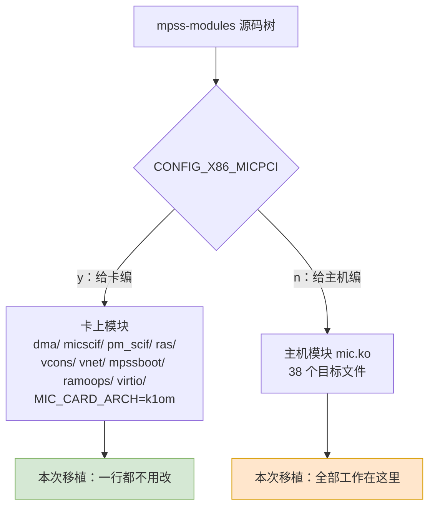
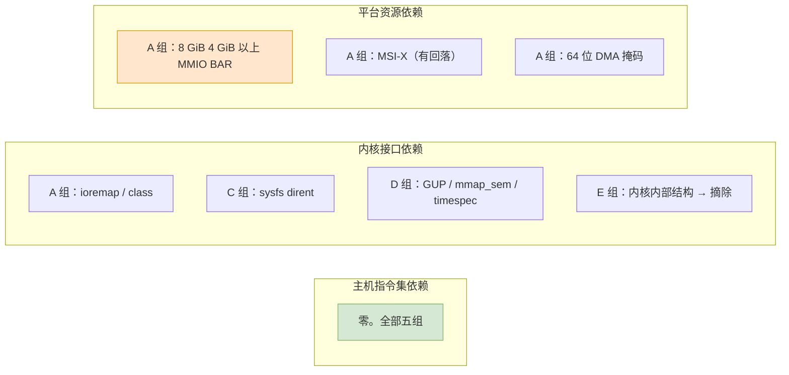
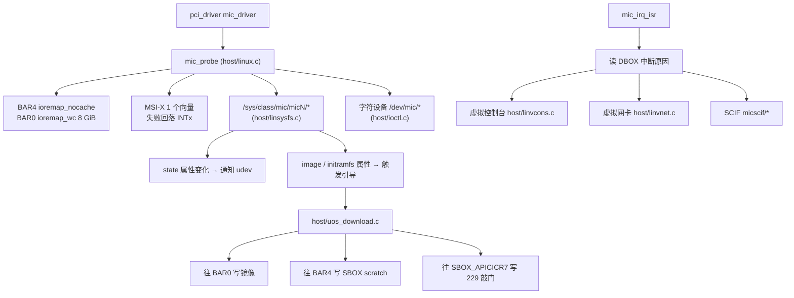

# 第三章　主机端内核模块的解剖

> 　本章把 `mic.ko` 拆开，逐个文件交代它在干什么、有多少行、以及它与主机架构的关联有多深。这是第五章审计的地图、第八章施工的清单。

---

## 3.1　一棵树，两个模块

　　MPSS 的内核代码只有一棵目录树，靠 `Kbuild` 里的一组变量把自己劈成两半。这套变量写得相当绕，因为它**直接决定了移植时要切断哪些东西**。

```makefile
not-y := n
not-n := y
m-not-y := n
m-not-n := m

obj-$(CONFIG_X86_MICPCI) += dma/ micscif/ pm_scif/ ras/
obj-$(CONFIG_X86_MICPCI) += vcons/ vnet/ mpssboot/ ramoops/ virtio/

obj-$(m-not-$(CONFIG_X86_MICPCI)) += mic.o
```

　　逻辑说穿了很简单：`CONFIG_X86_MICPCI=y` 表示「这是给卡上编译的」，于是编译出一堆卡上的模块；否则 `m-not-y = m`，把 38 个目标文件打包成主机模块 `mic.ko`。

　　同一个 `micscif/` 目录，**两边都要编译**，但只有 16 个文件属于主机模块 [`Kbuild`]：

```
micscif_api.o micscif_debug.o micscif_fd.o micscif_intr.o micscif_nm.o
micscif_nodeqp.o micscif_ports.o micscif_rb.o micscif_rma_dma.o
micscif_rma_list.o micscif_rma.o micscif_select.o micscif_smpt.o
micscif_sysfs.o micscif_va_gen.o micscif_va_node.o
```

　　被排除在外的 `micscif_main.c`（606 行）是卡上专用。同理 `dma/mic_sbox_md.c`（57 行）也不在主机清单里。



　　还有两处编译期定义值得记住，它们决定了两代卡的差异 [`Kbuild`]：

| 定义 | 触发条件 | 影响 |
|---|---|---|
| `MIC_IS_L1OM` | `CONFIG_ML1OM` | 编入 Knights Ferry 分支 |
| `MIC_IS_K1OM` | `CONFIG_MK1OM` | 编入 Knights Corner 分支 |
| `-DHOST -DUSE_VCONSOLE` | 不是给卡编 | 启用主机侧代码路径与虚拟控制台 |

　　这三个宏在源码里被大量 `#ifdef` 使用。移植时**必须明确只定义 `MIC_IS_K1OM`**，并且把整个卡端分支从构建里摘掉，否则交叉编译会撞上一堆 K1OM 专用代码。

---

## 3.2　38 个文件的职责与体量

　　下表按行数从大到小排，是本次审计的完整清单。

> 　计数口径：**文件总行数**，含空行与注释，由 `Get-Content <文件> | Measure-Object` 逐文件实测，可复核。若只数非空行，全模块是 28,894 行；本表统一用总行数，因为它是可一眼复算的那个。

| 文件 | 行数 | 职责 |
|---|---:|---|
| `micscif/micscif_api.c` | 3464 | SCIF 对外接口全集：连接、发送、接收、注册内存 |
| `micscif/micscif_nodeqp.c` | 2902 | 节点间握手协议（节点队列对）与对等端发现 |
| `micscif/micscif_rma.c` | 2633 | 远端内存访问（RMA）：窗口分配与同步 |
| `host/uos_download.c` | 1950 | **引导核心**：镜像搬运、命令行、复位、中断服务 |
| `dma/mic_dma_lib.c` | 1792 | 卡上 DMA 引擎描述符环的分配、映射与驱动 |
| `micscif/micscif_nm.c` | 1740 | 节点管理：节点上下线、状态维护 |
| `vnet/micveth_dma.c` | 1642 | 虚拟网卡的 DMA 引擎实现 |
| `host/pm_pcstate.c` | 1107 | 卡与主机的电源状态寄存器协议 |
| `host/micscif_pm.c` | 1062 | 与卡之间的电源消息收发 |
| `micscif/micscif_debug.c` | 1005 | 调试节点与统计输出 |
| `micscif/micscif_rma_dma.c` | 982 | RMA 的 DMA 落地实现 |
| `host/tools_support.c` | 978 | ioctl 辅助、闪存刷写、用户页固定 |
| `host/vmcore.c` | 821 | 卡崩溃后把卡上内存导出成 vmcore |
| `host/linvnet.c` | 802 | 虚拟网卡的主机侧网络接口 |
| `host/linux.c` | 796 | **模块入口**：PCI 探测/移除、BAR、MSI-X、设备节点 |
| `host/linsysfs.c` | 766 | `/sys/class/mic/micN/*` 全部属性的实现 |
| `host/vhost/mic_vhost.c` | 697 | virtio 后端骨架 |
| `host/linvcons.c` | 687 | 虚拟控制台（终端层） |
| `host/vhost/mic_blk.c` | 665 | virtio 块设备后端 |
| `host/pm_ioctl.c` | 603 | 电源管理的 ioctl 分发 |
| `micscif/micscif_rma_list.c` | 533 | RMA 链表维护 |
| `micscif/micscif_fd.c` | 528 | 文件描述符与轮询支持 |
| `dma/mic_dma_md.c` | 522 | DMA 引擎的中间层 |
| `micscif/micscif_va_gen.c` | 480 | 卡上虚拟地址生成器 |
| `micscif/micscif_smpt.c` | 457 | **SMPT 窗口的分配与写入** |
| `micscif/micscif_select.c` | 446 | select/poll 支持 |
| `micscif/micscif_ports.c` | 376 | SCIF 端口位操作（**含三行 x86-64 汇编，见 5.3**） |
| `micscif/micscif_rb.c` | 372 | 环形缓冲区 |
| `host/linscif_host.c` | 315 | SCIF 在主机的注册 |
| `micscif/micscif_sysfs.c` | 234 | SCIF 的 sysfs 节点 |
| `host/linpm.c` | 232 | 挂起/恢复回调 |
| `host/acptboot.c` | 194 | 内核态 SCIF 接受路径（用 `getnstimeofday`） |
| `micscif/micscif_va_node.c` | 187 | 虚拟地址节点 |
| `host/ioctl.c` | 186 | 字符设备的入口分发 |
| `host/micpsmi.c` | 184 | PSMI 页表分配 |
| `micscif/micscif_intr.c` | 159 | 中断处理 |
| `host/linpsmi.c` | 152 | PSMI 的 sysfs 与字符设备接口 |
| `vnet/micveth_param.c` | 95 | 虚拟网卡参数（模块参数与 sysfs 设置） |

　　合计主机模块 **32,746 行** C 代码，38 个文件。这个数字是后面所有工作量估算的分母。


---

## 3.3　按职责分成五组

　　38 个文件按它们做的事，可以干净地分成五组。**分组的意义在于：每一组的架构敏感度完全不同。**

### A 组　设备与窗口层（796 行，1 个文件）

　　`host/linux.c` 是模块的入口出口，干四件事：

1. 挂 PCI 设备表，认 Intel `8086` 与 `0x2250`–`0x225e`；
2. 用 `pci_resource_start/len` 量出 BAR0 与 BAR4，`request_mem_region` 占住，然后 `ioremap_nocache` 映射 MMIO、`ioremap_wc` 用后台工作队列映射 8 GiB 的 BAR0；
3. 申请 1 个 MSI-X 向量，失败则回落到共享 IRQ；
4. 建字符设备与 `/sys/class/mic/micN`。

　　这一段是**整个移植里唯二**真的要读透的代码（另一半是 `uos_download.c`）。它对主机架构的依赖集中在 `ioremap_nocache` 与 `ioremap_wc` 两个映射原语上。

　　注意它把 8 GiB 的 `ioremap` **放到工作队列里做**，并且用 `wait_event` 等：

```c
	mic_ctx->aper.va = ioremap_wc(mic_ctx->aper.pa, mic_ctx->aper.len);
```

　　[`host/uos_download.c:1156`]。这段代码在 x86 上没问题，但在龙芯上有一个必须先解决的问题：**龙芯内核愿不愿意一次性 `ioremap` 8 GiB 并把它标成写合并**。第十一章给出验证办法。

### B 组　引导与镜像层（3,437 行，4 个文件）

| 文件 | 在这个组里干什么 |
|---|---|
| `host/uos_download.c` | 搬 bzImage、搬 initramfs、回填偏移 `0x218`/`0x21c`、拼命令行、写 SBOX scratch、写 APIC ICR 敲门、中断服务 |
| `host/acptboot.c` | 内核态 SCIF 的被动接受（accept），用 `getnstimeofday` |
| `host/tools_support.c` | 量文件大小、读文件、刷闪存、固定用户页 |
| `host/linscif_host.c` | 把主机侧的 SCIF 设备挂起来，含 `MAP_PAGE` 之类的页映射 |

　　这一组是「主机与卡之间的引导契约」的唯一实现地。它的逻辑全部是文件读写加寄存器读写，**没有一处需要修改算法**，只需要替换掉几个被内核删掉的函数名。

### C 组　电源、平台与状态层（4,292 行，8 个文件）

| 文件 | 职责 |
|---|---|
| `host/pm_pcstate.c` | 电源状态寄存器协议（`pm_reg_read`/`pm_reg_write` 直接落到 DBOX/SBOX） |
| `host/micscif_pm.c` | 用 SCIF 消息与卡协商电源状态 |
| `host/pm_ioctl.c` | 电源管理的 ioctl 分发：把用户态请求送进电源状态机 |
| `host/linsysfs.c` | 全部 sysfs 属性的读实现 |
| `host/ioctl.c` | 字符设备 ioctl 分发（刷闪存、读卡内存） |
| `host/linpm.c` | 挂起/恢复回调，挂到 Linux 电源管理上 |
| `host/linpsmi.c` `host/micpsmi.c` | PSMI：为主机内存建页表，让卡通过卡看主机窗口读写 |

　　这一组的特点：**代码量大但架构敏感度为零**。它们读写的是寄存器与 sysfs，改动只来自内核接口改名（例如 `class_create` 的参数变少）。

　　唯一需要重新设计的是 `linsysfs.c` 里那套「通知 udev 状态变了」的机制，见第六章。

### D 组　数据面（23,400 行，24 个文件）

　　这是最大的一组，包含 SCIF 协议栈（16 个文件、16,498 行）、DMA 引擎（2 个文件、2,314 行）、虚拟控制台、虚拟网卡、virtio 后端。

　　这一组的架构敏感度**不是零，但很低**：

- 绝大多数地址来自 `pci_map_single`、`pci_map_sg` 的正规返回值，且每一次映射都有对应的 `pci_unmap_*`，这是跨架构标准做法；
- **全树只有 1 处缓存同步调用**：`host/linpsmi.c:80` 的 `pci_dma_sync_single_for_cpu()`。除它之外，整个 38 个文件里**没有任何** `dma_sync_single_*`、也没有**任何一个** `dma_alloc_coherent`／`dma_map_single`——用的是 2.6 时代的 `pci_*` 兼容层，而那个头文件在 6.x 已被整体删除（见第六章）。这一点在第七章会变成一个关于缓存一致性的诚实疑问；
- 少数几处直接把虚拟地址或页帧号当 DMA 地址用，这在 x86 上依赖「没有 IOMMU」，在龙芯上恰好也成立；
- 没有任何一处依赖 x86 特权指令（`wbinvd`、`rdmsr`、`cpuid` 一类只在卡侧 `ras/` 里出现，见第五章 §5.3）。

　　具体清单由第五章和 `_work/dma-address.md` 给出逐行证据。

### E 组　崩溃转储（821 行，1 个文件）

　　`host/vmcore.c` 是**风险最高的单文件**。它做的事是：卡上系统崩溃后，把卡上内存读出来，伪装成一份 Linux vmcore，让主机的崩溃分析工具能用。

　　它之所以危险，是因为它必须与**卡上内核的**内存布局和转储格式对齐——那是 Intel 从某个版本的 K1OM Linux 里抄来的内部结构。源码里就有一处把内核内部函数改名的补丁痕迹：

```c
-	read_from_oldmem(...)
+	mic_read_from_oldmem(...)
```

　　[`mpss-modules-4.18.0-240.el8.x86_64.patch`]。这说明这段代码当年就是在跟内核内部的旧内存读取函数打交道的。

　　建议：**移植第一阶段先把 `vmcore.c` 整个摘出模块**，用 `crash_dump=0` 关闭，等移植稳定后单独处理。

---

## 3.4　五组的架构敏感度对照

| 组 | 行数 | 依赖主机 ISA | 依赖内核接口 | 依赖平台资源 | 移植难度 |
|---|---:|---|---|---|---|
| A 设备与窗口层 | 796 | 无 | 中（`ioremap_nocache`、`class_create`） | **高**（8 GiB BAR） | 中 |
| B 引导与镜像层 | 3,437 | 无 | 低（`kernel_read`） | 无 | **低** |
| C 电源与状态层 | 4,292 | 无 | 中（sysfs dirent 机制） | 无 | 低 |
| D 数据面 | 23,400 | 无 | 中（`get_user_pages`、`mmap_sem`） | 低（IOMMU 缺失反而有利） | 中 |
| E 崩溃转储 | 821 | 无 | **高**（内核内部结构） | 无 | **高，建议先摘除** |

　　**没有任何一组依赖主机指令集**。所有难度都来自内核接口换血和平台资源。



---

## 3.5　模块参数与配置

　　`mic.ko` 对外暴露十来个参数 [`host/linux.c:58`]，出厂配置文件写的是（这八个参数在用户指南里各有一节，见 `_work/pdf/mpss_users_guide.txt:4943`–`:5053`）：

```
options mic reg_cache=1 huge_page=1 watchdog=1 watchdog_auto_reboot=1 \
           crash_dump=1 p2p=1 p2p_proxy=1 ulimit=0
```

| 参数 | 含义 | 移植时要注意 |
|---|---|---|
| `reg_cache` | SCIF 内存注册缓存 | 无 |
| `huge_page` | 让 SCIF 按大页注册内存 | **与页大小有关**：大页尺寸由部署内核给出（x86 上是 2 MB），不能把这个数字照搬到龙芯；见第五章 §5.5 |
| `watchdog` `watchdog_auto_reboot` | 看门狗与自动重启 | 无 |
| `crash_dump` | 崩溃转储（E 组开关） | 移植期建议置 0 |
| `p2p` `p2p_proxy` | 卡与卡之间的对等 DMA | 无 |
| `ulimit` | 检查用户资源上限 | 无 |
| `msi` | 是否启用 MSI-X（默认 1） | 若 LS7A 的 MSI-X 有问题，这个开关能直接关掉并走 INTx |

　　**`msi=0` 这个开关的存在是个好消息**：它意味着 MSI-X 不是硬性条件。只要主桥能给 INTx 一根共享中断线，驱动也能跑。当然 INTx 在 PCIe 上是模拟消息，龙芯平台的 INTx 支持需要确认。

---

## 3.6　模块内部的调用关系



　　这张图的每一根箭头，都只是「读文件、写内存、写寄存器、收中断」。**图里没有一处需要主机执行 x86 指令。**

---

## 3.7　本章小结

　　三句话：

1. **主机模块 32,746 行（38 个文件，含空行），五组职责。数据面占 23,400 行但难度不高，设备与窗口层只有 796 行却是全篇的钥匙。**
2. **构建上一刀两断即可**：只定义 `MIC_IS_K1OM`，把 `CONFIG_X86_MICPCI` 那条分支彻底断开，2 万多行卡上代码从此与本移植无关。
3. **`vmcore.c` 应当先摘掉**，它是唯一与卡上内核内部结构深度绑定的文件。

　　下一章把主机用户态那一半也清点完，然后进入本报告的核心：第五章的架构耦合逐点审计。
