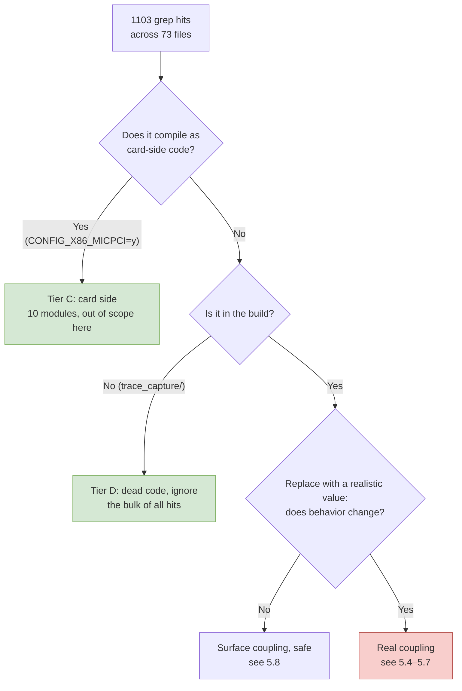
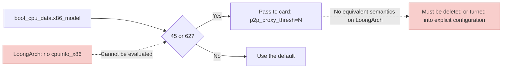
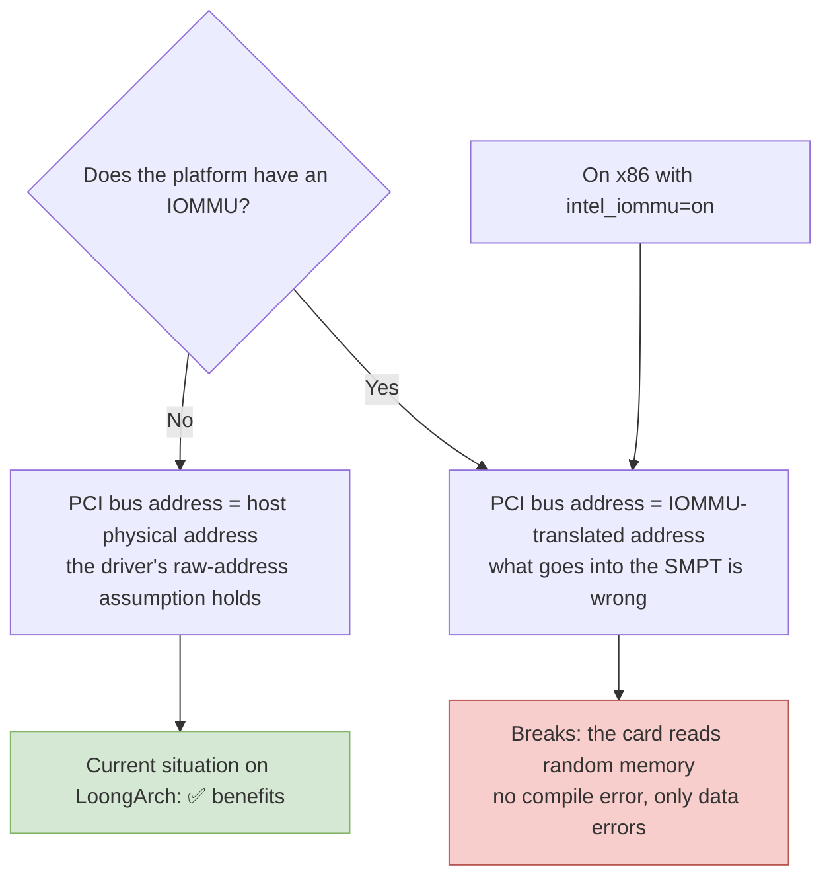

# Chapter 5 — Host Architecture Coupling: A Point-by-Point Audit

> This chapter is the technical core of the whole report. It answers one question: **in this driver, which places actually assume that "the host is x86"?** There is only one criterion — if an assumption still holds after you substitute another real-world value for it, then it is not architecture coupling.

---

## 5.1 Criteria and Tiers

The criteria have to come first, or the audit will run away from you. Something counts as "real coupling" only if it satisfies both of the following:

1. **The code directly references something that exists only on x86, or is meaningful only on x86** (a struct, a header, an instruction, a constant);
2. **After you replace that thing with a realistic value, the code's behavior changes or it no longer compiles.**

If only the first holds and not the second, that is "surface coupling"; the typical example is a local macro whose name contains `x86` but whose value has nothing to do with the architecture.



---

## 5.2 Overview of the Audit Results

Sweeping the 32,746 lines of the host path across ten dimensions produced the results below. **The "lines that must change on the host path" column is the real answer in the end.**

| Dimension | Files hit | Lines hit | Card side (not compiled) | Dead code | **Host path must change** |
|---|---:|---:|---:|---:|---:|
| 1 `asm/` header includes | 30 | 96 | 36 | 10 | **0** |
| 2 Inline assembly | 5 | 24 | 4 | 17 | **3 lines** (see 5.3 (3)) |
| 3 x86 kernel interfaces and structs | 28 | 114 | 17 | 9 | **about 8 lines** |
| 4 Page-size assumptions | 40 | 368 | 22 | 5 | **about 6 lines** |
| 5 Physical addresses and DMA masks | 27 | 128 | 0 | 5 | **about 10 lines** |
| 6 MTRR / PAT | 2 | 122 | 0 | 122 | **0** |
| 7 MSI / interrupt routing | 10 | 33 | 11 | 0 | **0** (a kernel-version issue) |
| 8 Configuration symbols | 32 | 218 | 84 | 1 | **0** |
| 9 Card-side / host-side split | — | — | 10 modules | 1 directory | — |
| 10 Hardware protocol definitions | 15 | pure numeric macros and plain structs | — | — | **0** |

Counting rules: each row above corresponds to one extended regular expression, and hit lines are counted by whole-line match. "Card side (not compiled)" means the matching line falls inside a `.c` file in one of the 9 card-side directories listed at `Kbuild:56`–`:57`, and that file is not among the `mic-objs` at `Kbuild:62`–`:99`. "Dead code" means the matching line falls in `trace_capture/` — the only directory in the whole tree that hangs off no `obj-*` rule at all (everything outside the card-side and dead-code columns is host path). The eight rows total **1103 lines across 73 files**; the per-dimension figures come out of a single run of `_work/check05.py` and can be asserted row by row, and §C.5 of Appendix C gives the reproduction recipe. (An earlier round used a looser search expression; that record — 46 files, 1255 lines — is kept in `_work/findings/x86-coupling.md`, and this table no longer cites it.)

The one-sentence reading of this table: **of the 1103 hits, fewer than 35 lines genuinely have to change on the host path, and only one of them cannot be translated semantically** (F1), while one other fails to compile outright (F6).

---

## 5.3 Gate 1: The Instruction Set — Only Three Lines of Assembly in the Whole Tree

The conclusion of this gate is clean good news, and it rests on two independent lines of evidence.

### (1) Positive evidence from the ISA manual

The K1OM instruction set is "**a proper subset of Intel 64 plus a proprietary set of 512-bit vector extensions**", not a superset of x86-64:

| What is missing | Basis |
|---|---|
| Every instruction that operates on MMX / XMM / YMM registers | Appendix B.2, manual p.659 |
| `CMOV`, `CLFLUSH`, `MONITOR/MWAIT`, `PAUSE`, `IN/OUT`, `CMPXCHG16B`, the `FCMOV`/`FCOMI` family | Appendix B.2, p.659 |
| At the CPUID level: SSE/SSE2/SSE3/SSSE3/SSE4.1/SSE4.2 are all 0 | Table B.9/B.10, p.681–682 |
| Proprietary extensions: `zmm0`–`zmm31` (512-bit), `k0`–`k7` (16-bit masks), the proprietary **MVEX** prefix (first byte `0x62`) | §2.1, §3.1, §3.3 |

The manual has **zero hits for "EVEX"** — it was written in 2012, before AVX-512 was finalized. So the `zmm`/`k` on the card and the later AVX-512 merely **collide by name**; their byte formats are mutually incompatible.

The significance of this chain of evidence for the present port is **inverted**: it proves that the card is a self-contained machine with its own operating system and its own proprietary vector extensions. Since the on-card code is not standard x86-64, whether the host is x86 matters even less to it.

### (2) Negative evidence from the source

Searching the host path item by item, the following patterns return **zero hits across the board**:

| Search pattern | Result |
|---|---|
| `clflush` / `wbinvd` / `movnti` / `rep movs` | Zero hits on the host path (only card-side `ras/` has `wbinvd`) |
| The `lfence` / `mfence` / `sfence` instructions | Zero hits; the code uniformly uses generic barriers such as `smp_mb()` / `wmb()` / `rmb()` |
| `native_*` (`native_read_cr0`, `native_write_msr`, etc.) | Zero hits |
| `cpu_has_*` (CPU feature-bit tests) | Zero hits |
| `set_memory_uc` / `set_memory_wc` / `set_memory_wb` | Zero hits (no page-attribute changes needed) |
| `rdtsc` | Zero hits on the host path |
| `PAGE_OFFSET` / `__pa(` / `__va(` | Zero hits |
| `e820` / `mem_map` / `numa_node` probing | Zero hits |
| `_mm_*` intrinsics, `__m128` / `__m256` / `__m512` / `xmm` / `ymm` / `zmm` | Zero hits (across all 104 `.c`/`.h` files in the tree) |

Three **string exceptions** in that table have to be called out by name, or later searchers will think this audit missed something. First, `sfence` scores one hit at `micscif/micscif_api.c:1414`, but that is a comment line (`smp_wmb();` followed by `/* Sufficient or need sfence? */`); the code itself uses a generic barrier. Second, `PAGE_OFFSET` scores one hit at `micscif/micscif_smpt.c:56`, but that is the macro `_PAGE_OFFSET(x)` **defined by this driver itself**, with no relation to the kernel's `PAGE_OFFSET`; like `PAGE_ALIGN_LOW` at `:58` and `PAGE_ALIGN_HIGH` at `:59` in the same file, **a tree-wide search hits the definition only, and it is never called even once** (all three are dead macros and pose no risk whatsoever). Third, `numa_node` hits at `host/uos_download.c:664`–`:671` and `micscif/micscif_debug.c:287`, but the former is a **local variable** in the F1 block discussed in §5.4, taken from the generic `dev_to_node()` interface and unrelated to x86; the latter is merely a name in a debug string table.

**Inline assembly** is the sole exception to those zeros. Searching the whole tree for `__asm__` / `asm volatile` / `asm (` yields only **5 files and 24 lines**, distributed as follows:

| Location | Lines | Belongs to |
|---|---:|---|
| `trace_capture/trace_capture.c`, `tc_host.c` | 17 | **Dead code**, not in any `Kbuild` |
| `ras/micras_elog.c`, `micras_main.c` | 4 | **Card side**, `obj-$(CONFIG_X86_MICPCI) += ras/` |
| `micscif/micscif_ports.c` | **3** | **Host path, hard compile-time failure** — see below |

A note on the counting rules: an earlier stage of this audit used a looser search expression and came up with "16 files, 63 lines". The great majority of those 63 lines are actually header includes of the `#include <asm/io.h>` kind (already counted under dimension 1) rather than assembly statements. This report adopts the stricter rule throughout, hence **5 files, 24 lines**; the 1103 total in §5.2 comes from the same rule. The original looser tally is kept in `_work/findings/x86-coupling.md` for reference.

The `asm/` includes are all generic headers too: `asm/io.h`, `asm/bug.h`, `asm/atomic.h`, `asm/uaccess.h`, `asm/ioctl.h`. All five of these headers exist on LoongArch (and `asm/uaccess.h` has in any case been folded into `linux/uaccess.h` in modern kernels).

> **Conclusion: at the instruction-set level, the host path has only 3 lines of x86-64 assembly left to rewrite; everything else is zero.**

### (3) The only three lines of assembly: `micscif_ports.c`

This is the spot that was **found last of all** in this audit, and the one easiest to overlook.

```c
#if 1 && (defined(__GNUC__) || defined(ICC))
	/* Three bit-manipulation functions, each containing a chunk of GNU inline assembly */
static int
__scif_ffsclr(uint64_t *word)
{
	uint64_t  big_bit = 0;
	uint64_t  field = *word;
	/* ... */
	asm volatile (
		"bsfq %1,%0\n\t"
		"jnz 1f\n\t"
		"movq $-1,%0\n"
		"jmp 2f\n\t"
		"1:\n\t"
		"btrq %2,%1\n\t"
		"2:"
		: "=r" (big_bit), "=r" (field)
		: "0" (big_bit),  "1" (field)
	);
	/* ... */
	*word = field;
	return big_bit + 1;
}
	/* ... */
static int
__scif_clrbit(uint64_t *word, uint16_t bit)
{
	uint64_t  field = *word;
	uint64_t  big_bit = bit;
	int  avl = 0;
	/* ... */
	asm volatile (
		"xorl %2,%2\n\t"
		"btrq %3,%1\n\t"
		"rcll $1,%2\n\t"
		: "=Ir" (big_bit), "=r" (field), "=r" (avl)
		: "0" (big_bit),   "1" (field),  "2" (avl)
	);
	/* ... */
	*word = field;
	return avl ? bit : 0;
}
	/* ... */
static void
__scif_setbit(uint64_t *word, uint16_t bit)
{
	uint64_t  field = *word;
	uint64_t  big_bit = bit;
	/* ... */
	asm volatile (
		"btsq %2,%1"
		: "=r" (field)
		: "0" (field), "Jr" (big_bit)
	);
	/* ... */
	*word = field;
}
#endif
```

[`micscif/micscif_ports.c:129` (`#if`), `:145`/`:170`/`:190` (the three function definitions), `:150`/`:177`/`:196` (the three `asm` blocks), `:253` (`#endif`)]

The three functions use `bsfq` (bit scan forward), `btrq` (bit test and reset), `rcll` (rotate left through carry) and `btsq` (bit test and set) respectively. These are **all x86-64 mnemonics**, and the LoongArch assembler knows none of them.

Three further points:

1. **The `#if` condition is always true.** It reads `#if 1 && (defined(__GNUC__) || defined(ICC))`. On a host the compiler is necessarily GCC or Clang, so `__GNUC__` is necessarily defined, and the **assembly branch is always taken**; there is no possibility of "falling through to the C implementation automatically".
2. **The `#else` branch is unusable.** Even if you changed the condition to `#if 0`, the C version it falls through to uses `ffsll()` — a glibc user-space function that does not exist in the kernel. So flipping the switch does not solve it.
3. **It really is in the build.** `micscif_ports.o` is written out explicitly in `mic-objs` (see Chapter 3, §3.2); this is not dead code.

The fix is direct: semantically the three functions are just "find the lowest set bit / clear the lowest set bit / take bit i and test-and-set it", and generic bit operations do the job with no performance loss at all:

| Original | Generic replacement |
|---|---|
| `bsfq` + `jnz` writing back `-1` | `__ffs64(bits)`, which returns 64 when no bit is set; normalize that to `-1` yourself |
| `btrq` | `bits &= ~(1ULL << i)`, or `clear_bit()` |
| `btsq` / `rcll` | `test_and_set_bit()` / explicit `<<` and `\|` |

**The qualitative point**: this is a **hard compile-time failure**, not a latent runtime hazard. The very first `make` on LoongArch stops right here with "unknown mnemonic". So although it is serious, it belongs to the "it shouts about itself" category — which makes it easier to handle than the silent-error couplings in 5.7 (DMA masks, the no-IOMMU assumption).


---

## 5.4 The One Coupling That Cannot Be Translated: Picking the P2P Proxy Threshold from the Intel CPU Model

This is the finding of this audit that most needs a design decision.

When `host/uos_download.c` assembles the kernel command line for the card, it reads **the host's own CPU model** and passes two parameters to the card on that basis:

```c
	pr_debug("CPU family = %d, CPU model = %d\n", boot_cpu_data.x86, boot_cpu_data.x86_model);
	if (mic_p2p_proxy_enable && (boot_cpu_data.x86==6) &&
		(boot_cpu_data.x86_model == 45 || boot_cpu_data.x86_model == 62)) {
			...
			if (boot_cpu_data.x86_model == 45)
				... /* Sandy Bridge-EP / Jaketown */
			if (boot_cpu_data.x86_model == 62)
				... /* Ivy Bridge-EP / Ivytown */ -> " p2p_proxy_thresh=..."
	}
```

[`host/uos_download.c:660`–`668`]

The semantics of this code: **when the host is an Intel Sandy Bridge-EP or Ivy Bridge-EP, the window threshold for PCIe peer-to-peer transfers needs a special setting**, because QPI and the PCIe root complex on those two CPU generations have a known efficiency problem. The code then stuffs `p2p_proxy_thresh=` into the on-card kernel command line.

This is a case where:

- `struct cpuinfo_x86` **simply does not exist** on LoongArch, so it will not compile;
- and even if you replaced it with some constant, **the semantics cannot be translated** — LoongArch has no QPI, and there is no such thing as "the peer-to-peer transfer threshold of a Jaketown-style root complex".



**Recommended handling**: delete the whole conditional block and have `p2p_proxy_thresh` come from a module parameter or the device tree instead, disabled by default. The reasoning is that a LoongArch platform will not be worse than an Ivy Bridge-EP; `p2p_proxy_thresh` is meant as throttling in the first place, so dropping it only costs you one optimization switch.

---

## 5.5 Page-Size Assumptions: Three Places, Two of Them "Conditional Risks"

On x86 the base page is 4 KB, so under the default x86 configuration these places **happen not to go wrong**. But the default page size of the 64-bit LoongArch kernel is **16 KB** (`v6.6/arch/loongarch/Kconfig:270`–`:273`), and 4 KB has to be selected explicitly; deploy with the default and the three places below go wrong. This is exactly why §7.2 of Chapter 7 gives page size a section of its own: it turns these three places from "conditional risks" into a deployment decision that has to be made up front.

Let us get the scale straight first, or later readers running a search will think this section is missing items. Searching the host path (38 objects plus 36 headers) for `PAGE_SIZE`/`PAGE_SHIFT` yields **265 lines spread over 29 files** (§5.2 dimension 4 is the same family counted under a broader rule: 40 files, 368 hits, the excess consisting of card-side files and branches that never get compiled). The overwhelming majority are round-trip conversions that are internally consistent within the host (`nr_pages << PAGE_SHIFT` and the like, swapping byte counts for page counts) or buffer lengths (`snprintf(buf, PAGE_SIZE, …)`); **not one of these needs to change** — when the page size changes they change along with it and remain identities. This section lists only the three places that carry the host page size into **a value the card can read** or into **descriptor semantics**; there are also three page macros that are defined and never called (`_PAGE_OFFSET`, `PAGE_ALIGN_LOW`, `PAGE_ALIGN_HIGH`), already named in the counting note in §5.3, and they pose no risk.

### Risk 1: PSMI page-table granularity

```c
#define MIC_PSMI_PAGE_ORDER (7)
#define MIC_PSMI_PAGE_SIZE  (PAGE_SIZE << MIC_PSMI_PAGE_ORDER)
```

[`include/mic/micpsmi.h:56`–`57`]

On a 4 KB page this is 512 KB; if the kernel is configured for 16 KB pages it becomes 2 MB, while **the on-card firmware still reads this table as 512 KB**. The fix is simple: replace `PAGE_SIZE` with the constant `(1UL << 12)`.

### Risk 2: The page number in a GTT entry

```c
	num_pages = ALIGN(num_bytes, PAGE_SIZE) >> PAGE_SHIFT;
	for (i = 0; i < num_pages; i++) {
		gtt_entry = ((uint32_t)(phy_addr >> PAGE_SHIFT) + i) << 1 | 0x1u;
		GTT_WRITE(gtt_entry, mic_ctx->mmio.va, (gtt_index + i)*sizeof(gtt_entry));
	}
```

[`host/uos_download.c:344`–`349`]

A GTT entry holds **a physical page number the card can understand**. Once the page size is not 4 KB, the page number written into it is wrong.

**The good news is that this code is never called on KNC at all** (see the notes in Chapter 2, 2.3 and 2.8: `set_pci_aperture()` is called only in the `FAMILY_ABR` branch). So for KNC this is a **dead path that needs no modification**; when porting you need only pin it down with a comment saying "ABR only", or delete the branch outright.

### Risk 3: Forcibly overriding the cache-line size

```c
/* Pre-defined L1_CACHE_SHIFT is 6 on RH and 7 on Suse */
#undef L1_CACHE_SHIFT
#define L1_CACHE_SHIFT 6
#undef L1_CACHE_BYTES
#define L1_CACHE_BYTES (1 << L1_CACHE_SHIFT)
```

[`include/mic/micscif.h:124`–`128`], plus a duplicate copy of the same definition at [`include/mic/mic_dma_md.h:87`–`91`].

The intent of both places: in the card's DMA engine descriptors, the transfer length is encoded **in units of a 64-byte cache line** [`include/mic/mic_dma_md.h:419`]:

```c
	desc->desc.memcopy.length = (size >> L1_CACHE_SHIFT);
```

Rather than depend on the kernel's `L1_CACHE_SHIFT`, the code simply nails it to 6. **If the L1 data cache line on LoongArch is also 64 bytes, this override is harmless**; if it is not, then the code has written the wrong value.

The L1 data cache line on the Loongson 3 series is 64 bytes (to be confirmed at porting time with one line: `grep -r L1_CACHE_SHIFT arch/loongarch/`). **This one must be measured on real hardware; do not assume it.**

---

## 5.6 Physical Addresses and the IOMMU Assumption: Where the Audit Most Needs a Judgment Call

In a number of places the driver takes the **DMA bus address** returned by `pci_map_single()` / `pci_map_page()` and writes it into an on-card register or into the SMPT as if it were **a host physical address**:

| Location | What the code does |
|---|---|
| `micscif/micscif_smpt.c:75` | writes `BUILD_SMPT(SNOOP_ON, dma_addr >> MIC_SYSTEM_PAGE_SHIFT)` into SBOX |
| `micscif/micscif_smpt.c:97` | the same `mic_smpt_set()` |
| `micscif/micscif_smpt.c:128` | `mic_smpt_init()`: **unconditionally builds an identity mapping for 0–512 GB** |
| `dma/mic_dma_lib.c:216` | the physical address of the DMA descriptor ring is written straight into an on-card DMA channel register |
| `include/mic/micscif_map.h:201` | an address-mapping table entry |

[`_work/findings/x86-coupling.md` category 5 and §16.1 F5]

All of these places share one premise:

$$
\text{PCI bus address} \;=\; \text{host physical address}
$$

On x86 this equation holds provided **there is no DMAR (IOMMU) behind PCIe**. And **LoongArch currently has no usable IOMMU**, so the equation **holds just as well** on LoongArch.



The absence of an IOMMU on LoongArch is bad news for **most drivers** and good news for **this driver**, because its authors treated "host physical address" as an address visible to the card from the very beginning and never once considered an IOMMU.

But this judgment carries two caveats that have to be spelled out:

1. **If LoongArch gains an IOMMU in the future and it is enabled by default**, this code breaks immediately, and the symptom is the card reading and writing random memory rather than a compile error. So when porting, add comments at these locations stating explicitly "this line assumes no IOMMU translation".
2. **If a LoongArch IOMMU were used in a passthrough domain** (no translation), the equation holds just the same. This can be written into the documentation as a deployment constraint.

---

## 5.7 PCI Topology, Cache Attributes and MSI-X

### Parameters and topology

| Location | Content | Assessment |
|---|---|---|
| `host/linux.c:290`, `:299` | BAR0 = card memory window, BAR4 = register window | Generic; the BAR numbering is decided by the card, not by the host |
| `host/linux.c:292`, `:301` | `request_mem_region(resource_size_t, …)` | LoongArch is a 64-bit kernel and `resource_size_t` is 64-bit, so this is sufficient |
| `host/linux.c:274`–`278` | Forces a 64-bit DMA mask, **with no 32-bit fallback** | See the separate discussion below |
| `host/linux.c:480`–`519` | 15 PCI device IDs | Generic |
| `host/uos_download.c:649` | Writes `crashkernel=1M@80M` into the on-card command line | This is an x86-64 kernel parameter written **on the card**, unrelated to the host |

### The 64-bit DMA mask has no fallback path (high risk)

```c
	err = pci_set_dma_mask(pdev, DMA_BIT_MASK(64));
	if (err) {
		printk("mic %d: ERROR DMA not available\n", brdnum);
		goto probe_freebd;
	}
```

[`host/linux.c:274`–`278`]

This code is a **hard failure**: if the PCIe host controller does not declare support for 64-bit DMA, probing stops there with no fallback at all. LoongArch is a pure 64-bit platform and in theory must support it, but this has to be confirmed on a real machine — because it is one of the likeliest points of load failure.

### MSI-X has a switch, and a fallback

The `msi` module parameter defaults to on [`host/linux.c:83`]. Even if the MSI-X request fails, the code still has a fallback path:

```c
	if (!mic_ctx->msie)
		if ((err = request_irq(mic_ctx->bi_pdev->irq, mic_irq_isr,
				       IRQF_SHARED, "mic", mic_ctx)) != 0) {
```

[`host/linux.c:347`–`352`]. So MSI-X is not a hard requirement; either `msi=0` or a failed MSI-X request can fall back to the legacy interrupt line.

### Write-combining mapping (a performance matter, not correctness)

```c
	mic_ctx->aper.va = ioremap_wc(mic_ctx->aper.pa, mic_ctx->aper.len);
```

[`host/uos_download.c:1156`, `:1546`]

The 8 GiB window is mapped write-combining in one go (`host/uos_download.c:1156`, `:1546`). On x86 this is achieved through PAT; on LoongArch the degradation of this call is **a certainty**, no longer a matter of speculation — `ioremap_wc()` is simply a macro there [`v6.6/arch/loongarch/include/asm/io.h:55`–`57`]:

```c
#define ioremap_wc(offset, size)	\
	ioremap_prot((offset), (size),	\
		pgprot_val(wc_enabled ? PAGE_KERNEL_WUC : PAGE_KERNEL_SUC))
```

That is to say, by default (`wc_enabled` false) those 8 GiB are mapped strongly-ordered uncached (SUC) rather than write-combining. The consequence is lower throughput when copying the boot image, **not a correctness problem**. A parallel question is whether the LoongArch kernel is willing to `ioremap` 8 GiB in one shot; that belongs to Chapter 7.

The next spot is `pgprot_writecombine()` [`micscif/micscif_api.c:2991`], used to map card memory into user space. Its actual behavior is the opposite of intuition: **the LoongArch kernel does implement `pgprot_writecombine()`** ([`v6.6/arch/loongarch/include/asm/pgtable-bits.h:110`–`119`]), so there is no missing symbol and no compile error; but its body is:

```c
	prot = (prot & ~_CACHE_MASK) | (wc_enabled ? _CACHE_WUC : _CACHE_SUC);
```

[`v6.6/arch/loongarch/include/asm/pgtable-bits.h:116`]. That is, when `wc_enabled` is false it quietly returns `_CACHE_SUC`, exactly equivalent to `pgprot_noncached()` (same file, `:97`–`106`). And the initial value of `wc_enabled` depends on `config ARCH_WRITECOMBINE` ([`v6.6/arch/loongarch/kernel/setup.c:164`/`:166`]), whose Kconfig help already spells it out:

```
	  This means WUC can only used for write-only memory regions now, so
	  this option is disabled by default, making WUC silently fallback to
	  SUC for ioremap(). You can enable this option if the kernel is ensured
	  to run on hardware without this bug.
```

[`v6.6/arch/loongarch/Kconfig:488`–`491`]. This is exactly the class Chapter 7 files under "silent degradation": **it compiles, it loads, it is merely slow**. Fortunately it needs no code change, only a single `writecombine=on` on the kernel command line — the LoongArch kernel registers a boot parameter specifically for it ([`v6.6/arch/loongarch/Kconfig:493`, `v6.6/arch/loongarch/kernel/setup.c:171`–`182`]):

```
	early_param("writecombine", setup_writecombine);
```

There is a real prerequisite here: according to the help text, the LS7A WUC defect "may be fixed in newer chipsets" ([`v6.6/arch/loongarch/Kconfig:485`–`486`]). If enabling WUC on a real machine produces data errors, then the only option is to accept the download-performance penalty of SUC, not to fall back to x86 or change the code. Chapter 11 lists this as one item on the must-test checklist.

---

## 5.8 Surface Coupling That Is Actually Safe (A Guard Against False Positives)

The following places are very easily misreported as blockers and must be explicitly ruled out:

1. **`#define _PAGE_OFFSET(x)` at `micscif/micscif_smpt.c:56`** — this is a macro **defined locally** by the source, with no relation whatsoever to the x86 `_PAGE_OFFSET`.
2. **`>>12` / `<<12` at `host/tools_support.c:135,159,193,283`** — these are a **hard-coded constant 12**, not `PAGE_SHIFT`; they are the card-side physical-address bit field (`io_interface.h:213 image_addr:20`) and have nothing to do with the host page size.
3. **`kzalloc(size + PAGE_SIZE)` and `ALIGN(ptr, PAGE_SIZE)` at `dma/mic_dma_lib.c:207`–`211`** — pure alignment; the larger the page, the stricter it gets, and it is always safe.
4. **`MIC_SYSTEM_PAGE_SHIFT 34` and `MIC_SYSTEM_PAGE_SIZE 0x0400000000`** — this is the 16 GB granularity of the KNC hardware protocol, a different thing entirely from the host page size (see Chapter 2, 2.5).
5. **Every `snprintf(buf, PAGE_SIZE, …)`** — the buffer comes from the same kernel, so it is self-consistent by construction.
6. **All `SBOX_*` / `DBOX_*` / `GTT_*` register offsets and ring-buffer structs** — pure numeric macros and plain POD structs, with zero x86 dependency.
7. **`CONFIG_X86_MICPCI` in `Kbuild`** — it has x86 in the name, but it is merely a build switch MPSS invented for itself; on LoongArch it is naturally empty, which lands it in the host branch.
8. **The 15 device IDs at `host/linux.c:480`–`519`** — unrelated to the host ISA.

---

## 5.9 x86 Coupling in Card-Side Code: Never a Blocker

The card-side modules do contain a great deal of genuine x86 code: `ras/` has `cpuid`, `rdtsc`, `rdmsr`, `wbinvd`, the private `asm/mic/*` headers, `asm/apic.h` and `asm/mce.h`; `vcons/` references `asm/xmon.h`; and the build script says `CROSS_COMPILE = x86_64-$(ARCH)-linux-`.

**None of this blocks anything**, for the reason given by these two lines in `Kbuild`:

```makefile
obj-$(CONFIG_X86_MICPCI) += dma/ micscif/ pm_scif/ ras/
obj-$(CONFIG_X86_MICPCI) += vcons/ vnet/ mpssboot/ ramoops/ virtio/
```

On a LoongArch host `CONFIG_X86_MICPCI` is empty, and these subdirectories **never enter the build at all**. They are always compiled by `x86_64-k1om-linux-gcc` and run on the card.

**The one thing to watch** is that this code and the host code **sit mixed together in the same source files**, split apart by `#ifdef _MIC_SCIF_`. For example `include/mic/micscif_map.h:61`/`:147`/`:274` each split into two halves, with the host taking the `#else` branch. When porting, make sure only the host half is compiled and that the `_MIC_SCIF_` macro is not accidentally defined. The corresponding definition in `Kbuild` is:

```makefile
subdir-ccflags-$(CONFIG_X86_MICPCI) += -D_MIC_SCIF_
```

As long as `CONFIG_X86_MICPCI` is not set, `_MIC_SCIF_` and `HOST` come out right automatically.

Intel itself knew how unreliable this macro scheme is, and wrote that self-awareness into the build file [`Kbuild:34`–`35`]:

```makefile
# Code common with the host mustn't use CONFIG_M[LK]1OM directly.
# But of course it does anyway. Arrgh.
```

Which is to say: "Code shared with the host was never supposed to use `CONFIG_M[LK]1OM` directly. But of course it does anyway. Arrgh." — so every `#ifdef CONFIG_MK1OM` in the card-side source must be reviewed one by one as a suspect, and not treated as a reliable platform criterion. This is why this section settles on `CONFIG_X86_MICPCI` as the only criterion.

**One build detail that is easy to get wrong.** `Kbuild:38`–`43` injects `-DCONFIG_MK1OM` based on `MIC_CARD_ARCH`:

```makefile
ifeq ($(MIC_CARD_ARCH),k1om)
subdir-ccflags-y += -DMIC_IS_K1OM -DCONFIG_MK1OM
endif
```

That is, `-DCONFIG_MK1OM` is injected **only when compiling for the KNC card side**. Read in isolation, `#ifdef CONFIG_MK1OM` is easily taken as a synonym for "I am compiling card-side code", but what it really means is "the target card is KNC". At the moment the two happen to coincide, so nothing goes wrong; the moment you configure the same source into a different shape, that coincidence breaks. The **only reliable basis for deciding "am I the host or the card" is `CONFIG_X86_MICPCI`**.

---

## 5.10 The Must-Change List

Everything above collapses into a single work list. Table (a) gives the genuine architecture coupling, category (b) gives the architecture-independent kernel-interface debt (too numerous to list here, so it moves to Chapter 6, family by family), and table (c) lists the parts that definitely do not have to move. Lists (a), (b) and (c) together are the basis for [Chapter 8 — Migration Roadmap](08-migration-roadmap.md).

### (a) Genuine architecture coupling (code must change)

| ID | Location | Problem | Fix | Size |
|---|---|---|---|---|
| **F1** | `host/uos_download.c:660`–`675` | Uses `boot_cpu_data.x86` and `x86_model` to recognize "the host is Intel family 6, model 45 or 62" — those two platform generations (the comment at `:651` names Jaketown and Ivytown) — and passes `p2p_proxy_thresh=` / `numa_node=` on that basis | Delete the conditional; take it from a module parameter or the device tree | about 15 lines |
| **F7** | `host/linscif_host.c:292` | Calls `slow_virt_to_phys()`: an x86-only symbol, declared at `v6.6/arch/x86/include/asm/pgtable_types.h:570`, defined together with its `EXPORT_SYMBOL_GPL` at `v6.6/arch/x86/mm/pat/set_memory.c:763`/`:795`; it does not exist in the LoongArch kernel (`v6.6/include/asm-generic/io.h`, `v6.6/arch/loongarch/include/asm/io.h`, `v6.6/include/linux/mm.h`, `v6.6/include/linux/vmalloc.h` all return 0 hits, and even the generic `vmalloc_to_phys()` is not provided) | No new implementation needed: delete the `#if (LINUX_VERSION_CODE >= KERNEL_VERSION(3,9,0))` at `:290` and let the existing `vmalloc_to_page()` branch at `:296`–`299` become the only path (that path is the generic idiom anyway) | 2 lines |
| **F6** | `micscif/micscif_ports.c:129`, `:150`, `:177`, `:196` | x86-64 inline assembly `bsfq` / `btrq` / `btsq` / `rcll`, with the `#if` always true and the `#else` using glibc's `ffsll()` | Rewrite the three functions using generic bit operations such as `__ffs64` / `clear_bit` / `test_and_set_bit` | 3 lines |
| **F3** | `include/mic/micpsmi.h:56`–`57` | PSMI page-table granularity written as `PAGE_SIZE << 7` | Change to a fixed `(1UL << 12) << 7` | 2 lines |
| **F4** | `host/uos_download.c:344`–`349` | GTT entries use host page numbers | Never called on KNC; pin it down with a comment, or change to a fixed 12 | 2 lines (or 0) |
| **F5** | `micscif/micscif_smpt.c:75,97,128`, `dma/mic_dma_lib.c:216` | Uses PCI mapping results as physical addresses, implicitly assuming no IOMMU | Keep it; but the premise must be written down in a comment, and the platform confirmed to have no IOMMU | 0 lines + a deployment constraint |
| **H2** | `include/mic/micscif.h:124`–`128`, `include/mic/mic_dma_md.h:87`–`91` | Forcibly `#define L1_CACHE_SHIFT 6` | Verify that the LoongArch L1 cache line really is 64 bytes; reference the kernel definition and add a static assertion | about 6 lines |
| **H1** | `host/linux.c:274`–`278` | 64-bit DMA mask with no fallback | Keep it (LoongArch is a 64-bit platform), but it must be verified on real hardware first | 0 lines |
| **H3** | `host/uos_download.c:1156`, `:1546` | The 8 GiB card memory window is mapped with `ioremap_wc()`, but on LoongArch `ioremap_wc()` collapses straight to SUC when `wc_enabled` is false (`v6.6/arch/loongarch/include/asm/io.h:55`–`:57`) | No code change; add `writecombine=on` to the boot parameters, provided the chipset has fixed that WUC coherency defect (`v6.6/arch/loongarch/Kconfig:479`–`:493`) | 0 lines + a boot parameter |
| **H4** | `micscif/micscif_api.c:2991` | Same switch as H3: when `pgprot_writecombine()` returns SUC, the attributes of the card-memory mapping handed to user space degrade with it | Same as above | 0 lines |

### (b) Kernel-interface generational debt (architecture-independent, but equally mandatory)

This category has **nothing to do with** the host architecture — move the same code onto an x86 machine, upgrade the kernel to 6.x, and every one of them still has to be changed. But they are just as mandatory, so they cannot be dropped on the grounds of being "architecture-independent". The family-by-family list, with each family's call sites and replacement interfaces, is in [Chapter 6 — Kernel API Drift](06-kernel-api-drift.md).

### (c) Things that definitely do not need changing

| Item | Conclusion |
|---|---|
| All card-side modules (9 directories, 10 modules, 24 source files, 20,232 lines) | Not compiled, not modified |
| `trace_capture/` (5 source files, 2,797 lines) | Dead code; the build does not include it at all, and it is not compiled even for the card |
| All register offsets and protocol structs | Pure numbers; must stay exactly as they are |
| The PCI device ID table | Generic |
| SCIF ring buffers, scatter-gather and address-generation algorithms | Architecture-independent |

---

## 5.11 Chapter Summary

Four sentences:

1. **Only three hard couplings remain at the architecture level.** Of the 1103 grep hits across 73 files, three genuinely relate to the host architecture: `boot_cpu_data` (F1, a semantic dead end), `slow_virt_to_phys` (F7, an x86-only symbol), and the three lines of x86-64 assembly in `micscif_ports.c` (F6, which breaks at compile time). F6 and F7 are both loud failures that stop at compile time, and only F1 needs a human decision; every other hit is card-side code, dead code, or generic idiom unrelated to the architecture.
2. **The `boot_cpu_data` spot is a semantic dead end: it can only be deleted or turned into explicit configuration, never replaced by some other constant.** F6 and F7 merely need work done, they are not conceptually hard — F7 especially so, since the generic implementation is already sitting in the same function (`host/linscif_host.c:296`–`299`). F1 is the only one that genuinely requires human judgment.
3. **The absence of an IOMMU on LoongArch is good news for this driver.** Five places in the driver use bus addresses as physical addresses, and on a platform with no IOMMU that conclusion holds. But it must be written down as an explicit constraint, or the day an IOMMU appears it will become the worst failure mode of all: no compile error, just random data errors.
4. **Anything silent is more dangerous than anything that reports an error.** This chapter's risk ranking follows that principle: F5 (the no-IOMMU assumption) and H1 (the 64-bit DMA mask) come first, while F6, which fails to compile outright, ranks behind them.

The next chapter lists this batch of "architecture-independent but mandatory" kernel-interface debt item by item.
