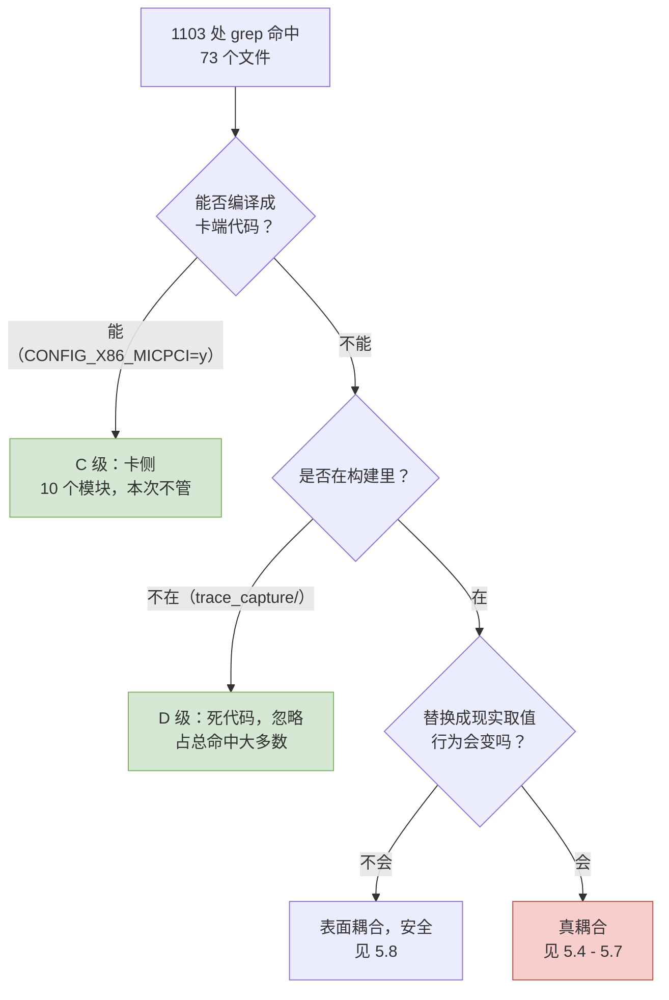
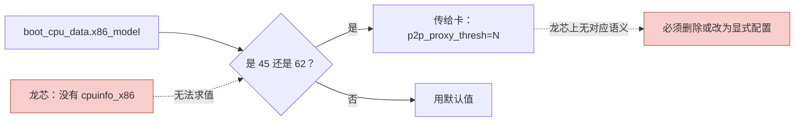
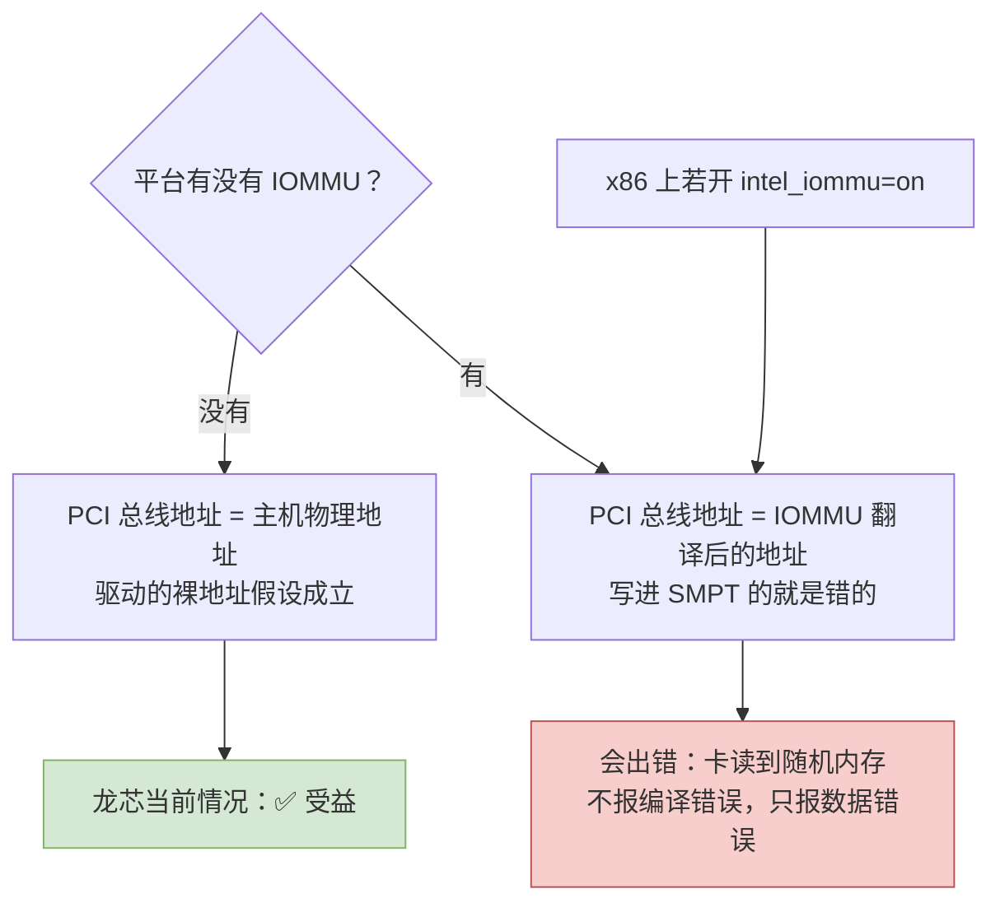

# 第五章　主机架构耦合逐点审计

> 　本章是全报告的技术核心。它回答一个问题：**这份驱动里，究竟哪些地方真的假设了「主机是 x86」？**判据只有一条——如果某个假设把它自己替换成现实世界的其他数值后，代码仍然成立，那它就不是架构耦合。

---

## 5.1　判据与分级

　　判据必须写在前面，否则审计会失控。同时满足下面两条的，才算「真耦合」：

1. **代码直接引用了只在 x86 上存在或只在 x86 上有意义的东西**（结构体、头文件、指令、常量）；
2. **把这个东西换成现实取值后，代码的行为会变或者编译不过。**

　　只满足第 1 条不满足第 2 条的，是「表面耦合」，典型例子是变量名里带 `x86` 但值本身与架构无关的局部宏。



---

## 5.2　审计结果总览

　　按十个维度把 32,746 行主机路径扫了一遍，结果如下。**「必改行数」是最后真正的答案。**

| 维度 | 命中文件 | 命中行 | 卡侧（不编译） | 死代码 | **主机路径必改** |
|---|---:|---:|---:|---:|---:|
| 1　`asm/` 头文件包含 | 30 | 96 | 36 | 10 | **0** |
| 2　内联汇编 | 5 | 24 | 4 | 17 | **3 行**（见 5.3 三） |
| 3　x86 内核接口与结构体 | 28 | 114 | 17 | 9 | **约 8 行** |
| 4　页大小假设 | 40 | 368 | 22 | 5 | **约 6 行** |
| 5　物理地址与 DMA 掩码 | 27 | 128 | 0 | 5 | **约 10 行** |
| 6　MTRR / PAT | 2 | 122 | 0 | 122 | **0** |
| 7　MSI / 中断路由 | 10 | 33 | 11 | 0 | **0**（属内核版本问题） |
| 8　配置符号 | 32 | 218 | 84 | 1 | **0** |
| 9　卡侧 / 主机侧切分 | — | — | 10 个模块 | 1 个目录 | — |
| 10　硬件协议定义 | 15 | 纯数值宏与纯结构体 | — | — | **0** |

　　口径：上表每一行对应一条扩展正则，命中行按整行匹配计数；「卡侧（不编译）」是匹配行落在 `Kbuild:56`–`:57` 列出的 9 个卡侧目录内的 `.c`、且该文件不在 `Kbuild:62`–`:99` 的 `mic-objs` 里；「死代码」是匹配行落在 `trace_capture/` —— 那是全树唯一不挂在任何 `obj-*` 规则下的目录（卡侧与死代码两列之外的都是主机路径）。八行合计 **1103 行、73 个文件**，逐维数据由 `_work/check05.py` 一次跑出并可逐条断言，复现办法见附录 C 的 §C.5。（更早一轮用过更松的检索式，那份记录是 46 个文件、1255 行，留在 `_work/findings/x86-coupling.md`，本表不再引用它。）

　　一句话读这张表：**1103 处命中里，真正必须在主机路径上修改的不到 35 行，而其中只有一项在语义上无法翻译**（F1），另有一项会直接编译失败（F6）。

---

## 5.3　第一关：指令集 —— 全树只有三行汇编

　　这一关的结论是干净的好消息，而且有双重证据。

### （一）来自 ISA 手册的正面证据

　　K1OM 的指令集是「**Intel 64 的真子集 + 一套私有 512 位向量扩展**」，不是 x86-64 的超集：

| 缺失项 | 依据 |
|---|---|
| MMX / XMM / YMM 寄存器的一切指令 | 附录 B.2，手册 p.659 |
| `CMOV`、`CLFLUSH`、`MONITOR/MWAIT`、`PAUSE`、`IN/OUT`、`CMPXCHG16B`、`FCMOV`/`FCOMI` 系列 | 附录 B.2，p.659 |
| CPUID 层面：SSE/SSE2/SSE3/SSSE3/SSE4.1/SSE4.2 全为 0 | Table B.9/B.10，p.681–682 |
| 私有扩展：`zmm0`–`zmm31`（512 位）、`k0`–`k7`（16 位掩码）、私有 **MVEX** 前缀（首字节 `0x62`） | §2.1、§3.1、§3.3 |

　　手册全文 **「EVEX」 零命中**——它成稿于 2012 年，早于 AVX-512 定稿。所以卡上的 `zmm`/`k` 与后来的 AVX-512 只是**名字撞车**，字节格式互不兼容。

　　这条证据链对本次移植的意义是**反向的**：它证明卡是一台自带操作系统、自带私有向量扩展的独立机器。既然卡上代码不是标准 x86-64，那么「主机是不是 x86」对它就更没有关系了。

### （二）来自源码的负面证据

　　在主机路径里逐项检索，以下模式**全部零命中**：

| 检索项 | 结果 |
|---|---|
| `clflush` / `wbinvd` / `movnti` / `rep movs` | 主机路径零命中（仅卡侧 `ras/` 有 `wbinvd`） |
| `lfence` / `mfence` / `sfence` 指令 | 零命中；代码统一用 `smp_mb()` / `wmb()` / `rmb()` 这类通用栅栏 |
| `native_*`（`native_read_cr0`、`native_write_msr` 等） | 零命中 |
| `cpu_has_*`（CPU 特性位判断） | 零命中 |
| `set_memory_uc` / `set_memory_wc` / `set_memory_wb` | 零命中（不用改页属性） |
| `rdtsc` | 零命中于主机路径 |
| `PAGE_OFFSET` / `__pa(` / `__va(` | 零命中 |
| `e820` / `mem_map` / `numa_node` 探测 | 零命中 |
| `_mm_*` 内联函数、`__m128` / `__m256` / `__m512` / `xmm` / `ymm` / `zmm` | 零命中（全树 104 个 `.c`/`.h`） |

　　这张表里有三处**字串例外**，必须点名，否则后来的检索者会以为本审计漏了东西。第一，`sfence` 在 `micscif/micscif_api.c:1414` 命中一次，但那是一行注释（`smp_wmb();` 后面跟着 `/* Sufficient or need sfence? */`），代码本身用的是通用栅栏。第二，`PAGE_OFFSET` 在 `micscif/micscif_smpt.c:56` 命中一次，但那是这份驱动**自己定义的**宏 `_PAGE_OFFSET(x)`，与内核的 `PAGE_OFFSET` 无关；它跟同文件 `:58` 的 `PAGE_ALIGN_LOW`、`:59` 的 `PAGE_ALIGN_HIGH` 一样，**全树检索只有定义处命中、一次都没被调用过**（这三个是死宏，不构成任何风险）。第三，`numa_node` 在 `host/uos_download.c:664`–`:671` 与 `micscif/micscif_debug.c:287` 命中，但前者是 §5.4 讲的 F1 那段里的**局部变量**，取自通用接口 `dev_to_node()`，与 x86 无关；后者只是一个调试字符串表里的名字。

　　唯独**内联汇编**不是零。全树以 `__asm__` / `asm volatile` / `asm (` 检索，只有 **5 个文件 24 行**，分布如下：

| 位置 | 行数 | 归属 |
|---|---:|---|
| `trace_capture/trace_capture.c`、`tc_host.c` | 17 | **死代码**，不在任何 `Kbuild` 里 |
| `ras/micras_elog.c`、`micras_main.c` | 4 | **卡侧**，`obj-$(CONFIG_X86_MICPCI) += ras/` |
| `micscif/micscif_ports.c` | **3** | **主机路径，编译期硬失败**——见下 |

　　口径说明：本次审计在早期用过一个更宽松的检索式，得到「16 个文件 63 行」。那 63 行里绝大多数其实是 `#include <asm/io.h>` 一类的头包含（已经计入维度 1），而非汇编语句。本报告统一采用较严的口径，故为 **5 个文件 24 行**；§5.2 的总数 1103 也出自这个口径。原始宽松统计留在 `_work/findings/x86-coupling.md` 备查。

　　`asm/` 系列的包含也全部是通用头：`asm/io.h`、`asm/bug.h`、`asm/atomic.h`、`asm/uaccess.h`、`asm/ioctl.h`。LoongArch 上这五个头都存在（其中 `asm/uaccess.h` 在现代内核里已统一到 `linux/uaccess.h`）。

> **结论：指令集层面，主机路径只剩 3 行 x86-64 汇编要重写，其余为 0。**

### （三）唯一的三行汇编：`micscif_ports.c`

　　这是本次审计中**最后一处才被发现**、也最容易被漏掉的地方。

```c
#if 1 && (defined(__GNUC__) || defined(ICC))
	/* 三个位操作函数，各含一段 GNU 内联汇编 */
static int
__scif_ffsclr(uint64_t *word)
{
	uint64_t  big_bit = 0;
	uint64_t  field = *word;
	/* ... */
	asm volatile (
		"bsfq %1,%0\n\t"
		"jnz 1f\n\t"
		"movq $-1,%0\n"
		"jmp 2f\n\t"
		"1:\n\t"
		"btrq %2,%1\n\t"
		"2:"
		: "=r" (big_bit), "=r" (field)
		: "0" (big_bit),  "1" (field)
	);
	/* ... */
	*word = field;
	return big_bit + 1;
}
	/* ... */
static int
__scif_clrbit(uint64_t *word, uint16_t bit)
{
	uint64_t  field = *word;
	uint64_t  big_bit = bit;
	int  avl = 0;
	/* ... */
	asm volatile (
		"xorl %2,%2\n\t"
		"btrq %3,%1\n\t"
		"rcll $1,%2\n\t"
		: "=Ir" (big_bit), "=r" (field), "=r" (avl)
		: "0" (big_bit),   "1" (field),  "2" (avl)
	);
	/* ... */
	*word = field;
	return avl ? bit : 0;
}
	/* ... */
static void
__scif_setbit(uint64_t *word, uint16_t bit)
{
	uint64_t  field = *word;
	uint64_t  big_bit = bit;
	/* ... */
	asm volatile (
		"btsq %2,%1"
		: "=r" (field)
		: "0" (field), "Jr" (big_bit)
	);
	/* ... */
	*word = field;
}
#endif
```

　　[`micscif/micscif_ports.c:129`（`#if`）、`:145`／`:170`／`:190`（三个函数定义）、`:150`／`:177`／`:196`（三处 `asm`）、`:253`（`#endif`）]

　　三个函数分别用了 `bsfq`（位扫描前向）、`btrq`（位测试并复位）、`rcll`（带进位循环左移）、`btsq`（位测试并置位）。它们**全部是 x86-64 助记符**，LoongArch 汇编器一个都不认识。

　　另有三件事：

1. **`#if` 条件恒真。**条件写成 `#if 1 && (defined(__GNUC__) || defined(ICC))`。主机上编译器必然是 GCC 或 Clang，`__GNUC__` 必然定义，所以**永远走汇编分支**，不存在「自动落到 C 实现」的可能。
2. **`#else` 分支不可用。**假使把条件改成 `#if 0`，落到的 C 版本用的是 `ffsll()`——这是 glibc 用户态函数，内核里没有。所以不能靠翻开关解决。
3. **它确实在构建里。**`micscif_ports.o` 明写在 `mic-objs` 中（见第三章 3.2），不是死代码。

　　修法很直接：三个函数在语义上就是「找最低置位 / 清最低置位 / 取第 i 位并测试置位」，用通用位操作即可，完全不损失性能：

| 原写法 | 通用改法 |
|---|---|
| `bsfq` + `jnz` 回填 `-1` | `__ffs64(bits)`，空位时返回 64，再自行归一为 `-1` |
| `btrq` | `bits &= ~(1ULL << i)`，或 `clear_bit()` |
| `btsq` / `rcll` | `test_and_set_bit()` / 显式 `<<` 与 `\|` |

　　**质变点**：这是一处**编译期硬失败**，不是运行期隐患。龙芯上第一次 `make` 就会在这里停住，报「unknown mnemonic」。所以它虽然严重，却属于「自己会喊出来」的那一类——比 5.7 里那些静默错误的耦合（DMA 掩码、无 IOMMU 假设）反而更好对付。


---

## 5.4　唯一无法翻译的耦合：用 Intel CPU 型号决定 P2P 代理阈值

　　这是本次审计挖出的最需要方案决策的一处。

　　`host/uos_download.c` 在给卡拼内核命令行时，会读**主机自己的 CPU 型号**，据此给卡传两个参数：

```c
	pr_debug("CPU family = %d, CPU model = %d\n", boot_cpu_data.x86, boot_cpu_data.x86_model);
	if (mic_p2p_proxy_enable && (boot_cpu_data.x86==6) &&
		(boot_cpu_data.x86_model == 45 || boot_cpu_data.x86_model == 62)) {
			...
			if (boot_cpu_data.x86_model == 45)
				... /* Sandy Bridge-EP / Jaketown */
			if (boot_cpu_data.x86_model == 62)
				... /* Ivy Bridge-EP / Ivytown */ -> " p2p_proxy_thresh=..."
	}
```

　　[`host/uos_download.c:660`–`668`]

　　这段代码的语义是：**当主机是 Intel Sandy Bridge-EP 或 Ivy Bridge-EP 时，PCIe 对等传输的窗口阈值需要特殊设置**，因为这两代 CPU 的 QPI 与 PCIe 根复合体有已知的效率问题。它随后会把 `p2p_proxy_thresh=` 塞进卡上内核的命令行。

　　这是：

- `struct cpuinfo_x86` 在 LoongArch 上**根本不存在**，编译就过不去；
- 即便把它改成某个常量，**语义也无法翻译**——龙芯没有 QPI，也没有「Jaketown 那种根复合体的对等传输阈值」这回事。



　　**建议的处理方式**：把这段判断整段删除，改成由模块参数或设备树给出 `p2p_proxy_thresh`，默认关闭。理由是龙芯平台不会比 Ivy Bridge-EP 更差；`p2p_proxy_thresh` 的本意是节流，去掉只是少了一个优化开关。

---

## 5.5　页大小假设：三处，其中两处是「条件性风险」

　　在 x86 上基础页是 4 KB，所以这几处在 x86 默认配置下**恰好不出错**。但龙芯 64 位内核的默认页是 **16 KB**（`v6.6/arch/loongarch/Kconfig:270`–`:273`），4 KB 要显式选；如果按默认值部署，下面三处就会出错。这正是第七章 §7.2 把页大小单列一节的原因：它把这三处从「条件性风险」变成必须先做的一个部署决定。

　　先把规模说清，否则后来者一检索就会以为本节漏了账：按 `PAGE_SIZE`／`PAGE_SHIFT` 在主机路径（38 个对象加 36 个头文件）上检索，命中 **265 行、散布在 29 个文件**里（§5.2 维度 4 是同一族在更宽口径下的统计：40 个文件 368 处，多出来的部分含卡侧文件与不参与编译的分支）。绝大多数是主机内部自洽的往返换算（`nr_pages << PAGE_SHIFT` 这类字节数与页数互换）或缓冲区长度（`snprintf(buf, PAGE_SIZE, …)`），**这些一处都不用改** —— 页大小换了，它们跟着一起换，仍然是恒等式。本节只列三处把主机页大小带进**卡能读到的值**或**描述符语义**的地方；另有三个只定义、从未被调用的页宏（`_PAGE_OFFSET`、`PAGE_ALIGN_LOW`、`PAGE_ALIGN_HIGH`），已在 §5.3 的口径说明里点名，它们不构成风险。

### 风险一：PSMI 页表粒度

```c
#define MIC_PSMI_PAGE_ORDER (7)
#define MIC_PSMI_PAGE_SIZE  (PAGE_SIZE << MIC_PSMI_PAGE_ORDER)
```

　　[`include/mic/micpsmi.h:56`–`57`]

　　在 4 KB 页上这是 512 KB；如果内核按 16 KB 配页，它就变成 2 MB，而**卡上固件仍然按 512 KB 理解这张表**。修法很简单：把 `PAGE_SIZE` 换成常量 `(1UL << 12)`。

### 风险二：GTT 表项的页号

```c
	num_pages = ALIGN(num_bytes, PAGE_SIZE) >> PAGE_SHIFT;
	for (i = 0; i < num_pages; i++) {
		gtt_entry = ((uint32_t)(phy_addr >> PAGE_SHIFT) + i) << 1 | 0x1u;
		GTT_WRITE(gtt_entry, mic_ctx->mmio.va, (gtt_index + i)*sizeof(gtt_entry));
	}
```

　　[`host/uos_download.c:344`–`349`]

　　GTT 表项里装的是**卡能理解的物理页号**。页大小一旦不是 4 KB，写进去的页号就错了。

　　**好消息是这段代码在 KNC 上根本不会被调用**（见第二章 2.3 与 2.8 的说明：`set_pci_aperture()` 只在 `FAMILY_ABR` 分支里被调用）。所以对 KNC 而言这是一个**不必修改的死路径**，移植时只需加一节注释锁死「仅 ABR 使用」，或直接删除该分支。

### 风险三：强行改写缓存行尺寸

```c
/* Pre-defined L1_CACHE_SHIFT is 6 on RH and 7 on Suse */
#undef L1_CACHE_SHIFT
#define L1_CACHE_SHIFT 6
#undef L1_CACHE_BYTES
#define L1_CACHE_BYTES (1 << L1_CACHE_SHIFT)
```

　　[`include/mic/micscif.h:124`–`128`]，以及同一份定义在 [`include/mic/mic_dma_md.h:87`–`91`] 的重复副本。

　　这两处的用意是：卡上 DMA 引擎的描述符里，传输长度是以 **64 字节 cache line 为单位**编码的 [`include/mic/mic_dma_md.h:419`]：

```c
	desc->desc.memcopy.length = (size >> L1_CACHE_SHIFT);
```

　　代码为了不依赖内核的 `L1_CACHE_SHIFT`，干脆自己钉死成 6。**如果龙芯的 L1 数据缓存行也是 64 字节，这个覆盖就是无害的**；如果不是，那反而写错了。

　　龙芯 3 号系列的 L1 数据缓存行是 64 字节（需在移植时用一行代码核实：`grep -r L1_CACHE_SHIFT arch/loongarch/`）。**这一项必须实测，不能想当然。**

---

## 5.6　物理地址与 IOMMU 假设：整个审计里最需要判断的一处

　　驱动里有一批地方，把 `pci_map_single()` / `pci_map_page()` 返回的 **DMA 总线地址**直接当成**主机物理地址**写进卡上寄存器或 SMPT：

| 位置 | 代码在做什么 |
|---|---|
| `micscif/micscif_smpt.c:75` | `BUILD_SMPT(SNOOP_ON, dma_addr >> MIC_SYSTEM_PAGE_SHIFT)` 写进 SBOX |
| `micscif/micscif_smpt.c:97` | 同一个 `mic_smpt_set()` |
| `micscif/micscif_smpt.c:128` | `mic_smpt_init()`：**无条件建立 0–512 GB 的恒等映射** |
| `dma/mic_dma_lib.c:216` | DMA 描述符环的物理地址直接写进卡上 DMA 通道寄存器 |
| `include/mic/micscif_map.h:201` | 地址映射表项 |

　　[`_work/findings/x86-coupling.md` 分类 5 与第 16.1 节 F5]

　　这些地方的共同前提是：

$$
\text{PCI 总线地址} \;=\; \text{主机物理地址}
$$

　　这个等式在 x86 上成立的条件是**PCIe 后面没有 DMAR（IOMMU）**。而 **LoongArch 目前没有可用的 IOMMU**，所以这个等式在龙芯上**同样成立**。



　　龙芯缺少 IOMMU 这件事，对**绝大多数驱动**是坏消息，对**这个驱动**是好消息。因为这份驱动的作者从一开始就把「主机物理地址」当作对卡可见的地扯来用，从未走过 IOMMU 的考虑。

　　但是这条判断带有两个必须写清的附加条件：

1. **如果龙芯将来上了 IOMMU 并被默认启用**，这些代码会立刻出错，表现为卡读写随机内存，而不是编译报错。所以移植时应当在这些位置加注释，明确写下「本行假设无 IOMMU 翻译」。
2. **如果龙芯的 IOMMU 用 passthrough 域**（不做翻译），等式同样成立。这可以作为一条部署约束写进文档。

---

## 5.7　PCI 拓扑、缓存属性与 MSI-X

### 参数量与拓扑

| 位置 | 内容 | 判断 |
|---|---|---|
| `host/linux.c:290`，`:299` | BAR0 = 卡内存窗口，BAR4 = 寄存器窗口 | 通用；BAR 编号由卡决定，不由主机决定 |
| `host/linux.c:292`，`:301` | `request_mem_region(resource_size_t, …)` | 龙芯是 64 位内核，`resource_size_t` 是 64 位，够用 |
| `host/linux.c:274`–`278` | 强制 64 位 DMA 掩码，**无 32 位退化** | 见下面单独的讨论 |
| `host/linux.c:480`–`519` | 15 个 PCI 设备 ID | 通用 |
| `host/uos_download.c:649` | 往卡上命令行写 `crashkernel=1M@80M` | 这是写进**卡上**的 x86-64 内核参数，与主机无关 |

### 64 位 DMA 掩码没有退化路径（高危）

```c
	err = pci_set_dma_mask(pdev, DMA_BIT_MASK(64));
	if (err) {
		printk("mic %d: ERROR DMA not available\n", brdnum);
		goto probe_freebd;
	}
```

　　[`host/linux.c:274`–`278`]

　　这段代码是**硬失败**：如果 PCIe 主控不声明支持 64 位 DMA，探测直接终止，没有任何回落。龙芯是纯 64 位平台，理论上必然支持，但这一条必须在实机上确认——因为它是最可能的加载失败点之一。

### MSI-X 有开关，也有回落

　　`msi` 模块参数默认开 [`host/linux.c:83`]。即使 MSI-X 申请失败，代码仍有回落路径：

```c
	if (!mic_ctx->msie)
		if ((err = request_irq(mic_ctx->bi_pdev->irq, mic_irq_isr,
				       IRQF_SHARED, "mic", mic_ctx)) != 0) {
```

　　[`host/linux.c:347`–`352`]。所以 MSI-X 不是硬性条件；`msi=0` 或 MSI-X 申请失败都能走传统中断线。

### 写合并映射（性能而非正确性）

```c
	mic_ctx->aper.va = ioremap_wc(mic_ctx->aper.pa, mic_ctx->aper.len);
```

　　[`host/uos_download.c:1156`、`:1546`]

　　8 GiB 的窗口一次性做写合并映射（`host/uos_download.c:1156`、`:1546`）。在 x86 上这靠 PAT 实现；在龙芯上，这个调用的退化是**确定的**，不再需要推测——`ioremap_wc()` 在那里就是一个宏 [`v6.6/arch/loongarch/include/asm/io.h:55`–`57`]：

```c
#define ioremap_wc(offset, size)	\
	ioremap_prot((offset), (size),	\
		pgprot_val(wc_enabled ? PAGE_KERNEL_WUC : PAGE_KERNEL_SUC))
```

　　也就是说，默认情况下（`wc_enabled` 为假）这 8 GiB 会被映射成强序非缓存（SUC），而不是写合并。后果是引导镜像的拷贝吞吐下降，**不是正确性问题**。与之并列的疑问是「龙芯内核愿不愿意一次性 `ioremap` 8 GiB」，那属于第七章。

　　紧接的一处是 `pgprot_writecombine()` [`micscif/micscif_api.c:2991`]，用在把卡上内存映射给用户态。这一处的真实行为与直觉相反：**龙芯内核确实实现了 `pgprot_writecombine()`**（[`v6.6/arch/loongarch/include/asm/pgtable-bits.h:110`–`119`]），所以既不会缺符号、也不会编译报错；但它的实现体是：

```c
	prot = (prot & ~_CACHE_MASK) | (wc_enabled ? _CACHE_WUC : _CACHE_SUC);
```

　　[`v6.6/arch/loongarch/include/asm/pgtable-bits.h:116`]。也就是说，当 `wc_enabled` 为假时它悄悄返回 `_CACHE_SUC`，与 `pgprot_noncached()` 完全等价（同文件 `:97`–`106`）。而 `wc_enabled` 的初值取决于 `config ARCH_WRITECOMBINE`（[`v6.6/arch/loongarch/kernel/setup.c:164`／`:166`]），这个开关的 Kconfig 帮助里已经写明：

```
	  This means WUC can only used for write-only memory regions now, so
	  this option is disabled by default, making WUC silently fallback to
	  SUC for ioremap(). You can enable this option if the kernel is ensured
	  to run on hardware without this bug.
```

　　[`v6.6/arch/loongarch/Kconfig:488`–`491`]。这正是第七章归类为「静默退化」的那一类：**编译通过、加载通过、只是慢**。所幸它不需要改代码，只需要在引导参数上写一句 `writecombine=on`——龙芯内核专门为它注册了引导参数（[`v6.6/arch/loongarch/Kconfig:493`、`v6.6/arch/loongarch/kernel/setup.c:171`–`182`]）：

```
	early_param("writecombine", setup_writecombine);
```

　　这里有一个真实的前提：按帮助文字的说法，LS7A 的 WUC 缺陷「may be fixed in newer chipsets」（[`v6.6/arch/loongarch/Kconfig:485`–`486`]）。如果实机上打开 WUC 后数据出错，那就只能接受 SUC 带来的下载性能损失，而不是回退到 x86 或改代码。第十一章把它列为必测清单的一条。

---

## 5.8　表面耦合但实际安全（防误判清单）

　　以下几处非常容易被误报成阻塞项，必须明确排除：

1. **`micscif/micscif_smpt.c:56` 的 `#define _PAGE_OFFSET(x)`**——这是源码**局部自定义**的宏，与 x86 的 `_PAGE_OFFSET` 毫无关系。
2. **`host/tools_support.c:135,159,193,283` 的 `>>12` / `<<12`**——这些是**硬编码常量 12**，不是 `PAGE_SHIFT`；它们是卡侧物理地址位域（`io_interface.h:213 image_addr:20`），与主机页大小无关。
3. **`dma/mic_dma_lib.c:207`–`211` 的 `kzalloc(size + PAGE_SIZE)` 与 `ALIGN(ptr, PAGE_SIZE)`**——纯对齐，页越大越严格，永远安全。
4. **`MIC_SYSTEM_PAGE_SHIFT 34` 与 `MIC_SYSTEM_PAGE_SIZE 0x0400000000`**——这是 KNC 硬件协议里的 16 GB 粒度，与主机页大小是两回事（见第二章 2.5）。
5. **全部 `snprintf(buf, PAGE_SIZE, …)`**——缓冲区由同一个内核给出，天然自洽。
6. **全部 `SBOX_*` / `DBOX_*` / `GTT_*` 寄存器偏移与环形缓冲结构体**——纯数值宏与纯 POD 结构体，零 x86 依赖。
7. **`Kbuild` 里的 `CONFIG_X86_MICPCI`**——名字里带 x86，但它只是 MPSS 自己发明的构建开关；在龙芯上它自然为空，恰好落入主机分支。
8. **`host/linux.c:480`–`519` 的 15 个设备 ID**——与主机 ISA 无关。

---

## 5.9　卡侧代码里的 x86 耦合：一律不阻塞

　　卡侧模块里确实有大量真 x86 代码：`ras/` 里有 `cpuid`、`rdtsc`、`rdmsr`、`wbinvd`、`asm/mic/*` 私有头、`asm/apic.h`、`asm/mce.h`；`vcons/` 引用了 `asm/xmon.h`；构建脚本里写着 `CROSS_COMPILE = x86_64-$(ARCH)-linux-`。

　　这些**全部不阻塞**，原因是 `Kbuild` 的那两行：

```makefile
obj-$(CONFIG_X86_MICPCI) += dma/ micscif/ pm_scif/ ras/
obj-$(CONFIG_X86_MICPCI) += vcons/ vnet/ mpssboot/ ramoops/ virtio/
```

　　在龙芯主机上 `CONFIG_X86_MICPCI` 为空，这些子目录**根本不进入构建**。它们永远由 `x86_64-k1om-linux-gcc` 编译，跑在卡上。

　　**唯一要小心的是**：这些代码与主机代码**混在同一个源文件里**，靠 `#ifdef _MIC_SCIF_` 分流。例如 `include/mic/micscif_map.h:61`／`:147`／`:274` 分成两段，主机走 `#else` 分支。移植时要保证只编译主机那一半，且 `_MIC_SCIF_` 宏没有被误定义。`Kbuild` 里对应的定义是：

```makefile
subdir-ccflags-$(CONFIG_X86_MICPCI) += -D_MIC_SCIF_
```

　　只要不设置 `CONFIG_X86_MICPCI`，`_MIC_SCIF_` 与 `HOST` 就自动正确。

　　Intel 自己清楚这套宏有多不可靠，并且把这句自知写在了构建文件里 [`Kbuild:34`–`35`]：

```makefile
# Code common with the host mustn't use CONFIG_M[LK]1OM directly.
# But of course it does anyway. Arrgh.
```

　　译出来是：「与主机共用的代码本不该直接用 `CONFIG_M[LK]1OM`。可它偏偏就这么用了。唉。」——所以卡端源码里每一处 `#ifdef CONFIG_MK1OM` 都必须当作可疑点逐处复核，而不能当作可靠的平台判据。本节把 `CONFIG_X86_MICPCI` 定为唯一判据，理由就在这里。

　　**附带一个容易搞错的构建细节。**`Kbuild:38`–`43` 会根据 `MIC_CARD_ARCH` 注入 `-DCONFIG_MK1OM`：

```makefile
ifeq ($(MIC_CARD_ARCH),k1om)
subdir-ccflags-y += -DMIC_IS_K1OM -DCONFIG_MK1OM
endif
```

　　也就是说，`-DCONFIG_MK1OM` 是**为 KNC 卡这一侧编译时**才注入的。单独看 `#ifdef CONFIG_MK1OM`，很容易当成「我正在编译卡端代码」的同义词，但它真正的含义是「目标卡是 KNC」。眼下两者恰好一致，所以不出错；一旦要把同一份源码配置成别的形态，这个巧合就会破。判断「我是主机还是卡」的**唯一可靠依据是 `CONFIG_X86_MICPCI`**。

---

## 5.10　必改清单

　　把上面所有分析收拢成一张施工清单。甲表给出真实的架构耦合，乙类给出与架构无关的内核接口欠账（数量太多，移到第六章逐族列表），丙表列出确定不必动的部分。甲、乙、丙三张清单合起来，就是 [第八章　移植路线图](08-migration-roadmap_CN.md) 的依据。

### 甲、真实的架构耦合（必须改代码）

| 编号 | 位置 | 问题 | 改法 | 量级 |
|---|---|---|---|---|
| **F1** | `host/uos_download.c:660`–`675` | 用 `boot_cpu_data.x86` 与 `x86_model` 认「主机是 Intel family 6、model 45 或 62」这两代平台（`:651` 的注释点名 Jaketown 与 Ivytown），据此传 `p2p_proxy_thresh=` / `numa_node=` | 删除判断，改为模块参数或设备树 | 约 15 行 |
| **F7** | `host/linscif_host.c:292` | 调用 `slow_virt_to_phys()`：这是 x86 专属符号，声明在 `v6.6/arch/x86/include/asm/pgtable_types.h:570`，定义与 `EXPORT_SYMBOL_GPL` 在 `v6.6/arch/x86/mm/pat/set_memory.c:763`／`:795`；龙芯内核里不存在（`v6.6/include/asm-generic/io.h`、`v6.6/arch/loongarch/include/asm/io.h`、`v6.6/include/linux/mm.h`、`v6.6/include/linux/vmalloc.h` 全部 0 命中，连通用的 `vmalloc_to_phys()` 也没有提供） | 不写新实现：删掉 `:290` 的 `#if (LINUX_VERSION_CODE >= KERNEL_VERSION(3,9,0))`，让 `:296`–`299` 原有的 `vmalloc_to_page()` 分支成为唯一路径（那条路径本来就是通用写法） | 2 行 |
| **F6** | `micscif/micscif_ports.c:129`、`:150`、`:177`、`:196` | x86-64 内联汇编 `bsfq` / `btrq` / `btsq` / `rcll`，`#if` 恒真、`#else` 用的是 glibc 的 `ffsll()` | 三个函数改用 `__ffs64` / `clear_bit` / `test_and_set_bit` 等通用位操作 | 3 行 |
| **F3** | `include/mic/micpsmi.h:56`–`57` | PSMI 页表粒度写成 `PAGE_SIZE << 7` | 改为固定 `(1UL << 12) << 7` | 2 行 |
| **F4** | `host/uos_download.c:344`–`349` | GTT 表项用主机页号 | KNC 上不调用，加注释锁死；或改固定 12 | 2 行（或 0） |
| **F5** | `micscif/micscif_smpt.c:75,97,128`、`dma/mic_dma_lib.c:216` | 把 PCI 映射结果当物理地址用，隐含无 IOMMU | 保留；但必须写下前提注释，并在平台上确认无 IOMMU | 0 行 + 部署约束 |
| **H2** | `include/mic/micscif.h:124`–`128`、`include/mic/mic_dma_md.h:87`–`91` | 强行 `#define L1_CACHE_SHIFT 6` | 核实龙芯 L1 缓存行确实为 64 字节；改为引用内核定义并加静态断言 | 约 6 行 |
| **H1** | `host/linux.c:274`–`278` | 64 位 DMA 掩码无退化 | 保留（龙芯为 64 位平台），但实机必须首先验证 | 0 行 |
| **H3** | `host/uos_download.c:1156`、`:1546` | 8 GiB 卡存窗口用 `ioremap_wc()` 映射，而龙芯的 `ioremap_wc()` 在 `wc_enabled` 为假时代码路径直接变成 SUC（`v6.6/arch/loongarch/include/asm/io.h:55`–`:57`） | 不改代码；引导参数加 `writecombine=on`，前提是芯片组已经修掉那个 WUC 一致性缺陷（`v6.6/arch/loongarch/Kconfig:479`–`:493`） | 0 行 + 引导参数 |
| **H4** | `micscif/micscif_api.c:2991` | 与 H3 同一个开关：`pgprot_writecombine()` 返回 SUC 时，卡存映射给用户态的属性随之退化 | 同上 | 0 行 |

### 乙、内核接口代际欠账（与架构无关，但同样必修）

　　这一类与主机架构**没有关系**——把同一份代码换到一台 x86 机器上、内核升到 6.x，它们照样要全部改一遍。但它们同样必修，因此不能因为「与架构无关」就漏掉。逐族的清单、每一族的调用点与替代接口放在 [第六章　内核接口漂移](06-kernel-api-drift_CN.md)。

### 丙、确定不需要改的东西

| 项目 | 结论 |
|---|---|
| 全部卡侧模块（9 个目录、10 个模块、24 个源文件、20,232 行） | 不编译、不修改 |
| `trace_capture/`（5 个源文件、2,797 行） | 死代码，构建里根本没有它，连卡上也不编 |
| 全部寄存器偏移与协议结构体 | 纯数值，必须原封不动 |
| PCI 设备 ID 表 | 通用 |
| SCIF 的环形缓冲、散聚、地址生成算法 | 架构无关 |

---

## 5.11　本章小结

　　四句话：

1. **架构层面只剩三处硬耦合。**73 个文件里的 1103 处 grep 命中中，真正与主机架构有关的是三项：`boot_cpu_data`（F1，语义死结）、`slow_virt_to_phys`（F7，x86 专属符号）、`micscif_ports.c` 的三行 x86-64 汇编（F6，编译即断）。F6、F7 都属于「编译期就断」的响故障，只有 F1 需要人做判断；其余命中全是卡侧代码、死代码，或与架构无关的通用写法。
2. **`boot_cpu_data` 那一处是语义上的死结，只能删除或改为显式配置，不能改成别的常量。**F6 与 F7 都只是「要动手」，不是「想不通」——F7 尤其轻松，因为那条通用实现本来就写在同一个函数里（`host/linscif_host.c:296`–`299`）。真正需要人做判断的只有 F1。
3. **龙芯没有 IOMMU，对本驱动是好事。**驱动里五处把总线地址当物理地址用，在没有 IOMMU 的平台上结论成立。但这必须写成明文约束，否则将来上 IOMMU 时会变成不报编译错误、只报随机数据错误的最坏故障模式。
4. **凡是静默的，都比凡是报错的更危险。**本章的风险排序按此原则：F5（无 IOMMU 假设）与 H1（64 位 DMA 掩码）排在最前，而会直接编译失败的 F6 反而靠后。

　　下一章把这批「与架构无关但必须改」的内核接口欠账逐项列清。
