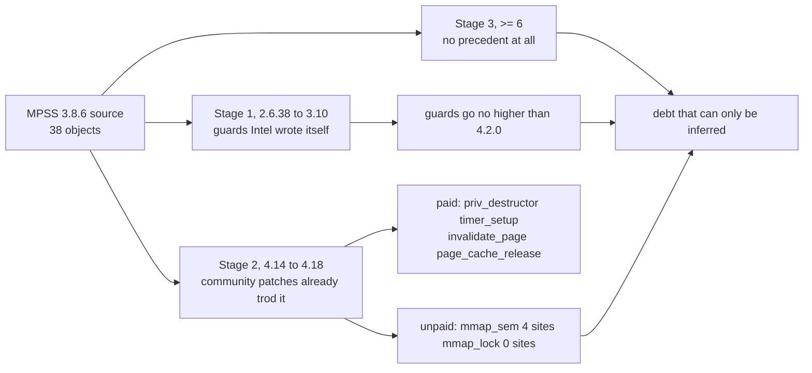

# Chapter 6 — Kernel API Drift: A Family-by-Family List from 3.10 to 6.x

## 6.1 How to Read This Chapter, and the Criteria It Applies

This chapter answers one question only: if the 38 module objects in `_work/mpss-modules-3.8.6` were handed straight to a LoongArch 6.6 kernel, at which lines would the build stop, and past which lines would it quietly slip through? To keep "stop" and "slip through" apart, the chapter applies three criteria to every hit; any claim that departs from those three is not adopted.

Criterion one: which side of this source tree does the hit belong to? `Kbuild:46` says `subdir-ccflags-$(CONFIG_X86_MICPCI) += -D_MIC_SCIF_`, and `:49` says `subdir-ccflags-$(not-$(CONFIG_X86_MICPCI)) += -DHOST -DUSE_VCONSOLE`. In a host-side build `HOST` is defined and `_MIC_SCIF_` is not, so everything wrapped in `#ifdef _MIC_SCIF_` is never compiled on this platform, and everything wrapped in `#ifdef HOST` is. This criterion removes the bulk of the hits, along with a number of pieces of "apparently host code" that actually sit in card-side branches.

Criterion two: how far did the version guards get? The `LINUX_VERSION_CODE` tests in this source are concentrated in 17 files, `KERNEL_VERSION(` appears 62 times, and the highest one written is only 4.2.0. In other words Intel's own version-chasing effort stopped at 4.2; past 4.14 the community was doing it, and on 6.x there is no precedent at all.

Criterion three: classify by "will it fail to build", not by frequency of occurrence. Class A is symbols and members that must break at compile time; class B is things that compile but whose semantics changed or vanished outright; class C is things that look alarming but need no edit at all. Risk ranking runs B, then A, then C. Chapter 11 develops the reasoning; here it is enough to say one thing: a compile stop is seen immediately, a vanished semantic is not.

The evidence in this chapter comes in three grades, marked line by line in the tables. Where I wrote "local", I saw it verbatim in this source and checked the preprocessor branch with `_work/hosthit.py`; where I wrote "upstream", I read it verbatim from the header file for the corresponding version tag under `_work/.kcache/`; where there is no mark, I have only written down the basis for the judgement and do not claim it as verified.

## 6.2 Dashboard: the Highest Version Guard Ever Written Stops at 4.2

The full picture of the guards comes first, because it determines every later judgement about "which kernel generation this code was written for". Of the 38 objects, 17 carry version tests and the other 21 carry none at all. The statistics for those that do are as follows.

| File | `KERNEL_VERSION(` count | Highest generation | Meaning |
| --- | --- | --- | --- |
| `micscif/micscif_select.c` | 4 | 4.2.0 | the only file that reaches 4.2 |
| `host/linux.c` | 9 | 3.14.0 | stops at 3.14, see §6.7 |
| `host/uos_download.c` | 9 | 3.10.0 | stops at Intel's own generation |
| `host/linvnet.c` | 6 | 3.2.0 | |
| `micscif/micscif_api.c` | 5 | 3.10.0 | |
| `host/linvcons.c` | 4 | 3.10.0 | |
| `host/vhost/mic_blk.c` | 4 | 3.10.0 | plus a 2.6.34 guard |
| `host/vmcore.c` | 4 | 3.10.0 | |
| `host/linsysfs.c` | 3 | 2.6.39 | |
| `micscif/micscif_debug.c` | 3 | 3.10.0 | |
| `vnet/micveth_dma.c` | 3 | 3.17.0 | |
| `host/linpsmi.c` | 2 | 2.6.34 | |
| `vnet/micveth_param.c` | 2 | 2.6.36 | |
| `dma/mic_dma_lib.c` | 1 | 3.10.0 | |
| `host/linscif_host.c` | 1 | 3.9.0 | |
| `host/vhost/mic_vhost.c` | 1 | 2.6.34 | |
| `micscif/micscif_nm.c` | 1 | 3.10.0 | |

Three things follow from this table. First, guard density is extremely uneven: `host/linux.c` and `host/uos_download.c` carry 9 each, while objects under `micscif/` mostly carry only 1 to 4, which shows that Intel's attention was entirely on those few host-side concerns. Second, the guards span only 2.6.34 to 4.2; the four major releases between 4.2 and 6.6 carry no tests at all, which is exactly the gap left by the second stage of debt described in the next section. Third, any claim that "MPSS supports 4.18" does not come from this source but from outside patches, so this source cannot be used to argue anything about 6.x.

## 6.3 The Debt Comes in Three Stages, and What Stage Two Paid Does Not Count for Stage Three

Cut the timeline of this driver into three stages. Every hit below is assigned to an stage first, and only then is the question of how many lines it costs.

| Stage | Representative kernels | Maintained by | Debt this chapter has to pay |
| --- | --- | --- | --- |
| One | 2.6.38 to 3.10, guards written up to 3.14 and 4.2 | Intel | already paid off, visible verbatim in the source |
| Two | 4.14 and 4.18 (including the RHEL 7 and RHEL 8 branches) | community branches plus Red Hat patches | partly paid, see §6.7 |
| Three | 6.6 and above | nobody | the class A table plus the class B table in this chapter |

There is no inheritance between Stage 2 and Stage 3, and this has to be stated plainly, otherwise the magnitude will be badly underestimated. In the Stage 2 patches `mmap_sem` appears 4 times and `mmap_lock` appears 0 times, and those two happen to have swapped names in 5.8. That is, the community port ended before 5.8, and the first thing Stage 3 has to pay is precisely the batch Stage 2 never touched. By the same token, the patches contain `set_fs` 0 times, `page_cache_release` 3 times and `pinned_vm` 6 times, which shows that the list they trod and the list ≥6 has to trod overlap only partially.

## 6.4 Table (a): Families That Must Break at Compile Time

The class A table is split into four groups according to "which syntactic element it breaks on". Each row gives the host hit count, the locations, which upstream change breaks it, and what to replace it with.

### 6.4.1 Group One: An Entire Function or Macro Was Deleted

| Family | Host hits | Locations (local, verbatim) | What breaks it | Replace with |
| --- | --- | --- | --- | --- |
| `mm->mmap_sem` | 8 | `host/tools_support.c:91` `:94`, `micscif/micscif_api.c:1974` `:1978` `:1993`, `include/mic/micscif_rma.h:918` `:922` `:929` | renamed in 5.8 | `mm->mmap_lock` and the `mmap_read_lock` / `mmap_write_lock` family |
| `get_user_pages` | 2 | `host/tools_support.c:92`, `micscif/micscif_api.c:1984` | since 4.9 the `current` and `mm` parameters are gone | `get_user_pages(start, nr_pages, gup_flags, pages)`, see `v6.6/include/linux/mm.h:2452` (upstream) |
| `set_fs` / `get_fs` / `get_ds` | 6 | `host/linux.c:736` `:738` `:755`, `:768` `:769` `:790` | still present in 5.9, entirely gone from 5.10 on (upstream, see §6.9) | just delete these 6 lines; on ≥5.10 `vfs_read` takes a kernel pointer anyway |
| `pci_enable_msix` | 1 | `host/linux.c:311` | deleted in 4.12 (`v4.11/include/linux/pci.h` still has 2 occurrences, 0 from `v4.12` on) | `pci_alloc_irq_vectors` and `pci_irq_vector`, see `v6.6/include/linux/pci.h:1645` `:1657` |
| `pci_dma_*` / `pci_map_*`, the whole set | 28 | see the breakdown in §6.4.4 | upstream: the file no longer exists from 5.18 on (`v5.17/include/linux/pci-dma-compat.h` is still 3749 bytes; from v5.18 no file can be retrieved) | the modern `dma_*` API, one by one |
| `ioremap_nocache` | 1 | `host/uos_download.c:1515` | upstream: the name is already absent from `arch/x86/include/asm/io.h` in 5.5 and 5.6 | `ioremap` |
| `init_timer` / `setup_timer` | 3 | `host/linvcons.c:150`, `host/uos_download.c:1500`, `micscif/micscif_rma_dma.c:842` | neither is present in `v4.18/include/linux/timer.h` | `timer_setup(timer, callback, flags)`, see `v6.6/include/linux/timer.h:141` |
| `wait_queue_t` | 4 | `host/vhost/mic_vhost.c:75`, `host/vhost/vhost.h:48`, `micscif/micscif_select.c:194` `:220` | from 4.13 this type name has been superseded by `wait_queue_entry_t` (upstream verbatim: `v4.12/include/linux/wait.h:13` reads `typedef struct __wait_queue wait_queue_t;`, while `v4.13:13` and `v6.6:14` both read `typedef struct wait_queue_entry wait_queue_entry_t;`) | `wait_queue_entry_t`; all four sites need only the type name changed, not a line of the callback bodies |
| `smp_read_barrier_depends` | 1 use site | `host/vhost/vhost.h:253` (macro defined at `:220`, macro body at `:226`) | upstream: `v5.8/include/asm-generic/barrier.h` still has 7 occurrences, `v6.6/include/asm-generic/barrier.h` has 0, and `v6.6/arch/loongarch/include/asm/barrier.h` also has 0 — all three read locally, verbatim | `smp_load_acquire(&dev->acked_features)`; that is how the community patches did it on ≥4.14, see §6.7 |
| `page_cache_release` | 3 | `host/tools_support.c:67`, `micscif/micscif_api.c:2010`, `micscif/micscif_rma.c:416` | deleted in 4.6 (`v4.5/include/linux/pagemap.h:103` is still `#define page_cache_release(page) put_page(page)`, 0 from `v4.6` on) | `put_page` |
| `mm->pinned_vm` arithmetic | 3 | `include/mic/micscif_rma.h:925` `:941` `:952` | in 5.0 it is still `unsigned long` (`v5.0/include/linux/mm_types.h:408`); from 5.1 it is `atomic64_t` (`v5.1:414`, `v6.6:794`) | the `atomic64_*` family, or switch to `pin_user_pages` and let the kernel do the accounting |
| the `struct timeval` family | 3 | `host/acptboot.c:104` `getnstimeofday`, `host/tools_support.c:118` `struct timeval`, `:312` `do_gettimeofday` | in `v6.6/include/linux/time.h` and `timekeeping.h`, `timeval` and both functions are 0 hits | `ktime_get_real_ts64`, declared once in `v6.6/include/linux/timekeeping.h` |
| `#include <linux/bootmem.h>` | 1 | `host/vmcore.c:53` | this header file no longer exists from 5.0 on | delete the whole line; that is exactly what the community patches did, and there is no replacement header |

Two entries in group one deserve a separate warning, because searching by family name will miss them. `host/linux.c:736` through `:755` belong to `mic_get_file_size()`, and `:768` through `:790` belong to `mic_load_file()`. The latter reads firmware from the host disk into card memory, which makes it part of the **boot main path**, so these 6 lines cannot simply be "deleted while passing by": it has to be confirmed that after deletion, `vfs_read(filp, buffer, filp_size, &pos)` really does accept a kernel pointer on ≥5.10. The three lines in `include/mic/micscif_rma.h` sit in a header, so a change there affects every object that includes it, which is more dangerous than the same member in a `.c` file, because a missed site surfaces as a link error rather than a compile error.

### 6.4.2 Group Two: A Struct Member Was Deleted

| Family | Host hits | Locations (local, verbatim) | What breaks it | Replace with |
| --- | --- | --- | --- | --- |
| `dev->destructor` | 2 | `host/linvnet.c:224`, `vnet/micveth_dma.c:923` | `v4.18/include/linux/netdevice.h:1942` has only `void (*priv_destructor)(struct net_device *dev)`; `destructor` no longer exists | `dev->priv_destructor` |
| `.invalidate_page` | 1 | `micscif/micscif_rma.c:73` (also `:60` and `:89`, which are the definition of the same function and the second mmu_notifier branch) | from 4.14 `struct mmu_notifier_ops` has no such callback; `v6.6/include/linux/mmu_notifier.h:64` onward is 0 hits | delete it, or move to the `invalidate_range` family, see the community approach in §6.7 |

Both entries in group two live on the **teardown paths of networking and memory reclaim**. Getting them wrong does not fail immediately; it fails at unload or at reclaim time. That makes them the same kind of thing as group five (does not exist on the architecture), so although they do break the build, I still discuss them after the silent class.

### 6.4.3 Group Three: Signature or Shape Changed, but the Name Is Still There

| Family | Host hits | Locations (local, verbatim) | What changed | Replace with |
| --- | --- | --- | --- | --- |
| `class_create(THIS_MODULE, "mic")` | 1 | `host/linux.c:574` | from 6.4 only one name parameter remains, `owner` is gone, see `v6.4/include/linux/device/class.h:230` (in 6.3, `:273` still reads `#define class_create(owner, name)`) | `class_create("mic")` |
| `vfs_readv` / `vfs_writev` | 2 | `host/vhost/mic_blk.c:156` `:161` | from 4.0 the kernel no longer exports these two functions; in 6.6 they are already `static` in `fs/read_write.c` | wrap them yourself with `import_iovec` plus `vfs_iter_read` / `vfs_iter_write`, the way the community patches do, see §6.7 |
| `vfs_getattr` | 1 | `host/vhost/mic_blk.c:479` (the `#if (LINUX_VERSION_CODE >= KERNEL_VERSION(3,9,0))` branch, which is exactly the branch the new world will take) | from 4.11 two more parameters appear, `STATX_BASIC_STATS` and `AT_STATX_SYNC_AS_STAT` | `vfs_getattr(&path, &stat, STATX_BASIC_STATS, AT_STATX_SYNC_AS_STAT)` |
| `rtnl_link_ops.validate` | 1 | `host/linvnet.c:234` is the function definition, `:248` is the site where it is attached to `.validate` | from 4.14 a third formal parameter comes back, a `struct netlink_ext_ack *extack` (upstream verbatim: `v6.6/include/net/rtnetlink.h:93` to `:95`) | add the `struct netlink_ext_ack *extack` parameter to the function |
| `read_from_oldmem` | 9 | `host/vmcore.c:164` is the definition, plus 8 call sites | **does not break** | this is a static function that ships with MPSS (its signature takes `mic_ctx_t *`), unrelated to the function of the same name in the kernel's `fs/proc/vmcore.c`; it is listed here only to warn against search-and-replace by name |

Those 9 lines in `host/vmcore.c` are where I nearly made a mistake myself in the previous round, which is why I deliberately kept a row for them in the table. It is a static function that ships with this source, not the same thing as the kernel function of the same name, and it does not belong in any replacement list. The genuinely relevant coupling lies elsewhere: it reads internal quantities of `/proc/vmcore` such as `elfcorebuf`, and that has to wait until the shape of the vmcore export is verified on LoongArch. For now this chapter merely records that it is not in the class A table.

### 6.4.4 The `pci-dma-compat.h` Family Has to Be Counted Separately

This is the largest family in the class A table, and the only one where an entire header file was deleted, so it is worth laying out its composition; otherwise the magnitude comes out either twice or half of what it is.

What upstream's header file provides is fixed: `pci_alloc_consistent`, `pci_zalloc_consistent`, `pci_free_consistent`, `pci_map_single`, `pci_unmap_single`, `pci_map_page`, `pci_unmap_page`, `pci_map_sg`, `pci_unmap_sg`, `pci_dma_sync_single_for_cpu`, `pci_dma_sync_single_for_device`, `pci_dma_sync_sg_for_cpu`, `pci_dma_sync_sg_for_device`, `pci_dma_mapping_error`, `pci_set_dma_mask`, `pci_set_consistent_dma_mask` — sixteen functions or macros in all, plus four constant macros such as `PCI_DMA_BIDIRECTIONAL`. Locally it is still present in upstream `v5.17`, at 3749 bytes; by `v5.18` no file can be retrieved, and `v6.0` returns an 83-byte "cannot retrieve" notice.

When checking this source's dependence on it, the easiest mistake is to count `pci_dma_mapping_error` among the `PCI_DMA_` constants, because the string prefixes overlap. I stepped into that pit myself once, so here the two are counted separately.

| Form of dependence | Host lines | Distribution |
| --- | --- | --- |
| Calls to one of those sixteen functions | 25 lines (`.c`) plus 3 lines (headers), **28 lines** in all | `host/micpsmi.c` 7, `micscif/micscif_nodeqp.c` 6, `host/linux.c` 5, `micscif/micscif_smpt.c` 4, `include/mic/micscif_map.h` 3, `dma/mic_dma_lib.c` 2, `host/linpsmi.c` 1 |
| Uses only the `PCI_DMA_*` constants | **17 lines** | `micscif/micscif_nodeqp.c` 6, `host/micpsmi.c` 5, `micscif/micscif_smpt.c` 3, `include/mic/micscif_map.h` 2, `host/linpsmi.c` 1 |
| Both on the same line | 3 lines | `micscif/micscif_nodeqp.c:478`, `micscif/micscif_smpt.c:181` `:198` |

Removing the 3 overlapping lines, the family comes to **42 lines** that this port has to touch. The replacements, one by one, are as follows.

| Retired form | Location | Replace with |
| --- | --- | --- |
| `pci_map_sg` / `pci_unmap_sg` | `micscif/micscif_nodeqp.c:478` `:479` `:2798` `:2801` `:2822` `:2825` | `dma_map_sg` / `dma_unmap_sg` |
| `pci_map_single` / `pci_unmap_single` | `host/micpsmi.c:45` `:76` `:95` `:117` `:135`, `micscif/micscif_smpt.c:181` `:198` `:205`, `include/mic/micscif_map.h:210` | `dma_map_single` / `dma_unmap_single` |
| `pci_map_page` | `include/mic/micscif_map.h:201` | `dma_map_page` |
| `pci_dma_mapping_error` | `host/micpsmi.c:78` `:97`, `micscif/micscif_smpt.c:200`, `include/mic/micscif_map.h:203` | `dma_mapping_error` |
| `pci_dma_sync_single_for_cpu` | `host/linpsmi.c:80` | `dma_sync_single_for_cpu`, declared at `v6.6/include/linux/dma-mapping.h:120` |
| `pci_set_dma_mask` | `host/linux.c:274` | `dma_set_mask`, see `v6.6/include/linux/dma-mapping.h:144` |
| `pci_set_consistent_dma_mask` | `host/linux.c:279` `:282` (also `:281` `:284`, which are only `printk` format strings, i.e. message text) | `dma_set_coherent_mask`, see `v6.6/include/linux/dma-mapping.h:145` |
| `PCI_DMA_BIDIRECTIONAL` and friends | the 17 lines above | `DMA_BIDIRECTIONAL` and friends, see `v6.6/include/linux/dma-direction.h:6` |

One semantic change has to be pointed out here, because pure replacement will miss it. The old family treats the return value of `pci_map_single` and the return value of `pci_map_page` as the same kind of "DMA handle", whereas the new API distinguishes `dma_addr_t` and the use of `dma_map_page` more sharply; `include/mic/micscif_map.h:201` maps with `pci_map_page` while `:210` unmaps with `pci_unmap_single`, and that pair is an even more obvious mismatch under the new API. This is a pre-existing bug I happened to notice. It is not drift from 3.10 to 6.x, it is a problem with how the code was originally written, but it is exactly what this replacement will expose, so it is recorded here.

### 6.4.5 Group Four: Does Not Exist on the Architecture at All

| Family | Host hits | Locations (local, verbatim) | What breaks it | Replace with |
| --- | --- | --- | --- | --- |
| `slow_virt_to_phys` | 1 | `host/linscif_host.c:292` | upstream only x86 provides it; there is no corresponding declaration under `arch/loongarch/` | depending on the purpose, `page_to_phys`, or the return value of `dma_map_page` |

Group four has a single entry, and it is the same site recorded as **F7** in §5.10 of Chapter 5; I also added an F7 row to that table in Chapter 5. Its special feature is that this is not "the API was renamed" but "only x86 has this API", so on x86 you can follow the version upward without trouble, and only a change of architecture breaks it. That also explains why the community's two porting rounds (both still on x86) never touched it.

The fix here is the smallest change in the whole report. That piece of code already has two branches: `host/linscif_host.c:290` is `#if (LINUX_VERSION_CODE >= KERNEL_VERSION(3,9,0))`, and `:296`–`:299` is the generic form `vmalloc_to_page(va)` in the `#else`. That `#else` path works perfectly on LoongArch (`vmalloc_to_page` is a generic memory-management interface belonging to no architecture), so the right move is not "find a LoongArch `slow_virt_to_phys`" but **delete the version guard and keep only the original `#else` branch**: the guard's condition is always true on 6.x, but an always-true condition selected the wrong architecture, and deleting it puts the code back on the generic branch.

## 6.5 Table (b): Compiles Fine, but Silently Changes Behaviour

The class B table is the most important table in this chapter, and the one-line conclusion from §6.5 is cashed in here: everything silent is more dangerous than everything that errors. None of the four entries below stops the build.

### 6.5.1 Exactly One Cache-Sync Call in the Whole Tree

The prefix search itself has to be done right, otherwise "never uses the modern DMA API" is just another way of saying "I did not find it". For this I wrote `_work/census_dma.py`: it reads the 38 objects out of `Kbuild:62` through `:99` and the 36 header files out of `include/`, 42,521 lines in all, then counts hits for each prefix. The result is `dma_map_` 0, `dma_unmap_` 0, `dma_alloc_` 0, `dma_set_` 0, `dma_free_` 4, `dma_sync_` 1.

Of the five non-zero hits, the 4 for `dma_free_` are the name colliding with MPSS's own DMA channel allocator `md_mic_dma_free_chan()` (comment at `dma/mic_dma_md.c:193`, definition at `:196`, declaration at `include/mic/mic_dma_md.h:253`, sole call site at `dma/mic_dma_lib.c:533`), and have nothing to do with the kernel's `dma_free_*`. Only one site genuinely crosses over to the modern side: `host/linpsmi.c:80` calls `pci_dma_sync_single_for_cpu()`. It is already in the table in §6.4.4 and is already counted among the 42 lines of item 6 of the class A table in §6.8, so this site is not a case of "not found" but one that has already been accounted for.

The accurate conclusion is therefore **one sync, zero mappings**: every mapping still goes through the old `pci_map_single` / `pci_map_page` / `pci_map_sg` set (listed site by site in §6.4.4), only `host/linpsmi.c:80` touches sync at all, and every other path relies on the default fact on x86 that "an address obtained by mapping PCI memory can be used directly as memory". The type statistics make the nature of the problem even clearer: `dma_addr_t` appears on 88 lines across these 74 files, which means this code has long looked like modern DMA **in its types**, while **in how it obtains values** it requires that "the address that comes back from a mapping is the physical address the card sees": `micscif/micscif_rma_dma.c:798` registers a temporary buffer with `mic_map_single()` in the host branch, and `:311` then uses the registered `comp_cb->temp_phys` directly as a DMA address; the `:313 temp_dma_addr = (dma_addr_t)virt_to_phys(temp)` in the same place is the `#else` card-side branch and cannot be cited as a host-side example. So on the new platform two things have to be confirmed rather than one: first, whether `host/linpsmi.c:80` is semantically equivalent after switching to `dma_sync_single_for_cpu`; second, whether those 88 lines of `dma_addr_t` equal physical addresses when there is no IOMMU — and are all wrong, without any error, when there is one. The latter is the same issue as §6.5.3; here it only adds the line count.

### 6.5.2 Write Combining Silently Degrades to Uncached

This is the source-side landing point of the finding in Chapter 7, and this chapter records it in full. Three lines on the host path use write combining.

| Location (local, verbatim) | Content | Consequence on LoongArch |
| --- | --- | --- |
| `host/uos_download.c:1156` | `mic_ctx->aper.va = ioremap_wc(mic_ctx->aper.pa, mic_ctx->aper.len)` | see below |
| `host/uos_download.c:1546` | same, on another initialisation path | see below |
| `micscif/micscif_api.c:2991` | `vma->vm_page_prot = pgprot_writecombine(vma->vm_page_prot)` | this is the path that maps card memory into user space; once it degrades, user-space reads of card memory become unreasonably slow |

LoongArch's `CONFIG_ARCH_WRITECOMBINE` is off by default (`arch/loongarch/Kconfig:479`), and the kernel's own help text at `:482` to `:491` states explicitly that the reason for disabling it is that one SoC's write-combining implementation violates the PCIe protocol. With it off, `wc_enabled` is 0 (from `arch/loongarch/kernel/setup.c:163`), so `pgprot_writecombine` does not return a write-combining attribute, and both `ioremap_wc` and `pgprot_writecombine` fall back to `_CACHE_SUC` (from `arch/loongarch/include/asm/pgtable-bits.h:110`; note also that from `:97` `pgprot_noncached` is always `_CACHE_SUC`). These three lines will not fail to compile and will not log anything; they will only get slower, which makes this a high risk in this chapter.

### 6.5.3 Mapping Results Used as Physical Addresses

This is the interface-level manifestation of the same thing recorded as **F5** in §5.5 of Chapter 5. `host/linux.c:274` and `:279` set the 64-bit DMA mask, after which `micscif/micscif_smpt.c:75` `:97` `:128` and `dma/mic_dma_lib.c:216` `:391` take mapping results and feed them straight into address arithmetic. On a platform without an IOMMU those values are physical addresses, so the current code holds; the moment the new platform's firmware attaches an IOMMU to this card, that arithmetic all becomes meaningless — and no error is reported. This entry and the "28 lines in the class A table" are two sides of the same batch of code: one side needs renaming, the other needs the platform's IOMMU state confirmed, and both must be done together.

### 6.5.4 Firmware Must Hand Over a 4 GiB+ 8 GiB 64-Bit Prefetchable Window

Strictly speaking this is not API drift but an interface contract; even so, the class B table is where it fits best, because it likewise reports no error. The source numbers the two windows this card presents to the host: `include/mic_common.h:178` says `DLDR_APT_BAR` is 0, and `:179` says `DLDR_MMIO_BAR` is 4. `host/linux.c:299` and `:300` take the start and length of BAR0, `:290` and `:291` take the start and length of BAR4, and both use `request_mem_region` to claim that window from the kernel. This is also a convenient place to put the two mappings from §6.5.2 in their proper slots: the `ioremap_wc` at `:1156` and `:1546` maps BAR0, while the `ioremap_nocache` at `host/uos_download.c:1515` maps BAR4 — do not mix the two. The contract that has to hold on LoongArch is this: firmware or the root bridge places BAR0, the 64-bit prefetchable window, above 4 GiB, and `request_mem_region` succeeds. The exact size of BAR0 is a hardware fact, which I leave to the inventory in Chapter 2; this chapter records only the shape of the contract. The line `pci_set_dma_mask(pdev, DMA_BIT_MASK(64))` at `host/linux.c:274` only declares something on the device side; what actually decides success or failure is whether the kernel and the firmware grant this window. This is the only entry in this chapter that could terminate the project outright, which is why it ranks first in Chapter 11.

## 6.6 Table (c): Looks Like It Needs Changing, but Not One Line Does

This section saves the reader time. For each entry below I first found hits by family name, then judged the preprocessor branch line by line, and finally concluded that no change is needed.

| What looks like it needs changing | Host hits | Why it is 0 | Location |
| --- | --- | --- | --- |
| `num_physpages` | 1, but on the card side | it is inside `#ifdef _MIC_SCIF_` (`micscif/micscif_rma_dma.c:437`); the host takes the `is_syspa(addr)` branch at `:440` | `micscif/micscif_rma_dma.c:438` |
| the literals `virt_to_phys` / `page_to_phys` | 8 on the host; another 12 are not compiled on the host side (9 in `#ifdef _MIC_SCIF_` card-side branches, 2 in the `#else` of `#ifdef HOST`, 1 compiled only under Knights Ferry's `CONFIG_ML1OM`; the scope is the 38 objects plus 36 headers of §6.5.1) | these are all generic macros with the same semantics on LoongArch; not one literal changes | card side: `dma/mic_dma_lib.c:213` `:388` (also `micscif/micscif_rma.c:908`, under `CONFIG_ML1OM`); host: `micscif/micscif_debug.c:822` `:823` |
| `create_singlethread_workqueue` | 2 direct calls; the rest go through an MPSS macro | the macro still exists upstream in 6.6 (`v6.6/include/linux/workqueue.h:477`), and MPSS's own macro at `include/mic_common.h:692` already points at `alloc_ordered_workqueue` | `host/linscif_host.c:102`, `host/linvnet.c:462` |
| `sysfs_get_dirent` and `kobj.sd` | 1 call, 1 member declaration | both are still present upstream in 6.6 (`v6.6/include/linux/sysfs.h:643`, `v6.6/include/linux/kobject.h:70`), and the MPSS source already has the ≥3.14 branch written out (`include/mic_common.h:419` versus `:421`) | `host/linux.c:339` |
| `lowmem_page_address` | 1 | upstream 6.6 is the unconditional `page_to_virt(page)` (`v6.6/include/linux/mm.h:2170`) | `host/tools_support.c:439` |
| `IRQF_DISABLED` | 1, but on the card side | it is inside `#ifdef _MIC_SCIF_` (`dma/mic_dma_lib.c:466`); on the host side there is only `vnet/micveth_dma.c:1002`, and that one is in a dead `#else` branch | `dma/mic_dma_lib.c:467` |
| the `pci_alloc_irq_vectors` family | 0 | this source never uses the modern interrupt API, so there is no "must migrate to the new API" list to write | none |
| `ndo_change_mtu` | 2 | the member still exists upstream in 6.6 (`v6.6/include/linux/netdevice.h:1442`), and Red Hat's `ndo_change_mtu_rh74` name is 0 hits on 6.6 | `host/linvnet.c:206`, `vnet/micveth_dma.c:913` |

The most valuable rows in this table are the third and the fourth. They are not "accidentally unbroken": **upstream has not touched this layer of the sysfs interface since 3.14**, so code written against 3.14 still holds on 6.6. That answers the question the report opens with: this driver is old, but it is old in a corner that has been frozen since 3.14, and the parts of it that have rotted (`pci-dma-compat.h`, `mmap_sem`, `pinned_vm`) are where the drift actually happened.

The sixth row needs extra explanation, because it only fell into place after I changed the scanner this round. The line at `dma/mic_dma_lib.c:466` reads `#ifdef _MIC_SCIF_ // DMA now shares the IRQ handler with other system interrupts` — a directive followed by a comment. The first version of my scanner matched conditions with `^(\w+)$`, and this trailing comment blocked it, so it failed to recognise the whole frame and reported the line as host side; had I followed that error, I would have edited card-side code that is never compiled on the host. I recorded this bug at the top of `_work/hosthit.py`, together with two others, because it directly affected the conclusions of several earlier drafts of this chapter.

## 6.7 Stage Two: Which Debts the Community Patches Paid for Us

The community porting round can be inspected directly: `mpss-main/mpss-main/mpss3/patches/` holds 22 files and 2372 lines, and the `-193.el8` and `-240.el8` sets are identical in content. Having read them, one can sort them into two tables: which debts they already paid, thereby saving me the work, and which stopped at 4.18, which amounts to not paying at all.

| Paid | How the patch does it (verbatim) |
| --- | --- |
| `.invalidate_page` | wrapped in `#if LINUX_VERSION_CODE < KERNEL_VERSION(4,14,0)`, with a comment reading verbatim "Kernel 4.13+ no longer has invalidate_page"; the `#else` branch sets `.clear_young`, `.test_young` and `.invalidate_range` all to NULL |
| `dev->destructor` | `#if LINUX_VERSION_CODE > KERNEL_VERSION(4,14,0)` takes `dev->priv_destructor`, `#else` takes `dev->destructor` |
| `ndo_change_mtu` | `#if LINUX_VERSION_CODE <= KERNEL_VERSION(3,10,0)` takes `ndo_change_mtu_rh74`, `#else` takes `ndo_change_mtu` |
| `page_cache_release` | appears 3 times in the patches |
| `timer_setup` | appears 8 times in the patches |
| `pinned_vm` | appears 6 times in the patches, written as `mm->pinned_vm.counter` |
| `wait_queue_t` | a set of `#if (LINUX_VERSION_CODE > KERNEL_VERSION(4,14,0))` added at each of the four sites `mic_vhost.c:75`, `vhost.h:48`, `micscif_select.c:194` `:220`; the new branch uses `wait_queue_entry_t` |
| `smp_read_barrier_depends` | in `vhost_has_feature()` in `vhost.h`, the ≥4.14 branch replaces the whole block with `smp_load_acquire(&(dev->acked_features))`, bypassing the `rcu_dereference_index_check` fallback that MPSS ships |
| `vfs_readv` / `vfs_writev` / `vfs_getattr` | `mic_blk.c` implements `vfs_readv` and `vfs_writev` itself (about 34 lines for the two functions, using `import_iovec` plus `vfs_iter_read` / `vfs_iter_write`) and replaces `vfs_getattr` with the four-parameter form |
| `get_user_pages` | changed in `host/tools_support.c` to the eight-parameter form `get_user_pages_remote(current, current->mm, …)` |
| `#include <linux/bootmem.h>` | deleted outright in `host/vmcore.c`, with no replacement |

| Not paid | Evidence |
| --- | --- |
| `mmap_sem` to `mmap_lock` | `mmap_sem` appears 4 times in the patches, `mmap_lock` **0 times**. They did not pay for the 5.8 rename |
| `set_fs` | 0 times in the patches, so they never touched these 6 lines; Stage 3 pays |
| `pci_map_single` / `pci_dma_mapping_error` | 0 times each in the patches; they did not pay the 42 lines of Stage 3 either |
| `num_physpages` | 0 times in the patches (this site is on the card side anyway, see §6.6, so it is right of them not to pay) |
| `class_create` | 0 times in the patches |
| the `tsk` parameter of `get_user_pages_remote` | the patches write the eight-parameter form `(current, current->mm, …)` (with `tsk` first), whereas from 5.15 the function has only `(struct mm_struct *mm, …)` (local, verbatim: `v4.18/include/linux/mm.h:1458` and `v5.4:1520` both have `tsk`; `v5.15:1816` and `v6.6:2419` both do not), so the branch they produced does not even compile on ≥5.15 itself |

The value of this table is that it draws the boundary of the phrase "there is precedent". The community port did trod the `priv_destructor`, `timer_setup` and `invalidate_page` debts, and it did verify that this source can be brought up to 4.18, but it stops short of the 5.8, 5.10, 5.12 and 5.18 changes, so more than half of Stage 3's debt is not on their list. Any effort estimate built on "the community already ported it to 4.18, so 6.x is about the same" will miss the first four rows of group one in the class A table.

## 6.8 Magnitude Summary

The tables above are collected into one, listing only the lines that have to change on the host side.

| No. | Item | Lines | Class | Risk |
| --- | --- | --- | --- | --- |
| 1 | BAR0 8 GiB 64-bit window provided by firmware | 0 lines plus a deployment constraint | B | highest, may veto |
| 2 | Only 1 `dma_sync_*` site, all other addresses computed by hand | 0 lines plus testing | B | high |
| 3 | Write combining degrades to uncached | 0 lines (the three sites need no change) | B | high |
| 4 | Mapping results used as physical addresses (F5) | 0 lines plus platform confirmation | B | high |
| 5 | `slow_virt_to_phys` (F7) | 1 | A | medium |
| 6 | the `pci-dma-compat.h` family | 42 | A | low (mechanical) |
| 7 | `mmap_sem` to `mmap_lock` | 8 | A | low (mechanical) |
| 8 | the `set_fs` family | 6 | A | medium (main path, must be verified) |
| 9 | `mm->pinned_vm` arithmetic | 3 | A | medium (header file) |
| 10 | the `timer_setup` family | 3 | A | medium (callback signatures must change too) |
| 11 | `page_cache_release` | 3 | A | low |
| 12 | `dev->destructor` | 2 | A | low |
| 13 | `get_user_pages` parameters | 2 | A | medium |
| 14 | the `vfs_*` family (`vfs_readv` `vfs_writev` `vfs_getattr`) | 3 | A | medium |
| 15 | `pci_enable_msix` | 1 | A | low |
| 16 | `ioremap_nocache` | 1 | A | low |
| 17 | `class_create` parameters | 1 | A | low |
| 18 | the `timeval` family | 3 | A | low |
| 19 | `wait_queue_t` to `wait_queue_entry_t` | 4 | A | low (mechanical) |
| 20 | `#include <linux/bootmem.h>` | 1 | A | low (mechanical) |
| 21 | `rtnl_link_ops.validate` gains `extack` | 1 | A | low (mechanical) |
| 22 | `smp_read_barrier_depends` in `vhost_has_feature` | 1 | A | medium |

Of the **86 lines** in the class A table, 64 are pure mechanical replacement (items 6, 7, 11, 12, 15, 16, 17, 19, 20, 21) and 22 need the semantics thought through (items 5, 8, 9, 10, 13, 14, 18, 22). Item 1 is not among those 86 lines; it is a deployment constraint. This split is what I use for the estimate in Chapter 9. This report gives no single number, because the difference between "mechanical" and "needs thought" matters far more to the schedule than the difference in line count.

## 6.9 What This Chapter Could Not Verify

Writing down what was not verified is better than presenting it as a conclusion. The following are the points this chapter deliberately leaves open.

First, for the deletion version of the `set_fs` family I looked only at the two ends. `v5.9/arch/x86/include/asm/uaccess.h` still has `set_fs`, and the file of the same name in `v5.10` has not a single one, but I took no samples from the four or five tags in between, so "entirely gone from 5.10 on" is bracketed from both sides rather than walked version by version.

Second, for the deletion version of `ioremap_nocache` I did not obtain a definite tag. I confirmed only that the name is already absent from `arch/x86/include/asm/io.h` in `v5.5` and `v5.6`; earlier tags failed to download twice because of network resets. This does not affect the conclusion, because only one line on the host side needs changing and the change is unambiguous.

Third, I do not verify what the source's `CONFIG_*` conditions evaluate to on a new-world kernel, because that is a **fact at deployment time** rather than a fact about the source. Specifically: `host/linux.c:311` wrapped in `#ifdef CONFIG_PCI_MSI`; `micscif/micscif_rma.c:60` `:73` `:89` wrapped in `#ifdef CONFIG_MMU_NOTIFIER`; `host/linscif_host.c:102`; and `micscif/micscif_rma_dma.c:842` wrapped in `#if !defined(WINDOWS) && !defined(CONFIG_PREEMPT)`. In all four places I marked `COND` rather than `LIVE`, meaning "confirm again against the target kernel's actual configuration"; they must not be treated as verified.

Fourth, the `timer_setup` debt is not a pure rename, so I did not count it in the mechanical class. `micscif/micscif_rma_dma.c:842` currently reads `setup_timer(timer, avert_softlockup, (unsigned long) data)`, and the callback takes an `unsigned long`, whereas a `timer_setup` callback takes a `struct timer_list *` (`v6.6/include/linux/timer.h:92`). That is, once these three lines are changed, the signatures of the three corresponding callback functions must change too, so the size of this debt has to be measured in functions rather than in lines. One more piece of evidence gathered for this section: `host/uos_download.c` has three such callbacks in total (`reset_timer` at `:815`, `online_timer` at `:1054`, `boot_timer` at `:1078`), and the `function` and `data` members of `mic_ctx->boot_timer` are assigned in 12 places altogether; the community patches wrap those 12 places in an extra layer of `timer_setup` and leave the rest of the logic alone.

Fifth, for `host/vhost/` I only got down to family level, not line level, and this has to be stated. `Kbuild:79` and `:80` count `mic_vhost.c` and `mic_blk.c` as host objects, and the two files contain 63 lines of hits beginning with `vhost_`, of which this chapter picks out only the four that genuinely break: `wait_queue_t` 4 lines (§6.4.1), `smp_read_barrier_depends` 1 line (§6.4.1), `vfs_readv` and `vfs_writev` 2 lines, and `vfs_getattr` 1 line (§6.4.3). The remaining dozens are a vhost implementation that ships with MPSS, defining its own `vhost_dev_init`, `vhost_get_vq_desc`, `vhost_add_used_and_signal` and so on (see `host/vhost/mic_vhost.c:235` `:430` `:640`), and it does not require the kernel to provide interfaces of the same name, so it does not constitute API drift. Likewise, the roughly 21 lines of hits beginning with `skb_` and `netdev_` in `host/linvnet.c` and under `vnet/` I also took only to family level; those that break have already been placed in §6.4.2, §6.4.3 and §6.6 respectively. A line-by-line recheck of these two blocks is left to the round where work actually starts; this chapter does not convert them into a line count.

## 6.10 Chapter Summary

Seven conclusions.

First, the version guards in this source go only as far as 4.2.0, 62 occurrences across 17 files, and the other 21 files have not a single one. So any claim that "it already supports some kernel generation" must come from external evidence.

Second, the debt comes in three stages, and Stage 2's debt cannot be set against Stage 3's. The community patches contain `mmap_sem` 4 times and `mmap_lock` 0 times, which shows precisely that they stopped before 5.8.

Third, the class A table totals 86 lines, of which 64 are pure mechanical replacement and 22 have to be handled semantically. The largest family is `pci-dma-compat.h`, 42 lines after deduplication, and its deletion point is 5.18.

Fourth, not one of the four class B entries reports an error, and the first of them (the 8 GiB 64-bit window) may veto the project outright, while the third (write-combining degradation) can already be confirmed verbatim in LoongArch's source.

Fifth, the class C table still holds things like `sysfs_get_dirent` and `lowmem_page_address`, which "look like old APIs but have not moved upstream". Their existence shows that this driver has not rotted evenly.

Sixth, every line number and hit count in this chapter comes from `_work/mpss-modules-3.8.6`, the judging process is recorded in `_work/hosthit.py`, and the three bugs I fixed are recorded at the head of that file. Compared with the conclusions of my previous draft, this chapter corrects the hit count for `ioremap_nocache`, the classification of `num_physpages`, the mistaken claim that `virt_to_phys` counts as DMA, and the mistaken claim that the community patches "missed `invalidate_page`".

Seventh, this round I aligned every `diff` in the community patches with the local source line by line, and thereby found five more families: `wait_queue_t` (4 lines), `#include <linux/bootmem.h>` (1 line), the `extack` parameter of `rtnl_link_ops.validate` (1 line), `vfs_getattr` (1 line), and the `smp_read_barrier_depends` site in `host/vhost/vhost.h` (1 line). Not one of these five lines came from searching a family name: `wait_queue_t` hides in a function parameter and a struct member, `bootmem.h` is a single `#include` line, `extack` is an extra formal parameter, `smp_read_barrier_depends` hides inside a macro that MPSS wrote itself, and `vfs_getattr` hides in the new branch of an `#if`. That shows this chapter's list still has room for more of the same kind, and that the next step is to keep aligning line by line rather than to keep enlarging the search vocabulary.
## 6.11 Measured Addendum: What Was Deleted After 6.6

This section was added after the tables above were written and the report was finalised: in October 2026 this source was moved onto a LoongArch machine and actually compiled (environment and full procedure in Chapter 8 §8.3 (d)), and the measured run ran into another batch of interfaces that "still existed in 6.6 and are already gone in 7.1.13". They do not belong to the "3.10 to 6.x" story of Chapter 3, but they stop the build just the same, so they get a table of their own. Line numbers still refer to the clean tree.

| Interface / form | 6.6 at the time Chapter 6 was written | Measured on 7.1.13 | Host-side hit sites |
|---|---|---|---|
| the `struct timespec` family | deprecated, type still present | the type is gone from the in-kernel API | `micscif/micscif_select.c:73`, `:318`, `:420`, `host/uos_download.c:124`, `host/acptboot.c:64` |
| `MAX_ORDER` | still present | renamed `MAX_PAGE_ORDER`, and the buddy allocator's maximum order is now exactly that (the old `-1` has to go) | `include/mic/micscif_rma.h:835`, `micscif/micscif_api.c:1646`, `:1711` |
| `del_timer_sync` | still present | renamed `timer_delete_sync` from 6.15 | `host/linvcons.c:241`, `host/uos_download.c:895`, `:907`, `:999`, `micscif/micscif_rma_dma.c:852` |
| `setup_timer` and `timer_list.data` | only `timer_setup` remains | the way to get the container was renamed too: `from_timer` has been deleted, replaced by `timer_container_of` | `micscif/micscif_rma_dma.c:842`, `host/uos_download.c:869`, `host/linvcons.c:149` |
| `f_count` of `struct file` | an atomic count member | changed to `file_ref_t f_ref`, publicly read via `file_count()` | `host/vhost/mic_blk.c:140`, `micscif/micscif_fd.c:73` |
| `get_user_pages` signature | already takes no `task_struct` / `mm_struct` | reduced further to 4 parameters, dropping even the `vmas` out-parameter | `host/tools_support.c:92`, `micscif/micscif_api.c:1984` |
| `class_create` | 2 parameters | 1 parameter | `host/linux.c:574` |
| `alloc_tty_driver` / `put_tty_driver` | still present | changed to `tty_alloc_driver` / `tty_driver_kref_put`, and the `write` / `write_room` / `set_termios` signatures of `tty_operations` all changed | `host/linvcons.c:83`, `:109`, `:168` |
| `eventfd_signal(ctx, n)` | 2 parameters | 1 parameter | `host/vhost/vhost.h:205` |
| `ACCESS_ONCE`, `smp_read_barrier_depends`, `read_barrier_depends` | still present | all deleted (replaced by `READ_ONCE` and `smp_rmb` respectively) | `host/vhost/vhost.h:212`, `:216`, `:222`, `:226`, `host/vhost/mic_vhost.c:417` |
| `vfs_readv` / `vfs_writev` | still present | deleted (switch to a segment-by-segment loop over `kernel_read` / `kernel_write`) | `host/vhost/mic_blk.c:156`, `:161` |
| `vfs_getattr` | 2 parameters | 4 parameters | `host/vhost/mic_blk.c:479` |
| `bd_inode` of `struct block_device` | still present | deleted (switch to `bdev_nr_sectors(I_BDEV(file_inode(f)))`) | `host/vhost/mic_blk.c:488` |
| read/write callbacks of `bin_attribute` | take `struct bin_attribute *` | gain `const` | `host/linpsmi.c:124`, `:127` |
| direct assignment to `vm_flags` | writable | read-only, switch to `vm_flags_set` / `vm_flags_clear` | `micscif/micscif_api.c:3008`, `:3014` |
| `mmu_notifier_ops.invalidate_range_start` | returns `void` | returns `int` (the `invalidate_page` and `change_pte` members, meanwhile, have been deleted) | `micscif/micscif_rma.c:60`, `:73`, `:89` |

This table bears directly on the "86 lines" estimate in Chapter 8 §8.3: the measured result after the changes is 28 files, +318 / -309 lines, and the excess is mostly right here — the target kernel is another three years newer than it was when Chapter 6 was written.

---

## 6.12 What the Same Drift Looks Like on the User-Space Tool Side

The earlier parts of this chapter measured kernel API drift from 3.10 to 6.x. The same thing is happening to the host user space as well, only in a different form: not function signatures changing, but **the compiler and linker getting stricter**. Compile MPSS 3.8.6's tool side with a 2026 toolchain and everything you hit is of this kind (for the location of each item, see [Appendix E](E-porting-patches.md)):

| Symptom | Today's rule | Why it used to pass |
|---|---|---|
| assembler reports `invalid attempt to declare external version name as default` | the new binutils refuses to declare a default version (`.symver`) for a symbol that is undefined in this object file | 2016-era binutils did not care; the same code also fails on today's x86-64 toolchain |
| `error: implicit declaration of function` | since GCC 14 an implicit function declaration is an error | old compilers only warned |
| `error: assignment to … from incompatible pointer type` | since GCC 14 an incompatible pointer type is an error | as above |
| `error: inline function declared but never defined` | GCC errors on an `inline` that is declared but not defined | as above |
| `multiple definition of …` | since GCC 10 the default is `-fno-common` | the old default was `-fcommon`, so tentative definitions in headers could be merged |
| `'constexpr' needed for in-class initialization` | since C++11, in-class initialisation of a non-integral static member needs `constexpr` | it was compiled as C++03 back then |

The value judgement here is the opposite of the kernel side: kernel drift is **silent** (it may compile and then write the wrong thing at runtime), while toolchain drift is **loud** (if it does not compile, it does not compile), so the risk is far lower. Its only effect is on the schedule: without knowing these rules in advance, one would think "the code is broken".

There is one more item which is not drift but a **defect in the original code**: the `*lastd[1]` construct in `libmpssconfig/passwd.c` (meaning `(*lastd)[1]`) reads an uninitialised pointer from an adjacent stack slot. On x86 it happened not to blow up; on LoongArch it segfaults on the first call. Problems of this kind fall outside the F-grade risks of Chapter 5 and count as a class of their own: **not an architectural difference, but wrong from the start — it merely took a different platform to expose it**.
