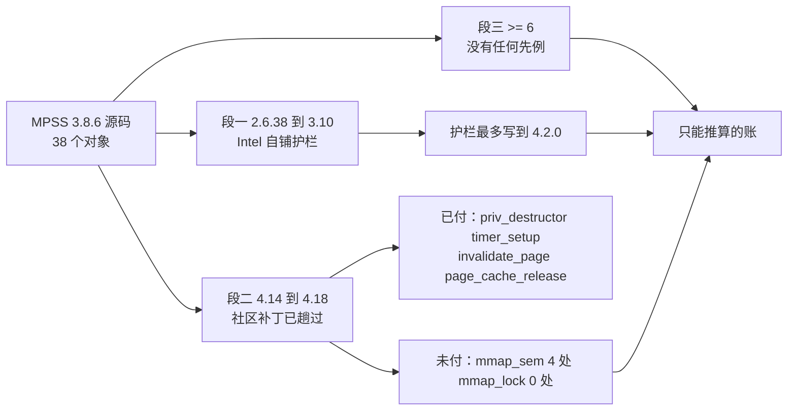

# 第六章　内核接口漂移：从 3.10 到 6.x 的逐族清单

## 6.1　本章的读法与判定规则

　　本章只回答一个问题：把 `_work/mpss-modules-3.8.6` 的 38 个模块对象直接丢给一个 LoongArch 6.6 内核去编，会在哪些行上停住，又会从哪些行上偷偷溜过去。为了把「停住」和「溜过去」分清，本章对每一处命中都套三条判定规则，凡是偏离这三条的说法都不采用。

　　规则一，看它在这份源码里属于哪一侧。`Kbuild:46` 写着 `subdir-ccflags-$(CONFIG_X86_MICPCI) += -D_MIC_SCIF_`，`:49` 写着 `subdir-ccflags-$(not-$(CONFIG_X86_MICPCI)) += -DHOST -DUSE_VCONSOLE`。主机侧构建时 `HOST` 被定义、`_MIC_SCIF_` 不被定义，所以 `#ifdef _MIC_SCIF_` 包住的一切在这个平台上从来不编，`#ifdef HOST` 包住的一切才编。这一条把命中数砍掉了大头，也砍掉了多处写在卡侧分支里的「看似主机代码」。

　　规则二，看护栏铺到了哪一代。源码里的 `LINUX_VERSION_CODE` 判断集中在 17 个文件、`KERNEL_VERSION(` 共出现 62 次，最高一次只写到 4.2.0。也就是说 Intel 自己的跟版努力在 4.2 就停了，4.14 以后是社区在做，而 6.x 上根本没有先例。

　　规则三，按「会不会报错」分三类，而不是按出现次数排序。甲类是编译期必断的符号与成员，乙类是编译得过但语义变了或干脆消失的，丙类是看着吓人实际一行不用改的。风险排序按乙、甲、丙来，理由在第十一章展开，这里只给出一句：编译停止会立刻被人看到，语义消失不会。

　　本章的证据分三级，表格里逐行标注。写了「本地」的，是我在这份源码里逐字看到并用 `_work/hosthit.py` 判过预处理分支的，写了「上游」的，是我从 `_work/.kcache/` 里对应某个版本标签的头文件逐字读出的，没标的只写清了判定依据，不冒充已核实。

## 6.2　仪表盘：护栏最高的那次跟版停在 4.2

　　先把护栏的全貌摆出来，因为它决定了后面对「这段代码是按哪一代内核写的」的一切判断。38 个对象里有 17 个带版本判断，另 21 个一次都没有，带判断的那些统计如下。

| 文件 | `KERNEL_VERSION(` 次数 | 最高一代 | 含义 |
| --- | --- | --- | --- |
| `micscif/micscif_select.c` | 4 | 4.2.0 | 唯一摸到 4.2 的文件 |
| `host/linux.c` | 9 | 3.14.0 | 摸到 3.14 就停，见 §6.7 |
| `host/uos_download.c` | 9 | 3.10.0 | 停在 Intel 自己的那代 |
| `host/linvnet.c` | 6 | 3.2.0 | |
| `micscif/micscif_api.c` | 5 | 3.10.0 | |
| `host/linvcons.c` | 4 | 3.10.0 | |
| `host/vhost/mic_blk.c` | 4 | 3.10.0 | 另有 2.6.34 的护栏 |
| `host/vmcore.c` | 4 | 3.10.0 | |
| `host/linsysfs.c` | 3 | 2.6.39 | |
| `micscif/micscif_debug.c` | 3 | 3.10.0 | |
| `vnet/micveth_dma.c` | 3 | 3.17.0 | |
| `host/linpsmi.c` | 2 | 2.6.34 | |
| `vnet/micveth_param.c` | 2 | 2.6.36 | |
| `dma/mic_dma_lib.c` | 1 | 3.10.0 | |
| `host/linscif_host.c` | 1 | 3.9.0 | |
| `host/vhost/mic_vhost.c` | 1 | 2.6.34 | |
| `micscif/micscif_nm.c` | 1 | 3.10.0 | |

　　这张表读出三件事。第一，护栏的密度极不均匀，`host/linux.c` 和 `host/uos_download.c` 各铺了 9 次，而 `micscif/` 下的对象基本只有 1 到 4 次，说明 Intel 的注意力全在主机侧那几件事上。第二，护栏的跨度只覆盖 2.6.34 到 4.2，从 4.2 到 6.6 中间的四个大版本没有任何判断，这正是下一节要分的第二笔账留下的空档。第三，任何一次「MPSS 支持 4.18」的说法都不来自这份源码，而来自外面的补丁，所以不能拿这份源码去论证 6.x。

## 6.3　账要分三笔，段二付过的不等于段三付过了

　　把这份驱动的时间轴切成三段，后面每一处命中都先归段，再谈要花多少行。

| 段 | 代表内核 | 谁在维护 | 本章要付的账 |
| --- | --- | --- | --- |
| 段一 | 2.6.38 至 3.10，护栏写到 3.14 与 4.2 | Intel | 已经付完了，源码里逐字可见 |
| 段二 | 4.14 与 4.18（含 RHEL 7 与 RHEL 8 分支） | 社区分支加红帽补丁 | 付掉了一部分，见 §6.7 |
| 段三 | 6.6 及以上 | 无人 | 本章甲表加乙表 |

　　第二段和第三段之间没有继承关系，这一点必须说透，否则量级会严重低估。段二的补丁里 `mmap_sem` 出现 4 次、`mmap_lock` 出现 0 次，而这两者恰好在 5.8 换了名字。也就是说社区那次移植的终点在 5.8 之前，段三要付的第一笔恰恰是段二没碰过的那批。同理，补丁里 `set_fs` 0 次、`page_cache_release` 3 次、`pinned_vm` 6 次，说明他们趟过的清单和 ≥6 要趟的清单只是部分重叠。

## 6.4　甲表：编译期必断的族

　　甲表按「断在什么语法成分上」分四组。每一行给出主机命中数、位置、断在哪个上游改动、以及替换成什么。

### 6.4.1　第一组：整个函数或宏被删掉

| 族 | 主机命中 | 位置（本地逐字） | 断在哪 | 替换成 |
| --- | --- | --- | --- | --- |
| `mm->mmap_sem` | 8 | `host/tools_support.c:91` `:94`，`micscif/micscif_api.c:1974` `:1978` `:1993`，`include/mic/micscif_rma.h:918` `:922` `:929` | 5.8 改名 | `mm->mmap_lock` 与 `mmap_read_lock` / `mmap_write_lock` 系列 |
| `get_user_pages` | 2 | `host/tools_support.c:92`，`micscif/micscif_api.c:1984` | 4.9 起去掉 `current` 与 `mm` 两个参数 | `get_user_pages(start, nr_pages, gup_flags, pages)`，见 `v6.6/include/linux/mm.h:2452`（上游） |
| `set_fs` / `get_fs` / `get_ds` | 6 | `host/linux.c:736` `:738` `:755`，`:768` `:769` `:790` | 5.9 还有，5.10 起全无（上游，见 §6.9） | 直接删掉这 6 行，`vfs_read` 在 ≥5.10 上本来就收内核指针 |
| `pci_enable_msix` | 1 | `host/linux.c:311` | 4.12 起删（`v4.11/include/linux/pci.h` 还有 2 处，`v4.12` 起 0 处） | `pci_alloc_irq_vectors` 与 `pci_irq_vector`，见 `v6.6/include/linux/pci.h:1645` `:1657` |
| `pci_dma_*` / `pci_map_*` 一整套 | 28 | 见 §6.4.4 的分解 | 上游 5.18 起该文件已不存在（`v5.17/include/linux/pci-dma-compat.h` 还有 3749 字节，v5.18 起取不到实体） | 现代 `dma_*` API，逐个对应 |
| `ioremap_nocache` | 1 | `host/uos_download.c:1515` | 上游 5.5 与 5.6 的 `arch/x86/include/asm/io.h` 里已无此名 | `ioremap` |
| `init_timer` / `setup_timer` | 3 | `host/linvcons.c:150`，`host/uos_download.c:1500`，`micscif/micscif_rma_dma.c:842` | `v4.18/include/linux/timer.h` 里已无此二者 | `timer_setup(timer, callback, flags)`，见 `v6.6/include/linux/timer.h:141` |
| `wait_queue_t` | 4 | `host/vhost/mic_vhost.c:75`，`host/vhost/vhost.h:48`，`micscif/micscif_select.c:194` `:220` | 4.13 起这个类型名已被 `wait_queue_entry_t` 取代（上游逐字：`v4.12/include/linux/wait.h:13` 是 `typedef struct __wait_queue wait_queue_t;`，`v4.13:13` 与 `v6.6:14` 都写成 `typedef struct wait_queue_entry wait_queue_entry_t;`） | `wait_queue_entry_t`，四处都只改类型名，回调体一行不用动 |
| `smp_read_barrier_depends` | 1 处使用点 | `host/vhost/vhost.h:253`（宏定义在 `:220`，宏体在 `:226`） | 上游 `v5.8/include/asm-generic/barrier.h` 里还有 7 处，`v6.6/include/asm-generic/barrier.h` 是 0 处，`v6.6/arch/loongarch/include/asm/barrier.h` 也是 0 处，三处都是本地逐字 | `smp_load_acquire(&dev->acked_features)`，社区补丁在 ≥4.14 上就是这么改的，见 §6.7 |
| `page_cache_release` | 3 | `host/tools_support.c:67`，`micscif/micscif_api.c:2010`，`micscif/micscif_rma.c:416` | 4.6 起删（`v4.5/include/linux/pagemap.h:103` 还是 `#define page_cache_release(page) put_page(page)`，`v4.6` 起 0 处） | `put_page` |
| `mm->pinned_vm` 算术 | 3 | `include/mic/micscif_rma.h:925` `:941` `:952` | 5.0 还是 `unsigned long`（`v5.0/include/linux/mm_types.h:408`），5.1 起是 `atomic64_t`（`v5.1:414`，`v6.6:794`） | `atomic64_*` 系列，或改用 `pin_user_pages` 让内核自己记账 |
| `struct timeval` 一族 | 3 | `host/acptboot.c:104` `getnstimeofday`，`host/tools_support.c:118` `struct timeval`，`:312` `do_gettimeofday` | `v6.6/include/linux/time.h` 与 `timekeeping.h` 中 `timeval` 与两个函数均为 0 命中 | `ktime_get_real_ts64`，`v6.6/include/linux/timekeeping.h` 有 1 处声明 |
| `#include <linux/bootmem.h>` | 1 | `host/vmcore.c:53` | 5.0 起这个头文件已不存在 | 整行删掉，社区补丁的改法就是直接删除，没有任何替代头文件 |

　　第一组里有两条要单独提醒，因为按族名去搜索会漏掉它们。`host/linux.c:736` 到 `:755` 属于 `mic_get_file_size()`，`:768` 到 `:790` 属于 `mic_load_file()`，后者的用途是从主机硬盘把固件读进卡的内存，属于**开机主路径**，所以这 6 行不能只是「顺手删掉」，必须确认删完之后 `vfs_read(filp, buffer, filp_size, &pos)` 在 ≥5.10 上收内核指针这一行为成立。`include/mic/micscif_rma.h` 那三行在头文件里，改动会影响所有包含它的对象，比在 `.c` 里同名成员危险，因为漏改一处会以链接错误而不是编译错误暴露。

### 6.4.2　第二组：结构体成员被删掉

| 族 | 主机命中 | 位置（本地逐字） | 断在哪 | 替换成 |
| --- | --- | --- | --- | --- |
| `dev->destructor` | 2 | `host/linvnet.c:224`，`vnet/micveth_dma.c:923` | `v4.18/include/linux/netdevice.h:1942` 只有 `void (*priv_destructor)(struct net_device *dev)`，`destructor` 已不存在 | `dev->priv_destructor` |
| `.invalidate_page` | 1 | `micscif/micscif_rma.c:73`（另有 `:60` 与 `:89` 是同一个函数的定义与第二条 mmu_notifier 分支） | 4.14 起 `struct mmu_notifier_ops` 里没有这个回调，`v6.6/include/linux/mmu_notifier.h:64` 起为 0 命中 | 删掉或改成 `invalidate_range` 系列，见 §6.7 的社区做法 |

　　第二组的两条都长在**网络与内存回收的收尾路径**上，改错了不会立刻报错而是会在卸载或回收时出问题，这一点与第五组（架构上不存在）同类，所以虽然它们编译不过，我仍把它们排在静默类之后讨论。

### 6.4.3　第三组：签名或形态变了，但名字还在

| 族 | 主机命中 | 位置（本地逐字） | 变在哪 | 替换成 |
| --- | --- | --- | --- | --- |
| `class_create(THIS_MODULE, "mic")` | 1 | `host/linux.c:574` | 6.4 起参数只剩一个名字，`owner` 被去掉，见 `v6.4/include/linux/device/class.h:230`（6.3 的 `:273` 还是 `#define class_create(owner, name)`） | `class_create("mic")` |
| `vfs_readv` / `vfs_writev` | 2 | `host/vhost/mic_blk.c:156` `:161` | 4.0 起内核不再对外提供这两个函数，6.6 的 `fs/read_write.c` 里它们已是 `static` | 按社区补丁的写法自己包一层 `import_iovec` 加 `vfs_iter_read` / `vfs_iter_write`，见 §6.7 |
| `vfs_getattr` | 1 | `host/vhost/mic_blk.c:479`（`#if (LINUX_VERSION_CODE >= KERNEL_VERSION(3,9,0))` 那一支，正是新世界会走的那一支） | 4.11 起多出 `STATX_BASIC_STATS` 与 `AT_STATX_SYNC_AS_STAT` 两个参数 | `vfs_getattr(&path, &stat, STATX_BASIC_STATS, AT_STATX_SYNC_AS_STAT)` |
| `rtnl_link_ops.validate` | 1 | `host/linvnet.c:234` 是函数定义，`:248` 是挂到 `.validate` 上那一处 | 4.14 起第三个形参追回一个 `struct netlink_ext_ack *extack`（上游逐字：`v6.6/include/net/rtnetlink.h:93` 到 `:95`） | 给函数补上 `struct netlink_ext_ack *extack` 形参 |
| `read_from_oldmem` | 9 | `host/vmcore.c:164` 是定义，另有 8 处调用 | **没有断** | 这是 MPSS 自带的静态函数（签名是 `mic_ctx_t *`），与内核 `fs/proc/vmcore.c` 里的同名函数无关，列在这里只为提醒不要按名字去搜索替换 |

　　`host/vmcore.c` 那 9 行是我自己上一轮差点写错的地方，所以特意留一行在表里。它是这份源码自带的静态函数，与内核的同名函数不同源，替换清单里不应该出现它。真正相关的耦合在别处，是它去读了 `/proc/vmcore` 的 `elfcorebuf` 之类的内部量，这一条要等 LoongArch 上验证 vmcore 导出形态时再看，本章只记下它不在甲表里。

### 6.4.4　`pci-dma-compat.h` 这一族要单独算

　　这是甲表里最大的一族，也是唯一一个「整个头文件被删掉」的族，值得把它的构成摊开，否则量级会算成两倍或一半。

　　上游这个头文件提供的东西是固定的：`pci_alloc_consistent`、`pci_zalloc_consistent`、`pci_free_consistent`、`pci_map_single`、`pci_unmap_single`、`pci_map_page`、`pci_unmap_page`、`pci_map_sg`、`pci_unmap_sg`、`pci_dma_sync_single_for_cpu`、`pci_dma_sync_single_for_device`、`pci_dma_sync_sg_for_cpu`、`pci_dma_sync_sg_for_device`、`pci_dma_mapping_error`、`pci_set_dma_mask`、`pci_set_consistent_dma_mask` 一共十六个函数或宏，外加 `PCI_DMA_BIDIRECTIONAL` 等四个常量宏。它在本地上游的 `v5.17` 里还在，3749 字节，到 `v5.18` 已经取不到实体，`v6.0` 返回 83 字节的取不到提示。

　　检验这份源码对它的依赖时，最容易犯的错是把 `pci_dma_mapping_error` 也算进 `PCI_DMA_` 常量里，因为字符串前缀重叠。这个坑我自己踩过一次，所以这里分开数。

| 依赖形态 | 主机行数 | 分布 |
| --- | --- | --- |
| 调用这十六个函数之一 | 25 行（`.c`）加 3 行（头文件），共 **28 行** | `host/micpsmi.c` 7，`micscif/micscif_nodeqp.c` 6，`host/linux.c` 5，`micscif/micscif_smpt.c` 4，`include/mic/micscif_map.h` 3，`dma/mic_dma_lib.c` 2，`host/linpsmi.c` 1 |
| 只用到 `PCI_DMA_*` 常量 | **17 行** | `micscif/micscif_nodeqp.c` 6，`host/micpsmi.c` 5，`micscif/micscif_smpt.c` 3，`include/mic/micscif_map.h` 2，`host/linpsmi.c` 1 |
| 两者同一行 | 3 行 | `micscif/micscif_nodeqp.c:478`，`micscif/micscif_smpt.c:181` `:198` |

　　去掉重叠的 3 行，族内一共 **42 行**要在这次移植里动。逐个替换关系如下。

| 停用的写法 | 位置 | 换成 |
| --- | --- | --- |
| `pci_map_sg` / `pci_unmap_sg` | `micscif/micscif_nodeqp.c:478` `:479` `:2798` `:2801` `:2822` `:2825` | `dma_map_sg` / `dma_unmap_sg` |
| `pci_map_single` / `pci_unmap_single` | `host/micpsmi.c:45` `:76` `:95` `:117` `:135`，`micscif/micscif_smpt.c:181` `:198` `:205`，`include/mic/micscif_map.h:210` | `dma_map_single` / `dma_unmap_single` |
| `pci_map_page` | `include/mic/micscif_map.h:201` | `dma_map_page` |
| `pci_dma_mapping_error` | `host/micpsmi.c:78` `:97`，`micscif/micscif_smpt.c:200`，`include/mic/micscif_map.h:203` | `dma_mapping_error` |
| `pci_dma_sync_single_for_cpu` | `host/linpsmi.c:80` | `dma_sync_single_for_cpu`，声明见 `v6.6/include/linux/dma-mapping.h:120` |
| `pci_set_dma_mask` | `host/linux.c:274` | `dma_set_mask`，见 `v6.6/include/linux/dma-mapping.h:144` |
| `pci_set_consistent_dma_mask` | `host/linux.c:279` `:282`（另有 `:281` `:284` 是 `printk` 的格式串，只是文案） | `dma_set_coherent_mask`，见 `v6.6/include/linux/dma-mapping.h:145` |
| `PCI_DMA_BIDIRECTIONAL` 等 | 上面那 17 行 | `DMA_BIDIRECTIONAL` 等，见 `v6.6/include/linux/dma-direction.h:6` |

　　这里必须点出一个只靠替换会被漏掉的语义变化。旧那一族把 `pci_map_single` 的返回值和 `pci_map_page` 的返回值都当成同一种「DMA 句柄」，而新的 API 把 `dma_addr_t` 与 `dma_map_page` 的用法区分得更清楚，`include/mic/micscif_map.h:201` 用 `pci_map_page` 映射、`:210` 却用 `pci_unmap_single` 解除，这一对在新 API 下会更明显地错配。这是我顺手发现的既有 bug，不属于 3.10 到 6.x 的漂移，属于原始写法的问题，但它正好会在这次替换里暴露，所以记在这里。

### 6.4.5　第四组：架构上根本不存在

| 族 | 主机命中 | 位置（本地逐字） | 断在哪 | 替换成 |
| --- | --- | --- | --- | --- |
| `slow_virt_to_phys` | 1 | `host/linscif_host.c:292` | 上游只有 x86 提供它，`arch/loongarch/` 下没有对应声明 | 按用途改 `page_to_phys` 或 `dma_map_page` 的返回值 |

　　第四组只有一项，与本报告第五章 §5.10 记为 **F7** 的是同一处，我在第五章的那张表里也补了 F7 一行。它的特殊性在于：这不是「API 换了名字」，而是「这个 API 只有 x86 有」，所以在 x86 上跟着版本升不会出问题，一换架构才会断，这也解释了为什么社区那两轮移植（都还在 x86 上）完全没碰它。

　　这一处的修法是全报告里改动最小的一处：那段代码本来就有两条分支，`host/linscif_host.c:290` 是 `#if (LINUX_VERSION_CODE >= KERNEL_VERSION(3,9,0))`，`:296`–`:299` 是 `#else` 里的通用写法 `vmalloc_to_page(va)`。这个 `#else` 路径在龙芯上完全可用（`vmalloc_to_page` 是通用内存管理接口，不属于任何架构），所以正确的做法不是「找一个龙芯的 `slow_virt_to_phys`」，而是**删掉那个版本守卫、只留下原来的 `#else` 分支**：守卫的条件在 6.x 上恒真，但恒真的条件选错了架构，删掉它正好把代码退回通用分支。

## 6.5　乙表：编译得过，但会静默走样的

　　乙表是本章最重要的表，第五小节的一句话结论在这里兑现：凡是静默的，都比凡是报错的更危险。下面四条都不会让编译停下。

### 6.5.1　全树只有一处缓存同步调用

　　前缀搜索本身要先做对，否则「没用过现代 DMA API」这句话只是「没搜到」的另一种说法。我为此写了 `_work/census_dma.py`：它从 `Kbuild:62` 到 `:99` 读出这 38 个对象，从 `include/` 下读出 36 个头文件，一共 42,521 行，再逐个前缀数命中。结果是 `dma_map_` 0 处、`dma_unmap_` 0 处、`dma_alloc_` 0 处、`dma_set_` 0 处、`dma_free_` 4 处、`dma_sync_` 1 处。

　　五个非零命中里，`dma_free_` 那 4 处是名字撞上了 MPSS 自己的 DMA 通道分配器 `md_mic_dma_free_chan()`（注释在 `dma/mic_dma_md.c:193`，定义在 `:196`，声明在 `include/mic/mic_dma_md.h:253`，唯一调用点在 `dma/mic_dma_lib.c:533`），与内核的 `dma_free_*` 无关。真正跨到现代一侧的只有一处：`host/linpsmi.c:80` 调用 `pci_dma_sync_single_for_cpu()`，它就在 §6.4.4 那张表里，也已经被算进 §6.8 甲表第 6 项的 42 行里，所以这一处不是「没搜到」，而是已经计过账。

　　准确的结论因此是**一处同步、零处映射**：映射仍然全部走 `pci_map_single` / `pci_map_page` / `pci_map_sg` 这批旧函数（§6.4.4 已逐处列出），只有 `host/linpsmi.c:80` 碰到同步，其余路径依赖的是 x86 平台上「PCI 映射出来的地址可以直接当内存用」这一默认事实。更能说明性质的是类型统计：`dma_addr_t` 在这 74 个文件里有 88 行出现，也就是说这份代码在**类型上**早就是现代 DMA 的样子，而在**取值方式上**要求「映射回来的地址就是卡看得到的物理地址」：`micscif/micscif_rma_dma.c:798` 在主机分支里用 `mic_map_single()` 登记临时缓冲，`:311` 又把登记回来的 `comp_cb->temp_phys` 直接当 DMA 地址用；同一处的 `:313 temp_dma_addr = (dma_addr_t)virt_to_phys(temp)` 是 `#else` 的卡侧分支，不能当主机侧的例子。于是在新平台上要确认的是两件而不是一件：一，`host/linpsmi.c:80` 换成 `dma_sync_single_for_cpu` 之后语义是否等价；二，那 88 行 `dma_addr_t` 在无 IOMMU 时等于物理地址，在有 IOMMU 时全错而且不报错——后一条与 §6.5.3 是同一件事，这里只补上行的数量。

### 6.5.2　写合并会静默退化成不可缓存

　　这是七章那个发现的源码侧落点，本章把它记全。主机路径上有三行用到写合并。

| 位置（本地逐字） | 内容 | LoongArch 上的后果 |
| --- | --- | --- |
| `host/uos_download.c:1156` | `mic_ctx->aper.va = ioremap_wc(mic_ctx->aper.pa, mic_ctx->aper.len)` | 见下 |
| `host/uos_download.c:1546` | 同上，另一条初始化路径 | 见下 |
| `micscif/micscif_api.c:2991` | `vma->vm_page_prot = pgprot_writecombine(vma->vm_page_prot)` | 这是把卡的内存映射给用户空间的那条路，退化后用户空间读卡的显存会慢得没有道理 |

　　LoongArch 的 `CONFIG_ARCH_WRITECOMBINE` 默认关闭（`arch/loongarch/Kconfig:479`），而内核自己的帮助文本 `:482` 到 `:491` 明确写着关闭的理由是某款主控的写合并实现违反 PCIe 协议。关闭之后 `wc_enabled` 为 0（`arch/loongarch/kernel/setup.c:163` 起），于是 `pgprot_writecombine` 不返回写合并属性，`ioremap_wc` 与 `pgprot_writecombine` 都退回 `_CACHE_SUC`（`arch/loongarch/include/asm/pgtable-bits.h:110` 起，另有 `:97` 起 `pgprot_noncached` 恒为 `_CACHE_SUC`）。这三行不会编译失败，不会打日志，只会变慢，所以它是本章的一处高风险。

### 6.5.3　映射结果被当成物理地址用

　　这是第五章 §5.5 记为 **F5** 的同一件事在接口层面的表现。`host/linux.c:274` 与 `:279` 把 64 位 DMA 掩码设上，之后 `micscif/micscif_smpt.c:75` `:97` `:128` 与 `dma/mic_dma_lib.c:216` `:391` 拿映射的结果继续参与地址运算。在无 IOMMU 的平台上这些值就是物理地址，所以现在的写法成立；一旦新平台的固件给这张卡挂上 IOMMU，这些运算全都失去意义，而且不会报错。这一条与「甲表 28 行」是同一批代码的两个侧面，一处要改名字，一处要确认平台的 IOMMU 状态，两边必须一起做。

### 6.5.4　固件要给一个 4 GiB 以上的 8 GiB 64 位预取窗口

　　严格说这一条不是接口漂移，而是接口契约，但它在乙表里最合适，因为它同样不会报错。源码把这张卡给主机的两个窗口编了号：`include/mic_common.h:178` 写 `DLDR_APT_BAR` 是 0，`:179` 写 `DLDR_MMIO_BAR` 是 4。`host/linux.c:299` 与 `:300` 取 BAR0 的起始与长度，`:290` 与 `:291` 取 BAR4 的起始与长度，两处都用 `request_mem_region` 向内核要这段窗口。这里顺带把 §6.5.2 的两处映射归位：`:1156` 与 `:1546` 的 `ioremap_wc` 映射的是 BAR0，`host/uos_download.c:1515` 的 `ioremap_nocache` 映射的是 BAR4，两者不要混。要落到 LoongArch 上的契约是：固件或根桥把 BAR0 这个 64 位预取窗口放在 4 GiB 以上，并且 `request_mem_region` 能成功。BAR0 的具体尺寸属于硬件事实，我留给第二章的清单，本章只记契约的结构。`host/linux.c:274` 那句 `pci_set_dma_mask(pdev, DMA_BIT_MASK(64))` 只是往设备侧声明，真正决定成败的是内核与固件给不给这段窗口。这一条是本章唯一可能直接终止项目的，所以它在第十一章里排第一位。

## 6.6　丙表：看着要改，其实一行都不用动

　　这一节是给读者省时间的。下面每一条我都先用族名搜到过命中，再逐行判预处理分支，最后结论是不用改。

| 看着要改的东西 | 主机命中 | 为什么是 0 | 位置 |
| --- | --- | --- | --- |
| `num_physpages` | 1，但在卡侧 | 它在 `#ifdef _MIC_SCIF_` 里（`micscif/micscif_rma_dma.c:437`），主机走 `:440` 的 `is_syspa(addr)` | `micscif/micscif_rma_dma.c:438` |
| `virt_to_phys` / `page_to_phys` 字面 | 主机 8 处；另 12 处在主机侧不编译（9 处在 `#ifdef _MIC_SCIF_` 的卡侧分支里，2 处在 `#ifdef HOST` 的 `#else` 里，1 处只在 Knights Ferry 的 `CONFIG_ML1OM` 下才编；口径是 §6.5.1 的 38 个对象加 36 个头） | 这些都是通用宏，LoongArch 上同样存在同样语义，字面一行不改 | 卡侧见 `dma/mic_dma_lib.c:213` `:388`（另有 `micscif/micscif_rma.c:908` 属 `CONFIG_ML1OM`），主机见 `micscif/micscif_debug.c:822` `:823` |
| `create_singlethread_workqueue` | 2 处直呼，其余走 MPSS 自带的宏 | 6.6 上游仍有这个宏（`v6.6/include/linux/workqueue.h:477`），而 MPSS 自己那个宏在 `include/mic_common.h:692` 已经指向 `alloc_ordered_workqueue` | `host/linscif_host.c:102`，`host/linvnet.c:462` |
| `sysfs_get_dirent` 与 `kobj.sd` | 1 处调用，1 处成员声明 | 6.6 上游两者都还在（`v6.6/include/linux/sysfs.h:643`，`v6.6/include/linux/kobject.h:70`），而且 MPSS 源码里已经写好了 ≥3.14 的那一支（`include/mic_common.h:419` 对 `:421`） | `host/linux.c:339` |
| `lowmem_page_address` | 1 | 6.6 上游是无条件的 `page_to_virt(page)`（`v6.6/include/linux/mm.h:2170`） | `host/tools_support.c:439` |
| `IRQF_DISABLED` | 1，但在卡侧 | 它在 `#ifdef _MIC_SCIF_` 里（`dma/mic_dma_lib.c:466`），主机侧只有 `vnet/micveth_dma.c:1002`，那一处又在 `#else` 的死分支里 | `dma/mic_dma_lib.c:467` |
| `pci_alloc_irq_vectors` 一族 | 0 | 这份源码从来没有用过现代中断 API，所以不存在「要迁到新 API」的清单 | 无 |
| `ndo_change_mtu` | 2 | 6.6 上游仍有这个成员（`v6.6/include/linux/netdevice.h:1442`），红帽那个 `ndo_change_mtu_rh74` 名字在 6.6 上是 0 命中 | `host/linvnet.c:206`，`vnet/micveth_dma.c:913` |

　　这张表里最有价值的是第三行和第四行。它们不是「碰巧没坏」，而是**上游在 3.14 之后就没再动过 sysfs 的这层接口**，所以一份按 3.14 写的代码在 6.6 上仍然成立。这正好回答了本报告开篇那个问题：这份驱动老，但它老在一个从 3.14 起就冻结了的角落，而它烂的那部分（`pci-dma-compat.h`、`mmap_sem`、`pinned_vm`）才是漂移真正发生的地方。

　　第六行要额外解释，因为它是我这一轮改动扫描器之后才归位的。`dma/mic_dma_lib.c:466` 那一行写的是 `#ifdef _MIC_SCIF_ // DMA now shares the IRQ handler with other system interrupts`，指令后面跟着注释。我的扫描器第一版用 `^(\w+)$` 去匹配条件，被这行注释一挡就整帧没认出来，于是把这一行报成主机侧，如果按报错去改，就会去动一段在主机上从来不编的卡侧代码。这个 bug 我记在 `_work/hosthit.py` 的文件头里，和另外两个一起，因为它直接影响了本章前面几版的结论。

## 6.7　段二：社区补丁替我们付掉了哪几笔

　　社区那一轮移植有实物可看：`mpss-main/mpss-main/mpss3/patches/` 一共 22 个文件、2372 行，`-193.el8` 与 `-240.el8` 两套内容一致。把它读完之后可以分成两张表：哪些账他们已经付了，因此省了我的事；哪些账停在 4.18，等于没付。

| 已付 | 补丁里的做法（逐字） |
| --- | --- |
| `.invalidate_page` | 用 `#if LINUX_VERSION_CODE < KERNEL_VERSION(4,14,0)` 包住，注释逐字写着「Kernel 4.13+ no longer has invalidate_page」，`#else` 一支里把 `.clear_young`、`.test_young`、`.invalidate_range` 全设成 NULL |
| `dev->destructor` | `#if LINUX_VERSION_CODE > KERNEL_VERSION(4,14,0)` 走 `dev->priv_destructor`，`#else` 走 `dev->destructor` |
| `ndo_change_mtu` | `#if LINUX_VERSION_CODE <= KERNEL_VERSION(3,10,0)` 走 `ndo_change_mtu_rh74`，`#else` 走 `ndo_change_mtu` |
| `page_cache_release` | 补丁里出现 3 次 |
| `timer_setup` | 补丁里出现 8 次 |
| `pinned_vm` | 补丁里出现 6 次，用 `mm->pinned_vm.counter` 的写法 |
| `wait_queue_t` | 在 `mic_vhost.c:75`、`vhost.h:48`、`micscif_select.c:194` `:220` 四处各加一组 `#if (LINUX_VERSION_CODE > KERNEL_VERSION(4,14,0))`，新的一支用 `wait_queue_entry_t` |
| `smp_read_barrier_depends` | 在 `vhost.h` 的 `vhost_has_feature()` 里，≥4.14 一支整块换成 `smp_load_acquire(&(dev->acked_features))`，绕开了 MPSS 自带的 `rcu_dereference_index_check` 回退 |
| `vfs_readv` / `vfs_writev` / `vfs_getattr` | 在 `mic_blk.c` 里自己实现了 `vfs_readv` 与 `vfs_writev`（两个函数合计约 34 行，用 `import_iovec` 加 `vfs_iter_read` / `vfs_iter_write`），并把 `vfs_getattr` 换成四参形态 |
| `get_user_pages` | 在 `host/tools_support.c` 改成 `get_user_pages_remote(current, current->mm, …)` 的八参形态 |
| `#include <linux/bootmem.h>` | 在 `host/vmcore.c` 里整行删除，没有替代 |

| 没付 | 证据 |
| --- | --- |
| `mmap_sem` 改 `mmap_lock` | 补丁里 `mmap_sem` 出现 4 次，`mmap_lock` **0 次**。5.8 的改名他们没有付 |
| `set_fs` | 补丁里 0 次，说明他们没碰这 6 行，段三要付 |
| `pci_map_single` / `pci_dma_mapping_error` | 补丁里各 0 次，段三那 42 行他们也没付 |
| `num_physpages` | 补丁里 0 次（这一处本来就在卡侧，见 §6.6，所以他们不付是对的） |
| `class_create` | 补丁里 0 次 |
| `get_user_pages_remote` 的 `tsk` 形参 | 补丁写的是 `(current, current->mm, …)` 八参形态（`tsk` 在最前），而 5.15 起这个函数已经只剩 `(struct mm_struct *mm, …)`（本地逐字：`v4.18/include/linux/mm.h:1458` 与 `v5.4:1520` 都有 `tsk`，`v5.15:1816` 与 `v6.6:2419` 都没有），所以他们补出来的那一支在 ≥5.15 上本身就编不过 |

　　这张表的价值在于它把「有先例」这句话的边界画清楚了。社区那次移植确实趟过了 `priv_destructor`、`timer_setup`、`invalidate_page` 这几笔，也确实验证了这份源码能被改到 4.18 上，但它停在 5.8、5.10、5.12、5.18 这几个改动之前，所以段三的账里有一大半不在他们的清单上。任何按「社区已经移植到 4.18 了，所以 6.x 也差不多」来估工作量，都会漏掉甲表第一组里的前四行。

## 6.8　量级汇总

　　把上面各表收成一张，只列主机侧要动的行数。

| 序号 | 项目 | 行数 | 类别 | 风险 |
| --- | --- | --- | --- | --- |
| 1 | BAR0 8 GiB 64 位窗口由固件给出 | 0 行加部署约束 | 乙 | 最高，可能否决 |
| 2 | 只有 1 处 `dma_sync_*`，其余地址自算 | 0 行加待测 | 乙 | 高 |
| 3 | 写合并退化为不可缓存 | 0 行（三处不用改） | 乙 | 高 |
| 4 | 映射结果当物理地址用（F5） | 0 行加平台确认 | 乙 | 高 |
| 5 | `slow_virt_to_phys`（F7） | 1 | 甲 | 中 |
| 6 | `pci-dma-compat.h` 一族 | 42 | 甲 | 低（机械） |
| 7 | `mmap_sem` 改 `mmap_lock` | 8 | 甲 | 低（机械） |
| 8 | `set_fs` 一族 | 6 | 甲 | 中（主路径，须验证） |
| 9 | `mm->pinned_vm` 算术 | 3 | 甲 | 中（头文件） |
| 10 | `timer_setup` 一族 | 3 | 甲 | 中（回调签名要跟着改） |
| 11 | `page_cache_release` | 3 | 甲 | 低 |
| 12 | `dev->destructor` | 2 | 甲 | 低 |
| 13 | `get_user_pages` 参数 | 2 | 甲 | 中 |
| 14 | `vfs_*` 一族（`vfs_readv` `vfs_writev` `vfs_getattr`） | 3 | 甲 | 中 |
| 15 | `pci_enable_msix` | 1 | 甲 | 低 |
| 16 | `ioremap_nocache` | 1 | 甲 | 低 |
| 17 | `class_create` 参数 | 1 | 甲 | 低 |
| 18 | 时间族 `timeval` | 3 | 甲 | 低 |
| 19 | `wait_queue_t` 改 `wait_queue_entry_t` | 4 | 甲 | 低（机械） |
| 20 | `#include <linux/bootmem.h>` | 1 | 甲 | 低（机械） |
| 21 | `rtnl_link_ops.validate` 补 `extack` | 1 | 甲 | 低（机械） |
| 22 | `vhost_has_feature` 里的 `smp_read_barrier_depends` | 1 | 甲 | 中 |

　　甲表合计 **86 行**里，纯粹机械替换的有 64 行（第 6、7、11、12、15、16、17、19、20、21 项），需要想清楚语义的有 22 行（第 5、8、9、10、13、14、18、22 项）。第 1 项不在这 86 行里，它是部署约束。这个分法我用在第九章的估算里，本报告不给单一数字，因为「机械」和「要想清楚」的差别在工期上远大于行数差别。

## 6.9　本章没能核实的

　　把没核实的写清楚，比把没核实的写成结论要好，以下本章明确留白的部分。

　　第一，`set_fs` 一族的删除版本我只看了两头。`v5.9/arch/x86/include/asm/uaccess.h` 里还有 `set_fs`，`v5.10` 的同名文件里已经一个都没有，中间的四到五个标签我没取样本，所以「5.10 起全无」这句是从两侧夹出来的，不是逐版本走出来的。

　　第二，`ioremap_nocache` 的删除版本我没有拿到确定的标签。我只确认了 `v5.5` 与 `v5.6` 的 `arch/x86/include/asm/io.h` 里已经没有这个名字，比它更早的标签两次都因为网络重置没取下来。这一点不影响结论，因为主机侧只有一行要改，而且改法明确。

　　第三，源码里那些 `CONFIG_*` 条件在新世界内核上的取值我不核实，因为那是**部署时的事实**而不是源码事实。具体有 `#ifdef CONFIG_PCI_MSI` 包住的 `host/linux.c:311`，`#ifdef CONFIG_MMU_NOTIFIER` 包住的 `micscif/micscif_rma.c:60` `:73` `:89`，`host/linscif_host.c:102`，以及 `#if !defined(WINDOWS) && !defined(CONFIG_PREEMPT)` 包住的 `micscif/micscif_rma_dma.c:842`。这四处我都用 `COND` 标注而不是 `LIVE`，意思是「要按目标内核的实际配置再确认一次」，不能当成已经核实。

　　第四，`timer_setup` 这一笔不是纯改名，所以我没有把它算进机械那一类。`micscif/micscif_rma_dma.c:842` 现在的写法是 `setup_timer(timer, avert_softlockup, (unsigned long) data)`，回调收的是 `unsigned long`，而 `timer_setup` 的回调收的是 `struct timer_list *`（`v6.6/include/linux/timer.h:92`）。也就是说这三行改完之后，对应的三个回调函数签名也要改，这一笔的规模要按函数而不是按行算。补一句本节新增的取证：`host/uos_download.c` 里这样的回调一共有三个（`reset_timer` 在 `:815`，`online_timer` 在 `:1054`，`boot_timer` 在 `:1078`），`mic_ctx->boot_timer` 的 `function` 与 `data` 两个成员一共被赋值 12 处，社区补丁的做法是在这 12 处外面再加一层 `timer_setup`，其余逻辑不动。

　　第五，`host/vhost/` 这一块我只做到族级，没有做到行级，这一点必须写明。`Kbuild:79` 与 `:80` 把 `mic_vhost.c` 与 `mic_blk.c` 算进了主机对象，两文件里以 `vhost_` 开头的命中一共 63 行，而本章只挑出了其中确实会断的四处：`wait_queue_t` 4 行（§6.4.1）、`smp_read_barrier_depends` 1 行（§6.4.1）、`vfs_readv` 与 `vfs_writev` 2 行、`vfs_getattr` 1 行（§6.4.3）。其余几十处是 MPSS 自带的一份 vhost 实现，它自己定义 `vhost_dev_init`、`vhost_get_vq_desc`、`vhost_add_used_and_signal` 这些函数（见 `host/vhost/mic_vhost.c:235` `:430` `:640`），并不要求内核提供同名接口，所以不构成接口漂移。同理，`host/linvnet.c` 与 `vnet/` 下以 `skb_` 与 `netdev_` 开头的命中一共约 21 行，我也只核到族级，其中会断的已经分别落进 §6.4.2、§6.4.3 与 §6.6。这两块的逐一复核要留到真正动手那一轮，本章不把它们折算成行数。

## 6.10　本章小结

　　七条结论。

　　第一，这份源码里的版本护栏只铺到 4.2.0，17 个文件共 62 处，其余 21 个文件一处也没有。所以任何「它已经支持某代内核」的说法都必须来自外部证据。

　　第二，账要分三段，段二的账不能拿来抵段三。社区补丁里 `mmap_sem` 4 次、`mmap_lock` 0 次，正好说明他们停在 5.8 之前。

　　第三，甲表合计 86 行，其中 64 行是纯机械替换，22 行要按语义处理。最大一族是 `pci-dma-compat.h`，去重后 42 行，它的删点是 5.18。

　　第四，乙表四条一条都不会报错，其中第一条（8 GiB 64 位窗口）可能直接否决项目，第三条（写合并退化）已经能在 LoongArch 的源码里逐字确认。

　　第五，丙表里还有 `sysfs_get_dirent` 与 `lowmem_page_address` 这些「看着像老 API、实际上游没动」的东西。它们的存在说明这份驱动烂得并不均匀。

　　第六，本章的所有行号与命中数都来自 `_work/mpss-modules-3.8.6`，判定过程记在 `_work/hosthit.py` 里，三个修过的 bug 记在该文件头部，与我上一轮草稿的结论相比，本章改掉了 `ioremap_nocache` 的命中数、`num_physpages` 的归类、`virt_to_phys` 被当成 DMA 的错误说法，以及社区补丁「漏改 `invalidate_page`」的错误说法。

　　第七，这一轮我把社区补丁的每一处 `diff` 与本地源码逐行对齐，因此又找出五族，它们分别是 `wait_queue_t`（4 行）、`#include <linux/bootmem.h>`（1 行）、`rtnl_link_ops.validate` 的 `extack` 形参（1 行）、`vfs_getattr`（1 行），以及 `host/vhost/vhost.h` 里那处 `smp_read_barrier_depends`（1 行）。这五行里没有一行是靠搜族名搜出来的：`wait_queue_t` 藏在函数形参和结构体成员里，`bootmem.h` 只是一行 `#include`，`extack` 是一个多出来的形参，`smp_read_barrier_depends` 藏在 MPSS 自己写的宏体里，`vfs_getattr` 藏在 `#if` 判断的新分支里。这说明本章的清单还有同类余量，也说明下一步该做的是继续逐行对齐，而不是继续扩大搜索词表。
## 6.11　实测补充：6.6 之后再删掉的东西

　　这一节是前面各表写完、报告定稿之后补的：2026 年 10 月把这份源码搬到一台龙芯机器上真编了一遍（环境与全过程见第八章 §8.3 丁），实测又撞到一批「6.6 时还在、7.1.13 已经不在」的接口。它们不属于第三章讲的「从 3.10 到 6.x」，但同样会让编译停下，所以单列一表。行号仍指干净树。

| 接口／写法 | 第六章写作时的 6.6 | 7.1.13 实测 | 主机侧命中点 |
|---|---|---|---|
| `struct timespec` 家族 | 已弃用，类型仍在 | 内核内部 API 里已无此类型 | `micscif/micscif_select.c:73`、`:318`、`:420`，`host/uos_download.c:124`，`host/acptboot.c:64` |
| `MAX_ORDER` | 仍在 | 改名 `MAX_PAGE_ORDER`，且 buddy 最大阶就是它（原来的 `-1` 要去掉） | `include/mic/micscif_rma.h:835`、`micscif/micscif_api.c:1646`、`:1711` |
| `del_timer_sync` | 仍在 | 6.15 起改名 `timer_delete_sync` | `host/linvcons.c:241`、`host/uos_download.c:895`、`:907`、`:999`、`micscif/micscif_rma_dma.c:852` |
| `setup_timer` 与 `timer_list.data` | 已只剩 `timer_setup` | 取容器的方式也换了名字：`from_timer` 已删除，替代是 `timer_container_of` | `micscif/micscif_rma_dma.c:842`、`host/uos_download.c:869`、`host/linvcons.c:149` |
| `struct file` 的 `f_count` | 原子计数成员 | 改成 `file_ref_t f_ref`，公开读法是 `file_count()` | `host/vhost/mic_blk.c:140`、`micscif/micscif_fd.c:73` |
| `get_user_pages` 签名 | 已不收 `task_struct`／`mm_struct` | 再减到 4 参数，连 `vmas` 出参也去掉 | `host/tools_support.c:92`、`micscif/micscif_api.c:1984` |
| `class_create` | 2 参数 | 1 参数 | `host/linux.c:574` |
| `alloc_tty_driver`／`put_tty_driver` | 仍在 | 改成 `tty_alloc_driver`／`tty_driver_kref_put`，且 `tty_operations` 的 `write`／`write_room`／`set_termios` 三个签名都变了 | `host/linvcons.c:83`、`:109`、`:168` |
| `eventfd_signal(ctx, n)` | 2 参数 | 1 参数 | `host/vhost/vhost.h:205` |
| `ACCESS_ONCE`、`smp_read_barrier_depends`、`read_barrier_depends` | 仍在 | 全部删除（分别用 `READ_ONCE` 与 `smp_rmb`） | `host/vhost/vhost.h:212`、`:216`、`:222`、`:226`、`host/vhost/mic_vhost.c:417` |
| `vfs_readv`／`vfs_writev` | 仍在 | 已删除（改用 `kernel_read`／`kernel_write` 逐段循环） | `host/vhost/mic_blk.c:156`、`:161` |
| `vfs_getattr` | 2 参数 | 4 参数 | `host/vhost/mic_blk.c:479` |
| `struct block_device` 的 `bd_inode` | 仍在 | 已删除（改用 `bdev_nr_sectors(I_BDEV(file_inode(f)))`） | `host/vhost/mic_blk.c:488` |
| `bin_attribute` 的读写回调 | 收 `struct bin_attribute *` | 加 `const` | `host/linpsmi.c:124`、`:127` |
| `vm_flags` 直接赋值 | 可写 | 只读，改 `vm_flags_set`／`vm_flags_clear` | `micscif/micscif_api.c:3008`、`:3014` |
| `mmu_notifier_ops.invalidate_range_start` | 返回 `void` | 返回 `int`（`invalidate_page` 与 `change_pte` 两个成员则已删除） | `micscif/micscif_rma.c:60`、`:73`、`:89` |

　　这张表对第八章 §8.3 那个「86 行」的估算有直接影响：实测改完是 28 个文件、+318 / -309 行，多出来的部分主要就在这里 —— 目标内核比第六章写作时又晚了三年。

---

## 6.12　同类漂移在用户态工具端的样子

　　本章前面量的是内核接口从 3.10 漂到 6.x。同一件事在主机用户态上也在发生，只是形式不同：不是函数签名变了，而是**编译器与链接器变严了**。把 MPSS 3.8.6 的工具端在 2026 年的工具链上编一遍，撞到的全是这一类（逐条位置见[附录 E](E-porting-patches_CN.md)）：

| 现象 | 现在的规矩 | 当年为什么能过 |
|---|---|---|
| 汇编报 `invalid attempt to declare external version name as default` | 新 binutils 拒绝给「本目标文件里未定义」的符号声明默认版本（`.symver`） | 2016 年的 binutils 不计较；同一份代码放到今天的 x86-64 工具链同样过不去 |
| `error: implicit declaration of function` | GCC 14 起隐式函数声明是错误 | 老编译器只是警告 |
| `error: assignment to … from incompatible pointer type` | GCC 14 起指针类型不兼容是错误 | 同上 |
| `error: inline function declared but never defined` | GCC 对只声明不定义的 `inline` 报错 | 同上 |
| `multiple definition of …` | GCC 10 起默认 `-fno-common` | 老默认是 `-fcommon`，头文件里的暂定定义能合并 |
| `'constexpr' needed for in-class initialization` | C++11 起非整型静态成员的类内初始化要 `constexpr` | 当年按 C++03 编 |

　　这一类的价值判断与内核侧相反：内核漂移是**静默的**（编译过了也可能在运行时静默写错），工具链漂移是**吵闹的**（编不过就是编不过），因此风险低得多。它唯一的影响是工期：如果不预先知道这些规矩，会以为是「代码坏了」。

　　还有一处不属于漂移、而属于**原代码缺陷**的：`libmpssconfig/passwd.c` 里 `*lastd[1]` 这种写法（本意是 `(*lastd)[1]`）读的是相邻栈槽里的未初始化指针。它在 x86 上碰巧没炸，在龙芯上一调就段错误。这类问题在第五章的 F 级风险之外另算一类：**不是架构差异，是本来就错，只是换了个平台才暴露**。

