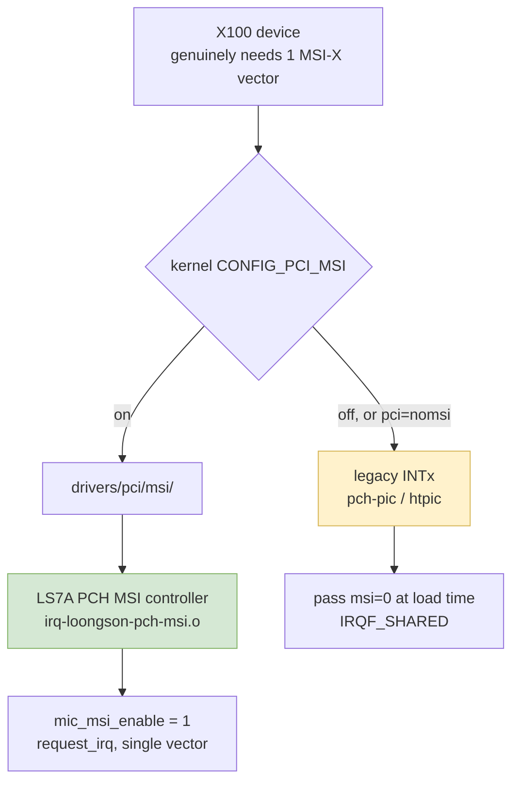
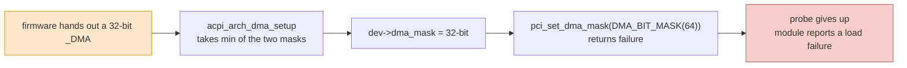

# Chapter 7 — The LoongArch Platform: What It Can and Cannot Provide

> This chapter is about the host platform only, not about driver code. The criteria come in two kinds: upstream kernel source (clickable kernel.org links) and on-hardware transcripts (the `lspci` output in the MPSS user guide).
> Wherever something cannot be found in upstream source and is not in the manual either, this chapter says "not verified" outright rather than passing inference off as a conclusion.
> The previous chapter is [Chapter 6 — Kernel API Drift](06-kernel-api-drift.md); this chapter reuses the coupling numbers (F1–F7, H1–H4) from [Chapter 5 — x86 Coupling Audit](05-x86-coupling-audit.md).

---

## 7.1 Where Mainline Support Starts, and the Fact of the "New World"

The timeline has to be pinned down first. `arch/loongarch` does not appear in mainline until **v5.19** ([tree @ v5.19](https://git.kernel.org/pub/scm/linux/kernel/git/torvalds/linux.git/tree/arch/loongarch?h=v5.19)); the same path reports that it does not exist in **v5.18** ([tree @ v5.18](https://git.kernel.org/pub/scm/linux/kernel/git/torvalds/linux.git/tree/arch/loongarch?h=v5.18)). That contrast says it plainly: anyone thinking of "adding LoongArch to an early 5.x kernel" has to build the wheel themselves; what is usable is 5.19 and later, and this project reckons in 6.x.

In the 6.6 stable branch, `arch/loongarch/Kconfig` has the architecture **unconditionally** select a batch of options ([Kconfig @ linux-6.6.y](https://git.kernel.org/pub/scm/linux/kernel/git/stable/linux.git/plain/arch/loongarch/Kconfig?h=linux-6.6.y)):

| Option | What it means in the source | Effect on this port |
|---|---|---|
| `ACPI` / `ACPI_MCFG` / `ACPI_PPTT` | PCI is described by MCFG, CPU topology by PPTT | whether the slot gets enumerated depends on the firmware's MCFG |
| `EFI` | the firmware interface is UEFI-class | the motherboard has to be in new-world form |
| `PCI` / `PCI_LOONGSON` | PCI enumeration depends on the Loongson host-bridge driver | see 7.4 |
| `PCI_MSI_ARCH_FALLBACKS` | allows the architecture fallback path for PCI MSI | see 7.5 |
| `SWIOTLB` / `ZONE_DMA32` | bounce buffering is always on, and a 32-bit DMA zone is kept | see 7.6; if the mask is ever narrowed, these two are the backstop |
| `HAVE_DMA_CONTIGUOUS` | support for coherent DMA areas | compounds with the mask narrowing in 7.6 |
| `GENERIC_IOREMAP` / `ARCH_IOREMAP` / `ARCH_WRITECOMBINE` | on LoongArch, `GENERIC_IOREMAP` is covered by `select` (`v6.6/arch/loongarch/Kconfig:76`: `select GENERIC_IOREMAP if !ARCH_IOREMAP`), while `ARCH_IOREMAP` and `ARCH_WRITECOMBINE` are two optional items that are off by default (same file, `:472` and `:479`, both of which write only `bool "…"` with no `default` at all); to get write-combining you have to turn `ARCH_WRITECOMBINE` on yourself | see 7.7 and 7.9 |

From this one can draw an unambiguous conclusion: **mainline LoongArch recognises only the UEFI + ACPI new-world route**, and PC-style firmware (PMON plus a device tree, commonly called the old world) has no corresponding support path upstream.

One caveat has to be stated: this round did **not** obtain citable upstream documentation for "the full differences between the new world and the old world in firmware interface, binary interface and distribution support": this environment has no search engine, hostname resolution for Wikipedia is refused, fetching `blog.xen0n.name` fails, and the LoongArch page on the Arch Wiki returns 404. So this chapter uses those two terms only **within what mainline kernel source can prove**, and does not open up the community context.

The first precondition that follows from 7.1: the target machine must be in UEFI + ACPI form, and the firmware's MCFG and resource descriptions must actually cover the root complex the card is to be plugged into; if the firmware does not describe that slot at all, none of the discussion that follows needs to happen.


---

## 7.2 Page Size: 4 KB Is an Option, Not the Default

In `arch/loongarch/include/asm/page.h`, `PAGE_SHIFT` can be **12 / 14 / 16**, that is, 4 KB / 16 KB / 64 KB ([page.h @ linux-6.6.y](https://git.kernel.org/pub/scm/linux/kernel/git/stable/linux.git/plain/arch/loongarch/include/asm/page.h?h=linux-6.6.y)); 6.6's `arch/loongarch/Kconfig` offers all three page sizes combined with three-level or four-level page tables, and **the architecture's default page size is 16 KB** (same Kconfig link as 7.1). By 6.12 this way of organising the page-size options has been rewritten (feature declarations in the `HAVE_PAGE_SIZE_*` form appear), so **do not hard-code the 6.6 option names into scripts or documents** ([Kconfig @ linux-6.12.y](https://git.kernel.org/pub/scm/linux/kernel/git/stable/linux.git/plain/arch/loongarch/Kconfig?h=linux-6.12.y)).

This changes the character of the project considerably. Chapter 5 recorded the page-size-related couplings as "latent" for the time being, the reason being that 4 KB is the default on x86 while the couplings are hard-coded; once the deployed kernel takes the 16 KB default, that batch of couplings **becomes a live problem immediately**:

| No. | Location | The coupling | At 4 KB | At 16 KB |
|---|---|---|---|---|
| F3 | `include/mic/micpsmi.h:56-57` | `MIC_PSMI_PAGE_SIZE = PAGE_SIZE << 7` | 512 KB | 2 MB |
| F4 | one GTT page shift | the page granularity at which the card sees the host | 12 | must be pinned to 12 |
| H2 | `include/mic/micscif.h:124-128`, `include/mic/mic_dma_md.h:87-91` | `#undef L1_CACHE_SHIFT` / `#define L1_CACHE_SHIFT 6` | 64 B | 64 B (the value still holds) |

Written as MathJax, the F3 formula is:

$$
\text{MIC\_PSMI\_PAGE\_SIZE} \;=\; \text{PAGE\_SIZE} \times 2^{7}
$$

At a 4 KB page it works out to 512 KB, at a 16 KB page to 2 MB — yet the PSMI page contract on the card side is fixed and does not follow the host's page size. This is a coupling whose **value drifts with the host configuration while the compiler says nothing**, and it belongs to that line from Chapter 5: everything silent is more dangerous than everything that errors.

H2's nature has to be stated separately: `L1_CACHE_SHIFT 6` is tied not to the page size but to the **cache line**. A LoongArch L1 cache line is 64 bytes, the same as on x86-64, so the value of the constant itself agrees on both sides; but the same 6 is used to compute the length unit of DMA descriptors (`include/mic/mic_dma_md.h:419` shifts a byte count right by `L1_CACHE_SHIFT`), so what has to be confirmed when changing platform is "the cache line is still 64 bytes", not "the page size is still 4 KB".

The remedy is straightforward: **build the host kernel with 4 KB pages** (`CONFIG_PAGE_SIZE_4KB`) and keep treating this batch of couplings as "latent". The second choice is to change these constants one by one so that they compute from the actual page size, but that requires separately arguing why the card-side contract can accept 2 MB — that is another piece of work, not part of the port. See [Chapter 8 — Migration Roadmap](08-migration-roadmap.md).

The one place in the manual that spells out the page unit also comes down on the side of this choice: the user guide defines the value of `/proc/scif/reg_cache_limit` as "a decimal number counted in 4 KB pages" (`_work/pdf/mpss_users_guide.txt:5043`), that is, Intel treats 4 KB as the default unit in its documentation. But the code implementing that limit goes by the host's actual page size — the default limit in the code is 0x20000 pages (`include/mic/micscif.h:110`), and comparisons convert with `cur_bytes >> PAGE_SHIFT` (`micscif/micscif_rma.c:1471`, `:1474`), so at a 4 KB page it is 512 MiB and at a 16 KB page it becomes 2 GiB. The manual speaks only in pages while the code drifts with the host; this mismatch is recorded in [Appendix D — Manual Cross-Check](D-manual-crosscheck.md) §D.6.

---

## 7.3 Address Space and Mapping Windows

`arch/loongarch/include/asm/addrspace.h` lays out this address map ([addrspace.h @ linux-6.6.y](https://git.kernel.org/pub/scm/linux/kernel/git/stable/linux.git/plain/arch/loongarch/include/asm/addrspace.h?h=linux-6.6.y)):

| Constant | Value | Plain meaning |
|---|---|---|
| `PHYS_OFFSET` | `0` | the physical base address is 0 |
| `DMW_PABITS` | `48` | the direct-mapping window carries 48 physical address bits |
| `PAGE_OFFSET` | `CACHE_BASE + PHYS_OFFSET` | the start of the linear mapping is decided by the DMW cached window |
| `FIXADDR_TOP` | `0xfffe0000` | top of the fixmap area |
| `XUVRANGE` / `XSPRANGE` / `XKPRANGE` / `XKVRANGE` | `0x0…` / `0x4000…` / `0x8000…` / `0xc000…` | user segment / special segment / kernel physical segment / kernel virtual segment (ioremap takes its addresses here) |
| `PCI_IOBASE` with `PCI_IOSIZE = SZ_32M` | 32 MiB | the PCI I/O port window |

That disposes of a common worry in passing: **the 32 MiB I/O port window is not a constraint**. Both of the X100's BARs are Memory BARs — BAR0 is an 8 GiB 64-bit prefetchable window and BAR4 a 128 KiB 64-bit non-prefetchable one (for the on-hardware `lspci`, see [Chapter 2](02-knc-hardware-firmware.md)) — and it does not need a single I/O port.

The real constraints come down to two things: how much can be mapped inside `XKVRANGE`, and how much room the firmware leaves for PCI memory windows. The latter is the subject of 7.4.

---

## 7.4 The PCIe Host Bridge: LS7A and Its Officially Flagged "Non-Compliant BARs"

The LS7A host bridge and its seven PCIe root ports are driven by `drivers/pci/controller/pci-loongson.c`, and the port device IDs are `0x7a09 / 0x7a19 / 0x7a29 / 0x7a39 / 0x7a49 / 0x7a59 / 0x7a69` (DEV_LS7A_PCIE_PORT0…6, [pci-loongson.c @ linux-6.6.y](https://git.kernel.org/pub/scm/linux/kernel/git/stable/linux.git/plain/drivers/pci/controller/pci-loongson.c?h=linux-6.6.y)). Taken one by one, the settings in that same file that concern the 7A root complex read like this:

| What the code does | Plain meaning | Effect on the 8 GiB BAR |
|---|---|---|
| `non_compliant_bars` | upstream uses it only to flag LS7A's three system-bus devices, and it has nothing to do with BAR assignment on the PCIe root ports: `system_bus_quirk()` sets `mmio_always_on` / `non_compliant_bars` on `DEV_LS2K_APB 0x7a02`, `DEV_LS7A_CONF 0x7a10` and `DEV_LS7A_LPC 0x7a0c` (`v6.6/drivers/pci/controller/pci-loongson.c`) | Loongson's PCIe ports go through `bridge_class_quirk()` and `loongson_mrrs_quirk()` (`bridge->no_inc_mrrs = 1`, same file), so `non_compliant_bars` cannot be used as the basis for "move the 8 GiB BAR0 above 4 GiB and keep it contiguous" |
| `system_bus_quirk` sets `mmio_always_on` | memory-mapped I/O is always on | no direct negative effect |
| `bridge->no_inc_mrrs = 1` | MRRS may not be increased | sequential access throughput through the large window suffers |
| custom ECAM, `bus_shift = 16` | configuration space is accessed differently from the standard | enumeration behaviour has been specially patched upstream |

Then comes the heaviest fact in this chapter: **nowhere in upstream source** is there an x86-style "Above 4G Decoding" switch, or any equivalent of it, implemented for the LoongArch platform. What that BIOS option does on x86 — move the whole 64-bit MMIO window above 4 GiB and give it an 8 GiB contiguous hole — can only come, on LoongArch, from the resource windows described in the firmware's ACPI tables; the kernel has no switch that can stand in.

- Evidence one: `arch/loongarch/Kconfig` unconditionally does `select ACPI` and `select ACPI_MCFG` (link in 7.1), and PCI resource windows are decided by the firmware's ACPI tables;
- Evidence two: the closest first-hand upstream material on "a large window above 4 GiB" is the single `non_compliant_bars` line, which shows that the upstream authors know LS7A's BAR implementation is non-compliant, yet provide **no** remedial switch;
- Evidence three: the PCIe specification revision of the Loongson SoC/PCH, the link width, and how large a 64-bit prefetchable window a single root port can hand out — no citable Loongson documentation was obtained this round, so this is written **not verified**.

Why is this a hard requirement rather than a "nice to have"? Because the MPSS user guide itself writes it down as mandatory. The first item under BIOS configuration in §3.1.2 of the manual reads, verbatim:

> "BIOS and OS support for large (8GB+) Memory Mapped I/O Base Address Registers (MMIO BAR's) above the 4GB address limit must be enabled. In some instances, motherboard BIOS implementations have this feature set to disabled and it must be enabled manually." [`_work/pdf/mpss_users_guide.txt:1099`–`:1102`]

The troubleshooting flow in §3.4 of the manual is the same: "the card is recognised but resources were not assigned → go and check the BIOS's large-BAR support". The BIOS switch that whole section of the manual assumes **has no counterpart** in mainline LoongArch. That is the entire reason this chapter lists the 8 GiB window as unknown item number one.

---

## 7.5 Interrupts: the MSI-X Route Is Open

On the LoongArch LS7A platform the interrupt controllers come in two halves, and both are in mainline ([drivers/irqchip/Makefile @ linux-6.6.y](https://git.kernel.org/pub/scm/linux/kernel/git/stable/linux.git/plain/drivers/irqchip/Makefile?h=linux-6.6.y)): on one side `irq-loongson-pch-msi.o` (controlled by `CONFIG_LOONGSON_PCH_MSI`), the MSI controller built into the PCH; on the other `irq-loongson-pch-pic.o`, `irq-loongson-htpic.o`, `irq-loongson-liointc.o`, `irq-loongson-eiointc.o`, `irq-loongson-htvec.o`, `irq-loongson-pch-lpc.o` and `irq-loongarch-cpu.o`, the whole path from MSI down to legacy INTx.

That establishes the following: **MSI/MSI-X can take the PCH route, and legacy INTx is still there too**, both routes existing at once. On the kernel side `CONFIG_PCI_MSI` has to be enabled (the official MSI guide, [Documentation/PCI/msi-howto.rst @ linux-6.6.y](https://git.kernel.org/pub/scm/linux/kernel/git/stable/linux.git/plain/Documentation/PCI/msi-howto.rst?h=linux-6.6.y)); that guide also states that MSI-X supports 1–2048 vectors, that MSI has at most 32 and they must be contiguous, that MSI-X can point different vectors at different CPUs, and that `pci=nomsi` pushes the whole machine **globally** back to INTx.

On the driver side the vector requirement is tiny: `MIC_NUM_MSIX_ENTRIES` is **1**. And the driver already leaves itself a way down — `mic_msi_enable` defaults to 1, and passing `msi=0` at load time means MSI-X is not requested and the driver takes the shared INTx route via `request_irq(..., IRQF_SHARED)` (`host/linux.c:347`). So on LoongArch, the interrupt question is which route to take.



Two points still await measurement: whether the device's MSI-X capability table can be carried properly by the LS7A's PCH MSI controller (**not verified**), and the PCIe specification revision and link width of the Loongson SoC/PCH (**not verified**; upstream source carries no such platform parameters).

---

## 7.6 DMA: No IOMMU Is Good News, but One Line of Firmware Can Strangle probe

Three things have to be read side by side in this section.

First: 6.6's `drivers/iommu/Kconfig` has **no** Loongson/LoongArch entry, and `IOMMU_DMA` depends on ARM64 / IA64 / X86 ([drivers/iommu/Kconfig @ linux-6.6.y](https://git.kernel.org/pub/scm/linux/kernel/git/stable/linux.git/plain/drivers/iommu/Kconfig?h=linux-6.6.y)). The conclusion is unambiguous: **mainline LoongArch has no IOMMU driver that device DMA could use**. Together with the architecture unconditionally doing `select SWIOTLB` / `select ZONE_DMA32` / `select HAVE_DMA_CONTIGUOUS`, device DMA on LoongArch is **direct mapping** — the range a device can address is simply the intersection of the mask with the physical memory ranges.

Second: `arch/loongarch/kernel/dma.c` contains exactly one function, `acpi_arch_dma_setup()`, which reads the ACPI `_DMA` range, computes the range's end address `end`, then sets `bus_dma_limit` and `dma_range_map` and **takes the minimum of both masks** ([dma.c @ linux-6.6.y](https://git.kernel.org/pub/scm/linux/kernel/git/stable/linux.git/plain/arch/loongarch/kernel/dma.c?h=linux-6.6.y)):

$$
\text{mask} \;=\; \text{DMA\_BIT\_MASK}\bigl(\lfloor \log_2 \text{end} \rfloor + 1\bigr)
$$

$$
\text{dev->coherent\_dma\_mask} \;=\; \min(\text{dev->coherent\_dma\_mask},\ \text{mask}), \qquad *\text{dev->dma\_mask} \;=\; \min(*\text{dev->dma\_mask},\ \text{mask})
$$

Third: the MPSS host driver's mask handling during probe **treats the two masks differently**. Line by line, `host/linux.c` reads like this:

```c
pci_set_master(pdev);
err = pci_reenable_device(pdev);                            // :273  the return value of this line is thrown away
err = pci_set_dma_mask(pdev, DMA_BIT_MASK(64));             // :274  streaming mask: 64-bit only
if (err) { printk("ERROR DMA not available"); goto probe_freebd; }
err = pci_set_consistent_dma_mask(pdev, DMA_BIT_MASK(64));   // :279  coherent mask
if (err) {
        err = pci_set_consistent_dma_mask(pdev, DMA_BIT_MASK(32));   // :282  here there is a 32-bit fallback
        if (err) goto probe_freebd;
}
```

In other words: **the coherent mask has a 32-bit escape route, the streaming mask does not**. That asymmetry is itself evidence — whoever wrote this code did think about 32-bit DMA, and conceded only on coherent allocations. On LoongArch, the firmware's `_DMA` narrowing lands on both masks at once: the coherent mask can be caught by the 32-bit request at `:282`, while **the streaming mask decides probe success or failure right there at `:274`**, and that one has no second step.

One honest uncertainty also has to be stated: `pci_set_dma_mask()` overwrites `*dev->dma_mask` with the requested value, but the `dev->bus_dma_limit` that `acpi_arch_dma_setup()` set is not thereby revoked. So which route is taken after the firmware's narrowing depends on what `dma_supported()` decides, and there are two possible outcomes: (a) `:274` fails → probe stops, and this one **is loud**; (b) `:274` succeeds but `bus_dma_limit` is still in force → mappings beyond that limit are refused at mapping time or taken over by a bounce buffer, which for this driver means **silent misbehaviour**. This chapter does not guess which, and hands the question to the step 3 experiment in 7.12.

Chained together, those three form a path that can falsify this port outright. The good news is that this path **is loud**: it does not silently corrupt memory, it fails to load the module and leaves an explicit error in `dmesg`.



Conversely, if the firmware does **not** give this device a `_DMA`, `acpi_dma_get_range()` gets no range, the narrowing logic above never runs, and the mask stays at the 64 bits the driver asked for — and in direct-mapping mode with no IOMMU, that is workable.

Now for the good side, which matters more than the point above because it is **silent**.

No IOMMU on LoongArch means `pci_map_*` returns the host physical address. And the MPSS driver assumes exactly that all over the place: `micscif/micscif_smpt.c:123` pre-warms the table with identity entries, and the `pci_map_single` result at `:198` goes straight into the SMPT virtual address computation; `dma/mic_dma_lib.c:216` and `include/mic/micscif_map.h:201` are the same. So **the absence of an IOMMU works in this port's favour**: it makes the code's implicit assumption true.

But precisely because it is favourable, it has to be written down as an **explicit precondition**, and the reason is the failure mode: the day an IOMMU is added to LoongArch, this code will not fail to compile — it will write descriptors to the wrong physical address and quietly destroy the card's boot data along the way. That is why Chapter 5 lists this as F5.

The same fact carries a risk in the other direction, coming from the other half of what "no IOMMU" means: the driver has **zero** `dma_alloc_coherent` and **zero** `dma_sync_*` anywhere in the tree, and its only synchronisation primitive is a single `wmb()` (`dma/mic_dma_lib.c:417`). The correctness of descriptor and status write-backs therefore depends entirely on the platform declaring this device I/O-coherent. That holds by default on x86 servers; on LoongArch it **needs to be confirmed on real hardware** — and a confirmation that fails looks like silent data corruption again, not like an error.

---

## 7.7 Write-Combining: the Expected Degradation of `ioremap_wc()`

LoongArch offers write-combining at the architecture level (`ARCH_WRITECOMBINE` in the 7.1 table), and the DMW base addresses do include a `WRITECOMBINE_BASE` slot (in the 7.3 `addrspace.h`). But in that same 6.6 `arch/loongarch/Kconfig` there is a further note: **when paired with LS7A, WUC falls outside the scope of the cache-coherency mechanism (upstream calls this a PCIe protocol violation), so the option is off by default and `ioremap_wc()` silently degrades to strongly-ordered uncached (SUC)**.

The source was retrieved verbatim this round: `v6.6/arch/loongarch/Kconfig:479`–`:493`:

```
config ARCH_WRITECOMBINE
	bool "Enable WriteCombine (WUC) for ioremap()"
	help
	  LoongArch maintains cache coherency in hardware, but when paired
	  with LS7A chipsets the WUC attribute (Weak-ordered UnCached, which
	  is similar to WriteCombine) is out of the scope of cache coherency
	  machanism for PCIe devices (this is a PCIe protocol violation, which
	  may be fixed in newer chipsets).

	  This means WUC can only used for write-only memory regions now, so
	  this option is disabled by default, making WUC silently fallback to
	  SUC for ioremap(). You can enable this option if the kernel is ensured
	  to run on hardware without this bug.

	  You can override this setting via writecombine=on/off boot parameter.
```

That passage settles three things at once: the option is **off by default**; while it is off, `ioremap_wc()` **silently** degrades to SUC; and the switch is already available as a boot parameter. The second is plain to see in the source — `v6.6/arch/loongarch/include/asm/io.h:55`–`:57` defines `ioremap_wc()` as a macro that reads `wc_enabled`, and `wc_enabled` is initialised from that very option at `v6.6/arch/loongarch/kernel/setup.c:163`–`:169` and picked up at `:182` by `early_param("writecombine", setup_writecombine)`.

The MPSS host side maps that 8 GiB card memory window with `ioremap_wc()` (`host/uos_download.c:1156`, `:1546`). On a chipset like LS7A, without explicitly adding the switch the result is strongly-ordered uncached, and sequential copy throughput through the 8 GiB window drops noticeably — it is **degraded by default**, not "possibly degraded". This is not a correctness problem; it is a **first-order performance risk** (H3 in [Chapter 5](05-x86-coupling-audit.md)). The same goes for `pgprot_writecombine()` at `micscif/micscif_api.c:2991` (H4): on LoongArch it too is a function that reads `wc_enabled` (`v6.6/arch/loongarch/include/asm/pgtable-bits.h:110`–`:119`), the same switch as H3 and the same single measurement.

There are three ways to handle this, in order of cost: (a) boot once with `writecombine=on`, confirm that `wc_enabled` takes effect, and then measure the actual attribute and throughput of `ioremap_wc()`; (b) accepting the degradation as real, move the boot image in larger access granularity to reduce the number of MMIO transactions; (c) the long-term right answer is to route boot-image movement through the DMA engine rather than CPU copies as far as possible — but that touches the data flow in `host/uos_download.c` and amounts to a rewrite rather than a port.

---

## 7.8 Memory Ordering: x86's TSO Versus LoongArch's Weak Ordering

`arch/loongarch/include/asm/barrier.h` defines `__WEAK_LLSC_MB "dbar 0x700"` and defines `__smp_mb__before_atomic()` / `__smp_mb__after_atomic()` as `barrier()`, on the grounds that LoongArch's LL/SC carries strongly-ordered semantics of its own ([barrier.h @ linux-6.6.y](https://git.kernel.org/pub/scm/linux/kernel/git/stable/linux.git/plain/arch/loongarch/include/asm/barrier.h?h=linux-6.6.y)). The two sides compare as follows:

| Semantics | x86-64 | LoongArch | Consequence for the driver |
|---|---|---|---|
| `wmb()` | basically only a compiler barrier | emits a real `dbar` | the ordering guarantee between a doorbell register write and a descriptor write is, on LoongArch, a real barrier with a cost |
| ordering of ordinary stores | the hardware guarantees TSO | weak ordering, explicit barriers required | sequences such as "write the descriptor, then ring the doorbell" must each be confirmed to have a barrier |
| atomics carry their own barrier | yes | LL/SC is strongly ordered by itself | the same name means different things on the two sides |

For this project that is an **invisible** coupling. The count in Chapter 5 — "only 3 lines of inline assembly on the host path" — is true, but memory ordering is not written in inline assembly; it is default semantics. The report therefore lists this as platform-side P1-C, and the way to handle it is to audit, one by one, the ordering between each doorbell register write and the descriptor write that precedes it, rather than hoping a compiler error will surface it. For the relevant code locations see A.2 and A.6 of [Appendix A — Interface Contracts](A-interface-contracts.md).

---

## 7.9 There Is No x86 PAT Equivalent

Mapping attributes on LoongArch are **coarse-grained**: cached / uncached / write-combining are decided by address segment and architecture configuration, and `addrspace.h` ties `IO_BASE`, `CACHE_BASE`, `UNCACHE_BASE` and `WRITECOMBINE_BASE` to the CSR's DMW base addresses (link in 7.3). It does not pick per page from a menu of attributes the way x86 PAT does; only three are on offer — `_CACHE_SUC` (strongly-ordered uncached), `_CACHE_CC` (coherent cached) and `_CACHE_WUC` (weakly-ordered uncached), all three defined at `v6.6/arch/loongarch/include/asm/pgtable-bits.h:64`–`:71`; with `ARCH_WRITECOMBINE` off, `ioremap_wc()` silently falls back to `_CACHE_SUC` (same file, `:116`), which is the thing 7.7 has to deal with.

The engineering implication is plain: for the batch of `pgprot_*` / `ioremap_*` attribute calls that Chapter 5 registers as "latent" (H3, H4), there is very little room to adjust anything on LoongArch — you use what you are given. Whether `memremap()` and `ioremap()` behave exactly as on x86 on LoongArch is marked **not verified** in this chapter.

---

## 7.10 The Life Story of Upstream `drivers/misc/mic/`: Which Tree Is Actually Being Ported

This timeline has to be established first, otherwise it is easy to fall for the misconception "upstream has it, doesn't it? Just turn the option on".

| Version | State of that path | Evidence |
|---|---|---|
| v3.12 and earlier | does not exist | [tree @ v3.12](https://git.kernel.org/pub/scm/linux/kernel/git/torvalds/linux.git/tree/drivers/misc/mic?h=v3.12) reports that the path does not exist |
| v3.13 | introduced, arriving with four patches: the host driver `b170d8ce…`, SMPT `a01e28f6…`, COSM `3a6a9201…`, the MIC bus `aa27bad…` | [tree @ v3.13](https://git.kernel.org/pub/scm/linux/kernel/git/torvalds/linux.git/tree/drivers/misc/mic?h=v3.13), [commit b170d8ce](https://git.kernel.org/pub/scm/linux/kernel/git/torvalds/linux.git/commit/?id=b170d8ce3f81bd97e85756e9184779a56a5f55a7) |
| v5.9 | **the last complete version**, containing `bus/ card/ common/ cosm/ cosm_client/ host/ scif/ vop/` plus `Kconfig` and `Makefile` | [tree @ v5.9](https://git.kernel.org/pub/scm/linux/kernel/git/torvalds/linux.git/tree/drivers/misc/mic?h=v5.9) |
| v5.10 | **deleted**: `80ade22c06ca115b81dd168e99479c8e09843513` "misc: mic: remove the MIC drivers" (Sudeep Dutt, 2020-10-28, 65 files changed, 21361 lines deleted) | [log @ v5.10](https://git.kernel.org/pub/scm/linux/kernel/git/torvalds/linux.git/log/drivers/misc/mic?h=v5.10), [commit 80ade22c](https://git.kernel.org/pub/scm/linux/kernel/git/torvalds/linux.git/commit/?id=80ade22c06ca115b81dd168e99479c8e09843513) |
| v5.10 and later | does not exist. Cross-check: the same file has content in the 5.4 stable branch and 404s in the 5.10 stable branch | [mic_main.c @ 5.4.y](https://git.kernel.org/pub/scm/linux/kernel/git/stable/linux.git/plain/drivers/misc/mic/host/mic_main.c?h=linux-5.4.y), [same @ 5.10.y](https://git.kernel.org/pub/scm/linux/kernel/git/stable/linux.git/plain/drivers/misc/mic/host/mic_main.c?h=linux-5.10.y) (404) |

So the route of "turning on a MIC option in a new kernel" is closed — that directory does not exist in 6.x. Two are left:

1. **Port the out-of-tree `mic.ko` that ships with MPSS**, which is this project's actual object: 38 objects, 32,746 lines (the inventory is in [Appendix B — File Inventory](B-file-inventory.md));
2. Lift that whole v5.9 tree out of mainline and carry it out-of-tree, then add the 6.x adaptations yourself.

The two routes cover different ground, and **route 2 cannot cover route 1**:

| Directory | Upstream v5.9 | MPSS 3.8.6 out-of-tree | Note |
|---|---|---|---|
| `host/` | present | present | the bulk of this project |
| `card/` | present | present (card side) | not compiled on the host side, zero effort |
| `scif/` vs `micscif/` | present | present | two implementations of the same source, not interchangeable |
| `vop/` vs `vnet/` + `virtio/` | present | present | virtual networking |
| `bus/`, `cosm/`, `cosm_client/` | present | **no counterpart** | the bus and card-OS state layer that only upstream has |
| `vcons/` | absent | present | virtual console |
| `mpssboot/` | absent | present | card boot |
| `ras/`, `ramoops/` | absent | present | crash records and RAS |
| `trace_capture/` | absent | present | dead code, see Chapter 5 |

In other words: the value of the upstream tree is as a **public reference for the same source** (a second implementation that the same group of Intel engineers later sent to mainline), not as a finished article that can be moved over wholesale; and it also contains `bus/`, `cosm/` and `cosm_client/`, which MPSS does not have. As for upstream's specific reasons for deleting the tree in 2020, this chapter does not quote the patch body verbatim and marks it **not verified**.

---

## 7.11 Platform-Side Risk Ranking

The seven sections above are compressed into one table. The ranking principle follows Chapter 5: **silent before loud**, and silent failures that happen at load time come first.

| Level | Risk | Basis | Symptom |
|---|---|---|---|
| **P0-A** | whether the firmware and host bridge can hand out a contiguous 64-bit prefetchable window of ≥ 8 GiB located above 4 GiB | no equivalent of "Above 4G Decoding": upstream fits LS7A's PCIe ports with `bridge_class_quirk()` and `loongson_mrrs_quirk()` (`v6.6/drivers/pci/controller/pci-loongson.c`), and `non_compliant_bars` lands only on the three system-bus devices managed by `system_bus_quirk()`, `0x7a02` / `0x7a10` / `0x7a0c`, so it does not govern how root ports assign BARs; manual §3.1.2 | one of two: BAR0 gets no allocation at all → `failed to reserve aperture space` (`host/linux.c:303`) and exit; or the window is merely smaller than 8 GiB → probe gets through, but "memory available on the card" shrinks with the window (`host/uos_download.c:592`–`:594`), which may be too little to bring the card's system up |
| **P0-B** | whether the firmware's ACPI `_DMA` narrows this device's mask to 32 bits | `acpi_arch_dma_setup()` takes `min()` of the two masks; the streaming mask at `host/linux.c:274` wants 64 bits only (`:282` leaves a 32-bit fallback for the coherent mask alone); `bus_dma_limit` is not revoked by the driver | either probe errors out and exits (loud), or the mapping stage is silently limited by `bus_dma_limit` |
| **P1-A** | treating "no IOMMU, direct mapping" as a default without writing it down as a precondition | mainline has no LoongArch IOMMU driver; the driver uses `pci_map_*` results as physical addresses | if an IOMMU ever appears, addresses are silently corrupted |
| **P1-B** | write-combining degrades to strongly-ordered uncached | the note in the 6.6 Kconfig that only SUC is usable with LS7A | throughput through the 8 GiB window collapses (performance, not correctness) |
| **P1-C** | write ordering between doorbell and descriptor under a weakly-ordered memory model | the `dbar` definition in `barrier.h`; the tree's only synchronisation is a single `wmb()` | intermittent, hard-to-reproduce card-side faults |
| **P1-D** | zero `dma_alloc_coherent` and zero `dma_sync_*` in the driver | a tree-wide search comes back zero; the only `wmb()` is at `dma/mic_dma_lib.c:417` | if the platform does not declare the device I/O-coherent, descriptor write-backs go wrong |
| **P2-A** | page size defaults to 16 KB rather than 4 KB | 12/14/16 in `page.h`; the 6.6 Kconfig default is 16 KB | F3/F4 silently compute wrong |
| **P2-B** | config-name and interface drift from 6.6 to 6.12 | page-size options reorganised, `hvc_remove()` return value changed, the legacy MSI interface deprecated throughout | see [Chapter 6](06-kernel-api-drift.md) |
| **P2-C** | the upstream MIC tree was deleted in v5.10 | `80ade22c…` | all out-of-tree maintenance cost is yours, with no free adaptations |
| **P3** | hardware feasibility (slot, power, cooling) | this environment has no citable public specifications and the vendor site was not fetched | must be measured |

---

## 7.12 Six Minimal Checks Before Going On the Machine

The six steps below are a **verification design** (derived from the facts in 7.1–7.6), not a documentary conclusion; this environment has no real machine, so only observation points and criteria are given and no specific commands are invented — commands differ from distribution to distribution and from firmware to firmware.

1. **Firmware form and ACPI coverage.** Observation point: the machine is in UEFI + ACPI form, and MCFG and the resource descriptions cover the root complex that owns the target slot. Criterion: the slot appears in the enumeration result; if it is not within the enumeration range at all, none of the next five steps needs doing. Basis: the architecture unconditionally does `select ACPI` / `select ACPI_MCFG` / `select EFI`.
2. **Whether the 8 GiB window can be assigned** (corresponds to P0-A). Observation point: whether a window of the form `Memory at 3c7e00000000 (64-bit, prefetchable) [size=200000000]` appears among the device's resource lines — that is the exact shape of the on-hardware output in the MPSS manual. Criterion: the window exists, is ≥ 8 GiB, and sits above 4 GiB. This is criterion number one for the whole audit.
3. **Measure the DMA mask** (corresponds to P0-B). Observation point: first see whether the firmware gives this device a `_DMA` and how many bits it gives (`acpidump` and the like), then use a minimal module to print `*dev->dma_mask` and `dev->coherent_dma_mask`. Criterion: both must be 64-bit, otherwise the MPSS driver's 64-bit mask request will fail. Basis: the take-the-minimum logic of `acpi_arch_dma_setup()`. **This experiment takes priority over any code porting.**
4. **Whether write-combining takes effect** (corresponds to P1-B). Observation point: map the same stretch of device memory the default way and the write-combining way, and compare sequential write throughput. Criterion: if write-combining is unavailable, the throughput expected of the 8 GiB card memory window must be re-estimated on the basis of strongly-ordered uncached.
5. **MSI-X vector capability.** Observation point: how many MSI-X vectors the device can obtain, and the set of CPUs they can be bound to. Basis: the 7A platform has a PCH MSI controller, and the official guide states that MSI-X supports 1–2048 vectors. Criterion: at least 1 vector must be obtained, and it must not be globally disabled by something like `pci=nomsi`.
6. **Actual page size and its blast radius** (corresponds to P2-A). Observation point: the actual page size of the deployed kernel, and every place that computes mappings, alignment or sizes on a 4 KB basis. Criterion: the three items F3/F4/H2 are each either confirmed or rewritten. If the distribution does not allow the page size to be changed, this has to be solved in the code.

The order of the six steps is deliberate: steps 1 and 2 are **whether it can be done at all**, step 3 is **whether it dies the moment it loads**, and only steps 4, 5 and 6 are **whether the result is any good to use**. If any of the first three fails, none of the code work that follows needs to start.

What this section gives is **the shape of the criteria**. Observation commands that can be copied directly, the one ordering rule the probe module must obey (the probe has to load before `mic.ko`, otherwise `dev->dma_mask` has already been overwritten by the driver), and where to look when a check fails, are collected in [Chapter 11 — On-Hardware Verification Checklist](11-verification.md).

---

## 7.13 Chapter Summary

Three sentences.

First, the LoongArch platform is **not** a platform "without PCIe support". The host-bridge driver, the PCH MSI controller, the legacy interrupt controllers and the weak-ordering barrier definitions are all in mainline; `PCI_MSI_ARCH_FALLBACKS` plus the PCH MSI controller make the X100's "needs only one MSI-X vector" solvable; and the 32 MiB I/O port window is irrelevant to it, because both of its BARs are Memory BARs.

Second, the LoongArch platform **has no** x86-style switch for "moving a large BAR above 4 GiB", and LS7A is explicitly flagged upstream as having non-compliant BARs. So "can a contiguous 64-bit prefetchable window of 8 GiB above 4 GiB be handed out" is the one link in this port that could be fatal, and it **can only be verified on real hardware**. The second gate alongside it is the firmware's ACPI `_DMA`: once it hands out a 32-bit range while the driver is "64 bits only, no fallback", probe fails outright.

Third, LoongArch **has no** IOMMU driver. That is good for this project — the driver assumes throughout that `pci_map_*` returns a physical address, and no IOMMU happens to make that assumption true — but it has to be written down as an explicit precondition, and its cost has to be acknowledged: the driver's DMA correctness rests entirely on the platform declaring the device I/O-coherent, and that too has to be confirmed on real hardware. The related code-side handling falls in [Chapter 8 — Migration Roadmap](08-migration-roadmap.md) and [Chapter 9 — Effort Estimate and Risk Register](09-effort-risk.md).

---

## Appendix: Items This Chapter Explicitly Marks "Not Verified"

| Item | Why it could not be found |
|---|---|
| an authoritative definition of the new world versus the old world in firmware interface, ABI and distribution support | no search engine; Wikipedia unreachable; fetching the xen0n blog failed; Arch Wiki 404 |
| the PCIe specification revision and link width of the Loongson SoC/PCH | the vendor site was not fetched, and mainline source carries no such parameters |
| how large a 64-bit prefetchable window any specific Loongson root port can hand out | upstream has no corresponding switch or constant; only measurement can say |
| whether the firmware gives this PCIe device a `_DMA`, and how many bits | needs `acpidump` on the target machine; the upstream code proves only that "if given, it narrows" |
| whether LoongArch has IOMMU hardware or an out-of-tree driver | at the mainline level it is confirmed that there is no driver; at the hardware level there is no public documentation to cite |
| the exact correspondence between the 6.6 and 6.12 page-size options | the 6.12 Kconfig has been refactored into `HAVE_PAGE_SIZE_*`, and this round did not compare them item by item |
| the actual attribute of `ioremap_wc()` on this bridge | the switch has been located (`CONFIG_ARCH_WRITECOMBINE` is off by default and can be overridden with `writecombine=on`), but it **must be measured**: map the same stretch of device memory both ways on that kernel version and compare throughput |
| whether the platform declares this device I/O-coherent | needs measurement; upstream makes no such declaration |
| the semantic difference between `memremap()` and `ioremap()` on LoongArch | no upstream documentation obtained |
| the specific reasons in the body of the upstream patch that deleted the MIC drivers (v5.10) | the patch description was not quoted verbatim |
| PCIe lane counts, slot power and chassis airflow for the 3A5000 / 3A6000 / 3C5000 / 3D5000 | no citable public specifications; the environment cannot search |
| precedents for porting large-BAR devices (GPGPU / FPGA / accelerator) that already exist on LoongArch | no search engine, no forum access |
