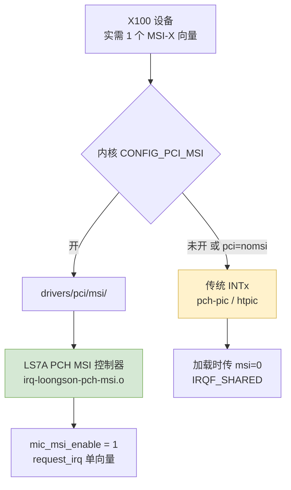

# 第七章　龙芯平台：给得出什么，给不出什么

> 　本章只谈宿主平台，不谈驱动代码。判据分两类：上游内核原文（可点开的 kernel.org 链接）与实机转录（MPSS 用户手册里的 `lspci` 输出）。
> 　凡上游源码里查不到、手册里也没有的，本章一律写明「未能核实」，不拿推断当结论。
> 　上一章是 [第六章　内核接口漂移](06-kernel-api-drift_CN.md)；本章沿用 [第五章　x86 耦合审计](05-x86-coupling-audit_CN.md) 的耦合编号（F1–F7、H1–H4）。

---

## 7.1　主线支持的起点，以及「新世界」这件事实

　　必须先把时间线钉死。`arch/loongarch` 在主线 **v5.19** 才出现（[tree @ v5.19](https://git.kernel.org/pub/scm/linux/kernel/git/torvalds/linux.git/tree/arch/loongarch?h=v5.19)）；同一路径在 **v5.18** 报路径不存在（[tree @ v5.18](https://git.kernel.org/pub/scm/linux/kernel/git/torvalds/linux.git/tree/arch/loongarch?h=v5.18)）。这条对照说明：任何「在 5.x 早期内核上加 LoongArch」的想法都要自己造轮子；能用的是 5.19 以后，本项目按 6.x 计算。

　　6.6 稳定分支的 `arch/loongarch/Kconfig` 里，架构**无条件**选择了一批配置（[Kconfig @ linux-6.6.y](https://git.kernel.org/pub/scm/linux/kernel/git/stable/linux.git/plain/arch/loongarch/Kconfig?h=linux-6.6.y)）：

| 配置 | 在源码里的含义 | 对本次移植的影响 |
|---|---|---|
| `ACPI` / `ACPI_MCFG` / `ACPI_PPTT` | PCI 由 MCFG 描述，CPU 拓扑由 PPTT 描述 | 插槽会不会被枚举，取决于固件的 MCFG |
| `EFI` | 固件接口是 UEFI 一类 | 主板必须处于新世界形态 |
| `PCI` / `PCI_LOONGSON` | PCI 枚举依赖龙芯主桥驱动 | 见 7.4 |
| `PCI_MSI_ARCH_FALLBACKS` | 允许 PCI MSI 的架构回退路径 | 见 7.5 |
| `SWIOTLB` / `ZONE_DMA32` | 反弹缓冲常开，保留 32 位 DMA 区 | 见 7.6，掩码一旦被压窄，靠这两个兜底 |
| `HAVE_DMA_CONTIGUOUS` | 支持一致性 DMA 区 | 与 7.6 的掩码收窄叠加 |
| `GENERIC_IOREMAP` / `ARCH_IOREMAP` / `ARCH_WRITECOMBINE` | `GENERIC_IOREMAP` 在龙芯上由 `select` 兜底（`v6.6/arch/loongarch/Kconfig:76`：`select GENERIC_IOREMAP if !ARCH_IOREMAP`），`ARCH_IOREMAP` 与 `ARCH_WRITECOMBINE` 是两个默认关闭的可选项（同文件 `:472`、`:479`，都只写了 `bool "…"` 而没有任何 `default`），要写合并得自己把 `ARCH_WRITECOMBINE` 打开 | 见 7.7 与 7.9 |

　　由此可以下一个不含糊的结论：**主线 LoongArch 只认 UEFI + ACPI 这条新世界路线**，PC 风格固件（PMON + 设备树，通称旧世界）在上游没有对应支持路径。

　　需要说明的是，「新世界与旧世界在固件接口、二进制接口、发行版支持上的完整差异」这次**没有**拿到可引用的上游文档：本环境无搜索引擎，Wikipedia 主机名解析被拒，`blog.xen0n.name` 抓取失败，Arch Wiki 的 LoongArch 页面 404。所以本章只在**主线内核源码能证明的范围内**使用这两个词，不展开社区语境。

　　由 7.1 推出的第一条前置条件：目标机必须处于 UEFI + ACPI 形态，并且固件的 MCFG 与资源描述确实覆盖要插卡的根复合体；固件若压根不描述那个插槽，后面所有讨论都不必进行。


---

## 7.2　页大小：4 KB 是可选项，不是默认项

　　`arch/loongarch/include/asm/page.h` 里 `PAGE_SHIFT` 可以取 **12 / 14 / 16**，也就是 4 KB / 16 KB / 64 KB 三种（[page.h @ linux-6.6.y](https://git.kernel.org/pub/scm/linux/kernel/git/stable/linux.git/plain/arch/loongarch/include/asm/page.h?h=linux-6.6.y)）；6.6 的 `arch/loongarch/Kconfig` 同时提供这三种页大小与三级/四级页表的组合，而**架构默认页大小是 16 KB**（同 7.1 的 Kconfig 链接）。到 6.12，这套页大小的配置组织方式已被改写（出现 `HAVE_PAGE_SIZE_*` 形态的特性声明），因此**不要把 6.6 的配置名写死进脚本或文档**（[Kconfig @ linux-6.12.y](https://git.kernel.org/pub/scm/linux/kernel/git/stable/linux.git/plain/arch/loongarch/Kconfig?h=linux-6.12.y)）。

　　这件事对本项目的性质改变很大。第五章把与页大小有关的耦合先按「潜在」记录，原因是 4 KB 在 x86 上是默认而耦合是写死的；一旦部署内核取 16 KB 默认值，那批耦合**立即变成活跃问题**：

| 编号 | 位置 | 耦合内容 | 4 KB 时 | 16 KB 时 |
|---|---|---|---|---|
| F3 | `include/mic/micpsmi.h:56-57` | `MIC_PSMI_PAGE_SIZE = PAGE_SIZE << 7` | 512 KB | 2 MB |
| F4 | GTT 页位移一处 | 卡看主机的页粒度 | 12 | 必须钉住 12 |
| H2 | `include/mic/micscif.h:124-128`、`include/mic/mic_dma_md.h:87-91` | `#undef L1_CACHE_SHIFT` / `#define L1_CACHE_SHIFT 6` | 64 B | 64 B（数值仍对） |

　　F3 的算式写成 MathJax 就是：

$$
\text{MIC\_PSMI\_PAGE\_SIZE} \;=\; \text{PAGE\_SIZE} \times 2^{7}
$$

　　4 KB 页下算出来是 512 KB，16 KB 页下算出来是 2 MB —— 而卡端 PSMI 的页面契约是固定的，不会跟着宿主页大小走。这是一处**数值随宿主配置漂移、编译器却不报警**的耦合，属于第五章那句「凡是静默的，都比凡是报错的更危险」。

　　H2 的性质要单独说清：`L1_CACHE_SHIFT 6` 绑定的不是页大小，而是**缓存行**。龙芯的 L1 缓存行是 64 字节，与 x86-64 相同，所以这个常量本身的数值在两边一致；但同一个 6 被用来算 DMA 描述符的长度单位（`include/mic/mic_dma_md.h:419` 把字节数右移 `L1_CACHE_SHIFT`），因此换平台时的确认依据是「缓存行还是 64 字节」，而不是「页大小还是 4 KB」。

　　处置办法很直接：**宿主内核按 4 KB 页构建**（`CONFIG_PAGE_SIZE_4KB`），把这批耦合继续按「潜在」处理。次选是把这些常量逐处改成按实际页大小计算，但那要额外论证卡端契约为什么能接受 2 MB —— 那是另一项工作，不是移植。详见 [第八章　移植路线](08-migration-roadmap_CN.md)。

　　手册里唯一一处交代页面单位的地方也站在这个选择这一边：用户指南把 `/proc/scif/reg_cache_limit` 的取值定义为「以 4 KB 页计的十进制数」（`_work/pdf/mpss_users_guide.txt:5043`），也就是 Intel 在文档上把 4 KB 当成了默认单位。可实现这个上限的代码按的是宿主实际的页大小 —— 代码里的默认上限是 0x20000 页（`include/mic/micscif.h:110`），比较时按 `cur_bytes >> PAGE_SHIFT` 折算（`micscif/micscif_rma.c:1471`、`:1474`），于是 4 KB 页下它是 512 MiB，16 KB 页下变成 2 GiB。手册只说页数、代码随宿主漂移，这处错位记在[附录 D　手册核对](D-manual-crosscheck_CN.md) §D.6。

---

## 7.3　地址空间与映射窗口

　　`arch/loongarch/include/asm/addrspace.h` 给出了这份地址地图（[addrspace.h @ linux-6.6.y](https://git.kernel.org/pub/scm/linux/kernel/git/stable/linux.git/plain/arch/loongarch/include/asm/addrspace.h?h=linux-6.6.y)）：

| 常量 | 取值 | 直白含义 |
|---|---|---|
| `PHYS_OFFSET` | `0` | 物理基址为 0 |
| `DMW_PABITS` | `48` | 直接映射窗口的物理地址位宽 48 |
| `PAGE_OFFSET` | `CACHE_BASE + PHYS_OFFSET` | 线性映射起点由 DMW 的缓存窗口决定 |
| `FIXADDR_TOP` | `0xfffe0000` | 固定映射区顶端 |
| `XUVRANGE` / `XSPRANGE` / `XKPRANGE` / `XKVRANGE` | `0x0…` / `0x4000…` / `0x8000…` / `0xc000…` | 用户段 / 特殊段 / 内核物理段 / 内核虚拟段（ioremap 在此取样） |
| `PCI_IOBASE` 与 `PCI_IOSIZE = SZ_32M` | 32 MiB | PCI I/O 端口窗口 |

　　由此可以顺手排掉一个常见担心：**32 MiB 的 I/O 端口窗口不是约束**。X100 的两块 BAR 都是 Memory BAR —— BAR0 是 8 GiB 的 64 位可预取窗口，BAR4 是 128 KiB 的 64 位不可预取窗口（实机 `lspci` 见 [第二章](02-knc-hardware-firmware_CN.md)）—— 它一个 I/O 端口都不需要。

　　真正的约束落在两处：`XKVRANGE` 里能映射多少，以及固件给 PCI 内存窗口留了多大。后者是 7.4 的主题。

---

## 7.4　PCIe 主桥：LS7A 和它被官方标注的「BAR 不规范」

　　LS7A 主机桥与它的七个 PCIe 根端口由 `drivers/pci/controller/pci-loongson.c` 驱动，端口设备 ID 是 `0x7a09 / 0x7a19 / 0x7a29 / 0x7a39 / 0x7a49 / 0x7a59 / 0x7a69`（DEV_LS7A_PCIE_PORT0…6，[pci-loongson.c @ linux-6.6.y](https://git.kernel.org/pub/scm/linux/kernel/git/stable/linux.git/plain/drivers/pci/controller/pci-loongson.c?h=linux-6.6.y)）。同一文件里针对 7A 根复合体的几处设置，逐条翻译过来是这样的：

| 代码里的动作 | 直白含义 | 对 8 GiB BAR 的影响 |
|---|---|---|
| `non_compliant_bars` | 上游只用它标记 LS7A 的三个系统总线设备，与 PCIe 根端口的 BAR 分配无关：`system_bus_quirk()` 对 `DEV_LS2K_APB 0x7a02`、`DEV_LS7A_CONF 0x7a10`、`DEV_LS7A_LPC 0x7a0c` 置 `mmio_always_on`／`non_compliant_bars`（`v6.6/drivers/pci/controller/pci-loongson.c`） | 龙芯的 PCIe 端口走的是 `bridge_class_quirk()` 与 `loongson_mrrs_quirk()`（`bridge->no_inc_mrrs = 1`，同一个文件），所以「把 8 GiB 的 BAR0 挪到 4 GiB 以上并连续保留」这件事不能拿 `non_compliant_bars` 当依据 |
| `system_bus_quirk` 里设 `mmio_always_on` | 内存映射 I/O 始终打开 | 无直接负面影响 |
| `bridge->no_inc_mrrs = 1` | 不允许增大 MRRS | 大窗口的顺序访问吞吐受影响 |
| 自定义 ECAM、`bus_shift = 16` | 配置空间访问方式与标准不同 | 枚举行为已被上游专门打过补丁 |

　　然后是本章最重的一条事实：**上游源码里没有任何一处**为龙芯平台实现 x86 风格的 「Above 4G Decoding」 开关或它的等价物。x86 上那个 BIOS 选项所做的事情——把 64 位 MMIO 窗口整体挪到 4 GiB 以上，并给一块 8 GiB 的连续空洞——在龙芯上只能来自固件 ACPI 表描述的资源窗口，内核没有开关可以代劳。

- 证据一：`arch/loongarch/Kconfig` 无条件 `select ACPI` 与 `select ACPI_MCFG`（7.1 的链接），PCI 资源窗口由固件 ACPI 表决定；
- 证据二：与「4 GiB 以上的大窗口」最接近的上游一手材料只有 `non_compliant_bars` 一行，它说明上游作者知道 LS7A 的 BAR 实现不规范，却**没有**提供任何补救开关；
- 证据三：龙芯 SoC/PCH 的 PCIe 规范版本、链路宽度、单个根端口能交出多大的 64 位可预取窗口 —— 这次没有拿到可引用的龙芯官方文档，写 **未能核实**。

　　为什么这是硬需求而不是「最好有」？因为 MPSS 用户手册自己写死了。手册 §3.1.2 的 BIOS 配置第一条逐字是：

> "BIOS and OS support for large (8GB+) Memory Mapped I/O Base Address Registers (MMIO BAR's) above the 4GB address limit must be enabled. In some instances, motherboard BIOS implementations have this feature set to disabled and it must be enabled manually." [`_work/pdf/mpss_users_guide.txt:1099`–`:1102`]

　　手册 §3.4 的排查流程同样是「卡被识别但资源没被分配 → 去查 BIOS 的大 BAR 支持」。手册这一整节假定的那个 BIOS 开关，在龙芯主线上**没有对应实现**。这就是本章把 8 GiB 窗口列为头号未知项的全部理由。

---

## 7.5　中断：MSI-X 这条路是通的

　　龙芯 LS7A 平台上，中断控制器一分为二，主线都有（[drivers/irqchip/Makefile @ linux-6.6.y](https://git.kernel.org/pub/scm/linux/kernel/git/stable/linux.git/plain/drivers/irqchip/Makefile?h=linux-6.6.y)）：一边是 `irq-loongson-pch-msi.o`（由 `CONFIG_LOONGSON_PCH_MSI` 控制），也就是 PCH 自带的 MSI 控制器；另一边是 `irq-loongson-pch-pic.o`、`irq-loongson-htpic.o`、`irq-loongson-liointc.o`、`irq-loongson-eiointc.o`、`irq-loongson-htvec.o`、`irq-loongson-pch-lpc.o` 与 `irq-loongarch-cpu.o`，也就是从 MSI 到传统 INTx 的整套路径。

　　由此可以确定：**MSI/MSI-X 可走 PCH 路径，传统 INTx 也还在**，两条路同时存在。内核侧需要开启 `CONFIG_PCI_MSI`（官方 MSI 指南，[Documentation/PCI/msi-howto.rst @ linux-6.6.y](https://git.kernel.org/pub/scm/linux/kernel/git/stable/linux.git/plain/Documentation/PCI/msi-howto.rst?h=linux-6.6.y)）；该指南同时说明 MSI-X 支持 1–2048 个向量、MSI 最多 32 个且必须连续、MSI-X 可把不同向量指向不同 CPU，而 `pci=nomsi` 会让整机**全局**退到 INTx。

　　驱动侧的向量需求极小：`MIC_NUM_MSIX_ENTRIES` 就是 **1**。而且驱动本来就留了降级口子——`mic_msi_enable` 默认 1，加载时传 `msi=0` 就不请求 MSI-X，改走 `request_irq(..., IRQF_SHARED)` 的共享 INTx（`host/linux.c:347`）。所以在龙芯上，中断的问题是走哪条路。



　　仍待实测的两点：设备的 MSI-X 能力表能否被 LS7A 的 PCH MSI 控制器正常承载（**未能核实**），以及龙芯 SoC/PCH 的 PCIe 规范版本与链路宽度（**未能核实**，上游源码里没有这类平台参数）。

---

## 7.6　DMA：没有 IOMMU 是好事，但固件一句话就能掐死 probe

　　这一段要三件事并列着看。

　　第一件：6.6 的 `drivers/iommu/Kconfig` 里**没有**龙芯/LoongArch 相关条目，而且 `IOMMU_DMA` 的依赖是 ARM64 / IA64 / X86（[drivers/iommu/Kconfig @ linux-6.6.y](https://git.kernel.org/pub/scm/linux/kernel/git/stable/linux.git/plain/drivers/iommu/Kconfig?h=linux-6.6.y)）。结论明确：**主线龙芯没有可供设备 DMA 使用的 IOMMU 驱动**。配合架构无条件 `select SWIOTLB` / `select ZONE_DMA32` / `select HAVE_DMA_CONTIGUOUS`，龙芯上的设备 DMA 是**直连映射**——设备可寻址范围直接等于掩码与内存物理区间的交集。

　　第二件：`arch/loongarch/kernel/dma.c` 只有一个函数 `acpi_arch_dma_setup()`，它读 ACPI 的 `_DMA` 区间，算出区间末地址 `end`，然后设 `bus_dma_limit`、`dma_range_map`，并且把**两个掩码都取小**（[dma.c @ linux-6.6.y](https://git.kernel.org/pub/scm/linux/kernel/git/stable/linux.git/plain/arch/loongarch/kernel/dma.c?h=linux-6.6.y)）：

$$
\text{mask} \;=\; \text{DMA\_BIT\_MASK}\bigl(\lfloor \log_2 \text{end} \rfloor + 1\bigr)
$$

$$
\text{dev->coherent\_dma\_mask} \;=\; \min(\text{dev->coherent\_dma\_mask},\ \text{mask}), \qquad *\text{dev->dma\_mask} \;=\; \min(*\text{dev->dma\_mask},\ \text{mask})
$$

　　第三件：MPSS 主机驱动在 probe 阶段的掩码处理，**对两种掩码态度不一样**。逐行看 `host/linux.c` 是这样：

```c
pci_set_master(pdev);
err = pci_reenable_device(pdev);                            // :273  这一行的返回值被丢掉了
err = pci_set_dma_mask(pdev, DMA_BIT_MASK(64));             // :274  流式掩码：只要 64 位
if (err) { printk("ERROR DMA not available"); goto probe_freebd; }
err = pci_set_consistent_dma_mask(pdev, DMA_BIT_MASK(64));   // :279  一致性掩码
if (err) {
        err = pci_set_consistent_dma_mask(pdev, DMA_BIT_MASK(32));   // :282  这里有一档 32 位回退
        if (err) goto probe_freebd;
}
```

　　也就是说：**一致性掩码留了 32 位的后路，流式掩码没有**。这个不对称本身就是一处证据 —— 写这段代码的人想过 32 位 DMA 这件事，并且只在一致性分配上让了步。而在龙芯上，固件的 `_DMA` 收窄同时打在两个掩码上：一致性掩码可以被 `:282` 的 32 位请求接住，**流式掩码在 `:274` 就直接决定 probe 成败**，后者没有第二档。

　　还要说明一处诚实的不确定：`pci_set_dma_mask()` 会把 `*dev->dma_mask` 覆盖成请求值，但 `acpi_arch_dma_setup()` 设下的 `dev->bus_dma_limit` 不会因此被撤销。所以固件收窄之后究竟走哪条路，取决于 `dma_supported()` 的判定，可能有两种结果：(a) `:274` 返回失败 → probe 中止，这是**会响**的；(b) `:274` 成功但 `bus_dma_limit` 仍在 → 超过该上限的映射在映射阶段被拒或被反弹缓冲接管，对这份驱动来说就是**会静默出错**的。本章不猜是哪一种，把它交给 7.12 的第 3 步实验。

　　三件一串，就是一条能直接证伪本次移植的链。好消息是这条路**会响**：它不会静默写坏内存，而是模块不加载、`dmesg` 里有明确报错。


　　反过来，如果固件**没有**给该设备 `_DMA`，`acpi_dma_get_range()` 拿不到区间，上述收窄逻辑不生效，掩码保持驱动请求的 64 位 —— 在无 IOMMU 的直连模式下，这就是可用的。

　　现在说那段「好的一面」，它比上面这条更重要，因为它是**安静的**。

　　龙芯无 IOMMU，意味着 `pci_map_*` 返回的就是宿主物理地址。而 MPSS 驱动恰好到处这么假定：`micscif/micscif_smpt.c:123` 有一处恒等预热，`:198` 的 `pci_map_single` 结果直接进 SMPT 虚拟地址计算；`dma/mic_dma_lib.c:216` 与 `include/mic/micscif_map.h:201` 同理。所以**无 IOMMU 对本次移植是有利的**，它让这份代码的隐含假定成立。

　　但正因为它有利，就必须把它写成**明确前置条件**，理由是失败模式：一旦将来给龙芯加上 IOMMU，这份代码的表现不是编译失败，而是把描述符写到错的物理地址上，一路静默地毁掉卡上的引导数据。第五章把这条列为 F5，理由就在这里。

　　同一件事还有反向风险，来自「没有 IOMMU」的另一半含义：驱动全树**零** `dma_alloc_coherent`、**零** `dma_sync_*`，唯一的同步原语是一处 `wmb()`（`dma/mic_dma_lib.c:417`）。描述符与状态回写的正确性，因此完全依赖平台把该设备声明为 I/O 一致（IO-coherent）。这在 x86 服务器上是默认成立的，在龙芯上**需要实机确认** —— 确认不通过的表现同样是静默的数据错乱，而不是报错。

---

## 7.7　写合并：`ioremap_wc()` 的预期退化

　　龙芯在架构层提供了写合并能力（7.1 表格里的 `ARCH_WRITECOMBINE`），DMW 基址里也确实有 `WRITECOMBINE_BASE` 这一档（7.3 的 `addrspace.h`）。但 6.6 的 `arch/loongarch/Kconfig` 同一文件里另有一段说明：**与 LS7A 配对时 WUC 落在缓存一致性机制的范围之外（上游称之为 PCIe 协议违规），该选项因此默认关闭，`ioremap_wc()` 会静默退化为强序非缓存（SUC）**。

　　出处已由本轮逐字取回，就是 `v6.6/arch/loongarch/Kconfig:479`–`:493`：

```
config ARCH_WRITECOMBINE
	bool "Enable WriteCombine (WUC) for ioremap()"
	help
	  LoongArch maintains cache coherency in hardware, but when paired
	  with LS7A chipsets the WUC attribute (Weak-ordered UnCached, which
	  is similar to WriteCombine) is out of the scope of cache coherency
	  machanism for PCIe devices (this is a PCIe protocol violation, which
	  may be fixed in newer chipsets).

	  This means WUC can only used for write-only memory regions now, so
	  this option is disabled by default, making WUC silently fallback to
	  SUC for ioremap(). You can enable this option if the kernel is ensured
	  to run on hardware without this bug.

	  You can override this setting via writecombine=on/off boot parameter.
```

　　这段话把三件事一次说清：配置**默认是关的**；关着的时候 `ioremap_wc()` **静默**退化为 SUC；开关是现成的引导参数。第二件事在源码里一眼可见 —— `v6.6/arch/loongarch/include/asm/io.h:55`–`:57` 把 `ioremap_wc()` 定义成读 `wc_enabled` 的宏，而 `wc_enabled` 在 `v6.6/arch/loongarch/kernel/setup.c:163`–`:169` 里就按那个配置项赋初值、并在 `:182` 被 `early_param("writecombine", setup_writecombine)` 接住。

　　MPSS 主机侧用 `ioremap_wc()` 映射那 8 GiB 卡存窗口（`host/uos_download.c:1156`、`:1546`）。在 LS7A 这类芯片组上，不显式加开关的结果就是强序非缓存，8 GiB 窗口的顺序拷贝吞吐会显著下降 —— **默认即退化**，不是「可能退化」。这不是正确性问题，是**性能层面的一级风险**（[第五章](05-x86-coupling-audit_CN.md) 的 H3）。同理还有 `micscif/micscif_api.c:2991` 的 `pgprot_writecombine()`（H4）：它在龙芯上同样是读 `wc_enabled` 的函数（`v6.6/arch/loongarch/include/asm/pgtable-bits.h:110`–`:119`），与 H3 同一个开关、同一次实测。

　　处置方向有三条，按成本排序：(a) 先用 `writecombine=on` 启动一次、确认 `wc_enabled` 生效，再量 `ioremap_wc()` 的实际属性与吞吐；(b) 在退化成立的前提下，把引导镜像的搬运改成更大的访问粒度，减少 MMIO 事务数；(c) 长远的正解是让引导搬运尽量走 DMA 引擎路径而不是 CPU 拷贝 —— 但这要动 `host/uos_download.c` 的数据流，属于重写而非移植。

---

## 7.8　内存序：x86 的 TSO 与龙芯的弱序

　　`arch/loongarch/include/asm/barrier.h` 定义 `__WEAK_LLSC_MB "dbar 0x700"`，并把 `__smp_mb__before_atomic()` / `__smp_mb__after_atomic()` 定义为 `barrier()`，理由是龙芯的 LL/SC 自带强序语义（[barrier.h @ linux-6.6.y](https://git.kernel.org/pub/scm/linux/kernel/git/stable/linux.git/plain/arch/loongarch/include/asm/barrier.h?h=linux-6.6.y)）。两边的语义对照如下：

| 语义 | x86-64 | 龙芯 LoongArch | 对驱动的后果 |
|---|---|---|---|
| `wmb()` | 基本只是编译器屏障 | 生成真实的 `dbar` | 门铃寄存器写与描述符写之间的顺序保证，在龙芯上是有代价的真实屏障 |
| 普通存储的顺序 | 硬件保证 TSO | 弱序，需显式屏障 | 「先写描述符、再敲门铃」这类顺序必须逐处确认有屏障 |
| 原子操作自带屏障 | 有 | LL/SC 自带强序 | 两边同名不同义 |

　　这对本项目是一条**看不见的**耦合。第五章数出来的「主机路径上的内联汇编只有 3 行」是真的，但内存序不是用内联汇编写的 —— 它是默认语义。报告因此把这条列为平台侧 P1-C，处置方式是逐个审计门铃寄存器写点与其前置描述符写点之间的顺序，而不是指望编译器报错来发现。相关代码位置见 [A 接口契约清单](A-interface-contracts_CN.md) 的 A.2 与 A.6。

---

## 7.9　x86 PAT 没有等价物

　　龙芯的映射属性是**粗粒度**的：缓存 / 非缓存 / 写合并由地址段与架构配置决定，`addrspace.h` 把 `IO_BASE`、`CACHE_BASE`、`UNCACHE_BASE`、`WRITECOMBINE_BASE` 绑到 CSR 的 DMW 基址上（7.3 的链接）。它不像 x86 PAT 那样按页从多档属性里挑，可选的只有三档——`_CACHE_SUC`（强序非缓存）、`_CACHE_CC`（一致缓存）、`_CACHE_WUC`（弱序非缓存），三者的定义都在 `v6.6/arch/loongarch/include/asm/pgtable-bits.h:64`–`:71`；`ARCH_WRITECOMBINE` 关着时 `ioremap_wc()` 会静默落回 `_CACHE_SUC`（同文件 `:116`），这就是 7.7 要处理的那件事。

　　工程含义直白：第五章登记为「潜在」的那批 `pgprot_*` / `ioremap_*` 属性调用（H3、H4），在龙芯上能调的余地很小 —— 给什么用什么。`memremap()` 与 `ioremap()` 在龙芯上是否与 x86 完全一致，本章标 **未能核实**。

---

## 7.10　上游 `drivers/misc/mic/` 的生命史：要移植的到底是哪棵树

　　这条时间线必须先查清，否则容易出现「上游不是有吗，打开配置就行」这种误解。

| 版本 | 该路径的状态 | 证据 |
|---|---|---|
| v3.12 及更早 | 不存在 | [tree @ v3.12](https://git.kernel.org/pub/scm/linux/kernel/git/torvalds/linux.git/tree/drivers/misc/mic?h=v3.12) 报路径不存在 |
| v3.13 | 引入，随四个补丁进来：主机驱动 `b170d8ce…`、SMPT `a01e28f6…`、COSM `3a6a9201…`、MIC 总线 `aa27bad…` | [tree @ v3.13](https://git.kernel.org/pub/scm/linux/kernel/git/torvalds/linux.git/tree/drivers/misc/mic?h=v3.13)、[commit b170d8ce](https://git.kernel.org/pub/scm/linux/kernel/git/torvalds/linux.git/commit/?id=b170d8ce3f81bd97e85756e9184779a56a5f55a7) |
| v5.9 | **最后一个完整版本**，含 `bus/ card/ common/ cosm/ cosm_client/ host/ scif/ vop/` 与 `Kconfig`、`Makefile` | [tree @ v5.9](https://git.kernel.org/pub/scm/linux/kernel/git/torvalds/linux.git/tree/drivers/misc/mic?h=v5.9) |
| v5.10 | **被删除**：`80ade22c06ca115b81dd168e99479c8e09843513`「misc: mic: remove the MIC drivers」（Sudeep Dutt，2020-10-28，改动 65 个文件、删除 21361 行） | [log @ v5.10](https://git.kernel.org/pub/scm/linux/kernel/git/torvalds/linux.git/log/drivers/misc/mic?h=v5.10)、[commit 80ade22c](https://git.kernel.org/pub/scm/linux/kernel/git/torvalds/linux.git/commit/?id=80ade22c06ca115b81dd168e99479c8e09843513) |
| v5.10 及以后 | 不存在。交叉验证：同一文件在 5.4 稳定分支有内容，在 5.10 稳定分支 404 | [mic_main.c @ 5.4.y](https://git.kernel.org/pub/scm/linux/kernel/git/stable/linux.git/plain/drivers/misc/mic/host/mic_main.c?h=linux-5.4.y)、[同 @ 5.10.y](https://git.kernel.org/pub/scm/linux/kernel/git/stable/linux.git/plain/drivers/misc/mic/host/mic_main.c?h=linux-5.10.y)（404） |

　　所以「在新内核里打开一个 MIC 选项」这条路是断的 —— 6.x 里那个目录不存在。只剩两条：

1. **移植 MPSS 自带的树外 `mic.ko`**，也就是本项目的实际对象：38 个对象、32,746 行（清单见 [B 文件清单](B-file-inventory_CN.md)）；
2. 把 v5.9 的那整棵树从主线里抬出来放到树外，再自己补 6.x 适配。

　　两条路的覆盖范围不一样，而且**第 2 条不能覆盖第 1 条**：

| 目录 | 上游 v5.9 | MPSS 3.8.6 树外 | 说明 |
|---|---|---|---|
| `host/` | 有 | 有 | 本项目主体 |
| `card/` | 有 | 有（卡端） | 主机侧不编译，零工作量 |
| `scif/` vs `micscif/` | 有 | 有 | 同源代码的两种实现，不能互换 |
| `vop/` vs `vnet/` + `virtio/` | 有 | 有 | 虚拟网络 |
| `bus/`、`cosm/`、`cosm_client/` | 有 | **无对应** | 上游特有的总线与卡操作系统状态层 |
| `vcons/` | 无 | 有 | 虚拟控制台 |
| `mpssboot/` | 无 | 有 | 卡引导 |
| `ras/`、`ramoops/` | 无 | 有 | 崩溃记录与 RAS |
| `trace_capture/` | 无 | 有 | 死代码，见第五章 |

　　换句话说：上游那棵树的价值是**同源代码的公开参照**（同一批 Intel 工程师后来往主线送的另一套实现），不是可以整段搬过来的成品；而它里面也包含 MPSS 没有的 `bus/`、`cosm/`、`cosm_client/`。至于上游在 2020 年删掉这棵树的具体理由，本章没有逐字引用补丁正文，标 **未能核实**。

---

## 7.11　平台侧风险排序

　　把上面七节压成一张表。排序原则沿用第五章：**静默的排在报错的之前**，静默且发生在加载阶段的排最前。

| 级别 | 风险 | 依据 | 表现 |
|---|---|---|---|
| **P0-A** | 固件与主桥能否交出一块 ≥ 8 GiB、位于 4 GiB 以上、连续的 64 位可预取窗口 | 无「Above 4G Decoding」等价物：上游给 LS7A 的 PCIe 端口装的是 `bridge_class_quirk()` 与 `loongson_mrrs_quirk()`（`v6.6/drivers/pci/controller/pci-loongson.c`），`non_compliant_bars` 只落在 `system_bus_quirk()` 管的 `0x7a02`／`0x7a10`／`0x7a0c` 三个系统总线设备上，管不到根端口怎么分配 BAR；手册 §3.1.2 | 两种：BAR0 整个没被分到 → `failed to reserve aperture space`（`host/linux.c:303`）后退出；只是窗口小于 8 GiB → probe 过得去，但「卡上可用内存」按窗口缩小（`host/uos_download.c:592`–`:594`），可能推不动卡上系统 |
| **P0-B** | 固件 ACPI `_DMA` 是否把该设备的掩码压到 32 位 | `acpi_arch_dma_setup()` 对两个掩码取 `min()`；`host/linux.c:274` 的流式掩码只要 64 位（`:282` 只给一致性掩码留了 32 位后路）；`bus_dma_limit` 不会被驱动撤销 | 或 probe 报错退出（会响），或映射阶段静默受限于 `bus_dma_limit` |
| **P1-A** | 把「无 IOMMU、直连映射」当作默认而没写成前置条件 | 主线无龙芯 IOMMU 驱动；驱动把 `pci_map_*` 结果当物理地址用 | 将来若有 IOMMU，静默写坏地址 |
| **P1-B** | 写合并退化为强序非缓存 | 6.6 Kconfig 中 LS7A 只能用 SUC 的说明 | 8 GiB 窗口吞吐崩塌（性能，不是正确性） |
| **P1-C** | 弱序内存模型下门铃与描述符的写序 | `barrier.h` 的 `dbar` 定义；全树唯一同步是一处 `wmb()` | 偶发、难复现的卡端异常 |
| **P1-D** | 驱动零 `dma_alloc_coherent`、零 `dma_sync_*` | 全树检索为零；唯一的 `wmb()` 在 `dma/mic_dma_lib.c:417` | 若平台未声明该设备 I/O 一致，描述符回写错乱 |
| **P2-A** | 页大小默认为 16 KB 而非 4 KB | `page.h` 的 12/14/16；6.6 Kconfig 默认 16 KB | F3/F4 静默算错 |
| **P2-B** | 6.6 → 6.12 的配置名与接口漂移 | 页大小配置重组、`hvc_remove()` 返回值变更、MSI 传统接口全面弃用 | 见 [第六章](06-kernel-api-drift_CN.md) |
| **P2-C** | 上游 MIC 树已在 v5.10 被删除 | `80ade22c…` | 树外维护成本全部自担，没有免费适配 |
| **P3** | 硬件可行性（插槽、供电、散热） | 本环境无任何可引用的公开规格，厂商站点未抓取 | 必须实测 |

---

## 7.12　上机前的六步最小验证

　　下面六步是**验证设计**（由 7.1–7.6 的事实推出），不是文档结论；本环境没有真机，因此只给出观测点与判据，不臆造具体命令 —— 命令随发行版与固件而异。

1. **固件形态与 ACPI 覆盖**。观测点：机器处于 UEFI + ACPI 形态，且 MCFG 与资源描述覆盖目标插槽所属的根复合体。判据：该插槽出现在枚举结果里；若它根本不在枚举范围内，后面五步都不必做。依据：架构无条件 `select ACPI` / `select ACPI_MCFG` / `select EFI`。
2. **8 GiB 窗口能否被分配**（对应 P0-A）。观测点：设备资源行里是否出现形如 `Memory at 3c7e00000000 (64-bit, prefetchable) [size=200000000]` 的窗口 —— 这是 MPSS 手册里实机输出的原文形状。判据：窗口存在、大小 ≥ 8 GiB、且位于 4 GiB 以上。这一条是整份审计的头号判据。
3. **DMA 掩码实测**（对应 P0-B）。观测点：先看固件有没有给该设备 `_DMA`、给了多少位（`acpidump` 一类手段），再用最小模块把 `*dev->dma_mask` 与 `dev->coherent_dma_mask` 打出来。判据：两者都必须是 64 位，否则 MPSS 驱动的 64 位掩码请求会失败。依据：`acpi_arch_dma_setup()` 的取小逻辑。**这条实验优先于任何代码移植。**
4. **写合并是否生效**（对应 P1-B）。观测点：分别以默认方式与写合并方式映射同一段设备内存，比较顺序写吞吐。判据：若写合并不可用，8 GiB 卡存窗口的吞吐预期必须按强序非缓存重估。
5. **MSI-X 向量能力**。观测点：设备能拿到的 MSI-X 向量数与可绑定的 CPU 集合。依据：7A 平台带 PCH MSI 控制器，官方指南说明 MSI-X 支持 1–2048 个向量。判据：至少要拿到 1 个向量，且没有被 `pci=nomsi` 一类参数全局禁掉。
6. **实际页大小与影响面**（对应 P2-A）。观测点：部署内核的实际页大小，以及所有按 4 KB 计算映射、对齐、尺寸的地方。判据：F3/F4/H2 三条被逐条确认或改写。若发行版不允许改页大小，这条就要在代码层解决。

　　六步的先后顺序有讲究：第 1、2 步是**能不能做**，第 3 步是**会不会一加载就死**，第 4、5、6 步才是**做出来好不好用**。前三步任何一步不通，后面的代码工作都不必开始。

　　本节给出的是**判据的形状**。可直接照抄的观测命令、探针模块必须遵守的那条顺序（探针要先于 `mic.ko` 加载，否则 `dev->dma_mask` 已被驱动改写）、以及不通过时该往哪里看，整理在 [第十一章　上机验证清单](11-verification_CN.md)。

---

## 7.13　本章结论

　　三句话。

　　第一，龙芯平台**不是**「没有 PCIe 支持」。主桥驱动、PCH MSI 控制器、传统中断控制器、弱序屏障定义都在主线里；`PCI_MSI_ARCH_FALLBACKS` 加上 PCH MSI 控制器，让 X100「只需要一个 MSI-X 向量」这件事有解；32 MiB 的 I/O 端口窗口与它无关，因为它两块 BAR 都是 Memory BAR。

　　第二，龙芯平台**没有** x86 那个「把大 BAR 挪到 4 GiB 以上」的开关，而且 LS7A 被上游明确标注为 BAR 不规范。因此「8 GiB、位于 4 GiB 以上的连续 64 位可预取窗口能否被交出」是本次移植唯一可能致命的一环，且**只能在真机上验证**。与之并列的第二道门槛是固件 ACPI `_DMA`：一旦它给出 32 位区间，而驱动又是「只要 64 位、没有回退」，probe 会直接失败。

　　第三，龙芯**没有** IOMMU 驱动。这对本项目是好事 —— 驱动通篇假定 `pci_map_*` 返回物理地址，而无 IOMMU 恰好让这个假定成立 —— 但必须把它写成明确前置条件，并且承认它的代价：驱动的 DMA 正确性完全依赖平台声明该设备 I/O 一致，这一点同样要在真机上确认。相关的代码侧处置分别落在 [第八章　移植路线](08-migration-roadmap_CN.md) 与 [第九章　工作量与风险](09-effort-risk_CN.md)。

---

## 附：本章明确标注「未能核实」的事项

| 事项 | 为什么没查到 |
|---|---|
| 新世界与旧世界在固件接口、ABI、发行版支持上的权威定义 | 无搜索引擎；Wikipedia 不可达；xen0n 博客抓取失败；Arch Wiki 404 |
| 龙芯 SoC/PCH 的 PCIe 规范版本与链路宽度 | 厂商站点未抓取，主线源码里没有这类参数 |
| 龙芯某个具体根端口能交出多大的 64 位可预取窗口 | 上游没有对应开关或常量；只能实测 |
| 固件是否为该 PCIe 设备给出 `_DMA`、给出多少位 | 需要目标机 `acpidump`；上游代码只证明「给了就会收窄」 |
| 龙芯是否存在 IOMMU 硬件或树外驱动 | 主线层面已确认无驱动；硬件层面无公开文档可引 |
| 6.6 与 6.12 页大小配置项的确切对应关系 | 6.12 Kconfig 已重构为 `HAVE_PAGE_SIZE_*`，本次未逐项对照 |
| `ioremap_wc()` 在该桥上的实际属性 | 开关已定位（`CONFIG_ARCH_WRITECOMBINE` 默认关、可用 `writecombine=on` 覆盖），但**必须实测**：要在那一版内核对同一段设备内存分别用两种属性映射、比较吞吐 |
| 该设备是否被平台声明为 I/O 一致 | 需要实测；上游无相关声明 |
| `memremap()` 与 `ioremap()` 在龙芯上的语义差异 | 未取得上游文档 |
| 上游删除 MIC 驱动（v5.10）补丁正文里的具体理由 | 未逐字引用补丁说明 |
| 3A5000 / 3A6000 / 3C5000 / 3D5000 的 PCIe 通道数、插槽供电、机箱风道 | 无公开可引规格；环境不可检索 |
| 龙芯平台上已有的大 BAR 设备（GPGPU / FPGA / 加速器）移植先例 | 无搜索引擎，无论坛入口 |
