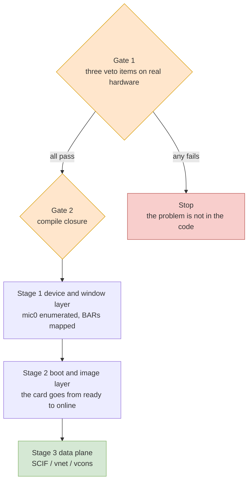
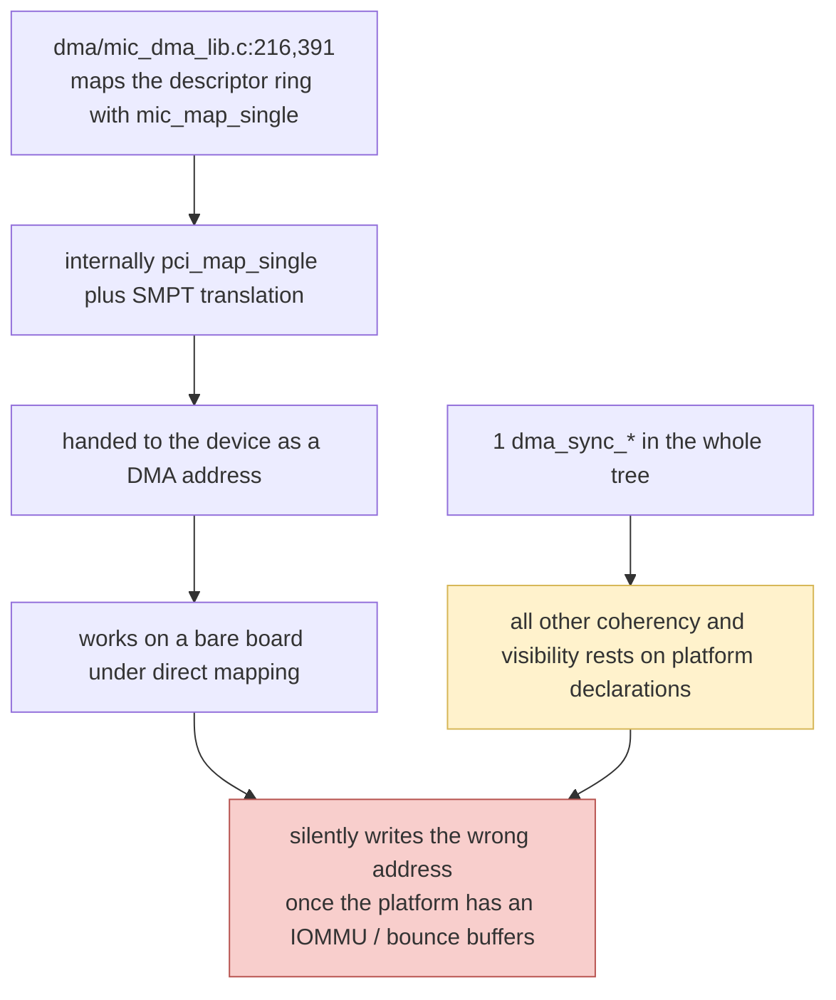

# Chapter 8 — Migration Roadmap: Two Gates, Three Stages

This chapter adds no new facts; it only supplies an order. Every item traces back to an earlier chapter: hardware feasibility comes from Chapter 7, code debt from Chapters 5 and 6, and the criteria from Chapter 11.

---

## 8.1 The shape of the route

The shape of the whole thing is: **two gates + three stages**. The two gates answer "can this be done at all"; the three stages answer "what it looks like once built". If a gate does not open, construction does not start.

The two gates are entirely different in nature. **Gate 1 runs on real hardware and costs zero lines of code change**: it tests whether the hardware and firmware are willing to cooperate, and it costs a few hours. **Gate 2 is about the code**: it tests whether this code, written in the 2.6 era, will still compile on 6.x, and it costs a few days. Gate 1 comes first because it is cheap and because it can kill the entire project; Chapter 11 carries the full checklist, and here we list only the criteria as stated.

The three stages follow the grouping of Chapter 3: Stage 1 corresponds to Group A (device and window layer, 796 lines), Stage 2 is Group B (boot and image layer, 3,437 lines), and Stage 3 is everything left in Groups C, D and E. That remainder is 28,513 lines, 87% of the whole tree, and it hides the two quietest risks of this port. The reason for this ordering is that only after Stage 1 do you know whether the device will be recognized, only after Stage 2 do you know whether the card comes alive, and the correctness of device DMA reveals itself only in Stage 3.

---

## 8.2 Gate 1: three veto items

Three things must be measured on real hardware first; they are not code problems, and changing code will not solve them.

| Criterion | Why it can veto the project | What you see when it fails |
|---|---|---|
| BAR0 receives a 64-bit prefetchable window of ≥ 8 GiB, located above 4 GiB | The LoongArch mainline has no switch equivalent to x86's "move the big BAR up"; LS7A is marked by upstream as non-conformant for BARs | `request_mem_region` fails in `probe`, and `dmesg` prints `failed to reserve aperture space` (`host/linux.c:303`) |
| Both DMA masks for the device are 64-bit | Once the firmware ACPI `_DMA` supplies 32-bit, `acpi_arch_dma_setup()` shrinks the mask, while the driver requires 64-bit | `host/linux.c:276` prints `ERROR DMA not available` and gives up |
| The actual page size of the target kernel | 16 KB by default (4 KB must be selected explicitly); `PAGE_SIZE`/`PAGE_SHIFT` hit 265 lines on the host path, and only three of them carry the host page size into a card-side contract (Chapter 5 §5.5) | No compile-time error; the hard-coded case is the 2 lines in PSMI (`include/mic/micpsmi.h:56`–`:57`), and the GTT case never triggers on KNC |

Of the three, the first is the headline criterion. The **observation method for items two and three is itself booby-trapped**: the probe module must be loaded before `mic.ko`, because the driver overwrites `dev->dma_mask`. The exact commands for this, together with the item itself, are in Chapter 11; here we stress only the ordering.

---

## 8.3 Gate 2: compile closure

The goal of this step is **only that it compiles**, not that it is functionally correct. Its benefit is that the compiler tells you for free what is wrong; its drawback is that it gives you the illusion of being "done" — Chapter 6 splits this list into "will error out" and "does not error out but is already wrong", and this section handles only the first class.

### (a) Families that will definitely error out

| Family | Host-side call sites | State on 6.6 | Fix | Order of magnitude |
|---|---|---|---|---|
| The `pci_map_*` family | `host/micpsmi.c:45,76,78,95,97,117,135`, `micscif/micscif_smpt.c:181,198,200,205`, `micscif/micscif_nodeqp.c:478,479,2798,2801,2822,2825`, `dma/mic_dma_lib.c:218,393` | The header `v5.17/include/linux/pci-dma-compat.h` was deleted entirely upstream as of 5.18 (the 5.17 version still has 3,749 bytes; both 5.18 and 6.0 return 404) | `dma_map_single(&pdev->dev, …)`, `dma_unmap_sg()` and the like | 19 call sites + one header |
| `set_fs` / `get_fs` / `get_ds` | `host/linux.c:736,738,755,768,769,790` | Gone entirely as of 5.10 | Replace the "raise addr_limit, then read" dance with `kernel_read()` | 6 lines deleted + 2 places rewritten |
| `vfs_read()` reading a kernel buffer | `host/linux.c:781` | `vfs_read` itself still exists, but the route of "using `set_fs` to make it accept a kernel pointer" is closed | `kernel_read(filp, buffer, filp_size, &pos)` | 1 line |
| Two-argument `class_create` | `host/linux.c:574` | Single-argument as of 6.4 (the three local copies 6.0/6.1/6.3 still use `__class_create(owner,…)`; the two copies 6.4/6.6 are already single-argument) | `class_create("mic")` | 1 line |
| `init_timer` / `setup_timer` | `host/linvcons.c:150`, `host/uos_download.c:1500`, `micscif/micscif_rma_dma.c:842` | On 6.6 only `timer_setup` remains | `timer_setup(&t, fn, 0)`, with the callback signatures changed along with it | 3 lines + 3 callbacks |
| `mmap_sem` | `host/tools_support.c:91,94`, `micscif/micscif_api.c:1974,1978,1993` | As of 5.8 both the field and the interface are called `mmap_lock` | `mmap_read_lock(mm)` / `mmap_write_lock(mm)` | 5 lines |
| `page_cache_release` | `host/tools_support.c:67`, `micscif/micscif_api.c:2010`, `micscif/micscif_rma.c:416` | It has been `put_page()` since 4.6 | `put_page()` | 3 lines |
| `num_physpages` | `micscif/micscif_rma_dma.c:438` | On 6.6 only `get_num_physpages()` remains | `get_num_physpages()` | 1 line |
| Raw `pci_enable_msix` | `host/linux.c:311` | Gone as of 4.13; 6.6 offers `_exact`/`_range`/`pci_alloc_irq_vectors` | Something like `pci_alloc_irq_vectors(pdev, 1, 1, PCI_IRQ_MSIX)` | About 5 lines |
| `struct mmu_notifier_ops.invalidate_page` | `micscif/micscif_rma.c:69`–`75` | That struct on 6.6 **no longer has this member** (0 hits in the locally cached 6.6 headers) | Switch to the `invalidate_range*` family, and re-check the register and unregister interfaces | About 20 lines |
| `do_gettimeofday` + `struct timeval` | `host/tools_support.c:118,312` | On 6.6 only `ktime_get_real_ts64()` | Same rewrite as above | 2 lines + 1 type |
| `get_user_pages` signature | `host/tools_support.c:92`, `micscif/micscif_api.c:1984` | On 6.6 it no longer takes `task_struct`/`mm_struct` | Rewrite to the new signature | 2 lines |
| `ioremap_nocache` | `host/uos_download.c:1515` | 0 hits across all architecture headers on 6.6 | `ioremap()` | 1 line and up (5 further sites await a host/card side determination) |
| `net_device->destructor` | `host/linvnet.c:224` | On 6.6 only `priv_destructor` | `priv_destructor` | 1 line (the community 4.18 patch already demonstrates it) |
| `read_from_oldmem` colliding with a kernel symbol name | `host/vmcore.c:164,273,367,449,629,663,697,723,755` | Same name as the kernel's own symbol | Rename consistently; the community used `mic_read_from_oldmem` | 9 lines |
| **F1** `boot_cpu_data.x86_model` | `host/uos_download.c:660`–`675` | A host CPU model check, architecturally coupled | Drop the check, replace it with a module parameter or a fixed threshold | About 15 lines |

### (b) Families that look like they need changing but do not

This table is worth reading more than the previous one, because every entry in it was at some point misjudged by me or by an earlier audit as a "must change". What they have in common is that the symbol still exists, or that the code in question does not take part in the host build at all.

| Apparent problem | Host-side call sites | Conclusion |
|---|---|---|
| `sysfs_get_dirent` / `sysfs_put` | `host/linux.c:339`, `:404` | **6.6 still provides them**, at `v6.6/include/linux/sysfs.h:643`/`:655`, and those two lines sit **outside** `#endif /* CONFIG_SYSFS */`, as unconditional `static inline` wrappers |
| `create_singlethread_workqueue` | 23 lines in the host modules: 19 go through this tree's own wrapper `__mic_create_singlethread_workqueue` (`host/acptboot.c:171`, `host/linscif_host.c:95,109,201`, `host/linvcons.c:137`, `host/micscif_pm.c:706,718,730,742,790`, `host/uos_download.c:1501,1503`, `host/vhost/mic_blk.c:458,629`, `micscif/micscif_intr.c:65`, `micscif/micscif_nodeqp.c:2698,2892,2894`, `vnet/micveth_dma.c:985`), 2 call `create_singlethread_workqueue()` directly (`host/linscif_host.c:102`, `host/linvnet.c:462`), and 2 are only `printk` text (`host/linvcons.c:139`, `vnet/micveth_dma.c:986`) | **Not one line needs changing on 6.6**: `create_singlethread_workqueue` is still a macro pointing at `alloc_ordered_workqueue()` at `v6.6/include/linux/workqueue.h:477`–`:478`, and this tree's own wrapper at `include/mic_common.h:691`–`:695` likewise lands on `alloc_ordered_workqueue` in the `>= 3.10` branch |
| `lowmem_page_address` | `host/tools_support.c:439` | **Still present on 6.6**, and still the default implementation of `page_address()` |
| `ioremap_wc` | `host/uos_download.c:1156`, `:1546` | **Defined on LoongArch**: `arch/loongarch/include/asm/io.h:55`, mapped to `_CACHE_WUC`. But mainline `ARCH_WRITECOMBINE` is off by default, and while it is off this silently becomes SUC — **zero code changes**, only a single `writecombine=on` added to the boot parameters (see Chapter 7 §7.7, Chapter 11 §11.6) |
| `IRQF_DISABLED` | 2 sites in the host modules: `dma/mic_dma_lib.c:467`, `vnet/micveth_dma.c:1002` (5 in the whole tree, the other 3 in `vcons/hvc_mic.c:140`, `virtio/mic_virtblk.c:445`, `vnet/micveth.c:392`; those three files are not compiled into `mic.ko`) | Both are **inside card-side branches** (the former under `#ifdef _MIC_SCIF_`, the latter in the `#else` of `#ifdef HOST`), so neither call site exists in the host build |
| The old-style `/proc` interface | `dma/mic_dma_lib.c:1770,1775`, `host/uos_download.c:1354,1359,1799,1835`, `micscif/micscif_debug.c:891`–`908` | All on the `#else` side of `#if (LINUX_VERSION_CODE >= KERNEL_VERSION(3,10,0))` (for example the pair `dma/mic_dma_lib.c:1359` and `:1589`), so on 6.x they **do not take part in the build** |
| `set_mb` | `micscif/micscif_select.c:204,263,274` | Two (`:204`, `:263`) are **comment text**; the real call is at `:274`, and it sits in the `#else` of `#if (LINUX_VERSION_CODE >= KERNEL_VERSION(4,2,0))`, so on 6.x the code takes `smp_store_mb()` |
| `.ndo_change_mtu_rh74` | Actually written in the tree as `.ndo_change_mtu`: `host/linvnet.c:206`, `vnet/micveth.c:320`, `vnet/micveth_dma.c:913` | The `_rh74` suffix appears only in the community 4.18 patch, with 0 hits across this tree; in mainline 6.6 the field is still called `ndo_change_mtu` (`v6.6/include/linux/netdevice.h:1442`), so **not one line needs changing** |

This table is the whole point of the audit methodology used here: **grepping for keywords across 32,746 lines yields a wildly overstated list**. The real debt is "does this branch compile under this `#if`", not "how many times does this string appear".

### (c) Order of magnitude

The code change volume in table (a) is on the order of **a hundred lines**, negligible against the 32,746-line total. What really determines the schedule is three things: understanding the semantics of each of the three stages, getting the data plane to the point on real hardware where it does not fail silently, and the part money cannot buy — **whether the hardware cooperates**. None of these three can be solved by "writing code"; Chapter 9 gives the estimates.

### (d) Measured on real hardware: this table has already been run through once

This section is not speculation but measurement. In October 2026 I moved the `_work/mpss-modules-3.8.6` tree as-is onto a LoongArch machine (AOSC OS 13.3.1, kernel `7.1.13-aosc-main-16k`, **16 KB pages**, gcc 15.3.0, kernel headers `linux-headers-7.1.13-aosc-main-16k`) and built it for real against the criteria of this section, until `mic.ko` landed.

The first door is not in the code but in the build script: running `make` directly stops immediately at `Kbuild:10` with `building for host, but $(MIC_CARD_ARCH) is unset`. This is the direct consequence of what Chapter 3 describes — "`Kbuild` splits itself in two with a set of variables": the host build must be given `MIC_CARD_ARCH=k1om` explicitly (or `l1om`), and that is not a defect.

| Round | Command | errors | Compilation units that failed | Output |
|---|---|---|---|---|
| One | `make` | stops immediately | — | Stops at `Kbuild:10` |
| Two | `make MIC_CARD_ARCH=k1om` | 44 | 7 | 1 `.o` (`-Werror` packs up early) |
| Three | plus `KERNWARNFLAGS=-Wno-error` | 82 | 7 | 1 `.o` |
| Four | `make -k -j8` (full) | **564** | **37 / 38** | 1 `.o` |
| Five | the same command after the fixes | **0** | **0** | **`mic.ko`** |

That `-Werror` in round two is not a kernel default but this machine's kernel configuration, `CONFIG_WERROR=y`. The tree already left the `KERNWARNFLAGS` opening at `Kbuild:24`, and using it to downgrade to `-Wno-error` lets you look at "a real API no longer exists" and "the new kernel warns more strictly" separately — which is exactly what made it possible to get the full error count in one go in round four.

Final artifact: `mic.ko` is 23,254,080 bytes in total, `file` identifies it as `ELF 64-bit LSB relocatable, LoongArch`, `modinfo` reads back `vermagic: 7.1.13-aosc-main-16k SMP preempt mod_unload LOONGARCH 64BIT`, and `srcversion` together with `build_scmver: e8ef53c4…` is complete (the latter being exactly that line in this tree's `.mpss-metadata`). All 13 module parameters, among them `p2p`, `ulimit`, `msi` and `vnet`, are in the parameter table.

The real change volume and the estimate in table (a) of this section are two different numbers and must both be written down: table (a) totals **86 lines**, while the measured change came to **28 files, +318 / -309 lines, 185 hunks**. The difference lies in three places: first, the target kernel is 7.1.13, three years later than the 6.6 of Chapter 6, so a further batch of deleted interfaces appears (Chapter 6 §6.11 lists them one by one); second, the 86 lines count only "host-side API call sites" and omit the private vhost copy under `host/vhost/`, plus the interface reshuffling of the tty driver and the MMU notifier; third, the `timer` family changes more than the call sites — the callback signatures and the way the container is obtained have to change with them.

One more trade-off has to be stated: `host/vmcore.c` (the card crash dump reader) **was not compiled in**. It was not killed by a deleted API, but by this source tree being incomplete in itself — the `struct vmcore` used all over the file is not defined anywhere in the tree (nor in the 7.1.13 kernel, which has only similarly named things such as `vmcore_cb`), and on top of that `read_from_oldmem` at `host/vmcore.c:167` clashes with the prototype of the kernel's identically named symbol. Rescuing it would mean supplying a struct definition on Intel's behalf and then re-laying the `/proc/vmcore` read path against a new contract, which is a rewrite rather than a replacement. Chapter 3 already recommended "`vmcore.c` is the highest risk; remove it first", and the measurement supports that judgement: `Kbuild:81` has `host/vmcore.o` commented out, and `host/uos_download.c` gained a `vmcore_create()` stub returning `-EOPNOTSUPP` — the sole call site, `micscif/micscif_nm.c:1447`, already branched on the return code, so opening a crash dump reports "unsupported" explicitly instead of silently pretending to succeed.

One last boundary: **compiling is only Gate 2**. It proves that this 3.8.6 source can be changed to the point of producing a module on 7.1.13; it does not prove the module loads, let alone that it drives the card. That requires Gate 1 to pass on real hardware first, and none of the three veto items in §8.2 (an 8 GiB high BAR0, two 64-bit DMA masks, the actual page size of the target kernel) was verified in this round. The logs and patch scripts are kept in `_work/remote-logs/` and `_work/port_patches/`, and the ported tree is `_work/port-7.1.13/`.

After the build passed, three further steps were completed on the same machine. These too are measurements, not speculation.

| Step | Criterion | Measured result |
|---|---|---|
| Gate 1 · item one | BAR0 receives a large window above 4 GiB | **Pass**: `Region 0: Memory at e4800000000 (64-bit, prefetchable) [size=16G]`; the card is a 7120P, hence 16 GiB rather than the 8 GiB of the manual's example |
| Gate 1 · item two | Both DMA masks are 64-bit | **Pass**: after the driver probes, `dma_mask_bits=64` and `consistent_dma_mask_bits=64`, and there is no `_DMA` node in the DSDT |
| Gate 1 · item three | The actual page size of the target kernel | **16 KiB**: the machine runs a 16 KB page kernel and the build was done against it; the narrow constants of F3 were not triggered while PSMI is disabled |
| Stage 1 | The device is recognized | **Pass**: the full set of `/sys/class/mic/mic0` nodes, `/dev/mic0`, `/dev/mic/ctrl`, `/dev/mic/scif`, and `mic_probe 4:0:0 as board #0` in the log |
| Stage 2 | The card is brought up | **Pass**: 26 seconds after writing `boot:linux:<bzImage>:<initramfs>` to `/sys/class/mic/mic0/state`, the card reaches `online`, with `boot_count=1`, `post_code=FF` and card-side SCIF `online` |
| Stage 3 | Byte-for-byte round trip between host and card | **Pass**: after configuring `mic0` as <host-ip> on the host side and <card-ip> on the card side, 5 small packets plus 10 large 60 KB packets all showed 0% packet loss, and `ip neigh` turned `REACHABLE` |

A few details that must be written down.

First, the measured specifications of this card differ from the example in the manual: `sku=C0PRQ-7120 P/A/X/D`, serial number `ADKC50600016`, `active_cores=0x3d` (61 cores), `memsize=0xf80000` (about 15.5 GiB), `ecc_enable:1` in `meminfo`, and `flashversion=391`. The "BAR0 = 8 GiB" written in Chapter 2 from the manual should be read as "8 GiB and above"; a 7120P actually gets 16 GiB. The `mem=16384M` on the card-side kernel command line is not hard-coded — the driver computes it from the BAR0 length, which corroborates the point in reverse.

Second, there is a real problem on the link: `current_link_width=1` (`max_link_width=16`), and the kernel log says outright `limited by 5.0 GT/s PCIe x1 link`. Probe and boot are unaffected, but the real bandwidth of Stage 3 will be pinned by this x1 link and needs a separate investigation (reseat the card, try another slot, check whether the board routes only one lane).

Third, the IOMMU item matches the judgement of Chapter 7 §7.6: on this machine `/sys/kernel/iommu_groups/` is empty, there is no mention of any IOMMU driver in the kernel log, and there are only 64 MB of Software IO TLB. In other words, the axiom of Chapter 5 item F5 — "what `pci_map_*` returns is the physical address" — does hold on LoongArch, and the fact that Stage 3 runs at all is the first time that axiom was validated by real traffic.

Fourth, the card-side image must supply its own network interface configuration, and this deserves a note of its own: the card-side initramfs `/init` only runs `ifconfig mic0` in the `root=nfs:` branch, and the card-side `/etc/network/interfaces` **has no configuration stanza for mic0**. In the normal MPSS flow this step is pushed by the host-side `mpssd`/`micctrl` over the SCIF management channel to `/usr/sbin/mpssd` on the card, and that user space consists of x86_64 binaries, which cannot run on LoongArch. So the first ping showed 100% packet loss (the card-side interface was DOWN and dropped incoming ARP outright), and it only worked after a static `auto mic0` configuration was added to the card-side image. This is not a porting defect but the direct consequence of "host user space being absent", and a live confirmation of the conclusion in Chapter 4.

---

## 8.4 Stage 1: the device is recognized

Definition of done: the module loads, the device is enumerated, both BARs are mapped, interrupts are registered, and the character devices and sysfs nodes are created.

The subject of this stage is Group A from Chapter 3 (`host/linux.c`, 796 lines) plus part of Group B. The only code that needs changing is the first few entries of table (a): `class_create`, `pci_enable_msix`, and the calling form of `pci_map_*`. The two `request_mem_region` blocks at `host/linux.c:290`–`305` are **not to be touched**: they are where Gate 1 lands in the code, and if the 8 GiB cannot be obtained, this is where it fails.

Criteria (the order is the observation order):

1. `insmod mic.ko` succeeds;
2. both `request_mem_region` calls succeed, with neither `failed to reserve mmio space` (`host/linux.c:294`) nor `failed to reserve aperture space` (`host/linux.c:303`) appearing;
3. one interrupt is received and successfully registered;
4. `mic0` appears under `/sys/class/mic/`, with its attribute group created by `bd_attr_group` at `host/linsysfs.c:764`.

---

## 8.5 Stage 2: the card comes up

Definition of done: the state of `mic0` moves from `ready` to `online`, that is, the kernel and initramfs are written into card memory, the doorbell is rung, and the card-side kernel comes up.

The subject of this stage is the image path of Group B. **There is one thing in this stage that must not be touched**: the verification conditions of `verify_bzImage()` (`0x55aa`@510, `"HdrS"`@514, byte 529 equal to 1, `0x1f8b`@530, ELF machine `0x3e` or `0xb5`). What it verifies is **the image on the card**, independent of the host ISA, and it must be preserved as-is.

What needs changing is: `init_timer` (`host/uos_download.c:1500`), `getnstimeofday` (`host/acptboot.c`), and the F1 block that checks `boot_cpu_data.x86_model`.

The handling of F1 deserves a paragraph of its own, because it is **the only place in this port whose semantics cannot be carried over as-is**. It reads the family and model of the host CPU (the source prints `CPU family`/`CPU model` at `:660`, accepts only family 6 with model 45/62 at `:662`–`:663`, and the comment at `:651` names the two platforms Jaketown and Ivytown), and on that basis decides whether the card's P2P DMA reads should be proxied as writes. Deleting it will not crash anything, but the card-side SCIF loses this advisory value. There are two options: one, keep specifying the threshold by hand through `micrconf`/a module parameter; two, leave it entirely to the card-side default. The second option holds because this very code writes `numa_node=` and `p2p_proxy_thresh=` **as optional** (`host/uos_download.c:662`–`:675`, appending not a single parameter when the conditions are not met), which shows that the card-side SCIF has default behaviour when those two parameters are absent. This is "optional", not "verified" — see the honesty boundary in Chapter 9.

Criteria: `/sys/class/mic/mic0/state` reads `ready`→`booting`→`online` in that order, and `dmesg` shows `mic0: Transition from state ready to booting` (that string is printed by `mic_setstate()` at `include/mic_common.h:698`).

---

## 8.6 Stage 3: the data plane

This stage is 87% of the tree, but the amount of code it needs changed is not proportionally large. What really takes thought is the two **silent risks**:

First branch: the ring's descriptor address is written two different ways in this source — the card-side branch under `#ifdef _MIC_SCIF_` calls `virt_to_phys()` directly (`dma/mic_dma_lib.c:213`, `:388`), while the host branch under `#else` calls `mic_map_single()` (`:216`, `:391`). The host build compiles the latter, so a mapping is not missing here: `mic_map_single()` is itself a wrapper around `pci_map_single()` plus SMPT registration (`micscif/micscif_smpt.c:192`–`:209`). What genuinely needs a fresh look on a new platform is the line immediately after — `:218` and `:393` use `pci_dma_mapping_error()` to validate the return value of `mic_map_single()`, yet the return value of `pci_map_single()` was already validated once back at `micscif/micscif_smpt.c:200`. On a directly mapped platform without an IOMMU this second check happens to hold as well, so it is "correct"; but it ties two things together, the mapping result and the mapping error code.

Second branch: across the tree's 38 compilation units there is not a single modern DMA synchronisation call; the only synchronisation action is one `wmb()` at `dma/mic_dma_lib.c:417`, and there is one further `pci_dma_sync_single_for_cpu()` at `host/linpsmi.c:80`.

Together these two branches are one and the same problem: **this code treats "the device DMA address equals the host physical address, and the CPU and the device are coherent by nature" as an axiom**. It runs on x86 because the platform happens to be that way, not because the code is correct. Moving to LoongArch: the absence of an IOMMU still makes the first part hold, but the second part (I/O coherency) must be declared by the platform and must be verified on real hardware — this is silent item one in Chapter 11.

There is one more job, affecting only throughput and requiring almost no code change, that should be done first: the card memory window is mapped with `ioremap_wc()`, and the LoongArch kernel's `CONFIG_ARCH_WRITECOMBINE` is off by default, so while it is off this path silently degrades to strongly ordered non-cached. The remedy is to add a single `writecombine=on` to the boot parameters and then confirm with a throughput A/B test that the attribute has really taken effect (Chapter 7 §7.7, Chapter 11 §11.6). This is not part of compile closure, but of "performance may need to be re-evaluated".

### Measured: the management plane (tool side)

Beyond the data plane, the host-side tool set was also built and run on the same machine; the item-by-item evidence is in [Appendix E](E-porting-patches.md). Three points:

One, **the core chain is closed**: all four components `libscif` → `libmpssconfig` → `mpssd` → `micctrl` build, `micctrl --status` reports `mic0: online (mode: linux image: …)`, and `micctrl --initdefaults` can generate a complete configuration and card image directory (MicDir) in a private directory.

Two, **the upper-layer tools are usable**: `libmicmgmt` and `mpssinfo` read back the card's `SKU C0PRQ-7120 P/A/X/D`, `Family 0x0b`, `Stepping C0`; `miccheck`, ported to Python 3, passes the first three host-side default tests; both offload libraries, COI and MYO, build, an external program links against them by their public ABI names, and a MYO call really does enter the library's internal code path.

A further set of finer measurements (details in Appendix E.7): `micctrl --initdefaults` can now create the card image directory by itself (including the user, the card-side network configuration `auto mic0` + `address <card-ip>`, and ed25519/ecdsa/rsa host keys), which means that the step where we initially stuffed the network configuration and authorized_keys into the card-side initramfs by hand is now done by MPSS itself; `mpssd` runs permanently as a systemd unit (`Type=simple` + `-l`); the host and card-side mpssd complete the MONITOR_START handshake (host log: `Monitor connection established`); and in `miccheck`'s device self-test, the three items "online with postcode=FF", "RAS daemon available" and "flash version" pass.

Three, **the distribution of the changes is telling**: the four core pieces (about 24,000 lines of C) needed changes in only three places in the source code, and everything else is repair of the "newer toolchain is stricter" kind, unrelated to the instruction set. This is the empirical evidence for the judgement at the start of this chapter: the failure modes at the user-space layer are visible and fixable.

Criteria: not "it compiled" but a **byte-for-byte round-trip comparison** and an **I/O bandwidth A/B test**; the commands are in Chapter 11.

### Measured: this stage has already been run through once as well

The "byte-for-byte round-trip comparison" among the criteria passed on real hardware, and it passed in a stronger way than originally planned: what was compared was not a test program of our own but real TCP traffic over the vnet DMA ring.

| Item | Measured |
|---|---|
| SSH into the card | Works. The card-side sshd is OpenSSH 7.4p1 and the host's OpenSSH 10.5 talks to it directly, with no legacy algorithm switch needed. Keys are injected into `/home/root/.ssh/authorized_keys` following the micctrl model, and `ssh mic0` works |
| Byte-for-byte round trip | 256 MB in each direction, and `md5sum` on both ends agrees exactly (`e8ccd05b…` and `2888f3ee…`) |
| Two further correctness data sets | 60 KB × 200 packets of ICMP soak at 0% packet loss; 12 MB of plaintext round-tripped at 0% packet loss |
| Interface counters | `errors 0 dropped 0 overruns 0` throughout, with roughly 3 GB sent and received each, cumulative |
| Single-stream plaintext throughput | card→host 31.0/49.5 MB/s, host→card 14.6/33.8 MB/s (repeated measurements under the same configuration, with wide variation) |
| Multi-stream plaintext throughput | card→host 172–175 MB/s with four parallel streams (another run under the same configuration gave only 58.5 MB/s) |
| SSH encrypted throughput (card→host) | chacha20-poly1305 13.4 MB/s, aes128-ctr 7.9 MB/s, aes128-gcm 6.3 MB/s |

Three observations to write down.

First, **the variation is real, not measurement noise**. Repeating a test under the same configuration can differ by a factor of two or three, and the card-side power management log (`pm_pc3_to_pc6_entry` and `pm_pc6_exit`) shows that the card enters PC6 deep sleep when idle, so the first round trip after a wake can take 729 ms (0.4 ms once stable). The beginning of a throughput test therefore absorbs the wake-up cost. To get stable numbers, the card's power state transitions have to be suppressed during the test.

Second, **encryption is a card-side CPU matter, not a link matter**. The KNC core has no AES instructions, so the card-side OpenSSH cryptography all runs on a 1.2 GHz core: the same path gives 31–50 MB/s in plaintext, drops to 13.4 with chacha20, and leaves only 6–8 with the AES family. The earlier figure of "SSH file transfer at only 15 MB/s" therefore measured the card's software encryption capability, not the data plane's capability.

Third, **x1 is not the current bottleneck**. Four parallel streams reached at least 172 MB/s in one round (the theoretical limit of x1 Gen2 is about 500 MB/s), while a single stream stalls in the tens of MB/s — the limit lies in card-side single-stream processing and in the parallelism of the vnet ring. The link width trap still needs investigating (`current_link_width=1`), but it is not what is limiting throughput now.

---

## 8.7 Summary table of completion criteria

| Stage | Definition of done | Where to look first when it fails |
|---|---|---|
| Gate 1 | All three veto items pass | Change the distribution's kernel configuration, change the root complex slot; if neither works, the hardware window cannot be obtained |
| Gate 2 | All 38 objects compile and link | A compiler error means table (a) of this chapter; **compiling does not mean it runs** |
| Stage 1 | Module loads + both BARs mapped + interrupt registered + `mic0` appears under `/sys/class/mic/` | The two printks for the DMA mask (`host/linux.c:274`) and BAR reservation (`:294`, `:303`) |
| Stage 2 | State machine `ready`→`booting`→`online` | A state stuck at `booting` means the card side did not come up; a state of `boot failed` means a problem with the image or the card-side kernel |
| Stage 3 | User-space SCIF communication works + the coherency round-trip comparison passes | A failed byte comparison means cache coherency, not code |

---

## 8.8 Things explicitly not to do

One, **do not rewrite the driver**. The conclusion of Chapters 3 and 4 is that the control plane involves only three things and the data plane is standard PCIe semantics; rewriting would mean redoing SCIF's register protocol, power state machine and virtual console from scratch, which is writing a new software stack, not porting.

Two, **do not count on the upstream MIC driver**. It was deleted in v5.10 (`80ade22c06ca`, 65 files and 21,361 lines removed), and it is not the same driver: the card-side firmware interface, the power register protocol and the character device interface are all different. It can serve as a reference book, not as a starting point (Chapter 10, route two).

Three, **do not introduce an IOMMU for this**. The absence of an IOMMU is one of the necessary conditions for this project to work, not a defect.

Four, **do not change a single line of card-side code**. On the host side, 29 files and 23,029 lines are not in `mic-objs`: of those, 24 files and 20,232 lines are genuine K1OM code that runs on the card, and the other 5 files and 2,797 lines are dead code that is not even compiled for the card (`trace_capture/`). They are irrelevant to building for a LoongArch host, and changing them at random will only break the card.

Five, **do not start Gate 2 before Gate 1 has been run**. The sense of progress that a successful compile gives you is false.

---

## 8.9 Chapter summary

Three sentences.

First, the order is **Gate 1, then Gate 2, then the three stages**, not a file-by-file sweep. Gate 1 is a few hours of measurement, and it can kill the entire project.

Second, the change volume of compile closure is on the order of a hundred lines, and there are local precedents for it (the community 4.18 patch already changed `kernel_read`, `priv_destructor`, `put_page` and `timer_setup`). The genuinely new work is the 5.8/5.10/6.0/6.4 hurdles, plus `mmu_notifier_ops`.

Third, the most expensive part is not compilation but the two silent risks in the data plane: the descriptor ring address using a mapping result directly as a physical address (the host branch goes through `mic_map_single()`, and only the card-side branch uses `virt_to_phys()`), and the absence of a single DMA synchronisation interface anywhere in the tree. They determine whether this port **can be proven correct**, not merely whether it runs. This is also why Chapter 9 ranks risks rather than ranking workload.
