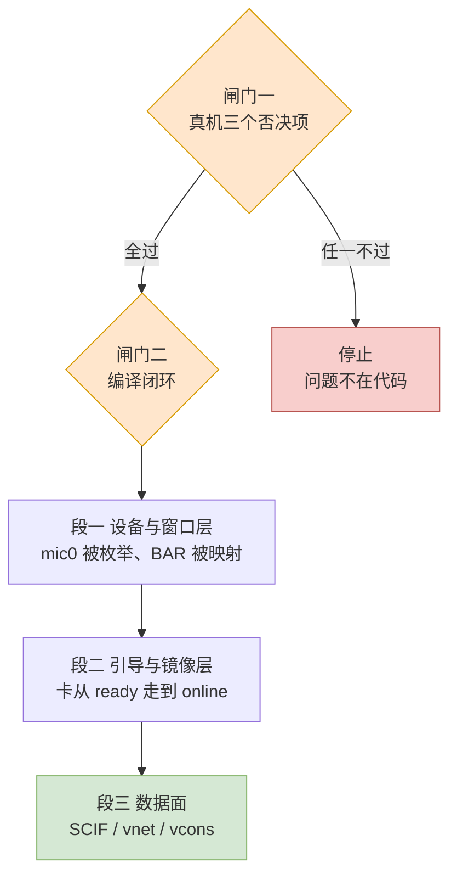
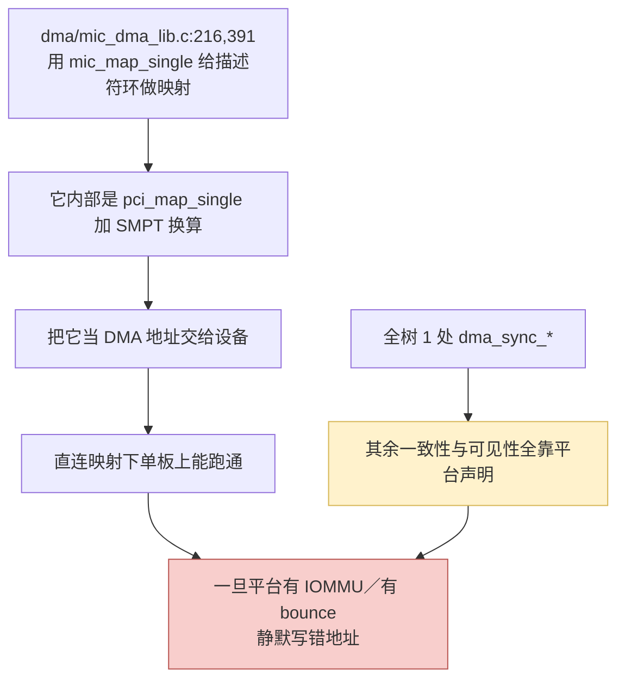

# 第八章　移植路线图：两道闸门，三段施工

　　这一章不给新事实，只给顺序。所有条目都能回溯到前面各章：硬件可行性来自第七章，代码欠账来自第五章与第六章，判据来自第十一章。

---

## 8.1　路线的形状

　　整件事的形状是：**两道闸门 + 三段施工**。两道闸门是「能不能做」，三段施工是「做出来是什么」。闸门不通，施工不开始。

　　两道闸门的性质完全不同。**闸门一在真机上，零代码改动**，验的是硬件与固件肯不肯配合，代价是几个小时。**闸门二在代码上**，验的是这份 2.6 时代写的代码能不能在 6.x 上过编译，代价是几天。先做闸门一，是因为它便宜且能否决整个项目；这件事在第 11 章有完整清单，此处只列判据的口径。

　　三段施工的划分沿用第三章的分组：段一对应 A 组（设备与窗口层，796 行），段二是 B 组（引导与镜像层，3,437 行），段三是剩下的 C、D、E 三组。它是 28,513 行，占全树 87%，而且里面藏着本次移植最安静的两个风险。三段这样排的理由是：段一做完才知道设备认不认，段二做完才知道卡活不活，而设备 DMA 的正确性只有在段三才会暴露出来。

---

## 8.2　闸门一：三个否决项

　　三件事必须在真机上先量，它们不是代码问题，改代码也解决不了。

| 判据 | 为什么它能否决 | 不过时的表现 |
|---|---|---|
| BAR0 拿到 ≥ 8 GiB、位于 4 GiB 以上的 64 位可预取窗口 | 龙芯主线上没有 x86 那种「把大 BAR 挪上去」的开关；LS7A 被上游标注为 BAR 不规范 | `probe` 里 `request_mem_region` 失败，`dmesg` 打印 `failed to reserve aperture space`（`host/linux.c:303`） |
| 该设备两个 DMA 掩码都是 64 位 | 固件 ACPI `_DMA` 一旦给 32 位，`acpi_arch_dma_setup()` 会把掩码取小，而驱动只要 64 位 | `host/linux.c:276` 打印 `ERROR DMA not available` 后放弃 |
| 目标内核的实际页大小 | 默认 16 KB（4 KB 要显式选）；`PAGE_SIZE`／`PAGE_SHIFT` 在主机路径上有 265 行命中，其中只有三行会把主机页大小带进卡端契约（第五章 §5.5） | 编译期不报错；硬编码那一处是 PSMI 的 2 行（`include/mic/micpsmi.h:56`–`:57`），GTT 那一处在 KNC 上不触发 |

　　三条里第一条是头号判据。第二、三条的**观测手段本身有坑**：探针模块必须在 `mic.ko` 之前加载，因为驱动会改写 `dev->dma_mask`。这一条与具体命令写在第十一章，此处只强调顺序。

---

## 8.3　闸门二：编译闭环

　　这一步的目标**只是编译通过**，不是功能正确。它的好处是编译器免费告诉你哪里不对，坏处是它会给你一种「改完了」的错觉 —— 第六章把这份清单分成「会报错的」和「不报错但已经错了的」两类，本节只处理第一类。

### 甲、必然报错的族

| 族 | 主机侧调用点 | 6.6 现状 | 改法 | 量级 |
|---|---|---|---|---|
| `pci_map_*` 家族 | `host/micpsmi.c:45,76,78,95,97,117,135`、`micscif/micscif_smpt.c:181,198,200,205`、`micscif/micscif_nodeqp.c:478,479,2798,2801,2822,2825`、`dma/mic_dma_lib.c:218,393` | `v5.17/include/linux/pci-dma-compat.h` 这个头文件上游 5.18 起已整个删除（5.17 版仍有 3,749 字节，5.18 与 6.0 都取回 404） | `dma_map_single(&pdev->dev, …)`、`dma_unmap_sg()` 等 | 19 处调用 + 头文件 |
| `set_fs` / `get_fs` / `get_ds` | `host/linux.c:736,738,755,768,769,790` | 5.10 起全部不存在 | 用 `kernel_read()` 取代「抬 addr_limit 再读」这套动作 | 6 行删除 + 2 处改写 |
| `vfs_read()` 读内核缓冲 | `host/linux.c:781` | `vfs_read` 本身仍在，但「用 `set_fs` 让它接受内核指针」这条路已封 | `kernel_read(filp, buffer, filp_size, &pos)` | 1 行 |
| `class_create` 两参数 | `host/linux.c:574` | 6.4 起为单参数（本地 6.0／6.1／6.3 三份仍是 `__class_create(owner,…)`，6.4／6.6 两份已是单参数） | `class_create("mic")` | 1 行 |
| `init_timer` / `setup_timer` | `host/linvcons.c:150`、`host/uos_download.c:1500`、`micscif/micscif_rma_dma.c:842` | 6.6 只剩 `timer_setup` | `timer_setup(&t, fn, 0)`，回调签名一并改 | 3 行 + 3 个回调 |
| `mmap_sem` | `host/tools_support.c:91,94`、`micscif/micscif_api.c:1974,1978,1993` | 5.8 起字段与接口都叫 `mmap_lock` | `mmap_read_lock(mm)` / `mmap_write_lock(mm)` | 5 行 |
| `page_cache_release` | `host/tools_support.c:67`、`micscif/micscif_api.c:2010`、`micscif/micscif_rma.c:416` | 4.6 起就是 `put_page()` | `put_page()` | 3 行 |
| `num_physpages` | `micscif/micscif_rma_dma.c:438` | 6.6 里只剩 `get_num_physpages()` | `get_num_physpages()` | 1 行 |
| 裸 `pci_enable_msix` | `host/linux.c:311` | 4.13 起已无；6.6 有 `_exact`/`_range`/`pci_alloc_irq_vectors` | `pci_alloc_irq_vectors(pdev, 1, 1, PCI_IRQ_MSIX)` 一类 | 约 5 行 |
| `struct mmu_notifier_ops.invalidate_page` | `micscif/micscif_rma.c:69`–`75` | 6.6 的该结构体**已无此成员**（本地缓存的 6.6 头文件 0 命中） | 改用 `invalidate_range*` 系列，并重查注册与注销接口 | 约 20 行 |
| `do_gettimeofday` + `struct timeval` | `host/tools_support.c:118,312` | 6.6 只有 `ktime_get_real_ts64()` | 同上改写 | 2 行 + 1 个类型 |
| `get_user_pages` 签名 | `host/tools_support.c:92`、`micscif/micscif_api.c:1984` | 6.6 已不收 `task_struct`／`mm_struct` | 按新签名改写 | 2 行 |
| `ioremap_nocache` | `host/uos_download.c:1515` | 6.6 各架构头文件全部 0 命中 | `ioremap()` | 1 行起（另有 5 处待判定主机/卡侧） |
| `net_device->destructor` | `host/linvnet.c:224` | 6.6 只有 `priv_destructor` | `priv_destructor` | 1 行（社区 4.18 补丁已示范） |
| `read_from_oldmem` 与内核符号撞名 | `host/vmcore.c:164,273,367,449,629,663,697,723,755` | 与内核自身符号同名 | 统一改名，社区用的是 `mic_read_from_oldmem` | 9 行 |
| **F1** `boot_cpu_data.x86_model` | `host/uos_download.c:660`–`675` | 主机 CPU 型号判断，架构耦合 | 删掉判定，改为模块参数或固定阈值 | 约 15 行 |

### 乙、看着要改、其实不用改的族

　　这张表比上一张更值得读，因为每一条都曾经被我或早期审计误判成「必改」。它们的共同点是：符号还在，或者那段代码根本不参与主机构建。

| 看似的问题 | 主机侧调用点 | 结论 |
|---|---|---|
| `sysfs_get_dirent` / `sysfs_put` | `host/linux.c:339`、`:404` | **6.6 仍然提供**，位置在 `v6.6/include/linux/sysfs.h:643`／`:655`，且这两行在 `#endif /* CONFIG_SYSFS */` **之外**，是无条件的 `static inline` 封装 |
| `create_singlethread_workqueue` | 主机模块里 23 行：19 行走本树自己的封装 `__mic_create_singlethread_workqueue`（`host/acptboot.c:171`、`host/linscif_host.c:95,109,201`、`host/linvcons.c:137`、`host/micscif_pm.c:706,718,730,742,790`、`host/uos_download.c:1501,1503`、`host/vhost/mic_blk.c:458,629`、`micscif/micscif_intr.c:65`、`micscif/micscif_nodeqp.c:2698,2892,2894`、`vnet/micveth_dma.c:985`），2 处直接调 `create_singlethread_workqueue()`（`host/linscif_host.c:102`、`host/linvnet.c:462`），2 处只是 `printk` 文本（`host/linvcons.c:139`、`vnet/micveth_dma.c:986`） | **6.6 一行都不用改**：`create_singlethread_workqueue` 在 `v6.6/include/linux/workqueue.h:477`–`:478` 里仍是一条指向 `alloc_ordered_workqueue()` 的宏，而本树自己的封装在 `include/mic_common.h:691`–`:695`，`>= 3.10` 那一支同样落在 `alloc_ordered_workqueue` 上 |
| `lowmem_page_address` | `host/tools_support.c:439` | **6.6 仍然存在**，且仍是 `page_address()` 的默认实现 |
| `ioremap_wc` | `host/uos_download.c:1156`、`:1546` | **龙芯上有定义**：`arch/loongarch/include/asm/io.h:55`，映射为 `_CACHE_WUC`。但主线 `ARCH_WRITECOMBINE` 默认关闭，关着时它静默变成 SUC，**零代码改动**，只需在引导参数上加一句 `writecombine=on`（见第七章 §7.7、第十一章 §11.6） |
| `IRQF_DISABLED` | 主机模块里 2 处：`dma/mic_dma_lib.c:467`、`vnet/micveth_dma.c:1002`（全树共 5 处，另 3 处在 `vcons/hvc_mic.c:140`、`virtio/mic_virtblk.c:445`、`vnet/micveth.c:392`，那三个文件都不编进 `mic.ko`） | 两处**都在卡侧分支**里（前者在 `#ifdef _MIC_SCIF_`，后者在 `#ifdef HOST` 的 `#else`），主机构建里不存在这两个调用点 |
| 老式 `/proc` 接口 | `dma/mic_dma_lib.c:1770,1775`、`host/uos_download.c:1354,1359,1799,1835`、`micscif/micscif_debug.c:891`–`908` | 全部在 `#if (LINUX_VERSION_CODE >= KERNEL_VERSION(3,10,0))` 的 `#else` 一侧（如 `dma/mic_dma_lib.c:1359` 与 `:1589` 这对），6.x 上**不参与编译** |
| `set_mb` | `micscif/micscif_select.c:204,263,274` | 两处（`:204`、`:263`）是**注释文字**；真正的调用在 `:274`，而它在 `#if (LINUX_VERSION_CODE >= KERNEL_VERSION(4,2,0))` 的 `#else` 里，6.x 上走 `smp_store_mb()` |
| `.ndo_change_mtu_rh74` | 树里实际写作 `.ndo_change_mtu`：`host/linvnet.c:206`、`vnet/micveth.c:320`、`vnet/micveth_dma.c:913` | `_rh74` 这个后缀只在社区 4.18 补丁里出现，本树全树 0 命中；主线 6.6 里该字段仍叫 `ndo_change_mtu`（`v6.6/include/linux/netdevice.h:1442`），**一行不用改** |

　　这张表就是本次审计方法论的全部意义：**在 32,746 行里按关键字抓命中，会得到一个远远超额的清单**。真正的欠账是「这个分支在这份 `#if` 下编不编」，而不是「这个字串出现过几次」。

### 丙、量级

　　甲表的代码改动量在**百行量级**，与 32,746 行的总量相比微不足道。真正决定工期的是三件事：读懂三段施工各自的语义、在真机上把数据面调到不静默地出错、以及买不到的那部分——**硬件是否配合**。这三件事都不是「写代码」能解决的，第九章给估计。

### 丁、真机实测：这张表已经跑过一遍

　　这一节不是推演，是实测。2026 年 10 月，我把 `_work/mpss-modules-3.8.6` 这棵树原样搬到一台龙芯机器上（AOSC OS 13.3.1，内核 `7.1.13-aosc-main-16k`，**16 KB 页**，gcc 15.3.0，内核头 `linux-headers-7.1.13-aosc-main-16k`），按本节的口径实打实编，直到 `mic.ko` 落地。

　　第一道门不在代码上，而在构建脚本上：直接 `make` 会立刻停在 `Kbuild:10` 的 `building for host, but $(MIC_CARD_ARCH) is unset`。这正是第三章讲的「`Kbuild` 用一组变量把自己劈成两半」的直接后果 —— host 构建必须显式给 `MIC_CARD_ARCH=k1om`（或 `l1om`），这不是缺陷。

| 轮次 | 命令 | error | 失败的编译单元 | 产出 |
|---|---|---|---|---|
| 一 | `make` | 立刻停 | — | 停在 `Kbuild:10` |
| 二 | `make MIC_CARD_ARCH=k1om` | 44 | 7 | 1 个 `.o`（`-Werror` 提前收工） |
| 三 | 再加 `KERNWARNFLAGS=-Wno-error` | 82 | 7 | 1 个 `.o` |
| 四 | `make -k -j8`（全量） | **564** | **37 / 38** | 1 个 `.o` |
| 五 | 改完之后的同一命令 | **0** | **0** | **`mic.ko`** |

　　第二轮那个 `-Werror` 不是内核默认，而是这台机器的内核配置 `CONFIG_WERROR=y`。本树 `Kbuild:24` 早就留了 `KERNWARNFLAGS` 这个口子，用它降级成 `-Wno-error`，就能把「真 API 不存在」与「新内核更严的警告」分开看 —— 第四轮之所以能一次拿到全量错误，靠的就是这一步。

　　最终产物：`mic.ko` 共 23,254,080 字节，`file` 认作 `ELF 64-bit LSB relocatable, LoongArch`，`modinfo` 读出 `vermagic: 7.1.13-aosc-main-16k SMP preempt mod_unload LOONGARCH 64BIT`，`srcversion` 与 `build_scmver: e8ef53c4…` 齐全（后者正是本树 `.mpss-metadata` 里那一行）。模块参数表里 `p2p`、`ulimit`、`msi`、`vnet` 等 13 个参数都在。

　　真实改动量与本节甲表的估算是两个数，必须一起写出来：甲表合计 **86 行**，而实测改完是 **28 个文件、+318 / -309 行、185 个改动块**。差在三处：一是目标内核是 7.1.13，比第六章写作时的 6.6 又晚了三年，删掉的接口多出一批（第六章 §6.11 逐条列了）；二是 86 行只算「主机侧 API 调用点」，没算 `host/vhost/` 那套私有 vhost 副本、tty 驱动与 MMU notifier 的接口重排；三是 `timer` 一族改的不只是调用点，回调签名与取容器的方式都要跟着改。

　　还有一处取舍要写明：`host/vmcore.c`（卡崩溃转储读取）**没有编进去**。它不是被删掉的 API 打死的，而是这份源码自身不完整 —— 文件里到处使用的 `struct vmcore` 在整棵树里没有定义（7.1.13 内核里也没有这个类型，只有名字相近的 `vmcore_cb` 之类），再加上 `host/vmcore.c:167` 的 `read_from_oldmem` 与内核同名符号原型冲突。要救它，等于替 Intel 补一个结构体定义、再把 `/proc/vmcore` 的读取路径按新契约重排，属于重写而不是替换。第三章原本就建议「`vmcore.c` 风险最高，先摘除」，实测支持这个判断：`Kbuild:81` 已注释掉 `host/vmcore.o`，并在 `host/uos_download.c` 里补了一个返回 `-EOPNOTSUPP` 的 `vmcore_create()` 桩 —— 唯一调用点 `micscif/micscif_nm.c:1447` 本来就用返回码分支，crash dump 打开时会明确报「不支持」，而不是静默假装成功。

　　最后一条边界：**编译通过只是闸门二**。它证明这份 3.8.6 的源码能被改到在 7.1.13 上生成模块，不证明模块能加载，更不证明能驱动卡。那要闸门一先在真机上过，而 §8.2 的三个否决项（8 GiB 高位 BAR0、两个 64 位 DMA 掩码、目标内核的实际页大小）这一轮一条都没验。日志与补丁脚本留在 `_work/remote-logs/` 与 `_work/port_patches/`，移植后的树是 `_work/port-7.1.13/`。

　　编译通过之后，同一台机器上又往前走完了三步。下面这些同样是实测，不是推演。

| 步骤 | 判据 | 实测结果 |
|---|---|---|
| 闸门一 · 第一条 | BAR0 拿到 4 GiB 以上的大窗口 | **过**：`Region 0: Memory at e4800000000 (64-bit, prefetchable) [size=16G]`；卡是 7120P，所以是 16 GiB 而不是手册例子的 8 GiB |
| 闸门一 · 第二条 | 两个 DMA 掩码都是 64 位 | **过**：驱动 probe 之后 `dma_mask_bits=64`、`consistent_dma_mask_bits=64`，DSDT 里没有 `_DMA` 节点 |
| 闸门一 · 第三条 | 目标内核的实际页大小 | **16 KiB**：这台机器跑的就是 16 KB 页内核，构建也是按它做的；F3 那几处窄常量在 PSMI 关闭时没有被触发 |
| 段一 | 设备被认出 | **过**：`/sys/class/mic/mic0` 全套节点、`/dev/mic0`、`/dev/mic/ctrl`、`/dev/mic/scif`，日志里 `mic_probe 4:0:0 as board #0` |
| 段二 | 卡被点亮 | **过**：往 `/sys/class/mic/mic0/state` 写 `boot:linux:<bzImage>:<initramfs>` 之后 26 秒卡进 `online`，`boot_count=1`、`post_code=FF`、卡侧 SCIF `online` |
| 段三 | 主机与卡之间逐字节往返 | **过**：主机侧 `mic0` 配 <host-ip>、卡侧 <card-ip> 之后，5 个小包加 10 个 60 KB 大包全部 0% 丢包，`ip neigh` 变 `REACHABLE` |

　　几处必须写下来的细节。

　　第一，这块卡的实测规格与手册里的例子不同：`sku=C0PRQ-7120 P/A/X/D`、序列号 `ADKC50600016`、`active_cores=0x3d`（61 核）、`memsize=0xf80000`（约 15.5 GiB）、`meminfo` 里 `ecc_enable:1`、`flashversion=391`。第二章按手册写的「BAR0 = 8 GiB」应当读作「8 GiB 及以上」，7120P 实际给的是 16 GiB。卡侧内核命令行里那句 `mem=16384M` 不是写死的，是驱动按 BAR0 长度算出来的，反过来印证了这一点。

　　第二，链路上有个真问题：`current_link_width=1`（`max_link_width=16`），内核日志明说 `limited by 5.0 GT/s PCIe x1 link`。probe 与引导不受影响，但段三的真实带宽会被这条 x1 卡死，需要单独查（重新插卡、换槽位、看板子是否只引了一路 lane）。

　　第三，IOMMU 这一项对上了第七章 §7.6 的判断：这台机器 `/sys/kernel/iommu_groups/` 是空的、内核日志里没有任何 IOMMU 驱动字样、只有 64 MB 的 Software IO TLB。也就是说第五章 F5 那条「`pci_map_*` 回来的就是物理地址」的公理在龙芯上确实成立 —— 而段三能跑通，正是这条公理第一次被真实流量验证。

　　第四，卡端镜像必须自己补网口配置，这件事值得单独记一笔：卡端 initramfs 的 `/init` 只在 `root=nfs:` 那一支里才 `ifconfig mic0`，而卡端 `/etc/network/interfaces` 里**没有 mic0 的配置段**。MPSS 正常流程里这一步是主机侧 `mpssd`／`micctrl` 通过 SCIF 管理通道下发给卡上的 `/usr/sbin/mpssd` 执行的，而那套用户态是 x86_64 二进制，在龙芯上跑不了。所以第一次 ping 是 100% 丢包（卡端网口 DOWN，收到 ARP 直接丢），在卡端镜像里补上 `auto mic0` 的静态配置之后才通。这不是移植缺陷，是「主机用户态缺席」的直接后果，也是第四章那条结论的现场印证。

---

## 8.4　段一：设备被认出

　　完成的定义：模块能加载，设备能被枚举，两块 BAR 能被映射，中断能注册，字符设备与 sysfs 节点能建起来。

　　这一段的对象是第三章的 A 组（`host/linux.c`，796 行）与 B 组的一部分。需要改的代码只有甲表里的头几条：`class_create`、`pci_enable_msix`、`pci_map_*` 的调用形式。`host/linux.c:290`–`305` 那两段 `request_mem_region` 是**不能动的**，它们是闸门一在代码里的落脚点：8 GiB 拿不到，就是在这里失败。

　　判据（顺序即观测顺序）：

1. `insmod mic.ko` 成功；
2. 两个 `request_mem_region` 都成功，不出现 `failed to reserve mmio space`（`host/linux.c:294`）与 `failed to reserve aperture space`（`host/linux.c:303`）；
3. 收到 1 个中断并成功注册；
4. `/sys/class/mic/` 下出现 `mic0`，其属性组由 `host/linsysfs.c:764` 的 `bd_attr_group` 建立。

---

## 8.5　段二：卡被点亮

　　完成的定义：`mic0` 的状态从 `ready` 走到 `online`，即内核与 initramfs 被写进卡存、门铃被敲响、卡侧内核起来了。

　　这一段的对象是 B 组的镜像路径。**这一段有一件不能碰的东西**：`verify_bzImage()` 的校验条件（`0x55aa`@510、`"HdrS"`@514、第 529 字节为 1、`0x1f8b`@530、ELF machine 为 `0x3e` 或 `0xb5`）。它验的是**卡上的镜像**，与主机的 ISA 无关，必须原样保留。

　　需要改的是：`init_timer`（`host/uos_download.c:1500`）、`getnstimeofday`（`host/acptboot.c`）、以及 F1 那段 `boot_cpu_data.x86_model` 判断。

　　F1 的处置值得单说，因为它是本次移植里**唯一语义无法照搬**的地方。它读的是主机 CPU 的 family 与 model（源码 `:660` 打印 `CPU family`／`CPU model`，`:662`–`:663` 只认 family 6 与 model 45／62，`:651` 的注释点名 Jaketown 与 Ivytown 两块平台），据此决定要不要把卡的 P2P DMA 读代理成写。把它删掉不会崩，但卡侧的 SCIF 会失去这个建议值。可选方案有两个：一是沿用 `micrconf`／模块参数手工指定阈值，二是完全交给卡侧默认值。第二个方案之所以成立，是因为这段代码本身就把 `numa_node=` 与 `p2p_proxy_thresh=` **当可选项写**（`host/uos_download.c:662`–`:675`，条件不满足时一个参数都不追加），说明卡侧 SCIF 在没有这两个参数时是有默认行为的。这一点是「可选」，不是「已验证」——见第九章的诚实边界。

　　判据：`/sys/class/mic/mic0/state` 依次读得 `ready`→`booting`→`online`，以及 `dmesg` 里的 `mic0: Transition from state ready to booting`（该字符串由 `include/mic_common.h:698` 的 `mic_setstate()` 打印）。

---

## 8.6　段三：数据面

　　这一段占全树 87%，但它要改的代码量并不成比例地大。真正要花心思的是两条**不报错的风险**：

　　第一支：描述符环的地址在这份源码里有两套写法——`#ifdef _MIC_SCIF_` 的卡侧分支直接 `virt_to_phys()`（`dma/mic_dma_lib.c:213`、`:388`），`#else` 的主机分支调 `mic_map_single()`（`:216`、`:391`）。主机上编的正是后者，所以这里并不缺映射：`mic_map_single()` 本身就是 `pci_map_single()` 加 SMPT 登记的封装（`micscif/micscif_smpt.c:192`–`:209`）。真正要在新平台上重看的是紧跟着的一行——`:218` 与 `:393` 用 `pci_dma_mapping_error()` 去校验 `mic_map_single()` 的返回值，而 `pci_map_single()` 的返回值早在 `micscif/micscif_smpt.c:200` 就校验过一次了。在无 IOMMU 的直连映射平台上这个二次校验恰好也成立，所以它是「对的」；但它把「映射结果」与「映射错误码」两件事绑在了一起。

　　第二支：全树 38 个编译单元里没有任何一处现代 DMA 同步调用，唯一的同步动作是 `dma/mic_dma_lib.c:417` 的一处 `wmb()`，另有一处 `pci_dma_sync_single_for_cpu()` 在 `host/linpsmi.c:80`。

　　这两支合起来是同一个问题：**这份代码把「设备 DMA 地址等于宿主物理地址、且 CPU 与设备天然一致」当成公理**。它在 x86 上能跑，是因为平台恰好这样，而不是因为代码正确。搬到龙芯上：无 IOMMU 这一点仍然让第一条成立，但第二条（I/O 一致性）必须由平台声明，且必须在真机上验 —— 这就是第十一章的静默项一。

　　另有一件只影响吞吐、也几乎不改代码的事要先办：卡存窗口用 `ioremap_wc()` 映射，而龙芯内核的 `CONFIG_ARCH_WRITECOMBINE` 默认是关的，关着时这条路径静默退化成强序非缓存。处置是在引导参数上加一句 `writecombine=on`，再用吞吐 A/B 测试确认属性真的生效（第七章 §7.7、第十一章 §11.6）。它不属于编译闭环，而属于「性能可能要重估」。

### 管理面（工具端）的实测

　　数据面之外，主机侧那套工具也在同一台机器上编出来并跑起来了，逐条证据见[附录 E](E-porting-patches_CN.md)。要点三条：

　　一，**核心链路闭环**：`libscif` → `libmpssconfig` → `mpssd` → `micctrl` 四个组件全部编成，`micctrl --status` 报出 `mic0: online (mode: linux image: …)`，`micctrl --initdefaults` 能在私有目录里生成完整配置与卡镜像目录（MicDir）。

　　二，**上层工具可用**：`libmicmgmt` 与 `mpssinfo` 读出卡的 `SKU C0PRQ-7120 P/A/X/D`、`Family 0x0b`、`Stepping C0`；`miccheck` 移植到 Python 3 后跑通主机侧默认测试的前三条；COI 与 MYO 两个 offload 库都编成，外部程序按公开 ABI 名链接通过，MYO 的调用真的进了库内代码路径。

　　补一组更细的实测数字（细节见附录 E.7）：`micctrl --initdefaults` 已经能自己造出卡镜像目录（含用户、卡端网口配置 `auto mic0` + `address <card-ip>`、以及 ed25519／ecdsa／rsa 主机密钥），也就是说我们最初手工往卡端 initramfs 里塞网口配置与 authorized_keys 那一步，现在由 MPSS 自己完成；`mpssd` 以 systemd 单元（`Type=simple` + `-l`）常驻；主机与卡端 mpssd 的 MONITOR_START 握手成功（主机日志 `Monitor connection established`）；`miccheck` 的设备自检里「online 且 postcode=FF」「RAS daemon 可用」「flash 版本」三项通过。

　　三，**改动量的分布很有说服力**：核心四件（约 2.4 万行 C）只动了三处源码，其余全是「新工具链变严」这一类与指令集无关的修补。这也是本章开头那个判断的实证：用户态这一层的失败模式是能看见、能改的。

　　判据：不是「编译过」，而是**往返字节比对**与 **IO 带宽 A/B 测试**，命令见第十一章。

### 实测：这一段也已经跑过一遍

　　判据里的「往返字节比对」在真机上过了，而且过的方式比原计划更强：比对的不是自己写的测试程序，而是 vnet DMA 环上真实的 TCP 流量。

| 项目 | 实测 |
|---|---|
| SSH 进卡 | 通。卡端 sshd 是 OpenSSH 7.4p1，主机 OpenSSH 10.5 直接对接，不需要任何 legacy 算法开关。密钥按 micctrl 的模型注入 `/home/root/.ssh/authorized_keys`，`ssh mic0` 可用 |
| 往返字节比对 | 256 MB 双向各一次，两端 `md5sum` 完全一致（`e8ccd05b…` 与 `2888f3ee…`） |
| 另两组正确性数据 | 60 KB × 200 包 ICMP 浸泡 0% 丢包；12 MB 明文往返 0% 丢包 |
| 接口计数 | 全程 `errors 0 dropped 0 overruns 0`，累计收发各约 3 GB |
| 明文单流吞吐 | 卡→主机 31.0／49.5 MB/s，主机→卡 14.6／33.8 MB/s（同配置重复测量，波动大） |
| 明文多流吞吐 | 卡→主机四路并行 172–175 MB/s（同配置另一次只有 58.5 MB/s） |
| SSH 加密吞吐（卡→主机） | chacha20-poly1305 13.4 MB/s，aes128-ctr 7.9 MB/s，aes128-gcm 6.3 MB/s |

　　三条要写下来的观察。

　　第一，**波动是真实的，不是测量噪声**。同一配置重复测会差两三倍，而卡端电源管理日志（`pm_pc3_to_pc6_entry` 与 `pm_pc6_exit`）显示卡在空闲时会进 PC6 深睡，唤醒的首次往返可以到 729 ms（稳定后是 0.4 ms）。吞吐测试的开头因此会摊进唤醒开销。要拿到稳定数字，得在测试期间抑制卡的电源状态切换。

　　第二，**加密是卡侧 CPU 的事，不是链路的事**。KNC 核没有 AES 指令，卡端 OpenSSH 的密码学全部跑在 1.2 GHz 的核上：同一条路径明文 31–50 MB/s，换成 chacha20 掉到 13.4，AES 系列只剩 6–8。所以早期那个「SSH 传文件只有 15 MB/s」的数字，量的是卡的软件加密能力，不是数据面能力。

　　第三，**x1 不是当前的瓶颈**。四路并行至少有一轮跑到 172 MB/s（x1 Gen2 理论上限约 500 MB/s），而单流停在几十 MB/s —— 限制在卡侧单流处理与 vnet 环的并行度上。链路宽度那个坑仍然要查（`current_link_width=1`），但它现在不是限制吞吐的那一环。

---

## 8.7　完成判据总表

| 段 | 完成的定义 | 通不过时先看哪里 |
|---|---|---|
| 闸门一 | 三个否决项全过 | 换发行版内核配置、换根复合体插槽；都不行就是硬件窗口拿不到 |
| 闸门二 | 全部 38 个对象编译链接通过 | 编译器报错就是本章甲表；**编译通过不等于能跑** |
| 段一 | 模块加载 + 两块 BAR 映射 + 中断注册 + `mic0` 出现在 `/sys/class/mic/` | DMA 掩码（`host/linux.c:274`）与 BAR 预留（`:294`、`:303`）两条 printk |
| 段二 | 状态机 `ready`→`booting`→`online` | 状态停在 `booting` 是卡侧没起来，状态到 `boot failed` 是镜像或卡侧内核的问题 |
| 段三 | 用户态 SCIF 通信成立 + 一致性往返比对通过 | 字节比对失败就是缓存一致性，不是代码 |

---

## 8.8　明确不要做的事

　　一，**不要重写驱动**。第三、四章的结论是控制面只有三件事、数据面是标准 PCIe 语义；重写等于把 SCIF 的寄存器协议、电源状态机、虚拟控制台全部重做，那是写一个新软件栈，不是移植。

　　二，**不要指望上游那套 MIC 驱动**。它在 v5.10 被删除（`80ade22c06ca`，删除 65 个文件、21,361 行），而且它不是同一个驱动：卡侧固件接口、电源寄存器协议、字符设备界面都不一样。它可以当参考书，不能当起点（第十章路线二）。

　　三，**不要为这件事引入 IOMMU**。没有 IOMMU 是本项目成立的必要条件之一，不是缺陷。

　　四，**不要改卡侧的任何一行代码**。主机侧有 29 个文件、23,029 行不在 `mic-objs` 里：其中 24 个文件、20,232 行是真正跑在卡上的 K1OM 代码，另 5 个文件、2,797 行是连卡上都不编的死代码（`trace_capture/`）。它们与龙芯主机的编译无关，乱改只会把卡弄坏。

　　五，**不要在没跑闸门一之前就开始闸门二**。编译通过带来的进度感是假的。

---

## 8.9　本章小结

　　三句话。

　　第一，顺序是**闸门一到闸门二到三段施工**，不是按文件顺序改。闸门一是几小时的实测，它能否决整个项目。

　　第二，编译闭环的改动量在百行量级，且在本地已有先例（社区的 4.18 补丁把 `kernel_read`、`priv_destructor`、`put_page`、`timer_setup` 都改过了）。真正的新工作是 5.8／5.10／6.0／6.4 这几道坎，以及 `mmu_notifier_ops`。

　　第三，最贵的部分不在编译，而在数据面的两条静默风险：描述符环的地址把映射结果直接当物理地址用（主机分支走 `mic_map_single()`，卡侧分支才是 `virt_to_phys()`），以及全树没有一处 DMA 同步接口。它们决定了这次移植**能不能被证明是对的**，而不只是能不能跑起来。这也正是第九章要把风险排序而不是把工作量排序的原因。
