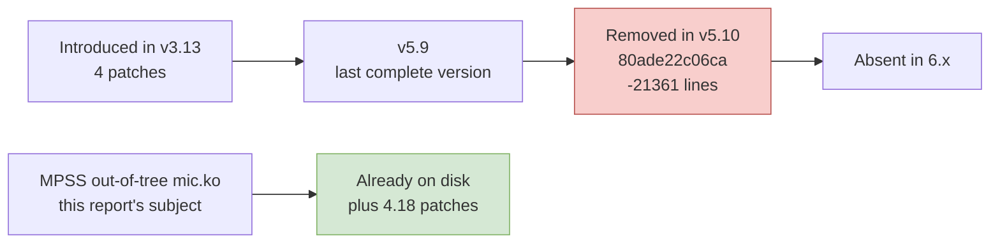

# Chapter 10 — Or Not: Comparing Seven Routes

> The previous nine chapters argued that the port is feasible and what has to change. This chapter asks the question from the other direction: **apart from rolling up your sleeves and changing those 38 files, is there any other way to go?** Only after ruling the alternatives out one by one does the one that remains become the real answer — and only then do you know where the cost is being charged.

---

## 10.1 First, Distinguish the Three Scopes — They Are Not Three Finish Lines

"The port is done" comes in three grades in this project. What separates them is the five file groups from Chapter 3 — **each group corresponds to a class of capability, and removing a group loses that class of capability**.

| Scope | Groups kept | Lines | Share | What you get | What you lose |
|---|---|---:|---:|---|---|
| **A — It survives** | A + B + C | **8,525** | 26% | The card powers up, takes an image and boots; every `/sys/class/mic/micN/*` attribute works; `micctrl` can query state, reset and flash; the PSMI page table works | The on-card terminal, the card's `mic0` network, SCIF, COI, MPI |
| **B — It is usable** | A + `linvcons` + `linvnet` + `vnet/*` | **11,751** | 36% | The card's virtual console works; the card's `mic0` NIC works, and the card is a networked node you can log into and run ordinary programs on | SCIF and COI: `SCIF` is MPSS's low-latency path and the foundation of `micpython`/COI/MPI |
| **C — Full** | All 38 | **32,746** | 100% | Everything above, plus the SCIF data plane, the virtio block-device backend and card crash dumps | Nothing is lost |

One thing must be stated when reckoning these three numbers: **the difference between Scope B and Scope A is not quantitative but qualitative.** The card's virtual NIC (`vnet/micveth_dma.c`, `host/linvnet.c`, `host/linvcons.c`) sits in group D of Chapter 3, yet it and the SCIF stack are **two independent data planes**. This used to be easy to overlook, because they live under the same directory group.

---

## 10.2 Route 1: Patch MPSS's Own Out-of-Tree `mic.ko`

**This is the route the report recommends**, and the subject of all the argument in Chapters 3 through 9.

| Item | Detail |
|---|---|
| What is ported | `_work/mpss-modules-3.8.6/`, 38 objects, 32,746 lines |
| Does the card side need changes? | **Not one line** (29 files, 23,029 lines) |
| Does user space need changes? | `micctrl`/`mpssd` outside the kernel basically need none, because they only know about sysfs and character devices |
| Existing precedent | The community tree `mpss-main` has already carried it to the 4.18 kernel on RHEL 8; the patches are on disk (2,372 lines) |
| Known costs | Kernel-interface debt (Chapter 6), page size (Chapter 5, F3/F4), BAR0 allocation (Chapter 7) |

Why it comes first: **it is perfectly aligned with the MPSS user-space ABI**. That ABI is seven sysfs attribute names, three character-device minor numbers and a set of ioctl numbers — Appendix A freezes it. Swap in any other implementation and this layer has to be rewritten, and rewriting it is far riskier than adapting it.

---

## 10.3 Route 2: Resurrect Upstream's `drivers/misc/mic/`

Upstream once had a MIC driver of its own. Its life was short, and that history is precisely what shows "resurrect upstream" is no shortcut:

| Version | What happened |
|---|---|
| v3.13 | Four patches introduce host, SMPT, COSM and the MIC bus |
| v5.9 | Last time it exists complete: `bus/ card/ common/ cosm/ cosm_client/ host/ scif/ vop/` |
| **v5.10** | Commit `80ade22c06ca115b81dd168e99479c8e09843513` "misc: mic: remove the MIC drivers" deletes 65 files, 21,361 lines |
| 6.x | **Does not exist** |

**It is not the same driver**:

1. Upstream's card-side firmware interface differs from MPSS's; it corresponds to the MIC bus and COSM model Intel reorganized later;
2. It **does not include** MPSS's power-state register protocol, PSMI, virtual console or crash dump — those major blocks;
3. Its character-device and sysfs interfaces do not match MPSS user space, and `micctrl` does not recognize it.

**Conclusion: it can serve as a reference book for the API rewrite** — especially how `scif` and `cosm` are written against the 4.x/5.x interfaces, which is more "modern" than MPSS's own 4.18 patches — **but it is not the porting target**. Starting from it means writing a new driver and a new user space at the same time.

---

## 10.4 Route 3: Run an x86 Virtual Machine on LoongArch and Pass the Card Through

The idea is natural enough: if the kernel module is hard to change, then don't change it — run an x86-64 VM on the LoongArch machine, pass the card through to that VM, and keep using Intel's stock MPSS inside the VM.

It runs into three walls:

| Wall | Fact |
|---|---|
| No hardware virtualization available | LoongArch mainline does have its own KVM (the option is not yet in 6.6's `arch/loongarch/Kconfig`; `arch/loongarch/kvm/Kconfig` exists from 6.7 onward, where `config KVM` has `depends on AS_HAS_LVZ_EXTENSION`, [loongarch/kvm/Kconfig @ v6.7](https://git.kernel.org/pub/scm/linux/kernel/git/stable/linux.git/plain/arch/loongarch/kvm/Kconfig?h=v6.7)), but what it virtualizes is **LoongArch** guests. To execute x86-64 instructions on LoongArch you are limited to QEMU's TCG interpreter |
| No IOMMU | Chapter 7, 7.6 of this report already established that LoongArch mainline provides no IOMMU. An IOMMU is the very precondition for VFIO passthrough |
| VFIO without an IOMMU explicitly does not support VM passthrough | The help text for `VFIO_NOIOMMU` in 6.6's `drivers/vfio/Kconfig` says verbatim: `Device assignment to virtual machines is also not possible with this mode since there is no IOMMU to provide DMA translation.` |

The third wall is decisive: **this is not a matter of misconfiguration; upstream explicitly does not support it.**

Even if it worked, there is a performance dead end: the card's 8 GiB card memory window would have TCG handle MMIO accesses one at a time, and both image download and SCIF are dense MMIO + DMA workloads.

**Conclusion: rejected.**

---

## 10.5 Route 4: No Host Driver — Treat the Card as a Black Box

Could you simply not write a driver and just plug the card in and use it?

The card does have its own SPI flash holding the boot firmware and the on-card Linux, and MPSS does provide flashing tools. But this route still does not work, for two reasons:

1. **The card has no network outlet of its own.** The peer implementation, on this side, of the card's `mic0` network interface is exactly `host/linvnet.c` (802 lines) plus `vnet/micveth_dma.c` (1,642 lines). Both pieces of code live in `mic.ko`. Without them, the card's Ethernet port exists only in the card's imagination.
2. **The card has no interface of its own.** By the same token, the peer implementation on this side of the on-card Linux console is `host/linvcons.c` (687 lines).

So the outcome of "no host driver" is not "the card runs by itself" but "the card boots by itself and then nobody can reach it".

**Conclusion: there is no such route.** The host driver is this card's only channel to the outside world.

---

## 10.6 Route 5: Put the Card Back in an x86 Machine

This is not a port, but it may be **the cheapest correct answer**, so it has to be put on the table:

| Criterion | What to choose |
|---|---|
| The goal is "to use this card" | **Put it back in an x86 machine.** A second-hand x86 host costs far less than a port plus long-term maintenance |
| The goal is "to prove that the LoongArch platform can host this class of card" | Port it. And Scope A (8,525 lines) is enough for that proof |
| The goal is "long-term removal of x86", with the card as an asset that must be kept | Port it, via Scope B or C |

Only by looking at this alongside Route 1 is the picture honest: **the port is technically sound, but its value depends on the goal.** The effort figures given in Chapters 6 and 9 should be compared directly against the cost of "keep one x86 front-end machine".

---

## 10.7 Route 6: Cut SCIF, Keep Only Boot and Networking (Scope B)

This is **the only route that both rests on real technical grounds and genuinely saves work**.

| Item | Detail |
|---|---|
| Kept | Groups A, B and C, plus `host/linvcons.c`, `host/linvnet.c`, `vnet/micveth_dma.c`, `vnet/micveth_param.c` |
| Cut | All 16 files of `micscif/` (16,498 lines), `dma/` and `host/vhost/`, `host/vmcore.c` |
| Line count | **11,751 lines, 36%** |
| What is left on the card | The card boots, has its own `mic0` NIC, can be logged into through the virtual console, and can be used as a 61-core networked node |
| What is lost | SCIF's low-latency memory access, COI, `micpython`, and the path where MPI runs over SCIF; MPI on top of SCIF can only fall back to TCP |

What it saves is **20,995 lines**, and those 20,995 lines happen to be the hardest part of the whole tree (the SCIF stack, the virtio backend, and vmcore's tight coupling to the on-card kernel's memory layout).

But it has a precondition that **must be measured first**, and the report makes no assumption about it:

> The on-card `micscif.ko` looks for the host peer node at boot. If the host side does not load `micscif`, does the card's SCIF **back off gracefully** (the connection fails, networking still works), or does it **hang in the handshake** (networking never comes up)? Node management in `micscif_nm.c` is designed around nodes coming up and going down, which points to the former; but **there is no evidence on disk that proves it either way**. It has to be measured at on-hardware step 2, and Chapter 11 describes how.

If the answer is "backs off gracefully", then Scope B is the most economical endpoint for this route; if the answer is "hangs", then Scope B has to pull part of `micscif/` back in, and it no longer saves work.

---

## 10.8 Route 7: Leave the Kernel Alone and Write a User-Space Driver Instead

Could those 38 files in the kernel be replaced by a few-hundred-line user-space program? All it really has to do is three things: write BAR0 to download an image, write BAR4 to ring a doorbell, and wait for an interrupt.

But it runs into two things that only the kernel can do:

1. **Hand the card the physical address of host memory.** The card reads and writes host memory through the card-view-host window, and what goes into that window must be a host physical address. In kernel mode `virt_to_phys()`/`pfn` gets it for you; in user space you would have to look up your own page frame numbers through `/proc/self/pagemap`, which even as root is only "just barely possible" — and pages get swapped out and migrated.
2. **Receive MSI-X interrupts.** To get MSI-X in user space you have to go through VFIO, and Chapter 7 §7.6 has already established that LoongArch has no IOMMU.

**Conclusion: it cannot be the end state.** But it is valuable as **on-hardware step 0**: a minimal user-space program (or simply a few hand-written MMIO accesses with `devmem`) to check "does the firmware actually hand out this 8 GiB high BAR at all" is far quicker than writing a kernel module first. Chapter 11 lists this as step 1.

---

## 10.9 The Seven Routes Side by Side

| Route | Technical feasibility | Effort | Is the card still usable? | Verdict |
|---|---|---|---|---|
| **1 — Patch MPSS's `mic.ko`** | Feasible | The full 32,746 lines are within scope | All capabilities | **Recommended** |
| 2 — Resurrect upstream `drivers/misc/mic/` | The code has been deleted; and it is not the same driver | Larger | Incompatible with MPSS user space | Rejected; reference only |
| 3 — x86 VM + passthrough | No IOMMU; upstream explicitly does not support VM passthrough | Very large | Theoretically usable | **Rejected** |
| 4 — No host driver | The card has no network outlet or interface of its own | 0 | Unusable | Does not exist |
| 5 — Put it back in an x86 machine | Entirely feasible | **0** | All capabilities | **Must be included in the comparison** |
| 6 — Cut SCIF | Feasible **but with one unverified precondition** | about 36% (11,751 lines) | Usable as a networked node; SCIF capabilities gone | Worth measuring before deciding |
| 7 — User-space driver | Can only download images and ring doorbells | Small | Only the kernel can do those two things | A verification tool only |

---

## 10.10 Chapter Conclusion

Three conclusions, in order of importance:

1. **Routes 3 (VM passthrough) and 4 (no driver) are dead.** The former is rejected outright by "LoongArch has no IOMMU", with upstream's own Kconfig text as witness; the latter is rejected by "the card's network and console peers both live in `mic.ko`".
2. **Route 5 must be placed on equal footing with Route 1.** The report's job is to show that "the port is technically sound and what it costs", but the decision-maker needs to know at the same time that "keeping one x86 front-end machine costs 0". Chapter 9 gives the effort figures for exactly that comparison.
3. **Route 6 is the only alternative worth one measurement up front.** It brings the scope down from 32,746 lines to 11,751 at the cost of the SCIF data plane. Whether it holds depends on a question that has no answer on disk: does the card's SCIF back off gracefully when it cannot find the host peer? **That question must be measured before any work starts, and Chapter 11 says how.**
