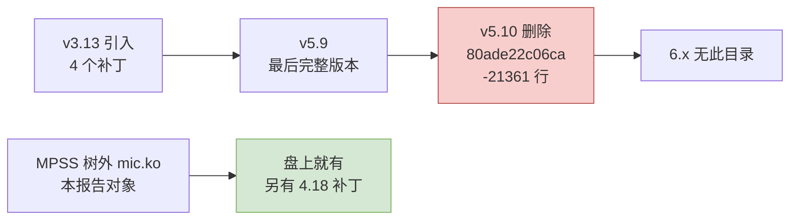

# 第十章　而不是这样：七条路线的比较

> 　前面九章论证了「能移植、要改什么」。这一章换个方向问：**除了动手改这 38 个文件，还有没有别的走法？**一条一条排掉之后，剩下的那条才是真答案，也才知道代价被算在哪。

---

## 10.1　先分清三个射程，它们不是三个终点

　　「移植完成」这句话在本项目里有三种成色。区分它们的依据是第三章的五组文件——**每一组对应一类能力，抽掉哪一组就丢掉哪一类能力**。

| 射程 | 保留的组 | 行数 | 占比 | 舰拿到什么 | 丢掉什么 |
|---|---|---:|---:|---|---|
| **甲　活得下来** | A + B + C | **8,525** | 26% | 卡能上电、能灌镜像、能启动；`/sys/class/mic/micN/*` 全部属性可用；`micctrl` 能查询状态、能复位、能刷闪存；PSMI 页表可用 | 卡上的终端、卡的 `mic0` 网络、SCIF、COI、MPI |
| **乙　用得上** | 甲 + `linvcons` + `linvnet` + `vnet/*` | **11,751** | 36% | 卡的虚拟控制台可用；卡的 `mic0` 网卡可用，卡作为一台联网节点可登录、可跑普通程序 | SCIF 与 COI：`SCIF` 是 MPSS 的低延迟路径，也是 `micpython`／COI／MPI 的底座 |
| **丙　全量** | 全部 38 个 | **32,746** | 100% | 上述全部，外加 SCIF 数据面、virtio 块设备后端、卡崩溃转储 | 没有丢掉的能力 |

　　算这三个数字的时候有一条必须说明：**射程乙与射程甲之间不是量的差别，是质的差别。**卡的虚拟网卡（`vnet/micveth_dma.c`、`host/linvnet.c`、`host/linvcons.c`）虽然待在第三章的 D 组里，但它们与 SCIF 协议栈是**两个独立的数据面**。这一点以前容易被忽略，因为它们在同一个目录组下。

---

## 10.2　路线一：改 MPSS 自带的树外 `mic.ko`

　　**这就是本报告的推荐路线**，也是第三到九章全部论证的对象。

| 项 | 内容 |
|---|---|
| 移植对象 | `_work/mpss-modules-3.8.6/`，38 个对象、32,746 行 |
| 卡侧是否要改 | **一行不改**（29 个文件、23,029 行） |
| 用户态是否要改 | 内核之外的 `micctrl`／`mpssd` 基本不用改，因为它只认 sysfs 与字符设备 |
| 现成先例 | 社区树 `mpss-main` 已把它带到 RHEL 8 的 4.18 内核，补丁在盘上（2,372 行） |
| 已知代价 | 内核接口欠账（第六章）、页大小（第五章 F3/F4）、BAR0 分配（第七章） |

　　为什么它是首选：**它与 MPSS 用户态的 ABI 完全对齐**。这套 ABI 是七条 sysfs 属性名、三个字符设备次设备号、一套 ioctl 号——附录 A 把它冻结了。换任何别的实现，这一层都要重写一遍，而重写的风险远大于适配它。

---

## 10.3　路线二：捡回上游的 `drivers/misc/mic/`

　　上游曾经有过一套 MIC 驱动。它的生命史很短，而这段历史恰好说明「捡回上游」不是捷径：

| 版本 | 发生了什么 |
|---|---|
| v3.13 | 4 个补丁把 host、SMPT、COSM、MIC 总线引入 |
| v5.9 | 最后一次完整存在：`bus/ card/ common/ cosm/ cosm_client/ host/ scif/ vop/` |
| **v5.10** | 提交 `80ade22c06ca115b81dd168e99479c8e09843513`「misc: mic: remove the MIC drivers」，删掉 65 个文件、21,361 行 |
| 6.x | **不存在** |

　　**它不是同一个驱动**：

1. 上游那套的卡侧固件接口与 MPSS 不同，它对应的是 Intel 后来重新整理过的 MIC 总线与 COSM 模型；
2. 它**不包含** MPSS 的电源状态寄存器协议、PSMI、虚拟控制台、崩溃转储这几大块；
3. 它的字符设备与 sysfs 界面与 MPSS 用户态不匹配，`micctrl` 认不出它。

　　**结论：可以作为 API 改写的参考书**——尤其是 `scif` 与 `cosm` 那部分在 4.x／5.x 接口下的写法，比 MPSS 自己的 4.18 补丁更「现代」——**但它不是移植对象**。想从它出发，等于同时写一个新驱动和一套新用户态。

---

## 10.4　路线三：在龙芯上开一台 x86 虚拟机，把卡直通进去

　　这个想法很自然：既然内核模块难改，那就别改，在龙芯上跑一台 x86-64 虚拟机、把卡直通给虚拟机、在虚拟机里继续用 Intel 的原版 MPSS。

　　它撞在三堵墙上：

| 墙 | 事实 |
|---|---|
| 没有硬件虚拟化可用 | 龙芯主线确实有了自己的 KVM（6.6 的 `arch/loongarch/Kconfig` 里还没有这一项，`arch/loongarch/kvm/Kconfig` 从 6.7 起存在，`config KVM` 的依赖是 `depends on AS_HAS_LVZ_EXTENSION`，[loongarch/kvm/Kconfig @ v6.7](https://git.kernel.org/pub/scm/linux/kernel/git/stable/linux.git/plain/arch/loongarch/kvm/Kconfig?h=v6.7)），但它虚拟化的是**龙芯**客户机。要在龙芯上执行 x86-64 指令，只能用 QEMU 的 TCG 解释执行 |
| 没有 IOMMU | 报告第七章 7.6 已确认：龙芯主线不提供 IOMMU。VFIO 直通的前提就是 IOMMU |
| 无 IOMMU 的 VFIO 明确不支持虚拟机直通 | 6.6 的 `drivers/vfio/Kconfig` 里 `VFIO_NOIOMMU` 的帮助原文写着：`Device assignment to virtual machines is also not possible with this mode since there is no IOMMU to provide DMA translation.` |

　　第三堵墙是决定性的：**这不是「没调好」，而是上游明确不支持。**

　　即使它能通，还有一条性能上的死路：卡的 8 GiB 卡存窗口要靠 TCG 逐次处理 MMIO 访问，而灌镜像与 SCIF 都是密集的 MMIO + DMA 操作。

　　**结论：否决。**

---

## 10.5　路线四：不装主机驱动，把卡当黑盒用

　　能不能干脆不写驱动，把卡插上就用？

　　卡上确实有自己的 SPI 闪存，里面存着引导固件与卡上 Linux；MPSS 也确实提供刷写工具。但这条路仍然走不通，理由有两层：

1. **卡没有自己的网络出口。**卡上的 `mic0` 这个网络接口，它在本侧的对端实现就是 `host/linvnet.c`（802 行）加 `vnet/micveth_dma.c`（1,642 行）。这两段代码都在 `mic.ko` 里。没有它们，卡的以太网口只存在于卡自己的想象中。
2. **卡没有自己的界面。**同理，卡上 Linux 的控制台在本侧的对端实现是 `host/linvcons.c`（687 行）。

　　所以「不装主机驱动」的结果不是「卡能自己跑」，而是「卡能自己启动，然后谁也够不着它」。

　　**结论：没有这条路。**主机驱动是这张卡唯一的对外通道。

---

## 10.6　路线五：把卡插回一台 x86 机器

　　这不是移植，但它可能是**最省钱的正确答案**，因此必须摆到桌面上：

| 判据 | 该选什么 |
|---|---|
| 目的是「用上这张卡」 | **插回 x86 机器**。一台二手 x86 主机的价钱远低于移植加长期维护 |
| 目的是「验证龙芯平台能承载这类卡」 | 移植。而且射程甲（8,525 行）就够做这个验证 |
| 目的是「长期去 x86 化」，卡是必须保留的资产 | 移植，走射程乙或丙 |

　　把这条和路线一放在一起看，才是诚实的：**移植在技术上成立，但它的价值取决于目的。**报告第六章与第九章给出的工期，应当拿去和「留一台 x86 前端机」的成本直接对比。

---

## 10.7　路线六：砍掉 SCIF，只保留引导与网络（射程乙）

　　这是**唯一一条既有实质技术依据、又能真正省工的路线**。

| 项 | 内容 |
|---|---|
| 保留 | A、B、C 三组，加 `host/linvcons.c`、`host/linvnet.c`、`vnet/micveth_dma.c`、`vnet/micveth_param.c` |
| 砍掉 | `micscif/` 全部 16 个文件（16,498 行）、`dma/` 与 `host/vhost/`、`host/vmcore.c` |
| 行数 | **11,751 行，36%** |
| 卡上还剩什么 | 卡启动、卡有自己的 `mic0` 网卡、可通过虚拟控制台登录、可作为一台 61 核的联网节点使用 |
| 丢掉什么 | SCIF 的低延迟内存访问、COI、`micpython`、MPI 走 SCIF 的那条路；SCIF 之上的 MPI 只能退到 TCP |

　　它省掉的是 **20,995 行**，而这 20,995 行恰好是整棵树里最难的部分（SCIF 协议栈、virtio 后端、vmcore 与卡上内核内存布局强耦合）。

　　但它有一个**必须先实测**的前提，报告不作假设：

> 　卡上的 `micscif.ko` 会在启动时寻找主机对端节点。如果主机侧不加载 `micscif`，卡的 SCIF 是**优雅退让**（连接失败、网络仍可用），还是**卡在握手**（网络起不来）？源码里 `micscif_nm.c` 的节点管理是按「节点上下线」设计的，倾向于前者；但这一条**盘上没有证据能够证明**。它必须在上机第 2 步就量出来，量的方法见第十一章。

　　如果答案是「优雅退让」，那么射程乙就是这条路线最划算的终点；如果答案是「卡住」，射程乙就得把 `micscif/` 的一部分也算进来，那它就不再省工了。

---

## 10.8　路线七：不改内核，改写成一个用户态驱动

　　内核里的 38 个文件，能不能换成一个几百行的用户态程序？它能做的事其实只有三件：写 BAR0 灌镜像、写 BAR4 敲门铃、等一个中断。

　　但它会撞上两个只有内核才做得到的事：

1. **把主机内存的物理地址交给卡。**卡通过卡看主机窗口读写主机内存，窗口里填的必须是主机物理地址。内核态用 `virt_to_phys()`／`pfn` 就拿到了；用户态要用 `/proc/self/pagemap` 反查自己的页帧号，即使在 root 下也只是「勉强做得到」，而且页会被换出、会被迁移。
2. **接收 MSI-X 中断。**用户态要拿到 MSI-X 就必须走 VFIO，而第七章 §7.6 已确认龙芯没有 IOMMU。

　　**结论：不能当终局。**但把它当成**上机第 0 步**是有价值的：用一个最小的用户态程序（或干脆用 `devmem` 手写几次 MMIO）先验证「固件到底给不给这个 8 GiB 的高位 BAR」，比先写内核模块快得多。这件事第十一章列为第 1 步。

---

## 10.9　七条路线对照

| 路线 | 技术可行性 | 工作量 | 卡还能用吗 | 判定 |
|---|---|---|---|---|
| **一　改 MPSS 的 `mic.ko`** | 可行 | 全量 32,746 行在射程内 | 全部能力 | **推荐** |
| 二　捡回上游 `drivers/misc/mic/` | 代码已被删除；且不是同一个驱动 | 更大 | 与 MPSS 用户态不兼容 | 否决，只当参考 |
| 三　x86 虚拟机 + 直通 | 无 IOMMU，上游明确不支持 VM 直通 | 极大 | 理论可用 | **否决** |
| 四　不装主机驱动 | 卡无自己的网络出口与界面 | 0 | 用不了 | 不存在 |
| 五　插回 x86 机器 | 完全可行 | **0** | 全部能力 | **必须列入对比** |
| 六　砍掉 SCIF | 可行**但有一个未验证前提** | 约 36%（11,751 行） | 作为联网节点可用，SCIF 能力没了 | 值得实测后再定 |
| 七　用户态驱动 | 只做得到灌镜像与门铃 | 小 | 只有内核能做那两件事 | 只能当验证手段 |

---

## 10.10　本章结论

　　三条结论，按重要性排：

1. **路线三（虚拟机直通）与路线四（不装驱动）是死的。**前者被「龙芯没有 IOMMU」这一条直接否决，且有上游 Kconfig 的原文作证；后者被「卡的网络与控制台对端都在 `mic.ko` 里」这一条否决。
2. **路线五必须摆在与路线一对等的位置上。**报告的任务是说明「移植在技术上成立、代价是多少」，但决策者需要同时知道「留一台 x86 前端机的代价是 0」。第九章会给工期数字，用来做这个对比。
3. **路线六是唯一值得先量一次的替代方案。**它把射程从 32,746 行降到 11,751 行，代价是丢掉 SCIF 数据面。它成立与否取决于一个盘上没有答案的问题：卡的 SCIF 在找不到主机对端时会不会优雅退让。**这个问题必须在动手之前量出来，量法见第十一章。**
