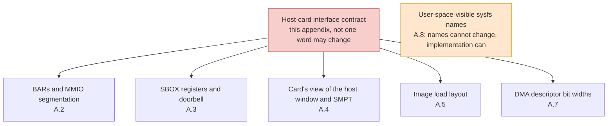
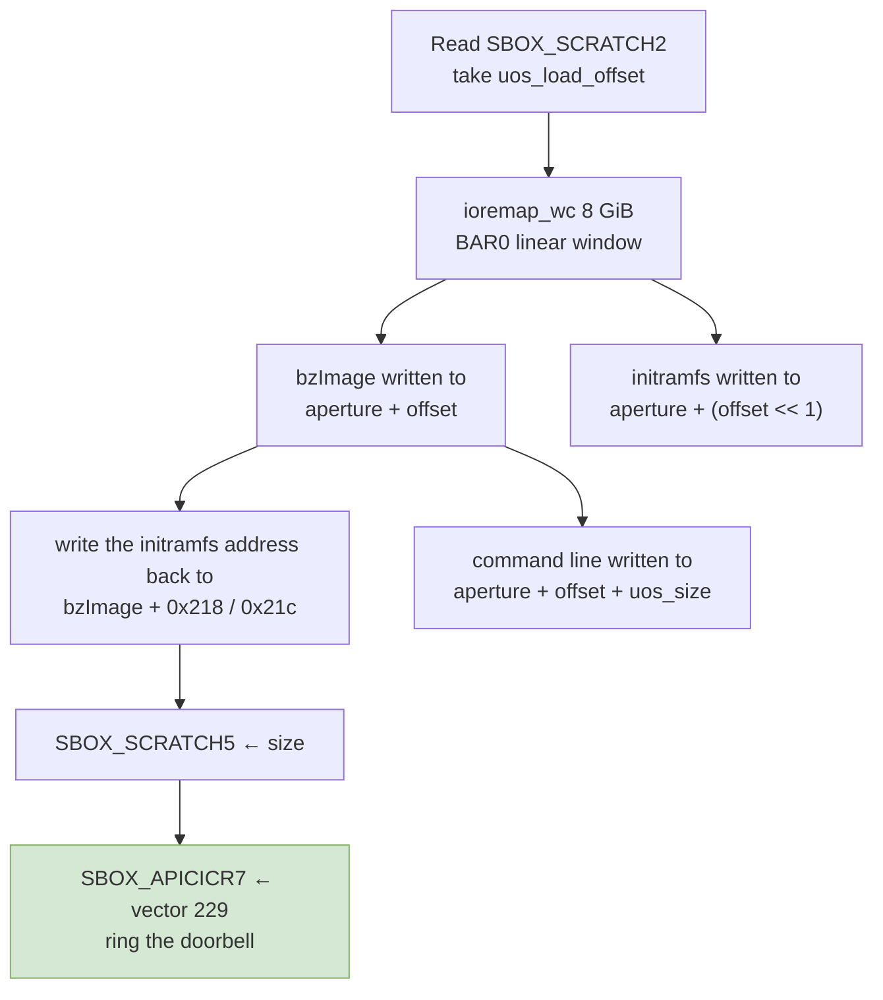

# Appendix A — Interface contracts between host and card

> This appendix freezes "every convention between the host driver and the KNC card" into a single list. These conventions belong to the **hardware protocol**, not to Intel's implementation taste. There is only one action to take on them when porting: leave them exactly as they are. Wherever Chapters 8 and 9 rule that something "must be left untouched", the basis is here.

---

## A.0 Why this contract stands on its own

The user-space stack of Chapter 4, the architectural coupling of Chapter 5 and the kernel interfaces of Chapter 6 can all change with the kernel version. **The one thing that cannot change is the set of conventions already fixed at the electrical signalling level between host and card**: register offsets, doorbell vectors, the division of labour between the BARs, the bit layout of SMPT entries. These are written into the KNC silicon; no port can alter them, only comply.



---

## A.1 Contract one: BARs and MMIO segmentation

The card deals with the host through two BARs, whose numbers are determined by the card's firmware and are independent of the host ISA [`include/mic_common.h:178`–`179`].

| Macro | Value | Meaning |
|---|---:|---|
| `DLDR_APT_BAR` | 0 | Card memory window: the 8 GiB of contiguous card memory seen by the host |
| `DLDR_MMIO_BAR` | 4 | Register window: 128 KiB |

BAR4 is in turn cut into three segments [`include/mic_common.h:112`–`114`]:

| Macro | Offset | Contents |
|---|---:|---|
| `HOST_DBOX_BASE_ADDRESS` | `0x00000000` | DBOX: doorbells and interrupt causes |
| `HOST_SBOX_BASE_ADDRESS` | `0x00010000` | SBOX: all system registers |
| `HOST_GTT_BASE_ADDRESS` | `0x00040000` | GTT: address translation table (**never used on KNC**) |

The three access macros are just `readl`/`writel` plus a base offset, with nothing x86-specific in them [`include/mic_common.h:150`–`166`]:

```c
#define SBOX_READ(mmio, offset) \
	readl((uint32_t*)((uint8_t*)(mmio) + (HOST_SBOX_BASE_ADDRESS + (offset))))
#define SBOX_WRITE(value, mmio, offset) \
	writel((value), (uint32_t*)((uint8_t*)(mmio) + (HOST_SBOX_BASE_ADDRESS + (offset))))
```

**The single point that needs a judgement** is that the GTT segment does not fit inside 128 KiB (`0x40000` already exceeds 128 KiB). The answer: on a KNC card `GTT_WRITE` is never called even once; it serves only Knights Ferry (`FAMILY_ABR`), and that card's BAR4 is larger. See Chapter 2, 2.4.

---

## A.2 Contract two: SBOX registers and the doorbell

SBOX is the host's only channel for controlling the card. The register offsets are written in `include/mic/micsboxdefine.h`, 208 lines of `#define SBOX_*` in total (35 lines tab-separated, 173 space-separated), falling on 207 distinct offsets (`SBOX_MXAR0_K1OM` and `SBOX_MXAR1` are both `0x9044`), from `0x1000` to `0xCC9C`; the maximum plus the SBOX base `0x10000` gives `0x1CC9C`, still within 128 KiB.

| Contract item | Value/location | Notes |
|---|---|---|
| Boot-complete doorbell | `SBOX_APICICR7` = `0x0000AA08` | Written to APIC ICR number 8 on the card |
| Boot interrupt vector | `MIC_BSP_INTERRUPT_VECTOR` = 229 [`include/mic_interrupts.h:45`] | The first interrupt number the host rings to the card |
| Number of card host-side MSI-X vectors | `MIC_NUM_MSIX_ENTRIES` = 1 [`include/mic_common.h:485`] | The card asks the host for a single interrupt line |
| How the APIC ID on the card is obtained | Read `SBOX_SCRATCH2`, take `SCRATCH2_APIC_ID` [`host/uos_download.c:325`] | The host does not guess where the card is, it asks the card |
| Load offset of the card's kernel | Read `SBOX_SCRATCH2`, take `SCRATCH2_DOWNLOAD_ADDR` [`host/uos_download.c:282`] | As above |
| Write-back of the image length | `SBOX_SCRATCH5` ← kernel image size [`host/uos_download.c:379`] | |
| Write-back of the reserved area | `SBOX_SCRATCH3` ← reserved size [`host/uos_download.c:397`] | |
| Clearing before the doorbell | `SBOX_SCRATCH2` written with 0, then read back [`host/uos_download.c:501`–`502`] | Handshake cleanup |
| Watchdog status | `SBOX_SCRATCH13`/`SCRATCH14` [`host/uos_download.c:1099`, `:1411`] | Heartbeat and reset |

The last three rows all **treat the card as a black box**: the host only does `readl`/`writel` and never cares who on the card implements these register semantics. This is the most portable part of the driver.

---

## A.3 Contract three: the card's view of the host window and SMPT

When the card needs to read host memory, it is not handed a physical address directly; instead it goes through a 32-entry **SMPT** (System Memory Page Table). This is the most distinctive part of KNC, and the one most easily misjudged as an "x86 dependency".

| Item | Value | Source |
|---|---:|---|
| Base address of the card's view of the host | `MIC_SYSTEM_BASE` = `0x8000000000` | [`include/mic/micbaseaddressdefine.h:101`] |
| Page granularity | `MIC_SYSTEM_PAGE_SIZE` = `0x0400000000` = 16 GiB | Same file, `:103` |
| Page number shift | `MIC_SYSTEM_PAGE_SHIFT` = 34 | [`include/mic/micscif_smpt.h:79`] |
| Number of entries | `NUM_SMPT_ENTRIES_IN_USE` = 32 | Same file, `:77` |
| Capacity | 32 × 16 GiB = 512 GiB | |
| Size of the card's view of the host window | 256 MiB (`0x0900000000`–`0x090FFFFFFF`) | [`include/mic/micbaseaddressdefine.h`] |

The bit layout of an entry is written in a source comment, and `BUILD_SMPT` is its literal translation [`include/mic/micscif_smpt.h:91`–`97`]:

$$
R \;=\; \big(\,(A \gg 34) \ll 2 \,\&\, \sim 3\,\big) \;\big|\; (\text{NO\_SNOOP} \,\&\, 1)
$$

Here $A$ is the 16 GiB-aligned host address covered by that entry, and a `NO_SNOOP` bit of 0 means **snooping is permitted**. Since $A$ is already 16 GiB-aligned, $(A \gg 34) \ll 2$ simplifies to $A \gg 32$:

$$
R \;=\; A \gg 32
$$

In other words, **the register value is bits 39:32 of that address**. The line in the source `dma_addr = i * MIC_SYSTEM_PAGE_SIZE` [`micscif/micscif_smpt.c:123`] is identity pre-warming, and the value written in is $R = 4i$; it is overwritten by the real return value of `pci_map_*` when memory is actually registered [`micscif/micscif_smpt.c:231`, `:260`]. The detailed path is in `_work/dma-address.md`.

The driver takes the return value of `pci_map_single()` and writes it into the register as a page number, treating it directly as a "host physical address". On a platform **without an IOMMU**, `pci_map_single()` returns exactly the physical address, so this path holds as-is, and it is naturally consistent with the identity pre-warm table; conversely, once an IOMMU is enabled, what gets written in is an IOVA, and the entry's value no longer matches the pre-warm table — **no compile error, only random data corruption**. So "LoongArch has no IOMMU" is a point in this driver's favour, and it must be written down as an explicit precondition. The full argument is in Chapter 5, 5.6.

---

## A.4 Contract four: image load layout

The host moves the k1om `bzImage` and the initramfs into card memory, at positions the card tells the host through `SBOX_SCRATCH2`.

| Step | Location | Value |
|---|---|---|
| Ask the card for the load offset | [`host/uos_download.c:477`] | `uos_load_offset = SCRATCH2_DOWNLOAD_ADDR` |
| Create an 8 GiB linear window | [`host/uos_download.c:488`] | Used to move the kernel |
| Kernel image lands inside the window | [`host/uos_download.c:493`] | At offset `uos_load_offset` |
| Kernel command line address | [`host/uos_download.c:496`] | `uos_cmd_offset = uos_load_offset + uos_size` |
| initramfs position | [`host/uos_download.c:544`] | `uos_load_offset << 1` (leaving ample headroom) |
| Write back the initramfs address | [`host/uos_download.c:560`]/`:562` | Write `bzImage` header `0x218`/`0x21c` |
| Usable memory on the card | [`host/uos_download.c:594`] | `boot_mem = aper.len >> 20` → `mem=8192M` |

Strung together in one diagram:



**Not one step here depends on the host ISA**: it is all file movement plus register writes. The only thing that depends on the host platform is "can 8 GiB be `ioremap`ped in one go"; see Chapters 7 and 11.

---

## A.5 Contract five: the command line of the card's kernel

The kernel on the card is x86-64 K1OM Linux (`Linux 2.6.38.8+mpss3.8`), and it accepts its own command line. The host merely **writes this string into the window**; it does not interpret the string itself.

| Category | Contents | Who writes it |
|---|---|---|
| The card's own command line | `quiet root=ramfs console=hvc0 cgroup_disable=memory highres=off` | Intel's initramfs |
| Appended by the driver | `card`, `vnet`, `scif_id`, `scif_addr`, `vnet_addr`, `vcons_hdr_addr`, `virtio_addr` | Host driver |
| Appended by the driver | `mem=%dM` (`boot_mem`), `ramoops_size`, `ramoops_addr`, `crashkernel=1M@80M` | Host driver |
| Source | [`host/uos_download.c:624`]–[`:649`] | |
| Corroboration | The `/proc/cmdline` record on line 3022 of the user guide: `virtio_addr=0x835c35a9c0 mem=8192M ramoops_size=16384` | Intel documentation |

**This set of parameters is written for the kernel on the card, not for the host**, so the presence of an x86 kernel parameter such as `crashkernel` is entirely normal and has nothing to do with LoongArch. The only thing to remember is that `mem=8192M` comes from the length of BAR0; see Chapter 5, 5.7.

---

## A.6 Contract six: DMA descriptors and address bit widths

Three different address widths are mixed in the same body of code, and this is the easiest place to misread in an audit.

| Use | Bit width | Source |
|---|---:|---|
| Source/destination addresses in a descriptor (`sap`/`dap`) | **40 bits** | [`include/mic/mic_dma_md.h:185`–`190`] |
| Descriptor length unit | 64 bytes | [`include/mic/mic_dma_md.h:419`]: `size >> L1_CACHE_SHIFT` |
| DMA ring base address (`DRAR_HI` high bits, `DRAR_LO` low bits) | `DRAR_LO` holds address bits `[31:0]`; bits `[1:0]` of `DRAR_HI` hold address bits `[33:32]` (host side `& 0x3`, card side `& 0xf`, i.e. `[35:32]`) | [`dma/mic_dma_md.c:318`–`327`, `:77`–`:88`] |
| Descriptor size | 16 bytes | Same as above |
| Cache line constant | Forced to 6 (=64 bytes) | [`include/mic/mic_dma_md.h:87`–`91`] |

The bit fields of `DRAR_HI` are laid out as follows: `[26]` holds the SYS flag (`dma/mic_dma_md.c:60`); `[25:21]` hold the 16 GiB page number, that is the SMPT entry number (`:100`–`:103`, `(addr >> 34) & 0x1f`; the page shift constant 34 is at `include/mic/micscif_smpt.h:79`); `[20:4]` hold the descriptor count (`:95`–`:98`, `(num & 0x1ffff) << 4`); and `[1:0]` hold bits 33:32 of the address (`:90`–`:93` shift the address right by 32 and then call `drar_hi_to_ba_bits()`, the host side taking `& 0x3` at `:85`–`:86` and the card side taking `& 0xf`, i.e. `[3:0]`, at `:83`–`:84`; the comment at `:79`–`:82` explains that bits 3:2 are currently ignored by the hardware and will not raise `DESC_ADDR_ERR`). **This has nothing to do with the host page size; it is tied only to the 64-byte cache line.** The detailed analysis is in Chapter 5, 5.5 and `_work/dma-address.md`.

---

## A.7 Contract seven: sysfs attribute names (user-space ABI)

The attribute names are **the names user-space `micctrl`/`mpss-daemon` depends on**; renaming them means changing the interface. The implementation may be rewritten; the names may not change.

`host/linsysfs.c` contains two attribute tables — `host_attributes[]` at [`host/linsysfs.c:199`]–[`:203`] and `bd_attributes[]` at [`host/linsysfs.c:714`]–[`:762`] — plus the one in `micscif/micscif_sysfs.c`, making three classes in all:

**(1) 25 ordinary attributes** (23 in `bd_attributes[]` plus 2 in `host_attributes[]`):

```
bd_attributes[]:   family  stepping  state  mode  image  initramfs
  post_code  boot_count  crash_count  cmdline  kernel_cmdline
  serialnumber  scif_status  meminfo
  pc3_enabled  pc6_enabled  pc6_timeout
  flash_update  log_buf_addr  log_buf_len
  virtblk_file  sku  interface_version
host_attributes[]: version  peer2peer
```

Of those 23 in `bd_attributes[]`, only `virtblk_file` is wrapped in version-conditional compilation.

**(2) 17 SBOX direct-read attributes** [`host/linsysfs.c:98`]–[`:120`], all of the form `__ATTR(name, mode, show_sbox_register, NULL) + offset + mask + shift`:

```
memoryvoltage  memoryfrequency  memsize  flashversion
substepping_data  stepping_data  model  family_data  processor  platform
extended_model  extended_family  fuse_config_rev
active_cores  fail_safe_offset
```

These 15 plus `corevoltage`/`corefrequency`, which are compiled only with `CONFIG_ML1OM`, make 17. They **merely read a register and print it**, and are pure mechanical code.

**(3) SCIF's own 7** [`micscif/micscif_sysfs.c`]:

```
maxnode  total  nodes  watchdog_to
watchdog_enabled  watchdog_auto_reboot  proxy_dma_threshold
```

**The discipline for these three tables when porting is: not one name may be touched; the implementation may be written however you like.** A function such as `show_sbox_register()` can be written ten different ways without affecting the ABI.

The three tables total 25 + 17 + 7 = 49 names. Of the 42 in `host/linsysfs.c`, the user guide lists 31 and omits 11; the item-by-item comparison is in [Appendix D — Manual Cross-Check](D-manual-crosscheck.md) §D.3.

---

## A.8 Frozen list

Everything below is treated as an immutable constant by all later chapters of the report. Changing any line of it is an **error**, not a "choice".

| Frozen item | Basis |
|---|---|
| BAR numbers 0 and 4, and the purpose of the two BARs | A.1 |
| The three `HOST_*_BASE_ADDRESS` offsets | A.1 |
| The 208 register offsets in `micsboxdefine.h` | A.2 |
| Doorbell vector 229, MSI-X vector count 1 | A.2 |
| The bit layout of all 32 SMPT entries and the 16 GiB granularity | A.3 |
| How the initramfs is placed relative to the kernel (`<< 1`) and header `0x218`/`0x21c` | A.4 |
| 16-byte descriptors, lengths in units of 64 bytes, 40-bit `sap`/`dap` | A.6 |
| The 25 + 17 + 7 = 49 sysfs attribute names | A.7, Appendix D §D.3 |

Conversely, **the following are not on the frozen list**, and changing them does not affect compatibility with the card:

1. the function names of any kernel API (Chapter 6);
2. the module parameter defaults in "Chapter 3, 3.5";
3. the Python version of the user space (Chapter 4);
4. the name of the `CONFIG_X86_MICPCI` macro itself.

---

## A.9 Conclusion of this appendix

Three sentences:

1. The layer that deals with the card is **nothing but `readl`/`writel` plus fixed offsets**, and not one place requires the host to execute an x86 instruction.
2. The only thing with "bit layout semantics" is the 40-bit address field of the SMPT table, and its validity condition is that **the platform does not enable an IOMMU** — a precondition, not a to-do item.
3. The sysfs attribute names are a **user-space ABI**: the implementation may be rewritten freely, but not one name may change.
