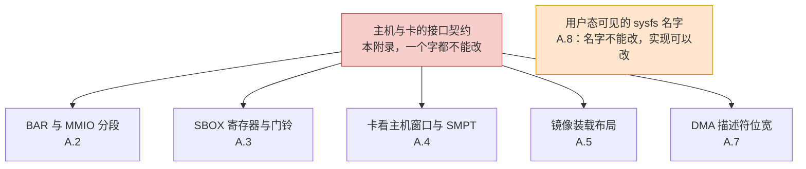
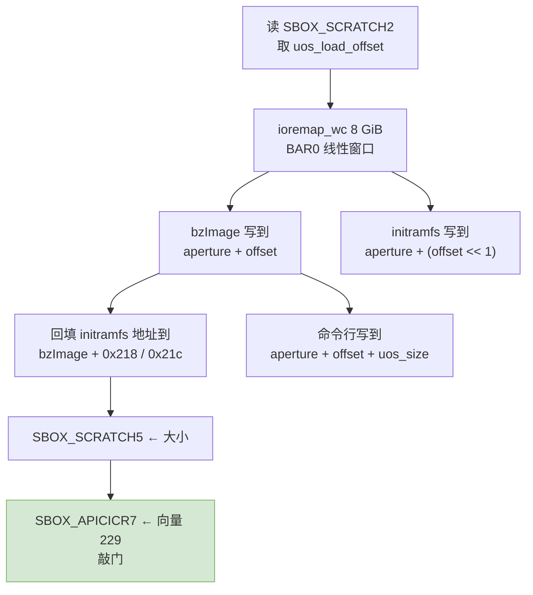

# 附录 A　主机与卡的接口契约

> 　本附录把「主机驱动与 KNC 卡之间的一切约定」固化成一张清单。这些约定属于**硬件协议**，不属于 Intel 的实现口味。移植时对它们只有一个动作：原封不动。凡是在第八章、第九章里被判定为「必须原封」的东西，依据都在这里。

---

## A.0　为什么要单独立这份契约

　　第四章的用户态栈、第五章的架构耦合、第六章的内核接口，都可能因为内核版本而改变。**唯一不能变的是主机与卡之间在电信号层面已经固定下来的那套约定**：寄存器偏移、门铃向量、BAR 分工、SMPT 表项的位布局。这些东西写在 KNC 的硅片里，谁移植都改不动，只能照办。



---

## A.1　契约一：BAR 与 MMIO 分段

　　卡通过两个 BAR 与主机打交道，编号由卡的固件决定，与主机 ISA 无关 [`include/mic_common.h:178`–`179`]。

| 宏 | 值 | 含义 |
|---|---:|---|
| `DLDR_APT_BAR` | 0 | 卡存窗口：主机看到的 8 GiB 连续卡存 |
| `DLDR_MMIO_BAR` | 4 | 寄存器窗口：128 KiB |

　　BAR4 内部又切成三段 [`include/mic_common.h:112`–`114`]：

| 宏 | 偏移 | 内容 |
|---|---:|---|
| `HOST_DBOX_BASE_ADDRESS` | `0x00000000` | DBOX：门铃与中断原因 |
| `HOST_SBOX_BASE_ADDRESS` | `0x00010000` | SBOX：全部系统寄存器 |
| `HOST_GTT_BASE_ADDRESS` | `0x00040000` | GTT：地址转换表（**KNC 上永不使用**） |

　　三个访问宏就是 `readl`／`writel` 加基址偏移，没有任何 x86 特有的东西 [`include/mic_common.h:150`–`166`]：

```c
#define SBOX_READ(mmio, offset) \
	readl((uint32_t*)((uint8_t*)(mmio) + (HOST_SBOX_BASE_ADDRESS + (offset))))
#define SBOX_WRITE(value, mmio, offset) \
	writel((value), (uint32_t*)((uint8_t*)(mmio) + (HOST_SBOX_BASE_ADDRESS + (offset))))
```

　　**唯一一处需要判断的**是 GTT 段在 128 KiB 之内放不下（`0x40000` 已越过 128 KiB）。答案是：KNC 卡上 `GTT_WRITE` 一次都不会被调用，它只服务 Knights Ferry（`FAMILY_ABR`），而那种卡的 BAR4 更大。详见第二章 2.4。

---

## A.2　契约二：SBOX 寄存器与门铃

　　SBOX 是主机控制卡的唯一通道。寄存器偏移写在 `include/mic/micsboxdefine.h` 里，共 208 行 `#define SBOX_*`（35 行用制表符分隔、173 行用空格），落在 207 个不同偏移上（`SBOX_MXAR0_K1OM` 与 `SBOX_MXAR1` 同为 `0x9044`），从 `0x1000` 到 `0xCC9C`；最大值加 SBOX 基址 `0x10000` 得 `0x1CC9C`，仍在 128 KiB 内。

| 契约项 | 值／位置 | 说明 |
|---|---|---|
| 引导完成门铃 | `SBOX_APICICR7` = `0x0000AA08` | 写到卡上第 8 号 APIC ICR |
| 引导中断向量 | `MIC_BSP_INTERRUPT_VECTOR` = 229 [`include/mic_interrupts.h:45`] | 主机敲给卡的第一个中断号 |
| 卡的主机侧 MSI-X 向量数 | `MIC_NUM_MSIX_ENTRIES` = 1 [`include/mic_common.h:485`] | 卡只向主机要一根中断线 |
| 卡上 APIC ID 的取法 | 读 `SBOX_SCRATCH2`，取 `SCRATCH2_APIC_ID` [`host/uos_download.c:325`] | 主机不猜卡在哪，问卡 |
| 卡上内核的装载偏移 | 读 `SBOX_SCRATCH2`，取 `SCRATCH2_DOWNLOAD_ADDR` [`host/uos_download.c:282`] | 同上 |
| 镜像长度的回填 | `SBOX_SCRATCH5` ← 内核映像大小 [`host/uos_download.c:379`] | |
| 保留区的回填 | `SBOX_SCRATCH3` ← 保留大小 [`host/uos_download.c:397`] | |
| 门铃前的清零 | `SBOX_SCRATCH2` 写 0 再读回 [`host/uos_download.c:501`–`502`] | 握手清理 |
| 看门狗状态 | `SBOX_SCRATCH13`／`SCRATCH14` [`host/uos_download.c:1099`、`:1411`] | 心跳与复位 |

　　最后三行**都是把卡当黑箱**：主机只做 `readl`／`writel`，从不关心卡上是谁在执行这些寄存器语义。这是本驱动最容易移植的部分。

---

## A.3　契约三：卡看主机窗口与 SMPT

　　卡要读主机内存时，不是直接给物理地址，而是走一张 32 项的 **SMPT**（System Memory Page Table）。这是 KNC 最独特、也最容易被误判成「x86 依赖」的一块。

| 项 | 值 | 出处 |
|---|---:|---|
| 卡看主机的基址 | `MIC_SYSTEM_BASE` = `0x8000000000` | [`include/mic/micbaseaddressdefine.h:101`] |
| 页粒度 | `MIC_SYSTEM_PAGE_SIZE` = `0x0400000000` = 16 GiB | 同上 `:103` |
| 页号位移 | `MIC_SYSTEM_PAGE_SHIFT` = 34 | [`include/mic/micscif_smpt.h:79`] |
| 表项数 | `NUM_SMPT_ENTRIES_IN_USE` = 32 | 同上 `:77` |
| 容量 | 32 × 16 GiB = 512 GiB | |
| 卡看主机窗口大小 | 256 MiB（`0x0900000000`–`0x090FFFFFFF`） | [`include/mic/micbaseaddressdefine.h`] |

　　表项的位布局写在源码注释里，`BUILD_SMPT` 就是它的直译 [`include/mic/micscif_smpt.h:91`–`97`]：

$$
R \;=\; \big(\,(A \gg 34) \ll 2 \,\&\, \sim 3\,\big) \;\big|\; (\text{NO\_SNOOP} \,\&\, 1)
$$

　　其中 $A$ 是该表项覆盖的 16 GiB 对齐主机地址，`NO_SNOOP` 位为 0 表示**允许侦听**。因为 $A$ 已经是 16 GiB 对齐的，$(A \gg 34) \ll 2$ 化简为 $A \gg 32$：

$$
R \;=\; A \gg 32
$$

　　也就是说，**寄存器值就是该地址第 39:32 位**。源码里那句 `dma_addr = i * MIC_SYSTEM_PAGE_SIZE` [`micscif/micscif_smpt.c:123`] 是恒等预热，写进去的值是 $R = 4i$；它会在真正注册内存时被 `pci_map_*` 的真实返回值覆盖 [`micscif/micscif_smpt.c:231`、`:260`]。详细路径见 `_work/dma-address.md`。

　　驱动把 `pci_map_single()` 的返回值直接当作「主机物理地址」压成页号写进寄存器。在**没有 IOMMU** 的平台上，`pci_map_single()` 返回的就是物理地址，这条路原样成立，而且与恒等预热表天然一致；反过来，一旦启用 IOMMU，写进去的会是 IOVA，表项的数值就与预热表不一致了——**不会报编译错误，只会变成随机数据错误**。所以「龙芯没有 IOMMU」对这份驱动是加分项，而它必须被写成明文前置条件。详细论证见第五章 5.6。

---

## A.4　契约四：镜像装载布局

　　主机把 k1om 的 `bzImage` 与 initramfs 搬进卡存，位置由卡通过 `SBOX_SCRATCH2` 告诉主机。

| 步骤 | 位置 | 值 |
|---|---|---|
| 问卡要装载偏移 | [`host/uos_download.c:477`] | `uos_load_offset = SCRATCH2_DOWNLOAD_ADDR` |
| 建 8 GiB 线性窗口 | [`host/uos_download.c:488`] | 用于搬运内核 |
| 内核映像落到窗口内 | [`host/uos_download.c:493`] | 偏移 `uos_load_offset` |
| 内核命令行地址 | [`host/uos_download.c:496`] | `uos_cmd_offset = uos_load_offset + uos_size` |
| initramfs 位置 | [`host/uos_download.c:544`] | `uos_load_offset << 1`（留出足够余量） |
| 回填 initramfs 地址 | [`host/uos_download.c:560`]／`:562` | 写 `bzImage` 头部 `0x218`／`0x21c` |
| 卡上可用内存 | [`host/uos_download.c:594`] | `boot_mem = aper.len >> 20` → `mem=8192M` |

　　用一张图串起来：



　　这里**没有一步依赖主机 ISA**：全是文件搬运加寄存器写入。唯一依赖主机平台的是「能不能一次性 `ioremap` 8 GiB」，见第七章、第十一章。

---

## A.5　契约五：卡上内核的命令行

　　卡上的内核是 x86-64 K1OM Linux（`Linux 2.6.38.8+mpss3.8`），它接受自己的命令行。主机只是**往窗口里写这串字符**，它自己不解释这串字符。

| 分类 | 内容 | 谁写的 |
|---|---|---|
| 卡自己的命令行 | `quiet root=ramfs console=hvc0 cgroup_disable=memory highres=off` | Intel 的 initramfs |
| 驱动追加 | `card`、`vnet`、`scif_id`、`scif_addr`、`vnet_addr`、`vcons_hdr_addr`、`virtio_addr` | 主机驱动 |
| 驱动追加 | `mem=%dM`（`boot_mem`）、`ramoops_size`、`ramoops_addr`、`crashkernel=1M@80M` | 主机驱动 |
| 出处 | [`host/uos_download.c:624`]–[`:649`] | |
| 旁证 | 用户指南第 3022 行的 `/proc/cmdline` 实录：`virtio_addr=0x835c35a9c0 mem=8192M ramoops_size=16384` | Intel 文档 |

　　**这串参数是写给卡上那个内核的，不是写给主机的**，所以内容里出现 `crashkernel` 这样的 x86 内核参数完全正常，与 LoongArch 无关。唯一要记住的是 `mem=8192M` 的来源是 BAR0 的长度，见第五章 5.7。

---

## A.6　契约六：DMA 描述符与地址位宽

　　三种地址宽度混在同一套代码里，这是审计中最容易看错的地方。

| 用途 | 位宽 | 出处 |
|---|---:|---|
| 描述符里的源／目的地址（`sap`／`dap`） | **40 位** | [`include/mic/mic_dma_md.h:185`–`190`] |
| 描述符长度单位 | 64 字节 | [`include/mic/mic_dma_md.h:419`]：`size >> L1_CACHE_SHIFT` |
| DMA 环基址（`DRAR_HI` 高位、`DRAR_LO` 低位） | `DRAR_LO` 放地址 `[31:0]`；`DRAR_HI` 的 `[1:0]` 放地址 `[33:32]`（主机侧 `& 0x3`，卡侧 `& 0xf` 即 `[35:32]`） | [`dma/mic_dma_md.c:318`–`327`、`:77`–`:88`] |
| 描述符大小 | 16 字节 | 同上 |
| 缓存行常量 | 强制 6（=64 字节） | [`include/mic/mic_dma_md.h:87`–`91`] |

　　`DRAR_HI` 的位域划分是 `[26]` 置 SYS 标志（`dma/mic_dma_md.c:60`）、`[25:21]` 放 16 GiB 页号即 SMPT 表项号（`:100`–`:103`，`(addr >> 34) & 0x1f`；34 这个页移位常量在 `include/mic/micscif_smpt.h:79`）、`[20:4]` 放描述符个数（`:95`–`:98`，`(num & 0x1ffff) << 4`）、`[1:0]` 放地址的 33:32 位（`:90`–`:93` 把地址右移 32 位后调 `drar_hi_to_ba_bits()`，主机侧 `:85`–`:86` 取 `& 0x3`，卡侧 `:83`–`:84` 取 `& 0xf` 即 `[3:0]`；`:79`–`:82` 的注释说明位 3:2 硬件当前忽略、不会报 `DESC_ADDR_ERR`）。**这与主机页大小无关，只与 64 字节缓存行绑定。**详细分析见第五章 5.5 与 `_work/dma-address.md`。

---

## A.7　契约七：sysfs 属性名（用户态 ABI）

　　属性名是**用户态 `micctrl`／`mpss-daemon` 依赖的名字**，改名字等于改接口。实现可以重写，名字不能改。

　　`host/linsysfs.c` 里有两张属性表 —— [`host/linsysfs.c:199`]–[`:203`] 的 `host_attributes[]` 与 [`host/linsysfs.c:714`]–[`:762`] 的 `bd_attributes[]` —— 加上 `micscif/micscif_sysfs.c` 那一张，一共三类：

　　**（一）普通属性 25 个**（`bd_attributes[]` 23 条加 `host_attributes[]` 2 条）：

```
bd_attributes[]：   family  stepping  state  mode  image  initramfs
  post_code  boot_count  crash_count  cmdline  kernel_cmdline
  serialnumber  scif_status  meminfo
  pc3_enabled  pc6_enabled  pc6_timeout
  flash_update  log_buf_addr  log_buf_len
  virtblk_file  sku  interface_version
host_attributes[]： version  peer2peer
```

　　`bd_attributes[]` 那 23 条里只有 `virtblk_file` 被包在版本条件编译里。

　　**（二）SBOX 直读属性 17 个** [`host/linsysfs.c:98`]–[`:120`]，形式统一为 `__ATTR(名字, 模式, show_sbox_register, NULL) + 偏移 + 掩码 + 位移`：

```
memoryvoltage  memoryfrequency  memsize  flashversion
substepping_data  stepping_data  model  family_data  processor  platform
extended_model  extended_family  fuse_config_rev
active_cores  fail_safe_offset
```

　　这 15 个加 `CONFIG_ML1OM` 才编的 `corevoltage`／`corefrequency` 共 17 个。它们**只是把寄存器读出来打印**，是纯机械代码。

　　**（三）SCIF 自己的 7 个** [`micscif/micscif_sysfs.c`]：

```
maxnode  total  nodes  watchdog_to
watchdog_enabled  watchdog_auto_reboot  proxy_dma_threshold
```

　　**移植时对这三个表的纪律是：名字一个都不许动，实现怎么写都行。**`show_sbox_register()` 这种函数换十个写法都不影响 ABI。

　　三张表合计 25 + 17 + 7 = 49 个名字。其中 `host/linsysfs.c` 那 42 个里，用户指南列了 31 个、另有 11 个没列，逐项对照见[附录 D　手册核对](D-manual-crosscheck_CN.md) §D.3。

---

## A.8　冻结清单

　　下面这些东西，报告后续所有章节都视为不可变常量。修改它们的任何一行都属于**错误**，而不是「选择」。

| 冻结项 | 依据 |
|---|---|
| BAR 编号 0 与 4、两个 BAR 的用途 | A.1 |
| `HOST_*_BASE_ADDRESS` 三个偏移 | A.1 |
| `micsboxdefine.h` 的 208 个寄存器偏移 | A.2 |
| 门铃向量 229、MSI-X 向量数 1 | A.2 |
| 顺 32 个 SMPT 表项的位布局与 16 GiB 粒度 | A.3 |
| initramfs 相对内核的摆放方式（`<< 1`）与头部 `0x218`／`0x21c` | A.4 |
| 描述符 16 字节、长度以 64 字节为单位、`sap`／`dap` 40 位 | A.6 |
| sysfs 的 25 + 17 + 7 = 49 个属性名 | A.7、附录 D §D.3 |

　　反过来，**下面这些东西不在冻结清单里**，改了它们不影响与卡的兼容性：

1. 一切内核 API 的函数名（第六章）；
2. 《第三章 3.5》里的模块参数默认值；
3. 用户态的 Python 版本（第四章）；
4. `CONFIG_X86_MICPCI` 这个宏本身的名字。

---

## A.9　本附录的结论

　　三句话：

1. 与卡打交道的那一层**完全是 `readl`／`writel` 加固定偏移**，没有一处需要主机执行 x86 指令。
2. 唯一有「位布局语义」的是 SMPT 表的 40 位地址字段，而它的成立条件是**平台不启用 IOMMU**——这是一条前置约束，不是一条待办。
3. sysfs 属性名是**用户态 ABI**，实现随便重写，名字一个都不能改。
