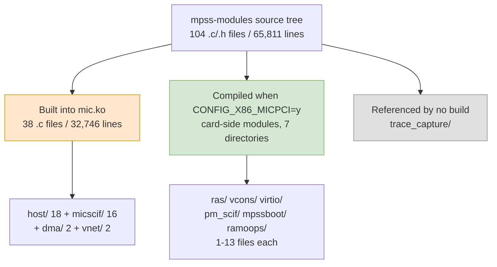

# Appendix B — File Inventory

> This appendix is the ledger behind Chapter 3: it counts the whole tree directory by directory and records how many files and how many lines each directory holds, and **whether the LoongArch port touches it at all**. Every line count given here is measured on the pristine tree at `_work/mpss-modules-3.8.6/`, and the measure is total file lines (blank lines and comments included). Section B.5 explains how to recompute it yourself.

---

## B.1 Directory Tree Overview

`mpss-modules` is a flat Kbuild tree with 104 `.c`/`.h` files and 65,811 lines. (The tree actually holds 124 files: beyond those 104 there are 7 in the root directory — `Kbuild`, `Makefile`, `COPYING`, `mic.conf`, `mic.modules`, `udev-mic.rules`, `.mpss-metadata`, 599 lines — plus the 13 `Kbuild`/`Makefile` files in the subdirectories, 335 lines, making 20 files and 934 lines in all, none of which goes into `mic-objs` or falls inside the porting scope.) The per-directory distribution follows:

| Directory | Files | Lines | Compiled on the host? | This port |
|---|---:|---:|---|---|
| `host/` | 19 | 12,458 | **all 18 `.c`** | **the main battleground** |
| `micscif/` | 17 | 17,104 | 16 (all but `micscif_main.c`) | **the main battleground** |
| `dma/` | 3 | 2,371 | 2 (all but `mic_sbox_md.c`) | **needs changes** |
| `vnet/` | 4 | 2,714 | 2 (all but `micveth.c`, `mic.h`) | essentially untouched |
| `include/` | 36 | 9,775 | headers, compiled on both sides | **needs review** |
| `ras/` | 13 | 16,382 | **no** | not a line touched |
| `trace_capture/` | 5 | 2,797 | **no** (dead code) | not a line touched |
| `vcons/` | 2 | 460 | no | not a line touched |
| `virtio/` | 1 | 862 | no | not a line touched |
| `pm_scif/` | 2 | 487 | no | not a line touched |
| `mpssboot/` | 1 | 238 | no | not a line touched |
| `ramoops/` | 1 | 163 | no | not a line touched |
| root directory | 0 | — | no `.c`/`.h`, only the 7 build files `Kbuild`/`Makefile`/`mic.conf`/`mic.modules`/`udev-mic.rules` and the like (599 lines, counted separately) | `Kbuild` and `Makefile` need a look |
| **Total** | **104** | **65,811** | of which **38 `.c` files build into `mic.ko`** | **32,746 lines in scope** |

Look at the `micscif/` row first: 16 of its 17 files are compiled into the **host** module, so the phrase "host code inside a card-side directory" holds. The same happens with `dma/` (`mic_dma_lib.c` and `mic_dma_md.c` sit under `dma/` yet belong to `mic.ko`). **Judging attribution by directory name alone is guaranteed to go wrong**; the only authority is `mic-objs` in `Kbuild:62`–`:99`.



---

## B.2 The 38 Objects That Go into `mic.ko`

This section is a verbatim transcription of `Kbuild:62`–`:99` plus measured line counts. It is the strict definition of the "porting scope".

| File | Lines | File | Lines |
|---|---:|---|---:|
| `micscif/micscif_api.c` | 3464 | `micscif/micscif_sysfs.c` | 234 |
| `micscif/micscif_nodeqp.c` | 2902 | `host/linpm.c` | 232 |
| `micscif/micscif_rma.c` | 2633 | `host/acptboot.c` | 194 |
| `host/uos_download.c` | 1950 | `micscif/micscif_va_node.c` | 187 |
| `dma/mic_dma_lib.c` | 1792 | `host/ioctl.c` | 186 |
| `micscif/micscif_nm.c` | 1740 | `host/micpsmi.c` | 184 |
| `vnet/micveth_dma.c` | 1642 | `micscif/micscif_intr.c` | 159 |
| `host/pm_pcstate.c` | 1107 | `host/linpsmi.c` | 152 |
| `host/micscif_pm.c` | 1062 | `vnet/micveth_param.c` | 95 |
| `micscif/micscif_debug.c` | 1005 | | |
| `micscif/micscif_rma_dma.c` | 982 | | |
| `host/tools_support.c` | 978 | | |
| `host/vmcore.c` | 821 | | |
| `host/linvnet.c` | 802 | | |
| `host/linux.c` | 796 | | |
| `host/linsysfs.c` | 766 | | |
| `host/vhost/mic_vhost.c` | 697 | | |
| `host/linvcons.c` | 687 | | |
| `host/vhost/mic_blk.c` | 665 | | |
| `host/pm_ioctl.c` | 603 | | |
| `micscif/micscif_rma_list.c` | 533 | | |
| `micscif/micscif_fd.c` | 528 | | |
| `dma/mic_dma_md.c` | 522 | | |
| `micscif/micscif_va_gen.c` | 480 | | |
| `micscif/micscif_smpt.c` | 457 | | |
| `micscif/micscif_select.c` | 446 | | |
| `micscif/micscif_ports.c` | 376 | | |
| `micscif/micscif_rb.c` | 372 | | |
| `host/linscif_host.c` | 315 | | |

**Two things to note.**

1. Subdirectories such as `micscif/`, `dma/` and `vnet/` are **not card-side-only directories**. Each of them holds code for both sides at once, split by the `-D_MIC_SCIF_`/`-DHOST` definitions at `Kbuild:46` and `:49`.
2. `host/vhost/vhost.h` (261 lines) is the only non-`.c` file under `host/`; it is not compiled on its own and is included only by `mic_vhost.c`/`mic_blk.c`.

---

## B.3 Files Never Compiled on the Host (Card Side Plus Dead Code)

None of the files below is compiled **even once** on a LoongArch host, because `obj-$(CONFIG_X86_MICPCI)` at `Kbuild:56`–`:57` is always empty on the host. They are the output of `x86_64-k1om-linux-gcc` and run in the card's K1OM kernel.

| Directory | Files | Lines | What it does |
|---|---:|---:|---|
| `ras/` | 13 | 16,382 | the card's RAS / error logging / machine check / uncore |
| `trace_capture/` | 5 | 2,797 | **dead code**, see B.4 |
| `vcons/` | 2 | 460 | the card's virtual console (`hvc_mic`) |
| `virtio/` | 1 | 862 | the card's virtio block device front end |
| `pm_scif/` | 2 | 487 | card-side SCIF power messages |
| `mpssboot/` | 1 | 238 | the card's boot assist |
| `ramoops/` | 1 | 163 | the card's ramoops |
| `micscif/micscif_main.c` | 1 | 606 | card-side SCIF initialisation |
| `dma/mic_sbox_md.c` | 1 | 57 | card-side SBOX DMA descriptors |
| `vnet/micveth.c`, `vnet/mic.h` | 2 | 977 | the card's virtual NIC itself |
| **Total** | **29** | **23,029** | of which **24** files and **20,232** lines are card-side proper, and **5** files and **2,797** lines are dead code not even compiled on the card |

There is one more detail in the last row: `vnet/micveth.c` and `mic.h` are not in `mic-objs`, so although they sit in a heap of files that **looks** host-side, they are in fact card-side code. `micscif/micscif_main.c` is the same — it lies right next to the host objects.

---

## B.4 Dead Code: `trace_capture/`

`trace_capture/` has 5 files and 2,797 lines and ships its own `trace_capture/Kbuild`, which contains an `obj-m`. But **the root `Kbuild` never references this directory**, and it is not in `mic-objs` either, so it is not even compiled on the card.

It interferes badly with the audit: in the classification statistics of Chapter 5, **118 of the 122 lines hit in the MTRR/PAT category come from here**. Unless it is struck out first, you would conclude that this driver is fiddling with MTRR.

How to handle it: ignore it outright; delete the whole directory if need be.

---

## B.5 How to Re-check This Inventory

Five commands are enough to re-check every number used in the report. The first four run under `_work/mpss-modules-3.8.6/` and the fifth under `_work/` — that one re-checks the user-space archives of Chapter 4, does not belong to the module tree of this appendix, and is here only so that "where did that number in Chapter 4 come from" is also documented.

**First**: extract the list of effective objects.

```powershell
Select-String -Path Kbuild -Pattern '^mic-objs \+= (\S+)$' |
  ForEach-Object { $_.Matches[0].Groups[1].Value }
```

This should print 38 lines, the first being `dma/mic_dma_lib.o` and the last `vnet/micveth_param.o`.

**Second**: count the lines.

```powershell
$objs = Select-String -Path Kbuild -Pattern '^mic-objs \+= (\S+)$' |
  ForEach-Object { $_.Matches[0].Groups[1].Value }
$objs | ForEach-Object { (Get-Content ($_ -replace '\.o$','.c')).Count } |
  Measure-Object -Sum | Select-Object Sum
```

This should give **32,746**. (Counting the non-blank lines of each file instead gives 28,894; both measures are correct, but the report uses total lines throughout.)

**Third**: confirm that `trace_capture/` is dead.

```powershell
Select-String -Path Kbuild -Pattern 'trace_capture'   # no output
Get-Content trace_capture/Kbuild                       # has obj-m, but it is never referenced by the root Kbuild
```

**Fourth**: settle the books for all 104 `.c`/`.h` files in one pass. The first three steps only pin down the host side; this step is the reconciliation for the whole tree's source — the file counts and line counts of the five buckets must add up to exactly the tree's total source (the other 20 files in the tree, the `Kbuild`/`Makefile`/`COPYING` kind, are not on the books).

```powershell
$objs = Select-String -Path Kbuild -Pattern '^mic-objs \+= (\S+)$' |
  ForEach-Object { $_.Matches[0].Groups[1].Value -replace '\.o$','.c' }
$all = Get-ChildItem . -Recurse -File -Include *.c,*.h
$hl = ($objs | ForEach-Object { (Get-Content $_).Count } | Measure-Object -Sum).Sum
$il = (Get-ChildItem include -Recurse -File -Include *.c,*.h | ForEach-Object { (Get-Content $_.FullName).Count } | Measure-Object -Sum).Sum
$dl = (Get-ChildItem trace_capture -Recurse -File -Include *.c,*.h | ForEach-Object { (Get-Content $_.FullName).Count } | Measure-Object -Sum).Sum
$vl = (Get-Content host\vhost\vhost.h).Count
$cl = (($all | ForEach-Object { (Get-Content $_.FullName).Count }) | Measure-Object -Sum).Sum - $hl - $il - $dl - $vl
"host {0} objects, {1} lines" -f $objs.Count, $hl          # 38 / 32746
"card side {0} files, {1} lines" -f 24, $cl                # 24 / 20232
"dead code 5 files, {0} lines" -f $dl                      # 5 / 2797
"shared headers 36 files, {0} lines" -f $il                # 36 / 9775
"host/vhost/vhost.h {0} lines" -f $vl                      # 1 / 261
"whole tree {0} files, {1} lines" -f $all.Count, ($hl + $il + $dl + $vl + $cl)   # 104 / 65811 (whole tree .c/.h, excluding the 20 build and metadata files)
```

This should give **38 / 32,746** (host objects), **24 / 20,232** (card-side proper, derived in the script by subtracting the other four buckets from `$all`), **5 / 2,797** (dead code), **36 / 9,775** (headers shared by both sides) and **1 / 261** (`host/vhost/vhost.h`), together exactly the tree's **104 `.c`/`.h` files and 65,811 lines**, not one more and not one less.

**Fifth**: re-check the line counts of the six user-space source archives of Chapter 4 (change to `_work/` to run it).

```powershell
foreach ($d in 'mpss-daemon-3.8.6','libscif-3.8.6','mpss-micmgmt-3.8.6',
               'mpss-coi-3.8.6','mpss-myo-3.8.6','micperf-3.8.6') {
  $s = 0
  foreach ($f in Get-ChildItem $d -Recurse -File -Include *.c,*.h,*.cpp) {
    $s += [System.IO.File]::ReadAllLines($f.FullName).Count
  }
  "{0,-20} {1,8}" -f $d, $s
}
```

The six lines should read **26,423 / 1,946 / 21,488 / 65,174 / 32,570 / 5,312** in that order, adding up to **152,913 lines**, which matches the total in Chapter 4, Section 4.2. The `-Include` lists only three suffixes here because those are genuinely the only three kinds of source file that appear in the unpacked trees of the six archives.

---

## B.6 Those Few Files in the Root Directory

| File | Lines | Purpose | During the port |
|---|---:|---|---|
| `Kbuild` | 106 | the master switch for everything: card side / host side, `mic-objs`, build-number macros | **must read, must change** |
| `Makefile` | 106 | top-level build and install rules; `MIC_CARD_ARCH` is exported from here | worth one look |
| `mic.conf` | 32 | modprobe parameters, see Chapter 3, 3.5 | parameter values need review |
| `mic.modules` | 5 | module load list | untouched |
| `udev-mic.rules` | 9 | udev rules that create `/dev/mic*` | check the device-number convention |
| `.mpss-metadata` | 2 | version and commit id | untouched |
| `COPYING` | 339 | GPLv2 | untouched |

`Kbuild` and `Makefile` both happen to have 106 lines; that is a coincidence, and the two files have nothing to do with each other. The switches that really matter for the port all live in `Kbuild`, in particular the three `obj-` lines at 56–59 and the `-D` definitions on lines 46 and 49.

---

## B.7 Relation to the 4.18 Community Tree

The report looks at two trees at once:

| Tree | Location | State |
|---|---|---|
| **Tree A (baseline)** | `_work/mpss-modules-3.8.6/` | Intel's original MPSS 3.8.6, which supports only up to around 3.10 |
| **Tree B (reference)** | `mpss-main/mpss-main/mpss3/mpss-modules/` | community-maintained, already carrying the RHEL 8 4.18 patches (66,075 `.c`/`.h` lines in total, 264 lines more than Tree A) |

The two trees' `Kbuild`/`Makefile` are **byte-for-byte identical**; all the differences fall on 23 files: 18 `.c`/`.h` files with 314 lines added and 50 removed (net +264), `udev-mic.rules` with 3 lines added and 2 removed, plus 4 scripts under `network-scripts/` (1,307 lines in total) that Tree B adds, while `mic.conf`/`mic.modules`/`.mpss-metadata` are not touched at all. The whole diff adds 1,624 lines and removes 52 — three years and one distribution's worth of adaptation, of which the additions and deletions that actually land on C code total 364 lines. The difference list is kept in `_work/diff-pristine-vs-latest.diff`.

Tree B's value is that it has already stepped in the 3.10→4.18 potholes. One common misjudgement needs correcting here: the four functions the patches use — `sysfs_get_dirent`, `sysfs_get`, `sysfs_put` and `sysfs_notify_dirent` — **have not been removed from mainline**; 6.x still defines them in `v6.6/include/linux/sysfs.h`, right after `#endif /* CONFIG_SYSFS */`, as unconditional inline wrappers ([`v6.6/include/linux/sysfs.h:638`–`658`]). So those few places in Tree B compile without being changed. Tree B's real value is the other interfaces that genuinely were renamed or had their signatures changed; it can serve as a reference but **not as a baseline**.

---

## B.8 Conclusion of This Appendix

Three sentences:

1. **The porting scope is 38 files and 32,746 lines**; the other 66 files and 33,065 lines need not be touched at all — 24 card-side files with 20,232 lines, 5 dead-code files with 2,797 lines, 36 headers shared by both sides with 9,775 lines, and `host/vhost/vhost.h` with 261 lines, which add up to exactly the tree's 104 `.c`/`.h` files and 65,811 lines (the other 20 build and metadata files in the tree, 934 lines in all, are neither in scope nor on the books).
2. **Directory names do not indicate attribution**: both `micscif/` and `dma/` contain files that are compiled into the host module. The only authority is `mic-objs` in `Kbuild`.
3. **Strike out `trace_capture/` before reading the statistics**, otherwise it nearly doubles the hits and line counts in the MTRR/PAT category.
