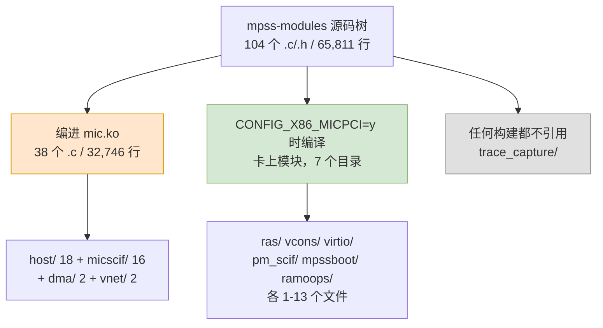

# 附录 B　文件清单

> 　本附录是第三章的底账：把整棵树逐目录点清，标明每个目录有多少文件、多少行、以及**在龙芯移植里到底碰不碰**。凡是本附录给出的行数，都是对 `_work/mpss-modules-3.8.6/` 这棵原始树的实测值，口径是文件总行数（含空行与注释）。第 B.5 节说明怎么自己复算一遍。

---

## B.1　目录树总览

　　`mpss-modules` 是一棵平铺的 Kbuild 树，共 104 个 `.c`/`.h` 文件、65,811 行（整棵树实际有 124 个文件：这 104 个之外，是根目录 7 个——`Kbuild`、`Makefile`、`COPYING`、`mic.conf`、`mic.modules`、`udev-mic.rules`、`.mpss-metadata`，599 行——与各子目录的 13 个 `Kbuild`／`Makefile`，335 行，合计 20 个文件、934 行，既编不进 `mic-objs`，也不在移植射程里）。下面是逐目录的分布：

| 目录 | 文件数 | 行数 | 在主机上编译吗 | 本次移植 |
|---|---:|---:|---|---|
| `host/` | 19 | 12,458 | **全部 18 个 `.c`** | **主战场** |
| `micscif/` | 17 | 17,104 | 16 个（除 `micscif_main.c`） | **主战场** |
| `dma/` | 3 | 2,371 | 2 个（除 `mic_sbox_md.c`） | **要改** |
| `vnet/` | 4 | 2,714 | 2 个（除 `micveth.c`、`mic.h`） | 基本不动 |
| `include/` | 36 | 9,775 | 头文件，随两边编译 | **要审** |
| `ras/` | 13 | 16,382 | **否** | 一行不碰 |
| `trace_capture/` | 5 | 2,797 | **否**（死代码） | 一行不碰 |
| `vcons/` | 2 | 460 | 否 | 一行不碰 |
| `virtio/` | 1 | 862 | 否 | 一行不碰 |
| `pm_scif/` | 2 | 487 | 否 | 一行不碰 |
| `mpssboot/` | 1 | 238 | 否 | 一行不碰 |
| `ramoops/` | 1 | 163 | 否 | 一行不碰 |
| 根目录 | 0 | — | 没有 `.c`／`.h`，只有 `Kbuild`／`Makefile`／`mic.conf`／`mic.modules`／`udev-mic.rules` 等 7 个构建文件（599 行，另计） | `Kbuild`、`Makefile` 要看 |
| **合计** | **104** | **65,811** | 其中 **38 个 `.c` 编成 `mic.ko`** | **32,746 行在射程内** |

　　先看 `micscif/` 这一行：它 17 个文件里有 16 个编进**主机**模块，所以「卡侧目录里的主机代码」这句话是成立的。同类情况还有 `dma/`（`mic_dma_lib.c`、`mic_dma_md.c` 在 `dma/` 目录下，却属于 `mic.ko`）。**只按目录名判断归属一定会搞错**，唯一的依据是 `Kbuild:62`–`:99` 的 `mic-objs`。



---

## B.2　编进 `mic.ko` 的 38 个对象

　　这一节是 `Kbuild:62`–`:99` 的直录，加上实测行数。它是「移植射程」的严格定义。

| 文件 | 行数 | 文件 | 行数 |
|---|---:|---|---:|
| `micscif/micscif_api.c` | 3464 | `micscif/micscif_sysfs.c` | 234 |
| `micscif/micscif_nodeqp.c` | 2902 | `host/linpm.c` | 232 |
| `micscif/micscif_rma.c` | 2633 | `host/acptboot.c` | 194 |
| `host/uos_download.c` | 1950 | `micscif/micscif_va_node.c` | 187 |
| `dma/mic_dma_lib.c` | 1792 | `host/ioctl.c` | 186 |
| `micscif/micscif_nm.c` | 1740 | `host/micpsmi.c` | 184 |
| `vnet/micveth_dma.c` | 1642 | `micscif/micscif_intr.c` | 159 |
| `host/pm_pcstate.c` | 1107 | `host/linpsmi.c` | 152 |
| `host/micscif_pm.c` | 1062 | `vnet/micveth_param.c` | 95 |
| `micscif/micscif_debug.c` | 1005 | | |
| `micscif/micscif_rma_dma.c` | 982 | | |
| `host/tools_support.c` | 978 | | |
| `host/vmcore.c` | 821 | | |
| `host/linvnet.c` | 802 | | |
| `host/linux.c` | 796 | | |
| `host/linsysfs.c` | 766 | | |
| `host/vhost/mic_vhost.c` | 697 | | |
| `host/linvcons.c` | 687 | | |
| `host/vhost/mic_blk.c` | 665 | | |
| `host/pm_ioctl.c` | 603 | | |
| `micscif/micscif_rma_list.c` | 533 | | |
| `micscif/micscif_fd.c` | 528 | | |
| `dma/mic_dma_md.c` | 522 | | |
| `micscif/micscif_va_gen.c` | 480 | | |
| `micscif/micscif_smpt.c` | 457 | | |
| `micscif/micscif_select.c` | 446 | | |
| `micscif/micscif_ports.c` | 376 | | |
| `micscif/micscif_rb.c` | 372 | | |
| `host/linscif_host.c` | 315 | | |

　　**两点提醒。**

1. `micscif/` 与 `dma/`、`vnet/` 这些子目录**不是卡侧专用目录**。它们每个都同时含两边的代码，靠 `Kbuild:46` 与 `:49` 的 `-D_MIC_SCIF_`／`-DHOST` 分流。
2. `host/vhost/vhost.h`（261 行）是 `host/` 下唯一的非 `.c` 文件，它不单独编译，只被 `mic_vhost.c`／`mic_blk.c` 包含。

---

## B.3　主机上恒不编译的文件（卡侧加死代码）

　　下面这些文件在龙芯主机上**一次都不会被编译**，因为 `Kbuild:56`–`57` 的 `obj-$(CONFIG_X86_MICPCI)` 在主机上恒为空。它们是 `x86_64-k1om-linux-gcc` 的产物，跑在卡的 K1OM 内核里。

| 目录 | 文件数 | 行数 | 干什么 |
|---|---:|---:|---|
| `ras/` | 13 | 16,382 | 卡的 RAS／错误日志／机器检查／uncore |
| `trace_capture/` | 5 | 2,797 | **死代码**，见 B.4 |
| `vcons/` | 2 | 460 | 卡的虚拟控制台（`hvc_mic`） |
| `virtio/` | 1 | 862 | 卡的 virtio 块设备前端 |
| `pm_scif/` | 2 | 487 | 卡侧 SCIF 电源消息 |
| `mpssboot/` | 1 | 238 | 卡的引导辅助 |
| `ramoops/` | 1 | 163 | 卡的 ramoops |
| `micscif/micscif_main.c` | 1 | 606 | 卡侧 SCIF 初始化 |
| `dma/mic_sbox_md.c` | 1 | 57 | 卡侧 SBOX DMA 描述符 |
| `vnet/micveth.c`、`vnet/mic.h` | 2 | 977 | 卡侧虚拟网卡本体 |
| **合计** | **29** | **23,029** | 其中 **24** 个文件、**20,232** 行是卡侧本体，**5** 个文件、**2,797** 行是连卡上都不编的死代码 |

　　最后一行还有一个细节：`vnet/micveth.c` 与 `mic.h` 不在 `mic-objs` 里，所以虽然它们待在**看似**主机侧的文件堆中，实际是卡侧代码。同理 `micscif/micscif_main.c` 就躺在主机对象旁边。

---

## B.4　死代码：`trace_capture/`

　　`trace_capture/` 有 5 个文件、2,797 行，自带一个 `trace_capture/Kbuild`，里面有 `obj-m`。但**根 `Kbuild` 从不引用这个目录**，它也不在 `mic-objs` 里，所以它连卡上都不编译。

　　它对审计的干扰极大：第五章的分类统计里，**MTRR／PAT 一类命中的 118/122 行出自这里**。如果不先把它划掉，会误以为这套驱动在折腾 MTRR。

　　处理办法：直接不看。必要时整目录删除。

---

## B.5　怎么复核这份清单

　　五条命令即可复核全书用到的全部数字。前四条在 `_work/mpss-modules-3.8.6/` 下执行，第五条在 `_work/` 下执行 —— 那一条复核的是第四章的用户态归档，不属于本附录的模块树，放这里只是为了让「第四章那个数从哪来」也有据可查。

　　**第一条**：取出生效的对象清单。

```powershell
Select-String -Path Kbuild -Pattern '^mic-objs \+= (\S+)$' |
  ForEach-Object { $_.Matches[0].Groups[1].Value }
```

　　应当输出 38 行，第一行是 `dma/mic_dma_lib.o`，最后一行是 `vnet/micveth_param.o`。

　　**第二条**：数出行数。

```powershell
$objs = Select-String -Path Kbuild -Pattern '^mic-objs \+= (\S+)$' |
  ForEach-Object { $_.Matches[0].Groups[1].Value }
$objs | ForEach-Object { (Get-Content ($_ -replace '\.o$','.c')).Count } |
  Measure-Object -Sum | Select-Object Sum
```

　　应当得到 **32,746**。（如果把每个文件里非空行数一遍，是 28,894 行；两种口径都对，但全报告统一用总行数。）

　　**第三条**：确认 `trace_capture/` 是死的。

```powershell
Select-String -Path Kbuild -Pattern 'trace_capture'   # 无输出
Get-Content trace_capture/Kbuild                       # 有 obj-m，但它没被根 Kbuild 引用
```

　　**第四条**：把 104 个 `.c`／`.h` 文件一次分完账。前三步只钉住主机侧，这一步才是全树源码的对账单 —— 五个分项的文件数与行数各自加起来，必须正好等于整棵树的源码总量（树里另外 20 个 `Kbuild`／`Makefile`／`COPYING` 一类文件不在账上）。

```powershell
$objs = Select-String -Path Kbuild -Pattern '^mic-objs \+= (\S+)$' |
  ForEach-Object { $_.Matches[0].Groups[1].Value -replace '\.o$','.c' }
$all = Get-ChildItem . -Recurse -File -Include *.c,*.h
$hl = ($objs | ForEach-Object { (Get-Content $_).Count } | Measure-Object -Sum).Sum
$il = (Get-ChildItem include -Recurse -File -Include *.c,*.h | ForEach-Object { (Get-Content $_.FullName).Count } | Measure-Object -Sum).Sum
$dl = (Get-ChildItem trace_capture -Recurse -File -Include *.c,*.h | ForEach-Object { (Get-Content $_.FullName).Count } | Measure-Object -Sum).Sum
$vl = (Get-Content host\vhost\vhost.h).Count
$cl = (($all | ForEach-Object { (Get-Content $_.FullName).Count }) | Measure-Object -Sum).Sum - $hl - $il - $dl - $vl
"主机 {0} 个对象 {1} 行" -f $objs.Count, $hl              # 38 / 32746
"卡侧 {0} 个文件 {1} 行" -f 24, $cl                        # 24 / 20232
"死代码 5 个文件 {0} 行" -f $dl                            # 5 / 2797
"共享头 36 个文件 {0} 行" -f $il                           # 36 / 9775
"host/vhost/vhost.h {0} 行" -f $vl                         # 1 / 261
"全树 {0} 个文件 {1} 行" -f $all.Count, ($hl + $il + $dl + $vl + $cl)   # 104 / 65811（全树 .c/.h，不含 20 个构建与元数据文件）
```

　　应当得到 **38／32,746**（主机对象）、**24／20,232**（卡侧本体，脚本里用 `$all` 减掉其余四项倒推）、**5／2,797**（死代码）、**36／9,775**（两头共享的头文件）、**1／261**（`host/vhost/vhost.h`），合计正是整棵树的 **104 个 `.c`／`.h`、65,811 行**，不多一个也不少一个。

　　**第五条**：复核第四章那六个用户态源码归档的行数（改到 `_work/` 下执行）。

```powershell
foreach ($d in 'mpss-daemon-3.8.6','libscif-3.8.6','mpss-micmgmt-3.8.6',
               'mpss-coi-3.8.6','mpss-myo-3.8.6','micperf-3.8.6') {
  $s = 0
  foreach ($f in Get-ChildItem $d -Recurse -File -Include *.c,*.h,*.cpp) {
    $s += [System.IO.File]::ReadAllLines($f.FullName).Count
  }
  "{0,-20} {1,8}" -f $d, $s
}
```

　　六行依次应当是 **26,423／1,946／21,488／65,174／32,570／5,312**，相加得到 **152,913 行**，与第四章 4.2 节的合计数一致。这里的 `-Include` 只有三个后缀，因为六个归档的解包树里确实只出现这三种源码文件。

---

## B.6　根目录的那几个文件

| 文件 | 行数 | 作用 | 移植时 |
|---|---:|---|---|
| `Kbuild` | 106 | 一切的开关：卡侧／主机侧、`mic-objs`、构建号宏 | **必读、必改** |
| `Makefile` | 106 | 顶层构建与安装规则，`MIC_CARD_ARCH` 由此导出 | 看一眼即可 |
| `mic.conf` | 32 | modprobe 参数，见第三章 3.5 | 要审参数值 |
| `mic.modules` | 5 | 模块加载清单 | 不动 |
| `udev-mic.rules` | 9 | 建 `/dev/mic*` 的 udev 规则 | 要看设备号约定 |
| `.mpss-metadata` | 2 | 版本与提交号 | 不动 |
| `COPYING` | 339 | GPLv2 | 不动 |

　　`Kbuild` 与 `Makefile` 的行数都是 106，这是巧合，两者内容毫无关系。真正的移植开关全在 `Kbuild` 里，特别是第 56–59 行那三条 `obj-`，以及第 46／49 两行的 `-D` 定义。

---

## B.7　与 4.18 社区树的关系

　　报告同时看两棵树：

| 树 | 位置 | 状态 |
|---|---|---|
| **甲树（基准）** | `_work/mpss-modules-3.8.6/` | Intel 原版 MPSS 3.8.6，只支持到 3.10 附近 |
| **乙树（参照）** | `mpss-main/mpss-main/mpss3/mpss-modules/` | 社区维护，已打 RHEL 8 4.18 补丁（`.c`／`.h` 合计 66,075 行，比甲树多 264 行） |

　　两树的 `Kbuild`／`Makefile` **逐字节相同**；全部差异落在 23 个文件上：18 个 `.c`／`.h` 增 314 行、删 50 行（净 +264），`udev-mic.rules` 增 3 行、删 2 行，另有 `network-scripts/` 下 4 个脚本（共 1,307 行）是乙树新加的，`mic.conf`／`mic.modules`／`.mpss-metadata` 一字未动。整份 diff 合计增 1,624 行、删 52 行 —— 三年、一个发行版的适配，真正落在 C 代码上的增删一共 364 行。差异清单保存在 `_work/diff-pristine-vs-latest.diff`。

　　乙树的价值在于它已经踩过 3.10→4.18 的坑。这里要纠正一个常见误判：补丁里用到的 `sysfs_get_dirent`、`sysfs_get`、`sysfs_put`、`sysfs_notify_dirent` 四个函数**并没有被主线删掉**——6.x 仍然把它们定义在 `v6.6/include/linux/sysfs.h` 里，位置就在 `#endif /* CONFIG_SYSFS */` 之后，属于无条件的内联包装（[`v6.6/include/linux/sysfs.h:638`–`658`]）。所以乙树里这几处不改也能编过。乙树的真正价值是其余那些确实被改名或改签名的接口，它可以当参考，**不能当基线**。

---

## B.8　本附录的结论

　　三句话：

1. **移植射程是 38 个文件、32,746 行**，其余 66 个文件、33,065 行一行都不用碰 —— 其中 24 个卡侧文件 20,232 行、5 个死代码文件 2,797 行、36 个两头共享的头文件 9,775 行、`host/vhost/vhost.h` 261 行，四项相加正好是整棵树的 104 个 `.c`／`.h`、65,811 行（树里另外 20 个构建与元数据文件共 934 行，不在射程也不在账上）。
2. **目录名不指示归属**，`micscif/` 与 `dma/` 里都有编进主机模块的文件。唯一的依据是 `Kbuild` 的 `mic-objs`。
3. **`trace_capture/` 先删掉再看统计**，否则 MTRR／PAT 一类的命中和行数会被它污染近一倍。
