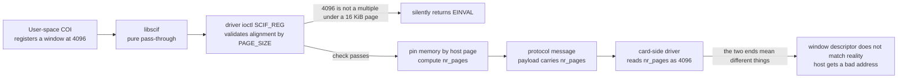
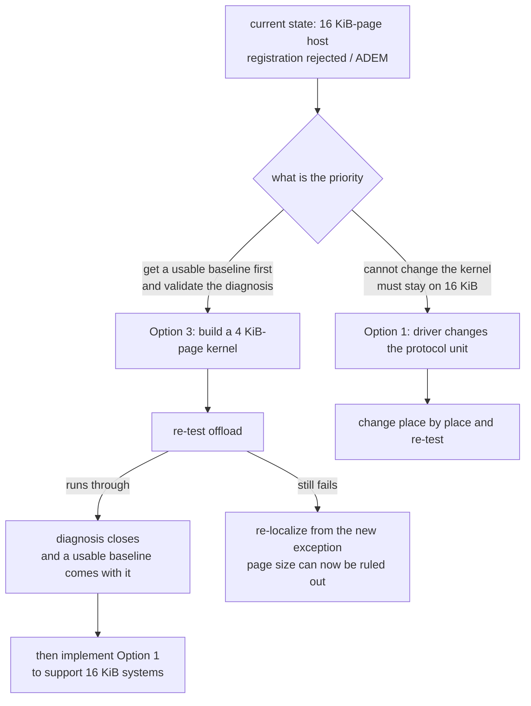
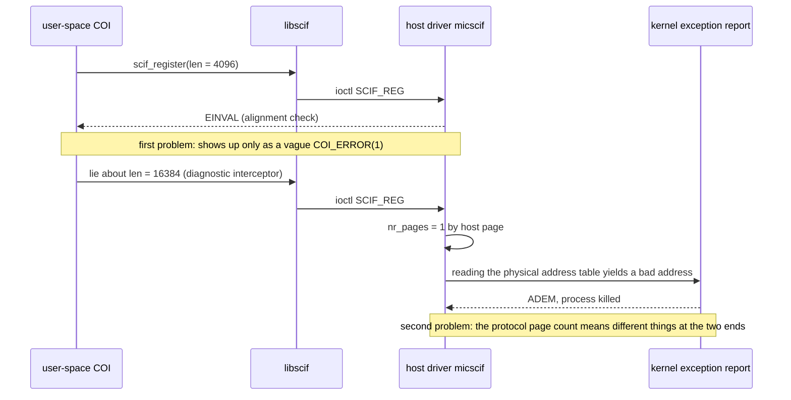
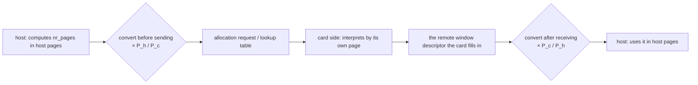

# Appendix I — Page-Size Alignment: an Investigation Record You Can Re-read

This appendix gathers the symptom, the mechanism, the dependency surface and the available fixes for "16 KiB host pages vs. the 4 KiB MPSS assumes" into a record that can be read on its own. The goal is that whoever comes next can judge the nature of the problem, and jump straight to a fix, without retracing the path "strace all the way to a kernel exception report".

## I.1 Summary of Conclusions

When the host kernel page is 16 KiB, MPSS's SCIF goes wrong in two places, one after the other:

1. **The driver's alignment check** rejects outright the memory registrations user space submits in 4096-byte units, and all the outside world sees is a vague `COI_ERROR(1)`;
2. **The protocol's "page" means different things at the two ends** — this trap only appears once the first check has been bypassed, and it shows up as the kernel address error `ADEM`.

Both come from one and the same design assumption: **MPSS takes the "host page" as its protocol unit**. On x86 both the host and the card side are 4 KiB, so it never shows; on a 16 KiB-page LoongArch machine it shows everywhere.

## I.2 Symptom and Criteria: Two Kinds of Exception, Two Address Shapes

The most useful lesson from this troubleshooting is: **look at the exception type and the shape of the faulting address**, and you can tell at once whether the problem is "struct layout" or "inconsistent units".

### I.2.1 Alignment Exception (ALE) — a Struct-Layout Problem

```text
Unhandled kernel unaligned access[#1]:
  ERA: _raw_spin_lock_irqsave+0x44/0xf0
  BADV: 90000001c7fd8096
  Call Trace: _raw_spin_lock_irqsave → prepare_to_wait_event → micscif_prep_remote_window [mic]
```

Subtract the object base from the faulting address:

$$
\text{BADV} - \text{base} = 0x90000001c7fd8096 - 0x90000001c7fd8000 = 0x96 = 150 \equiv 2 \pmod 4
$$

The base is a page-aligned, legitimate block of memory, and the offset 150 happens to be a **compile-time offset** of a struct member (the packed disassembly hard-codes `addi.d $t0, $s7, 150`). A compile-time offset is independent of the runtime page size, so this class is a **genuine struct-layout defect**: `struct reg_range_t` is marked `__attribute__ ((packed))`, and the wait queue inside it (which contains a spinlock) lands at an address that is not 4-byte aligned. x86 tolerates unaligned locks; the LoongArch kernel kills the process outright.

### I.2.2 Address Error (ADEM) — an Inconsistent-Units Problem

```text
ESTAT: 00480000 [ADEM] (IS= ECode=8 EsubCode=1)
  ERA: micscif_prep_remote_window+0x198
  BADV: e0000e4800000000
  Code: … <380c3b7e> …          ← ldx.d  $s7, $s4, $t2
```

`0xe000…` falls in LoongArch's physical/non-cached window, and the instruction is fetching an entry from a "physical address table". The bad address here is **not** some member offset but **the content of the table itself computed wrong** — a unit-conversion problem.

### I.2.3 How to Tell Them Apart

Telling the two classes apart comes down to one sentence:

$$
\text{If } \text{BADV} - \text{base} \text{ is a compile-time constant offset} \Rightarrow \text{layout defect} \qquad \text{If } \text{BADV} \text{ falls in the physical/non-cached window} \Rightarrow \text{unit conversion error}
$$

## I.3 Dependency Survey, Layer by Layer

### I.3.1 User Space: COI Hard-Codes 4096

The COI ported to LoongArch keeps Intel's constants intact:

| Location | Contents |
|---|---|
| `_MemoryRegion.h:71` | `#define PAGE_SIZE (4096)` |
| `_Message.h:76` | `#define COI_PAGE_SIZE 4096` |

The first is used for memory registration and alignment, the second for message framing. They have different purposes, and when modifying **only the first may be touched**.

### I.3.2 libscif: a Pure Pass-Through

`libscif` contains no page-size constant at all; `scif_register` simply fills the length, offset, protection bits and flags the caller gave it into the ioctl struct, unchanged. That means a fix does not have to touch this layer.

### I.3.3 Host Driver: `PAGE_SIZE` Is Everywhere

In the host driver's SCIF implementation, page size shows up in four kinds of place: alignment checks, page-count conversions, offset conversions and DMA mapping:

| Purpose | Location |
|---|---|
| Alignment checks | `micscif_api.c:1940`, `2251`, `2526`, `2662` |
| Page-count conversions | `micscif_api.c:1946`, `2255`, `2558`, `2566`, `2674` |
| Offset conversions | `micscif_rma.h:44`, `733`, `757` |
| DMA mapping | `micscif_map.h:201`, `206`, `211` |
| Memory-mapping path | `micscif_api.c:2887`, `2941` |

### I.3.4 Host DMA and SMPT: Fixed Constants, Unaffected

This layer uses fixed constants that have nothing to do with page size:

$$
\text{MIC\_SYSTEM\_PAGE\_SHIFT} = 34 \qquad \text{MIC\_SYSTEM\_PAGE\_SIZE} = 2^{34} = 16\ \text{GiB}
$$

The sources are `micscif_smpt.h:79` and `micbaseaddressdefine.h:103`. This is good news: **only `micscif`'s bookkeeping has to change**; the DMA descriptor layer need not be touched.

### I.3.5 Card Side: the Same Source, a Different Page Size

The MPSS kernel module is **one tree building both ends**, and `Kbuild` decides between host and card from `MIC_CARD_ARCH` (empty means card). The host and card SCIF are therefore the same source, differing only in `PAGE_SIZE` at compile time: 16384 on the host, 4096 on the card.

## I.4 Mechanism: Why Sharing One Source Makes Things Worse

The data flow on the registration path is as follows.



The core contradiction can be written in one line. Let the registration length be $L$, the host page $P_h = 2^{14}$, and the card page $P_c = 2^{12}$:

$$
N_h = \left\lfloor \frac{L}{P_h} \right\rfloor \qquad N_c = \left\lfloor \frac{L}{P_c} \right\rfloor = 4N_h
$$

The protocol carries a single page-count field, and each end interprets it by its own page. If $L = P_h$, the host considers this "one page" while the card considers it "four pages"; if $L = 4096$, the host cannot even get past the check (because $4096 \bmod 16384 \neq 0$).

The same expression explains another easily overlooked clue: at `micscif_rma.c:557`, the length is derived back with

$$
\text{length} = \texttt{num\_pages}[j] \ll \text{PAGE\_SHIFT}
$$

and what is hard-coded there is again the host page shift. Anywhere this "shift instead of multiply" style appears, the units have to be checked one by one.

## I.5 List of Conversion Points on the Registration Path

The table below collects the places where "which unit to use" has to be decided, as a reference when making the change. In the table, "protocol" means a quantity that crosses to the card side, and "host" means a quantity used only inside the host.

| Location | Expression | Unit to use |
|---|---|---|
| `micscif_api.c:2526` | alignment check `align_low(addr, PAGE_SIZE)` | either protocol (4 KiB) or relaxed to "an integer multiple of the host page" |
| `micscif_api.c:2566` | `window->nr_pages = len >> PAGE_SHIFT` | protocol |
| `micscif_api.c:2558` | `micscif_create_window(ep, len >> PAGE_SHIFT, …)` | protocol |
| `micscif_api.c:2579` | `scif_pin_pages(addr, len, …)` | host (must be rounded up to a host page first) |
| `micscif_rma.h:708` | `window->num_pages[j] = RMA_GET_NR_PAGES(...)` | protocol |
| `micscif_rma.h:717` | physical addresses expanded by `k << PAGE_SHIFT` | protocol |
| `micscif_rma.h:733` | `page_nr = (off - window->offset) >> PAGE_SHIFT` | protocol |
| `micscif_rma.c:557` | `num_pages[j] << PAGE_SHIFT` to derive the length back | protocol |
| `micscif_map.h:201` | `dma_map_page(..., PAGE_SIZE, ...)` | host |

## I.6 Five Fixes and Their Trade-offs

### I.6.1 Option One: Change the Host Driver to "4 KiB Protocol, Host Pages for pinning"

The approach: switch the quantities marked "protocol" in the table to fixed 4 KiB units, while host-side memory management (pinning, page-frame allocation, DMA mapping) stays in host pages. Rounding the length up to a host page before `scif_pin_pages` is a mandatory part of this option.

- Scope: about ten to fifteen mechanical changes, all inside `micscif`.
- Card side and user space: **zero changes**. The card side already speaks 4 KiB, and so does user space.
- Risk: medium. Many points, but each has a clear unit to compare against and can be verified one at a time.

### I.6.2 Option Two: Register by Host Page in User Space, Change Only the Protocol Boundary in the Driver

The approach: replace `PAGE_SIZE` in `_MemoryRegion.h` with a runtime query (`sysconf(_SC_PAGESIZE)`), so that the registration length is a host-page multiple by construction and the driver's alignment check need not be relaxed; the driver still has to convert protocol quantities to 4 KiB.

- Scope: one constant in user space, four to six places in the driver.
- Risk: low to medium, but it touches COI's own buffer-offset assumptions and needs extra verification.
- Note: `COI_PAGE_SIZE` in `_Message.h` is for message framing and must not be changed along with it.

### I.6.3 Option Three: Switch to a 4 KiB-Page Host Kernel

The approach: build a kernel with a 4 KiB page size (LoongArch supports 4/16/64 KiB pages), and not one line of MPSS code changes.

- Benefit: it makes **all** 4 KiB assumptions hold at once. Not just the registration path, but also the as-yet-untouched memory-mapping path (`vm_pgoff << PAGE_SHIFT` at `micscif_api.c:2887`, `2941`) and the read/write chunking (`MAX_PAGE_ORDER + PAGE_SHIFT` at `1646`, `1711` of the same file).
- Cost: about an hour to build and switch kernels, and the module has to be rebuilt once against the new kernel.
- Risk: concentrated in building and booting the kernel; the rest of the chain is untouched.

### I.6.4 Options Four and Five (Not Taken)

- **Change the card side to 16 KiB protocol units**: requires rebuilding the card kernel and image and changing the wire protocol, while the card's own pages are still 4 KiB — the cost is out of proportion to the benefit.
- **Bypass SCIF memory registration**: COI's first registration is a 4096-byte signal page, and once it fails the whole path is dead; there is no room to go around it.

### I.6.5 Comparison Table

| Option | Scope | Card rebuild needed | Kernel rebuild needed | Risk | Residual 4 KiB assumptions |
|---|---|---|---|---|---|
| 1 driver changes the protocol unit | about 10 to 15 places in `micscif` | No | No | Medium | only the mapping and chunking paths |
| 2 user space by host page + driver changes the boundary | 1 place in user space + 4 to 6 in the driver | No | No | Low to medium | as above |
| 3 4 KiB-page kernel | no code change | No | Yes | Low | all gone |
| 4 card side changes unit | card kernel and image | Yes | Yes | High | still limited by the card's 4 KiB |
| 5 bypass registration | —— | —— | —— | —— | not viable |

## I.7 Recommended Order of Progress

The criterion is not "which is more thorough" but **which is more likely to converge**: Option 3's path holds no unknowns, whereas with Option 1 and no working baseline, every iteration has to choose between "a newly introduced fault" and "not finished converting yet".



## I.8 Reproduction and Checks

The commands used for the minimal reproduction and for checking it are below; scripts for all of them are left under `~/XeonPhiX100-LoongArch/`.

```bash
# power up and turn off the deep power states (to avoid unrelated variables)
sudo bash ~/XeonPhiX100-LoongArch/off_92_bringup.sh

# a single offload test (with the diagnostic interceptor; for localization only, not part of the release)
sudo bash ~/XeonPhiX100-LoongArch/off_93_run.sh

# turn on driver dynamic debug, then collect the log
echo "module mic +p" > /sys/kernel/debug/dynamic_debug/control
dmesg | grep -E 'SCIFAPI|unaligned|ESTAT|BADV|ERA:'
```

Criteria:

| Observation | Meaning |
|---|---|
| `scif_register err -22` while the driver log shows legal arguments | Hits the first problem in I.1; deal with it by Option 1 or Option 3 |
| `unaligned` count not zero | A packed-struct problem remains; check offsets with the criteria in I.2.1 |
| `ESTAT: … [ADEM]` and `BADV` falls in `0xe000…` | Hits the unit-conversion problem; see the list in I.5 |

## I.9 The Troubleshooting Chain, Revisited



One last reminder: the "lying about the length" in I.2.2 and I.9 is only a **diagnostic** used to get past the first check and force the second problem out into the open; it is not itself a fix. The actual change should be one of the routes in I.6.

## I.10 Can Option One Be Generalized? A Place-by-Place Review

Option One as given in I.6.1 is "4 KiB for the protocol, host pages for pinning". This section answers a more important question: **can the code avoid hard-coding 4 KiB and instead hold for any host page size (4/16/64 KiB)**. The answer is yes, and the change is smaller than first estimated — but two symmetric conversions that had not been written down before have to be added.

### I.10.1 Only Two Kinds of Quantity Cross to the Peer, and Both Are Page Counts

Going function by function, there are only two kinds of "page-size-related quantity" actually passed between the host and the card, and both are **page counts**, not byte addresses:

| How it is passed | Location | Contents |
|---|---|---|
| Allocation request message | `micscif_rma.c:1039` | `msg.payload[1] = window->nr_pages` |
| High bits of a lookup-table entry | `micscif_rma.h:627` | `RMA_SET_NR_PAGES` encodes each segment's page count into the top 12 bits of the address |

The second says something in particular: **the protocol has always supported "a segment of N pages"** — an entry is a base address plus a page count, and there is even a `SCIF_HUGE_PAGE_SHIFT` (21, i.e. 2 MiB huge pages) mechanism using it. That is to say, what has been missing all along is not expressive power but only a **statement of units**.

### I.10.2 The Card Side Really Does Interpret by Its Own Page

On the card, allocation requests are handled by `scif_alloc_req` at `micscif_nodeqp.c:1395`, which computes the window length as:

$$
\text{length} = \text{nr\_pages} \ll \text{PAGE\_SHIFT}
$$

The `PAGE_SHIFT` here is **the card's own** (12, i.e. 4 KiB). What the host sends out, however, is a page count computed in host pages, so the same string of digits means different things at the two ends. This explains the `ADEM` of H.9.4 and also gives the shape of the fix: **convert by $P_h / P_c$ on the way out, and convert back by $P_c / P_h$ on the way in**.

### I.10.3 Every Other Layer Is Unaffected

| Layer | Why it is unaffected |
|---|---|
| Byte addresses (`dma_addr`/`phys_addr`) | byte-granular to begin with, independent of page size |
| Window offsets | each end converts by its local `PAGE_SHIFT` (`micscif_map.h:44`, `micscif_rma.h:733`); self-consistent as long as the offset space stays host-page aligned |
| SMPT/aperture | `micscif_smpt.c:56-62` uses host-page alignment macros, and the 16 GiB `MIC_SYSTEM_PAGE_SIZE` is only the entry granularity; the aperture is byte-addressable and transparent to a 16 KiB host page |
| `mic_map` | maps one host page at a time (`micscif_map.h:206`); the aperture interior is byte-based, so no change |
| Semantics visible to user space | the offset returned by registration is still host-page aligned (the driver validates at `micscif_api.c:2251`, `2535`), unchanged |

### I.10.4 Two Symmetric Conversions Missed Earlier

Only by looking at "sending" and "receiving" separately does it become clear that the conversions have to come **in pairs**:



- **Sending side**: the page count at `micscif_rma.c:1039`, and the per-segment page count written into the lookup table;
- **Receiving side**: when the host reads the card's window descriptor back through `scif_ioremap` (the two tables inside `micscif_prep_remote_window`), the page counts in those tables are filled in by **the card in its own pages** and have to be converted back. The original text of I.6.1 did not cover this half; it was added in this round of troubleshooting.

### I.10.5 The Limits of the Generality

| Item | Verdict |
|---|---|
| Any host page size | Holds. The conversion factor is $P_h / P_c$, both powers of two, so in practice it is a shift |
| A peer with the same page size (the x86 case) | The factor is 1 and **behavior is completely unchanged**, equivalent to an empty patch — which matters a lot for staying in step with upstream |
| Where the peer page size comes from | The card is fixed at 4 KiB and can be a platform constant; pushing the generality to other peers would need a field in the node handshake. **The handshake message currently has no version or capability field** (only `uop`, `src` and four `payload`s), so a slot would have to be taken for it |
| The per-segment page-count ceiling | The entry's high bits are 12 bits wide, at most 4095 pages. On a 16 KiB host one 2 MiB huge page folds into 512 peer pages, still in range; if a contiguous segment larger than 16 MiB ever appears, the conversion has to split the entry |
| The huge-page mechanism | Compatible with the conversion. `micscif_is_huge_page` decides on a 2 MiB page using the local `PAGE_SHIFT`, and the conversion only scales the page count of one "segment" by the factor |

### I.10.6 Conclusion

Option One **can be generalized**, and it is more focused than I.6.1 described:

1. What has to change is **two boundaries, two directions**, four conversions in all, plus a pair of helper functions (one for sending, one for receiving);
2. Inside the host, "host page" semantics stay exactly as they are — **do not** replace `PAGE_SHIFT` globally, or offset alignment and mmap semantics break;
3. The peer page size starts as a platform constant (4 KiB for KNC), and with a factor of 1 it degenerates to the original behavior automatically, so the impact on x86 hosts is zero;
4. The only thing that has to be confirmed by measurement during implementation is the receiving side of I.10.4: which unit the page counts in the card's window descriptor are actually filled in. One registration plus one read-back is enough to settle it.

## I.11 Implementation and Verification Record

This section records the actual changes made once Option One landed, the solution for each of the three crash signatures, and the conclusion about the path that comes from **byte-by-byte verification on the card side**. Every number comes from the run logs, not from inference.

### I.11.1 Change List (Host Side, Zero Card-Side Changes)

| Location | Change | Purpose |
|---|---|---|
| `micscif_rma.h` | new protocol-page unit macros: `SCIF_PROTO_PAGE_SIZE` (4096), `SCIF_PEER_PAGE_FACTOR`, `HOST_PAGES_TO_PEER` | separate the "protocol unit" from the "host page" |
| `micscif_api.c` (`__scif_pin_pages`, `__scif_register`) | validate the length by **protocol page**, then round up to a host page internally; print the scene when rejecting | let 4 KiB-granular registrations through |
| `micscif_api.c` | create the window by the rounded-up host page count, with `window->nr_pages` consistent with it | bookkeeping matches the number of pages actually pinned |
| `micscif_rma.c` (allocation request) | `msg.payload[1] = HOST_PAGES_TO_PEER(window->nr_pages)` | convert to peer pages before sending |
| `micscif_rma.h`, `micscif_nodeqp.h` | `struct reg_range_t` stays `packed`; the **four wait queues** in it become "pointer + equal-length padding" (`allocwq`, `regwq`, `unregwq`, `gttmapwq`) | byte-for-byte identical to the card-side layout, yet no spinlock at an unaligned address |
| `micscif_rma.c`, `micscif_nodeqp.c` | four initializations become separate allocations, waiting and waking go through the pointers, and the destructors free them | supporting changes |

### I.11.2 Three Crash Signatures and Their Solutions

| Signature (measured) | Root cause | Solution |
|---|---|---|
| `ALE`, `ERA: _raw_spin_lock_irqsave+0x44`, window base + **150** | a wait queue inside a `packed` struct puts the spinlock at an unaligned address, and the LoongArch kernel cannot emulate unaligned atomic access | turn the four wait queues into pointers (equal-length padding keeps the layout unchanged) |
| `ADEM`, `ERA: micscif_prep_remote_window+0x198`, bad address of the form `0x…0e4800000000` | the host dropped `packed` while the card still has it, so field offsets disagree between the ends and what is read is a different field | **restore `packed`** (byte-for-byte identical to the card's Intel module) |
| `scif_register` returns `EINVAL` with length `0x1000` | host page 16 KiB, while MPSS takes 4 KiB as the protocol unit | validate the length by protocol page + convert on the sending side |

The second one is especially worth remembering: **wherever a struct is exchanged between the two ends, a layout change has to be made on both ends together**. Dropping `packed` on the host alone shows up immediately as "the fields read back are garbage", and because the address shape is fixed it is easy to misdiagnose as a data-type problem.

### I.11.3 Measured Evidence: the RMA Write Path Is Byte-Exact

A minimal test that does not go through COI (card-side `rma_srv`, host-side `rma_cli`) verified the host-to-card bulk write:

```text
CLI: scif_writeto(loffset=0x4000000000000000, len=4096, roffset=0x4000000000000000) -> 0 OK
SRV: 缓冲区前 64 字节：
  [  0] a5 a6 a7 a8 a9 aa ab ac ad ae af b0 b1 b2 b3 b4
  [ 16] b5 b6 b7 b8 b9 ba bb bc bd be bf c0 c1 c2 c3 c4
SRV: 校验结果：4096 字节中不符 0 个 -> 宿主写入完全正确
kernel: unaligned 0   exceptions 0
```

The kernel log from the same run gives direct evidence that the conversion took effect:

```text
MIC scif GNT: uop=21 payload0=0xffff8803d5e83000 payload1=0x3d5e83000 payload2=… payload3=0xe
MIC scif prep: 唤醒后 state=3 vaddr=0xffff8803d5e83000 phys_addr=0x3d5e83000 nr_pages=4
MIC scif prep: ioremap(phys=0x3d5e83000) -> 80000e4bd5e83000
MIC scif prep: magic=0x5c1f000000005c1f dma_lookup.offset=0x3d5f5b000 nr_lookup=1
```

Three criteria hold at once: `magic` equals `SCIFEP_MAGIC` (layouts agree), `nr_pages = 4` (1 host 16 KiB page converts to 4 peer pages), and the card buffer's contents are **byte-for-byte identical** to the written pattern. That settles it: **the page-size and struct-layout defects are both closed**, and the "per-segment page count" that I.10.4 worried about caused no error on this path.

### I.11.4 The Item That Was Unresolved at the Time: COI Process Creation (Now Resolved)

With the driver layer closed, `COIProcessCreateFromFile` still blocked: the host received a normal reply to engine enumeration, then wrote out a 26,496-byte creation command (`SCIFAPI writeto: … len 0x6780`) and polled from then on, while the card-side `coi_daemon` stayed idle and never spawned a child process, with zero exceptions on the kernel side. On that basis the judgment at the time was "this block can only come from COI itself (command semantics or authentication/user mapping), so it belongs to the application layer".

**That judgment later proved wrong**: the causes of the block all fall back within the reach of this appendix and the porting patches, and three are known — ① **moving the creation command**: the 26496-byte creation command was computed with the wrong page stride on the RMA copy path, so only the first page was correct (another manifestation of the "host page = protocol page" assumption); ② **the peer window length**: the window length was still computed in host pages, not converted by protocol page; ③ **the card-side sink missing `-rdynamic`**: the exported symbol was not in `.dynsym`, so the card-side `dlsym` could not obtain the function handle. With all three fixed, COI ran end to end; the measured numbers are in H.13 of [Appendix H](H-offload-field-notes.md) and in [Appendix J](J-acceptance-tests.md).

### I.11.5 Troubleshooting Notes to Keep

| Lesson | Explanation |
|---|---|
| A reboot does not mean the scene is lost | The previous boot's kernel text can be retrieved with `journalctl -k -b -1`, crash report and registers included |
| Do not trust `ps` on the card | BusyBox's `ps` lists only the current terminal's processes by default, which makes you conclude wrongly that "the process does not exist". Enumerating `/proc/[0-9]*/cmdline` is the reliable way |
| The card's rootfs is a memory filesystem | It is wiped on every power-up, so a program that has to run on the card must be **re-delivered every time**, or baked into the image |
| Check the documentation before concluding | The error table in `scif.h` states outright that `ENOTCONN` is an unconnected endpoint and `EINVAL` is a NULL `peer` or `newepd` — far faster than guessing |
| Build scripts must guard against "false success" | Delete the old artifacts before compiling, otherwise a failed compile is masked by the previous run's output |

---

## I.12 The second batch of defects: a page count scaled twice, and chunk spans measured in the wrong page size

Section I.11 covered the first round (protocol-page validation, struct layout, the RMA stride). Once T8 (the 4 GiB bulk-transfer test) went in, **two new defects** in the same family surfaced. Both reduce to one sentence: **a single page count interpreted with two different page sizes.**

### I.12.1 Defect one: the host's own window had its page count scaled twice

`micscif_map_window_pages()` packed the page count of **every** window into `dma_addr[]` in peer units:

```c
RMA_SET_NR_PAGES(window->dma_addr[j], HOST_PAGES_TO_PEER(nr_pages));   /* host pages x 4 */
```

But the reader, `micscif_set_nr_pages()` in `micscif_rma.h`, converts PEER to LOCAL only for `RMA_WINDOW_PEER`; a host window (`RMA_WINDOW_SELF`) is taken as it stands. So the `num_pages[]` of the host's own windows came out **four times the true value** — the two views of the same window disagree outright:

```text
MIC scif MAP: chunk 0 has num_pages[0]=1        <- the real count while mapping
MIC scif WND: chunk 0 packed num_pages=4        <- read back as 4 (= 1 x 4)
```

The consequences form a five-step chain:

1. `micscif_destroy_window()` unmaps `num_pages[j] << PAGE_SHIFT` — **four times the pages that were mapped**;
2. `mic_unmap` trips over `mic_smpt[i].ref_count < 0` (a WARNING, roughly ten seconds after T4 finished, in the temp-window sweep);
3. eleven seconds later `micscif_get_dma_addr` cannot find the window offset and hits `kernel BUG at micscif_rma.h:829` (an Oops);
4. with the bookkeeping broken, a window unregistration never receives the peer's answer: `micscif_unregister_window()` times out in `wait_event_timeout` and executes `goto retry`, **retrying forever as long as the peer is alive** (`NODE_ALIVE_TIMEOUT` is 15 seconds, which is exactly the 192-byte nodemsg DMA seen every 15 seconds in dmesg);
5. the process therefore sits in `D` state where `kill -9` does nothing, and `rmmod mic` fails with "module is in use" — **only a reboot clears it**.

**The fix**: keep the local array in host pages and let the wire conversion apply only to **the copy written to the peer** (`micscif_prep_remote_window()` packs with `HOST_PAGES_TO_PEER` as it fills the ioremapped copy). The change is in `patches/micscif_rma.c`.

### I.12.2 Defect two: chunk spans measured with the host page size, while peer page counts were divided

`micscif_get_dma_addr()` has two branches, and **only the second one can BUG**:

| Window geometry | Branch | Page size used |
|---|---|---|
| `nr_pages == nr_contig_chunks` (one page per chunk; T4's 256 KiB window is 16 pages / 16 chunks) | branch 1 | correct: 4 KiB for peer windows, 16 KiB for the host's own |
| pages ≠ chunks (T8's 1 MiB card window = **256 pages / 156 chunks**) | branch 2 | ✗ always `<< PAGE_SHIFT` (host 16 KiB) |

On top of that, `micscif_set_nr_pages()` divided peer page counts by four to turn them into host pages. A card chunk of the very common "one page = 4 KiB" shape became **0** after that division, so its span was computed as **zero bytes**, the range test `off >= start && off < end` could never succeed, and after scanning all 156 chunks the code fell through to `BUG_ON(1)`.

### I.12.3 Why T4 kept looking fine

Every window T4 used had one page per chunk, so it took **branch 1**, and branch 1 does distinguish the two page sizes correctly (its comment even says "peer windows: wire units, 4 KiB"). **Two branches in one file disagreed about the page size**; the patch fixed branch 1 and left branch 2 as the gap. That also explains why T4 passed 15/0 every time: its criteria never reached the broken path.

### I.12.4 The fix and the verification

**The fix**: keep page counts in the unit the description used (host pages for the host's own windows, 4 KiB for peer windows) and compute chunk spans with the page size of the side that owns the window **in both branches**; additionally print the window geometry and the first eight chunk spans before the `BUG`, so a unit error is visible at a glance next time. The change is in `patches/micscif_rma.h`.

**Verification** (real hardware: Loongson 3A6000 plus a Xeon Phi 7120P):

| Criterion | Result |
|---|---|
| 30 seconds after T4, dmesg free of `ref_count < 0` / `kernel BUG` / `Oops` | **0 lines** ✓ (it was guaranteed to appear before the fix) |
| T8 full transfers at 64 MiB / 256 MiB / 4 GiB | `sent == total` ✓ |
| Checksums on both sides | identical bit for bit at all three sizes; 4 GiB = `0x76ac888ab487e57b` ✓ |
| 4 GiB wire-side / end-to-end bandwidth | **325.9 / 98.8 MB/s** ✓ |
| Kernel exceptions / wedged processes | 0 / none ✓ |

### I.12.5 A methodological note: half a fix is more dangerous than none

Both defects come from "one concept, interpreted in two places". The first patch fixed only the **reader** (`micscif_set_nr_pages` no longer converting SELF windows) while the writer still multiplied by four, so the error simply survived in the other direction; and branch 1 was fixed while branch 2 was not, so the passing tests happened to take the correct branch. **With this class of unit problem you have to enumerate every appearance of the concept and check them one by one**, not just repair the crash in front of you.

### I.12.6 A third constraint: the chunk table transfers only one page (512 entries)

**The conclusion this section originally carried has been disproved; the process is kept here together with the measured verdict.**

The first observation was that the last 15 chunks of a 32 MiB card window read back as zero, and the explanation offered at the time was that the wire "pages per chunk" field is only twelve bits wide (`& 0xFFF` inside `RMA_SET_NR_PAGES`, a 4095-page ceiling) and truncates beyond that. **That explanation was wrong**: the only place the driver builds the chunk table, `micscif_detect_large_page()` in `micscif_rma.h`, makes a normal page its own chunk and lets a huge page run to the next 2 MiB boundary, so a chunk holds at most **512 pages** with 4 KiB pages — eight times below 4095. **The twelve-bit field is never reached.**

The real cause was settled by reading the raw values **before** the page counts are stripped (`RAW-SCAN` / `RAW-HEAD` / `RAW-TAIL`):

```text
RAW-SCAN:      type=2 nr_pages=8192 chunks=527 raw_sum=8177 raw_zeros=15
RAW-HEAD[0]:   raw=0x100003bc830000  pages=1  addr=0x3bc830000   /* high 12 bits = 1: packed */
RAW-TAIL[511]: raw=0x100003ba820000  pages=1  addr=0x3ba820000
RAW-TAIL[512]: raw=0x0               pages=0  addr=0x0           /* raw value is zero from here on */
```

**The card never wrote entries 512 to 526 at all** (had it merely failed to pack them, the raw value would be a bare physical address with a zero page count; it is `0x0`, meaning the entry was never written). And **512 is exactly `NR_PHYS_ADDR_IN_PAGE` on the card**, whose pages are 4 KiB — in other words, the chunk-table transfer completed only its first page. The card currently runs an **unpatched upstream module** (its binary contains none of the port's probes), and the host cannot reconstruct entries that were never sent.

The chunk count also depends on layout: a 32 MiB card window is **527 chunks** (512 single-page ones plus 15 of 2 MiB), not 8192 — so **the criterion is the chunk count, not the byte size.**

**Two responses.** First, the host validates the description at the DMA boundary (the entries of `micscif_rma_list_dma_copy_wrapper` and `..._copy_aligned`) through `micscif_window_desc_valid()` and returns `-EINVAL` when it is incomplete, so user-space `scif_writeto` fails normally — measured, the same bad input went from "`BUG_ON`, process in `D` state, reboot required" to "a failure with a complete picture, machine still usable" (a T8 64 MiB run immediately afterwards was still 12/12). Second, `scif_register` keeps the twelve-bit guard as defence in depth (a chunk above 4095 pages is refused outright), but it is **not** the cause of this problem.

How to write against this from user space is in [Appendix K](K-offload-memory-rules.md): **keep a window at or below 512 chunks, and prefer windows of 1 MiB or less.**
### I.12.7 Do not panic on an incomplete window description from the peer

The 12-bit constraint of I.12.6 has a **cross-side** consequence: the card runs the **unpatched upstream module** (measured: `card-modules/micscif.ko` contains zero of the port's probe strings and its sources carry upstream timestamps), so it has no guard when packing its own window description. A 32 MiB card window therefore arrives with **a number of trailing chunks whose page count is zero**; the host's read-back loop stops early and the tail of the window simply does not exist as far as the host is concerned — a write near the end is then guaranteed to fail its lookup.

**Measured evidence** (always-on host probes, 32 MiB window, 256 MiB transfer):

```text
MIC scif DESC-INCONSISTENT: type=2 nr_pages=8192 nr_contig_chunks=527
    loop_stopped_at=512 ... zero-count chunks=15
chunk spans total=33492992 bytes; window should hold 33554432 bytes
    difference 61440 = 15 x 4096   <- the last 15 chunks (60 KiB) are missing, matching the 15 zero-count chunks
```

The host's correct response is **not** to panic: `micscif_get_dma_addr()` began with `BUG_ON(1)` in host builds, which turned `RMA_ERROR_CODE` — an error path that already existed and is **checked in ten places in `micscif_rma_dma.c`** — into dead code. After the panic a window unregistration never receives its answer, the process lands in `D` state, and only a reboot helps (exactly the wedge this round kept hitting).

**The handling**: drop that `BUG_ON(1)` and, after printing the full scene, `return RMA_ERROR_CODE`. The caller propagates the error and the user-space `scif_writeto` fails — **the same input now yields "a failure with a complete picture" instead of "kernel panic, wedge, reboot required"**. This keeps the "no card-side change" conclusion intact: the host detects and refuses an incomplete description rather than being dragged down by it.
