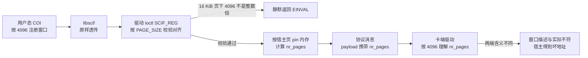
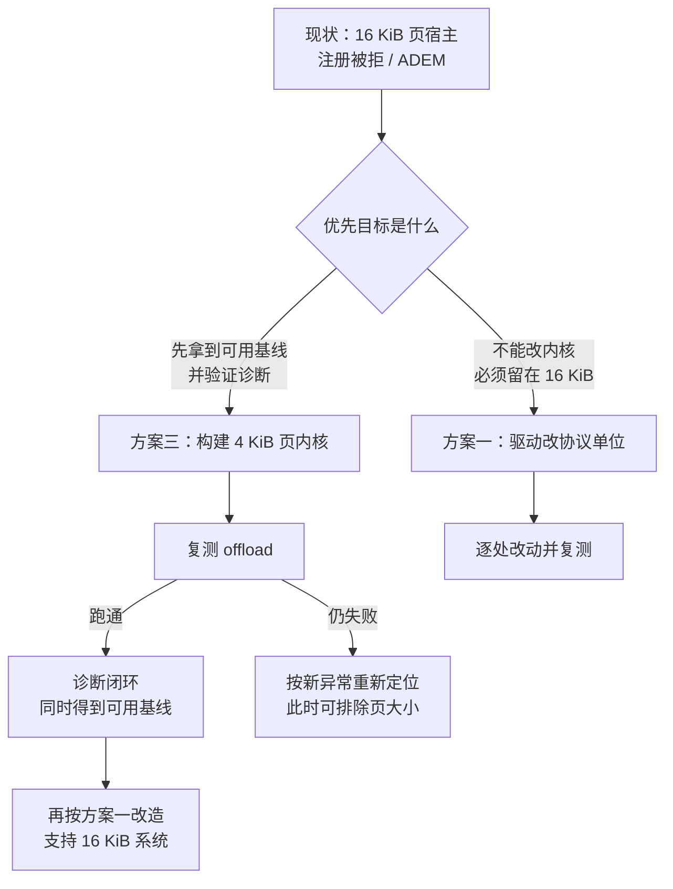
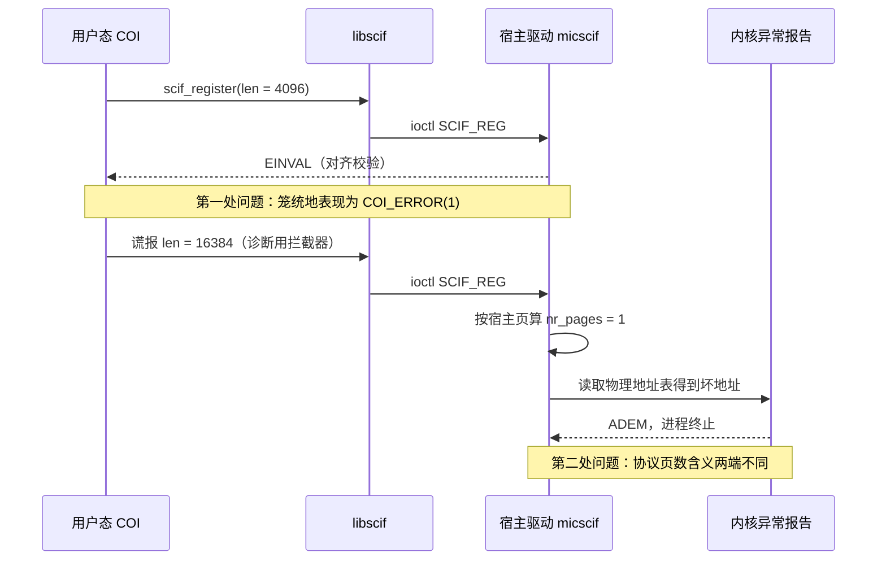

# 附录 I　页大小对齐：一份可复读的调查记录

　　本附录把「宿主页 16 KiB 与 MPSS 假定的 4 KiB」这一问题的现象、机理、依赖面与可选修法整理成一份能独立阅读的记录。目标是让后来者不必重走「strace 一路查到内核异常报告」的那条路，就能判断问题性质，并直接跳到修改方案。

## I.1　结论摘要

　　宿主内核页为 16 KiB 时，MPSS 的 SCIF 会在两处先后出问题：

1. **驱动的对齐校验**直接拒绝用户态按 4096 字节提交的内存注册，对外只表现为一个笼统的 `COI_ERROR(1)`；
2. **协议里的「页」在两端含义不同** —— 这个坑在绕过第一处校验之后才暴露，表现为内核地址错误 `ADEM`。

　　两处都源自同一个设计假设：**MPSS 把「宿主页」当成了协议单位**。在 x86 上宿主与卡端都是 4 KiB，所以从不暴露；在 16 KiB 页的龙芯上则处处暴露。

## I.2　现象与判据：两种异常，两种地址形态

　　排查中最有用的一条经验是：**看异常类型与出错地址的形态**，就能立刻分清是「结构体布局」问题还是「单位不一致」问题。

### I.2.1　对齐异常（ALE）—— 结构体布局问题

```text
Unhandled kernel unaligned access[#1]:
  ERA: _raw_spin_lock_irqsave+0x44/0xf0
  BADV: 90000001c7fd8096
  Call Trace: _raw_spin_lock_irqsave → prepare_to_wait_event → micscif_prep_remote_window [mic]
```

　　把出错地址与对象基址相减：

$$
\text{BADV} - \text{base} = 0x90000001c7fd8096 - 0x90000001c7fd8000 = 0x96 = 150 \equiv 2 \pmod 4
$$

　　基址是页对齐的合法内存块，偏移 150 又恰好是结构体成员的**编译期偏移**（packed 版反汇编里就是硬编码的 `addi.d $t0, $s7, 150`）。编译期偏移与运行期页大小无关，因此这一类是**真实的结构体布局缺陷**：`struct reg_range_t` 被标了 `__attribute__ ((packed))`，其中的等待队列（内含自旋锁）落在非 4 字节对齐的地址上。x86 容忍非对齐锁，LoongArch 内核态直接终止进程。

### I.2.2　地址错误（ADEM）—— 单位不一致问题

```text
ESTAT: 00480000 [ADEM] (IS= ECode=8 EsubCode=1)
  ERA: micscif_prep_remote_window+0x198
  BADV: e0000e4800000000
  Code: … <380c3b7e> …          ← ldx.d  $s7, $s4, $t2
```

　　`0xe000…` 落在 LoongArch 的物理／非缓存窗口，而指令是从一张「物理地址表」里取项。这里的坏地址**不是**某个成员偏移，而是**表里的内容本身算错了** —— 属于单位换算问题。

### I.2.3　判别法

　　两类问题的判别可以归纳成一句话：

$$
\text{若 } \text{BADV} - \text{base} \text{ 是编译期常量偏移} \Rightarrow \text{布局缺陷} \qquad \text{若 } \text{BADV} \text{ 落在物理／非缓存窗口} \Rightarrow \text{单位换算错误}
$$

## I.3　依赖面调查（逐层）

### I.3.1　用户态：COI 把 4096 写死

　　移植到龙芯的 COI 完整保留了 Intel 的常量：

| 位置 | 内容 |
|---|---|
| `_MemoryRegion.h:71` | `#define PAGE_SIZE (4096)` |
| `_Message.h:76` | `#define COI_PAGE_SIZE 4096` |

　　前者用于内存注册与对齐，后者用于报文分帧。二者的用途不同，修改时**只能动前者**。

### I.3.2　libscif：纯透传

　　`libscif` 不含任何页大小常量，`scif_register` 只把调用方给的长度、偏移、保护位、标志原样填进 ioctl 结构体。这意味着修法不必碰这一层。

### I.3.3　宿主驱动：`PAGE_SIZE` 无处不在

　　宿主驱动的 SCIF 实现里，页大小出现在对齐校验、页数换算、偏移换算与 DMA 映射四类地方：

| 用途 | 位置 |
|---|---|
| 对齐校验 | `micscif_api.c:1940`、`2251`、`2526`、`2662` |
| 页数换算 | `micscif_api.c:1946`、`2255`、`2558`、`2566`、`2674` |
| 偏移换算 | `micscif_rma.h:44`、`733`、`757` |
| DMA 映射 | `micscif_map.h:201`、`206`、`211` |
| 内存映射路径 | `micscif_api.c:2887`、`2941` |

### I.3.4　宿主 DMA 与 SMPT：固定常量，不受影响

　　这一层用的是与页大小无关的固定常量：

$$
\text{MIC\_SYSTEM\_PAGE\_SHIFT} = 34 \qquad \text{MIC\_SYSTEM\_PAGE\_SIZE} = 2^{34} = 16\ \text{GiB}
$$

　　来源是 `micscif_smpt.h:79` 与 `micbaseaddressdefine.h:103`。这是好消息：**要改的只有 `micscif` 的记账部分**，DMA 描述符层不必动。

### I.3.5　卡端：同一份源码，另一种页大小

　　MPSS 的内核模块**一棵树编两端**，`Kbuild` 依据 `MIC_CARD_ARCH` 决定编宿主还是卡端（空值＝卡端）。因此宿主与卡端的 SCIF 是同一份源码，只是编译时 `PAGE_SIZE` 不同：宿主 16384，卡端 4096。

## I.4　机理：两端同源为何反而会出事

　　注册路径上的数据流如下。



　　核心矛盾可以用一行式子写清。设注册长度为 $L$，宿主页为 $P_h = 2^{14}$，卡端页为 $P_c = 2^{12}$：

$$
N_h = \left\lfloor \frac{L}{P_h} \right\rfloor \qquad N_c = \left\lfloor \frac{L}{P_c} \right\rfloor = 4N_h
$$

　　协议里只传一个页数字段，两端各自按自己的页解释。若 $L = P_h$，宿主认为这是「一页」而卡端认为这是「四页」；若 $L = 4096$，宿主连校验都过不去（因为 $4096 \bmod 16384 \neq 0$）。

　　同一个式子还解释了另一条容易被忽略的线索：`micscif_rma.c:557` 处用

$$
\text{长度} = \texttt{num\_pages}[j] \ll \text{PAGE\_SHIFT}
$$

　　反算长度，写死的也是宿主页移位。凡是这类「以移位代替乘法」的写法，都必须逐一核对单位。

## I.5　注册路径上的换算点清单

　　下表把需要判断「用哪种单位」的位置集中列出，作为修改时的对照表。表中「协议」指跨到卡端的量，「宿主」指只在宿主内部使用的量。

| 位置 | 表达式 | 应取单位 |
|---|---|---|
| `micscif_api.c:2526` | 对齐校验 `align_low(addr, PAGE_SIZE)` | 协议（4 KiB）或放宽为「宿主页整数倍」两种取法之一 |
| `micscif_api.c:2566` | `window->nr_pages = len >> PAGE_SHIFT` | 协议 |
| `micscif_api.c:2558` | `micscif_create_window(ep, len >> PAGE_SHIFT, …)` | 协议 |
| `micscif_api.c:2579` | `scif_pin_pages(addr, len, …)` | 宿主（需先向上取整到宿主页） |
| `micscif_rma.h:708` | `window->num_pages[j] = RMA_GET_NR_PAGES(...)` | 协议 |
| `micscif_rma.h:717` | 物理地址按 `k << PAGE_SHIFT` 展开 | 协议 |
| `micscif_rma.h:733` | `page_nr = (off - window->offset) >> PAGE_SHIFT` | 协议 |
| `micscif_rma.c:557` | `num_pages[j] << PAGE_SHIFT` 反算长度 | 协议 |
| `micscif_map.h:201` | `dma_map_page(..., PAGE_SIZE, ...)` | 宿主 |

## I.6　五种修法与取舍

### I.6.1　方案一：宿主驱动改为「协议 4 KiB、pin 用宿主页」

　　做法：把表中标为「协议」的量改用固定 4 KiB 单位，宿主侧的内存管理（pin、页框分配、DMA 映射）仍按宿主页。`scif_pin_pages` 之前先把长度向上取整到宿主页，是这一方案的必备动作。

- 规模：约十到十五处机械改动，全部集中在 `micscif` 之内。
- 卡端与用户态：**零改动**。卡端本来就以 4 KiB 说话，用户态也以 4 KiB 说话。
- 风险：中等。点虽多，但每处都有明确的单位对照，可逐处验证。

### I.6.2　方案二：用户态按宿主页注册，驱动只改协议边界

　　做法：把 `_MemoryRegion.h` 的 `PAGE_SIZE` 换成运行期查询（`sysconf(_SC_PAGESIZE)`），使注册长度天然是宿主页的整数倍，从而不必放宽驱动的对齐校验；驱动侧仍需把协议量折算成 4 KiB。

- 规模：用户态一处常量，驱动四到六处。
- 风险：中低，但会动到 COI 自己的缓冲区偏移假设，需要额外验证。
- 注意：`_Message.h` 的 `COI_PAGE_SIZE` 是报文分帧用的，不能一起改。

### I.6.3　方案三：改用 4 KiB 页的宿主内核

　　做法：构建一个页大小为 4 KiB 的内核（LoongArch 支持 4／16／64 KiB 三种页），MPSS 代码一行不改。

- 好处：一次性让**所有** 4 KiB 假设成立。不只是注册路径，还有尚未触及的内存映射路径（`micscif_api.c:2887`、`2941` 的 `vm_pgoff << PAGE_SHIFT`）与读写分块（同文件 `1646`、`1711` 的 `MAX_PAGE_ORDER + PAGE_SHIFT`）。
- 代价：构建与切换内核约一小时，模块需按新内核重编一次。
- 风险：集中在内核构建与启动，链条其余部分不动。

### I.6.4　方案四与方案五（不取）

- **把卡端改成 16 KiB 协议单位**：需要重编卡端内核与镜像，改动线协议，而卡端自身页仍是 4 KiB，收益与代价不成比例。
- **绕开 SCIF 内存注册**：COI 的第一个注册是 4096 字节的信号页，它失败之后整条通路就断了，没有绕开的余地。

### I.6.5　对照表

| 方案 | 改动面 | 需要重编卡端 | 需要重建内核 | 风险 | 是否留下 4 KiB 假设 |
|---|---|---|---|---|---|
| 一　驱动改协议单位 | `micscif` 约十到十五处 | 否 | 否 | 中 | 仅剩映射与分块路径 |
| 二　用户态按宿主页 + 驱动改边界 | 用户态一处 + 驱动四到六处 | 否 | 否 | 中低 | 同上 |
| 三　4 KiB 页内核 | 无代码改动 | 否 | 是 | 低 | 全部消除 |
| 四　卡端改单位 | 卡端内核与镜像 | 是 | 是 | 高 | 仍受卡端 4 KiB 限制 |
| 五　绕开注册 | —— | —— | —— | —— | 不可行 |

## I.7　建议的推进顺序

　　判断依据不是「哪个更彻底」，而是**哪个更容易收敛**：方案三路径上没有未知数，而方案一在没有可用基线时，每一轮迭代都要在「新引入的故障」与「尚未改完」之间做判断。



## I.8　复现与核查

　　最小复现与核查用到的命令如下，均在 `~/XeonPhiX100-LoongArch/` 下留有脚本。

```bash
# 上电并关闭深度省电态（避免无关变量）
sudo bash ~/XeonPhiX100-LoongArch/off_92_bringup.sh

# 单次 offload 测试（带诊断用拦截器，仅用于定位，不属于发布内容）
sudo bash ~/XeonPhiX100-LoongArch/off_93_run.sh

# 打开驱动动态调试后取日志
echo "module mic +p" > /sys/kernel/debug/dynamic_debug/control
dmesg | grep -E 'SCIFAPI|unaligned|ESTAT|BADV|ERA:'
```

　　判据：

| 观察 | 含义 |
|---|---|
| `scif_register err -22` 且驱动日志显示入参合法 | 命中 I.1 的第一处问题，按方案一或三处理 |
| `unaligned` 计数不为零 | 仍有 packed 结构问题，按 I.2.1 的判别法核对偏移 |
| `ESTAT: … [ADEM]` 且 `BADV` 落在 `0xe000…` | 命中单位换算问题，见 I.5 清单 |

## I.9　排查链条回顾



　　最后提醒一句：本附录 I.2.2 与 I.9 里的「谎报长度」只是为了越过第一处校验、把第二处问题逼出来的**诊断手段**，它本身不是修法。正式修改应当落在 I.6 的任一条路线上。

## I.10　方案一能否通用化：逐处排查

　　I.6.1 给出的方案一是「协议用 4 KiB、pin 用宿主页」。这一节回答一个更要紧的问题：**能否不写死 4 KiB，而是让同一份代码在任何宿主页大小（4／16／64 KiB）下都成立**。结论是能，而且改动比原先估计的更小 —— 但要加两处此前没写到的对称换算。

### I.10.1　跨到对端的量只有两类，且都是页数

　　逐个函数查过去，宿主与卡端之间真正传递的「页大小相关量」只有两类，都是**页数**而非字节地址：

| 传递方式 | 位置 | 内容 |
|---|---|---|
| 分配请求消息 | `micscif_rma.c:1039` | `msg.payload[1] = window->nr_pages` |
| 查找表条目高位 | `micscif_rma.h:627` | `RMA_SET_NR_PAGES` 把每段页数编进地址的最高 12 位 |

　　第二类尤其说明问题：**协议本来就支持「一段 N 页」** —— 条目由「基址 + 页数」组成，另有 `SCIF_HUGE_PAGE_SHIFT`（21，即 2 MiB 巨型页）机制在用它。也就是说，缺的从来不是表达能力，而只是**单位说明**。

### I.10.2　卡端确实按自己的页解释

　　卡端处理分配请求的是 `micscif_nodeqp.c:1395` 的 `scif_alloc_req`，它算窗口长度用的是：

$$
\text{长度} = \text{nr\_pages} \ll \text{PAGE\_SHIFT}
$$

　　这里的 `PAGE_SHIFT` 是**卡端自己的**（12，即 4 KiB）。宿主送出的却是按宿主页算出的页数，于是同一串数字在两端含义不同。这解释了 H.9.4 的 `ADEM`，也给出了修法的形状：**送出前按 $P_h / P_c$ 换算，收进后按 $P_c / P_h$ 换回来**。

### I.10.3　其余各层都不受影响

| 层 | 为什么不受影响 |
|---|---|
| 字节地址（`dma_addr`／`phys_addr`） | 本来就是字节粒度，与页大小无关 |
| 窗口偏移 | 各端按本地 `PAGE_SHIFT` 换算（`micscif_map.h:44`、`micscif_rma.h:733`），只要偏移空间仍是宿主页对齐就自洽 |
| SMPT／孔径 | `micscif_smpt.c:56-62` 用的是宿主页对齐宏，16 GiB 的 `MIC_SYSTEM_PAGE_SIZE` 只是条目粒度；孔径按字节可寻址，16 KiB 宿主页对它透明 |
| `mic_map` | 一次映射一个宿主页（`micscif_map.h:206`），孔径内部按字节，无须改动 |
| 用户态可见语义 | 注册返回的偏移仍是宿主页对齐（驱动在 `micscif_api.c:2251`、`2535` 校验），保持不变 |

### I.10.4　两处此前遗漏的对称换算

　　把「送出」与「收进」分开看，才发现换算必须**成对**：


- **送出侧**：`micscif_rma.c:1039` 的页数，以及写进查找表的每段页数；
- **收进侧**：宿主通过 `scif_ioremap` 读回卡端窗口描述（`micscif_prep_remote_window` 里那两张表）时，表里的页数是**卡端按自己的页**填的，必须换算回来。I.6.1 原文没写这一半，是这次排查补上的。

### I.10.5　通用性的边界

| 事项 | 判断 |
|---|---|
| 任意宿主页大小 | 成立。换算因子是 $P_h / P_c$，两者都是 2 的幂，实现上就是移位 |
| 与页大小相同的对端（x86 情形） | 因子为 1，**行为完全不变**，等于打了空补丁 —— 这一点对保持与上游一致很重要 |
| 对端页大小从哪来 | 卡端固定 4 KiB，可作平台常量；要把通用性推到别的对端，得在节点握手里加字段。**目前握手消息里没有版本或能力字段**（只有 `uop`、`src` 与四个 `payload`），需要时得新占一个槽位 |
| 每段页数的上限 | 条目高位是 12 位，最多 4095 页。16 KiB 宿主下一个 2 MiB 巨型页折成 512 个对端页，仍在范围内；若将来出现大于 16 MiB 的连续段，换算时要拆条目 |
| 巨型页机制 | 与换算相容。`micscif_is_huge_page` 用本地 `PAGE_SHIFT` 判定 2 MiB 页，换算只是把「一段」的页数按因子放大 |

### I.10.6　结论

　　方案一**可以通用化**，而且比 I.6.1 描述的更聚焦：

1. 需要动的是**两个边界、两个方向**，共四处换算，另加一对辅助函数（送出／收进各一个）；
2. 宿主内部一律维持「宿主页」语义不变，**不要**把 `PAGE_SHIFT` 全局替换，否则会破坏偏移对齐与 mmap 语义；
3. 对端页大小先取平台常量（KNC 为 4 KiB），因子为 1 时自动退化为原行为，因此对 x86 宿主零影响；
4. 唯一需要在实现时实测确认的是 I.10.4 的收进侧：卡端窗口描述里的页数究竟按哪种单位填。这一点用一次注册加一次读回就能验证。

## I.11　实作与验证记录

　　这一节记录方案一落地后的实际改动、三次崩溃签名各自的解法，以及**由卡端逐字节校验**得到的通路结论。所有数字都来自运行日志，不是推断。

### I.11.1　改动清单（宿主侧，卡端零改动）

| 位置 | 改动 | 目的 |
|---|---|---|
| `micscif_rma.h` | 新增协议页单位宏：`SCIF_PROTO_PAGE_SIZE`（4096）、`SCIF_PEER_PAGE_FACTOR`、`HOST_PAGES_TO_PEER` | 把「协议单位」与「宿主页」分开 |
| `micscif_api.c`（`__scif_pin_pages`、`__scif_register`） | 长度按**协议页**校验，内部再向上取整到宿主页；拒绝时打印现场 | 让 4 KiB 粒度的注册得以通过 |
| `micscif_api.c` | 窗口按取整后的宿主页数创建，`window->nr_pages` 与之一致 | 记账与真正 pin 的页数一致 |
| `micscif_rma.c`（分配请求） | `msg.payload[1] = HOST_PAGES_TO_PEER(window->nr_pages)` | 送出前换算成对端页 |
| `micscif_rma.h`、`micscif_nodeqp.h` | `struct reg_range_t` 保持 `packed`；其中**四个等待队列**改为「指针 + 等长填充」（`allocwq`、`regwq`、`unregwq`、`gttmapwq`） | 既与卡端布局逐字节一致，又不让自旋锁落在非对齐地址 |
| `micscif_rma.c`、`micscif_nodeqp.c` | 四处初始化改为独立分配，等待与唤醒走指针；销毁处释放 | 配套改动 |

### I.11.2　三次崩溃签名与各自的解法

| 签名（实测） | 根因 | 解法 |
|---|---|---|
| `ALE`，`ERA: _raw_spin_lock_irqsave+0x44`，窗口基址 + **150** | `packed` 结构里的等待队列把自旋锁放到非对齐地址，LoongArch 内核态无法模拟非对齐原子访问 | 四个等待队列指针化（等长填充保持布局不变） |
| `ADEM`，`ERA: micscif_prep_remote_window+0x198`，坏地址形如 `0x…0e4800000000` | 宿主去了 `packed`、卡端仍是 `packed`，两端字段偏移不一致，读到的是别的字段 | **恢复 `packed`**（与卡端 Intel 模块逐字节一致） |
| `scif_register` 返回 `EINVAL`，长度为 `0x1000` | 宿主页 16 KiB，而 MPSS 把 4 KiB 当成协议单位 | 长度按协议页校验 + 送出侧换算 |

　　第二条尤其值得记住：**凡涉及两端交换的结构体，布局改动必须两端同步**。宿主单方面去掉 `packed` 会立刻表现为「读回的字段是垃圾」，而且地址形态固定，容易被误判成数据类型问题。

### I.11.3　实测证据：RMA 写通路逐字节正确

　　用一个不经过 COI 的最小测试（卡端 `rma_srv`、宿主 `rma_cli`）验证宿主到卡的批量写：

```text
CLI: scif_writeto(loffset=0x4000000000000000, len=4096, roffset=0x4000000000000000) -> 0 OK
SRV: 缓冲区前 64 字节：
  [  0] a5 a6 a7 a8 a9 aa ab ac ad ae af b0 b1 b2 b3 b4
  [ 16] b5 b6 b7 b8 b9 ba bb bc bd be bf c0 c1 c2 c3 c4
SRV: 校验结果：4096 字节中不符 0 个 -> 宿主写入完全正确
内核：unaligned 0   异常 0
```

　　同一次运行的内核日志给出换算生效的直接证据：

```text
MIC scif GNT: uop=21 payload0=0xffff8803d5e83000 payload1=0x3d5e83000 payload2=… payload3=0xe
MIC scif prep: 唤醒后 state=3 vaddr=0xffff8803d5e83000 phys_addr=0x3d5e83000 nr_pages=4
MIC scif prep: ioremap(phys=0x3d5e83000) -> 80000e4bd5e83000
MIC scif prep: magic=0x5c1f000000005c1f dma_lookup.offset=0x3d5f5b000 nr_lookup=1
```

　　三处判据同时成立：`magic` 等于 `SCIFEP_MAGIC`（布局一致）、`nr_pages = 4`（宿主 1 个 16 KiB 页换算成 4 个对端页）、卡端缓冲区内容与写入模式**逐字节相同**。据此可以确定：**页大小与结构体布局这两条缺陷已经闭环**，而且 I.10.4 里担心的「每段页数」并未在本路径上造成错误。

### I.11.4　当时的未决项：COI 进程创建（现已解决）

　　驱动层闭环之后，`COIProcessCreateFromFile` 仍然阻塞：宿主侧收到引擎枚举的正常回复，随后写出 26,496 字节的创建命令（`SCIFAPI writeto: … len 0x6780`），之后持续轮询等待，而卡端 `coi_daemon` 始终空闲、不产生子进程，内核侧零异常。当时据此判断「这一阻塞只能出在 COI 自身（命令语义或认证／用户映射），属于应用层问题」。

　　**这一判断后来被证明是错的**：阻塞的成因都落回本附录与移植补丁的射程之内，已知有三处 —— ① **创建命令的搬运**：26496 字节的创建命令在 RMA 拷贝路径上按页步长算错，只有第一页正确（这是「宿主页 ＝ 协议页」假设的另一处表现）；② **对端窗口长度**：窗口长度仍按宿主页计算，没有按协议页换算；③ **卡端 sink 缺 `-rdynamic`**：导出符号不在 `.dynsym`，卡端 `dlsym` 取不到函数句柄。三处修掉之后 COI 端到端跑通，实测数字见[附录 H](H-offload-field-notes_CN.md) H.13 与[附录 J](J-acceptance-tests_CN.md)。

### I.11.5　排查方法备忘

| 经验 | 说明 |
|---|---|
| 重启不等于丢失现场 | 上一次启动的内核原文可用 `journalctl -k -b -1` 取回，崩溃报告与寄存器全在 |
| 卡端 `ps` 不可轻信 | BusyBox 的 `ps` 默认只列当前终端的进程，会让人误判「进程不存在」。枚举 `/proc/[0-9]*/cmdline` 才可靠 |
| 卡端 rootfs 是内存文件系统 | 每次上电即清空，需要在卡上运行的程序必须**每次重新投送**，或烤进镜像 |
| 下结论前先查文档 | `scif.h` 的错误表直接写明 `ENOTCONN`（端点未连接）与 `EINVAL`（`peer` 或 `newepd` 为 NULL），比猜测快得多 |
| 构建脚本要防「假成功」 | 编译前先删旧产物，否则编译失败会被上一次的产物掩盖 |

---

## I.12　第二批缺陷：页数被换算两次，与段跨度的页大小不一致

　　I.11 收的是第一轮（协议页校验、结构体布局、RMA 步长）。T8（4 GiB 大数据量传输）上线之后，同一家族又暴露出**两个新缺陷**；它们的根因可以收成一句话：**同一个页数被两套页大小解释**。

### I.12.1　缺陷一：宿主自身窗口的页数被换算两次

　　`micscif_map_window_pages()` 把**所有**窗口的页数按对端单位打包进 `dma_addr[]`：

```c
RMA_SET_NR_PAGES(window->dma_addr[j], HOST_PAGES_TO_PEER(nr_pages));   /* 宿主页 × 4 */
```

　　而读回端 `micscif_set_nr_pages()`（`micscif_rma.h`）只对 `RMA_WINDOW_PEER` 做 PEER→LOCAL 反换算，**宿主自身窗口（`RMA_WINDOW_SELF`）原样使用**。于是自有窗口的 `num_pages[]` 变成真实值的 4 倍——两个视图在同一批窗口上直接对不上：

```text
MIC scif MAP: chunk 0 has num_pages[0]=1        ← 映射时的真实页数
MIC scif WND: chunk 0 packed num_pages=4        ← 读回时变成 4（= 1 × 4）
```

　　后果是一条五步链：

1. `micscif_destroy_window()` 按 `num_pages[j] << PAGE_SHIFT` 解映射 → **多拆 4 倍的页**；
2. `mic_unmap` 命中 `mic_smpt[i].ref_count < 0`（WARNING，发生在 T4 结束约 10 秒后的 temp-window 清扫里）；
3. 再 11 秒后 `micscif_get_dma_addr` 找不到窗口偏移 → `kernel BUG at micscif_rma.h:829`（Oops）；
4. 簿记损坏后，窗口注销永远等不到对端回应：`micscif_unregister_window()` 的 `wait_event_timeout` 超时后执行 `goto retry`，**只要对端还活着就无限重试**（`NODE_ALIVE_TIMEOUT` = 15 秒，dmesg 里就是每 15 秒一条 192 字节的 nodemsg DMA）；
5. 进程因此停在 `D` 状态，`kill -9` 无效；`rmmod mic` 也会因「模块正被使用」失败，**只能重启**。

　　**修法**：本地数组一律按宿主页记账；线上换算只作用于**发给对端的那份副本**（`micscif_prep_remote_window()` 往 ioremap 副本写入时按 `HOST_PAGES_TO_PEER` 打包）。改动见 `patches/micscif_rma.c`。

### I.12.2　缺陷二：段跨度的页大小按宿主算，而对端页数又被整除

　　`micscif_get_dma_addr()` 有两个分支，**只有第二个会 BUG**：

| 窗口几何 | 分支 | 页大小处理 |
|---|---|---|
| `nr_pages == nr_contig_chunks`（一段一页；T4 的 256 KiB 窗口是 16 页 / 16 段） | 分支 1 | 正确：按 `type` 取 4 KiB（对端）或 16 KiB（自有） |
| 页数 ≠ 段数（T8 卡端 1 MiB 窗口 = **256 页 / 156 段**） | 分支 2 | ✗ 一律 `<< PAGE_SHIFT`（宿主 16 KiB） |

　　与此叠加的是 `micscif_set_nr_pages()` 又把对端页数**除以 4** 换算成宿主页。卡端内存常见的「一段一页 = 4 KiB」被整除成 **0** → 段跨度算成 **0 字节** → 区间判定 `off >= start && off < end` 永不成立 → 扫完 156 段后落到 `BUG_ON(1)`。

### I.12.3　为什么 T4 一直"看起来正常"

　　T4 的窗口都是一段一页，走**分支 1**；而分支 1 本来就正确区分了两种页大小（代码注释里写着"对端窗口：线上单位 4 KiB"）。**同一个文件里两个分支对页大小的理解不一致**——补丁只改对了分支 1，分支 2 就成了漏网之鱼。这也解释了为什么 T4 每次都能通过 15/0：它的判据根本没走到出错的那条路。

### I.12.4　修法与验证

　　**修法**：页数保持描述里的原单位（自有窗口＝宿主页，对端窗口＝4 KiB），段跨度在**两个分支**里都按所属一侧的页大小计算；另在 `BUG` 之前打印窗口几何与前 8 段的跨度，便于下次一眼看出单位错误。改动见 `patches/micscif_rma.h`。

　　**验证**（真机，龙芯 3A6000 + Xeon Phi 7120P）：

| 判据 | 结果 |
|---|---|
| T4 之后等 30 秒，dmesg 无 `ref_count < 0` / `kernel BUG` / `Oops` | **0 条** ✓（修复前必现） |
| T8 三档全量传输（64 MiB / 256 MiB / 4 GiB） | `sent == total` ✓ |
| 两端 checksum | 三档逐位一致，4 GiB 为 `0x76ac888ab487e57b` ✓ |
| 4 GiB 链路侧带宽 / 端到端带宽 | **325.9 / 98.8 MB/s** ✓ |
| 内核异常 / 卡死进程 | 0 / 无 ✓ |

### I.12.5　方法论：补一半比不补更危险

　　这两个缺陷都源于「同一概念在两处被各解释一次」。第一次补丁只改了**读**的一侧（`micscif_set_nr_pages` 里禁止对 SELF 窗口换算），写的一侧照旧 ×4，于是错误换个方向继续存在；分支 1 改对了、分支 2 没改，于是"通过"的测试恰好走在正确的分支上。**遇到这类单位问题，必须把同一概念的每一次出现都列出来逐一核对**，而不是修掉眼前那一次崩溃。

### I.12.6　第三个同类约束：段表项数只有一页（512 项）

　　**本节原先的结论已被否证，这里保留过程并给出实测定案。**

　　最初观察到"32 MiB 卡端窗口的末尾 15 段读出来是 0"，当时的解释是：线上「每段页数」只有 12 位（`RMA_SET_NR_PAGES` 里的 `& 0xFFF`，上限 4095 页），超限即被截断。**这个解释是错的**：驱动生成段表的唯一入口 `micscif_detect_large_page()`（`micscif_rma.h`）的规则是「普通页一段一页、大页一段到 2 MiB 边界」，单段最多 **512 页**（4 KiB 页时），离 4095 差 8 倍，**12 位字段永远碰不到**。

　　真正的成因由探针在**剥离页数之前**读原始值定案（`RAW-SCAN` / `RAW-HEAD` / `RAW-TAIL`）：

```text
RAW-SCAN:      type=2 nr_pages=8192 chunks=527 raw_sum=8177 raw_zeros=15
RAW-HEAD[0]:   raw=0x100003bc830000  pages=1  addr=0x3bc830000   /* 高 12 位 = 1，打包过 */
RAW-TAIL[511]: raw=0x100003ba820000  pages=1  addr=0x3ba820000
RAW-TAIL[512]: raw=0x0               pages=0  addr=0x0           /* 从这里起原始值就是 0 */
```

　　**卡端根本没有写第 512–526 项**（若只是"写了没打包"，原始值会是裸物理地址而 `pages` 为 0；实测是 `0x0`，即表项从未写入）。而 **512 正好是卡端 4 KiB 页时的 `NR_PHYS_ADDR_IN_PAGE`** —— 也就是「段表传输只完成了第一页」。卡端目前跑的是**未打补丁的上游模块**（实测其二进制内不含移植探针），宿主无法凭空补齐缺失表项。

　　段数还与布局有关：32 MiB 卡端窗口是 **527 段**（512 个单页段 + 15 个 2 MiB 段），而不是 8192 段——所以**判据是段数，不是字节数**。

　　**两处处理**：① 宿主在 DMA 边界（`micscif_rma_list_dma_copy_wrapper` / `..._copy_aligned` 入口）用 `micscif_window_desc_valid()` 校验描述，不合格即 `-EINVAL`，用户态 `scif_writeto` 正常失败——实测同一个坏输入从「`BUG_ON` + 进程 `D` 状态 + 必须重启」变成「一次带完整现场的失败，机器照常可用」（断点后立刻跑 T8 64 MiB 仍 12/12 ✓）。② `scif_register` 保留 12 位守卫作为纵深防御（单段 >4095 页直接拒绝），但它**不是**本问题的成因。

　　用户侧该怎么写，见[附录 K](K-offload-memory-rules_CN.md)：**窗口段数 ≤ 512，建议单窗口 ≤ 1 MiB**。
### I.12.7　对端送来不完整的窗口描述时，不要 panic

　　I.12.6 的 12 位约束还有一个**跨端**后果：卡端跑的是**未打补丁的上游模块**（实测 `card-modules/micscif.ko` 里移植探针字符串 0 处、源码时间戳为上游原始时间），它打包自己的窗口描述时**没有守卫**。于是一个 32 MiB 的卡端窗口会送来**末尾若干段页数为 0** 的描述，宿主侧读回时循环提前停止，窗口末尾在宿主眼里"不存在"——写到最后必然查不到地址。

　　**实测证据**（宿主侧常开探针，32 MiB 窗口，256 MiB 传输）：

```text
MIC scif DESC-INCONSISTENT: type=2 nr_pages=8192 nr_contig_chunks=527
    loop_stopped_at=512 ... zero-count chunks=15
chunk spans total=33492992 bytes; window should hold 33554432 bytes
    差值 61440 = 15 x 4096   ← 末尾 15 段（60 KiB）丢失，与 15 个零值段完全自洽
```

　　此时宿主的正确行为**不是 panic**：`micscif_get_dma_addr()` 在宿主构建下先 `BUG_ON(1)`，把 `RMA_ERROR_CODE` 这条**本来已经设计好、且在 `micscif_rma_dma.c` 里被 10 处判读**的错误路径变成了死代码；panic 之后窗口注销永远等不到回应，进程进入 `D` 状态，只能重启（这正是本轮反复踩到的卡死）。

　　**处理**：去掉该 `BUG_ON(1)`，保留现场打印后 `return RMA_ERROR_CODE`。调用方随即把错误上抛，用户态的 `scif_writeto` 返回失败——**同一个输入，从"内核崩溃＋卡死＋必须重启"变成"一次带完整现场的失败"**。这样"卡端零改动"的结论仍然成立：宿主能检测并拒绝不完整的描述，而不是被它拖死。
