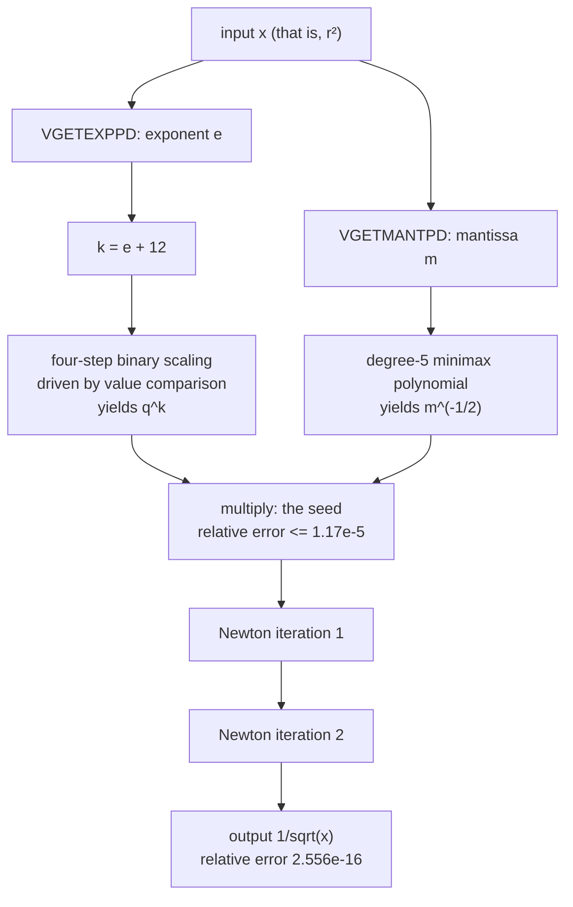
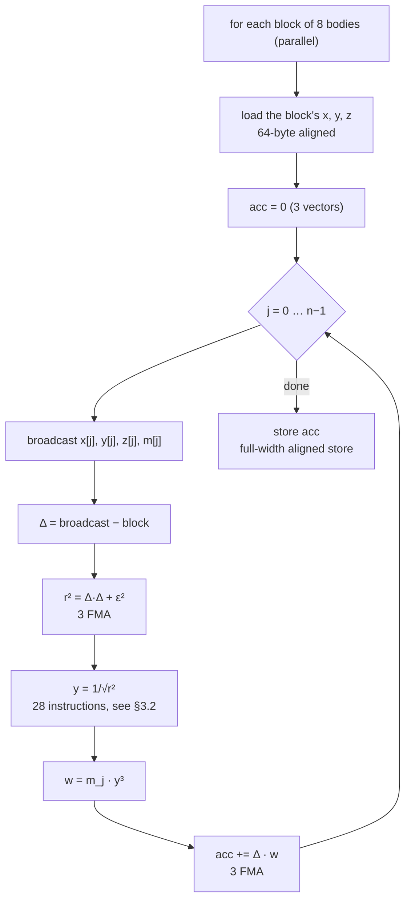
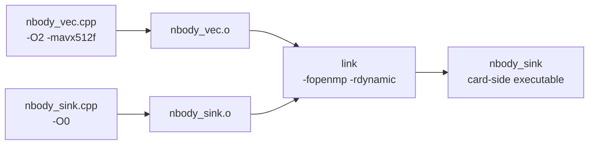

# Appendix N14 — N-Body Computation: Algorithm Design Specification

**Scope.** This is the design specification for T7's card-side N-body kernel: what it computes, how the arithmetic is laid out, which properties of the target architecture that layout depends on, and why the alternatives were rejected. It is written to be sufficient to **re-implement or port** the kernel. The optimisation history is in [N9](N9-t7-nbody-overview.md)–[N13](N13-t7-verification.md); this document states only the conclusions that survived.

Target: Intel Xeon Phi 7120P (codename Knights Corner, "KNC" below), IMCI instruction set. Source: `release/tests/src/nbody_vec.cpp` (kernel), `nbody_sink.cpp` (card-side driver), `nbody_host.cpp` (host). Driver: `release/tests/t7_nbody.sh`.

---

## 1. Requirements

| # | Requirement | Consequence |
|---|---|---|
| R1 | Gravitational N-body, direct summation, no tree or FMM | The inner loop is $O(N^2)$; there is no data structure to optimise around |
| R2 | After 4 to 20 integration steps, the final checksum agrees with the host reference to **$10^{-9}$ relative** | The arithmetic layout is constrained, not a free variable (see §3.3) |
| R3 | Six problem sizes, $N = 1024 \ldots 131072$, steps 20/10/5/4/4/4 | No tier may be special-cased; the kernel must not collapse at small $N$ |
| R4 | Run on the card, using the card's own OpenMP runtime | Card-side process; the thread count must be passed as a **parameter** (see §6.2) |
| R5 | Verifiable — the correctness claim must be falsifiable | The three verification layers are part of the design, not an afterthought (see §7) |

R2 deserves a sentence of its own. "Agrees with a reference implementation to $10^{-9}$ relative" is not a statement about accuracy in the abstract; it is a statement about **agreement with one particular summation order**. §3.3 is about turning that from a constraint into a design rule.

---

## 2. Algorithm

### 2.1 Physical model

The acceleration on body $i$ is the sum of the gravitational pulls of every other body:

$$
\mathbf{a}_i \;=\; \sum_{j \neq i} m_j \, \frac{\mathbf{r}_j - \mathbf{r}_i}{\left( \lVert \mathbf{r}_j - \mathbf{r}_i \rVert^2 + \varepsilon^2 \right)^{3/2}}
$$

The $\varepsilon^2$ in the denominator is the softening term, added to the squared distance before the $3/2$ power. It holds the denominator away from zero, so every term is finite. This workload uses $\varepsilon^2 = \mathtt{1e-3}$, and all masses are equal, $m_j = 1/N$.

The self-term $j = i$ needs no special case. The vectorised form evaluates it with $\Delta \mathbf{r} = \mathbf{0}$, so its contribution is exactly $0$; and adding $0.0$ to an accumulator is exact. **This is a designed property, not a coincidence** — it removes a branch from the innermost loop.

### 2.2 Integration

Leapfrog in kick-drift form, one force evaluation per step:

$$
\begin{aligned}
\mathbf{v} &\leftarrow \mathbf{v} + \mathbf{a} \, \Delta t \\
\mathbf{x} &\leftarrow \mathbf{x} + \mathbf{v} \, \Delta t
\end{aligned}
$$

Leapfrog is symplectic and second order, and it needs only one $\mathbf{a}$ per step. That last point matters, because the cost of evaluating the force is the entire cost.

### 2.3 Complexity

| | |
|---|---|
| Time per step | $O(N^2)$ |
| Memory | 3 position arrays, 3 velocity, 1 mass, 3 acceleration — $10N$ `double`s |
| At $N = 131072$ | About 11 MB of arrays, reused every step |

The kernel reads only `x`, `y`, `z`, `m` and writes only `ax`, `ay`, `az`. Arithmetic intensity is low and reuse is high: every $j$ value is read by every $i$ block. That is precisely why blocking is possible in principle, and precisely what the symmetry scheme of §9 tries to exploit.

---

## 3. Numerical design

### 3.1 Precision

Every quantity is IEEE binary64. There is no mixed precision anywhere: the acceptance criterion is a bit-level comparison against a double-precision reference, so any narrowing would need a tolerance argument that does not exist here.

### 3.2 The reciprocal square root

This is the only piece of arithmetic in the kernel that is **constructed** rather than ported, and §4 gives the reason: **KNC has no FP64 square root, division, reciprocal, or reciprocal square root** — not slow, absent. `sqrt()` and `/` on a `double` compile to library calls costing about 285 cycles per pair, which was the whole of the original 2.7 GFLOPS.

The construction uses only the two FP64 transcendental-class instructions KNC does have: `VGETEXPPD` (extract exponent) and `VGETMANTPD` (extract mantissa). Split $x$ into a mantissa and a power of two, then split that into two factors that can each be computed:

$$
x = m \cdot 2^{e}, \qquad m \in [1, 2), \quad e \in \mathbb{Z}
$$

$$
\frac{1}{\sqrt{x}} \;=\; q^{e} \cdot m^{-1/2}, \qquad q = 2^{-1/2}
$$



**（a）$q^{e}$ — and no integer conversion is allowed.**

KNC offers no `double`-to-`int` conversion that the assembler accepts, so the exponent cannot be manipulated bitwise. It is tested **by value** instead. With $k = e + 12$, a four-step binary chain:

$$
\begin{aligned}
r &\leftarrow 1 \\
k \ge 8 \;&\Rightarrow\; r \leftarrow r \cdot q^{8},\quad k \leftarrow k - 8 && q^{8} = 2^{-4} \\
k \ge 4 \;&\Rightarrow\; r \leftarrow r \cdot q^{4},\quad k \leftarrow k - 4 && q^{4} = 2^{-2} \\
k \ge 2 \;&\Rightarrow\; r \leftarrow r \cdot q^{2},\quad k \leftarrow k - 2 && q^{2} = 2^{-1} \\
k \ge 1 \;&\Rightarrow\; r \leftarrow r \cdot q^{1},\quad k \leftarrow k - 1 && q^{1} = 2^{-1/2}
\end{aligned}
$$

Four triples of "compare to a mask, masked multiply, masked subtract" — 12 vector instructions, no branches.

The **design range** is $k \in [0, 15]$, equivalently $e \in [-12, 3]$, equivalently

$$
x \in \left[ 2^{-12},\; 2^{4} \right) \;\approx\; \left[ \mathtt{2.44e-4},\; 16 \right)
$$

This workload guarantees $x = r^2 \ge \varepsilon^2 = \mathtt{1e-3}$, and positions inside $[0,1]^3$ give $x \lesssim 3.1$. Both ends are far from the boundary.

**（b）$m^{-1/2}$.**

A degree-5 minimax polynomial on $[1,2)$, fitted with relative-error weighting and then verified on a $10^6$-point grid **independently of the fitting code**:

| Degree | Maximum relative error |
|---|---|
| 3 | $\mathtt{4.80e-04}$ |
| 4 | $\mathtt{7.41e-05}$ |
| **5** | $\mathtt{1.17e-05}$ |

The six coefficients are pre-multiplied by 64, to cancel the $q^{12}$ introduced by $k = e + 12$.

**（c）Refinement.**

Two Newton iterations, three instructions each, with $\tfrac{1}{2}x$ hoisted out of the loop:

$$
y \;\leftarrow\; y \left( \tfrac{3}{2} - \tfrac{1}{2} x y^{2} \right)
$$

Starting from the $\mathtt{1.17e-5}$ seed, worst-case convergence is

$$
\mathtt{1.17e-5} \;\to\; \mathtt{2.04e-10} \;\to\; \mathtt{6.24e-20}
$$

already below the `double` machine epsilon.

**Measured result.** Over 512 log-uniform samples spanning the design range, compared point by point against libm's $1/\sqrt{x}$: maximum relative error $\mathtt{2.556e-16}$, about 1 ulp, verified directly on the card (§7, layer 1).

**Cost.** 28 floating-point instructions per $i$ block, against the roughly 285 cycles per pair that it replaces.

### 3.3 Summation order — a design constraint, not an implementation detail

There are two ways to vectorise a pairwise sum, and the choice decides whether R2 can be met:

| Direction | Where the accumulator lives | Each body's $j$ loop |
|---|---|---|
| **Over $i$** (chosen here) | In the vector lanes | **Sequential, one lane — same order and same number of roundings as the scalar reference** |
| Over $j$ | In a reduction tree | Split across lanes; the order changes |

Only the first preserves R2. **So all vectorisation in this kernel is over $i$, broadcasting $j$**, and that single decision is why the final checksum matches the host reference bit for bit: the difference is $\mathtt{0.000e+00}$ at $N = 1024$, $8192$ and $65536$, and between $\mathtt{1.5e-16}$ and $\mathtt{3.0e-16}$ at the others.

One corollary is worth writing down, because it is easy to violate later: **anything that changes a body's $j$ accumulation order breaks R2** — including an incorrect $i$ unroll, and the symmetry scheme of §9.

---

## 4. Target architecture: what KNC has and lacks

These are the facts the design rests on. Each was checked against the *Phi ISA Reference Manual* and then confirmed with the assembler. Several contradict a generic AVX-512 mental model.

| Property | Consequence for this design |
|---|---|
| **512-bit vectors only**; no `xmm`, no `ymm` | Any scalar floating point in a vectorised translation unit emits forbidden xmm forms — see §6.1 |
| Intrinsics need `-mavx512f`; the k1om backend never auto-vectorises | Explicit intrinsics are the only route |
| FP64 has add, subtract, multiply, FMA, compare, `VGETEXPPD`, `VGETMANTPD` — **and nothing else** | See §3.2 |
| **No unaligned vector access** (no `vmovupd`, no `vmovups`) | Every array the kernel touches must be 64-byte aligned — see §6.3 |
| **No lane permute of any kind** — `vpermilpd`, `vshufpd`, `vshuff64x2`, `vpermq`, `valignq`, `vshufi64x2` are all rejected | A horizontal reduction cannot be expressed, so the symmetry optimisation is **blocked** — see §9 |
| **No `cmov`** | `? :` and `if (c) x = …` compile to `cmov*` and the assembler stops; write `x *= (unsigned)(cond)` — see §5.2 |
| `VCMPPD`'s predicate is only **3 bits**, there is no $\ge$, and the manual says to swap operands and use $\le$ | GCC emits the 5-bit AVX-512 form (immediate 13) and the hardware raises invalid-opcode; use `_mm512_cmp_pd_mask(threshold, k, _CMP_LE_OS)` |
| `VPACKSTORE` displacement is **element-granular** (disp8*N) | A masked single-`double` store whose base is not $\texttt{rbp}$ faults on the card; simply do not emit `vpackstorelpd` |
| MVEX **embedded broadcast** (`{1to8}`) exists, reachable only through inline asm with `%{1to8%}` | Measured **6.5 % slower**; not used — see §9 |
| Instructions decode in pairs within a window | Code alignment might matter; measured flat |
| 4 hardware threads per core; ILP comes from SMT, not from intra-thread interleaving | Explains why hand-interleaving dependency chains buys nothing; thread count does matter — see §8 |

---

## 5. Kernel design

### 5.1 Structure

Bodies are cut into blocks of 8, each block filling the 8 lanes of one 512-bit vector. The outer loop runs over blocks in parallel; the inner loop runs over $j$:



**Vectorising over $i$ and broadcasting $j$ (§3.3) brings a second, independent benefit**: the results are naturally 8-lane, so they leave the kernel as full-width aligned `_mm512_store_pd` and the kernel emits **not one** `vpackstorelpd` or `vscatter` — the instruction class §4 identifies as the one that faults. Avoiding it is why the vector unit can be built at `-O2`.

### 5.2 Two blocks per iteration, and its guard

The $j$ loop processes **two $i$ blocks, 16 bodies**, per iteration. Both blocks share the same four broadcasts, so memory traffic is unchanged; the intent was to give the scheduler two independent dependency chains.

Measured gain: **+4 %**. A hand-written lockstep interleaving (`rsqrt_pd_2`, alternating the two chains instruction by instruction) changes nothing — the kernel is uniformly bound by floating-point issue, not by latency, and KNC's instruction-level parallelism comes from the hardware threads anyway (§4). Both are kept in the source with their measurements.

**The unroll halves the number of parallel work items**, which is a genuine hazard at small $N$: at $N = 1024$ there are only 128 blocks, so 64 two-block groups against 240 threads. The kernel therefore falls back to one block per iteration when the work items cannot fill the machine:

```c
/* KNC has no cmov: `if (c) x = 0;` compiles to cmovb and the assembler stops.
 * Multiplying in the comparison result yields setae instead. */
const unsigned need = (4u * (unsigned)omp_get_max_threads())
                    & (unsigned)(g_force_2way - 1);
nvp *= (unsigned)(nvp >= need);
```

The `& (g_force_2way - 1)` term is also how the verification layer forces the two-block path for testing (§7).

### 5.3 Instruction and cycle budget

The inner loop, measured from the built object:

| | Per iteration (16 pairs) |
|---|---|
| Total instructions | **119** |
| Of which floating-point pipeline class (FMA, multiply, subtract, add, compare, extract exponent, extract mantissa) | **78** |
| `vbroadcastsd` | 4 |
| `vprefetch0` | 4 |
| `vmovapd` register moves | 7 |

At the large tiers this executes in **113 to 115 cycles** — 1.05 instructions per cycle, **69 %** of the floating-point issue bound (the FP pipeline retires one 512-bit FP64 operation per cycle). Back-solved consistently at both $N = 65536$ and $N = 131072$.

Each block's 37 floating-point instructions break down as: 3 to compute $r^2$, **28 for the reciprocal square root**, 3 for $y^3 m$, 3 to accumulate. **The reciprocal square root is 76 % of it**, and §9 records why it does not compress further.

---

## 6. Software structure

### 6.1 Two translation units

The card-side program needs two mutually incompatible things at once:

| Which part | Needs | Because |
|---|---|---|
| Initial conditions (`sin`, `cos`), checksum, timing | **Scalar** floating point | They are inherently scalar |
| Force kernel, energy kernel | **`-mavx512f`** | The only route to IMCI |

`-mavx512f` retargets the whole translation unit to generic AVX-512F, so scalar floating point inside it becomes xmm and the assembler stops. Conversely, a scalar unit at `-O2` emits the faulting `vpackstorelpd` form. **Neither flag can be applied to the whole program**, so it is split:



### 6.2 Interface — pointers and integers only, never `double`

```c
extern "C" void nbody_accel(int n, const double *x, const double *y,
                            const double *z, const double *m,
                            const double *soft2p,
                            double *ax, double *ay, double *az);
```

`soft2` is passed **by pointer**, so that no `double` crosses the ABI in a register between two units compiled to different targets. The same rule applies to the `Result` and `Params` structs, which must be byte-identical on both sides (the card's return value is copied back as raw memory).

The card-side thread count is a **parameter**, not an environment variable. The host launches the card process through COI, and **host environment variables do not cross that boundary** — setting `OMP_NUM_THREADS` on the host is silently ignored, confirmed by measurement. `Params.nthreads` carries it, the sink calls `omp_set_num_threads` before any parallel region, and the driver exposes it as `T7_THREADS`.

### 6.3 Memory

Every array the vector kernel reads or writes is allocated **64-byte aligned**, with `posix_memalign` rather than `calloc` — the latter only guarantees 16 bytes. `vmovapd` requires 64 and KNC has no unaligned form, so under-alignment is not a slowdown but a general-protection fault.

---

## 7. Verification design

The kernel's correctness claim is only as strong as the checks behind it, so verification is part of the design.

### 7.0 Initial conditions

Positions come from an integer hash, `hash01`, not a lattice. Two properties are required.

First, **irregular** — so that the net gravitational force is not cancelled by symmetry and the dynamics genuinely depend on the force law.

Second, **bit-reproducible across host and card** — integer arithmetic plus one multiplication by an exact power of two, which `sin` and `cos` are not.

### 7.1 Three layers


| Layer | What it checks | Cost | Gating |
|---|---|---|---|
| 1 | 512 log-uniform samples across the design range, card vector `rsqrt_pd` vs scalar `1/sqrt` | milliseconds | **always runs**; measured $\mathtt{2.556e-16}$ |
| 2 | The vector kernel on 64 bodies vs a libm loop in the card's scalar unit, **both code paths** | milliseconds | **always runs**; measured $\mathtt{6.340e-16}$ |
| 3 | The final checksum against the host reference, tolerance $10^{-9}$ relative | $O(N^2)$ times steps | small tiers by default; $N > 16384$ needs `T7_REF=1`; a skipped tier is reported as **SKIP, never PASS** |

Layer 2 must cover both the two-block main loop and the single-block tail. At a self-test size of 64 bodies the parallelism guard of §5.2 selects the tail, so without the `g_force_2way` override **the main loop — 99.99 % of the physics — would go untested**. That gap really existed; it was found by breaking the main loop and watching the test stay green.

### 7.2 Why three layers and not one

Measured, with the end-to-end check as the only gate ($N = 32768$, 4 steps):

| Force law | Force-kernel error | End-to-end verdict |
|---|---|---|
| correct | $\mathtt{6.34e-16}$ | pass |
| $w = m \, x \cdot 0.5$ | $\mathtt{1.001e+00}$ | **pass** |
| $w = 0$ — **no force at all** | $\mathtt{1.000e+00}$ | **pass** |
| force times 2 | $\mathtt{1.000e+00}$ | **pass** |

**A passing end-to-end test proves the code is consistent with the test, not that the test is able to fail.** Deleting gravity entirely leaves both the checksum and the energy check green. Layer 2 catches all four cases.

---

## 8. Performance

Measured on the 7120P. The scalar baseline is built at `-O0` and rebuilt on the **same hashed initial conditions**. GFLOPS counts 20 floating-point operations per pair; MPairs/s counts physics pairs $n(n-1)/2$ — the same measurement in two units, differing by a factor of 50.

| $N$ | Steps | Scalar `-O0` | Vector | Speedup | Vector MPairs/s |
|---|---|---|---|---|---|
| 1024 | 20 | 0.52 GFLOPS | 2.38 | 4.6× | 119 |
| 8192 | 10 | 2.09 | 20.38 | 9.8× | 1019 |
| 16384 | 5 | 2.65 | 56.48 | 21.3× | 2824 |
| 32768 | 4 | 2.97 | 86.72 | 29.2× | 4336 |
| 65536 | 4 | 3.02 | 105.05 | 34.8× | 5253 |
| 131072 | 4 | 3.07 | 104.72 | 34.1× | 5236 |

The scalar build is flat at about 3 GFLOPS from $N = 16384$ upward — it is bound by software `sqrt` and division, whose per-pair cost does not depend on $N$.

The vector build saturates at $N \approx 65536$, at about $\mathtt{5.3e3}$ MPairs/s, which is 8.7 % of the card's FP64 peak (about 1208 GFLOPS).

Run-to-run spread is ±10 %, so quote ranges, not single runs.

The thread-count column (best-of-7, tier 6):

| Threads | Threads/core | MPairs/s |
|---|---|---|
| 61 | 1.0 | 2490.88 |
| 122 | 2.0 | 4005.63 |
| 183 | 3.0 | 4721.80 |
| **240** | 3.9 | **5580.94** |
| 244 | 4.0 | 5001.22 |

SMT is worth about 2.2×. And **over-subscribing is worse than leaving a core idle**: 244 threads — every hardware thread on the card — is 10 % slower than 240. 240 is four threads on 60 of the 61 cores, and the runtime default already picks it.

---

## 9. Rejected alternatives

Recorded because each was a reasonable idea, several were implemented, and the reason for rejection is a **property of this target**, not a matter of taste.

| Alternative | Status | Why |
|---|---|---|
| libm `sqrt()` plus division | **baseline** | about 285 cycles per pair; the original 2.7 GFLOPS |
| FP32 `VRSQRT23PS` as a seed, refined in FP64 | **blocked** | needs an FP64-to-FP32 down-conversion; `_mm512_cvtpd_ps` needs ymm, and `_mm512_cvtpd_epi32` emits a rejected mnemonic |
| Polynomial in the exponent replacing the masked chain | **a wash** | `vcmp*` drops from 20 to 0, but 99.84 against 98.81 MPairs/s — a 9-deep FMA chain costs what a 4-deep masked chain costs. Kept behind `-DNB_RSQRT_POLY=1` |
| One Newton iteration instead of two | **rejected** | from the $\mathtt{1.17e-5}$ seed one iteration reaches only $\mathtt{2.1e-10}$, failing layer 2's $\mathtt{1e-14}$ threshold; reaching it with one iteration needs a degree-10 polynomial, costing more than it saves |
| Embedded broadcast (`{1to8}`) | **slower** | reachable (`%{1to8%}` gets around GCC's brace-eating template) but 5204.68 against 5567.46 MPairs/s — longer encoding, different load-port behaviour. Kept behind `NB_BCAST_FOLD=0` |
| Contiguous vector loads instead of broadcasts | **slower** | 92.7 against 98.4; broadcasts are not the bottleneck |
| Manual lockstep interleaving of the two chains | **no effect** | the kernel is bound by floating-point issue, not by latency |
| `vprefetch0` on the loads | **+2.3 %** | kept at distance 16; the only architecture-level knob that helped |
| Code alignment (`-falign-loops`), prefetch hints T1/T2/NTA | **flat** | 111.0 to 112.0 GFLOPS across all settings |
| Larger $i$ unrolling (4 blocks) | **rejected** | register pressure: 17 constant vectors plus accumulators on a 32-register file |
| **Symmetry (Newton's third law)** | **blocked by the instruction set** | see below |
| A vendor BLAS or N-body library | **does not exist** | nothing for k1om |

### 9.1 Symmetry — the one that arithmetic endorses and the instruction set forbids

Computing each pair once and handing $+\mathbf{f}$ and $-\mathbf{f}$ to the two bodies halves the number of reciprocal-square-root evaluations per **physics pair**: the current kernel spends one per 4 physics pairs, a symmetric one would spend one per 8. In instruction terms that is 10 down to 5.5 per physics pair, about 1.8×.

**But KNC cannot express it.** The current kernel vectorises over $i$ and broadcasts $j$, so the accumulator sits in the lanes — the natural place. Symmetry requires one of the two sides to be reversed: the force acting on **the broadcast index** must be accumulated onto that index, so every $i$ needs a **cross-lane reduction**. And KNC has no lane permute of any kind:

| Intrinsic | Assembler verdict |
|---|---|
| `_mm512_permute_pd`, `_mm512_mask_permute_pd` | `vpermilpd` is not supported on k1om |
| `_mm512_shuffle_pd` | `vshufpd` is not supported |
| `_mm512_shuffle_f64x2` | no such instruction: `vshuff64x2` |
| `_mm512_permutex_epi64`, `_mm512_permutexvar_epi64` | `vpermq` is not supported |
| `_mm512_alignr_epi64`, `_mm512_shuffle_i64x2` | no such instructions |
| `_mm512_swizzle_pd` (the MVEX swizzle) | not declared — the headers carry no `_MM_SWIZ_*` constants |

The only way out is a memory round trip: one 64-byte store, an aliasing barrier, eight broadcast loads and eight adds — about **54 vector instructions per 64 pairs**, paid once per $i$ per $j$ block. Against that, the saving is 28 instructions per 64 pairs:

| $j$-block width | Instructions per physics pair | Against the current 10 |
|---|---|---|
| 1 block | 13.1 | **0.76× — slower** |
| 2 blocks | 9.6 | 1.04× |
| 4 blocks | 7.8 | 1.28×, but spilling has begun |
| 8 blocks | 6.9 | 1.45×, spilling badly |

The realistic landing point is **0.8 to 1.0×, that is, no gain**.

> **Design rule.** Symmetry in N-body is fundamentally a scatter, and a scatter needs a transpose. On a SIMD instruction set with no lane permute, price the transpose first, and only then count the square roots you saved.

---

## 10. Porting and extension

What changes when the target differs:

| If the target … | Then |
|---|---|
| **has FP64 square root or reciprocal square root** | delete all of §3.2 and use the hardware estimate plus two Newton iterations |
| **has lane permute instructions** | symmetry (§9.1) becomes viable again — the transpose drops from about 18 instructions to about 6, and 1.5× is back on the table |
| **has a narrower vector** (256-bit, say) | `NB_VEC` and the block size change together; the four-step scaling range and `EXP_OFF` are independent of it |
| **supports unaligned vector access** | the 64-byte alignment requirement of §6.3 can relax to natural alignment, though keeping it costs nothing |
| **has a working auto-vectoriser** | the explicit intrinsic kernel is still preferable, because the summation-order requirement of §3.3 is not something a vectoriser will preserve for you |
| **is an out-of-order core** | the $i$ unroll and the lockstep both become meaningless; expect to revisit the blocking without the in-order issue constraint |

Whatever the target, three things must **not** change.

First, **vectorise over $i$ and broadcast $j$** — this is the key to R2, see §3.3.

Second, **keep the transcendental separately verifiable** — layer 1 of §7 is the only way to localise an error when the end-to-end test is insensitive to that component.

Third, **check that the test is able to fail** — §7.2 is not a formality; the original suite let a kernel with no gravity at all pass.

---

## 11. Related

- Results and the scaling curve: [N9](N9-t7-nbody-overview.md)
- The FP64 transcendental gap in detail: [N10](N10-t7-gemm-fp64-no-transcendentals.md)
- The two-unit architecture and the fault modes: [N11](N11-t7-two-units-and-three-traps.md)
- Cycle accounting and rejected micro-optimisations: [N12](N12-t7-nbody-headroom.md)
- Verification design and the sensitivity experiment: [N13](N13-t7-verification.md)
- General ISA constraints for vectorised sinks: [N2](N2-t9-gemm-isa-constraints.md)
