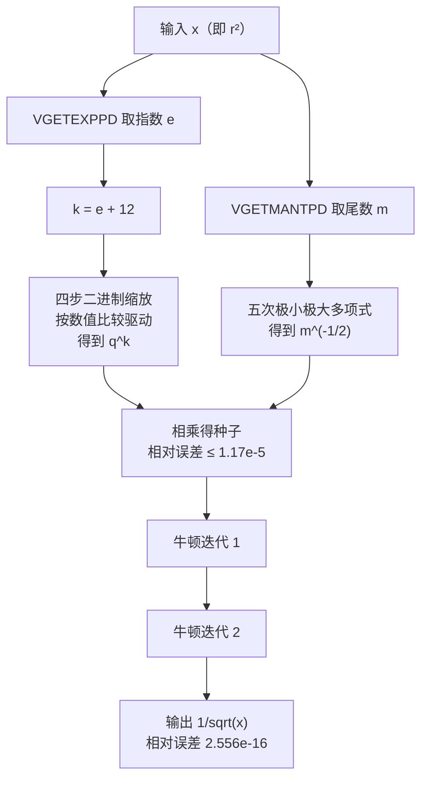
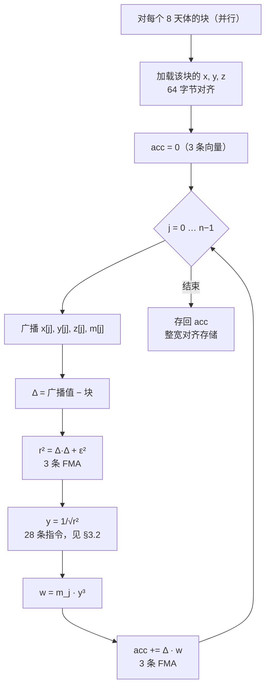
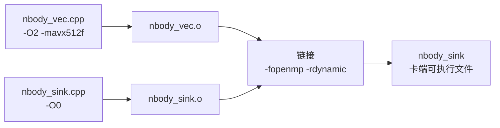
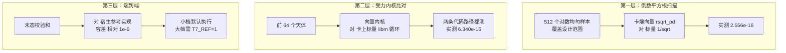

# 附录 N14 — N 体计算：算法设计说明

**范围。** 本篇是 T7 卡端 N 体内核的设计说明：它算什么、算术怎么排布、这个排布依赖目标架构的哪些性质、以及其他方案为什么被否掉。写它的目的是**照着能重新实现或移植**。优化过程在 [N9](N9-t7-nbody-overview_CN.md)–[N13](N13-t7-verification_CN.md)，本篇只写经得起检验的结论。

目标平台：Intel Xeon Phi 7120P（代号 Knights Corner，下称 KNC），指令集 IMCI。源码：`release/tests/src/nbody_vec.cpp`（内核）、`nbody_sink.cpp`（卡端驱动）、`nbody_host.cpp`（宿主）。测试脚本：`release/tests/t7_nbody.sh`。

---

## 1. 需求

　　需求一共五条，列在下表。其中第二条决定了后面所有设计，其余四条只是把它约束在一个具体形状里。

| 编号 | 需求 | 后果 |
|---|---|---|
| R1 | 引力 N 体，直接求和，不用树或 FMM | 内层是 $O(N^2)$，没有数据结构可供腾挪 |
| R2 | 积分 4 至 20 步之后，末态校验和与宿主参考实现一致到**相对 $10^{-9}$** | 算术排布被约束住，不是自由变量（见 §3.3） |
| R3 | 六档规模，$N = 1024 \ldots 131072$，步数 20/10/5/4/4/4 | 不许对某一档特判，内核不能在小 $N$ 上塌方 |
| R4 | 在卡上跑，用卡自己的 OpenMP 运行库 | 卡端进程；线程数要当**参数**传（见 §6.2） |
| R5 | 可验证——正确性主张必须能被证伪 | 三层验证是设计的一部分，不是事后补的（见 §7） |

　　R2 值得单独说一句。「与某个参考实现一致到相对 $10^{-9}$」，这句话谈的不是抽象的精度，而是**与某一种特定的求和次序一致**。§3.3 讲的就是怎么把它从一条约束变成一条设计规则。

---

## 2. 算法

### 2.1 物理模型

　　天体 $i$ 受到的加速度，是其余所有天体的引力之和：

$$
\mathbf{a}_i \;=\; \sum_{j \neq i} m_j \, \frac{\mathbf{r}_j - \mathbf{r}_i}{\left( \lVert \mathbf{r}_j - \mathbf{r}_i \rVert^2 + \varepsilon^2 \right)^{3/2}}
$$

　　分母里的 $\varepsilon^2$ 是软化项，在取 $3/2$ 次幂之前加到距离平方上。它把分母从零处隔开，保证每一项都有限。本负载取 $\varepsilon^2 = \mathtt{1e-3}$，且所有天体质量相同，$m_j = 1/N$。

　　自作用项 $j = i$ 不需要特判。向量化形式会以 $\Delta \mathbf{r} = \mathbf{0}$ 求值它，于是它的贡献恰好是 $0$；而把 $0.0$ 加进累加器是精确的。**这是刻意设计出来的性质，不是碰巧**——它从最内层循环里去掉了一个分支。

### 2.2 积分

　　用蛙跳法（踢-漂形式），每步只求一次受力：

$$
\begin{aligned}
\mathbf{v} &\leftarrow \mathbf{v} + \mathbf{a} \, \Delta t \\
\mathbf{x} &\leftarrow \mathbf{x} + \mathbf{v} \, \Delta t
\end{aligned}
$$

　　蛙跳法是辛格式、二阶精度，而且每步只需要一次 $\mathbf{a}$。最后这点很要紧，因为求受力的开销就是全部开销。

### 2.3 复杂度

| 项目 | 量级 |
|---|---|
| 每步时间 | $O(N^2)$ |
| 内存 | 位置 3 个数组、速度 3 个、质量 1 个、加速度 3 个，共 $10N$ 个 `double` |
| $N = 131072$ 时 | 数组约 11 MB，每步重复使用 |

　　内核只读 `x`、`y`、`z`、`m`，只写 `ax`、`ay`、`az`，不碰别的东西。算术强度低而复用率高：每个 $j$ 值都会被每一个 $i$ 分块读到。这正是理论上可以做分块的原因，也正是 §9 里对称性方案想去利用的东西。

---

## 3. 数值设计

### 3.1 精度

　　所有量都是 IEEE binary64。全程不混精度：验收判据是与双精度参考的逐位比对，任何降精度都得配一个并不存在的容差论证。

### 3.2 倒数平方根

　　这是内核里唯一**被构造出来**而不是移植过来的算术，原因见 §4：**KNC 没有 FP64 开方、除法、倒数、倒数平方根**——不是慢，是没有。`double` 上的 `sqrt()` 和 `/` 会编译成库函数调用，每对粒子约 285 个周期，这就是最初只有 2.7 GFLOPS 的全部原因。

　　构造只用到 KNC 仅有的两条 FP64 超越类指令：`VGETEXPPD`（取指数）和 `VGETMANTPD`（取尾数）。先把 $x$ 拆成尾数与指数的乘积，再把它劈成两个各自可算的因子：

$$
x = m \cdot 2^{e}, \qquad m \in [1, 2), \quad e \in \mathbb{Z}
$$

$$
\frac{1}{\sqrt{x}} \;=\; q^{e} \cdot m^{-1/2}, \qquad q = 2^{-1/2}
$$



**（一）$q^{e}$，而且不能做整数转换。**

　　KNC 上没有任何汇编器肯接受的 `double` 到 `int` 转换，所以指数没法拿去做位运算，只能**按数值大小比较**。令 $k = e + 12$，做一条四步二进制链：

$$
\begin{aligned}
r &\leftarrow 1 \\
k \ge 8 \;&\Rightarrow\; r \leftarrow r \cdot q^{8},\quad k \leftarrow k - 8 && q^{8} = 2^{-4} \\
k \ge 4 \;&\Rightarrow\; r \leftarrow r \cdot q^{4},\quad k \leftarrow k - 4 && q^{4} = 2^{-2} \\
k \ge 2 \;&\Rightarrow\; r \leftarrow r \cdot q^{2},\quad k \leftarrow k - 2 && q^{2} = 2^{-1} \\
k \ge 1 \;&\Rightarrow\; r \leftarrow r \cdot q^{1},\quad k \leftarrow k - 1 && q^{1} = 2^{-1/2}
\end{aligned}
$$

　　四组「比较出掩码、掩码乘、掩码减」，共 12 条向量指令，没有分支。

　　**设计范围**是 $k \in [0, 15]$，等价于 $e \in [-12, 3]$，也等价于

$$
x \in \left[ 2^{-12},\; 2^{4} \right) \;\approx\; \left[ \mathtt{2.44e-4},\; 16 \right)
$$

　　本负载保证 $x = r^2 \ge \varepsilon^2 = \mathtt{1e-3}$，而位置落在 $[0,1]^3$ 内又给出 $x \lesssim 3.1$，两端都离边界很远。

**（二）$m^{-1/2}$。**

　　在 $[1,2)$ 上按相对误差加权拟合一个五次极小极大多项式，再用 $10^6$ 点的网格**独立于拟合代码**验证：

| 次数 | 最大相对误差 |
|---|---|
| 3 | $\mathtt{4.80e-04}$ |
| 4 | $\mathtt{7.41e-05}$ |
| **5** | $\mathtt{1.17e-05}$ |

　　六个系数预先乘上 64，用来抵消 $k = e + 12$ 带进来的那个 $q^{12}$。

**（三）精修。**

　　两次牛顿迭代，每步三条指令，$\tfrac{1}{2}x$ 提到循环外：

$$
y \;\leftarrow\; y \left( \tfrac{3}{2} - \tfrac{1}{2} x y^{2} \right)
$$

　　从 $\mathtt{1.17e-5}$ 的种子出发，最坏情况下的收敛是

$$
\mathtt{1.17e-5} \;\to\; \mathtt{2.04e-10} \;\to\; \mathtt{6.24e-20}
$$

　　已经低于 `double` 的机器 epsilon。

**实测结果。** 在设计范围上取 512 个对数均匀的样本，与 libm 的 $1/\sqrt{x}$ 逐点比对，最大相对误差 $\mathtt{2.556e-16}$，约合 1 ulp，而且在卡上直接验证过（§7 第一层）。

**代价。** 每个 $i$ 分块 28 条浮点指令，对应它取代掉的那每对约 285 个周期。

### 3.3 求和次序——这是设计约束，不是实现细节

　　成对求和有两种向量化方向，选哪一种决定了 R2 能不能满足：

| 方向 | 累加器落在哪 | 每个天体的 $j$ 循环 |
|---|---|---|
| **按 $i$**（本篇选它） | 落在向量车道上 | **顺序、单车道，次序和舍入次数与标量参考完全相同** |
| 按 $j$ | 落在归约树里 | 被拆到多个车道上，次序变了 |

　　只有第一种能保住 R2。**所以本内核所有向量化都是按 $i$、广播 $j$**，而这一个决定就是末态校验和能与宿主参考逐位一致的来由：$N = 1024$、$8192$、$65536$ 三档的差是 $\mathtt{0.000e+00}$，其余档在 $\mathtt{1.5e-16}$ 到 $\mathtt{3.0e-16}$ 之间。

　　有一条推论值得写下来，因为日后很容易违反：**任何改变某个天体的 $j$ 累加次序的改动，都会破坏 R2**——包括不正确的 $i$ 展开，以及 §9 里那个对称性方案。

---

## 4. 目标架构：KNC 有什么、没有什么

　　下面这些是设计所依赖的事实。每一条都先查 *Phi ISA Reference Manual*，再用汇编器确认。其中好几条与「通用 AVX-512」的直觉相反。

| 性质 | 对本设计的后果 |
|---|---|
| **只有 512 位向量**，没有 `xmm` 和 `ymm` | 向量化编译单元里任何标量浮点都会生成非法的 xmm 形式，见 §6.1 |
| intrinsic 需要 `-mavx512f`；k1om 后端从不自动向量化 | 显式 intrinsic 是唯一的路 |
| FP64 只有加、减、乘、FMA、比较、`VGETEXPPD`、`VGETMANTPD`，**别无其他** | 见 §3.2 |
| **没有非对齐向量访存**（没有 `vmovupd`、`vmovups`） | 内核碰到的每个数组都必须 64 字节对齐，见 §6.3 |
| **没有任何车道置换指令**——`vpermilpd`、`vshufpd`、`vshuff64x2`、`vpermq`、`valignq`、`vshufi64x2` 全被拒 | 水平归约无法表达，对称性优化因此**走不通**，见 §9 |
| **没有 `cmov`** | `? :` 和 `if (c) x = …` 会编成 `cmov*` 导致汇编中断；要写成 `x *= (unsigned)(cond)`，见 §5.2 |
| `VCMPPD` 的谓词只有 **3 位**，没有 $\ge$，手册要求交换操作数改用 $\le$ | GCC 发的是 5 位 AVX-512 形式（立即数 13），硬件报非法指令；必须写成 `_mm512_cmp_pd_mask(阈值, k, _CMP_LE_OS)` |
| `VPACKSTORE` 的位移是**元素粒度**（disp8*N） | 掩码单 `double` 存储若基址不是 $\texttt{rbp}$，卡上会崩；干脆不生成 `vpackstorelpd` |
| MVEX **嵌入广播**（`{1to8}`）确实存在，只能靠内联汇编加 `%{1to8%}` 触达 | 实测**慢 6.5%**，不用，见 §9 |
| 指令成「对」在窗口内解码 | 代码对齐可能有影响；实测持平 |
| 每核 4 个硬件线程；ILP 来自 SMT，不来自线程内部的指令交错 | 解释了为什么手工交错依赖链毫无收益；线程数确有影响，见 §8 |

---

## 5. 内核设计

### 5.1 结构

　　把天体按每 8 个一组切成块，每个块占满一条 512 位向量的 8 条车道。外层对块并行，内层对 $j$ 串行：



　　**按 $i$ 向量化、广播 $j$（§3.3）还带来第二个独立的好处**：结果天然是 8 车道的，因此以整宽对齐的 `_mm512_store_pd` 离开内核，内核**一条** `vpackstorelpd` 或 `vscatter` 都不生成——而 §4 指出那正是会崩的一类指令。避开它，正是向量单元能按 `-O2` 构建的原因。

### 5.2 每轮处理两个块，以及它的守卫

　　$j$ 循环每轮处理**两个 $i$ 块、共 16 个天体**。两个块共用同样的四次广播，所以访存流量不变；本意是给调度器两条互相独立的依赖链。

　　实测收益 **+4%**。手工写的 lockstep 交错（`rsqrt_pd_2`，把两条链逐条交替）则毫无变化——内核是均匀地受浮点发射限制，而不是受延迟限制，何况 KNC 的指令级并行本来就来自硬件线程（§4）。两者都连同测量结果留在源码里。

　　**展开会把并行工作项减半**，这在小 $N$ 上是真实危险：$N = 1024$ 时只有 128 个块，两路展开后就只剩 64 组，而卡上有 240 个线程。因此工作项铺不满机器时，内核退回单块：

```c
/* KNC 没有 cmov：`if (c) x = 0;` 会编成 cmovb 导致汇编中断。
 * 把比较结果乘进去，得到的是 setae。 */
const unsigned need = (4u * (unsigned)omp_get_max_threads())
                    & (unsigned)(g_force_2way - 1);
nvp *= (unsigned)(nvp >= need);
```

　　其中 `& (g_force_2way - 1)` 这一项同时也是验证层强制走两路展开做测试的手段（§7）。

### 5.3 指令与周期预算

　　内层循环，从构建产物实测：

| 项目 | 每轮迭代（16 对粒子） |
|---|---|
| 指令总数 | **119** |
| 其中浮点流水线类（FMA、乘、减、加、比较、取指数、取尾数） | **78** |
| `vbroadcastsd` | 4 |
| `vprefetch0` | 4 |
| `vmovapd` 寄存器搬移 | 7 |

　　在大档上这跑 **113 至 115 个周期**，即每周期发射 1.05 条指令，占浮点发射上界的 **69%**（浮点流水线每周期一条 512 位 FP64 操作）。在 $N = 65536$ 与 $N = 131072$ 两档上反推，结果一致。

　　每个块的 37 条浮点指令这样分解：算 $r^2$ 用 3 条，**倒数平方根用 28 条**，算 $y^3 m$ 用 3 条，累加用 3 条。**倒数平方根占了其中 76%**，而 §9 记录了它为什么压不下去。

---

## 6. 软件结构

### 6.1 两个编译单元

　　卡端程序同时需要两件互不相容的东西：

| 哪一部分 | 需要什么 | 为什么 |
|---|---|---|
| 初始条件（`sin`、`cos`）、校验和、计时 | **标量**浮点 | 它们本身就是标量的 |
| 受力内核、能量内核 | **`-mavx512f`** | 触达 IMCI 的唯一途径 |

　　`-mavx512f` 会把整个编译单元切到通用 AVX-512F，其中的标量浮点就变成 xmm，汇编器直接停。反过来，标量单元在 `-O2` 下会生成会崩的 `vpackstorelpd` 形式。**两个标志都没法施加到整个程序上**，于是只能拆开：



### 6.2 接口——只传指针和整数，绝不传 `double`

```c
extern "C" void nbody_accel(int n, const double *x, const double *y,
                            const double *z, const double *m,
                            const double *soft2p,
                            double *ax, double *ay, double *az);
```

　　`soft2` **用指针传**，这样在两个目标不同的编译单元之间，没有任何 `double` 以寄存器形式跨过 ABI 边界。同一条规则也适用于 `Result` 和 `Params` 两个结构体，它们必须两边逐字节一致（卡端的返回值是按内存原样拷回来的）。

　　卡上的线程数是**参数**而不是环境变量。宿主通过 COI 把卡端进程拉起来，而**宿主的环境变量跨不过这条边界**——在宿主机上设 `OMP_NUM_THREADS` 会被静默忽略，这一点实测确认过。`Params.nthreads` 承载它，sink 在任何并行区之前调用 `omp_set_num_threads`，驱动脚本把它暴露成 `T7_THREADS`。

### 6.3 内存

　　向量内核读写的每个数组都按 **64 字节对齐**分配，用 `posix_memalign` 而不是 `calloc`——后者只保证 16 字节。`vmovapd` 要求 64，而 KNC 没有非对齐形式，所以对齐不足不是变慢，而是 general protection 异常。

---

## 7. 验证设计

　　内核的正确性主张，其强度不会超过它背后的检查，所以验证也是设计的一部分。

### 7.0 初始条件

　　位置由整数散列 `hash01` 生成，不用点阵。这里需要两条性质。

　　一是**不规则**，这样净引力才不会被对称性抵消，动力学才真正依赖受力定律。

　　二是**卡端与宿主逐位可复现**——整数运算加一次乘精确的 2 的幂，而 `sin`、`cos` 不是这样的。

### 7.1 三层



| 层 | 检查什么 | 代价 | 门控 |
|---|---|---|---|
| 第一层 | 设计范围上 512 个对数均匀样本，卡端向量 `rsqrt_pd` 对 标量 `1/sqrt` | 毫秒 | **始终执行**，实测 $\mathtt{2.556e-16}$ |
| 第二层 | 64 个天体上向量内核 对 卡上标量单元里的 libm 循环，**两条代码路径都测** | 毫秒 | **始终执行**，实测 $\mathtt{6.340e-16}$ |
| 第三层 | 末态校验和对宿主参考实现，容差相对 $10^{-9}$ | $O(N^2)$ 乘步数 | 小档默认执行；$N > 16384$ 需 `T7_REF=1` 选择性开启；被跳过的档记为 **SKIP，绝不记为 PASS** |

　　第二层必须同时覆盖两路展开的主循环和单块尾循环。自检规模取 64 个天体时，§5.2 的并行度守卫会选中尾循环，所以如果没有 `g_force_2way` 这个覆盖开关，**承担 99.99% 物理计算的主循环等于根本没测**。这个缺口真实存在过，是靠把主循环弄坏、看着测试依然全绿才发现的。

### 7.2 为什么要三层而不是一层

　　实测，而且只把端到端检查当作门（$N = 32768$，4 步）：

| 受力定律 | 受力核误差 | 端到端判定 |
|---|---|---|
| 正确 | $\mathtt{6.34e-16}$ | 通过 |
| $w = m \, x \cdot 0.5$ | $\mathtt{1.001e+00}$ | **通过** |
| $w = 0$——**完全没有受力** | $\mathtt{1.000e+00}$ | **通过** |
| 受力乘 2 | $\mathtt{1.000e+00}$ | **通过** |

　　**端到端测试通过，证明的是代码与测试自洽，而不是测试有能力失败。** 把引力整个删掉，校验和与能量检查双双保持绿色。第二层把四种情况全部抓住。

---

## 8. 性能

　　在 7120P 上实测。标量基线用 `-O0` 编译，并在**同一套散列初始条件**上重建。GFLOPS 按每对粒子 20 次浮点运算计；MPairs/s 按物理配对数 $n(n-1)/2$ 计——同一个测量的两种单位，两者相差 50 倍。

| $N$ | 步数 | 标量 `-O0` | 向量 | 加速 | 向量 MPairs/s |
|---|---|---|---|---|---|
| 1024 | 20 | 0.52 GFLOPS | 2.38 | 4.6× | 119 |
| 8192 | 10 | 2.09 | 20.38 | 9.8× | 1019 |
| 16384 | 5 | 2.65 | 56.48 | 21.3× | 2824 |
| 32768 | 4 | 2.97 | 86.72 | 29.2× | 4336 |
| 65536 | 4 | 3.02 | 105.05 | 34.8× | 5253 |
| 131072 | 4 | 3.07 | 104.72 | 34.1× | 5236 |

　　标量构建从 $N = 16384$ 往上就平在约 3 GFLOPS——它受限于软件 `sqrt` 与除法，而这两者每对粒子的代价与 $N$ 无关。

　　向量构建在 $N \approx 65536$ 处饱和，约 $\mathtt{5.3e3}$ MPairs/s，相当于该卡 FP64 峰值（约 1208 GFLOPS）的 8.7%。

　　运行之间的离散度是 ±10%，所以报区间，不报单点。

　　线程数一栏（best-of-7，档位 6）：

| 线程数 | 线程/核 | MPairs/s |
|---|---|---|
| 61 | 1.0 | 2490.88 |
| 122 | 2.0 | 4005.63 |
| 183 | 3.0 | 4721.80 |
| **240** | 3.9 | **5580.94** |
| 244 | 4.0 | 5001.22 |

　　SMT 值约 2.2 倍。而**超订比留一个核空闲更糟**：244 线程——卡上每一个硬件线程——比 240 慢 10%。240 是 61 个核里用 60 个、每核 4 线程，运行库默认就选它。

---

## 9. 被否决的方案

　　这里记下来，是因为每一个当初都是合理的想法，其中好几个已经实现过，而否掉它们的理由是**这个目标平台的性质**，不是口味问题。

| 方案 | 状态 | 原因 |
|---|---|---|
| libm `sqrt()` 加除法 | **基线** | 每对约 285 个周期，就是最初的 2.7 GFLOPS |
| 用 FP32 `VRSQRT23PS` 做种子、回 FP64 精修 | **走不通** | 需要 FP64 到 FP32 的降精度转换；`_mm512_cvtpd_ps` 要 ymm，`_mm512_cvtpd_epi32` 发出的助记符被拒 |
| 用以指数为变量的多项式取代掩码链 | **打平** | `vcmp*` 从 20 条降到 0 条，但 99.84 对 98.81 MPairs/s——9 层深的 FMA 链和 4 层深的掩码链代价相同。以 `-DNB_RSQRT_POLY=1` 保留 |
| 只用一次牛顿迭代 | **否决** | 种子为 $\mathtt{1.17e-5}$ 时一次迭代只到 $\mathtt{2.1e-10}$，过不了第二层 $\mathtt{1e-14}$ 的门槛；要靠一次迭代达标得上十次多项式，代价比省下的还大 |
| 嵌入广播（`{1to8}`） | **更慢** | 可达（`%{1to8%}` 能绕过 GCC 吞花括号的模板），但 5204.68 对 5567.46 MPairs/s——编码更长、访存端口行为不同。以 `NB_BCAST_FOLD=0` 保留 |
| 用整块向量加载取代广播 | **更慢** | 92.7 对 98.4，广播不是瓶颈 |
| 手工 lockstep 交错两条链 | **无效果** | 内核受浮点发射限制，不是受延迟限制 |
| 对加载加 `vprefetch0` | **+2.3%** | 距离取 16 时保留，这是唯一有效的架构级旋钮 |
| 代码对齐（`-falign-loops`）、预取提示 T1/T2/NTA | **持平** | 各种设置下都是 111.0 至 112.0 GFLOPS |
| 继续加大 $i$ 展开（4 块） | **否决** | 寄存器压力：17 个常量向量加上累加器，挤在 32 个寄存器上 |
| **对称性（牛顿第三定律）** | **被指令集堵死** | 见下 |
| 厂商的 BLAS 或 N 体库 | **不存在** | k1om 上没有 |

### 9.1 对称性——算术上成立、指令集不允许的那一个

　　每对只算一次、把 $+\mathbf{f}$ 和 $-\mathbf{f}$ 分给两个天体，能把**每个物理对**的倒数平方根求值次数减半：现状是每 4 个物理对一次，对称版是每 8 对一次。换算成指令就是每个物理对 10 条降到 5.5 条，约 1.8 倍。

　　**但 KNC 表达不出来。** 现状按 $i$ 向量化、广播 $j$，累加器落在车道上，这是自然的位置。对称性要求其中一方反过来：作用在**被广播的那个下标**上的力，必须累加到那个下标上去，于是每个 $i$ 都需要一次**跨车道归约**。而 KNC 没有任何车道置换指令：

| intrinsic | 汇编器的判定 |
|---|---|
| `_mm512_permute_pd`、`_mm512_mask_permute_pd` | `vpermilpd` 在 k1om 上不支持 |
| `_mm512_shuffle_pd` | `vshufpd` 不支持 |
| `_mm512_shuffle_f64x2` | 没有这条指令：`vshuff64x2` |
| `_mm512_permutex_epi64`、`_mm512_permutexvar_epi64` | `vpermq` 不支持 |
| `_mm512_alignr_epi64`、`_mm512_shuffle_i64x2` | 没有这些指令 |
| `_mm512_swizzle_pd`（MVEX 的 swizzle） | 未声明——头文件里没有任何 `_MM_SWIZ_*` 常量 |

　　唯一的退路是内存往返：一次 64 字节存储、一条别名屏障、八次广播加载和八次加法，约合**每 64 对粒子 54 条向量指令**，而每处理一个 $i$ 的一个 $j$ 块就要付一次。对比之下，省下来的是每 64 对 28 条：

| $j$ 方向块宽 | 每物理对指令数 | 对比现状（10 条） |
|---|---|---|
| 1 块 | 13.1 | **0.76 倍——更慢** |
| 2 块 | 9.6 | 1.04 倍 |
| 4 块 | 7.8 | 1.28 倍，但已经开始溢出 |
| 8 块 | 6.9 | 1.45 倍，严重溢出 |

　　现实的落点是 **0.8 到 1.0 倍，也就是没有收益**。

> **设计规则。** N 体里的对称性，本质是一次散写；而散写需要转置。在没有车道置换的 SIMD 指令集上，先给转置定价，再去数省下来的开方。

---

## 10. 移植与扩展

　　目标平台不同时，哪些会变：

| 如果目标平台…… | 那么 |
|---|---|
| **有 FP64 的开方或倒数平方根** | 整个删掉 §3.2，改用硬件估算值加两次牛顿迭代 |
| **有车道置换指令** | 对称性（§9.1）重新可行——转置从约 18 条降到约 6 条，1.5 倍重新回到桌上 |
| **向量更窄**（例如 256 位） | `NB_VEC` 与分块大小一起改；四步缩放的范围和 `EXP_OFF` 与它无关 |
| **支持非对齐向量访存** | §6.3 的 64 字节对齐要求可以放宽到自然对齐，但保持它并不花代价 |
| **有能用的自动向量化器** | 显式 intrinsic 内核仍然更可取，因为 §3.3 的求和次序要求不是向量化器会替你保住的东西 |
| **是乱序核** | $i$ 展开和 lockstep 都失去意义；可以预期在不受顺序发射约束的前提下重新审视分块 |

　　无论目标是什么，**不能**变的有三条。

　　第一，**按 $i$ 向量化、广播 $j$**——这是满足 R2 的关键，见 §3.3。

　　第二，**让超越函数能被单独验证**——§7 的第一层，是在端到端测试对该部件不敏感时，唯一能把误差定位下来的手段。

　　第三，**检查测试是否有能力失败**——§7.2 不是走过场；原套件曾让一个完全没有引力的内核通过。

---

## 11. 相关

- 结果与规模曲线：[N9](N9-t7-nbody-overview_CN.md)
- FP64 超越函数缺口的细节：[N10](N10-t7-gemm-fp64-no-transcendentals_CN.md)
- 双编译单元架构与故障模式：[N11](N11-t7-two-units-and-three-traps_CN.md)
- 周期账与被否决的微优化：[N12](N12-t7-nbody-headroom_CN.md)
- 验证设计与灵敏度实验：[N13](N13-t7-verification_CN.md)
- 向量化 sink 的通用 ISA 约束：[N2](N2-t9-gemm-isa-constraints_CN.md)
