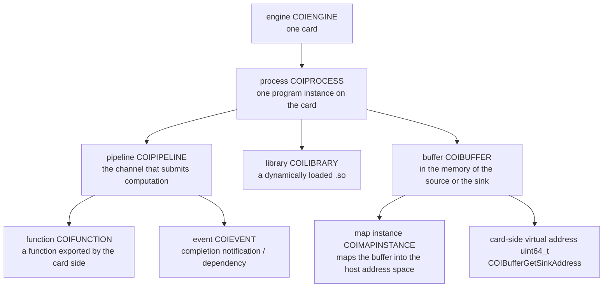
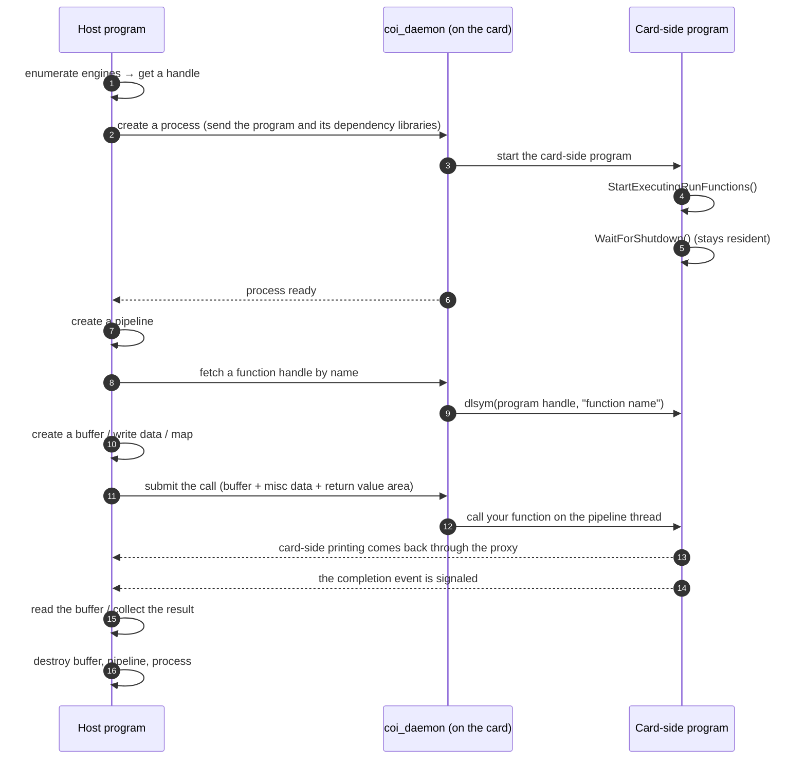
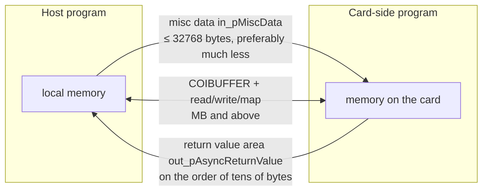
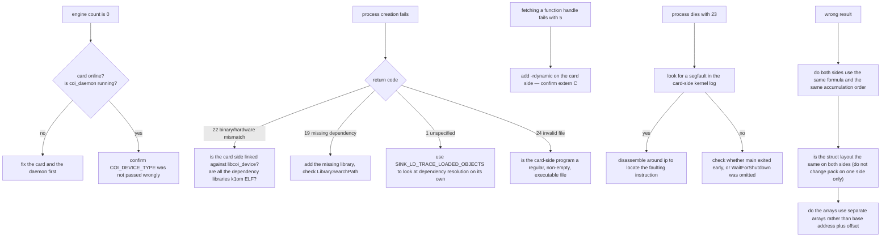

# KNC offload Programming Manual

## Using and Referencing the COI (Coprocessor Offload Infrastructure) API

> **What this manual covers.** It covers COI, the offload programming interface of the Intel Xeon Phi (codenamed Knights Corner, called KNC below): which APIs exist on each of the two sides, host and card, how each API is used, how data gets across, how threads are arranged, how pointers are managed, and how to investigate errors. The organisation is driven by **capability** (to move large amounts of data, see Chapter 15; to allocate space on the card, see Chapter 11; to start threads, see Chapter 8; to manage card-side pointers, see Chapter 12), while the API-by-API explanation sits in Part 7 for reference.
>
> **Basis.** Everything here is taken from the COI headers shipped with Intel MPSS 3.8.6 (the `source/`, `sink/` and `common/` groups under `intel-coi/`) and from the man pages shipped with it (`docs/man/`, 66 pages, one function per page). The semantics, parameters and return values of an API always follow the headers and the man pages; any item this manual marks as "measured" is behaviour verified on a real KNC card, and see also Appendix E.
>
> **Assumed background.** You can write C or C++, you understand compilation, linking and multithreading on Linux, and you know what cross-compilation is. No prior knowledge of offload is needed.
>
> **Conventions.** Code identifiers, function names, constants and type names are kept exactly as they are. The body text uses the manual's own terms; the term-by-term mapping to their English forms is in Appendix B. Pointer asterisks in function prototypes are kept as the headers write them. Constructs of the form `<MPSS prefix>` and `<COI install prefix>` are placeholders — substitute your actual installation.

### Find a Chapter by Question

| What I want to know | Which chapter |
|---|---|
| How to write the first program that runs | Chapters 2 and 3 |
| How to get a large amount of data onto the card and back | Chapters 10 and 13, **Chapter 15** |
| How to allocate memory on the card | Chapter 11 §11.3, §11.4 |
| How the host holds and uses "an address on the card" | **Chapter 12** |
| How to start threads on the card, and how to bind threads to cores | Chapter 8 |
| How to make several operations run in order (dependencies) | Chapter 18 |
| How to wait for results, and how to use asynchrony | Chapter 16 |
| What a card-side function should look like | Chapter 7 |
| What the parameters of some API mean | Part 7 (Chapters 23 to 31) |
| What some return code means | Chapter 19 |
| The program fails at the very first step | Chapters 20 and 21 |
| How to tune performance | Chapter 22 |

---

# Part 1 — Model and First Steps

## 1 Object Model

### 1.1 The Two Sides: Host and Card

COI offload consists of two executables, one running on each side. COI officially calls the two sides **source** (the initiating side) and **sink** (the executing side); in this manual they are the **host program** and the **card-side program**.

| | Host program | Card-side program |
|---|---|---|
| Runs on | A Linux host machine with MPSS installed | The KNC card (which runs a Linux of its own) |
| Links against | `libcoi_host` | `libcoi_device` |
| Headers | `intel-coi/source/*.h`, `intel-coi/common/*.h` | `intel-coi/sink/*.h`, `intel-coi/common/*.h` |
| Who starts it | You, by hand | The daemon `coi_daemon` on the card, triggered by the host when it creates the process |
| Entry point convention | An ordinary `main()` | `COIPipelineStartExecutingRunFunctions()` plus `COIProcessWaitForShutdown()` |

The card-side program does **not** have to be deployed to the card by hand: when the host calls the process-creation API, COI ships the card-side program itself, together with the dependency libraries it can read, over to the card, and cleans up when the run ends. The card's root filesystem is a RAM disk that is empty after every reboot, which makes no difference to offload.

### 1.2 The Seven Objects

The whole API revolves around seven kinds of object; apart from events they are all **opaque handles** (pointer types) that can only be manipulated through the API:

| Object | Type | How to obtain it | How to release it |
|---|---|---|---|
| Engine | `COIENGINE` | `COIEngineGetHandle()` | No release needed (a system resource) |
| Process | `COIPROCESS` | `COIProcessCreateFromFile()` / `FromMemory()` | `COIProcessDestroy()` |
| Pipeline | `COIPIPELINE` | `COIPipelineCreate()` | `COIPipelineDestroy()` |
| Function | `COIFUNCTION` | `COIProcessGetFunctionHandles()` | Released with the process |
| Buffer | `COIBUFFER` | `COIBufferCreate()` / `FromMemory()` / `CreateSubBuffer()` | `COIBufferDestroy()` |
| Map instance | `COIMAPINSTANCE` | `COIBufferMap()` | `COIBufferUnmap()` |
| Event | `COIEVENT` | Filled in by an API's output parameter, or `COIEventRegisterUserEvent()` | A user event needs `COIEventUnregisterUserEvent()` |
| Library | `COILIBRARY` | `COIProcessLoadLibraryFromFile()` and the like | `COIProcessUnloadLibrary()` |

The containment relationships between the objects are fixed: an **engine** carries **processes**; a **process** carries **pipelines**, **libraries** and the effective copies of **buffers**; a **pipeline** executes **functions** in order; and **events** tie the whole thing together.



### 1.3 The Life Cycle of One Call



Three places where "the order must not be reversed": the two entry-point calls on the card side have to precede any call (Chapter 7); on the host side you create the process first, then the pipeline, then fetch the function handle (Chapter 6); and the card-side function must already be exported and present in the dynamic symbol table (Chapter 7 §7.3).

## 2 A Minimal Working Program

### 2.1 The Card-side Program

```cpp
/* sink.cpp - the card side */
#include <intel-coi/sink/COIPipeline_sink.h>
#include <intel-coi/sink/COIProcess_sink.h>
#include <intel-coi/common/COIMacros_common.h>
#include <string.h>

struct Params { long n; };
struct Result { double sum; int threads; };

/* the host fetches this function by name and calls it */
COINATIVELIBEXPORT
void MyKernel(uint32_t        in_BufferCount,
              void          **in_ppBufferPointers,
              uint64_t       *in_pBufferLengths,
              void           *in_pMiscData,
              uint16_t        in_MiscDataLength,
              void           *in_pReturnValue,
              uint16_t        in_ReturnValueLength)
{
    (void)in_BufferCount; (void)in_ppBufferPointers; (void)in_pBufferLengths;

    Result *r = (Result *)in_pReturnValue;
    if (!r || in_ReturnValueLength < sizeof(*r)) return;   /* validate before writing */
    memset(r, 0, sizeof(*r));

    Params p;
    if (!in_pMiscData || in_MiscDataLength < sizeof(p)) return;  /* validate before reading */
    memcpy(&p, in_pMiscData, sizeof(p));

    double s = 0.0;
    for (long i = 0; i < p.n; i++) { double x = (double)i / (double)p.n; s += x * x; }
    r->sum     = s;
    r->threads = 1;
}

int main(int, char **)
{
    COIPipelineStartExecutingRunFunctions();   /* no call will be executed before this */
    COIProcessWaitForShutdown();               /* stay resident until the host destroys this process */
    return 0;
}
```

### 2.2 The Host Program

```cpp
/* host.cpp - the host side */
#include <intel-coi/source/COIEngine_source.h>
#include <intel-coi/source/COIProcess_source.h>
#include <intel-coi/source/COIPipeline_source.h>
#include <intel-coi/source/COIEvent_source.h>
#include <intel-coi/common/COIResult_common.h>
#include <stdio.h>
#include <string.h>

struct Params { long n; };
struct Result { double sum; int threads; };

#define CHECK(e) do { COIRESULT r_ = (e); if (r_ != COI_SUCCESS) {          \
    printf("failure: %s -> %s(%d)\n", #e, COIResultGetName(r_), (int)r_);   \
    return 1; } } while (0)

int main(int argc, char **argv)
{
    const char *sink = (argc > 1) ? argv[1] : "./sink";
    const char *libs = (argc > 2) ? argv[2] : NULL;   /* directory of k1om dependency libraries */

    uint32_t n_engines = 0;
    CHECK(COIEngineGetCount(COI_DEVICE_MIC, &n_engines));
    if (n_engines < 1) { printf("no engine available\n"); return 1; }

    COIENGINE engine = NULL;
    CHECK(COIEngineGetHandle(COI_DEVICE_MIC, 0, &engine));

    COIPROCESS proc = NULL;
    CHECK(COIProcessCreateFromFile(engine, sink, 0, NULL, false, NULL,
                                   true, NULL, 0, libs, &proc));

    COIPIPELINE pipe = NULL;
    CHECK(COIPipelineCreate(proc, NULL, 0, &pipe));

    const char *fname = "MyKernel";
    COIFUNCTION func = NULL;
    CHECK(COIProcessGetFunctionHandles(proc, 1, &fname, &func));

    Params in;  memset(&in, 0, sizeof(in));  in.n = 1000000;
    Result out; memset(&out, 0, sizeof(out));
    COIEVENT ev;

    CHECK(COIPipelineRunFunction(pipe, func, 0, NULL, NULL, 0, NULL,
                                 &in, (uint16_t)sizeof(in),
                                 &out, (uint16_t)sizeof(out), &ev));
    CHECK(COIEventWait(1, &ev, -1, 0, NULL, NULL));

    printf("result from the card: sum=%.12f threads=%d\n", out.sum, out.threads);

    CHECK(COIPipelineDestroy(pipe));
    CHECK(COIProcessDestroy(proc, -1, 0, NULL, NULL));
    return 0;
}
```

### 2.3 Building and Running

```bash
# card side (cross-compile; -rdynamic is mandatory)
<k1om cross compiler> -O2 -rdynamic -I<k1om sysroot>/usr/include sink.cpp \
    -L<k1om sysroot>/usr/lib64 -lcoi_device \
    -lpthread -ldl -lrt -Wl,-rpath,/tmp -o sink

# host side (compiled natively)
g++ -O2 -I<COI install prefix>/include host.cpp -o host \
    -L<COI install prefix>/lib64 -lcoi_host -Wl,-rpath,<COI install prefix>/lib64

# run: the host's arguments are, in order, the card-side program path and the k1om library directory
./host ./sink <k1om library directory>
```

| Point | Why |
|---|---|
| `-rdynamic` is mandatory on the card side | The exported symbol has to enter the dynamic symbol table, or the card-side `dlsym` cannot find it (§7.3) |
| Card side needs `-Wl,-rpath,/tmp` | At run time COI places the card-side program and its dependency libraries under `/tmp` on the card |
| The host's last two arguments | The first is the card-side program path (readable on the host), the second is the k1om dependency library directory (COI validates the ELF machine type of every one of them) |
| The host need not be root | The device only has to be readable and writable (§3.3) |

The three things you run into most often while getting started: `COIProcessCreateFromFile` reports `COI_BINARY_AND_HARDWARE_MISMATCH(22)` (the card-side program is not linked against `libcoi_device`, or the dependency library directory holds a non-k1om library); `COIProcessGetFunctionHandles` reports `COI_DOES_NOT_EXIST(5)` (`-rdynamic` is missing); and after the run `COI_PROCESS_DIED(23)` (the card-side function crashed — go and read the kernel log on the card). All three are worked through in Chapter 20.

## 3 Headers, Libraries and Runtime Environment

### 3.1 Header Groups

| Group | Directory | Contents |
|---|---|---|
| source | `intel-coi/source/` | `COIEngine_source.h`, `COIProcess_source.h`, `COIPipeline_source.h`, `COIBuffer_source.h`, `COIEvent_source.h` — every host-side API |
| sink | `intel-coi/sink/` | `COIPipeline_sink.h`, `COIProcess_sink.h`, `COIBuffer_sink.h` — every card-side API and the export macro |
| common | `intel-coi/common/` | `COITypes_common.h` (base types), `COIResult_common.h` (return codes), `COIEngine_common.h` (device types), `COIEvent_common.h`, `COIMacros_common.h` (CPU mask helpers), `COIPerf_common.h`, `COISysInfo_common.h` |

The host includes both `source/` and `common/`; the card side includes both `sink/` and `common/`. A few interfaces in `common/` can be called from either side (for example `COIEventSignalUserEvent`, `COIEngineGetIndex`, `COISys*` and `COIPerf*`).

### 3.2 Libraries and Symbol Versions

| Library | Used by | How it is linked |
|---|---|---|
| `libcoi_host` | The host | `-lcoi_host`; at run time it needs `LD_LIBRARY_PATH` or an rpath |
| `libcoi_device` | The card side | `-lcoi_device`; the card image ships it |

The host library exports versioned public symbols (such as `COI_1.0`); a third-party implementation stays compatible with the calling conventions in this document as long as it keeps the same names and the same versions.

### 3.3 Runtime Environment

| Item | Description |
|---|---|
| Daemon on the card | `coi_daemon` must already be running (normally it starts with the card). Without it, the engine count is 0 |
| Host device node | The host talks to the card through a character device, and that device has to be readable and writable by its user. The default permissions are usually root-only; once the udev rules shipped with the package are installed, an ordinary user can use it, so **a client program does not need root** |
| Dependency library search | On the host side it is given by `in_LibrarySearchPath` of the process-creation API; on the card side it is decided by `SINK_LD_LIBRARY_PATH` and the rpath (§4.3) |
| Card-side RAM disk | The card's root filesystem is a RAM disk, empty after every reboot; offload never needs to put anything into it |

---

# Part 2 — Processes and Libraries

## 4 Engines and Processes

### 4.1 Enumerating Engines

```c
COI_DEVICE_TYPE: COI_DEVICE_MIC (any member of the MIC family), COI_DEVICE_KNC (Knights Corner),
                COI_DEVICE_KNL (Knights Landing), COI_DEVICE_SOURCE (the initiating side itself)

uint32_t n = 0;
COIEngineGetCount(COI_DEVICE_MIC, &n);        /* how many cards there are */
COIENGINE e = NULL;
COIEngineGetHandle(COI_DEVICE_MIC, 0, &e);    /* card 0; indices start at 0 */
```

| API | Description |
|---|---|
| `COIEngineGetCount` | Returns the number of engines of the given type. Cards attached to the host itself are discovered by the runtime; remote targets reached over fabric are given by the environment variable `COI_OFFLOAD_NODES` (generally not needed in this manual's scenarios) |
| `COIEngineGetHandle` | Fetches a handle by index; an out-of-range index gives `COI_OUT_OF_RANGE` |
| `COIEngineGetInfo` | Fetches device information (a `COI_ENGINE_INFO` structure). **The caller has to pass the structure size** for version checking: a size mismatch gives `COI_SIZE_MISMATCH`. A value that cannot be queried is returned as 0 and the call still succeeds |
| `COIEngineGetHostname` | Fetches the hostname of the remote machine that owns the engine, writing at most 4096 bytes |
| `COIEngineGetIndex` | The reverse query — "which engine is the current code running on"; callable from either side |

As measured: if enumeration returns 0, check the card's state and `coi_daemon` first; do not suspect your code first.

### 4.2 Creating a Process

```c
COIProcessCreateFromFile(COIENGINE     in_Engine,
                         const char   *in_pBinaryName,        /* path of the card-side program (on the host) */
                         int           in_Argc,
                         const char  **in_ppArgv,             /* does not include argv[0] */
                         uint8_t       in_DupEnv,             /* whether to copy the host environment */
                         const char  **in_ppAdditionalEnv,    /* environment variables to append/override */
                         uint8_t       in_ProxyActive,         /* whether to proxy the card-side standard output */
                         const char   *in_Reserved,           /* reserved, pass NULL */
                         uint64_t      in_InitialBufferSpace, /* buffer pool reservation (may be 0) */
                         const char   *in_LibrarySearchPath,  /* dependency library directory on the host */
                         COIPROCESS   *out_pProcess);
```

| Parameter | Values and meaning |
|---|---|
| `in_pBinaryName` | Path of the card-side executable. It must be a regular, non-empty file, otherwise `COI_INVALID_FILE`; if it cannot be found, `COI_DOES_NOT_EXIST` |
| `in_Argc` / `in_ppArgv` | Command-line arguments of the card-side program; `argv[0]` is generated by the runtime, so do not pass it |
| `in_DupEnv` | Set to 1 to copy the host's whole set of environment variables to the card-side process; 0 is more predictable |
| `in_ppAdditionalEnv` | An array of strings of the form `"KEY=VALUE"`, appended/overridden after the environment has been copied |
| `in_ProxyActive` | Set to 1 and the card side's standard output and standard error are **relayed back to the host through the proxy** (a card-side `printf` turns up in the host's output). This is the least troublesome way to debug |
| `in_InitialBufferSpace` | Bytes reserved for the buffer pool; pass 0 when no buffers are used |
| `in_LibrarySearchPath` | **The directory on the host that holds the card side's dependency libraries.** The runtime reads every dependency of the card-side program and validates its ELF machine type; if the directory is wrong or a dependency is missing, this step simply fails (`COI_MISSING_DEPENDENCY` / `COI_BINARY_AND_HARDWARE_MISMATCH`). If it is empty, the environment variable `SINK_LD_LIBRARY_PATH` is used instead |

`COIProcessCreateFromMemory` is the in-memory version of the same operation: instead of a file name you pass an ELF image already read into memory (`in_pBinaryBuffer` and its length), and there are two extra optional parameters, `in_FileOfOrigin` / `in_FileOfOriginOffset` (recording which file and which offset the image came from, which helps with troubleshooting and dependency resolution). Use it when the host cannot get at the card-side program file.

Two environment variables for debugging (set on the host; they take effect when the process is created):

| Variable | Effect |
|---|---|
| `SINK_LD_TRACE_LOADED_OBJECTS` | When set to a non-empty value, only dependency resolution is performed and the result is printed; no process is actually created — use this to investigate "which .so is missing" on its own |
| `SINK_LD_PRELOAD` | A colon-separated list of libraries; when a process is created these libraries are shipped to the card along with it and preloaded |

### 4.3 How Dependency Libraries Are Found

The search order at run time (taken from the description of `COIProcessLoadLibraryFromMemory`): first the current working directory, then `SINK_LD_LIBRARY_PATH` (colon-separated), and finally the search path of the card-side operating system's own dynamic linker. On the host side, `in_LibrarySearchPath` **overrides** `SINK_LD_LIBRARY_PATH`.

The least troublesome approach in practice: put every non-system library the card-side program needs (the OpenMP runtime, say) into one directory on the host, point `-L` at it when compiling the card-side program, and point `in_LibrarySearchPath` at the same directory when creating the process. The card itself does not need those libraries preinstalled.

### 4.4 Destroying a Process

```c
COIProcessDestroy(COIPROCESS in_Process,
                  int32_t    in_WaitForMainTimeout,  /* -1 means wait forever for the card-side main to return */
                  uint8_t    in_ForceDestroy,
                  int       *out_pProcessReturn,     /* return value of the card-side main; may be NULL */
                  uint32_t  *out_pTerminationCode);  /* termination code; may be NULL */
```

`in_WaitForMainTimeout` set to `-1` means wait indefinitely; any other negative value is illegal (`COI_OUT_OF_RANGE`); the combination of `-1` with `in_ForceDestroy = true` is invalid (`COI_ARGUMENT_MISMATCH`). Destroying a process destroys every pipeline that belongs to it along with it.

## 5 Dynamic Libraries, Notifications and Runtime Configuration

### 5.1 Loading and Unloading Libraries in a Card-side Process

| API | Purpose |
|---|---|
| `COIProcessLoadLibraryFromFile(proc, file name, library name, search path, COILIBRARY *out)` | Loads a shared library from the host filesystem into the card-side process; equivalent to a card-side `dlopen` |
| `COIProcessLoadLibraryFromFileV2(..., uint32_t in_Flags, ...)` | The same, with one more flags argument (passed on as the card-side `dlopen` flag) |
| `COIProcessLoadLibraryFromMemory(proc, buffer, length, library name, search path, file of origin, offset, COILIBRARY *out)` | Loads from an in-memory image |
| `COIProcessLoadLibraryFromMemoryV2(..., uint32_t in_Flags, ...)` | The same, with flags |
| `COIProcessUnloadLibrary(proc, COILIBRARY)` | Unloads |
| `COIProcessRegisterLibraries(n, library array, size array, origin array, offset array)` | Registers libraries that are **already in the host process's memory**, so that a later process creation or library load that hits the same dependency uses them instead of looking on disk. The library must have a `DT_SONAME` |

The card's `libcoi_device` also provides a card-side version of the loading interface, `COIProcessLoadSinkLibraryFromFile` (in `sink/COIProcess_sink.h`), for the card-side program to load libraries with itself.

### 5.2 Notification Callbacks

The runtime calls back into a function you register whenever one of its internal events occurs, so that you do not have to poll:

```c
typedef void (*COI_NOTIFICATION_CALLBACK)(COI_NOTIFICATIONS in_Type,
                                          COIPROCESS        in_Process,
                                          COIEVENT          in_Event,
                                          const void       *in_UserData);

COIRegisterNotificationCallback(proc, cb, user_data);   /* registered per process; the same pointer cannot be registered twice */
COIUnregisterNotificationCallback(proc, cb);
COINotificationCallbackSetContext(user_data);           /* sets the context the callback receives */
```

Three rules that matter: a callback has to be **short and non-blocking**, because it is called on a runtime thread and is equivalent to an interrupt handler; **do not call `COIEventWait` inside a callback** (it deadlocks almost immediately); and the runtime guarantees that the callback for an internal event runs before the corresponding event is signaled, so from inside a callback you can see information "earlier than the return of `COIEventWait`".

### 5.3 The Output Proxy

What the card-side program prints has to be relayed back to the host before you can see it. Two ways: set `in_ProxyActive` to 1 when creating the process (recommended); or have the card side call `COIProcessProxyFlush()` at key points to make sure the output is written out by the host before the function returns. Note that what the host side writes out is the runtime's standard output, and **an automatic flush is not guaranteed**, so flush on the host yourself when necessary.

### 5.4 DMA Channels and Caching

| API | Effect |
|---|---|
| `COIProcessConfigureDMA(in_Channels, in_Mode)` | Sets how many logical DMA channels the processes created afterwards use. One channel by default; four at most, of which the current implementation actually uses two. **It must be called before a process is created**, and it has no effect on existing processes. More channels give better DMA parallelism, but creating buffers becomes more expensive |
| `COIProcessSetCacheSize(proc, huge page pool bytes, huge page flags, 4K pool bytes, 4K flags, number of dependencies, dependency array, completion event)` | Adjusts the cache limit of the card-side buffer pool (1 GB by default). Larger buys throughput, smaller saves memory; a buffer that is used once and then thrown away suits a small cache |

---

# Part 3 — Computation and Threads

## 6 Pipelines and Function Calls

### 6.1 Creating a Pipeline

```c
COIPipelineCreate(COIPROCESS   in_Process,
                  COI_CPU_MASK in_Mask,      /* the set of hardware threads the pipeline's handler thread may run on; pass NULL if not needed */
                  uint32_t     in_StackSize, /* stack of the pipeline's handler thread; 0 uses the system default */
                  COIPIPELINE *out_pPipeline);
```

| Constraint | Description |
|---|---|
| Mask | An all-zero mask is illegal (`COI_OUT_OF_RANGE`) — pass `NULL` if you do not want one |
| Stack | When non-zero it must be ≥ `PTHREAD_STACK_MIN` (16384) and an integer multiple of the page size (4096) |
| Count | The limit is `COI_PIPELINE_MAX_PIPELINES` (512); Intel advises not to exceed the number of cores on the card, or performance drops |
| Order | **Calls on the same pipeline execute in enqueue order**; order is not guaranteed across pipelines |

### 6.2 Fetching a Function Handle

```c
const char *names[1] = { "MyKernel" };
COIFUNCTION func = NULL;
COIProcessGetFunctionHandles(proc, 1, names, &func);
```

The precondition is that the card-side function is **already exported and present in the dynamic symbol table**: declare it with `extern "C"` (or `COINATIVELIBEXPORT`), and add `-rdynamic` when linking the card-side program. A C++ name must either be `extern "C"` or be passed in its mangled form. Several names can be fetched at once; if some of them cannot be found, the return value is `COI_DOES_NOT_EXIST`, the handle for the name that was not found is `NULL`, and the rest are still valid.

### 6.3 Submitting a Call

```c
COIPipelineRunFunction(COIPIPELINE            in_Pipeline,
                       COIFUNCTION            in_Function,
                       uint32_t               in_NumBuffers,
                       const COIBUFFER       *in_pBuffers,
                       const COI_ACCESS_FLAGS *in_pBufferAccessFlags,
                       uint32_t               in_NumDependencies,
                       const COIEVENT        *in_pDependencies,
                       const void            *in_pMiscData,
                       uint16_t               in_MiscDataLen,
                       void                  *out_pAsyncReturnValue,
                       uint16_t               in_AsyncReturnValueLen,
                       COIEVENT              *out_pCompletion);
```

| Parameter | Meaning |
|---|---|
| `in_NumBuffers` / `in_pBuffers` / `in_pBufferAccessFlags` | The buffers this call uses and their access flags (§11.5). `in_NumBuffers` is capped at `COI_PIPELINE_MAX_IN_BUFFERS` (16384); either give all three or give none of them |
| `in_NumDependencies` / `in_pDependencies` | The events this call depends on: it waits until all of them are signaled before executing. Use this to string together the order "write the buffer, then compute, then read it back" |
| `in_pMiscData` / `in_MiscDataLen` | The misc data. The limit is `COI_PIPELINE_MAX_IN_MISC_DATA_LEN` (**32768 bytes**); the header explicitly advises that it "should usually be far smaller than this", because it is placed in the driver's command buffer. Give one and you must give the other |
| `out_pAsyncReturnValue` / `in_AsyncReturnValueLen` | The return value area, where the card-side function writes its result. **Do not read it before the completion event is signaled** |
| `out_pCompletion` | The completion event. Pass `NULL` and this call executes synchronously and is complete when it returns; pass it and the call is asynchronous, to be waited on through the event |

Three risks Intel calls out: a wrong dependency forms a cycle and hangs the pipeline, or even the whole runtime; the call crashes when card-side memory runs short (buffers that have been AddRef'd hold on to memory without releasing it); and **if a misc data variable or a buffer handle is destroyed or changed before the call completes, the behaviour is undefined** — so wait for the completion event before destroying the objects involved.

### 6.4 Destroying a Pipeline

`COIPipelineDestroy()` waits for every call already enqueued on that pipeline to finish executing. **If a call never executes because its dependencies form a cycle, the destroy hangs along with it.**

## 7 The Contract of a Card-side Function

### 7.1 The Signature and Its Seven Parameters

```c
typedef void (*RunFunctionPtr_t)(uint32_t  in_BufferCount,
                                 void    **in_ppBufferPointers,
                                 uint64_t *in_pBufferLengths,
                                 void     *in_pMiscData,
                                 uint16_t  in_MiscDataLength,
                                 void     *in_pReturnValue,
                                 uint16_t  in_ReturnValueLength);
```

| Parameter | Meaning |
|---|---|
| `in_BufferCount` | The number of buffers this call carries |
| `in_ppBufferPointers` | An array holding the **card-side virtual address** of each buffer (see Chapter 12) |
| `in_pBufferLengths` | An array holding the byte length of each buffer. Note that the prototype is `uint64_t *` while the header's explanatory comment writes `uint32_t` — the prototype wins |
| `in_pMiscData` / `in_MiscDataLength` | Pointer and length of the misc data |
| `in_pReturnValue` / `in_ReturnValueLength` | Pointer and length of the return value area |

Two "the header wins" cases that are easy to trip over: the function **returns `void`** (the sentence in the explanatory comment — "returns `uint64_t`, retrievable through `out_UserData` of `COIPipelineWaitForEvent`" — is a leftover from an older revision, and that function no longer exists in the current headers); and the third parameter is `uint64_t *`, not `uint32_t *`.

### 7.2 What to Do Inside the Function Body

Every card-side function should open with these two checks — the lengths come from the host, so getting one wrong means an out-of-bounds access, and on the card an out-of-bounds access shows up as a process crash while the host sees only a generic error code:

```c
Result *r = (Result *)in_pReturnValue;
if (!r || in_ReturnValueLength < sizeof(*r)) return;   /* length too small: give up outright, never write */
memset(r, 0, sizeof(*r));

Params p;
if (!in_pMiscData || in_MiscDataLength < sizeof(p)) return;
memcpy(&p, in_pMiscData, sizeof(p));                   /* copy locally before use */
```

The remaining practical points: `memcpy` the misc data into a local variable before use (avoiding assumptions about alignment and aliasing); a structure exchanged with the host must have exactly the same fields in exactly the same order on both sides (do not change `#pragma pack` on one side only); use separate arrays rather than simulating multiple dimensions with "base address plus offset" (interleaved aliasing makes the optimizers on the two sides assume different things, and as measured it produces results whose consistency does not match up); and when state has to survive across calls, use a card-side global variable, at the cost of the function no longer being reentrant.

### 7.3 Exporting Symbols

| Condition | If it is not met | What to do |
|---|---|---|
| C linkage | The card side cannot find the symbol by name | Use `extern "C"`; `COINATIVELIBEXPORT` already includes `extern "C"` and default visibility |
| The symbol enters the dynamic symbol table | `COI_DOES_NOT_EXIST(5)` | Add `-rdynamic` when linking the card-side program (equivalent to `-Wl,--export-dynamic`) |

Self-check:

```bash
readelf --dyn-syms sink | grep MyKernel     # expect to see FUNC GLOBAL DEFAULT … MyKernel
readelf -d sink | grep NEEDED               # are the dependencies all present
```

### 7.4 Staying Resident and Shutting Down

`main` must stop in `COIProcessWaitForShutdown()`, or the host sees `COI_PROCESS_DIED(23)`. After it receives the host's destroy message, that function stops scheduling new calls, waits for calls already executing to finish, cleans up COI resources, and then returns; it **does not call `exit()`**, so once it returns you can do your own finalisation, but **do not call any COI API again**.

## 8 Threads and Affinity

### 8.1 COI Does Not Start Threads Itself

COI has no "create a thread" API — parallelism on the card comes from two places:

1. **Threads the card-side program starts itself**: a card like KNC is a few dozen in-order cores with several hardware threads per core (a common configuration is 61 cores × 4 ways), and the usual approach is OpenMP or pthreads. Add `-fopenmp` when linking and link against the card-side OpenMP runtime (`libgomp`), and `#pragma omp parallel for` works as usual.
2. **The handler thread the runtime starts for each pipeline**: `COIPipelineCreate` establishes a command-handling thread for the pipeline, and you specify its **stack size** and the **set of hardware threads it may run on** (the CPU mask). Calls on the same pipeline execute in order on that thread.

So "starting a thread on the card" usually means the first kind; the second is a way of controlling which cores a call runs on.

### 8.2 CPU Masks

`COI_CPU_MASK` is a 1024-bit bitmap (`uint64_t[16]`), and the runtime defines how bit numbers correspond to "core:thread". It has two uses:

```c
COI_CPU_MASK mask;
COIPipelineClearCPUMask(mask);                 /* you must clear it first: a mask variable's initial value is not guaranteed to be 0 */
COIPipelineSetCPUMask(proc, core, thread, mask);  /* add one core:thread to the mask */

COIPIPELINE pipe;
COIPipelineCreate(proc, mask, 0, &pipe);       /* the pipeline's handler thread runs only on these hardware threads */
```

`COIMacros_common.h` also provides a group of helpers that operate on the bitmap directly, similar to Linux's `CPU_*` macros but acting on a `COI_CPU_MASK`:

| Function | Effect |
|---|---|
| `COI_CPU_MASK_SET(bit, mask)` / `COI_CPU_MASK_ISSET(bit, mask)` | Set / test |
| `COI_CPU_MASK_ZERO(mask)` | Clear |
| `COI_CPU_MASK_AND` / `_OR` / `_XOR` (`dst, src1, src2`) | Bitwise operations |
| `COI_CPU_MASK_COUNT(mask)` / `COI_CPU_MASK_EQUAL(a, b)` | Count / compare |
| `COI_CPU_MASK_XLATE(dst, const cpu_set_t *)` / `COI_CPU_MASK_XLATE_EX(cpu_set_t *, src)` | Convert to and from Linux's `cpu_set_t` |

As measured: an explicit mask is easy to get wrong on a card with many cores, and an empty mask is an outright error. **When you do not need to pin cores, always pass `NULL`** and leave scheduling to the runtime.

### 8.3 Multithreading on the Host Side

The host's concurrency model is "**one thread, one pipeline**": a pipeline is ordered internally, and pipelines run in parallel with one another. Three pieces of experience:

- Each pipeline has its own enqueue order, so put work that must happen in sequence into the same pipeline, or order it explicitly with dependency events (Chapter 18).
- Do not use more pipelines than the card has cores; that is Intel's advice as well.
- Several host threads sharing one `COIPROCESS` is allowed; but remember that this only makes sense if the card-side function is reentrant, otherwise string the calls together with dependencies or a mutex.

## 9 Card-side System Information and Timing

The following can be **called from either side**; called on the card side they give the card's information, called on the host they give the host's. Use them to query things in portable card-side code rather than hard-coding numbers.

| API | Returns |
|---|---|
| `COISysGetCoreCount()` | The core count |
| `COISysGetCoreIndex()` | Which core the current code is running on (0-based) |
| `COISysGetHardwareThreadCount()` | The total number of hardware threads |
| `COISysGetHardwareThreadIndex()` | The index of the current hardware thread |
| `COISysGetL2CacheCount()` / `COISysGetL2CacheIndex()` | The number of L2 caches / which L2 the current code is in |
| `COISysGetAPICID()` | The APIC ID of the current hardware thread (unique, but not guaranteed to be contiguous) |
| `COIPerfGetCycleCounter()` | A constant-rate cycle counter that is consistent across cores |
| `COIPerfGetCycleFrequency()` | The frequency of that counter (in hertz) |

Use them to measure time: `(difference of COIPerfGetCycleCounter()) / COIPerfGetCycleFrequency()` gives seconds. For timing card-side OpenMP code, `omp_get_wtime()` will do; estimate computing power as the actual floating-point work divided by the elapsed time.

---

# Part 4 — Data Channels

## 10 Overview of the Three Channels



| Channel | What it is good for | Capacity | How it is synchronized |
|---|---|---|---|
| Misc data | Parameters, small-scale metadata | Limit of 32768 bytes (`COI_PIPELINE_MAX_IN_MISC_DATA_LEN`) | Submitted with the call, inherently synchronous |
| Return value area | Results, statistics, checksums | There is no published constant; keep it to tens of bytes in practice | Readable once the completion event is signaled |
| Buffer | Arrays, matrices, arbitrary large data | Limited by the memory available on the card | Read / write / map + access flags + events |

Choosing between them comes down to one sentence: **do not move data when a parameter will do; do not move it twice when once will do; and take the buffer route for anything of MB size and above.**

## 11 Buffers: Allocating and Managing Memory on the Card

### 11.1 What a Buffer Is

`COIBUFFER` is COI's managed-memory object, used across both sides. Its key properties (taken from the header):

- **The data resides in the physical memory of the source or the sink at any one point in time** (from the description of `COI_BUFFER_NORMAL`), and the runtime moves it about according to how it is accessed;
- creation **reserves address space**, and the physical memory may not be committed until first use;
- a buffer is associated with **processes** (`in_NumProcesses` / `in_pProcesses`), and one buffer can be associated with several card-side processes;
- for some buffer types the runtime allocates extra **shadow memory** on the source side, and that memory is freed only when the buffer is destroyed.

### 11.2 Creation: `COIBufferCreate`

```c
COIBufferCreate(uint64_t          in_Size,        /* bytes; rounded up if not page-aligned */
                COI_BUFFER_TYPE   in_Type,        /* see below */
                uint32_t          in_Flags,       /* see below */
                const void       *in_pInitData,   /* initial value, may be NULL; when non-NULL, at least in_Size bytes */
                uint32_t          in_NumProcesses,
                const COIPROCESS *in_pProcesses,  /* which card-side processes may use this buffer */
                COIBUFFER        *out_pBuffer);
```

| Type | Semantics |
|---|---|
| `COI_BUFFER_NORMAL` (value 1) | An ordinary buffer; mapping it may stall the pipeline, and it respects read/write dependencies |
| `COI_BUFFER_OPENCL` | Similar to the ordinary type, but it does not stall the pipeline and does not respect read/write dependencies |

| Flag | Value | Semantics |
|---|---|---:|---|
| `COI_SAME_ADDRESS_SINKS` | 0x001 | The same address in every associated card-side process (handy for passing the address as a parameter) |
| `COI_SAME_ADDRESS_SINKS_AND_SOURCE` | 0x002 | The same on the host side too (**in this case the host may dereference that address directly**) |
| `COI_OPTIMIZE_SOURCE_READ` / `_SOURCE_WRITE` | 0x004 / 0x008 | A hint to the runtime: the host reads / writes frequently |
| `COI_OPTIMIZE_SINK_READ` / `_SINK_WRITE` | 0x010 / 0x020 | A hint to the runtime: the card side reads / writes frequently |
| `COI_OPTIMIZE_NO_DMA` | 0x040 | Defers pinning pages until a real DMA happens. Note that with it enabled **read-only memory cannot be detected at creation time**; the problem is pushed later, so always use writable memory |
| `COI_OPTIMIZE_HUGE_PAGE_SIZE` | 0x080 | Hints that the card side should back the buffer with huge pages (incompatible with SAME_ADDRESS and SINK_MEMORY; a buffer that is too small is not promoted) |
| `COI_SINK_MEMORY` | 0x100 | **Valid only in `COIBufferCreateFromMemory`**: it says that this memory is already allocated on the card (§11.4) |

The legal combinations of `in_Type` and `in_Flags` are given by the `COI_VALID_BUFFER_TYPES_AND_FLAGS` matrix in the header: `COI_BUFFER_NORMAL` supports every flag except `COI_SINK_MEMORY` (which is specific to FromMemory); `COI_BUFFER_OPENCL` does not support `COI_SINK_MEMORY`. An illegal combination gives `COI_ARGUMENT_MISMATCH`.

### 11.3 Three Ways to Allocate Space on the Card

| Route | How to do it | Where the data actually is | Suits |
|---|---|---|---|
| One: leave it to the runtime | `COIBufferCreate()` makes an ordinary buffer | The runtime decides (it moves the data between the two sides according to access) | The default choice |
| Two: use the card side's own memory | The card-side program `malloc`s a block and tells the host the address (through the return value area, say), and the host then wraps it in a buffer with `COIBufferCreateFromMemory()` + `COI_SINK_MEMORY` | On the card | The card side already has a large block of memory (taken from OpenMP's allocator or a huge page pool, for instance) and you do not want the runtime to allocate a second copy |
| Three: manage your own memory yourself | No buffer at all: the host ships the data in batches through the misc data, or the card side generates it from the parameters | On the card (allocated by the card side) | The data can be computed (initial values, a grid, a random field), so it does not really have to be moved |

The second route has one hard constraint: with `COI_SINK_MEMORY`, `in_NumProcesses` **must be 1** (the buffer belongs to that one card-side process only). Data already present in the memory at creation time is preserved, and `COIBufferDestroy` does not clear it either.

### 11.4 Creating from Existing Memory: `COIBufferCreateFromMemory`

```c
COIBufferCreateFromMemory(uint64_t          in_Size,
                          COI_BUFFER_TYPE   in_Type,      /* only NORMAL and (OPENCL) are supported */
                          uint32_t          in_Flags,
                          void             *in_Memory,    /* existing memory; with SINK_MEMORY this is a card-side virtual address */
                          uint32_t          in_NumProcesses,
                          const COIPROCESS *in_pProcesses,
                          COIBUFFER        *out_pBuffer);
```

| Item | Description |
|---|---|
| Ownership of the memory | `COI_SINK_MEMORY` not set: this memory serves as the buffer's backing store on the **host side** (that is, the data lands in host memory first). Set: the memory is used on the **card side** (`in_Memory` is a card-side address), and `in_NumProcesses` must be 1 |
| Lifetime | The memory is still yours, but **it must not be freed before `COIBufferDestroy`** |
| How it is accessed | It has to be accessed through buffer semantics (`COIBufferMap` / `Unmap`, the read and write APIs, a call carrying access flags), otherwise the runtime does not know the data was changed and the change may not be visible |
| Read-only memory | Not supported (`COI_NOT_SUPPORTED`) |
| Data retention | Whatever is already in the memory at creation time is preserved; it is preserved when the buffer is destroyed as well |

### 11.5 Access Flags: `COI_ACCESS_FLAGS`

When a buffer is passed to `COIPipelineRunFunction` you have to state how the card side will access it — these flags **affect correctness**, not just optimization:

| Flag | Meaning |
|---|---|
| `COI_SINK_READ` | The card side only reads this buffer |
| `COI_SINK_WRITE` | The card side writes this buffer (the runtime first synchronizes the latest data to the card) |
| `COI_SINK_WRITE_ENTIRE` | The card side overwrites the whole buffer, so **the data does not have to be synchronized to the card before execution** (saving one transfer) |
| `COI_SINK_READ_ADDREF` / `COI_SINK_WRITE_ADDREF` / `COI_SINK_WRITE_ENTIRE_ADDREF` | The same, and the buffer's **reference count is held** after the function returns (used together with the card-side `COIBufferAddRef`, §14.2) |

An example of why they have to be got right: if one call is marked `COI_SINK_READ` and the host later does `COIBufferMap` to read the same buffer, the runtime may use a cached copy directly instead of going to the card for the genuinely new data.

## 12 Host-side Management of Card-side Pointers

This chapter answers one concrete question: **how does the host side get hold of that block of memory on the card, how does it use it, and when does it stop being valid?** COI offers three ways of "getting hold of a card-side address or card-side data", with different purposes.

### 12.1 Way One: Card-side Virtual Address (pass it around, do not dereference it)

```c
uint64_t sink_addr = 0;
COIBufferGetSinkAddress(buffer, &sink_addr);            /* single-process version */

COIPROCESS proc = ...;
COIBufferGetSinkAddressEx(proc, buffer, &sink_addr);    /* specify a process; proc = 0 means the first valid process */
```

| Property | Description |
|---|---|
| What it is | The buffer's **virtual address on the card side**, the same value the card-side function receives in `in_ppBufferPointers[i]` |
| Stability | **Fixed**: the same buffer has the same address in different calls, so it can be cached |
| Can the host dereference it? | **No** (unless the buffer was created with the `COI_SAME_ADDRESS_SINKS_AND_SOURCE` flag) |
| Typical uses | Pass the address to the card side as a parameter (through the misc data) so that the card side remembers a block of memory across calls; or hand it to the card-side `COIBufferAddRef` / `ReleaseRef` |

In one sentence: `GetSinkAddress` gives you a **pointer in the card's world**; the host should only carry it about as a number, never dereference it.

### 12.2 Way Two: Mapping (moving card-side data into the host address space)

```c
COIMAPINSTANCE map = NULL;
void *p = NULL;

COIBufferMap(buffer, offset, length, COI_MAP_READ_WRITE,
             0, NULL,            /* number of and array of dependency events */
             &ev,                /* completion event; pass NULL and this call blocks until the mapping is done */
             &map, &p);

COIEventWait(1, &ev, -1, 0, NULL, NULL);
/* now the length bytes p points at can be read and written */

COIBufferUnmap(map, 0, NULL, NULL);
/* after this step p is invalid; do not touch it again */
```

| Point | Description |
|---|---|
| Map type | `COI_MAP_READ_WRITE`: both reads and writes are reflected back; `COI_MAP_READ_ONLY`: read-only, and what you write is not retained (which lets the runtime optimize significantly); `COI_MAP_WRITE_ENTIRE_BUFFER`: you promise to overwrite the whole block, so old data need not be synchronized from the card (also a significant optimization) |
| The returned pointer | The memory it points at **is prepared for you on the host side by the runtime** (possibly a buffer it manages); it is not the physical address on the card |
| Validity | From the completion of the map until `COIBufferUnmap`. In between you may not read it (if you used the asynchronous form), nor may you keep using it after the unmap |
| Mapping several times | Several regions of the same buffer can be mapped at the same time (overlapping or not), and each unmap corresponds one-to-one with one map |
| Relation to destruction | While a mapping is still un-unmapped, `COIBufferDestroy` returns `COI_RETRY`; you have to unmap first |
| Concurrency with the card side | If the card side also accesses the same region during the mapping, the result is undefined; use events to separate them in order |

### 12.3 Way Three: Read / Write (explicit transfer, taking up no host address space)

```c
COIBufferWrite(buffer, offset, src, length, COI_COPY_UNSPECIFIED,
               0, NULL, &ev);        /* host memory → buffer */
COIBufferRead (buffer, offset, dst, length, COI_COPY_UNSPECIFIED,
               0, NULL, &ev);        /* buffer → host memory */
```

Compared with mapping: read / write does not require you to manage a map instance, and the data does not have to occupy a stretch of the host address space; it suits the "move it in one go and be done" case. Neither of the two **respects a buffer's implicit dependencies** — if the same buffer is being used in a call at that moment, the read / write still executes immediately, so when order matters you have to impose it explicitly with event dependencies.

### 12.4 Choosing Between the Three Ways

| Way | Does data move? | Can the host read and write it directly? | When to use it |
|---|---|---|---|
| `COIBufferGetSinkAddress` | No | No | You only need to pass a card-side address around as a parameter |
| `COIBufferMap` / `Unmap` | Yes (synchronized on demand) | Yes (before the unmap) | You need to work on the data directly on the host side, and may access the same block repeatedly |
| `COIBufferRead` / `Write` | Yes | Not involved (it goes into your own memory) | A one-off transfer of a whole block |

### 12.5 Lifetime Rules for Pointers and Handles

1. A **handle** (`COIBUFFER`) is held by the host and used in every buffer API; a **card-side address** (`uint64_t`) is used by the card side — do not mix the two.
2. A card-side address is fixed and can be cached; but once the corresponding buffer is destroyed, that address is void.
3. Whether the buffer pointer passed to a card-side function (`in_ppBufferPointers`) is still valid **after that function returns** depends on whether you `AddRef`'d: without an AddRef it is valid only within this call (§14.2).
4. A host pointer obtained from a mapping becomes invalid immediately after `Unmap`.
5. The memory of the misc data and of the return value area may be reused or freed only after the call's completion event is signaled.

## 13 Read, Write, Copy and Sub-buffers

| API | Direction | Description |
|---|---|---|
| `COIBufferWrite(buffer, offset, src, len, type, dependencies, completion event)` | host memory → buffer | Writes data into the buffer; a write makes that buffer exclusively valid at the write point and invalidates the other copies |
| `COIBufferWriteEx(buffer, proc, offset, src, len, ...)` | As above, with a target process | Updates the data in the given process only, and invalidates the copies in the other processes |
| `COIBufferRead(buffer, offset, dst, len, type, ...)` | buffer → host memory | |
| `COIBufferReadMultiD(buffer, offset, in_DestArray, in_SrcArray, ...)` | Multi-dimensional version | Supports up to 3 dimensions, and the source and the destination must have the same number of elements |
| `COIBufferWriteMultiD(buffer, proc, offset, in_DestArray, in_SrcArray, ...)` | Multi-dimensional version | As above |
| `COIBufferCopy(dst_buf, src_buf, dst_off, src_off, len, type, ...)` | buffer → buffer | Also supports a copy inside a single buffer, but **overlapping regions report `COI_MEMORY_OVERLAP`**; `len = 0` means copy the whole destination buffer |
| `COIBufferCopyEx(dst_buf, dst_proc, src_buf, ...)` | As above, with a target process | Updates the copy in the given process only |
| `COIBufferCreateSubBuffer(buffer, length, offset, &sub)` | —— | Makes a sub-buffer pointing at a section of the original buffer; a sub-buffer can be used with every API of the original buffer, **but it cannot be used to make a further sub-buffer** |

Copy types (`COI_COPY_TYPE`): `COI_COPY_UNSPECIFIED` (the runtime chooses), `COI_COPY_USE_DMA`, `COI_COPY_USE_CPU`, plus the three `_MOVE_ENTIRE` variants (which in the Ex family of APIs force the whole block to move to the target process even if only part of it was written).

A multi-dimensional array is described with `struct arr_desc`: `base` (the address of the first element; ignored when it is the destination), `rank` (the number of dimensions, at most 3) and `dim_desc[]` (each dimension's `size` / `lindex` / `lower` / `upper` / `stride`). `upper` is defined as `lower + (index of the last element × stride)`.

## 14 Reference Counting and State Transitions

### 14.1 Reference Counting in Both Directions (not interchangeable)

| Direction | API | Effect |
|---|---|---|
| Host | `COIBufferAddRefcnt(proc, buffer, n)` / `COIBufferReleaseRefcnt(proc, buffer, n)` | Increases / decreases "this buffer's reference count in the given process"; while the reference is held the buffer cannot change state or be mapped |
| Card side | `COIBufferAddRef(buffer pointer)` / `COIBufferReleaseRef(buffer pointer)` | Called by the card-side function **within the scope of its own call**, to keep the buffer's memory alive past the return of that function |

Both rules come from the header:

- **Do not mix them**: the host-side `AddRefcnt/ReleaseRefcnt` and the card-side `AddRef/ReleaseRef` are not the same mechanism, and mixing them gives undefined results.
- **Do not call** the card-side `AddRef/ReleaseRef` **from a thread newly started inside a card-side function** (the result is undefined and the data may be corrupted).

### 14.2 Correct Use of Card-side AddRef and the Deadlock Trap

The scenario: card-side function A wants to keep a buffer around for a later call B to use (a pipeline-style multi-round computation, for instance).

```c
/* inside card-side function A */
COIBufferAddRef(in_ppBufferPointers[0]);
/* record this address in some card-side global variable, for later calls to use */
g_saved = in_ppBufferPointers[0];

/* in some later call */
COIBufferReleaseRef(g_saved);       /* the memory is freed only once the count reaches zero and the call that posted it has returned */
```

Two traps: **you have to save the card-side address yourself** (the host-side `COIBUFFER` handle is of no use on the card side, and `ReleaseRef` takes a card-side pointer); and **do not hand a buffer handle that has been AddRef'd back into a call that will `ReleaseRef` it** — that is a circular dependency, and it deadlocks. On top of that, AddRef'd memory keeps occupying card memory, and if the later calls never get their turn you end up in the standoff "memory is filled up → the call cannot execute → the reference cannot be released".

### 14.3 Buffer States

A buffer has a state in each process, which `COIBufferSetState` can set explicitly:

```c
COIBufferSetState(buffer, proc,
                  COI_BUFFER_VALID,     /* state */
                  COI_BUFFER_MOVE,      /* whether to move data */
                  0, NULL, &ev);
```

| State | Meaning |
|---|---|
| `COI_BUFFER_VALID` | The copy in this process is valid and up to date |
| `COI_BUFFER_INVALID` | The copy in this process is invalid and has to be fetched from elsewhere when needed |
| `COI_BUFFER_VALID_MAY_DROP` | Valid, but dropped outright when evicted (treated as a **secondary copy**). The precondition is that a primary copy still exists; with no primary copy the operation is ignored |
| `COI_BUFFER_MOVE` / `COI_BUFFER_NO_MOVE` | Whether dirty data is moved when the state changes |

The second parameter of `COIBufferSetState` also accepts the special value `COI_SINK_OWNERS`, meaning "every card-side process in which this buffer is valid". This API **respects read/write dependencies**: if the buffer is being written in one process and you want to move it to another, it waits for the previous access to finish.

## 15 Designing Large Data Transfers

Putting the earlier chapters together, there are four usable routes for large data transfers, plus a number of points to get right.

### 15.1 The Four Routes

| Route | How to do it | Suits | Cost |
|---|---|---|---|
| **Buffer** | `COIBufferCreate` → `COIBufferWrite` (or `Map` and fill it directly) → pass it into the call with `COI_SINK_READ` | The data has to come from the host; MB size and above | You have to manage the buffer's lifetime |
| **Card-side generation** | The host passes a few dozen bytes of parameters and the card side computes the data with a deterministic formula | Data that can be described — initial values, a grid, a random field | Both sides must use the same formula and the same order (otherwise the consistency does not match up) |
| **Batched misc data** | ≤32 KB of misc data per call, assembled across several calls | Small data, up to a few hundred KB in total | The card side has to keep state across calls |
| **Card-side allocation + FromMemory** | The card side `malloc`s a large block → the address goes back to the host → `COIBufferCreateFromMemory` + `COI_SINK_MEMORY` wraps it as a buffer | The card side already has the memory and you want to avoid a second allocation | `in_NumProcesses` must be 1 |

### 15.2 Making One Transfer Fast

1. **Use `COI_SINK_WRITE_ENTIRE` rather than `COI_SINK_WRITE` whenever you can**: the former saves the step of "synchronize the old data to the card before execution".
2. **Use `COI_MAP_READ_ONLY` when reading back** (or `COI_MAP_WRITE_ENTIRE_BUFFER` when writing down): those two map types let the runtime skip unnecessary synchronization, and Intel's description explicitly says they "can bring significant optimization".
3. **Use a buffer up in one go as far as possible**: repeatedly `Map`ing / `Unmap`ing the same block moves it again and again; when you need repeated access, map rather than read over and over.
4. **Give the hint flags according to the direction of access** (`COI_OPTIMIZE_*`): these are hints to the runtime to put the data on the more suitable side.
5. **Tune the number of DMA channels** (`COIProcessConfigureDMA`, which must precede process creation): several channels let several operations on the same buffer run in parallel, but they also require you to order them yourself with events.
6. **Tune the cache pool** (`COIProcessSetCacheSize`): enlarge the pool when buffers are reused again and again; shrink it when they are used once and thrown away, so that memory is not filled up by the cache.
7. **Use huge pages** (`COI_OPTIMIZE_HUGE_PAGE_SIZE`): promotion to a huge page is possible only when the buffer is large enough (far above 4 KiB).
8. **Overlap transfer with computation**: arrange "write the next chunk" and "compute the current chunk" into two stages with event dependencies, rather than "write it all, then compute, then write again". This is exactly what `out_pCompletion` is there for.

### 15.3 A "Pipelined" Skeleton for a Multi-chunk Transfer

```c
#define NCHUNK 4
COIBUFFER bufs[NCHUNK];
COIEVENT  done[NCHUNK];
for (int i = 0; i < NCHUNK; i++) {
    COIBufferCreate(chunk_bytes, COI_BUFFER_NORMAL, COI_OPTIMIZE_SINK_READ,
                    NULL, 1, &proc, &bufs[i]);
}

for (int i = 0; i < n_chunks; i++) {
    int k = i % NCHUNK;
    if (i >= NCHUNK) {
        /* wait for this slot's previous computation to finish before overwriting it */
        COIEventWait(1, &done[k], -1, 0, NULL, NULL);
    }
    COIBufferWrite(bufs[k], 0, src + (size_t)i * chunk_bytes, chunk_bytes,
                   COI_COPY_UNSPECIFIED, 0, NULL, NULL);   /* synchronous write */
    const char *f = "Kernel";
    COIFUNCTION fn; COIProcessGetFunctionHandles(proc, 1, &f, &fn);
    COIPipelineRunFunction(pipe, fn, 1, &bufs[k], (COI_ACCESS_FLAGS[]){COI_SINK_READ},
                           0, NULL, &i, sizeof(i), NULL, 0, &done[k]);
}
for (int k = 0; k < NCHUNK; k++) COIEventWait(1, &done[k], -1, 0, NULL, NULL);
```

The skeleton demonstrates the key points: **rotating several buffers** (so as not to wait for one transfer), **using completion events for flow control** (waiting for chunk `i`'s previous computation before reusing it) and **synchronous writes** (a write call without a completion event blocks, so the moment it finishes the computation can start). Real code should also make "write the next chunk" asynchronous, to overlap the two further.

---

# Part 5 — Synchronization and Events

## 16 Events and Waiting

### 16.1 Where Events Come From

A `COIEVENT` is filled in by the output parameter of these APIs: `COIPipelineRunFunction` (call complete), `COIBufferMap` / `Unmap` (map / unmap complete), `COIBufferRead` / `Write` / `Copy` (transfer complete) and `COIProcessSetCacheSize`. Beyond those there are "user events", created by `COIEventRegisterUserEvent` (§17).

### 16.2 Waiting

```c
COIEventWait(uint16_t  in_NumEvent,
             const COIEVENT *in_pEvents,
             int32_t   in_TimeoutMilliseconds,   /* -1 means no time limit; 0 means poll once */
             uint8_t   in_WaitForAll,            /* 1 = return when all have arrived, 0 = return when any has arrived */
             uint32_t *out_pNumSignaled,         /* optional: how many events were actually signaled */
             uint32_t *out_pSignaledIndices);    /* optional: indices in the array of the events that were signaled */
```

| Case | Return |
|---|---|
| Wait satisfied (the requirement of `in_WaitForAll` is met) | `COI_SUCCESS` |
| Timed out (in all-mode, not all of them arrived) | `COI_TIME_OUT_REACHED` |
| Timed out (in any-mode, "at least one" was not reached) | `COI_TIME_OUT_REACHED` |
| Timeout of 0 (polling) and nothing is ready | `COI_TIME_OUT_REACHED` |
| Any other negative timeout | `COI_OUT_OF_RANGE` |
| Event count of 0 | `COI_OUT_OF_RANGE` |

The difference between the synchronous and the asynchronous form is only whether a completion event is passed:

```c
COIEVENT ev;
COIPipelineRunFunction(pipe, fn, 0,NULL,NULL, 0,NULL, &in,sizeof(in), &out,sizeof(out), &ev);
/* …do something else… */
COIEventWait(1, &ev, -1, 0, NULL, NULL);     /* asynchronous: wait, then read out */

COIPipelineRunFunction(pipe, fn, 0,NULL,NULL, 0,NULL, &in,sizeof(in), &out,sizeof(out), NULL);
/* synchronous: out is already usable when this returns */
```

### 16.3 Expressing Dependencies with Events

Pass a batch of events to a call and the call waits until all of them are signaled before executing:

```c
COIEVENT deps[2] = { write_done, compute_done };
COIPipelineRunFunction(pipe, fn, 1, &buf, flags, 2, deps, &in, sizeof(in), NULL, 0, &ev);
```

The rules and the traps: dependencies must form a **directed acyclic graph**, and a cycle hangs the pipeline permanently (even `COIPipelineDestroy` hangs); calls within a pipeline are already ordered, so dependencies exist to order things across pipelines and across "transfer and call"; buffer read / write / copy / map **do not respect implicit dependencies**, so wherever order matters you have to supply dependency events explicitly.

## 17 User Events and Callbacks

### 17.1 User Events

```c
COIEVENT uev;
COIEventRegisterUserEvent(&uev);          /* register: a one-shot event that has to be registered again once triggered */
/* trigger it when needed: either the host or the card side may call this */
COIEventSignalUserEvent(uev);
COIEventUnregisterUserEvent(uev);         /* unregister */
```

| Point | Description |
|---|---|
| One-shot | Once triggered it cannot be used again; to use it again you must unregister and register afresh. Registering twice resets the event and loses a signal that has not yet been handled |
| Triggerable from both sides | A user event created by the host can also be triggered by the card side (so it can serve as "the card side notifying the host on its own initiative") |
| Triggering an unregistered or already triggered event | A no-op (NOP), not an error |
| Unregistering an untriggered event | Has an effect similar to triggering, but a `COIEventWait` waiting on that event returns `COI_EVENT_CANCELED` |

### 17.2 Completion Callbacks

```c
void on_done(const COIEVENT *ev, const void *user);   /* for the callback signature see COI_EVENT_CALLBACK */
COIEventRegisterCallback(ev, on_done, user, 0);       /* the fourth parameter is reserved and must be 0 */
```

| Point | Description |
|---|---|
| One-shot | One callback registered per event, fired once |
| Timing | If the event is already complete at registration time, the callback runs **immediately** on the calling thread; otherwise the runtime guarantees that the callback runs before `COIEventWait` becomes aware of the same event |
| Thread | The callback runs on one of the runtime's threads; which one is not determined |
| Don'ts | A callback must be short, must not block, **must not call `COIEventWait` inside it** (it deadlocks immediately), and must not wait on other synchronization primitives |

## 18 Dependencies, Ordering and Deadlock

There are three sources of ordering, each with its own scope:

| Means | What it guarantees | Used for |
|---|---|---|
| Order within one pipeline | Calls on that pipeline execute in enqueue order | One batch of computations that depend on one another in sequence |
| Dependency events | Order across pipelines and across transfer / map / call | Between writing a buffer and computing on it, and between calls |
| Reference counting | The lifetime of memory (not the order of execution) | The card side keeping a buffer across calls |

Three kinds of deadlock, all of which really do crop up in practice:

1. **A dependency cycle** — A waits for B and B waits for A. The pipeline seizes up, and destroying it hangs too.
2. **AddRef deadlock** — handing a buffer handle that has been AddRef'd to a call that will `ReleaseRef` it (§14.2).
3. **Resource exhaustion standoff** — AddRef'd or pinned memory is never released, later calls never get their turn, and so the calls that would release it are never reached. Intel points this out in the descriptions of both `COIPipelineRunFunction` and `COIBufferAddRef`; the mitigation is not to let "releasing a buffer" depend on "a new call being executed".

---

# Part 6 — Error Handling and Tuning

## 19 The Full Return Code Table

Every COI API returns a `COIRESULT` (a few query APIs return numeric values). Use `COIResultGetName(code)` to get the name — when you print an error, **always include the name**; printing only the number wastes a great deal of troubleshooting time.

| Value | Name | Meaning |
|---:|---|---|
| 0 | `COI_SUCCESS` | Success |
| 1 | `COI_ERROR` | Unspecified error |
| 2 | `COI_NOT_INITIALIZED` | The function was called before the system was initialized |
| 3 | `COI_ALREADY_INITIALIZED` | The system was initialized again after already being initialized |
| 4 | `COI_ALREADY_EXISTS` | The object already exists |
| 5 | `COI_DOES_NOT_EXIST` | Object not found (function name, file, library, …) |
| 6 | `COI_INVALID_POINTER` | An invalid address was passed |
| 7 | `COI_OUT_OF_RANGE` | A parameter value is out of range |
| 8 | `COI_NOT_SUPPORTED` | That usage is not currently supported |
| 9 | `COI_TIME_OUT_REACHED` | Timed out |
| 10 | `COI_MEMORY_OVERLAP` | The source and destination regions overlap (a copy within one buffer) |
| 11 | `COI_ARGUMENT_MISMATCH` | Arguments are incompatible with one another (a dependency array given without a count, for instance) |
| 12 | `COI_SIZE_MISMATCH` | Size mismatch (the structure size of `COIEngineGetInfo`, for instance) |
| 13 | `COI_OUT_OF_MEMORY` | Allocation failed |
| 14 | `COI_INVALID_HANDLE` | Invalid handle |
| 15 | `COI_RETRY` | Cannot be completed right now, but may be later (the buffer is still mapped, for instance) |
| 16 | `COI_RESOURCE_EXHAUSTED` | Not enough resources (the pipeline count has reached its limit, for instance) |
| 17 | `COI_ALREADY_LOCKED` | Expected it to be unlocked, but it is locked |
| 18 | `COI_NOT_LOCKED` | Expected it to be locked, but it is not |
| 19 | `COI_MISSING_DEPENDENCY` | A dependency library is missing |
| 20 | `COI_UNDEFINED_SYMBOL` | Undefined symbol |
| 21 | `COI_PENDING` | The operation has not finished yet |
| 22 | `COI_BINARY_AND_HARDWARE_MISMATCH` | The binary does not match the target hardware (the machine type is wrong, or it is not a COI program) |
| 23 | `COI_PROCESS_DIED` | The card-side process is dead |
| 24 | `COI_INVALID_FILE` | Invalid file (not a regular file, an empty file, or not a valid shared library) |
| 25 | `COI_EVENT_CANCELED` | The event being waited on was unregistered |
| 26 | `COI_VERSION_MISMATCH` | The COI versions on the host and the card are incompatible |
| 27 | `COI_BAD_PORT` | Invalid connection port |
| 28 | `COI_AUTHENTICATION_FAILURE` | Daemon authentication failed (occurs only when authentication is enabled) |
| 29 | `COI_COMM_NOT_INITIALIZED` | The communication layer is not initialized |
| 30 | `COI_INCORRECT_FORMAT` | Incorrect data format (a malformed environment variable, for instance) |
| 31 | `COI_NUM_RESULTS` | A reserved value; do not use it |

## 20 Troubleshooting Flow



Several cases that "look like an API problem but are really an environment problem": the card is not yet `online`; `coi_daemon` has not come up on the card (enumeration gives 0); the host device node's permissions are insufficient (an ordinary user cannot run it); and the dependency library directory contains a `.so` of the host architecture (which reports 22). The criteria for all of these are quite direct — see Chapter 21.

## 21 Debugging Techniques

### 21.1 Card-side Standard Output (zero cost, do this first)

Set `in_ProxyActive = 1` when creating the process and the card side's `printf` turns up in the host's output directly; have the card side call `COIProcessProxyFlush()` when ordering has to be guaranteed. This is the fastest way to establish "how far the card-side function got".

### 21.2 Card-side Kernel Log plus Disassembly (the most effective way to locate a crash)

```bash
# on the card (the KNC card-side Linux):
grep -a segfault /var/log/messages | tail -n 3
# of the form: mysink[1234]: segfault at 0 ip 00000000004016b8 sp ... error 6 in mysink[400000+2000]

# disassemble around the faulting address with the objdump from the card-side toolchain:
<k1om objdump> -d mysink | grep -B6 -A3 '4016b8:'
```

It points straight at the instruction the crash happened on, which saves you the hit-or-miss approach of "try another optimization level and see". Note that you must use **the objdump that ships with the card-side toolchain**: the binutils on the host does not necessarily support the k1om machine type, and disassembling with it fails to parse and produces a misleading "zero hits".

### 21.3 Self-check of Symbols and Dependencies

```bash
readelf --dyn-syms sink | grep MyKernel     # has the export entered the dynamic symbol table
readelf -d sink | grep NEEDED               # the dependency list
readelf -h sink | grep Machine              # is the machine type the target architecture
```

### 21.4 Looking at Dependency Resolution on Its Own

On the host, set `SINK_LD_TRACE_LOADED_OBJECTS` to a non-empty value and then call the process-creation API: the runtime only resolves dependencies and prints the result, without actually starting a process. Which library is missing is then plain to see.

### 21.5 Tracing System Calls on the Host Side

```bash
strace -f -e trace=%file,%desc ./host ./sink <dependency library directory>
```

Use **classes** such as `%file` / `%desc` rather than naming `open` / `access` one by one: the names of the older system calls are not portable from one architecture to another.

### 21.6 Enumerating Card-side Processes

`ps` on the card may list only the current session. To confirm the real processes, enumerate `/proc`:

```bash
for d in /proc/[0-9]*; do echo "$d: $(tr '\0' ' ' < $d/cmdline)"; done; pidof coi_daemon
```

`coi_daemon` follows a "one service per connection" model: it exits as soon as the host's connection drops. So "the daemon is gone once the run finishes" is usually a secondary symptom — look at the host's return code first.

## 22 Performance Tuning Checklist

| Goal | Means | Chapter |
|---|---|---|
| Move less data | Compute on the card whatever a parameter can express; do not split into several transfers what one transfer can carry | §15.1 |
| Synchronize less | Use `COI_SINK_WRITE_ENTIRE`, `COI_MAP_WRITE_ENTIRE_BUFFER`, `COI_MAP_READ_ONLY` | §11.5, §12.2 |
| More DMA parallelism | `COIProcessConfigureDMA` with more channels (before creating the process), and order them explicitly | §5.4 |
| Overlap transfer with computation | Rotate several buffers + completion-event flow control | §15.3 |
| Data accessed repeatedly | Use `Map` rather than repeated `Read` | §12.4 |
| Memory pressure | Tune `COIProcessSetCacheSize`; destroy one-off buffers promptly; manage AddRef properly | §5.4, §14.2 |
| Threads and cores | OpenMP on the card side; one thread per pipeline on the host side; CPU masks to pin cores when necessary | §8 |
| Timing and computing power | `COIPerf*` or `omp_get_wtime()`; estimate from the actual floating-point work | §9 |

---

# Part 7 — Interface Reference

This part lists the public interfaces one by one, grouped by object. Each entry gives the prototype, the parameters and their values, the returns, and the key points. Under returns, only the codes specific to that API are listed; for the common codes see Table 19.

## 23 Engines (source)

### COIEngineGetCount

```c
COIRESULT COIEngineGetCount(COI_DEVICE_TYPE in_DeviceType, uint32_t *out_pNumEngines);
```

| Parameter | Description |
|---|---|
| `in_DeviceType` | `COI_DEVICE_MIC` / `COI_DEVICE_KNC` / `COI_DEVICE_KNL` / `COI_DEVICE_SOURCE` |
| `out_pNumEngines` | Returns the engine count, to be used as the upper bound of the index for `COIEngineGetHandle` |

**Returns**: `COI_DOES_NOT_EXIST` (invalid device type), `COI_INVALID_POINTER`, `COI_OUT_OF_RANGE` (more than 8 devices selected), `COI_INCORRECT_FORMAT` (`COI_OFFLOAD_NODES` / `COI_OFFLOAD_DEVICES` malformed).
**Key points**: remote targets reached over fabric are given by `COI_OFFLOAD_NODES`, and that variable is **parsed only on the first call**.

### COIEngineGetHandle

```c
COIRESULT COIEngineGetHandle(COI_DEVICE_TYPE in_DeviceType, uint32_t in_EngineIndex,
                             COIENGINE *out_pEngineHandle);
```

**Returns**: `COI_DOES_NOT_EXIST`, `COI_OUT_OF_RANGE` (index out of range), `COI_INVALID_POINTER`, `COI_VERSION_MISMATCH`.

### COIEngineGetInfo

```c
COIRESULT COIEngineGetInfo(COIENGINE in_EngineHandle, uint32_t in_EngineInfoSize,
                           COI_ENGINE_INFO *out_pEngineInfo);
```

**Returns**: `COI_SIZE_MISMATCH` (the size matches no known version of `COI_ENGINE_INFO`), `COI_INVALID_HANDLE`, `COI_INVALID_POINTER`.
**Key points**: pass `sizeof(COI_ENGINE_INFO)` as `in_EngineInfoSize`; a value that cannot be queried is returned as 0 and the call still succeeds.

### COIEngineGetHostname

```c
COIRESULT COIEngineGetHostname(COIENGINE in_EngineHandle, char *out_Hostname);
```

**Key points**: writes at most 4096 bytes, and the caller guarantees the buffer is large enough.

### COIEngineGetIndex

```c
COIRESULT COIEngineGetIndex(COI_DEVICE_TYPE *out_pType, uint32_t *out_pIndex);
```

**Key points**: callable from either side; answers "which engine am I running on".

## 24 Processes (source)

### COIProcessCreateFromFile

```c
COIRESULT COIProcessCreateFromFile(COIENGINE in_Engine, const char *in_pBinaryName,
                                   int in_Argc, const char **in_ppArgv,
                                   uint8_t in_DupEnv, const char **in_ppAdditionalEnv,
                                   uint8_t in_ProxyActive, const char *in_Reserved,
                                   uint64_t in_InitialBufferSpace,
                                   const char *in_LibrarySearchPath,
                                   COIPROCESS *out_pProcess);
```

**Returns**: `COI_INVALID_POINTER`, `COI_INVALID_FILE` (not a regular file, or an empty file), `COI_DOES_NOT_EXIST`, `COI_MISSING_DEPENDENCY`, `COI_BINARY_AND_HARDWARE_MISMATCH`, `COI_OUT_OF_MEMORY`. For the parameters one by one see §4.2.

### COIProcessCreateFromMemory

```c
COIRESULT COIProcessCreateFromMemory(COIENGINE in_Engine, const char *in_pBinaryName,
                                     const void *in_pBinaryBuffer, uint64_t in_BinaryBufferLength,
                                     int in_Argc, const char **in_ppArgv,
                                     uint8_t in_DupEnv, const char **in_ppAdditionalEnv,
                                     uint8_t in_ProxyActive, const char *in_Reserved,
                                     uint64_t in_InitialBufferSpace,
                                     const char *in_LibrarySearchPath,
                                     const char *in_FileOfOrigin, uint64_t in_FileOfOriginOffset,
                                     COIPROCESS *out_pProcess);
```

**Key points**: creates from an in-memory image; `in_FileOfOrigin` / `in_FileOfOriginOffset` record where the image came from (optional, but useful for troubleshooting when given).

### COIProcessDestroy

```c
COIRESULT COIProcessDestroy(COIPROCESS in_Process, int32_t in_WaitForMainTimeout,
                            uint8_t in_ForceDestroy, int *out_pProcessReturn,
                            uint32_t *out_pTerminationCode);
```

**Returns**: `COI_OUT_OF_RANGE` (a negative timeout other than -1), `COI_ARGUMENT_MISMATCH` (-1 given together with forced destroy), `COI_TIME_OUT_REACHED`.
**Key points**: destroys every pipeline of that process along with it.

### COIProcessGetFunctionHandles

```c
COIRESULT COIProcessGetFunctionHandles(COIPROCESS in_Process, uint32_t in_NumFunctions,
                                       const char **in_ppFunctionNameArray,
                                       COIFUNCTION *out_pFunctionHandleArray);
```

**Returns**: `COI_OUT_OF_RANGE` (a count of 0), `COI_DOES_NOT_EXIST` (one or more names could not be found; the ones found are still valid, and the ones not found are `NULL`).

### COIProcessConfigureDMA

```c
COIRESULT COIProcessConfigureDMA(const uint64_t in_Channels, const COI_DMA_MODE in_Mode);
```

**Returns**: `COI_NOT_SUPPORTED` (illegal channel count or mode), `COI_ARGUMENT_MISMATCH` (an illegal combination, such as single-channel mode asking for 2 channels).
**Key points**: a global setting, and **it must be called before a process is created**; at most 4 channels, of which the current implementation uses 2.

### COIProcessSetCacheSize

```c
COIRESULT COIProcessSetCacheSize(const COIPROCESS in_Process,
                                 const uint64_t in_HugePagePoolSize, const uint32_t in_HugeFlags,
                                 const uint64_t in_SmallPagePoolSize, const uint32_t in_SmallFlags,
                                 uint32_t in_NumDependencies, const COIEVENT *in_pDependencies,
                                 COIEVENT *out_pCompletion);
```

**Returns**: `COI_RESOURCE_EXHAUSTED` (the cache cannot be established, common when the pool is set very large and asked to grow immediately), `COI_NOT_SUPPORTED` (several mode or action flags given at once).
**Key points**: the two pools are 1 GB each by default; the flags have to be given in pairs of "one mode + one action".

### COIProcessLoadLibraryFromFile / FromFileV2 / FromMemory / FromMemoryV2

```c
COIRESULT COIProcessLoadLibraryFromFile  (COIPROCESS, const char *file, const char *libname,
                                          const char *searchpath, COILIBRARY *out);
COIRESULT COIProcessLoadLibraryFromFileV2(COIPROCESS, const char *file, const char *libname,
                                          const char *searchpath, uint32_t flags, COILIBRARY *out);
COIRESULT COIProcessLoadLibraryFromMemory  (COIPROCESS, const void *buf, uint64_t len,
                                            const char *libname, const char *searchpath,
                                            const char *origin, uint64_t origin_off, COILIBRARY *out);
COIRESULT COIProcessLoadLibraryFromMemoryV2(COIPROCESS, const void *buf, uint64_t len,
                                            const char *libname, const char *searchpath,
                                            const char *origin, uint64_t origin_off,
                                            uint32_t flags, COILIBRARY *out);
```

**Returns**: `COI_DOES_NOT_EXIST`, `COI_INVALID_FILE`, `COI_MISSING_DEPENDENCY`, `COI_UNDEFINED_SYMBOL`, `COI_ARGUMENT_MISMATCH` (the library has no SONAME and no library name was given).

### COIProcessUnloadLibrary

```c
COIRESULT COIProcessUnloadLibrary(COIPROCESS in_Process, COILIBRARY in_Library);
```

### COIProcessRegisterLibraries

```c
COIRESULT COIProcessRegisterLibraries(uint32_t in_NumLibraries, const void **in_ppLibraryArray,
                                      const uint64_t *in_pLibrarySizeArray,
                                      const char **in_ppFileOfOriginArray,
                                      const uint64_t *in_pFileOfOriginOffSetArray);
```

**Key points**: registers libraries that are already in the host's memory, for later dependency resolution to use; **the addresses must stay valid throughout**; a library needs a `DT_SONAME` (which usually means linking with `-soname`). Either all of them succeed, or none is registered.

### COIRegisterNotificationCallback / COIUnregisterNotificationCallback / COINotificationCallbackSetContext

```c
COIRESULT COIRegisterNotificationCallback  (COIPROCESS in_Process,
                                            COI_NOTIFICATION_CALLBACK in_Callback,
                                            const void *in_UserData);
COIRESULT COIUnregisterNotificationCallback(COIPROCESS in_Process,
                                            COI_NOTIFICATION_CALLBACK in_Callback);
COIRESULT COINotificationCallbackSetContext(const void *in_UserData);
```

**Returns**: `COI_ALREADY_EXISTS` (the same callback pointer registered twice), `COI_DOES_NOT_EXIST` (unregistering a callback that was never registered).
**Key points**: callbacks must be short; the context is sticky per thread and overrides the value given at registration time.

## 25 Pipelines (source)

### COIPipelineCreate

```c
COIRESULT COIPipelineCreate(COIPROCESS in_Process, COI_CPU_MASK in_Mask,
                            uint32_t in_StackSize, COIPIPELINE *out_pPipeline);
```

**Returns**: `COI_RESOURCE_EXHAUSTED` (reaching `COI_PIPELINE_MAX_PIPELINES` = 512), `COI_OUT_OF_RANGE` (stack size non-zero but below `PTHREAD_STACK_MIN` or not a whole multiple of the page size; an all-zero mask), `COI_TIME_OUT_REACHED`, `COI_RETRY`, `COI_PROCESS_DIED`.
**Key points**: pass `NULL` when no mask is needed; the number of pipelines should not exceed the number of cores on the card.

### COIPipelineDestroy / COIPipelineGetEngine

```c
COIRESULT COIPipelineDestroy(COIPIPELINE in_Pipeline);
COIRESULT COIPipelineGetEngine(COIPIPELINE in_Pipeline, COIENGINE *out_pEngine);
```

**Key points**: destroying waits for already-enqueued calls to finish; if a call never executes because its dependencies form a cycle, the destroy hangs.

### COIPipelineRunFunction

```c
COIRESULT COIPipelineRunFunction(COIPIPELINE in_Pipeline, COIFUNCTION in_Function,
                                 uint32_t in_NumBuffers, const COIBUFFER *in_pBuffers,
                                 const COI_ACCESS_FLAGS *in_pBufferAccessFlags,
                                 uint32_t in_NumDependencies, const COIEVENT *in_pDependencies,
                                 const void *in_pMiscData, uint16_t in_MiscDataLen,
                                 void *out_pAsyncReturnValue, uint16_t in_AsyncReturnValueLen,
                                 COIEVENT *out_pCompletion);
```

**Returns**: `COI_OUT_OF_RANGE` (buffer count above `COI_PIPELINE_MAX_IN_BUFFERS`, or misc data length above `COI_PIPELINE_MAX_IN_MISC_DATA_LEN`), `COI_ARGUMENT_MISMATCH` (only one of a pair of arguments given).
**Key points**: calls on the same pipeline execute in order; function execution is asynchronous; wait for the completion event before destroying the objects involved.

### COIPipelineSetCPUMask / COIPipelineClearCPUMask

```c
COIRESULT COIPipelineSetCPUMask(COIPROCESS in_Process, uint32_t in_CoreID,
                                uint8_t in_ThreadID, COI_CPU_MASK out_pMask);
COIRESULT COIPipelineClearCPUMask(COI_CPU_MASK in_Mask);
```

**Returns**: `COI_OUT_OF_RANGE` (core or thread index out of range), `COI_INVALID_POINTER`, `COI_INVALID_HANDLE`.
**Key points**: a `COI_CPU_MASK` variable's initial value is not guaranteed to be 0, so **clear before set**.

## 26 Buffers (source)

### COIBufferCreate

```c
COIRESULT COIBufferCreate(uint64_t in_Size, COI_BUFFER_TYPE in_Type, uint32_t in_Flags,
                          const void *in_pInitData, uint32_t in_NumProcesses,
                          const COIPROCESS *in_pProcesses, COIBUFFER *out_pBuffer);
```

**Returns**: `COI_ARGUMENT_MISMATCH` (illegal type and flags combination), `COI_OUT_OF_RANGE` (size 0, unrecognised flag bits, process count 0), `COI_OUT_OF_MEMORY`.
**Key points**: a size that is not page-aligned is rounded up; address space is reserved immediately and the physical memory may be committed later.

### COIBufferCreateFromMemory

```c
COIRESULT COIBufferCreateFromMemory(uint64_t in_Size, COI_BUFFER_TYPE in_Type, uint32_t in_Flags,
                                    void *in_Memory, uint32_t in_NumProcesses,
                                    const COIPROCESS *in_pProcesses, COIBUFFER *out_pBuffer);
```

**Returns**: `COI_NOT_SUPPORTED` (unsupported type, read-only memory, or an unsupported flag combination), `COI_OUT_OF_RANGE`.
**Key points**: with `COI_SINK_MEMORY`, `in_Memory` is a **card-side address** and `in_NumProcesses` must be 1; the memory must not be freed before the buffer is destroyed.

### COIBufferCreateSubBuffer

```c
COIRESULT COIBufferCreateSubBuffer(COIBUFFER in_Buffer, uint64_t in_Length,
                                   uint64_t in_Offset, COIBUFFER *out_pSubBuffer);
```

**Returns**: `COI_OUT_OF_RANGE` (length 0, or offset plus length out of range), `COI_OUT_OF_MEMORY`, `COI_INVALID_POINTER`.

### COIBufferDestroy

```c
COIRESULT COIBufferDestroy(COIBUFFER in_Buffer);
```

**Returns**: `COI_RETRY` (still mapped, or a sub-buffer has not been destroyed).
**Key points**: waits for the operations on the buffer and for every `AddRef` pair to complete.

### COIBufferGetSinkAddress / Ex

```c
COIRESULT COIBufferGetSinkAddress  (COIBUFFER in_Buffer, uint64_t *out_pAddress);
COIRESULT COIBufferGetSinkAddressEx(COIPROCESS in_Process, COIBUFFER in_Buffer,
                                    uint64_t *out_pAddress);
```

**Returns**: `COI_INVALID_HANDLE`, `COI_INVALID_POINTER`, `COI_OUT_OF_RANGE` (the given process is not valid for this buffer).
**Key points**: the address is fixed; **it should only be used on the card side** (unless the buffer carries `COI_SAME_ADDRESS_SINKS_AND_SOURCE`).

### COIBufferMap / COIBufferUnmap

```c
COIRESULT COIBufferMap(COIBUFFER in_Buffer, uint64_t in_Offset, uint64_t in_Length,
                       COI_MAP_TYPE in_Type, uint32_t in_NumDependencies,
                       const COIEVENT *in_pDependencies, COIEVENT *out_pCompletion,
                       COIMAPINSTANCE *out_pMapInstance, void **out_ppData);
COIRESULT COIBufferUnmap(COIMAPINSTANCE in_MapInstance, uint32_t in_NumDependencies,
                         const COIEVENT *in_pDependencies, COIEVENT *out_pCompletion);
```

**Returns**: `COI_OUT_OF_RANGE` (offset plus length out of range, or length 0 with a non-zero offset, or an illegal map type), `COI_ARGUMENT_MISMATCH`, `COI_INVALID_HANDLE` (the map instance is null on unmap).
**Key points**: with a null completion event the map is synchronous; `out_ppData` is valid until the unmap; maps and unmaps correspond one-to-one.

### COIBufferRead / Write / Copy / Ex / MultiD

```c
COIRESULT COIBufferRead (COIBUFFER, uint64_t off, void *dst, uint64_t len, COI_COPY_TYPE,
                         uint32_t ndep, const COIEVENT *deps, COIEVENT *done);
COIRESULT COIBufferWrite(COIBUFFER, uint64_t off, const void *src, uint64_t len, COI_COPY_TYPE,
                         uint32_t ndep, const COIEVENT *deps, COIEVENT *done);
COIRESULT COIBufferWriteEx(COIBUFFER, const COIPROCESS dst_proc, uint64_t off, const void *src,
                           uint64_t len, COI_COPY_TYPE, uint32_t ndep, const COIEVENT *deps,
                           COIEVENT *done);
COIRESULT COIBufferCopy(COIBUFFER dst, COIBUFFER src, uint64_t dst_off, uint64_t src_off,
                        uint64_t len, COI_COPY_TYPE, uint32_t ndep, const COIEVENT *deps,
                        COIEVENT *done);
COIRESULT COIBufferCopyEx(COIBUFFER dst, const COIPROCESS dst_proc, COIBUFFER src,
                          uint64_t dst_off, uint64_t src_off, uint64_t len, COI_COPY_TYPE,
                          uint32_t ndep, const COIEVENT *deps, COIEVENT *done);
COIRESULT COIBufferReadMultiD (COIBUFFER, uint64_t off, struct arr_desc *dst_arr_desc,
                               struct arr_desc *src_arr_desc, COI_COPY_TYPE, uint32_t ndep,
                               const COIEVENT *deps, COIEVENT *done);
COIRESULT COIBufferWriteMultiD(COIBUFFER, const COIPROCESS dst_proc, int64_t off,
                               struct arr_desc *dst_arr_desc, struct arr_desc *src_arr_desc,
                               COI_COPY_TYPE, uint32_t ndep, const COIEVENT *deps, COIEVENT *done);
```

**Returns**: `COI_OUT_OF_RANGE` (offset out of range), `COI_MEMORY_OVERLAP` (a copy within one buffer with overlapping regions), `COI_ARGUMENT_MISMATCH` (dependency arguments not given in pairs), `COI_INVALID_POINTER`, `COI_NOT_SUPPORTED` (the source buffer type does not support the operation).
**Key points**: with a null completion event they are synchronous; these APIs **do not respect implicit dependencies**, so give dependencies explicitly when order matters.

### COIBufferAddRefcnt / COIBufferReleaseRefcnt

```c
COIRESULT COIBufferAddRefcnt    (COIPROCESS in_Process, COIBUFFER in_Buffer, uint64_t in_AddRefcnt);
COIRESULT COIBufferReleaseRefcnt(COIPROCESS in_Process, COIBUFFER in_Buffer, uint64_t in_ReleaseRefcnt);
```

**Returns**: `COI_NOT_INITIALIZED` (the buffer is not `COI_BUFFER_VALID` in that process), `COI_OUT_OF_RANGE` (the reference does not exist).
**Key points**: **must not be mixed** with the card-side `AddRef` / `ReleaseRef`.

### COIBufferSetState

```c
COIRESULT COIBufferSetState(COIBUFFER in_Buffer, COIPROCESS in_Process, COI_BUFFER_STATE in_State,
                            COI_BUFFER_MOVE_FLAG in_DataMove, uint32_t in_NumDependencies,
                            const COIEVENT *in_pDependencies, COIEVENT *out_pCompletion);
```

**Returns**: `COI_NOT_SUPPORTED` (the type is neither NORMAL nor OPENCL), `COI_ARGUMENT_MISMATCH` (`VALID_MAY_DROP` combined with an invalid process, and the like).
**Key points**: `in_Process` may be given as `COI_SINK_OWNERS` to mean every valid process; it respects read/write dependencies.

## 27 Events (source and common)

### COIEventWait

```c
COIRESULT COIEventWait(uint16_t in_NumEvent, const COIEVENT *in_pEvents,
                       int32_t in_TimeoutMilliseconds, uint8_t in_WaitForAll,
                       uint32_t *out_pNumSignaled, uint32_t *out_pSignaledIndices);
```

For the returns and the parameters see §16.2.

### COIEventRegisterUserEvent / COIEventUnregisterUserEvent / COIEventSignalUserEvent

```c
COIRESULT COIEventRegisterUserEvent  (COIEVENT *out_pEvent);
COIRESULT COIEventUnregisterUserEvent(COIEVENT in_Event);
COIRESULT COIEventSignalUserEvent    (COIEVENT in_Event);   /* common: callable from the card side too */
```

**Key points**: a one-shot event; registering twice resets it and loses an unhandled signal; triggering an unregistered or already-triggered event is a no-op; unregistering an untriggered event makes the waiter receive `COI_EVENT_CANCELED`.

### COIEventRegisterCallback

```c
COIRESULT COIEventRegisterCallback(const COIEVENT *in_Event, COI_EVENT_CALLBACK Callback,
                                   const void *in_UserData, const uint64_t in_Flags);
```

**Returns**: `COI_INVALID_HANDLE` (an invalid event or callback pointer), `COI_ARGUMENT_MISMATCH` (flags non-zero).
**Key points**: callbacks must be short, must not block, and must not `COIEventWait` inside the callback.

## 28 Card-side Interfaces (sink)

### COIPipelineStartExecutingRunFunctions

```c
COIRESULT COIPipelineStartExecutingRunFunctions(void);
```

**Key points**: before it, no call will be executed (calls can be queued); put initialisation work before it.

### COIProcessWaitForShutdown

```c
COIRESULT COIProcessWaitForShutdown(void);
```

**Key points**: blocks waiting for the host's destroy message; afterwards it stops scheduling new calls, waits for the current call to finish and cleans up resources; **it does not call `exit()`**; do not call any COI API after it returns.

### COIProcessProxyFlush

```c
COIRESULT COIProcessProxyFlush(void);
```

**Key points**: blocks until the standard output / standard error the card side has already produced has been written out by the host. If another thread keeps on printing, this call may not return for a long time.

### COIProcessLoadSinkLibraryFromFile

```c
COIRESULT COIProcessLoadSinkLibraryFromFile(const char *in_pFileName, const char *in_pLibraryName,
                                            const char *in_LibrarySearchPath, uint32_t in_Flags,
                                            COILIBRARY *out_pLibrary);
```

**Key points**: the card-side version of `dlopen`; `in_Flags` is passed straight through as the `dlopen` flag.

### COIBufferAddRef / COIBufferReleaseRef

```c
COIRESULT COIBufferAddRef    (void *in_pBuffer);
COIRESULT COIBufferReleaseRef(void *in_pBuffer);
```

**Returns**: `COI_INVALID_POINTER`, `COI_INVALID_HANDLE` (the buffer had never been AddRef'd when releasing).
**Key points**: the parameter is a **card-side buffer pointer** (that is, `in_ppBufferPointers[i]`); it must be called within the scope of the function that posted the buffer; **do not call it from a newly started thread**; save the address yourself for a later release; forming a circular dependency with the AddRef'd buffer deadlocks.

## 29 System Information and Performance (common, callable from either side)

```c
uint32_t COISysGetCoreCount(void);              uint32_t COISysGetCoreIndex(void);
uint32_t COISysGetHardwareThreadCount(void);    uint32_t COISysGetHardwareThreadIndex(void);
uint32_t COISysGetL2CacheCount(void);           uint32_t COISysGetL2CacheIndex(void);
uint32_t COISysGetAPICID(void);
uint64_t COIPerfGetCycleCounter(void);          uint64_t COIPerfGetCycleFrequency(void);
```

**Key points**: most of them return 0 on error (`GetCoreIndex`, `GetHardwareThreadIndex` and `GetL2Cache*` return `(uint32_t)-1`); `COIPerfGetCycleCounter` is constant-rate and consistent across cores, and together with the frequency it gives seconds.

## 30 Types and Constants at a Glance

| Type / constant | Definition | Description |
|---|---|---|
| `COIENGINE` `COIPROCESS` `COIPIPELINE` `COIFUNCTION` `COIBUFFER` `COILIBRARY` `COIMAPINSTANCE` | Opaque pointers | Can only be manipulated through the API |
| `COIEVENT` | `struct { uint64_t opaque[2]; }` | A value type; may be put on the stack directly |
| `COI_CPU_MASK` | `uint64_t[16]` | A 1024-bit hardware thread bitmap |
| `COI_DEVICE_TYPE` | `COI_DEVICE_INVALID/SOURCE/MIC/DEPRECATED_0/KNC/KNL/MAX` | Engine type; `KNF` is an alias for `DEPRECATED_0` |
| `COI_BUFFER_TYPE` | `COI_BUFFER_NORMAL=1`, three reserved values, `COI_BUFFER_OPENCL` | Buffer type |
| Buffer flags | See the table in §11.2 | 0x001–0x100 |
| `COI_MAP_TYPE` | `COI_MAP_READ_WRITE=1`, `COI_MAP_READ_ONLY`, `COI_MAP_WRITE_ENTIRE_BUFFER` | Map type |
| `COI_COPY_TYPE` | `COI_COPY_UNSPECIFIED=0`, `COI_COPY_USE_DMA`, `COI_COPY_USE_CPU`, and the `_MOVE_ENTIRE` variants | How a copy is made |
| `COI_ACCESS_FLAGS` | `COI_SINK_READ=1`, `_WRITE`, `_WRITE_ENTIRE`, and the three `_ADDREF` variants | Buffer access flags at call time |
| `COI_BUFFER_STATE` | `COI_BUFFER_VALID=0`, `_INVALID`, `_VALID_MAY_DROP`, `_RESERVED` | Buffer state |
| `COI_BUFFER_MOVE_FLAG` | `COI_BUFFER_MOVE=0`, `COI_BUFFER_NO_MOVE` | Whether data is moved when the state changes |
| `COI_SINK_OWNERS` | `((COIPROCESS)-2)` | Means every valid card-side process |
| `COI_PIPELINE_MAX_PIPELINES` | 512 | The pipeline count limit |
| `COI_PIPELINE_MAX_IN_BUFFERS` | 16384 | The buffer count limit for one call |
| `COI_PIPELINE_MAX_IN_MISC_DATA_LEN` | 32768 | The byte limit for the misc data |
| `COI_MAX_FILE_NAME_LENGTH` / `COI_MAX_FUNCTION_NAME_LENGTH` | 256 | Length limits for a file name / function name |
| `COI_MAX_HW_THREADS` | 1024 | The length of the load array in the engine information |

## 31 Export Macros

```c
/* sink/COIPipeline_sink.h */
#define COINATIVELIBEXPORT  extern "C" __attribute__ ((visibility("default")))   /* C++ */
#define COINATIVELIBEXPORT  __attribute__ ((visibility("default")))              /* C   */
```

Declaring the card-side called function with this macro satisfies both "C linkage" and "default visibility" at once; **you still have to add `-rdynamic` when linking** for the symbol to enter the dynamic symbol table.
Note: the `COINATIVEPROCESSEXPORT` mentioned in the documentation comment of `COIProcessGetFunctionHandles` is not defined in these headers — go by the `COINATIVELIBEXPORT` that is actually provided.

---

# Appendices

## Appendix A Environment Variables

| Variable | Scope | Effect |
|---|---|---|
| `COI_OFFLOAD_NODES` | Host | The list of remote targets available over fabric (comma-separated hostnames / IPs); parsed only on the first `COIEngineGetCount` |
| `COI_OFFLOAD_DEVICES` | Host | Limits the number of offload devices available |
| `SINK_LD_LIBRARY_PATH` | Host | The search path (colon-separated) on the host for the card side's dependency libraries; overridden by `in_LibrarySearchPath` of the process-creation API |
| `SINK_LD_PRELOAD` | Host | The list of libraries shipped to the card along with the process and preloaded |
| `SINK_LD_TRACE_LOADED_OBJECTS` | Host | When non-empty, only dependency resolution is performed and printed; no process is actually created |
| `LD_LIBRARY_PATH` | Host | Where the host program finds `libcoi_host` and the like at run time |
| `OMP_NUM_THREADS` | Card side | The card-side OpenMP thread count (if unset, the runtime decides) |

## Appendix B Terminology

| Term used in this manual | English / identifier | Meaning |
|---|---|---|
| Host | source, host | The machine that initiates the offload |
| Card-side program | sink | The program that runs on the card and is called by the host |
| Engine | engine, `COIENGINE` | One usable card |
| Process | process, `COIPROCESS` | One program instance on the card |
| Pipeline | pipeline, `COIPIPELINE` | The channel that submits computation; ordered internally |
| Function handle | function handle, `COIFUNCTION` | The host-side credential for a function exported by the card side |
| Buffer | buffer, `COIBUFFER` | COI's managed memory object |
| Mapping | map, `COIBufferMap` | Moving a section of a buffer into the host address space for direct access |
| Card-side address | sink address | The buffer's virtual address on the card side |
| Misc data | MiscData | The small block of parameter data sent along with a call |
| Return value area | return value / async return value | The small block of memory in which the card side writes its result |
| Completion event | completion event | The event signaled when an operation completes |
| Dependency | dependency | An event that must already be signaled before an operation executes |
| Reference count | AddRef / refcnt | The mechanism that extends the lifetime of a buffer's memory |
| Access flags | `COI_ACCESS_FLAGS` | State how the card side uses a buffer |
| Proxy | proxy | Relays the card side's standard output / error back to the host |
| Affinity mask | `COI_CPU_MASK` | The set of hardware threads a thread is allowed to run on |
| Section / chunk | chunk | One block in a chunked transfer of large data |

## Appendix C Complete Examples

Two examples that can be compiled and run directly:

| Example | What it demonstrates | Depends on |
|---|---|---|
| Minimal example (§2) | The seven-step flow, the misc data and return value area, synchronous waiting | Uses only `miscData` / the return value area, the fewest APIs |
| Pipelined chunking (§15.3) | Buffers, rotating several blocks, completion-event flow control, access flags | Uses the buffer APIs |

Both examples use only the public headers and libraries. There is another common style in which the **initial conditions are handed to the card side to generate** (the host passes only parameters such as the size, the number of steps and the seed); in that case not even a buffer is needed — as long as both sides use the same formula and the same accumulation order, a bit-for-bit comparison of checksums verifies end-to-end correctness. The design of the criteria is the subject of the next section.

## Appendix D Suggested Correctness Criteria

Checking only that "a result came back" is not enough: both a computation error and a transfer error will "produce a result". Three layers are suggested:

| Layer | Criterion | What it catches |
|---|---|---|
| One | Every API's return code is `COI_SUCCESS` | Whether the chain works at all |
| Two | Comparison against an analytic value or a host reference implementation (a deterministic checksum will do, such as $\mathrm{cs}=\sum_i \lvert x_i\rvert + 2\lvert y_i\rvert + 3\lvert z_i\rvert$) | Computation errors, transfer errors |
| Three | Conserved quantity checks (energy, total mass, total momentum) | Long-run drift, parallel races |

## Appendix E Measured Records: Platform Differences (not API semantics)

The items below come from actual run records on a **real KNC card + MPSS 3.8.6 + a third-party host platform**; they are environment-related field experience rather than the specified behaviour of the API. They are worth consulting when writing programs, but where they disagree with this document, **the headers and the man pages win**.

| Item | Symptom | Response |
|---|---|---|
| `COIBufferCreate` and the other buffer APIs | On the verification platform they returned `COI_OUT_OF_MEMORY(13)` without fail, regardless of the memory source passed in | For the time being, substitute "misc data + return value area + card-side data generation"; the buffer-related chapters (Chapters 11 to 15) are written to the API semantics and were not made to work on that platform |
| Optimization level of the card-side program | Under one and the same toolchain, some card-side sources crash every time at `-O1` / `-O2` (the card-side kernel log shows `segfault at 0`, with the faulting address falling on a vector store instruction) while `-O0` is fine; yet another, simpler card-side source is perfectly fine at `-O2` | Measure the optimization level **source by source**; do not copy someone else's compile options. When it crashes, disassemble to locate the faulting instruction as in §21.2 |
| Experience of the "some instruction cannot be executed on the card" kind | A self-check rule was once derived from it, and was later disproved when re-checked with the correct disassembly tool (a binary containing the instruction runs, while one without it crashes) | Conclusions about the instruction set need control samples; always disassemble with the tool that ships with the target platform's toolchain |
| `COIEngineGetInfo` | The structure size check did not pass on that platform (different sizes gave `COI_ERROR(1)` and `COI_SIZE_MISMATCH(12)` respectively) | That interface plays no part in enumeration, process creation, fetching handles or submitting calls, so it can be left unused |
| Host device permissions | The device node is root-only by default, which creates the illusion that "you have to run as root" | Once the udev rules are installed an ordinary user can use it; a client program does not need root |
| The machine type of a library | When a `.so` of the host architecture is mixed into the dependency libraries, process creation reports `COI_BINARY_AND_HARDWARE_MISMATCH(22)` | Confirm the `Machine` field of each one with `readelf -h` |

## Appendix F Correspondence with the Official man Pages

The `docs/man/` delivered with MPSS holds 66 man pages, one function per page. Here is how this manual corresponds to them:

| Chapter of this manual | Corresponding man pages (partial) |
|---|---|
| Chapter 23, Engines | `COIEngineGetCount`, `COIEngineGetHandle`, `COIEngineGetInfo`, `COIEngineGetHostname`, `COIEngineGetIndex` |
| Chapter 24, Processes | `COIProcessCreateFromFile`, `COIProcessCreateFromMemory`, `COIProcessDestroy`, `COIProcessGetFunctionHandles`, `COIProcessConfigureDMA`, `COIProcessSetCacheSize`, `COIProcessLoadLibrary*`, `COIProcessUnloadLibrary`, `COIProcessRegisterLibraries`, `COIRegisterNotificationCallback`, `COIUnregisterNotificationCallback`, `COINotificationCallbackSetContext` |
| Chapter 25, Pipelines | `COIPipelineCreate`, `COIPipelineDestroy`, `COIPipelineGetEngine`, `COIPipelineRunFunction`, `COIPipelineSetCPUMask`, `COIPipelineClearCPUMask` |
| Chapter 26, Buffers | `COIBufferCreate`, `COIBufferCreateFromMemory`, `COIBufferCreateSubBuffer`, `COIBufferDestroy`, `COIBufferGetSinkAddress(Ex)`, `COIBufferMap`, `COIBufferUnmap`, `COIBufferRead/Write/Copy(+Ex/MultiD)`, `COIBufferAddRefcnt`, `COIBufferReleaseRefcnt`, `COIBufferSetState` |
| Chapter 27, Events | `COIEventWait`, `COIEventRegisterUserEvent`, `COIEventUnregisterUserEvent`, `COIEventSignalUserEvent`, `COIEventRegisterCallback` |
| Chapter 28, Card side | `COIPipelineStartExecutingRunFunctions`, `COIProcessWaitForShutdown`, `COIProcessProxyFlush`, `COIProcessLoadSinkLibraryFromFile`, `COIBufferAddRef`, `COIBufferReleaseRef` |
| Chapter 29, System and performance | `COISysGet*` (7 pages), `COIPerfGetCycleCounter`, `COIPerfGetCycleFrequency` |

---

## Copyright and Provenance

The APIs, types, constants and calling conventions described in this manual come from the COI headers and man pages distributed with Intel MPSS 3.8.6; the copyright is held by Intel Corporation, and they are used under the licence shipped with the package. The Chinese compilation of this manual — its arrangement, examples and measured records — was written by a third party, for developers using that API to consult.

Intel, Xeon Phi, Many Integrated Core (MIC) and Knights Corner are trademarks or registered trademarks of Intel Corporation. This project is not affiliated with Intel, and has not been endorsed or supported by it. Intel has discontinued support for the Xeon Phi (Knights Corner) family and for MPSS; this manual is provided "as is", without warranty of any kind.
