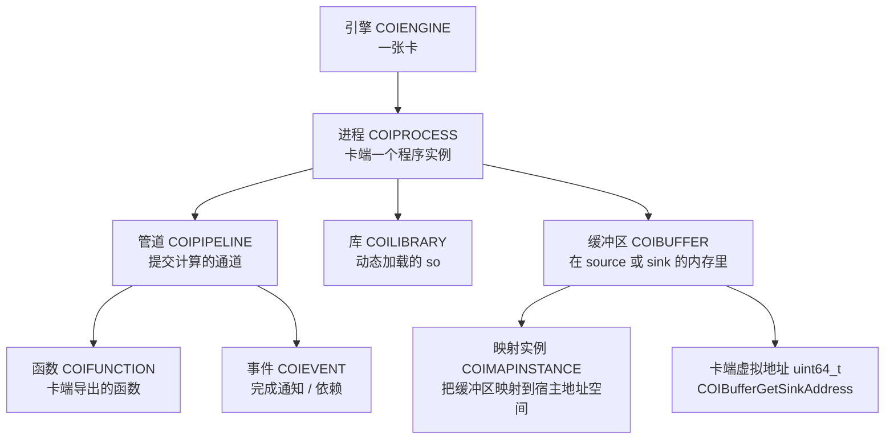
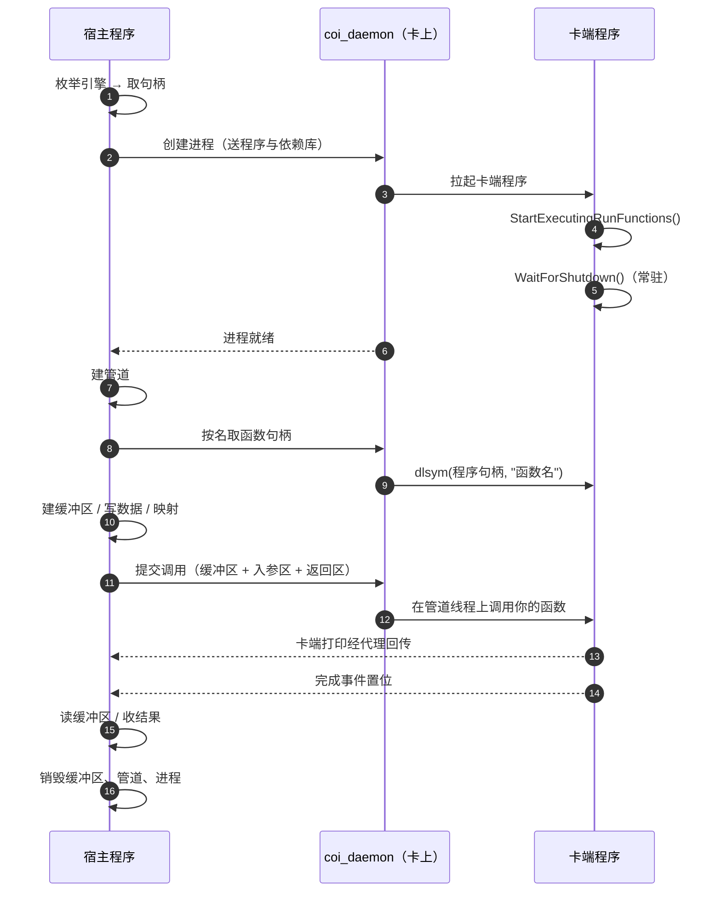
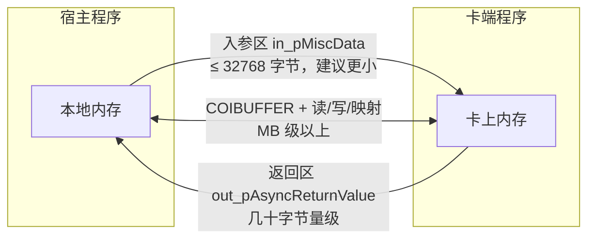
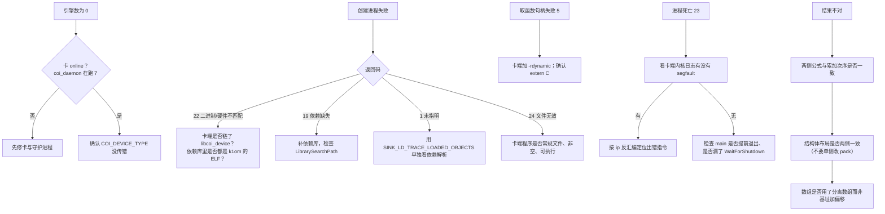

# KNC offload 编程手册

## COI（Coprocessor Offload Infrastructure）API 用法与参考

> 　　**这本手册讲什么。** 它讲 Intel Xeon Phi（代号 Knights Corner，下称 KNC）的 offload 编程接口 COI：宿主与卡两端各有哪些 API、每个 API 怎么用、数据怎么过去、线程怎么安排、指针怎么管、出错怎么查。编排以**能力**为纲（要传大数据看第十五章，要在卡上分配空间看第十一章，要开线程看第八章，要管卡端指针看第十二章），API 逐个解释放在第七部分作参考。
>
> 　　**依据。** 全部内容取自 Intel MPSS 3.8.6 随包的 COI 头文件（`intel-coi/` 下的 `source/`、`sink/`、`common/` 三组）与随包的 man 手册（`docs/man/`，共 66 页，一函数一页）。API 的语义、参数、返回值一律以头文件与 man 页为准；凡本手册标注「实测」的条目，是在 KNC 实卡上验证过的行为，另见附录 E。
>
> 　　**读者前提。** 会 C 或 C++、了解 Linux 下的编译链接与多线程、知道什么是交叉编译。不需要预先了解 offload。
>
> 　　**约定。** 代码标识符、函数名、常量、类型名一律保留原样；正文用原生中文术语，中英对照见附录 B。函数原型中的指针星号按头文件写法保留。文中形如 `<MPSS 前缀>`、`<COI 安装前缀>` 的是占位符，按实际安装替换。

### 按问题找章节

| 我想知道 | 去哪一章 |
|---|---|
| 怎么写第一个能跑的程序 | 第二章、第三章 |
| 怎么把大批数据送到卡上、再取回来 | 第十章、第十三章、**第十五章** |
| 怎么在卡上申请内存 | 第十一章 §11.3、§11.4 |
| 宿主怎么持有并使用「卡上的地址」 | **第十二章** |
| 怎么在卡上开线程、怎么把线程绑到核 | 第八章 |
| 怎么让多个操作按顺序执行（依赖） | 第十八章 |
| 怎么等结果、怎么用异步 | 第十六章 |
| 卡端函数该长什么样 | 第七章 |
| 某个 API 的参数含义 | 第七部分（第二十三至三十一章） |
| 某个返回码是什么意思 | 第十九章 |
| 程序失败在第一步 | 第二十章、第二十一章 |
| 怎么调性能 | 第二十二章 |

---

# 第一部分　模型与起步

## 1　对象模型

### 1.1　两端：宿主与卡

　　COI 的 offload 由两个可执行文件构成，各跑一端。COI 官方把两端叫作 **source**（发起端）与 **sink**（执行端）；本手册里叫**宿主程序**与**卡端程序**。

| | 宿主程序 | 卡端程序 |
|---|---|---|
| 跑在哪 | 装有 MPSS 的 Linux 主机 | KNC 卡上（卡自带一套 Linux） |
| 链什么库 | `libcoi_host` | `libcoi_device` |
| 头文件 | `intel-coi/source/*.h`、`intel-coi/common/*.h` | `intel-coi/sink/*.h`、`intel-coi/common/*.h` |
| 谁启动它 | 你手工运行 | 卡上的守护进程 `coi_daemon`，由宿主在创建进程时触发 |
| 入口约定 | 普通 `main()` | `COIPipelineStartExecutingRunFunctions()` 加 `COIProcessWaitForShutdown()` |

　　卡端程序**不需要**你手工部署到卡上：宿主调用创建进程的 API 时，COI 会把卡端程序本身连同它读得出的依赖库一起送到卡上，运行结束再清理。卡的根文件系统是内存盘、重启即空，对 offload 没有影响。

### 1.2　七个对象

　　整份 API 围绕七种对象展开，除事件外都是**不透明句柄**（指针类型），只能通过 API 操作：

| 对象 | 类型 | 取得方式 | 释放方式 |
|---|---|---|---|
| 引擎 | `COIENGINE` | `COIEngineGetHandle()` | 不需要释放（系统资源） |
| 进程 | `COIPROCESS` | `COIProcessCreateFromFile()`／`FromMemory()` | `COIProcessDestroy()` |
| 管道 | `COIPIPELINE` | `COIPipelineCreate()` | `COIPipelineDestroy()` |
| 函数 | `COIFUNCTION` | `COIProcessGetFunctionHandles()` | 随进程释放 |
| 缓冲区 | `COIBUFFER` | `COIBufferCreate()`／`FromMemory()`／`CreateSubBuffer()` | `COIBufferDestroy()` |
| 映射实例 | `COIMAPINSTANCE` | `COIBufferMap()` | `COIBufferUnmap()` |
| 事件 | `COIEVENT` | 由 API 的输出参数填充，或 `COIEventRegisterUserEvent()` | 用户事件需 `COIEventUnregisterUserEvent()` |
| 库 | `COILIBRARY` | `COIProcessLoadLibraryFromFile()` 等 | `COIProcessUnloadLibrary()` |

　　对象之间的从属关系是固定的：**引擎**上有**进程**，**进程**上有**管道**、**库**与**缓冲区**的有效副本，**管道**上按序执行**函数**，**事件**把这一切串起来。



### 1.3　一次调用的生命周期



　　三处「顺序不能颠倒」：卡端两行入口调用要先于任何调用（第七章）；宿主侧先建进程、再建管道、再取函数句柄（第六章）；卡端函数必须已经导出且进入动态符号表（第七章 §7.3）。

## 2　最小可运行程序

### 2.1　卡端程序

```cpp
/* sink.cpp —— 卡端 */
#include <intel-coi/sink/COIPipeline_sink.h>
#include <intel-coi/sink/COIProcess_sink.h>
#include <intel-coi/common/COIMacros_common.h>
#include <string.h>

struct Params { long n; };
struct Result { double sum; int threads; };

/* 宿主按名字取到这个函数并调用它 */
COINATIVELIBEXPORT
void MyKernel(uint32_t        in_BufferCount,
              void          **in_ppBufferPointers,
              uint64_t       *in_pBufferLengths,
              void           *in_pMiscData,
              uint16_t        in_MiscDataLength,
              void           *in_pReturnValue,
              uint16_t        in_ReturnValueLength)
{
    (void)in_BufferCount; (void)in_ppBufferPointers; (void)in_pBufferLengths;

    Result *r = (Result *)in_pReturnValue;
    if (!r || in_ReturnValueLength < sizeof(*r)) return;   /* 先校验再写 */
    memset(r, 0, sizeof(*r));

    Params p;
    if (!in_pMiscData || in_MiscDataLength < sizeof(p)) return;  /* 先校验再读 */
    memcpy(&p, in_pMiscData, sizeof(p));

    double s = 0.0;
    for (long i = 0; i < p.n; i++) { double x = (double)i / (double)p.n; s += x * x; }
    r->sum     = s;
    r->threads = 1;
}

int main(int, char **)
{
    COIPipelineStartExecutingRunFunctions();   /* 之前不会有任何调用被执行 */
    COIProcessWaitForShutdown();               /* 常驻，直到宿主销毁本进程 */
    return 0;
}
```

### 2.2　宿主程序

```cpp
/* host.cpp —— 宿主 */
#include <intel-coi/source/COIEngine_source.h>
#include <intel-coi/source/COIProcess_source.h>
#include <intel-coi/source/COIPipeline_source.h>
#include <intel-coi/source/COIEvent_source.h>
#include <intel-coi/common/COIResult_common.h>
#include <stdio.h>
#include <string.h>

struct Params { long n; };
struct Result { double sum; int threads; };

#define CHECK(e) do { COIRESULT r_ = (e); if (r_ != COI_SUCCESS) {          \
    printf("失败: %s -> %s(%d)\n", #e, COIResultGetName(r_), (int)r_);      \
    return 1; } } while (0)

int main(int argc, char **argv)
{
    const char *sink = (argc > 1) ? argv[1] : "./sink";
    const char *libs = (argc > 2) ? argv[2] : NULL;   /* k1om 依赖库目录 */

    uint32_t n_engines = 0;
    CHECK(COIEngineGetCount(COI_DEVICE_MIC, &n_engines));
    if (n_engines < 1) { printf("没有可用引擎\n"); return 1; }

    COIENGINE engine = NULL;
    CHECK(COIEngineGetHandle(COI_DEVICE_MIC, 0, &engine));

    COIPROCESS proc = NULL;
    CHECK(COIProcessCreateFromFile(engine, sink, 0, NULL, false, NULL,
                                   true, NULL, 0, libs, &proc));

    COIPIPELINE pipe = NULL;
    CHECK(COIPipelineCreate(proc, NULL, 0, &pipe));

    const char *fname = "MyKernel";
    COIFUNCTION func = NULL;
    CHECK(COIProcessGetFunctionHandles(proc, 1, &fname, &func));

    Params in;  memset(&in, 0, sizeof(in));  in.n = 1000000;
    Result out; memset(&out, 0, sizeof(out));
    COIEVENT ev;

    CHECK(COIPipelineRunFunction(pipe, func, 0, NULL, NULL, 0, NULL,
                                 &in, (uint16_t)sizeof(in),
                                 &out, (uint16_t)sizeof(out), &ev));
    CHECK(COIEventWait(1, &ev, -1, 0, NULL, NULL));

    printf("卡上结果: sum=%.12f threads=%d\n", out.sum, out.threads);

    CHECK(COIPipelineDestroy(pipe));
    CHECK(COIProcessDestroy(proc, -1, 0, NULL, NULL));
    return 0;
}
```

### 2.3　构建与运行

```bash
# 卡端（交叉编译；-rdynamic 必须）
<k1om 交叉编译器> -O2 -rdynamic -I<k1om sysroot>/usr/include sink.cpp \
    -L<k1om sysroot>/usr/lib64 -lcoi_device \
    -lpthread -ldl -lrt -Wl,-rpath,/tmp -o sink

# 宿主（本机编译）
g++ -O2 -I<COI 安装前缀>/include host.cpp -o host \
    -L<COI 安装前缀>/lib64 -lcoi_host -Wl,-rpath,<COI 安装前缀>/lib64

# 运行：宿主参数依次为 卡端程序路径、k1om 依赖库目录
./host ./sink <k1om 依赖库目录>
```

| 要点 | 为什么 |
|---|---|
| 卡端必须 `-rdynamic` | 导出符号要进动态符号表，卡端 `dlsym` 才找得到（§7.3） |
| 卡端 `-Wl,-rpath,/tmp` | 运行期卡端程序与依赖库由 COI 放在卡的 `/tmp` 下 |
| 宿主最后两个参数 | 一是卡端程序路径（宿主上可读），二是 k1om 依赖库目录（COI 要逐个校验其 ELF 机器类型） |
| 宿主不必是 root | 只要设备可读写（§3.3） |

　　起步阶段最常遇到的三件事：`COIProcessCreateFromFile` 报 `COI_BINARY_AND_HARDWARE_MISMATCH(22)`（卡端程序没链 `libcoi_device`，或依赖库目录里有非 k1om 的库）；`COIProcessGetFunctionHandles` 报 `COI_DOES_NOT_EXIST(5)`（缺 `-rdynamic`）；运行后 `COI_PROCESS_DIED(23)`（卡端函数崩了，去看卡上的内核日志）。三者的排查都在第二十章。

## 3　头文件、库与运行环境

### 3.1　头文件分组

| 组 | 目录 | 内容 |
|---|---|---|
| source | `intel-coi/source/` | `COIEngine_source.h`、`COIProcess_source.h`、`COIPipeline_source.h`、`COIBuffer_source.h`、`COIEvent_source.h` —— 宿主侧全部 API |
| sink | `intel-coi/sink/` | `COIPipeline_sink.h`、`COIProcess_sink.h`、`COIBuffer_sink.h` —— 卡端全部 API 与导出宏 |
| common | `intel-coi/common/` | `COITypes_common.h`（基础类型）、`COIResult_common.h`（返回码）、`COIEngine_common.h`（设备类型）、`COIEvent_common.h`、`COIMacros_common.h`（CPU 掩码辅助函数）、`COIPerf_common.h`、`COISysInfo_common.h` |

　　宿主同时包含 `source/` 与 `common/`；卡端同时包含 `sink/` 与 `common/`。`common/` 里少数接口两端都可调（例如 `COIEventSignalUserEvent`、`COIEngineGetIndex`、`COISys*` 与 `COIPerf*`）。

### 3.2　库与符号版本

| 库 | 用在哪 | 链接方式 |
|---|---|---|
| `libcoi_host` | 宿主 | `-lcoi_host`，运行期需要 `LD_LIBRARY_PATH` 或 rpath |
| `libcoi_device` | 卡端 | `-lcoi_device`，卡镜像自带 |

　　宿主库导出的是带版本号的公开符号（如 `COI_1.0`），第三方实现只要保持同名同版本即可与本文档的调用方式兼容。

### 3.3　运行期环境

| 项 | 说明 |
|---|---|
| 卡上守护进程 | `coi_daemon` 必须已运行（通常随卡启动）。没有它，引擎数为 0 |
| 宿主设备节点 | 宿主通过字符设备与卡通信；该设备需对使用者可读写。默认权限常为 root 独占，装好随包的 udev 规则后普通用户即可使用，**客户端程序不需要 root** |
| 依赖库搜索 | 宿主侧由创建进程 API 的 `in_LibrarySearchPath` 指定；卡端由 `SINK_LD_LIBRARY_PATH` 与 rpath 决定（§4.3） |
| 卡端内存盘 | 卡根文件系统是内存盘，重启即空；offload 不需要往里放东西 |

---

# 第二部分　进程与库

## 4　引擎与进程

### 4.1　枚举引擎

```c
COI_DEVICE_TYPE：COI_DEVICE_MIC（MIC 家族任一款）、COI_DEVICE_KNC（Knights Corner）、
                COI_DEVICE_KNL（Knights Landing）、COI_DEVICE_SOURCE（发起端自身）

uint32_t n = 0;
COIEngineGetCount(COI_DEVICE_MIC, &n);        /* 有几张卡 */
COIENGINE e = NULL;
COIEngineGetHandle(COI_DEVICE_MIC, 0, &e);    /* 第 0 张；索引从 0 开始 */
```

| API | 说明 |
|---|---|
| `COIEngineGetCount` | 返回指定类型的引擎数。宿主本机挂的卡由运行时探测；通过 fabric 的远端目标由环境变量 `COI_OFFLOAD_NODES` 给出（本手册场景一般不需要） |
| `COIEngineGetHandle` | 按索引取句柄；索引越界得 `COI_OUT_OF_RANGE` |
| `COIEngineGetInfo` | 取设备信息（`COI_ENGINE_INFO` 结构）。**调用方要传结构体大小**做版本校验：尺寸不匹配得 `COI_SIZE_MISMATCH`。查询不到的值以 0 返回而调用仍成功 |
| `COIEngineGetHostname` | 取该引擎所属远端的主机名，最多写 4096 字节 |
| `COIEngineGetIndex` | 反向查询「当前代码跑在哪个引擎上」，两端都可调用 |

　　实测提示：如果枚举到 0，先确认卡状态与 `coi_daemon`，不要先怀疑代码。

### 4.2　创建进程

```c
COIProcessCreateFromFile(COIENGINE     in_Engine,
                         const char   *in_pBinaryName,        /* 卡端程序路径（宿主上） */
                         int           in_Argc,
                         const char  **in_ppArgv,             /* 不含 argv[0] */
                         uint8_t       in_DupEnv,             /* 是否复制宿主环境变量 */
                         const char  **in_ppAdditionalEnv,    /* 追加/覆盖的环境变量 */
                         uint8_t       in_ProxyActive,         /* 是否代理卡端标准输出 */
                         const char   *in_Reserved,           /* 保留，传 NULL */
                         uint64_t      in_InitialBufferSpace, /* 缓冲区池预留（可传 0） */
                         const char   *in_LibrarySearchPath,  /* 宿主上的依赖库目录 */
                         COIPROCESS   *out_pProcess);
```

| 参数 | 取值与含义 |
|---|---|
| `in_pBinaryName` | 卡端可执行文件的路径。必须是常规文件且非空，否则 `COI_INVALID_FILE`；找不到得 `COI_DOES_NOT_EXIST` |
| `in_Argc`／`in_ppArgv` | 卡端程序的命令行参数；`argv[0]` 由运行时生成，不要传 |
| `in_DupEnv` | 置 1 则把宿主的全套环境变量复制给卡端进程；置 0 更可预测 |
| `in_ppAdditionalEnv` | 形如 `"KEY=VALUE"` 的字符串数组，在复制环境之后追加／覆盖 |
| `in_ProxyActive` | 置 1 后卡端的标准输出与标准错误**经代理回传到宿主**（卡端 `printf` 会出现在宿主输出里）。这是最省事的调试手段 |
| `in_InitialBufferSpace` | 给缓冲区池预留的字节数；不用缓冲区时传 0 |
| `in_LibrarySearchPath` | **卡端依赖库在宿主上的目录**。运行时会把卡端程序的每个依赖读出来校验 ELF 机器类型；目录指错或依赖不全，这一步直接失败（`COI_MISSING_DEPENDENCY`／`COI_BINARY_AND_HARDWARE_MISMATCH`）。为空则回退到环境变量 `SINK_LD_LIBRARY_PATH` |

　　`COIProcessCreateFromMemory` 是同一件事的内存版：不传文件名，改传一段已经读入内存的 ELF 映像（`in_pBinaryBuffer` 与长度），多出两个可选参数 `in_FileOfOrigin`／`in_FileOfOriginOffset`（记录这段映像来自哪个文件的哪个偏移，便于排错与依赖解析）。宿主拿不到卡端程序文件时用它。

　　两个调试用的环境变量（在宿主上设置，创建进程时生效）：

| 变量 | 作用 |
|---|---|
| `SINK_LD_TRACE_LOADED_OBJECTS` | 置非空时，只做依赖解析并把结果打印出来，不真正创建进程 —— 用来单独排查「缺哪个 so」 |
| `SINK_LD_PRELOAD` | 冒号分隔的库列表；创建进程时把这些库一并送到卡上并预加载 |

### 4.3　依赖库怎么被找到

　　运行时的搜索顺序（取自 `COIProcessLoadLibraryFromMemory` 的说明）：先看当前工作目录，再看 `SINK_LD_LIBRARY_PATH`（冒号分隔），最后看卡端操作系统自己的动态链接器搜索路径。宿主侧的 `in_LibrarySearchPath` 会**覆盖** `SINK_LD_LIBRARY_PATH`。

　　实践上最省事的做法：把卡端程序需要的全部非系统库（例如 OpenMP 运行时）放在宿主上的一个目录里，编译卡端程序时 `-L` 指它，创建进程时 `in_LibrarySearchPath` 也指它。卡本身不需要预装这些库。

### 4.4　销毁进程

```c
COIProcessDestroy(COIPROCESS in_Process,
                  int32_t    in_WaitForMainTimeout,  /* -1 表示一直等卡端 main 返回 */
                  uint8_t    in_ForceDestroy,
                  int       *out_pProcessReturn,     /* 卡端 main 的返回值，可传 NULL */
                  uint32_t  *out_pTerminationCode);  /* 终止码，可传 NULL */
```

　　`in_WaitForMainTimeout` 为 `-1` 表示无限等；其它负值非法（`COI_OUT_OF_RANGE`）；`-1` 与 `in_ForceDestroy = true` 组合不合法（`COI_ARGUMENT_MISMATCH`）。销毁进程会连带销毁它名下的所有管道。

## 5　动态库、通知与运行时配置

### 5.1　在卡端进程里加载／卸载库

| API | 用途 |
|---|---|
| `COIProcessLoadLibraryFromFile(proc, 文件名, 库名, 搜索路径, COILIBRARY *out)` | 从宿主文件系统加载一个共享库到卡端进程，等价于卡端 `dlopen` |
| `COIProcessLoadLibraryFromFileV2(..., uint32_t in_Flags, ...)` | 同上，多一个 flags（作为卡端 `dlopen` 的 flag 传入） |
| `COIProcessLoadLibraryFromMemory(proc, 缓冲区, 长度, 库名, 搜索路径, 来源文件, 偏移, COILIBRARY *out)` | 从内存映像加载 |
| `COIProcessLoadLibraryFromMemoryV2(..., uint32_t in_Flags, ...)` | 同上带 flags |
| `COIProcessUnloadLibrary(proc, COILIBRARY)` | 卸载 |
| `COIProcessRegisterLibraries(n, 库数组, 长度数组, 来源数组, 偏移数组)` | 把**已经在宿主进程内存里**的库登记进来，后续创建进程／加载库时若命中同一依赖就用它们，不再从磁盘找。库必须有 `DT_SONAME` |

　　卡的 `libcoi_device` 还提供卡端版本的加载接口 `COIProcessLoadSinkLibraryFromFile`（在 `sink/COIProcess_sink.h`），给卡端程序自己加载库用。

### 5.2　通知回调

　　运行时会在内部事件发生时回调你注册的函数，让你不需要轮询：

```c
typedef void (*COI_NOTIFICATION_CALLBACK)(COI_NOTIFICATIONS in_Type,
                                          COIPROCESS        in_Process,
                                          COIEVENT          in_Event,
                                          const void       *in_UserData);

COIRegisterNotificationCallback(proc, cb, user_data);   /* 每进程注册；同一指针不可重复注册 */
COIUnregisterNotificationCallback(proc, cb);
COINotificationCallbackSetContext(user_data);           /* 设置回调里拿到的上下文 */
```

　　三条要紧的规矩：回调要**短、不阻塞**，它是运行时线程上调用的，等同于中断处理；**不要在回调里调用 `COIEventWait`**（容易立刻死锁）；运行时保证内部事件的回调先于对应的事件被置位，所以回调里能看到「比 `COIEventWait` 返回更早」的信息。

### 5.3　输出代理

卡端程序打印的内容要回传到宿主，才看得见。两种方式：创建进程时把 `in_ProxyActive` 置 1（推荐）；卡端在关键位置调用 `COIProcessProxyFlush()` 保证输出在函数返回前被宿主写出。注意宿主侧写出的是运行时的标准输出，**不保证自动 flush**，必要时宿主自己 flush。

### 5.4　DMA 通道与缓存

| API | 作用 |
|---|---|
| `COIProcessConfigureDMA(in_Channels, in_Mode)` | 设置后续创建的进程使用几条逻辑 DMA 通道。默认单通道；最多 4，当前实现实际利用 2。**必须在创建进程之前调用**，且对已有进程无效。通道多则 DMA 并行度好，但缓冲区创建的开销变大 |
| `COIProcessSetCacheSize(proc, 大页池字节, 大页标志, 4K 池字节, 4K 标志, 依赖数, 依赖数组, 完成事件)` | 调整卡端缓冲池的缓存上限（默认 1 GB）。调大换吞吐，调小省内存；只跑一次就丢的缓冲区适合小缓存 |

---

# 第三部分　计算与线程

## 6　管道与函数调用

### 6.1　建管道

```c
COIPipelineCreate(COIPROCESS   in_Process,
                  COI_CPU_MASK in_Mask,      /* 管道处理线程允许跑的硬件线程集合；不需要就传 NULL */
                  uint32_t     in_StackSize, /* 管道处理线程的栈；0 用系统默认 */
                  COIPIPELINE *out_pPipeline);
```

| 约束 | 说明 |
|---|---|
| 掩码 | 全零的掩码是非法的（`COI_OUT_OF_RANGE`）—— 不要就传 `NULL` |
| 栈 | 非 0 时必须 ≥ `PTHREAD_STACK_MIN`（16384）且是页大小（4096）的整数倍 |
| 数量 | 上限 `COI_PIPELINE_MAX_PIPELINES`（512）；官方建议不要超过卡上核数，否则性能下降 |
| 顺序 | **同一条管道上的调用按入队顺序执行**；跨管道不保证顺序 |

### 6.2　取函数句柄

```c
const char *names[1] = { "MyKernel" };
COIFUNCTION func = NULL;
COIProcessGetFunctionHandles(proc, 1, names, &func);
```

　　前提是卡端那个函数**已导出且进入动态符号表**：用 `extern "C"`（或 `COINATIVELIBEXPORT`）声明，并在链接卡端程序时加 `-rdynamic`。C++ 名字要么 `extern "C"`，要么传改编后的名字。可以一次取多个；若部分名字找不到，返回 `COI_DOES_NOT_EXIST`，找不到的那个句柄为 `NULL`，其余仍然有效。

### 6.3　提交调用

```c
COIPipelineRunFunction(COIPIPELINE            in_Pipeline,
                       COIFUNCTION            in_Function,
                       uint32_t               in_NumBuffers,
                       const COIBUFFER       *in_pBuffers,
                       const COI_ACCESS_FLAGS *in_pBufferAccessFlags,
                       uint32_t               in_NumDependencies,
                       const COIEVENT        *in_pDependencies,
                       const void            *in_pMiscData,
                       uint16_t               in_MiscDataLen,
                       void                  *out_pAsyncReturnValue,
                       uint16_t               in_AsyncReturnValueLen,
                       COIEVENT              *out_pCompletion);
```

| 参数 | 含义 |
|---|---|
| `in_NumBuffers`／`in_pBuffers`／`in_pBufferAccessFlags` | 本次调用要用到的缓冲区、它们的访问标志（§11.5）。`in_NumBuffers` 上限 `COI_PIPELINE_MAX_IN_BUFFERS`（16384）；三者要么都给要么都不给 |
| `in_NumDependencies`／`in_pDependencies` | 依赖的事件：本次调用会等这些事件都置位后才执行。用于串起「先写缓冲区、再算、再读回来」的顺序 |
| `in_pMiscData`／`in_MiscDataLen` | 入参区。上限 `COI_PIPELINE_MAX_IN_MISC_DATA_LEN`（**32768 字节**）；头文件明确建议「通常要远小于此值」，因为它会被放进驱动的命令缓冲。给一个就必须给另一个 |
| `out_pAsyncReturnValue`／`in_AsyncReturnValueLen` | 返回区，卡端函数写结果的地方。**在完成事件置位前不要读它** |
| `out_pCompletion` | 完成事件。传 `NULL` 则本次调用同步执行、返回即完成；传了就异步，靠事件等待 |

　　三条官方点明的风险：依赖设错会形成环，导致管道乃至整个运行时卡住；卡端内存不足时调用会崩（被 AddRef 的缓冲区占着内存不释放）；**入参区变量或缓冲区句柄若在调用完成之前被销毁或改变，行为不确定** —— 所以要先等完成事件再销毁相关对象。

### 6.4　销毁管道

`COIPipelineDestroy()` 会等待该管道上已入队的调用全部执行完。**如果某个调用因为依赖成环永远不执行，销毁也会跟着挂住**。

## 7　卡端函数的契约

### 7.1　签名与七个参数

```c
typedef void (*RunFunctionPtr_t)(uint32_t  in_BufferCount,
                                 void    **in_ppBufferPointers,
                                 uint64_t *in_pBufferLengths,
                                 void     *in_pMiscData,
                                 uint16_t  in_MiscDataLength,
                                 void     *in_pReturnValue,
                                 uint16_t  in_ReturnValueLength);
```

| 参数 | 含义 |
|---|---|
| `in_BufferCount` | 本次调用带的缓冲区个数 |
| `in_ppBufferPointers` | 各缓冲区在**卡端的虚拟地址**数组（见第十二章） |
| `in_pBufferLengths` | 各缓冲区的字节长度数组。注意原型是 `uint64_t *`，而头文件的说明注释写成 `uint32_t` —— 以原型为准 |
| `in_pMiscData`／`in_MiscDataLength` | 入参区指针与长度 |
| `in_pReturnValue`／`in_ReturnValueLength` | 返回区指针与长度 |

　　两处「以头文件为准」容易踩：函数**返回 `void`**（说明注释里那句「返回 `uint64_t`，可由 `COIPipelineWaitForEvent` 的 `out_UserData` 取回」是旧版遗留，该函数在当前头文件里已不存在）；第三参数是 `uint64_t *` 而非 `uint32_t *`。

### 7.2　函数体内该做什么

　　每个卡端函数都应当以这两道校验开头 —— 长度由宿主给，写错就是越界，而越界在卡上表现为进程崩溃，宿主只看到一个笼统的错误码：

```c
Result *r = (Result *)in_pReturnValue;
if (!r || in_ReturnValueLength < sizeof(*r)) return;   /* 长度不够：直接放弃，绝不写入 */
memset(r, 0, sizeof(*r));

Params p;
if (!in_pMiscData || in_MiscDataLength < sizeof(p)) return;
memcpy(&p, in_pMiscData, sizeof(p));                   /* 先拷到本地再用 */
```

　　其余实践要点：入参先 `memcpy` 到本地变量再使用（避免对齐与别名假设）；与宿主交换的结构体两侧字段与顺序必须完全一致（不要只在一侧改 `#pragma pack`）；数组用分离数组而不是「基址加偏移」模拟多维（交错别名会让两侧优化器做出不同假设，实测会算出一致性对不上的结果）；需要跨调用保留状态时用卡端全局变量，代价是该函数不再可重入。

### 7.3　导出符号

| 条件 | 不满足时 | 怎么做 |
|---|---|---|
| C 链接 | 卡端按名字找不到符号 | 用 `extern "C"`；`COINATIVELIBEXPORT` 已含 `extern "C"` 与默认可见性 |
| 符号进入动态符号表 | `COI_DOES_NOT_EXIST(5)` | 链接卡端程序时加 `-rdynamic`（等价 `-Wl,--export-dynamic`） |

　　自查：

```bash
readelf --dyn-syms sink | grep MyKernel     # 期望看到 FUNC GLOBAL DEFAULT … MyKernel
readelf -d sink | grep NEEDED               # 依赖是否齐全
```

### 7.4　常驻与结束

　　`main` 必须停在 `COIProcessWaitForShutdown()`，否则宿主会看到 `COI_PROCESS_DIED(23)`。收到宿主的销毁消息后，该函数停止调度新的调用、等正在执行的调用跑完、清理 COI 资源，然后返回；它**不调用 `exit()`**，返回之后你可以做自己的收尾，但**不要再调用任何 COI API**。

## 8　线程与亲和性

### 8.1　COI 自己不开线程

　　COI 没有「创建线程」的 API —— 卡上的并行来自两处：

1. **卡端程序自己开的线程**：KNC 这类卡是几十个顺序核、每核多路硬件线程（常见配置为 61 核 × 4 路），常规做法是用 OpenMP 或 pthread。链接时加 `-fopenmp` 并链上卡端的 OpenMP 运行时（`libgomp`）即可，`#pragma omp parallel for` 照常用。
2. **运行时为每条管道开的处理线程**：`COIPipelineCreate` 会为管道建立一条命令处理线程，它的**栈大小**与**可运行的硬件线程集合**（CPU 掩码）由你指定。同一条管道上的调用在这条线程上按序执行。

　　因此「在卡上开线程」通常指的是第 1 种；第 2 种是控制调用在哪些核上跑的手段。

### 8.2　CPU 掩码

　　`COI_CPU_MASK` 是一个 1024 位（`uint64_t[16]`）的位图，位号与「核:线程」的对应由运行时定义。它有两套用法：

```c
COI_CPU_MASK mask;
COIPipelineClearCPUMask(mask);                 /* 必须先清零：掩码变量初值不保证为 0 */
COIPipelineSetCPUMask(proc, core, thread, mask);  /* 把某个 核:线程 加进掩码 */

COIPIPELINE pipe;
COIPipelineCreate(proc, mask, 0, &pipe);       /* 管道的处理线程只在这些硬件线程上跑 */
```

　　`COIMacros_common.h` 还提供一组直接操作位图的辅助函数，与 Linux 的 `CPU_*` 宏类似，但作用在 `COI_CPU_MASK` 上：

| 函数 | 作用 |
|---|---|
| `COI_CPU_MASK_SET(bit, mask)`／`COI_CPU_MASK_ISSET(bit, mask)` | 置位／查询 |
| `COI_CPU_MASK_ZERO(mask)` | 清零 |
| `COI_CPU_MASK_AND`／`_OR`／`_XOR`（`dst, src1, src2`） | 位运算 |
| `COI_CPU_MASK_COUNT(mask)`／`COI_CPU_MASK_EQUAL(a, b)` | 计数／比较 |
| `COI_CPU_MASK_XLATE(dst, const cpu_set_t *)`／`COI_CPU_MASK_XLATE_EX(cpu_set_t *, src)` | 与 Linux 的 `cpu_set_t` 互转 |

　　实测提示：显式掩码在核数很多的卡上容易设错，且设成空掩码会直接报错。**不需要绑核时一律传 `NULL`**，把调度交给运行时。

### 8.3　宿主侧的多线程

　　宿主的并发模型是「**一线程一条管道**」：管道内部有序，管道之间并行。三点经验：

- 每条管道有自己的入队顺序，把有先后依赖的工作放同一条管道，或者用依赖事件显式排序（第十八章）。
- 管道数不要超过卡上的核数；官方也建议如此。
- 多个宿主线程共用一个 `COIPROCESS` 是允许的；但要记住卡端函数如果是可重入的才有意义，否则用依赖或互斥把调用串起来。

## 9　卡端系统信息与计时

　　下面这些在**两端都能调用**；在卡端调用得到的是卡的信息，在宿主调用得到的是宿主的信息。写可移植的卡端代码时用它们来查询，而不是写死数字。

| API | 返回 |
|---|---|
| `COISysGetCoreCount()` | 核数 |
| `COISysGetCoreIndex()` | 当前代码跑在哪个核（0 起） |
| `COISysGetHardwareThreadCount()` | 硬件线程总数 |
| `COISysGetHardwareThreadIndex()` | 当前硬件线程索引 |
| `COISysGetL2CacheCount()`／`COISysGetL2CacheIndex()` | L2 缓存数／当前所在的 L2 |
| `COISysGetAPICID()` | 当前硬件线程的 APIC ID（唯一但不保证连续） |
| `COIPerfGetCycleCounter()` | 恒定速率、跨核一致的周期计数器 |
| `COIPerfGetCycleFrequency()` | 该计数器的频率（赫兹） |

　　用它们测时间：`(COIPerfGetCycleCounter() 的差) / COIPerfGetCycleFrequency()` 即秒数。OpenMP 程序的卡端计时用 `omp_get_wtime()` 即可；算力估算按实际浮点运算量除以耗时。

---

# 第四部分　数据通道

## 10　三条通道总览



| 通道 | 适合放什么 | 容量 | 同步方式 |
|---|---|---|---|
| 入参区 | 参数、小规模元数据 | 32768 字节上限（`COI_PIPELINE_MAX_IN_MISC_DATA_LEN`） | 随调用提交，天然同步 |
| 返回区 | 结果、统计量、校验和 | 没有公开常量；实践上控制在几十字节 | 完成事件置位后可读 |
| 缓冲区 | 数组、矩阵、任意大数据 | 受限于卡上可用内存 | 读／写／映射 + 访问标志 + 事件 |

　　选型就一句话：**能用参数解决的不要搬数据，能搬一次的不搬两次，MB 级的走缓冲区。**

## 11　缓冲区：在卡上分配与托管内存

### 11.1　缓冲区是什么

　　`COIBUFFER` 是 COI 的托管内存对象，跨两端使用。它的关键性质（取自头文件）：

- **数据在任一时点驻留在 source 或 sink 的物理内存里**（`COI_BUFFER_NORMAL` 的说明），运行时会按访问情况搬动它；
- 创建时**预留地址空间**，物理内存可能到第一次使用才提交；
- 缓冲区是与**进程**关联的（`in_NumProcesses`／`in_pProcesses`），一个缓冲区可以关联多个卡端进程；
- 运行时会为某些类型的缓冲区在 source 侧额外分配**影子内存**，这部分内存到缓冲区销毁才释放。

### 11.2　创建：`COIBufferCreate`

```c
COIBufferCreate(uint64_t          in_Size,        /* 字节数；非页对齐会向上取整 */
                COI_BUFFER_TYPE   in_Type,        /* 见下 */
                uint32_t          in_Flags,       /* 见下 */
                const void       *in_pInitData,   /* 初值，可为 NULL；非 NULL 时至少 in_Size 字节 */
                uint32_t          in_NumProcesses,
                const COIPROCESS *in_pProcesses,  /* 该缓冲区可能被哪些卡端进程使用 */
                COIBUFFER        *out_pBuffer);
```

| 类型 | 语义 |
|---|---|
| `COI_BUFFER_NORMAL`（值 1） | 常规缓冲区；映射时可能让管道停顿，遵循读写依赖 |
| `COI_BUFFER_OPENCL` | 与常规类似，但不让管道停顿、不遵循读写依赖 |

| 标志 | 值 | 语义 |
|---|---:|---|
| `COI_SAME_ADDRESS_SINKS` | 0x001 | 在所有关联卡端进程里地址相同（便于把地址当参数传递） |
| `COI_SAME_ADDRESS_SINKS_AND_SOURCE` | 0x002 | 连宿主侧地址也相同（**这时宿主可以直接解引用该地址**） |
| `COI_OPTIMIZE_SOURCE_READ`／`_SOURCE_WRITE` | 0x004／0x008 | 提示运行时：宿主会频繁读／写 |
| `COI_OPTIMIZE_SINK_READ`／`_SINK_WRITE` | 0x010／0x020 | 提示运行时：卡端会频繁读／写 |
| `COI_OPTIMIZE_NO_DMA` | 0x040 | 延迟到真正 DMA 时才钉页。注意：开了它就**无法在创建时发现内存只读**，问题会推迟到后面，务必用可写内存 |
| `COI_OPTIMIZE_HUGE_PAGE_SIZE` | 0x080 | 提示卡端用大页做后备存储（与 SAME_ADDRESS、SINK_MEMORY 不兼容；太小的缓冲区不会被提升） |
| `COI_SINK_MEMORY` | 0x100 | **只在 `COIBufferCreateFromMemory` 里有效**：表示这块内存已经分配在卡上（§11.4） |

　　`in_Type` 与 `in_Flags` 的合法组合由头文件里的 `COI_VALID_BUFFER_TYPES_AND_FLAGS` 矩阵给出：`COI_BUFFER_NORMAL` 支持除 `COI_SINK_MEMORY`（那是 FromMemory 专用）之外的全部标志；`COI_BUFFER_OPENCL` 不支持 `COI_SINK_MEMORY`。组合不合法得 `COI_ARGUMENT_MISMATCH`。

### 11.3　在卡上分配空间的三条路

| 路 | 怎么做 | 数据实际在哪 | 适用 |
|---|---|---|---|
| 一、交给运行时 | `COIBufferCreate()` 建一个常规缓冲区 | 运行时决定（会按访问在两端口之间搬） | 默认选择 |
| 二、用卡端自己的内存 | 卡端程序 `malloc` 得到一段内存，把地址告诉宿主（例如经返回区回传），宿主再用 `COIBufferCreateFromMemory()` + `COI_SINK_MEMORY` 把它包成缓冲区 | 卡上 | 卡端已经有大块内存（例如从 OpenMP 的分配器或大页池里拿的），不想再让运行时另分配一份 |
| 三、自己的内存自己管 | 完全不用缓冲区，宿主把数据经入参区分批送，或卡端按参数自行生成 | 卡上（卡端分配的） | 数据能算出来（初值、网格、随机场），不必真搬 |

　　第二条路有一个硬约束：带 `COI_SINK_MEMORY` 时 `in_NumProcesses` **必须是 1**（缓冲区只属于那一个卡端进程）。创建时已有的数据会被保留，`COIBufferDestroy` 时也不会被清除。

### 11.4　从既有内存创建：`COIBufferCreateFromMemory`

```c
COIBufferCreateFromMemory(uint64_t          in_Size,
                          COI_BUFFER_TYPE   in_Type,      /* 只支持 NORMAL 与 （OPENCL） */
                          uint32_t          in_Flags,
                          void             *in_Memory,    /* 已有内存；带 SINK_MEMORY 时是卡端虚拟地址 */
                          uint32_t          in_NumProcesses,
                          const COIPROCESS *in_pProcesses,
                          COIBUFFER        *out_pBuffer);
```

| 事项 | 说明 |
|---|---|
| 内存归属 | `COI_SINK_MEMORY` 未置：这块内存作为缓冲区在**宿主侧**的后备存储（即数据先落在宿主内存）。置了：这块内存用在**卡端**（`in_Memory` 是卡端地址），且 `in_NumProcesses` 必须为 1 |
| 生命周期 | 内存仍归你所有，但**在 `COIBufferDestroy` 之前不能释放** |
| 访问方式 | 必须通过缓冲区语义访问（`COIBufferMap`／`Unmap`、读写 API、带访问标志的调用），否则运行时不知道数据被改过，改动可能不可见 |
| 只读内存 | 不支持（`COI_NOT_SUPPORTED`） |
| 数据保持 | 创建时内存里已有的内容被保留；销毁缓冲区时也保留 |

### 11.5　访问标志：`COI_ACCESS_FLAGS`

　　把缓冲区传给 `COIPipelineRunFunction` 时必须说明卡端会怎么访问它 —— 这些标志**影响正确性**，不只是优化提示：

| 标志 | 含义 |
|---|---|
| `COI_SINK_READ` | 卡端只读该缓冲区 |
| `COI_SINK_WRITE` | 卡端会写该缓冲区（运行时会先把最新数据同步到卡上） |
| `COI_SINK_WRITE_ENTIRE` | 卡端会覆盖整个缓冲区，因此**执行前不需要把数据同步到卡上**（省一次传输） |
| `COI_SINK_READ_ADDREF`／`COI_SINK_WRITE_ADDREF`／`COI_SINK_WRITE_ENTIRE_ADDREF` | 同上，且在函数返回后**维持该缓冲区的引用计数**（配合卡端 `COIBufferAddRef` 使用，§14.2） |

　　举例说明为什么必须写对：若某次调用标了 `COI_SINK_READ`，之后宿主再 `COIBufferMap` 读同一缓冲区，运行时可能直接用缓存副本而不去卡上取真正的新数据。

## 12　宿主侧如何管理卡端指针

　　这一章回答一个具体问题：**卡端那块内存，宿主这边怎么拿、怎么用、什么时候失效。** COI 提供三种「拿到卡端地址或数据」的方式，用途不同。

### 12.1　方式一：卡端虚拟地址（不解引用，只传递）

```c
uint64_t sink_addr = 0;
COIBufferGetSinkAddress(buffer, &sink_addr);            /* 单进程版本 */

COIPROCESS proc = ...;
COIBufferGetSinkAddressEx(proc, buffer, &sink_addr);    /* 指定进程；proc 传 0 表示第一个有效进程 */
```

| 性质 | 说明 |
|---|---|
| 这是什么 | 该缓冲区在**卡端的虚拟地址**，与卡端函数收到 `in_ppBufferPointers[i]` 里的值是同一个 |
| 稳定性 | **固定不变**：同一个缓冲区在不同调用里地址相同，可以缓存起来 |
| 能否在宿主解引用 | **不能**（除非该缓冲区创建时带了 `COI_SAME_ADDRESS_SINKS_AND_SOURCE` 标志） |
| 典型用途 | 把地址当参数传给卡端（经入参区），让卡端在多次调用之间记住一块内存；或者交给卡端的 `COIBufferAddRef`／`ReleaseRef` 使用 |

　　一句话：`GetSinkAddress` 给你的是**卡端世界的指针**，宿主只应把它当数值搬运，不要解引用。

### 12.2　方式二：映射（把卡端数据搬进宿主地址空间）

```c
COIMAPINSTANCE map = NULL;
void *p = NULL;

COIBufferMap(buffer, offset, length, COI_MAP_READ_WRITE,
             0, NULL,            /* 依赖事件数与数组 */
             &ev,                /* 完成事件；传 NULL 则本调用阻塞到映射完成 */
             &map, &p);

COIEventWait(1, &ev, -1, 0, NULL, NULL);
/* 现在可以对 p 指向的 length 字节做读写 */

COIBufferUnmap(map, 0, NULL, NULL);
/* 这一步之后 p 失效，不能再碰 */
```

| 要点 | 说明 |
|---|---|
| 映射类型 | `COI_MAP_READ_WRITE`：读写都会反映回去；`COI_MAP_READ_ONLY`：只读，写了不保留（运行时因此能做显著优化）；`COI_MAP_WRITE_ENTIRE_BUFFER`：你保证会覆盖整块，不需要从卡上同步旧数据（同样有显著优化） |
| 返回的指针 | 指向的内存**由运行时替你在宿主侧准备**（可能是它管理的缓冲），不是卡上的物理地址 |
| 有效期 | 从映射完成到 `COIBufferUnmap` 为止。期间不能读（若用了异步）也不能在 unmap 后继续用 |
| 多次映射 | 同一缓冲区的多个区域可以同时映射（重叠或不重叠都行），每次 unmap 与每次 map 一一对应 |
| 与销毁的关系 | 有未 unmap 的映射时 `COIBufferDestroy` 返回 `COI_RETRY`；必须先 unmap |
| 与卡端并发 | 映射期间卡端若也在访问同一区域，结果不确定；用事件把顺序排开 |

### 12.3　方式三：读／写（显式搬运，不占用宿主地址空间）

```c
COIBufferWrite(buffer, offset, src, length, COI_COPY_UNSPECIFIED,
               0, NULL, &ev);        /* 宿主内存 → 缓冲区 */
COIBufferRead (buffer, offset, dst, length, COI_COPY_UNSPECIFIED,
               0, NULL, &ev);        /* 缓冲区 → 宿主内存 */
```

　　与映射相比：读／写不需要你管理映射实例，也不必让数据在宿主地址空间里占据一段；适合「一把搬完就走」的场景。两者都**不遵循缓冲区的隐式依赖** —— 如果同一块缓冲区正在某次调用里被使用，读／写仍然会立刻执行，因此需要顺序时必须用事件依赖显式排序。

### 12.4　三种方式的取舍

| 方式 | 数据动了吗 | 宿主能直接读写吗 | 什么时候用 |
|---|---|---|---|
| `COIBufferGetSinkAddress` | 没动 | 不能 | 只需要把卡端地址当参数传来传去 |
| `COIBufferMap`／`Unmap` | 动了（按需同步） | 能（在 unmap 前） | 需要在宿主侧直接处理数据、且可能反复访问同一块 |
| `COIBufferRead`／`Write` | 动了 | 不涉及（写进你自己的内存） | 一次性的整块搬运 |

### 12.5　指针与句柄的生命周期规则

1. **句柄**（`COIBUFFER`）由宿主持有，用于所有缓冲区 API；**卡端地址**（`uint64_t`）由卡端使用，两者不要混。
2. 卡端地址固定不变，可以缓存；但对应的缓冲区被销毁后该地址作废。
3. 传给卡端函数的缓冲区指针（`in_ppBufferPointers`）在**该次函数返回后**是否仍然有效，取决于你是否 `AddRef`：不 AddRef 就只在本次调用内有效（§14.2）。
4. 映射得到的宿主指针在 `Unmap` 之后立刻失效。
5. 入参区与返回区的内存在调用完成事件置位之后才可以复用或释放。

## 13　读、写、拷贝与子缓冲区

| API | 方向 | 说明 |
|---|---|---|
| `COIBufferWrite(buffer, offset, src, len, type, 依赖, 完成事件)` | 宿主内存 → 缓冲区 | 数据写进缓冲区；写会使该缓冲区在写入点独占有效、其它副本失效 |
| `COIBufferWriteEx(buffer, proc, offset, src, len, ...)` | 同上，指定目标进程 | 数据只更新到指定进程，其它进程上的副本失效 |
| `COIBufferRead(buffer, offset, dst, len, type, ...)` | 缓冲区 → 宿主内存 | |
| `COIBufferReadMultiD(buffer, offset, in_DestArray, in_SrcArray, ...)` | 多维数组版 | 支持最多 3 维，源与目标元素个数必须一致 |
| `COIBufferWriteMultiD(buffer, proc, offset, in_DestArray, in_SrcArray, ...)` | 多维数组版 | 同上 |
| `COIBufferCopy(dst_buf, src_buf, dst_off, src_off, len, type, ...)` | 缓冲区 → 缓冲区 | 也支持同缓冲区内部拷贝，但**区间重叠会报 `COI_MEMORY_OVERLAP`**；`len = 0` 表示拷整个目标缓冲区 |
| `COIBufferCopyEx(dst_buf, dst_proc, src_buf, ...)` | 同上，指定目标进程 | 只更新指定进程上的副本 |
| `COIBufferCreateSubBuffer(buffer, length, offset, &sub)` | —— | 造一个指向原缓冲区某段的子缓冲区；子缓冲区可用于原缓冲区的所有 API，**但不能再用它建子缓冲区** |

　　拷贝类型（`COI_COPY_TYPE`）：`COI_COPY_UNSPECIFIED`（运行时自选）、`COI_COPY_USE_DMA`、`COI_COPY_USE_CPU`，以及三个 `_MOVE_ENTIRE` 变体（在 Ex 系列 API 里强制把整块移到目标进程，即使只写了一部分）。

　　多维数组用 `struct arr_desc` 描述：`base`（首元素地址；作为目标时被忽略）、`rank`（维度数，最多 3）、`dim_desc[]`（每维的 `size`／`lindex`／`lower`／`upper`／`stride`）。`upper` 的定义是 `lower + (最后一个元素的索引 × stride)`。

## 14　引用计数与状态迁移

### 14.1　两个方向的引用计数（不可混用）

| 方向 | API | 作用 |
|---|---|---|
| 宿主 | `COIBufferAddRefcnt(proc, buffer, n)`／`COIBufferReleaseRefcnt(proc, buffer, n)` | 增加／减少「该缓冲区在指定进程上的引用计数」，加引用期间缓冲区不能被改状态或映射 |
| 卡端 | `COIBufferAddRef(缓冲区指针)`／`COIBufferReleaseRef(缓冲区指针)` | 由卡端函数在**自己的调用范围内**调用，让缓冲区的内存活过本次函数返回 |

　　两条规矩都来自头文件：

- **不要混用**：宿主侧的 `AddRefcnt/ReleaseRefcnt` 与卡端的 `AddRef/ReleaseRef` 不是同一套机制，混用结果不确定。
- **不要在卡端函数新开的线程里调用**卡端的 `AddRef/ReleaseRef`（结果不确定，可能损坏数据）。

### 14.2　卡端 AddRef 的正确用法与死锁陷阱

　　场景：卡端函数 A 想留下一块缓冲区给后续的调用 B 使用（例如做流水线式的多轮计算）。

```c
/* 卡端函数 A 内 */
COIBufferAddRef(in_ppBufferPointers[0]);
/* 把这块地址记到卡端自己的某个全局变量里，供后续调用使用 */
g_saved = in_ppBufferPointers[0];

/* 后续某次调用里 */
COIBufferReleaseRef(g_saved);       /* 引用计数归零且投递它的调用已返回后，内存才会被释放 */
```

　　两个陷阱：**卡端地址要自己存下来**（宿主侧的 `COIBUFFER` 句柄在卡端没用，`ReleaseRef` 收的是卡端指针）；**不要把「被 AddRef 的缓冲区句柄」又传给一个要 `ReleaseRef` 的调用** —— 那是循环依赖，会死锁。另外，被 AddRef 的内存一直占着卡上内存，若后续调用都排不上队，就会出现「内存被占满 → 调用无法执行 → 引用无法释放」的僵局。

### 14.3　缓冲区状态

　　缓冲区在每个进程上都有一个状态，可以用 `COIBufferSetState` 显式设置：

```c
COIBufferSetState(buffer, proc,
                  COI_BUFFER_VALID,     /* 状态 */
                  COI_BUFFER_MOVE,      /* 是否搬运数据 */
                  0, NULL, &ev);
```

| 状态 | 含义 |
|---|---|
| `COI_BUFFER_VALID` | 该进程上的副本有效且是最新的 |
| `COI_BUFFER_INVALID` | 该进程上的副本无效，需要时要去别处取 |
| `COI_BUFFER_VALID_MAY_DROP` | 有效，但被淘汰时直接丢弃（认为是**次要副本**）。前提是还有一份主副本；没有主副本时该操作被忽略 |
| `COI_BUFFER_MOVE`／`COI_BUFFER_NO_MOVE` | 状态变化时是否搬运脏数据 |

　　`COIBufferSetState` 的第二个参数可以传特殊值 `COI_SINK_OWNERS`，表示「所有该缓冲区有效的卡端进程」。这个 API 会**遵循读写依赖**：如果缓冲区正在某个进程里被写，而你要把它挪到另一个进程，它会等前一次访问完成。

## 15　大规模数据传输的设计

　　把前几章拼起来，大数据传输有四条可用路线与若干要点。

### 15.1　四条路线

| 路线 | 做法 | 适合 | 代价 |
|---|---|---|---|
| **缓冲区** | `COIBufferCreate` → `COIBufferWrite`（或 `Map` 后直接填）→ 调用时以 `COI_SINK_READ` 传入 | 数据必须由宿主提供，MB 级以上 | 需要管理缓冲区生命周期 |
| **卡端生成** | 宿主只传几十字节参数，卡端用确定性公式自行算出数据 | 初值、网格、随机场等可描述的数据 | 两侧必须同公式同次序（否则一致性对不上） |
| **分批入参区** | 每次调用带 ≤32 KB 入参，多次调用拼装 | 总量在几百 KB 以内的小数据 | 卡端要能跨调用保留状态 |
| **卡端分配 + FromMemory** | 卡端 `malloc` 大块内存 → 地址回传宿主 → `COIBufferCreateFromMemory` + `COI_SINK_MEMORY` 包成缓冲区 | 卡端已有内存，想避免二次分配 | `in_NumProcesses` 必须为 1 |

### 15.2　把一次传输做快的要点

1. **能用 `COI_SINK_WRITE_ENTIRE` 就别用 `COI_SINK_WRITE`**：前者省掉「执行前把旧数据同步到卡上」这一步。
2. **读回来时用 `COI_MAP_READ_ONLY`**（或写下去时用 `COI_MAP_WRITE_ENTIRE_BUFFER`）：这两个映射类型让运行时省掉不必要的同步，官方说明里明确写了「可带来显著优化」。
3. **一块缓冲区尽量一次用完**：反复 `Map`／`Unmap` 同一块会反复搬运；需要反复访问就用映射而不是反复读。
4. **按访问方向给提示标志**（`COI_OPTIMIZE_*`）：这些是给运行时的提示，让它把数据放在更合适的一侧。
5. **调 DMA 通道数**（`COIProcessConfigureDMA`，须在建进程之前）：多通道能让同一缓冲区的多个操作并行，但也要求你自己用事件把顺序排好。
6. **调缓存池**（`COIProcessSetCacheSize`）：缓冲区反复复用时把池调大；只跑一次就丢的把池调小，避免内存被缓存占满。
7. **用大页**（`COI_OPTIMIZE_HUGE_PAGE_SIZE`）：仅当缓冲区足够大（远大于 4 KiB）才可能被提升为大页。
8. **让传输与计算重叠**：把「写下一块」与「算当前块」用事件依赖排成两阶段，而不是「写完再算、算完再写」。这也正是 `out_pCompletion` 存在的意义。

### 15.3　一个「流水线式」的多块传输骨架

```c
#define NCHUNK 4
COIBUFFER bufs[NCHUNK];
COIEVENT  done[NCHUNK];
for (int i = 0; i < NCHUNK; i++) {
    COIBufferCreate(chunk_bytes, COI_BUFFER_NORMAL, COI_OPTIMIZE_SINK_READ,
                    NULL, 1, &proc, &bufs[i]);
}

for (int i = 0; i < n_chunks; i++) {
    int k = i % NCHUNK;
    if (i >= NCHUNK) {
        /* 等这一格上一次的计算完成，再覆盖它 */
        COIEventWait(1, &done[k], -1, 0, NULL, NULL);
    }
    COIBufferWrite(bufs[k], 0, src + (size_t)i * chunk_bytes, chunk_bytes,
                   COI_COPY_UNSPECIFIED, 0, NULL, NULL);   /* 同步写 */
    const char *f = "Kernel";
    COIFUNCTION fn; COIProcessGetFunctionHandles(proc, 1, &f, &fn);
    COIPipelineRunFunction(pipe, fn, 1, &bufs[k], (COI_ACCESS_FLAGS[]){COI_SINK_READ},
                           0, NULL, &i, sizeof(i), NULL, 0, &done[k]);
}
for (int k = 0; k < NCHUNK; k++) COIEventWait(1, &done[k], -1, 0, NULL, NULL);
```

　　这段骨架演示了要点：**多块缓冲区轮转**（避免等一次传输）、**用完成事件做流控**（第 `i` 块复用前先等它上一次算完）、**同步写**（写调用不带完成事件即阻塞，因此写完立刻可算）。真实代码里还应把「写下一块」也做成异步，进一步重叠。

---

# 第五部分　同步与事件

## 16　事件与等待

### 16.1　事件从哪来

　　`COIEVENT` 由这些 API 的输出参数填充：`COIPipelineRunFunction`（调用完成）、`COIBufferMap`／`Unmap`（映射／解映射完成）、`COIBufferRead`／`Write`／`Copy`（传输完成）、`COIProcessSetCacheSize`。此外还有「用户事件」由 `COIEventRegisterUserEvent` 创建（§17）。

### 16.2　等待

```c
COIEventWait(uint16_t  in_NumEvent,
             const COIEVENT *in_pEvents,
             int32_t   in_TimeoutMilliseconds,   /* -1 表示不限时；0 表示只探一次 */
             uint8_t   in_WaitForAll,            /* 1=全到齐才返回，0=任一到齐即返回 */
             uint32_t *out_pNumSignaled,         /* 可选：实际置位的事件数 */
             uint32_t *out_pSignaledIndices);    /* 可选：置位事件在数组里的下标 */
```

| 情形 | 返回 |
|---|---|
| 等到（满足 `in_WaitForAll` 的要求） | `COI_SUCCESS` |
| 超时（全等模式下没全到） | `COI_TIME_OUT_REACHED` |
| 超时（任一等模式下达不到「至少一个」） | `COI_TIME_OUT_REACHED` |
| 超时为 0（轮询）且未就绪 | `COI_TIME_OUT_REACHED` |
| 超时传了其它负值 | `COI_OUT_OF_RANGE` |
| 事件数传 0 | `COI_OUT_OF_RANGE` |

　　同步与异步的写法差别只在完成事件传不传：

```c
COIEVENT ev;
COIPipelineRunFunction(pipe, fn, 0,NULL,NULL, 0,NULL, &in,sizeof(in), &out,sizeof(out), &ev);
/* …做别的事… */
COIEventWait(1, &ev, -1, 0, NULL, NULL);     /* 异步：等到再读 out */

COIPipelineRunFunction(pipe, fn, 0,NULL,NULL, 0,NULL, &in,sizeof(in), &out,sizeof(out), NULL);
/* 同步：返回时 out 已可用 */
```

### 16.3　用事件表达依赖

　　把一批事件传给某次调用，该调用会等它们全部置位后才执行：

```c
COIEVENT deps[2] = { write_done, compute_done };
COIPipelineRunFunction(pipe, fn, 1, &buf, flags, 2, deps, &in, sizeof(in), NULL, 0, &ev);
```

　　规则与陷阱：依赖必须构成**有向无环图**，成环会让管道永久卡住（连 `COIPipelineDestroy` 都会挂）；管道内部的调用本来就有序，依赖是用来跨管道、跨「传输与调用」排序的；缓冲区读／写／拷贝／映射**不遵循隐式依赖**，凡涉及顺序都必须显式给依赖事件。

## 17　用户事件与回调

### 17.1　用户事件

```c
COIEVENT uev;
COIEventRegisterUserEvent(&uev);          /* 注册：一次性事件，触发过就得重新注册 */
/* 需要时触发：宿主或卡端都可以调 */
COIEventSignalUserEvent(uev);
COIEventUnregisterUserEvent(uev);         /* 注销 */
```

| 要点 | 说明 |
|---|---|
| 一次性 | 触发之后不能再用；要再用得先注销再注册。重复注册会把事件复位，丢掉尚未处理的信号 |
| 两端可触发 | 宿主创建的用户事件，卡端也能触发（因此可以用来做「卡端主动通知宿主」） |
| 未注册／已触发时触发 | 是空操作（NOP），不报错 |
| 注销未触发的事件 | 效果类似触发，但等在该事件上的 `COIEventWait` 会返回 `COI_EVENT_CANCELED` |

### 17.2　完成回调

```c
void on_done(const COIEVENT *ev, const void *user);   /* 回调签名见 COI_EVENT_CALLBACK */
COIEventRegisterCallback(ev, on_done, user, 0);       /* 第四个参数保留，必须为 0 */
```

| 要点 | 说明 |
|---|---|
| 一次性 | 每个事件注册一次回调，触发一次 |
| 时序 | 若注册时事件已完成，回调**立即**在调用线程上执行；否则运行时保证回调先于 `COIEventWait` 感知到同一事件 |
| 线程 | 回调在运行时的线程上执行，不确定是哪一个 |
| 禁忌 | 回调要短、不要阻塞、**不要在里面调用 `COIEventWait`**（会立刻死锁），也不要与其它同步原语互相等待 |

## 18　依赖、顺序与死锁

　　三种顺序来源，各有适用范围：

| 手段 | 保证什么 | 用在 |
|---|---|---|
| 同一管道内有序 | 该管道上的调用按入队顺序执行 | 有先后依赖的同一批计算 |
| 依赖事件 | 跨管道、跨传输／映射／调用的先后 | 写缓冲区和算它之间、多次调用之间 |
| 引用计数 | 内存的生命周期（不是执行顺序） | 卡端跨调用保留缓冲区 |

　　三类死锁，都是实践里真会遇到的：

1. **依赖成环** —— A 等 B、B 等 A。管道卡死，销毁也挂。
2. **AddRef 死锁** —— 把被 AddRef 的缓冲区句柄又交给一个要 `ReleaseRef` 的调用（§14.2）。
3. **资源占满僵局** —— 被 AddRef 或被钉住的内存一直不释放，后续调用排不上队，于是永远等不到释放它们的调用。官方在 `COIPipelineRunFunction` 与 `COIBufferAddRef` 的说明里都点了这一条，缓解办法是不让「释放缓冲区」依赖「新的调用被执行」。

---

# 第六部分　错误处理与调优

## 19　返回码全表

　　COI 的全部 API 返回 `COIRESULT`（个别查询类返回数值）。用 `COIResultGetName(code)` 取名字 —— 打印错误时**一定带上名字**，只打数字会浪费大量排查时间。

| 值 | 名字 | 含义 |
|---:|---|---|
| 0 | `COI_SUCCESS` | 成功 |
| 1 | `COI_ERROR` | 未指明的错误 |
| 2 | `COI_NOT_INITIALIZED` | 系统初始化之前调用了该函数 |
| 3 | `COI_ALREADY_INITIALIZED` | 系统初始化之后又初始化 |
| 4 | `COI_ALREADY_EXISTS` | 对象已存在 |
| 5 | `COI_DOES_NOT_EXIST` | 找不到对象（函数名、文件、库……） |
| 6 | `COI_INVALID_POINTER` | 传了无效地址 |
| 7 | `COI_OUT_OF_RANGE` | 参数取值越界 |
| 8 | `COI_NOT_SUPPORTED` | 该用法当前不支持 |
| 9 | `COI_TIME_OUT_REACHED` | 超时 |
| 10 | `COI_MEMORY_OVERLAP` | 源与目标区间重叠（同缓冲区拷贝） |
| 11 | `COI_ARGUMENT_MISMATCH` | 参数之间不兼容（例如给了依赖数组却没给个数） |
| 12 | `COI_SIZE_MISMATCH` | 尺寸不符（例如 `COIEngineGetInfo` 的结构体大小） |
| 13 | `COI_OUT_OF_MEMORY` | 分配失败 |
| 14 | `COI_INVALID_HANDLE` | 句柄无效 |
| 15 | `COI_RETRY` | 当前无法完成，稍后可能可以（例如缓冲区仍被映射） |
| 16 | `COI_RESOURCE_EXHAUSTED` | 资源不够（例如管道数到上限） |
| 17 | `COI_ALREADY_LOCKED` | 期望未加锁，实际已加锁 |
| 18 | `COI_NOT_LOCKED` | 期望已加锁，实际未加锁 |
| 19 | `COI_MISSING_DEPENDENCY` | 依赖库缺失 |
| 20 | `COI_UNDEFINED_SYMBOL` | 符号未定义 |
| 21 | `COI_PENDING` | 操作尚未完成 |
| 22 | `COI_BINARY_AND_HARDWARE_MISMATCH` | 二进制与目标硬件不匹配（机器类型不符、或不是 COI 程序） |
| 23 | `COI_PROCESS_DIED` | 卡端进程已死 |
| 24 | `COI_INVALID_FILE` | 文件无效（非常规文件、空文件、不是合法共享库） |
| 25 | `COI_EVENT_CANCELED` | 等待的事件被注销 |
| 26 | `COI_VERSION_MISMATCH` | 宿主与卡的 COI 版本不兼容 |
| 27 | `COI_BAD_PORT` | 连接端口无效 |
| 28 | `COI_AUTHENTICATION_FAILURE` | 守护进程认证失败（仅在启用认证时出现） |
| 29 | `COI_COMM_NOT_INITIALIZED` | 通信层未初始化 |
| 30 | `COI_INCORRECT_FORMAT` | 数据格式不正确（例如环境变量格式错） |
| 31 | `COI_NUM_RESULTS` | 保留值，不要使用 |

## 20　排错流程



　　几种「看起来像 API 问题，其实是环境问题」的情况：卡尚未 `online`；卡上 `coi_daemon` 没起来（枚举为 0）；宿主设备节点权限不足（普通用户跑不了）；依赖库目录里有宿主架构的 `.so`（报 22）。这几种的判据都很直接，见第二十一章。

## 21　调试手段

### 21.1　卡端标准输出（零成本，先做这个）

　　创建进程时置 `in_ProxyActive = 1`，卡端的 `printf` 直接出现在宿主输出里；需要保证顺序时卡端调用 `COIProcessProxyFlush()`。这是定位「卡端函数执行到哪一步」最快的手段。

### 21.2　卡端内核日志加反汇编（定位崩溃最有效）

```bash
# 卡上（KNC 的卡端 Linux）：
grep -a segfault /var/log/messages | tail -n 3
# 形如：mysink[1234]: segfault at 0 ip 00000000004016b8 sp ... error 6 in mysink[400000+2000]

# 用卡端工具链里的 objdump 反汇编出错地址附近：
<k1om objdump> -d mysink | grep -B6 -A3 '4016b8:'
```

　　它能直接指出崩在哪条指令上，避免「换个编译档再试」这种碰运气式的排查。注意用**卡端工具链自带的 objdump**：宿主上的 binutils 未必支持 k1om 的机器类型，拿它反汇编会解析失败并给出误导性的「零命中」。

### 21.3　符号与依赖自查

```bash
readelf --dyn-syms sink | grep MyKernel     # 导出是否进动态符号表
readelf -d sink | grep NEEDED               # 依赖清单
readelf -h sink | grep Machine              # 机器类型是否为目标架构
```

### 21.4　依赖解析单独看一遍

　　在宿主上设置 `SINK_LD_TRACE_LOADED_OBJECTS` 为非空值，再调用创建进程的 API：运行时只做依赖解析并打印结果，不真正起进程。缺哪个库一目了然。

### 21.5　宿主侧系统调用跟踪

```bash
strace -f -e trace=%file,%desc ./host ./sink <依赖库目录>
```

　　用 `%file`／`%desc` 这类**分类**而不是逐个点名 `open`／`access`：不同架构上的老系统调用名并不通用。

### 21.6　卡端进程枚举

　　卡上的 `ps` 可能只列当前会话。要确认真实进程，枚举 `/proc`：

```bash
for d in /proc/[0-9]*; do echo "$d: $(tr '\0' ' ' < $d/cmdline)"; done; pidof coi_daemon
```

　　`coi_daemon` 是「一连接一服务」模型：宿主连接断开它就退出。因此「跑完 daemon 不见了」通常是次生现象 —— 先看宿主的返回码。

## 22　性能调优清单

| 目标 | 手段 | 章节 |
|---|---|---|
| 少搬数据 | 参数能算出来的就在卡端算；能一次搬完的别分多次 | §15.1 |
| 少同步 | 用 `COI_SINK_WRITE_ENTIRE`、`COI_MAP_WRITE_ENTIRE_BUFFER`、`COI_MAP_READ_ONLY` | §11.5、§12.2 |
| 提高 DMA 并行 | `COIProcessConfigureDMA` 增通道（建进程前），并显式排好顺序 | §5.4 |
| 传输与计算重叠 | 多块缓冲区轮转 + 完成事件流控 | §15.3 |
| 反复访问的数据 | 用 `Map` 而不是反复 `Read` | §12.4 |
| 内存压力 | 调 `COIProcessSetCacheSize`；及时销毁一次性缓冲区；管好 AddRef | §5.4、§14.2 |
| 线程与核 | 卡端用 OpenMP；宿主一侧程一管道；必要时用 CPU 掩码绑核 | §8 |
| 计时与算力 | `COIPerf*` 或 `omp_get_wtime()`；按实际浮点运算量估算 | §9 |

---

# 第七部分　接口参考

　　本部分按对象分组逐条列出公开接口。每条给出：原型、参数与取值、返回、要点。返回码里只列该 API 特有的，通用码见表 19。

## 23　引擎（source）

### COIEngineGetCount

```c
COIRESULT COIEngineGetCount(COI_DEVICE_TYPE in_DeviceType, uint32_t *out_pNumEngines);
```

| 参数 | 说明 |
|---|---|
| `in_DeviceType` | `COI_DEVICE_MIC`／`COI_DEVICE_KNC`／`COI_DEVICE_KNL`／`COI_DEVICE_SOURCE` |
| `out_pNumEngines` | 返回引擎数，用作 `COIEngineGetHandle` 的索引上界 |

　　**返回**：`COI_DOES_NOT_EXIST`（设备类型无效）、`COI_INVALID_POINTER`、`COI_OUT_OF_RANGE`（选中的设备数超过 8）、`COI_INCORRECT_FORMAT`（`COI_OFFLOAD_NODES`／`COI_OFFLOAD_DEVICES` 格式错）。
　　**要点**：通过 fabric 的远端目标由 `COI_OFFLOAD_NODES` 指定，该变量**只在第一次调用时解析**。

### COIEngineGetHandle

```c
COIRESULT COIEngineGetHandle(COI_DEVICE_TYPE in_DeviceType, uint32_t in_EngineIndex,
                             COIENGINE *out_pEngineHandle);
```

　　**返回**：`COI_DOES_NOT_EXIST`、`COI_OUT_OF_RANGE`（索引越界）、`COI_INVALID_POINTER`、`COI_VERSION_MISMATCH`。

### COIEngineGetInfo

```c
COIRESULT COIEngineGetInfo(COIENGINE in_EngineHandle, uint32_t in_EngineInfoSize,
                           COI_ENGINE_INFO *out_pEngineInfo);
```

　　**返回**：`COI_SIZE_MISMATCH`（尺寸与任何已知版本的 `COI_ENGINE_INFO` 都不符）、`COI_INVALID_HANDLE`、`COI_INVALID_POINTER`。
　　**要点**：`in_EngineInfoSize` 传 `sizeof(COI_ENGINE_INFO)`；查询不到的值返回 0 而调用仍成功。

### COIEngineGetHostname

```c
COIRESULT COIEngineGetHostname(COIENGINE in_EngineHandle, char *out_Hostname);
```

　　**要点**：最多写 4096 字节，调用方保证缓冲区足够大。

### COIEngineGetIndex

```c
COIRESULT COIEngineGetIndex(COI_DEVICE_TYPE *out_pType, uint32_t *out_pIndex);
```

　　**要点**：两端都可调用，回答「我正跑在哪个引擎上」。

## 24　进程（source）

### COIProcessCreateFromFile

```c
COIRESULT COIProcessCreateFromFile(COIENGINE in_Engine, const char *in_pBinaryName,
                                   int in_Argc, const char **in_ppArgv,
                                   uint8_t in_DupEnv, const char **in_ppAdditionalEnv,
                                   uint8_t in_ProxyActive, const char *in_Reserved,
                                   uint64_t in_InitialBufferSpace,
                                   const char *in_LibrarySearchPath,
                                   COIPROCESS *out_pProcess);
```

　　**返回**：`COI_INVALID_POINTER`、`COI_INVALID_FILE`（非常规文件或空文件）、`COI_DOES_NOT_EXIST`、`COI_MISSING_DEPENDENCY`、`COI_BINARY_AND_HARDWARE_MISMATCH`、`COI_OUT_OF_MEMORY`。参数逐个说明见 §4.2。

### COIProcessCreateFromMemory

```c
COIRESULT COIProcessCreateFromMemory(COIENGINE in_Engine, const char *in_pBinaryName,
                                     const void *in_pBinaryBuffer, uint64_t in_BinaryBufferLength,
                                     int in_Argc, const char **in_ppArgv,
                                     uint8_t in_DupEnv, const char **in_ppAdditionalEnv,
                                     uint8_t in_ProxyActive, const char *in_Reserved,
                                     uint64_t in_InitialBufferSpace,
                                     const char *in_LibrarySearchPath,
                                     const char *in_FileOfOrigin, uint64_t in_FileOfOriginOffset,
                                     COIPROCESS *out_pProcess);
```

　　**要点**：从内存映像创建；`in_FileOfOrigin`／`in_FileOfOriginOffset` 记录映像来源（可选，但给了对排错有用）。

### COIProcessDestroy

```c
COIRESULT COIProcessDestroy(COIPROCESS in_Process, int32_t in_WaitForMainTimeout,
                            uint8_t in_ForceDestroy, int *out_pProcessReturn,
                            uint32_t *out_pTerminationCode);
```

　　**返回**：`COI_OUT_OF_RANGE`（除 -1 外的负超时）、`COI_ARGUMENT_MISMATCH`（-1 与强制销毁同时给）、`COI_TIME_OUT_REACHED`。
　　**要点**：连带销毁该进程的所有管道。

### COIProcessGetFunctionHandles

```c
COIRESULT COIProcessGetFunctionHandles(COIPROCESS in_Process, uint32_t in_NumFunctions,
                                       const char **in_ppFunctionNameArray,
                                       COIFUNCTION *out_pFunctionHandleArray);
```

　　**返回**：`COI_OUT_OF_RANGE`（个数为 0）、`COI_DOES_NOT_EXIST`（有一个或多个名字找不到；找到的仍然有效，没找到的是 `NULL`）。

### COIProcessConfigureDMA

```c
COIRESULT COIProcessConfigureDMA(const uint64_t in_Channels, const COI_DMA_MODE in_Mode);
```

　　**返回**：`COI_NOT_SUPPORTED`（通道数或模式非法）、`COI_ARGUMENT_MISMATCH`（组合非法，例如单通道模式却要 2 条通道）。
　　**要点**：全局设置，**必须在创建进程之前**调用；最多 4 通道，当前实现利用 2。

### COIProcessSetCacheSize

```c
COIRESULT COIProcessSetCacheSize(const COIPROCESS in_Process,
                                 const uint64_t in_HugePagePoolSize, const uint32_t in_HugeFlags,
                                 const uint64_t in_SmallPagePoolSize, const uint32_t in_SmallFlags,
                                 uint32_t in_NumDependencies, const COIEVENT *in_pDependencies,
                                 COIEVENT *out_pCompletion);
```

　　**返回**：`COI_RESOURCE_EXHAUSTED`（缓存开不出来，常见于池设得过大又要求立即增长）、`COI_NOT_SUPPORTED`（同时给了多个模式或动作标志）。
　　**要点**：默认两个池各 1 GB；标志需「一个模式 + 一个动作」成对给。

### COIProcessLoadLibraryFromFile / FromFileV2 / FromMemory / FromMemoryV2

```c
COIRESULT COIProcessLoadLibraryFromFile  (COIPROCESS, const char *file, const char *libname,
                                          const char *searchpath, COILIBRARY *out);
COIRESULT COIProcessLoadLibraryFromFileV2(COIPROCESS, const char *file, const char *libname,
                                          const char *searchpath, uint32_t flags, COILIBRARY *out);
COIRESULT COIProcessLoadLibraryFromMemory  (COIPROCESS, const void *buf, uint64_t len,
                                            const char *libname, const char *searchpath,
                                            const char *origin, uint64_t origin_off, COILIBRARY *out);
COIRESULT COIProcessLoadLibraryFromMemoryV2(COIPROCESS, const void *buf, uint64_t len,
                                            const char *libname, const char *searchpath,
                                            const char *origin, uint64_t origin_off,
                                            uint32_t flags, COILIBRARY *out);
```

　　**返回**：`COI_DOES_NOT_EXIST`、`COI_INVALID_FILE`、`COI_MISSING_DEPENDENCY`、`COI_UNDEFINED_SYMBOL`、`COI_ARGUMENT_MISMATCH`（库没有 SONAME 且没给库名）。

### COIProcessUnloadLibrary

```c
COIRESULT COIProcessUnloadLibrary(COIPROCESS in_Process, COILIBRARY in_Library);
```

### COIProcessRegisterLibraries

```c
COIRESULT COIProcessRegisterLibraries(uint32_t in_NumLibraries, const void **in_ppLibraryArray,
                                      const uint64_t *in_pLibrarySizeArray,
                                      const char **in_ppFileOfOriginArray,
                                      const uint64_t *in_pFileOfOriginOffSetArray);
```

　　**要点**：登记宿主内存里已有的库，供后续依赖解析使用；**地址必须一直有效**；库需有 `DT_SONAME`（通常意味着链接时带 `-soname`）。要么全成功，要么一个都不登记。

### COIRegisterNotificationCallback / COIUnregisterNotificationCallback / COINotificationCallbackSetContext

```c
COIRESULT COIRegisterNotificationCallback  (COIPROCESS in_Process,
                                            COI_NOTIFICATION_CALLBACK in_Callback,
                                            const void *in_UserData);
COIRESULT COIUnregisterNotificationCallback(COIPROCESS in_Process,
                                            COI_NOTIFICATION_CALLBACK in_Callback);
COIRESULT COINotificationCallbackSetContext(const void *in_UserData);
```

　　**返回**：`COI_ALREADY_EXISTS`（同一回调指针重复注册）、`COI_DOES_NOT_EXIST`（注销未注册的回调）。
　　**要点**：回调要短；上下文按线程粘滞（sticky per thread），会覆盖注册时给的值。

## 25　管道（source）

### COIPipelineCreate

```c
COIRESULT COIPipelineCreate(COIPROCESS in_Process, COI_CPU_MASK in_Mask,
                            uint32_t in_StackSize, COIPIPELINE *out_pPipeline);
```

　　**返回**：`COI_RESOURCE_EXHAUSTED`（达到 `COI_PIPELINE_MAX_PIPELINES` = 512）、`COI_OUT_OF_RANGE`（栈大小非 0 但小于 `PTHREAD_STACK_MIN` 或非页整数倍；掩码全零）、`COI_TIME_OUT_REACHED`、`COI_RETRY`、`COI_PROCESS_DIED`。
　　**要点**：掩码不需要就传 `NULL`；管道数建议不超过卡上核数。

### COIPipelineDestroy / COIPipelineGetEngine

```c
COIRESULT COIPipelineDestroy(COIPIPELINE in_Pipeline);
COIRESULT COIPipelineGetEngine(COIPIPELINE in_Pipeline, COIENGINE *out_pEngine);
```

　　**要点**：销毁会等已入队调用跑完；若调用因依赖成环永不执行，销毁会挂住。

### COIPipelineRunFunction

```c
COIRESULT COIPipelineRunFunction(COIPIPELINE in_Pipeline, COIFUNCTION in_Function,
                                 uint32_t in_NumBuffers, const COIBUFFER *in_pBuffers,
                                 const COI_ACCESS_FLAGS *in_pBufferAccessFlags,
                                 uint32_t in_NumDependencies, const COIEVENT *in_pDependencies,
                                 const void *in_pMiscData, uint16_t in_MiscDataLen,
                                 void *out_pAsyncReturnValue, uint16_t in_AsyncReturnValueLen,
                                 COIEVENT *out_pCompletion);
```

　　**返回**：`COI_OUT_OF_RANGE`（缓冲区数超 `COI_PIPELINE_MAX_IN_BUFFERS`，或入参长度超 `COI_PIPELINE_MAX_IN_MISC_DATA_LEN`）、`COI_ARGUMENT_MISMATCH`（成对参数只给了一个）。
　　**要点**：同管道按序执行；函数执行是异步的；先等完成事件再销毁相关对象。

### COIPipelineSetCPUMask / COIPipelineClearCPUMask

```c
COIRESULT COIPipelineSetCPUMask(COIPROCESS in_Process, uint32_t in_CoreID,
                                uint8_t in_ThreadID, COI_CPU_MASK out_pMask);
COIRESULT COIPipelineClearCPUMask(COI_CPU_MASK in_Mask);
```

　　**返回**：`COI_OUT_OF_RANGE`（核号或线程号越界）、`COI_INVALID_POINTER`、`COI_INVALID_HANDLE`。
　　**要点**：`COI_CPU_MASK` 变量初值不保证为 0，**先 clear 再 set**。

## 26　缓冲区（source）

### COIBufferCreate

```c
COIRESULT COIBufferCreate(uint64_t in_Size, COI_BUFFER_TYPE in_Type, uint32_t in_Flags,
                          const void *in_pInitData, uint32_t in_NumProcesses,
                          const COIPROCESS *in_pProcesses, COIBUFFER *out_pBuffer);
```

　　**返回**：`COI_ARGUMENT_MISMATCH`（类型与标志组合非法）、`COI_OUT_OF_RANGE`（大小为 0、标志位无法识别、进程数为 0）、`COI_OUT_OF_MEMORY`。
　　**要点**：大小非页对齐会向上取整；地址空间立即预留、物理内存可能延后提交。

### COIBufferCreateFromMemory

```c
COIRESULT COIBufferCreateFromMemory(uint64_t in_Size, COI_BUFFER_TYPE in_Type, uint32_t in_Flags,
                                    void *in_Memory, uint32_t in_NumProcesses,
                                    const COIPROCESS *in_pProcesses, COIBUFFER *out_pBuffer);
```

　　**返回**：`COI_NOT_SUPPORTED`（类型不支持、内存只读、或不支持的标志组合）、`COI_OUT_OF_RANGE`。
　　**要点**：`COI_SINK_MEMORY` 时 `in_Memory` 是**卡端地址**且 `in_NumProcesses` 必须为 1；销毁缓冲区前不得释放该内存。

### COIBufferCreateSubBuffer

```c
COIRESULT COIBufferCreateSubBuffer(COIBUFFER in_Buffer, uint64_t in_Length,
                                   uint64_t in_Offset, COIBUFFER *out_pSubBuffer);
```

　　**返回**：`COI_OUT_OF_RANGE`（长度为 0，或偏移加长度越界）、`COI_OUT_OF_MEMORY`、`COI_INVALID_POINTER`。

### COIBufferDestroy

```c
COIRESULT COIBufferDestroy(COIBUFFER in_Buffer);
```

　　**返回**：`COI_RETRY`（仍被映射，或还有未销毁的子缓冲区）。
　　**要点**：会等缓冲区上的操作与所有 `AddRef` 配对完成。

### COIBufferGetSinkAddress / Ex

```c
COIRESULT COIBufferGetSinkAddress  (COIBUFFER in_Buffer, uint64_t *out_pAddress);
COIRESULT COIBufferGetSinkAddressEx(COIPROCESS in_Process, COIBUFFER in_Buffer,
                                    uint64_t *out_pAddress);
```

　　**返回**：`COI_INVALID_HANDLE`、`COI_INVALID_POINTER`、`COI_OUT_OF_RANGE`（指定进程对该缓冲区无效）。
　　**要点**：地址固定不变；**只应在卡端使用**（除非缓冲区带 `COI_SAME_ADDRESS_SINKS_AND_SOURCE`）。

### COIBufferMap / COIBufferUnmap

```c
COIRESULT COIBufferMap(COIBUFFER in_Buffer, uint64_t in_Offset, uint64_t in_Length,
                       COI_MAP_TYPE in_Type, uint32_t in_NumDependencies,
                       const COIEVENT *in_pDependencies, COIEVENT *out_pCompletion,
                       COIMAPINSTANCE *out_pMapInstance, void **out_ppData);
COIRESULT COIBufferUnmap(COIMAPINSTANCE in_MapInstance, uint32_t in_NumDependencies,
                         const COIEVENT *in_pDependencies, COIEVENT *out_pCompletion);
```

　　**返回**：`COI_OUT_OF_RANGE`（偏移加长度越界，或长度 0 但偏移非 0，或映射类型非法）、`COI_ARGUMENT_MISMATCH`、`COI_INVALID_HANDLE`（unmap 时映射实例为空）。
　　**要点**：完成事件为空则映射同步；`out_ppData` 在 unmap 之前有效；映射与解映射次数一一对应。

### COIBufferRead / Write / Copy / Ex / MultiD

```c
COIRESULT COIBufferRead (COIBUFFER, uint64_t off, void *dst, uint64_t len, COI_COPY_TYPE,
                         uint32_t ndep, const COIEVENT *deps, COIEVENT *done);
COIRESULT COIBufferWrite(COIBUFFER, uint64_t off, const void *src, uint64_t len, COI_COPY_TYPE,
                         uint32_t ndep, const COIEVENT *deps, COIEVENT *done);
COIRESULT COIBufferWriteEx(COIBUFFER, const COIPROCESS dst_proc, uint64_t off, const void *src,
                           uint64_t len, COI_COPY_TYPE, uint32_t ndep, const COIEVENT *deps,
                           COIEVENT *done);
COIRESULT COIBufferCopy(COIBUFFER dst, COIBUFFER src, uint64_t dst_off, uint64_t src_off,
                        uint64_t len, COI_COPY_TYPE, uint32_t ndep, const COIEVENT *deps,
                        COIEVENT *done);
COIRESULT COIBufferCopyEx(COIBUFFER dst, const COIPROCESS dst_proc, COIBUFFER src,
                          uint64_t dst_off, uint64_t src_off, uint64_t len, COI_COPY_TYPE,
                          uint32_t ndep, const COIEVENT *deps, COIEVENT *done);
COIRESULT COIBufferReadMultiD (COIBUFFER, uint64_t off, struct arr_desc *dst_arr_desc,
                               struct arr_desc *src_arr_desc, COI_COPY_TYPE, uint32_t ndep,
                               const COIEVENT *deps, COIEVENT *done);
COIRESULT COIBufferWriteMultiD(COIBUFFER, const COIPROCESS dst_proc, int64_t off,
                               struct arr_desc *dst_arr_desc, struct arr_desc *src_arr_desc,
                               COI_COPY_TYPE, uint32_t ndep, const COIEVENT *deps, COIEVENT *done);
```

　　**返回**：`COI_OUT_OF_RANGE`（偏移越界）、`COI_MEMORY_OVERLAP`（同缓冲区拷贝且区间重叠）、`COI_ARGUMENT_MISMATCH`（依赖参数不配对）、`COI_INVALID_POINTER`、`COI_NOT_SUPPORTED`（源缓冲区类型不支持该操作）。
　　**要点**：完成事件为空则同步；这些 API **不遵循隐式依赖**，需要顺序就显式给依赖。

### COIBufferAddRefcnt / COIBufferReleaseRefcnt

```c
COIRESULT COIBufferAddRefcnt    (COIPROCESS in_Process, COIBUFFER in_Buffer, uint64_t in_AddRefcnt);
COIRESULT COIBufferReleaseRefcnt(COIPROCESS in_Process, COIBUFFER in_Buffer, uint64_t in_ReleaseRefcnt);
```

　　**返回**：`COI_NOT_INITIALIZED`（缓冲区在该进程上不是 `COI_BUFFER_VALID`）、`COI_OUT_OF_RANGE`（引用不存在）。
　　**要点**：与卡端的 `AddRef`／`ReleaseRef` **不可混用**。

### COIBufferSetState

```c
COIRESULT COIBufferSetState(COIBUFFER in_Buffer, COIPROCESS in_Process, COI_BUFFER_STATE in_State,
                            COI_BUFFER_MOVE_FLAG in_DataMove, uint32_t in_NumDependencies,
                            const COIEVENT *in_pDependencies, COIEVENT *out_pCompletion);
```

　　**返回**：`COI_NOT_SUPPORTED`（类型不是 NORMAL 或 OPENCL）、`COI_ARGUMENT_MISMATCH`（`VALID_MAY_DROP` 与无效进程组合等）。
　　**要点**：`in_Process` 可以传 `COI_SINK_OWNERS` 表示所有有效进程；遵循读写依赖。

## 27　事件（source 与 common）

### COIEventWait

```c
COIRESULT COIEventWait(uint16_t in_NumEvent, const COIEVENT *in_pEvents,
                       int32_t in_TimeoutMilliseconds, uint8_t in_WaitForAll,
                       uint32_t *out_pNumSignaled, uint32_t *out_pSignaledIndices);
```

　　返回与参数见 §16.2。

### COIEventRegisterUserEvent / COIEventUnregisterUserEvent / COIEventSignalUserEvent

```c
COIRESULT COIEventRegisterUserEvent  (COIEVENT *out_pEvent);
COIRESULT COIEventUnregisterUserEvent(COIEVENT in_Event);
COIRESULT COIEventSignalUserEvent    (COIEVENT in_Event);   /* common：卡端也可调用 */
```

　　**要点**：一次性事件；重复注册会复位并丢掉未处理的信号；触发未注册／已触发的事件是空操作；注销未触发事件会让等待者得到 `COI_EVENT_CANCELED`。

### COIEventRegisterCallback

```c
COIRESULT COIEventRegisterCallback(const COIEVENT *in_Event, COI_EVENT_CALLBACK Callback,
                                   const void *in_UserData, const uint64_t in_Flags);
```

　　**返回**：`COI_INVALID_HANDLE`（事件或回调指针无效）、`COI_ARGUMENT_MISMATCH`（flags 非 0）。
　　**要点**：回调要短、不阻塞、不要在回调里 `COIEventWait`。

## 28　卡端接口（sink）

### COIPipelineStartExecutingRunFunctions

```c
COIRESULT COIPipelineStartExecutingRunFunctions(void);
```

　　**要点**：在这之前任何调用都不会被执行（可以排队）；初始化工作放在它之前。

### COIProcessWaitForShutdown

```c
COIRESULT COIProcessWaitForShutdown(void);
```

　　**要点**：阻塞等宿主的销毁消息；之后停止调度新调用、等当前调用完成、清理资源；**不调用 `exit()`**；返回后不要再调用 COI API。

### COIProcessProxyFlush

```c
COIRESULT COIProcessProxyFlush(void);
```

　　**要点**：阻塞到卡端已产生的标准输出／标准错误被宿主写出。若另一个线程还在不停打印，本调用可能长时间不返回。

### COIProcessLoadSinkLibraryFromFile

```c
COIRESULT COIProcessLoadSinkLibraryFromFile(const char *in_pFileName, const char *in_pLibraryName,
                                            const char *in_LibrarySearchPath, uint32_t in_Flags,
                                            COILIBRARY *out_pLibrary);
```

　　**要点**：卡端版的 `dlopen`；`in_Flags` 直接作为 `dlopen` 的 flag。

### COIBufferAddRef / COIBufferReleaseRef

```c
COIRESULT COIBufferAddRef    (void *in_pBuffer);
COIRESULT COIBufferReleaseRef(void *in_pBuffer);
```

　　**返回**：`COI_INVALID_POINTER`、`COI_INVALID_HANDLE`（release 时该缓冲区未 AddRef 过）。
　　**要点**：参数是**卡端缓冲区指针**（即 `in_ppBufferPointers[i]`）；必须在投递该缓冲区的函数作用域内调用；**不要在新开的线程里调用**；地址要自己存下来供后续 release 使用；与被 AddRef 的缓冲区形成循环依赖会死锁。

## 29　系统信息与性能（common，两端可用）

```c
uint32_t COISysGetCoreCount(void);              uint32_t COISysGetCoreIndex(void);
uint32_t COISysGetHardwareThreadCount(void);    uint32_t COISysGetHardwareThreadIndex(void);
uint32_t COISysGetL2CacheCount(void);           uint32_t COISysGetL2CacheIndex(void);
uint32_t COISysGetAPICID(void);
uint64_t COIPerfGetCycleCounter(void);          uint64_t COIPerfGetCycleFrequency(void);
```

　　**要点**：错误时多数返回 0（`GetCoreIndex`、`GetHardwareThreadIndex`、`GetL2Cache*` 返回 `(uint32_t)-1`）；`COIPerfGetCycleCounter` 恒定速率、跨核一致，配合频率即得秒数。

## 30　类型与常量速查

| 类型／常量 | 定义 | 说明 |
|---|---|---|
| `COIENGINE` `COIPROCESS` `COIPIPELINE` `COIFUNCTION` `COIBUFFER` `COILIBRARY` `COIMAPINSTANCE` | 不透明指针 | 只能经 API 操作 |
| `COIEVENT` | `struct { uint64_t opaque[2]; }` | 值类型，可直接放在栈上 |
| `COI_CPU_MASK` | `uint64_t[16]` | 1024 位硬件线程位图 |
| `COI_DEVICE_TYPE` | `COI_DEVICE_INVALID/SOURCE/MIC/DEPRECATED_0/KNC/KNL/MAX` | 引擎类型；`KNF` 是 `DEPRECATED_0` 的别名 |
| `COI_BUFFER_TYPE` | `COI_BUFFER_NORMAL=1`、三个保留值、`COI_BUFFER_OPENCL` | 缓冲区类型 |
| 缓冲区标志 | 见 §11.2 表 | 0x001–0x100 |
| `COI_MAP_TYPE` | `COI_MAP_READ_WRITE=1`、`COI_MAP_READ_ONLY`、`COI_MAP_WRITE_ENTIRE_BUFFER` | 映射类型 |
| `COI_COPY_TYPE` | `COI_COPY_UNSPECIFIED=0`、`COI_COPY_USE_DMA`、`COI_COPY_USE_CPU`，及 `_MOVE_ENTIRE` 变体 | 拷贝方式 |
| `COI_ACCESS_FLAGS` | `COI_SINK_READ=1`、`_WRITE`、`_WRITE_ENTIRE`，及三个 `_ADDREF` 变体 | 调用时的缓冲区访问标志 |
| `COI_BUFFER_STATE` | `COI_BUFFER_VALID=0`、`_INVALID`、`_VALID_MAY_DROP`、`_RESERVED` | 缓冲区状态 |
| `COI_BUFFER_MOVE_FLAG` | `COI_BUFFER_MOVE=0`、`COI_BUFFER_NO_MOVE` | 状态变化时是否搬数据 |
| `COI_SINK_OWNERS` | `((COIPROCESS)-2)` | 表示所有有效卡端进程 |
| `COI_PIPELINE_MAX_PIPELINES` | 512 | 管道数上限 |
| `COI_PIPELINE_MAX_IN_BUFFERS` | 16384 | 单次调用的缓冲区数上限 |
| `COI_PIPELINE_MAX_IN_MISC_DATA_LEN` | 32768 | 入参区字节上限 |
| `COI_MAX_FILE_NAME_LENGTH` / `COI_MAX_FUNCTION_NAME_LENGTH` | 256 | 文件名／函数名长度上限 |
| `COI_MAX_HW_THREADS` | 1024 | 引擎信息里负载数组的长度 |

## 31　导出宏

```c
/* sink/COIPipeline_sink.h */
#define COINATIVELIBEXPORT  extern "C" __attribute__ ((visibility("default")))   /* C++ */
#define COINATIVELIBEXPORT  __attribute__ ((visibility("default")))              /* C   */
```

　　卡端被调函数用它声明即可同时满足「C 链接」与「默认可见性」两个条件；**另外仍需链接时加 `-rdynamic`**，符号才会进入动态符号表。
　　注意：`COIProcessGetFunctionHandles` 的文档注释里提到的 `COINATIVEPROCESSEXPORT` 在这些头文件里并没有定义 —— 以实际提供的 `COINATIVELIBEXPORT` 为准。

---

# 附录

## 附录 A　环境变量

| 变量 | 作用域 | 作用 |
|---|---|---|
| `COI_OFFLOAD_NODES` | 宿主 | 通过 fabric 可用的远端目标列表（逗号分隔主机名／IP）；只在第一次 `COIEngineGetCount` 时解析 |
| `COI_OFFLOAD_DEVICES` | 宿主 | 限制可用的 offload 设备数 |
| `SINK_LD_LIBRARY_PATH` | 宿主 | 卡端依赖库在宿主上的搜索路径（冒号分隔）；被创建进程 API 的 `in_LibrarySearchPath` 覆盖 |
| `SINK_LD_PRELOAD` | 宿主 | 创建进程时一并送到卡上并预加载的库列表 |
| `SINK_LD_TRACE_LOADED_OBJECTS` | 宿主 | 非空时只做依赖解析并打印，不真正创建进程 |
| `LD_LIBRARY_PATH` | 宿主 | 宿主程序运行时找 `libcoi_host` 等库 |
| `OMP_NUM_THREADS` | 卡端 | 卡端 OpenMP 线程数（不设则由运行时决定） |

## 附录 B　术语对照

| 本手册用词 | 英文／标识符 | 含义 |
|---|---|---|
| 宿主 | source, host | 发起 offload 的主机 |
| 卡端程序 | sink | 跑在卡上、被宿主调用的程序 |
| 引擎 | engine, `COIENGINE` | 一张可用的卡 |
| 进程 | process, `COIPROCESS` | 卡上的一个程序实例 |
| 管道 | pipeline, `COIPIPELINE` | 提交计算的通道，内部有序 |
| 函数句柄 | function handle, `COIFUNCTION` | 卡端导出函数在宿主侧的凭据 |
| 缓冲区 | buffer, `COIBUFFER` | COI 托管的内存对象 |
| 映射 | map, `COIBufferMap` | 把缓冲区的一段搬到宿主地址空间直接访问 |
| 卡端地址 | sink address | 缓冲区在卡端的虚拟地址 |
| 入参区 | MiscData | 随调用传送的小块参数数据 |
| 返回区 | return value / async return value | 卡端写结果的小块内存 |
| 完成事件 | completion event | 操作完成时置位的事件 |
| 依赖 | dependency | 某操作执行前必须已置位的事件 |
| 引用计数 | AddRef / refcnt | 延长缓冲区内存寿命的机制 |
| 访问标志 | `COI_ACCESS_FLAGS` | 说明卡端如何使用缓冲区 |
| 代理 | proxy | 把卡端标准输出／错误回传到宿主 |
| 亲和性掩码 | `COI_CPU_MASK` | 允许线程运行的硬件线程集合 |
| 段／块 | chunk | 大数据分块传输时的一块 |

## 附录 C　完整示例

　　两个可直接编译运行的示例：

| 示例 | 演示什么 | 依赖 |
|---|---|---|
| 最小示例（§2） | 七步流程、入参区与返回区、同步等待 | 只用 `miscData`／返回区，最少的 API |
| 流水线分块（§15.3） | 缓冲区、多块轮转、完成事件流控、访问标志 | 用到缓冲区 API |

　　这两个示例都只用公开头文件与库。另有一类常见写法是把**初始条件交给卡端生成**（宿主只传规模、步数、种子等参数），此时连缓冲区都不需要 —— 只要两侧用同一个公式、同一个累加次序，就能用校验和逐位比对来验证端到端正确性。判据设计见下节。

## 附录 D　正确性判据的建议

　　只检查「有结果返回」是不够的：算错和传错都会「有结果」。建议三层：

| 层 | 判据 | 能抓住 |
|---|---|---|
| 一 | 每个 API 的返回码都为 `COI_SUCCESS` | 链路是否通 |
| 二 | 与解析值或宿主参考实现比对（可放一个确定性校验和，如 $\mathrm{cs}=\sum_i \lvert x_i\rvert + 2\lvert y_i\rvert + 3\lvert z_i\rvert$） | 算错、传错 |
| 三 | 守恒量检查（能量、总质量、总动量） | 长时间漂移、并行竞争 |

## 附录 E　实测记录：平台差异（非 API 语义）

　　以下条目来自在 **KNC 实卡 + MPSS 3.8.6 + 第三方宿主平台**上的实际运行记录，属于环境相关的现场经验，不是 API 的规范行为；写程序时可以参考，遇到与本文档不符时**以头文件与 man 页为准**。

| 项 | 现象 | 应对 |
|---|---|---|
| `COIBufferCreate` 等缓冲区 API | 在验证平台上恒返回 `COI_OUT_OF_MEMORY(13)`，与传入内存来源无关 | 暂用「入参区 + 返回区 + 卡端生成数据」替代；缓冲区相关的章节（第十一至第十五章）按 API 语义编写，未在该平台跑通 |
| 卡端程序的优化档 | 同一套工具链下，有的卡端源码在 `-O1`／`-O2` 下必崩（卡端内核日志 `segfault at 0`，出错地址落在一条向量存储指令上），`-O0` 正常；而另一份更简单的卡端源码 `-O2` 完全正常 | **逐源码实测**优化档，不要照搬别人的编译选项；崩了先按 §21.2 反汇编定位出错指令 |
| 「某条指令不能在卡上执行」这类经验 | 曾据此得出过一条自查规则，后用正确的反汇编工具复核被否证（出现该指令的二进制跑得通，不出现的反而崩） | 涉及指令集的结论要有对照样本；反汇编务必用目标平台工具链自带的工具 |
| `COIEngineGetInfo` | 结构体尺寸校验在该平台上未通过（不同尺寸分别得 `COI_ERROR(1)` 与 `COI_SIZE_MISMATCH(12)`） | 该接口不参与枚举、建进程、取句柄与提交调用，可以不用 |
| 宿主设备权限 | 设备节点默认 root 独占，导致「必须用 root 跑」的错觉 | 装好 udev 规则后普通用户即可；客户端程序不需要 root |
| 库的机器类型 | 依赖库里混入宿主架构的 `.so` 时，创建进程报 `COI_BINARY_AND_HARDWARE_MISMATCH(22)` | 用 `readelf -h` 逐个确认 `Machine` 字段 |

## 附录 F　与官方 man 手册的对应

　　随 MPSS 交付的 `docs/man/` 下有 66 页 man 手册，一函数一页。本手册与它们的对应关系：

| 本手册章节 | 对应 man 页（部分） |
|---|---|
| 第二十三章 引擎 | `COIEngineGetCount`、`COIEngineGetHandle`、`COIEngineGetInfo`、`COIEngineGetHostname`、`COIEngineGetIndex` |
| 第二十四章 进程 | `COIProcessCreateFromFile`、`COIProcessCreateFromMemory`、`COIProcessDestroy`、`COIProcessGetFunctionHandles`、`COIProcessConfigureDMA`、`COIProcessSetCacheSize`、`COIProcessLoadLibrary*`、`COIProcessUnloadLibrary`、`COIProcessRegisterLibraries`、`COIRegisterNotificationCallback`、`COIUnregisterNotificationCallback`、`COINotificationCallbackSetContext` |
| 第二十五章 管道 | `COIPipelineCreate`、`COIPipelineDestroy`、`COIPipelineGetEngine`、`COIPipelineRunFunction`、`COIPipelineSetCPUMask`、`COIPipelineClearCPUMask` |
| 第二十六章 缓冲区 | `COIBufferCreate`、`COIBufferCreateFromMemory`、`COIBufferCreateSubBuffer`、`COIBufferDestroy`、`COIBufferGetSinkAddress(Ex)`、`COIBufferMap`、`COIBufferUnmap`、`COIBufferRead/Write/Copy(+Ex/MultiD)`、`COIBufferAddRefcnt`、`COIBufferReleaseRefcnt`、`COIBufferSetState` |
| 第二十七章 事件 | `COIEventWait`、`COIEventRegisterUserEvent`、`COIEventUnregisterUserEvent`、`COIEventSignalUserEvent`、`COIEventRegisterCallback` |
| 第二十八章 卡端 | `COIPipelineStartExecutingRunFunctions`、`COIProcessWaitForShutdown`、`COIProcessProxyFlush`、`COIProcessLoadSinkLibraryFromFile`、`COIBufferAddRef`、`COIBufferReleaseRef` |
| 第二十九章 系统与性能 | `COISysGet*`（7 页）、`COIPerfGetCycleCounter`、`COIPerfGetCycleFrequency` |

---

## 版权与出处

　　本手册描述的 API、类型、常量与调用约定，出自 Intel MPSS 3.8.6 随包分发的 COI 头文件与 man 手册，版权归 Intel Corporation 所有，按随包许可证使用。本手册的中文整理、编排、示例与实测记录由第三方撰写，供使用该 API 的开发者参考。

　　Intel、Xeon Phi、Many Integrated Core（MIC）、Knights Corner 是 Intel Corporation 的商标或注册商标。本项目与 Intel 无隶属关系，也未获其背书或支持。Intel 已停止对 Xeon Phi（Knights Corner）系列与 MPSS 的支持，本手册按「现状」提供，不附带任何担保。
