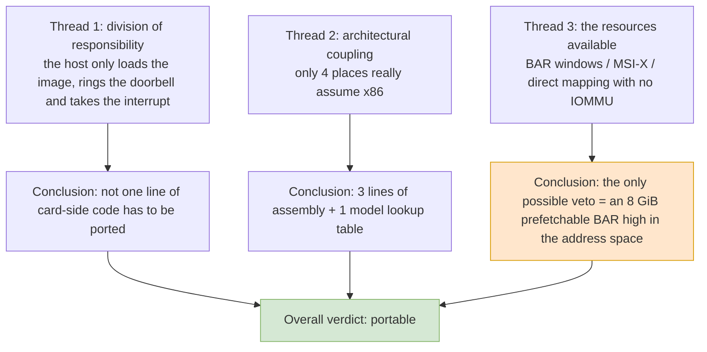

# Report Guide: Porting the Intel Xeon Phi X100 Host Driver to Loongson

> This report answers one very specific question: **can Intel's host-side driver for the Xeon Phi X100 (codename Knights Corner, "KNC" below) be compiled, and can it run, on a LoongArch Loongson host?** And if it can: which lines have to change, how many of them are there, and where will it fail silently.

The report is not appraising the driver; it is **deciding whether to start work**. So it always comes back to three things: the lines that must change, the questions that must be put to the firmware, and the numbers that must be measured on hardware.

## Document Index

This directory is `docs/` in the release tree, alongside `tests/`. The report below is the main body of it; there is also a programming manual and a set of change logs:

| Document | Contents | When to read it |
|---|---|---|
| The report below this file (12 chapters plus Appendices A–M) | Porting the Xeon Phi X100 host driver to Loongson: feasibility verdict, lines that must change, numbers that must be measured, measured results | When you want to know whether it can be done, what it costs, and how far it has already got |
| [KNC offload Programming Manual](OFFLOAD_GUIDE.md) | The *KNC Offload Programming Manual*: COI API usage and reference — interface-by-interface descriptions, data channels, threads and affinity, card-side pointer management, troubleshooting and tuning | When you are writing a card-side or host-side program, or want to look up how an API is used |
| [CHANGELOG.md](CHANGELOG.md) | Change log for the documentation subproject | When you want to know what changed in the documentation itself |
| The CHANGELOGs around the release tree | One per subproject (each package, `docs/`, `tests/`); the whole-project one is in the project root | When you want to know what changed functionally in one part |

Reading conventions: source-tree paths mentioned in the text (for example `_work/mpss-modules-3.8.6/`, `port-7.1.13/`) resolve relative to the **project root**, not to this directory. Chapters refer to each other by relative file name, so the report reads offline.

---

## Current Progress

Two defects — page size and struct layout — have been fixed and verified on hardware (see [Appendix I](I-page-size-alignment.md) I.11), and **COI process creation now works end to end**: a Loongson host can really create a process on the card, have the card side run OpenMP, and get the results back, with the checksum bit-for-bit identical to the host reference implementation (see [Appendix H](H-offload-field-notes.md) H.13). The whole acceptance suite T0–T8 has been run on real hardware ([Appendix J](J-acceptance-tests.md)).

## I. The One-Sentence Verdict

**It can be ported.** And it is far easier than expected — because **the card runs its own Linux**; the host machine merely pushes a kernel image into the card's memory and rings a doorbell. The code that is genuinely tied to "the host is x86" amounts, in the whole tree, to **3 lines of inline assembly** plus **1 place that looks up an Intel CPU model in a table**.

What will really get in your way is two other things:

| Rank | Obstacle | Nature |
|---:|---|---|
| 1 | Whether the root complex/firmware is willing to give BAR0 a 64-bit prefetchable window of **8 GiB located above 4 GiB** | **Could veto the whole project** |
| 2 | The driver is stuck on the kernel interfaces of 2.6.38–3.10 and has to be brought up to 6.x | Enumerable grind that can be driven to zero |
| 3 | Assumptions of the "no error, but broken" kind — page size, DMA mask, cache coherency | **The hardest to find**; must be measured on hardware |

---

## II. Table of Contents

The recommended reading order is simply the file numbering order. After Chapter 7 you can skip around as needed.

| File | Chapter | Contents | What to read it for |
|---|---|---|---|
| [01-background-verdict.md](01-background-verdict.md) | Chapter 1 | Why the task exists, audit scope, overall verdict | **Read this chapter first** to get the global verdict |
| [02-knc-hardware-firmware.md](02-knc-hardware-firmware.md) | Chapter 2 | KNC hardware form, BAR layout, SMPT, boot contract | Understand what the host actually does to the card |
| [03-mpss-kernel-module.md](03-mpss-kernel-module.md) | Chapter 3 | The host kernel module's 38 objects, five groups of responsibilities, 32,746 lines | See how big the scope is |
| [04-host-userspace.md](04-host-userspace.md) | Chapter 4 | 98 RPMs, user-space C code, external command dependencies | See how much work lies outside the kernel |
| [05-x86-coupling-audit.md](05-x86-coupling-audit.md) | **Chapter 5** | Item-by-item verdicts on 1,103 grep hits | **The technical core of the whole report** |
| [06-kernel-api-drift.md](06-kernel-api-drift.md) | Chapter 6 | Family-by-family list of interfaces that rotted between 3.10 and 6.x | The only basis for estimating the schedule |
| [07-loongarch-platform.md](07-loongarch-platform.md) | Chapter 7 | What Loongson can provide and what it cannot | Decide which side the risk falls on |
| [08-migration-roadmap.md](08-migration-roadmap.md) | Chapter 8 | The staged porting roadmap | Follow it when you actually start |
| [09-effort-risk.md](09-effort-risk.md) | Chapter 9 | Effort estimate and risk register | Decide whether to commit people |
| [10-alternatives.md](10-alternatives.md) | Chapter 10 | Comparison with the other routes | Confirm whether this is the best option |
| [11-verification.md](11-verification.md) | Chapter 11 | On-hardware verification checklist and pass criteria | What to measure after each stage |
| [12-conclusion.md](12-conclusion.md) | Chapter 12 | Overall conclusion and preconditions | Read this one if you read only one chapter |
| [A-interface-contracts.md](A-interface-contracts.md) | Appendix A | Seven frozen contracts | Know what must not be touched before you change code |
| [B-file-inventory.md](B-file-inventory.md) | Appendix B | Where each of the 104 `.c`/`.h` files belongs | Re-check the scope |
| [C-references.md](C-references.md) | Appendix C | Every source cited, and the commands to re-check them | Verify every number |
| [D-manual-crosscheck.md](D-manual-crosscheck.md) | Appendix D | Item-by-item cross-check of the text extracted from the User's Guide and the ISA manual | Verify "what the manual actually says", and see what the manual does not say |
| [E-porting-patches.md](E-porting-patches.md) | Appendix E | Every place the toolchain-side port actually touched, with criteria | Check against it when you do the work yourself |
| [F-coi-and-openmp.md](F-coi-and-openmp.md) | Appendix F | How to compute with the card: measured COI results, three routes, and the one that does not work | Read it first if you want to use OpenMP or offload |
| [G-card-kernel-feasibility.md](G-card-kernel-feasibility.md) | Appendix G | Feasibility, effort and risk of putting a new kernel on the card | Read before deciding whether to touch the card's kernel |
| [H-offload-field-notes.md](H-offload-field-notes.md) | Appendix H | Landing the k1om toolchain, building libgomp from source, measured OpenMP on the card | Reproduce it when you do offload / OpenMP work |
| [I-page-size-alignment.md](I-page-size-alignment.md) | Appendix I | The complete page-size alignment investigation: identifying the symptom, the dependency surface, the conversion points and five ways to fix it | Read it before touching SCIF registration or page-size-related code |
| [J-acceptance-tests.md](J-acceptance-tests.md) | Appendix J | The T0–T8 acceptance scripts, measured results on real hardware, and six field pitfalls | Run it when you want to reproduce this port yourself |
| [K-offload-memory-rules.md](K-offload-memory-rules.md) | Appendix K | User-side constraints for offload memory movement: the 512-chunks-per-window invariant, four coding rules, pre-run checks | Read before writing an offload program |
| [L-api-determinism-rules.md](L-api-determinism-rules.md) | Appendix L | Per-API determinism rules: 27 SCIF functions, six COI groups, the offload layer, plus a violation-to-symptom table | The checklist to code against |
| [M-portability-and-compatibility.md](M-portability-and-compatibility.md) | Appendix M | Portability and compatibility: the identity degeneration on 4 KiB hosts, the page-size-independent invariant, and the architecture-neutrality check | Read before reusing this on another architecture or page size |
| [N1 — Overview and results](N1-t9-gemm-optimization-overview.md) | Appendix N | **Series of eight.** Getting a real vectorised GEMM out of the k1om toolchain: 0.33 → 172–261 GFLOPS on the 7120P | **Start here** when writing or tuning any card-side compute kernel |
| [N2 — Four constraints](N2-t9-gemm-isa-constraints.md) | Appendix N | The prerequisites: no auto-vectorisation at any `-O` level, `-mavx512f` poisoning scalar FP, the ISA gaps (no `vcvtdq2ps`, no 64-bit integer vectors, no unaligned vector access, no `cmov`), and why `? :` is unusable | Read before writing a vectorised card-side program |
| [N3 — Explicit IMCI micro-kernel](N3-t9-gemm-explicit-vectorisation.md) | Appendix N | Step 1: the register-tiled `_mm512_*` micro-kernel and the disassembly it should produce. 6.39 → 57.4 GFLOPS | When your "optimised" kernel is still slow and the disassembly has no `vfmadd` |
| [N4 — Fixed parallel overhead](N4-t9-gemm-fixed-overhead.md) | Appendix N | Step 2: a ~0.15 s constant in the timings, from OpenMP team creation and `dynamic,1` contention. 57.4 → 104.1 | Before believing any card-side benchmark whose runtime is near 0.1 s |
| [N5 — B panel packing](N5-t9-gemm-b-panel-packing.md) | Appendix N | Step 3: restamping an operand into `[strip][k][NR]` so the walk is linear. 104.1 → 113.9 | When an operand is traversed with a large power-of-two stride |
| [N6 — A row-stride padding](N6-t9-gemm-row-stride-padding.md) | Appendix N | Step 4: **the biggest single win** — a power-of-two row stride aliases every row into one L1 set. 113.9 → 149.2, single core 3.0× | Whenever several rows are held open at once |
| [N7 — j-blocking and tuning](N7-t9-gemm-jblocking-and-tuning.md) | Appendix N | Step 5: reusing A across j strips, plus the sweep showing a **smaller** register tile wins. 149.2 → 260.9 | Before reasoning about tile sizes instead of measuring them |
| [N8 — Remaining headroom](N8-t9-gemm-headroom.md) | Appendix N | Where the other 90 % is: the FMA embedded-broadcast form the ISA manual documents, A packing, three-level blocking, and what not to bother with | When deciding what to do next |
| [N9 — T7 N-body overview](N9-t7-nbody-overview.md) | Appendix N | **Second sub-series.** Optimising the N-body integrator: 2.7 → 52.4 GFLOPS (19.4×), checksum still bit-exact | **Start here** for the T7 work |
| [N10 — KNC's FP64 transcendental gap](N10-t7-gemm-fp64-no-transcendentals.md) | Appendix N | No `VSQRTPD`/`VDIVPD`/`VRSQRTPD`/`VRCPPD` at all — and how to build a 1-ulp `1/sqrt(x)` from `VGETEXPPD`/`VGETMANTPD` + a degree-5 minimax + two Newton steps | Before writing any FP64 math on KNC |
| [N11 — Two units, three traps](N11-t7-two-units-and-three-traps.md) | Appendix N | The `-O0` + `-O2 -mavx512f` two-translation-unit architecture, plus three faults only the card's kernel log revealed: `calloc` alignment vs `vmovapd`, **`VCMPPD`'s 3-bit predicate vs GCC's 5-bit encoding**, and the `vpackstorelpd` disp8*N form | When your vectorised card-side program dies with no message |
| [N12 — T7 remaining headroom](N12-t7-nbody-headroom.md) | Appendix N | Where the other 95 % is: 41 instructions taking 230 cycles — measuring an in-order core's serial-latency wall, and i-unrolling as the fix | When a vectorised loop is much slower than its instruction count predicts |
| [N13 — What the tests actually verify](N13-t7-verification.md) | Appendix N | **Deleting the gravitational force entirely left every existing check green.** Why the checksum could not see it, and the three-layer verification (rsqrt sweep, 64-body force kernel vs scalar libm, all-tier reference) that replaced it | **Before trusting any numerical check on this target** |
| [N14 — N-body algorithm design](N14-nbody-algorithm-design.md) | Appendix N | **The design specification**, consolidating T7: requirements, algorithm, numerical design (the constructed 1/√x), architecture constraints, kernel and software structure, verification design, performance, and every rejected alternative | **To re-implement or port the N-body kernel** |

Chinese versions of the N series: append `_CN` to any filename above.

---

## III. The Three Main Threads

The whole report's argument hangs on these three threads:



**Thread 1** explains why this is **not as big as it looks**: the card carries its own operating system, and of the 7 card-side directories that `Kbuild:56`–`:57` pulls in with `obj-$(CONFIG_X86_MICPCI)`, 24 files and 20,232 lines never enter the host module (`ras/` 13, `vcons/` 2, `pm_scif/` 2, `virtio/` 1, `mpssboot/` 1 and `ramoops/` 1 are whole directories, plus `micscif/micscif_main.c`, `dma/mic_sbox_md.c`, `vnet/micveth.c` and `vnet/mic.h`); add `trace_capture/`, which no `obj-` line references at all and which accounts for a further 5 files and 2,797 lines — and the total comes to 29 files and 23,029 lines that never get compiled on the host. Appendix B nails down where every file belongs.

**Thread 2** is the whole of Chapter 5. It has exactly one method: **replace an assumption with its real-world value and see whether behaviour changes.** If it does not change, it is not coupling — not even if the variable is named `x86_something`.

**Thread 3** is the whole of Chapter 7. Its conclusions come with an explicit boundary: every "Loongson can provide this" judgement in the report carries a source; anything with no upstream source behind it is written up under "not verified" rather than as a conclusion.

---

## IV. Typographic Conventions

So that the same Markdown reads well in an editor and renders in a browser, the whole report follows the conventions below:

| Convention | Practice | Why |
|---|---|---|
| Paragraph indentation | The Chinese original opens paragraphs with **two ideographic spaces** (U+3000); this English edition uses ordinary Markdown paragraphs | Standard practice in written Chinese |
| Diagrams | always a ```mermaid code block, `flowchart` syntax | easy to view directly in any mermaid-aware renderer |
| Formulas | always MathJax: `$...$` inline, `$$...$$` on a line of its own | renders directly |
| Tables | always standard Markdown tables, no HTML | keeps the plain text readable |
| File names | ASCII (`01-background-verdict.md`) | cross-platform, no escaping needed |
| Portable paths | no absolute or home-anchored paths anywhere in the text: source-tree references are written relative to the project root, and a command that needs an absolute one uses `${PROJ}` for the project root | a reader who clones the tree somewhere else must be able to follow every path in the report |
| Local detail | nothing that is only true of the machine the work was done on: no account names, no site addresses, no session timestamps, no transient build directories. Deployment-specific names appear as `<user>`, `<host-ip>`, `<card-ip>` | the report has to be checkable from the sources it cites, not from one particular installation |
| Headings | Chinese in the original edition, English in this one (`# 第一章 …` becomes `# Chapter 1 — …`) | reading experience |
| Identifiers | always kept as-is: `mic.ko`, `DLDR_APT_BAR`, `pci_set_dma_mask()` | never paraphrase them, or they cannot be matched against the source |
| Capacity units | capacities and windows always use binary (1024-based) prefixes: the `8 GiB` card memory window, the `128 KiB` register window (the User's Guide writes `size=200000000`, which is 8 GiB, not 8 decimal GB) | separates them from the manual's decimal `GB`, so that 8 GiB is not read as 8 GB |
| Page-size units | page sizes and the constants derived from them are written `KB`/`MB`: `4 KB page`, `16 KB page`, `512 KB`, `CONFIG_PAGE_SIZE_4KB` | matches the kernel's own configuration names, so they can be checked directly against `CONFIG_PAGE_SIZE_*` |
| Upstream citations | always prefixed with the release number: `v6.6/arch/loongarch/Kconfig:479`; MPSS source uses the real top-level directory in the tree: `host/linux.c:301` | tells at a glance which upstream release and which local tree; both kinds of citation can be checked line by line |
| Math and machine literals | inside a math environment, hexadecimal and binary constants, register names and instruction mnemonics are always monospaced — `\mathtt{…}` for values, `\texttt{…}` for register names — never bare, and **never** `\text{}`. Hex digits are upper case, written at their true width: no zero padding, no truncation | the whole point of the notation is that a literal can be read off into an assembler; `\text{}` renders it proportionally and bare text is indistinguishable from a variable |
| Escapes inside math | no `\_` anywhere in a math environment; underscores in identifiers are handled by wrapping the identifier in `\texttt{}` instead | `\_` is a text-mode escape and reads as noise in the rendered formula |

Terminology always uses native Chinese vocabulary rather than stiff translated words — 「**门铃寄存器**」, not a Chinese transliteration of "doorbell"; 「**散聚表**」, not a literal calque of "scatter-gather". In English these come out plainly as the *doorbell register* and the *scatter-gather list*.

Only the following keep their English form, because they are **identifiers in the code or established industry abbreviations**: MMIO, BAR, MSI-X, IOMMU, sysfs, ioctl, kernfs, PCIe, DMA, SMPT, SBOX, DBOX, GTT, K1OM, KNC.

---

## V. Glossary

The table below maps the terms used in the report to the identifiers found in the source code. Where anything is ambiguous, this table wins.

| Term used in the report | Form in the source/material | Meaning |
|---|---|---|
| Card memory window | aperture, `DLDR_APT_BAR` (BAR0) | the card's 8 GiB of GDDR as the host sees it |
| Card register window | `DLDR_MMIO_BAR` (BAR4) | 128 KiB, containing DBOX + SBOX + GTT |
| Host-sees-card window | `mic_ctx->aper` | the mapping of that 8 GiB window above |
| Card-sees-host window | P2P aperture / `mic_ctx->mmio` | the window through which the card looks back at host memory |
| Doorbell register | SBOX `SBOX_APICICR7` (`0xAA08`) | the host rings it, the card takes an interrupt |
| Scratch box | SBOX (Scratch Box) | where host and firmware exchange state |
| Direct mapping | direct mapping / DMA direct | with no IOMMU, the device reaches physical addresses directly |
| Bounce buffer | bounce buffer | staging memory used when the device's address width falls short |
| Write-combining | write-combining, `ioremap_wc()` | the cache attribute the host uses when mapping card memory |
| Ring buffer | ring buffer, `micscif_rb` | SCIF's doorbell queue |
| Scatter-gather list | scatter-gather list, `pci_map_sg` | maps several physical pages in one go |
| Card | the card / MIC | this Phi card itself |
| Host | host | the Loongson side |

---

## VI. How to Re-check Every Number in This Report

None of the numbers in the report are estimates; they were counted out of the pristine `_work/mpss-modules-3.8.6/` tree. Section B.5 of Appendix B gives five commands: the first three reproduce the two core numbers, 38 objects and 32,746 lines; the fourth gives the full accounting of the 104 `.c`/`.h` files; and the fifth (run under `_work/`) re-checks the 152,913 lines of Chapter 4's six user-space archives.

Sources of the other key numbers:

| Number | Meaning | Chapter | Source |
|---:|---|---|---|
| 1,103 | total x86-related grep hits | Chapter 5 | the table in Chapter 5 §5.2 |
| 32,746 | total lines of C in the host module (38 files) | Chapter 3, Appendix B | `Kbuild:62`–`:99` |
| 23,029 | total lines of the 29 files never compiled on the host (of which 5 files and 2,797 lines are dead code) | Appendix B | `Kbuild:56`–`:57`, `:62`–`:99`; the fourth command in B.5 settles the whole account at once |
| 8 GiB | the PCIe-declared size of BAR0 | Chapter 2 | the `lspci` transcript in the User's Guide |
| 65,811 | lines in the tree's 104 `.c`/`.h` files (a further 20 build and metadata files, 934 lines, are not counted) | Appendix B | the fourth command in B.5 settles it in one go |
| 265 | lines matching `PAGE_SIZE`/`PAGE_SHIFT` on host paths, spread over 29 files | Chapter 5 §5.5 | the counting rules stated in that section; reproducible with the same regex |
| 86 | kernel-interface lines verified one by one: 64 purely mechanical replacements, 22 requiring semantic handling | Chapter 6 §6.8 | the counting table in Chapter 6 §6.8 |
| 8,525 / 11,751 | lines in Scope A / Scope B (Scope C is the full 32,746) | Chapter 10 §10.1 | the grouping in Chapter 3 plus the sum in Chapter 10 §10.1 |
| 12–24 / 15–30 / 23–45 | person-day ranges for Scope A / Scope B / Scope C | Chapter 9 §9.4 | the edit volume from Chapter 6 §6.8 plus the construction work of Chapters 8 and 9 |
| 152,913 | lines of user-space code with source | Chapter 4 §4.2 | recomputable with the fifth command in Appendix B §B.5 |

---

## VII. Boundaries of Evidence

The report holds itself to one rule: **any judgement that could not be traced to a source in the code or in the primary material is marked "not verified" rather than written as a conclusion.**

Therefore:

1. **The authoritative parts of the report are Chapter 5 and Appendices A and B** — they rest entirely on the source code and can be checked line by line.
2. **Chapter 2 and the hardware parts of Chapter 7 come second in authority** — they rest on the `lspci` transcript in the *MPSS User's Guide* and on the Linux mainline source: all 24 mentions of PCIe in the User's Guide are statements about the card's location, P2P communication, and link width/speed (the passage at `:1503`–`:1506` is the Width / Speed / Max payload / Max read req block of the `lspci` transcript), and **not one of them touches PCIe enumeration or BAR allocation**, so the BAR size can only be derived from that transcript plus the registers described in Chapter 2 (Appendix D §D.4 lists everything this manual leaves blank at the hardware level).
3. **Everything that needs a real board to settle** (the real BAR size, the MMIO window the firmware hands out, whether MSI-X really gets allocated, whether a write-combining mapping degrades to strong ordering) is listed in Chapter 7's "not verified" section, with measuring methods in Chapter 11.

In other words: the report tells you **which lines to change** (this part is settled) and **which numbers to measure** (this part takes real hardware).
