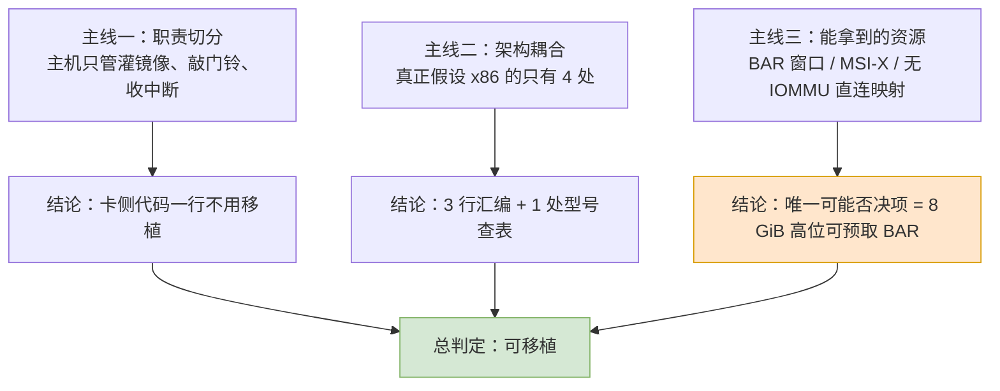

# 报告导读：把 Intel Xeon Phi X100 的主机驱动搬到龙芯

> 　这份报告要回答的是一个很具体的问题：**Intel 那套给 Xeon Phi X100（代号 Knights Corner，下称 KNC）用的主机端驱动，能不能编译、能不能跑在 LoongArch 的龙芯主机上？**如果能，要改哪些行、有多少行、哪里会一声不响地出错。

　　报告不是在「评价」这份驱动，而是在**决定要不要动手**。因此全篇的落脚点始终是三样东西：必改的行、必问的固件、必须上机量的数。

## 文档索引

　　本目录是发布树的 `docs/`，与 `tests/` 并列；下面这份报告是其中的主体，另有一份编程手册与一组变更记录：

| 文档 | 内容 | 什么时候读 |
|---|---|---|
| 本文件以下的报告（12 章 ＋ 附录 A–M） | 把 Xeon Phi X100 的主机驱动搬到龙芯：可行性判定、要改的行、要量的数、实测结果 | 想弄清「能不能做、代价多大、已经做到哪一步」 |
| [OFFLOAD_GUIDE_CN.md](OFFLOAD_GUIDE_CN.md) | 《KNC offload 编程手册》：COI API 用法与参考 —— 逐条接口说明、数据通道、线程与亲和性、卡端指针管理、排错与调优 | 要写卡端／宿主程序，或想查某个 API 怎么用 |
| [CHANGELOG_CN.md](CHANGELOG_CN.md) | 文档子项目的变更记录（英文版 [CHANGELOG.md](CHANGELOG.md)） | 想知道文档本身改了什么 |
| 发布树各处的 CHANGELOG | 每个子项目（各包、`docs/`、`tests/`）各一份；总项目的在项目根 `CHANGELOG_CN.md`／`CHANGELOG.md` | 想知道某一部分的功能更新 |

　　阅读约定：正文里提到的源码树路径（例如 `_work/mpss-modules-3.8.6/`、`port-7.1.13/`）都相对**项目根**解析，不是相对本目录；报告各章之间用相对文件名互相引用，可离线阅读。

---

## 当前进展

　　页大小与结构体布局两条缺陷已修复并经实测验证（详见[附录 I](I-page-size-alignment_CN.md) I.11），**COI 的进程创建也已打通**：龙芯宿主能真的在卡上建进程、让卡端跑 OpenMP 并把结果取回来，校验和与宿主参考实现逐位一致（详见[附录 H](H-offload-field-notes_CN.md) H.13）。整套验收脚本 T0–T8 已在真机上执行（[附录 J](J-acceptance-tests_CN.md)）。

## 一　一句话结论

　　**能移植。**而且比预想的容易得多——因为**卡上跑的是它自己的 Linux**，主机只是往卡的显存里灌一个内核镜像、再敲一下门铃。真正与「主机是 x86」绑定的代码，全树只有 **3 行内联汇编**加 **1 处用 Intel CPU 型号查表的逻辑**。

　　真正会挡住你的是另外两件事：

| 排序 | 障碍 | 性质 |
|---:|---|---|
| 1 | 主桥／固件愿不愿意给 BAR0 分配 **8 GiB 且位于 4 GiB 以上**的 64 位可预取窗口 | **可能否决整件事** |
| 2 | 驱动停留在 2.6.38–3.10 的内核接口上，要补齐到 6.x | 可枚举、可清零的苦工 |
| 3 | 页大小、DMA 掩码、缓存一致性这类「不报错但会坏」的假设 | **最难发现**，必须上机量 |

---

## 二　目录

　　阅读顺序建议就是文件编号顺序。第七章之后可以按需跳读。

| 文件 | 章 | 内容 | 读它干什么 |
|---|---|---|---|
| [01-background-verdict_CN.md](01-background-verdict_CN.md) | 第一章 | 任务由来、审计范围、总判定 | **先读这章**，拿到全局结论 |
| [02-knc-hardware-firmware_CN.md](02-knc-hardware-firmware_CN.md) | 第二章 | KNC 的硬件形态、BAR 划分、SMPT、引导契约 | 理解「主机到底对卡做了什么」 |
| [03-mpss-kernel-module_CN.md](03-mpss-kernel-module_CN.md) | 第三章 | 主机内核模块的 38 个对象、五组职责、32,746 行 | 知道射程有多大 |
| [04-host-userspace_CN.md](04-host-userspace_CN.md) | 第四章 | 98 个 RPM、用户态 C 代码、外部命令依赖 | 知道内核之外还有多少活 |
| [05-x86-coupling-audit_CN.md](05-x86-coupling-audit_CN.md) | **第五章** | 1,103 处 grep 命中逐条判定 | **全报告的技术核心** |
| [06-kernel-api-drift_CN.md](06-kernel-api-drift_CN.md) | 第六章 | 接口从 3.10 烂到 6.x 的逐族清单 | 估工期的唯一依据 |
| [07-loongarch-platform_CN.md](07-loongarch-platform_CN.md) | 第七章 | 龙芯给得出什么、给不出什么 | 判断风险落在哪一侧 |
| [08-migration-roadmap_CN.md](08-migration-roadmap_CN.md) | 第八章 | 分阶段的移植路线 | 真动手时照着做 |
| [09-effort-risk_CN.md](09-effort-risk_CN.md) | 第九章 | 工作量估算与风险登记 | 决定投不投人 |
| [10-alternatives_CN.md](10-alternatives_CN.md) | 第十章 | 与其它几条路的比较 | 确认这是不是最优解 |
| [11-verification_CN.md](11-verification_CN.md) | 第十一章 | 上机验证清单与通过判据 | 每一阶段做完要量什么 |
| [12-conclusion_CN.md](12-conclusion_CN.md) | 第十二章 | 总结论与前置条件 | 只读一章的话读这个 |
| [A-interface-contracts_CN.md](A-interface-contracts_CN.md) | 附录 A | 七条冻结契约 | 改代码前必须知道哪些不能碰 |
| [B-file-inventory_CN.md](B-file-inventory_CN.md) | 附录 B | 104 个 `.c`／`.h` 逐一归属 | 复核射程 |
| [C-references_CN.md](C-references_CN.md) | 附录 C | 全部引用出处与复核命令 | 核对每一个数字 |
| [D-manual-crosscheck_CN.md](D-manual-crosscheck_CN.md) | 附录 D | 用户指南与 ISA 手册抽取文本的逐条对表 | 核对「手册原话」，也看手册没写什么 |
| [E-porting-patches_CN.md](E-porting-patches_CN.md) | 附录 E | 工具端移植实际动过的每一处与判据 | 自己动手时照着核对 |
| [F-coi-and-openmp_CN.md](F-coi-and-openmp_CN.md) | 附录 F | 卡怎么用来算东西：COI 实测、三条路线与走不通的那条 | 想用 OpenMP 或 offload 时先读它 |
| [G-card-kernel-feasibility_CN.md](G-card-kernel-feasibility_CN.md) | 附录 G | 给卡换新内核的可行性、工作量与风险 | 决定要不要动卡内核之前读 |
| [H-offload-field-notes_CN.md](H-offload-field-notes_CN.md) | 附录 H | k1om 工具链落地、自建 libgomp、卡上 OpenMP 实测 | 动手做 offload / OpenMP 时照它复现 |
| [I-page-size-alignment_CN.md](I-page-size-alignment_CN.md) | 附录 I | 页大小对齐的完整调查：现象判别、依赖面、换算点与五种修法 | 要动 SCIF 注册或页大小相关代码前先读它 |
| [J-acceptance-tests_CN.md](J-acceptance-tests_CN.md) | 附录 J | T0–T8 验收脚本、真机实测结果与六条实测坑 | 想自己复核这次移植时照着跑 |
| [K-offload-memory-rules_CN.md](K-offload-memory-rules_CN.md) | 附录 K | Offload 内存搬运的用户侧约束：窗口段数 ≤ 512 的不变量、四条编写约束、运行前自查 | 写 offload 程序前必读 |
| [L-api-determinism-rules_CN.md](L-api-determinism-rules_CN.md) | 附录 L | 逐 API 的确定性编写规范：SCIF 27 个函数、COI 六大组、offload 层，含违规→现象对照 | 写 offload / SCIF 程序时的对照表 |
| [M-portability-and-compatibility_CN.md](M-portability-and-compatibility_CN.md) | 附录 M | 可移植性与相容性：4 KiB 宿主下换算退化为恒等的证明、各页大小通用性的不变量、架构无关性核查 | 想在其他架构／页大小上复用时先读 |

---

## 三　三条主线

　　全报告的论证都挂在这三条线上：



　　**主线一**说明为什么这件事**没有想象中大**：卡上自带操作系统，`Kbuild:56`–`:57` 用 `obj-$(CONFIG_X86_MICPCI)` 挂上的 7 个卡侧目录里，有 24 个文件、20,232 行从来不进主机模块（`ras/` 13、`vcons/` 2、`pm_scif/` 2、`virtio/` 1、`mpssboot/` 1、`ramoops/` 1 是整目录，另有 `micscif/micscif_main.c`、`dma/mic_sbox_md.c`、`vnet/micveth.c` 与 `vnet/mic.h`）；再加上任何 `obj-` 行都不引用的 `trace_capture/` 5 个文件、2,797 行，一共 29 个文件、23,029 行在主机上恒不编译。附录 B 把每个文件的归属钉死了。

　　**主线二**是第五章的全部内容。它的方法论只有一条：**把假设替换成现实取值，看行为会不会变。**不会变的，哪怕变量名叫 `x86_something`，也不算耦合。

　　**主线三**是第七章的全部内容。它的结论带着明确的边界：报告里每一个「龙芯给得出」的判断，都标了出处；凡是没有上游源码依据的，都写进「未能核实」而不是写成结论。

---

## 四　排版约定

　　为了让同一份 Markdown 既能在编辑器里读、又能在浏览器里渲染，全报告遵守下面的写法：

| 约定 | 具体做法 | 为什么 |
|---|---|---|
| 段落缩进 | 自然段开头用**两个全角空格**（U+3000　　） | 中文书面排版的通行做法 |
| 流程图 | 一律用 ```mermaid 代码块，`flowchart` 语法 | 便于直接在支持 mermaid 的渲染器里看 |
| 公式 | 一律用 MathJax：行内 `$...$`，行间独占一行的 `$$...$$` | 便于直接渲染 |
| 表格 | 全部用标准 Markdown 表格，不加 HTML | 保证纯文本可读 |
| 文件名 | ASCII（`01-background-verdict_CN.md`） | 跨平台、免转义 |
| 标题 | 中文（`# 第一章　…`） | 阅读体验 |
| 标识符 | 全部保留原样：`mic.ko`、`DLDR_APT_BAR`、`pci_set_dma_mask()` | 不得意译，否则无法与源码对照 |
| 容量单位 | 容量与窗口一律用 1024 进制前缀：`8 GiB` 卡存窗口、`128 KiB` 寄存器窗口（用户指南原文写 `size=200000000`，那是 8 GiB，不是十进制 8 GB） | 与手册里十进制 `GB` 的说法区分开，避免把 8 GiB 读成 8 GB |
| 页大小单位 | 页大小及其派生常量写成 `KB`／`MB`：`4 KB 页`、`16 KB 页`、`512 KB`、`CONFIG_PAGE_SIZE_4KB` | 与内核自己的配置名同名，便于直接对照 `CONFIG_PAGE_SIZE_*` 核对 |
| 上游引用 | 一律带发布号前缀：`v6.6/arch/loongarch/Kconfig:479`；MPSS 源码用树内真实顶层目录：`host/linux.c:301` | 一眼分清「上游哪一版」与「本地哪棵树」，两类引用都能逐行复核 |

　　术语一律使用原生中文词汇，不用生硬的翻译词。例如用「**门铃寄存器**」而不是「doorbell 的中文音译」，用「**散聚表**」而不是「scatter-gather 直译」。

　　保留英文原样的只有以下几类，因为它们本身就是**代码里的标识符或业界固定缩写**：MMIO、BAR、MSI-X、IOMMU、sysfs、ioctl、kernfs、PCIe、DMA、SMPT、SBOX、DBOX、GTT、K1OM、KNC。

---

## 五　术语对照

　　报告里的中文词与源码标识符对应关系如下。凡遇歧义，以本表为准。

| 报告用词 | 源码/资料里的写法 | 含义 |
|---|---|---|
| 卡存窗口 | aperture，`DLDR_APT_BAR`（BAR0） | 主机看到的卡上 8 GiB GDDR |
| 卡寄存器窗口 | `DLDR_MMIO_BAR`（BAR4） | 128 KiB，内含 DBOX+SBOX+GTT |
| 主机看卡窗口 | `mic_ctx->aper` | 上面那个 8 GiB 的映射 |
| 卡看主机窗口 | P2P aperture / `mic_ctx->mmio` | 卡反向看主机内存的窗口 |
| 门铃寄存器 | SBOX `SBOX_APICICR7`（`0xAA08`） | 主机敲它，卡收中断 |
| 检修寄存器组 | SBOX（Scratch Box） | 主机与固件交换状态的地方 |
| 直连映射 | direct mapping / DMA direct | 无 IOMMU 时设备直接访问物理地址 |
| 反弹缓冲 | bounce buffer | 设备地址位宽不够时的中转内存 |
| 写合并 | write-combining，`ioremap_wc()` | 主机映射卡存时用的缓存属性 |
| 环形缓冲 | ring buffer，`micscif_rb` | SCIF 的门铃队列 |
| 散聚表 | scatter-gather list，`pci_map_sg` | 一次映射多个物理页 |
| 卡 | the card / MIC | 这张 Phi 卡本身 |
| 主机 | host | 龙芯这边 |

---

## 六　报告里的每个数字怎么复核

　　全报告的数字都不是估计，而是从 `_work/mpss-modules-3.8.6/` 这棵原始树里数出来的。附录 B 的 B.5 节给出五条命令，前三步复现 38 个对象与 32,746 行这两个核心数字，第四步给出 104 个 `.c`／`.h` 的完整分账，第五步（在 `_work/` 下执行）复核第四章六个用户态归档的 152,913 行。

　　其它关键数字的出处：

| 数字 | 含义 | 在哪一章 | 出处 |
|---:|---|---|---|
| 1,103 | x86 相关 grep 总命中 | 第五章 | 五章 5.2 表 |
| 32,746 | 主机模块 C 代码总行数（38 文件） | 第三章、附录 B | `Kbuild:62`–`:99` |
| 23,029 | 主机上恒不编译的 29 个文件的总行数（其中 5 个文件、2,797 行是死代码） | 附录 B | `Kbuild:56`–`:57`、`:62`–`:99`，B.5 第四条可一次分完账 |
| 8 GiB | BAR0 的 PCIe 申报尺寸 | 第二章 | 用户指南 `lspci` 抄本 |
| 65,811 | 整棵树 104 个 `.c`／`.h` 的行数（另有 20 个构建与元数据文件、934 行，不计） | 附录 B | B.5 第四条一次分完账 |
| 265 | 主机路径上 `PAGE_SIZE`／`PAGE_SHIFT` 的命中行数，散布 29 个文件 | 第五章 §5.5 | 该节的口径说明，按同一正则可复现 |
| 86 | 已逐行核实的内核接口改动行数：64 行纯机械替换、22 行要按语义处理 | 第六章 §6.8 | 六章 6.8 的计数表 |
| 8,525 / 11,751 | 射程甲／射程乙的行数（射程丙即全量 32,746） | 第十章 §10.1 | 第三章的分组 + 十章 10.1 的求和 |
| 12–24 / 15–30 / 23–45 | 射程甲／射程乙／射程丙对应的人日区间 | 第九章 §9.4 | 六章 §6.8 的编辑量 + 第八、九章的施工内容 |
| 152,913 | 有源码的用户态代码行数 | 第四章 §4.2 | 附录 B 的 §B.5 第五条可复算 |

---

## 七　证据边界

　　这份报告有一条自我约束：**凡是没能在源码或原始资料里找到出处的判断，一律标注「未能核实」，不写成结论。**

　　因此：

1. **报告的权威部分是第五章与附录 A、B**——它们完全建立在源码之上，可以逐行复核。
2. **第二章与第七章的硬件部分权威性次之**——它们建立在《MPSS 用户指南》的 `lspci` 抄本和 Linux 主线源码之上：用户指南里 24 处 PCIe 字样都是卡的定位、P2P 通信与链路宽度／速率的叙述（`:1503`–`:1506` 那段是 `lspci` 抄本的 Width／Speed／Max payload／Max read req），**没有一处涉及 PCIe 枚举或 BAR 分配**，所以 BAR 尺寸只能靠那份抄本加第二章的寄存器推算（附录 D §D.4 列出了这份手册在硬件层面的全部空白）。
3. **凡是需要真实板子才能确定的**（真实的 BAR 尺寸、固件给出的 MMIO 窗口、MSI-X 是否真的分配得到、写合并映射会不会退化成强序），都在第七章的「未能核实」一节里列了出来，并在第十一章给出了测量方法。

　　换言之：报告告诉你**要改哪些行**（这部分是确定的），以及**要量哪些数**（这部分必须上机）。
